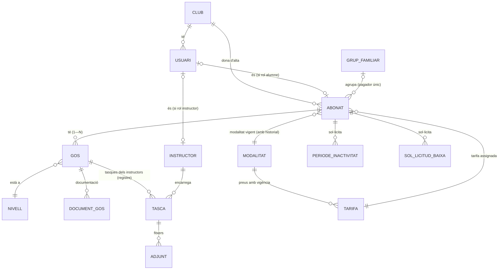
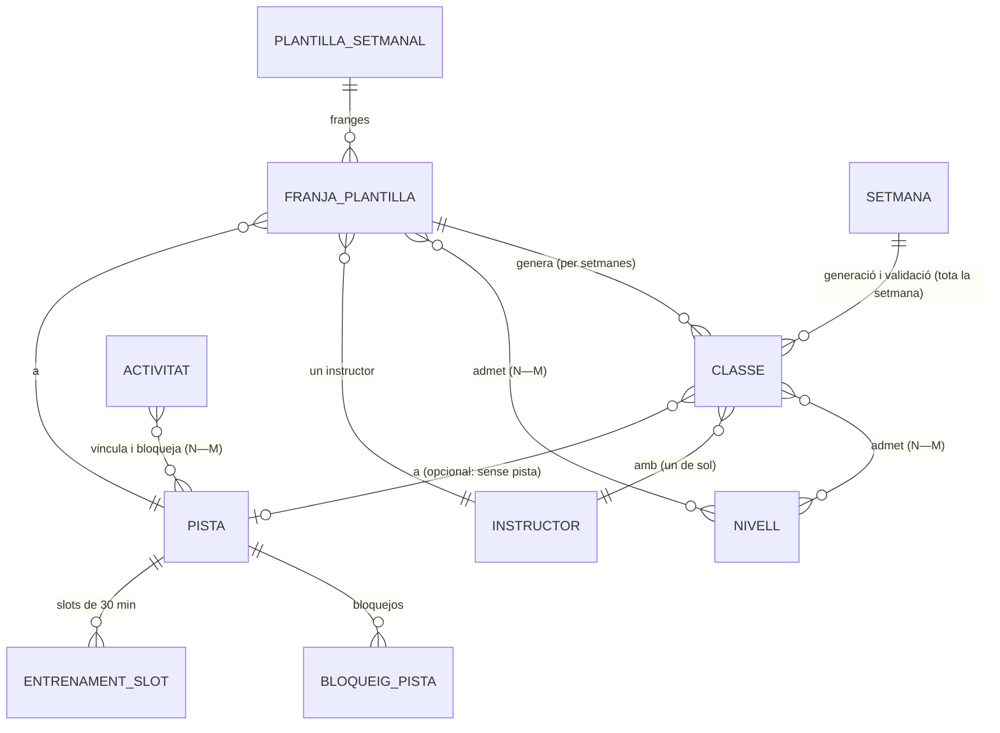
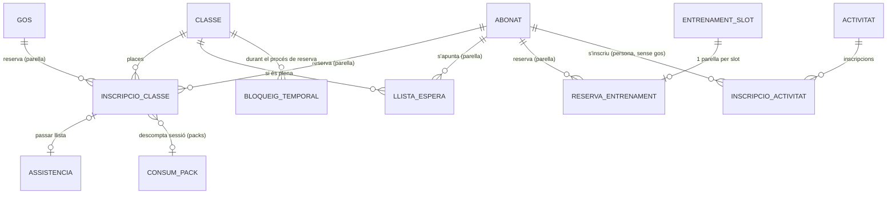
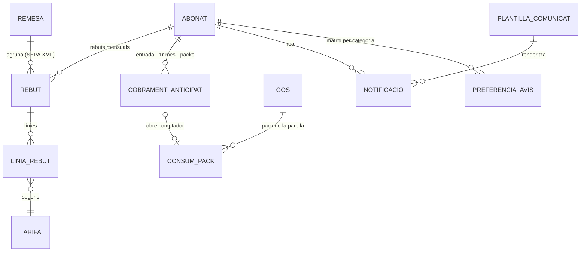

# Model de dades — SAAS AgilityCanic

**Versió 1.6 · 28-08-2026** — elaborat a partir de l'especificació v1.6 (§2, E1–E20), les revisions del Josep (08–11/08 · 13-08 · 17/18-08 · 19/20-08 · **23-08 mòbil** · **18-08 escriptori, reenviada el 25-08** · **27/28-08 comentaris sobre la V7 mòbil i la V6 escriptori**) i les decisions Jordi–IA de l'11, 14, 19, 21, 24, 26 **i 28-08**. Correspon als mockups finals **V8 mòbil** i **V7 escriptori**. És el document de referència per entendre com s'estructura tot; els ADRs de la fase 3 en sortiran d'aquí.

**Com llegir-lo:** el model s'explica en 4 dominis (Persones · Camp i planificació · Reserves i assistència · Facturació i comunicació). Cada domini té un diagrama entitat–relació i, a continuació, la llista de taules amb els seus atributs. `1—N` vol dir «un … té molts …»; `N—M` és una relació molts-a-molts (taula intermèdia). Els camps **(P)** apareixen al formulari públic d'alta. Les novetats de la revisió 11-08 van marcades amb **[R11-08]**; les de la 2a repassada mòbil i decisions del 14-08, amb **[R13-08]**; les de la **repassada final** (17/18-08) i decisions del 19-08, amb **[R18-08]**; els retocs del 19/20-08, amb **[R20-08]**; les decisions del 21-08 (4a passada), amb **[R21-08]**; la 5a repassada mòbil del Josep (23-08) i les decisions del 24-08, amb **[R24-08]**; la **repassada completa d'escriptori** del Josep (18-08, aplicada el 26-08) i les decisions del 26-08, amb **[R26-08]**; els **comentaris del Josep sobre la V7 mòbil i la V6 escriptori** (27/28-08) i les decisions del 28-08, amb **[R28-08]**. Una regla marcada com a ~~ratllada~~ ha quedat superada per una revisió posterior.

---

## 0. Visió ràpida

| Domini | Taules principals |
|---|---|
| A · Persones i modalitats | CLUB · USUARI · ABONAT · GRUP_FAMILIAR · GOS · DOCUMENT_GOS · TASCA · ADJUNT · NIVELL · MODALITAT · TARIFA · PERIODE_INACTIVITAT · SOL_LICITUD_BAIXA |
| B · Camp i planificació | PISTA · INSTRUCTOR · PLANTILLA_SETMANAL · FRANJA_PLANTILLA · SETMANA · CLASSE · ENTRENAMENT_SLOT · BLOQUEIG_PISTA · ACTIVITAT |
| C · Reserves i assistència | INSCRIPCIO_CLASSE · ASSISTENCIA · LLISTA_ESPERA · RESERVA_ENTRENAMENT · BLOQUEIG_TEMPORAL · INSCRIPCIO_ACTIVITAT |
| D · Facturació i comunicació | REBUT · LINIA_REBUT · REMESA · COBRAMENT_ANTICIPAT · CONSUM_PACK · PLANTILLA_COMUNICAT · NOTIFICACIO · PREFERENCIA_AVIS · VISTA_LLISTAT · FAQ · PARAMETRE · AUDITORIA |

Idea central (la gran diferència amb Playoff): **el GOS és una entitat de primer nivell** i gairebé tot funciona per **parella** (abonat + gos): les inscripcions a classes, les reserves, els límits setmanals, la llista d'espera, el pack i la fitxa que veu l'instructor. L'excepció són les **activitats**, que queden vinculades a la persona (sense gos) **[R13-08]**. «Parella» és el terme del model: a la interfície **no es diu mai** — es parla de l'alumne i el seu gos **[R24-08]**.

---

## A · Persones i modalitats

### CLUB *(multi-tenant preparat, RF-ADM-08)*
| Atribut | Notes |
|---|---|
| id, nom, NIF, adreça, contacte | Club Agility Cànic (V1 només un club; el model ja n'admet més — AgilityHub) |
| logo, colors | identitat per club |
| dades SEPA del creditor | identificador, IBAN d'abonament, sufix **[R11-08]** — dades fixes de la remesa |
| sèrie i numeració de rebuts | configurable |

### USUARI *(E17)*
| Atribut | Notes |
|---|---|
| email (login), contrasenya (hash) | la contrasenya és **opcional** **[R13-08]**: l'enllaç màgic sempre permet entrar; es pot establir i **canviar des de dins l'app** (amb la sessió iniciada, sense correu) |
| token d'enllaç màgic + caducitat | «entra sense contrasenya» (Q-06): correu d'un sol ús; la sessió queda iniciada |
| **sessió persistent** | **[R13-08]** mínim **30 dies** i s'estén amb cada ús (caducitat lliscant, paràmetre): només cal tornar a identificar-se en un dispositiu nou o després de 30 dies sense entrar |
| rols (n) | alumne / instructor / admin — un compte pot tenir-ne més d'un · **es defineixen a la fitxa d'abonat del backoffice (D10) [R20-08]** · les relacions d'**instructors** i d'**administradors** es mantenen a Configuració → **Instructors i administradors** (D17, dos blocs) **[R26-08]**: l'administrador té abonat del cens, nom curt, data des de quan i actiu |
| **perfil per defecte** | **[R24-08]** instructors i administradors entren amb el **mateix correu** que com a alumnes: en entrar trien el perfil (pantalla 03b) i el sistema **recorda l'última tria** per al següent accés; es pot canviar des del perfil (12) · ~~(*) el Josep pregunta si el mòbil podria tenir dos o tres punts d'accés separats~~ → **resolt [R28-08]**: «la nova pantalla 03b per triar perfil ens sembla perfecta» (Josep) |
| FK abonat · FK instructor | segons rols |
| idioma | CA / ES — el selector és a l'app però **desactivat fins que hi hagi les pantalles i textos en castellà** **[R18-08]**; els comunicats surten en l'idioma de la plantilla |
| estat, últim accés | |

### ABONAT *(E1)*
| Atribut | Notes |
|---|---|
| número d'abonat | únic, mai es reassigna |
| DNI/NIE **(P)** — o **passaport** si no se'n té **(P)** —, nom i cognoms **(P)**, **gènere** **(P)**, data naixement **(P)** | document únic al sistema · el passaport **només es demana si el DNI/NIE no s'informa**; el DNI/NIE es **valida formalment [R20-08]** · **gènere** (abans «sexe») amb opcions **Masculí · Femení · Altres/No binari [R24-08]**; adapta els textos («Benvinguda…»; no binari → masculí) |
| emails (fins a **2**) **(P)** · telèfons (fins a **2**, amb **descripció** i **prefix**, +34 per defecte) **(P)** | **[R18-08]** les comunicacions s'envien a tots els emails; un **SMS s'envia a tots dos telèfons** · validacions **[R20-08]**: format d'email i telèfon de **9 posicions** · enllaç **wa.me** al backoffice |
| adreça **per camps** **(P)** | **[R18-08]** carrer i número · CP · població — la **població es proposa a partir del CP** (llista si n'hi ha més d'una) **[R20-08]** |
| forma de pagament **(P)** | domiciliació / efectiu — l'efectiu es fa per **semestres naturals complets** **[R13-08]** · **[R28-08]** si és domiciliació i el compte **no s'ha informat**, el backoffice mostra l'avís vermell **«Compte no informat»** (D1, D2) |
| IBAN + titular (+ NIF titular) **(P)** | canvi **només per l'admin** (Q-05); es mostra sempre emmascarat amb el **bloc final** («···· 2231») **[R18-08]** · **validació formal de l'IBAN [R20-08]** · el formulari mostra el **mandat SEPA** (llei 16/2009) sota la domiciliació |
| **data del proper rebut** | **[R11-08]** obligatòria en validar l'alta; la remesa la fa avançar al dia 1 del mes següent |
| consentiments versionats | **[R24-08 → R26-08]** dos consentiments a l'alta: **política de privacitat** (obligatòria — sense acceptar-la no s'envia la sol·licitud; se'n desa la versió acceptada) i **«Autoritzo l'ús de la meva imatge»** (opcional, amb aclariment emergent: fotos pròpies i del gos dins l'àmbit del club) · ~~normes del club: acceptació explícita obligatòria [R20-08]~~ → les normes **ja no s'accepten a l'alta**: només es publiquen i s'enllacen (Josep 23-08) · al backoffice els consentiments **només es mostren com a avís** quan la persona **no autoritza l'ús de la imatge** (D2, D10) **[R26-08]** · documents legals pendents (PENDENTS_DESENVOLUPAMENT §1) · **resolt [R28-08]**: abans de la pregunta d'imatge, l'alta mostra l'enllaç «Política de privacitat: **Pots consultar-la aquí**» → agilitycanic.cat/ca/politica-de-privacidad/ (s'obre **sense interrompre el flux** d'inscripció) · **cap document ni enllaç de les normes del club** a l'alta |
| observacions (visibles) · notes internes (club) | |
| estat | Pendent → **Alta** → Baixa · data de baixa **pot ser futura** (BR-07) · el «bloquejat» d'abans és ara la marca de la fila següent **[R26-08]** · **[R28-08]** les dades d'un abonat **pendent** (i dels seus gossos) es poden **consultar i editar** abans de validar ([Edita les dades], D2) · si l'alta pendent **no es valida** (rebuig), l'abonat passa a Baixa **i els seus gossos també** |
| **bloqueig de reserves** | **[R26-08]** marca **manual i reversible** de l'administrador («Bloqueja les reserves», D10): motiu (rebut impagat, cartilla pendent, decisió del club…), data d'inici, qui · mentre és activa, l'abonat **no pot fer noves reserves** (classes, entrenaments ni activitats) i l'app li mostra el motiu; les reserves existents es mantenen · distintiu vermell a la fitxa · alta i baixa de la marca auditades |
| **accions en nom seu** | **[R26-08]** «Entra com l'abonat» (D10; abans «Suplanta vista»): l'administrador obre l'app tal com la veu l'abonat i pot **reservar o anul·lar** classes i entrenaments en nom seu · cada acció queda **auditada** (actor + abonat suplantat) i la reserva porta l'origen «backoffice» · és l'única via per fer reserves des del backoffice (no cal cap altre botó) |
| **darrer gos seleccionat** (reserves · entrenaments) | **[R28-08]** dues marques per abonat: el darrer gos amb què ha reservat **classe** i el darrer amb què ha reservat **entrenament** — es proposen per defecte al següent accés (pantalles 04 i 08) · l'opció «Tots» de Reservar **desapareix** (la gestió es complicava, p. ex. amb el límit de classes); a l'Inici i a l'Històric «Tots» es manté com a filtre de visualització |
| FK grup_familiar (opcional) | membre d'un grup amb pagador únic |
| FK modalitat vigent (amb historial) · FK tarifa | |

### GRUP_FAMILIAR *(RF-ABO-11 · [R11-08])*
| Atribut | Notes |
|---|---|
| id, FK abonat titular | el titular — identificat a l'alta pel **nom del guia + el nom d'un dels seus gossos [R20-08]** (ja no pel DNI) — paga les quotes unificades |
| membres | via ABONAT.grup_familiar · quota familiar: 50% a partir del 2n gos (Abonat 2 gossos: 90 €/mes) |
| efecte a l'app | el selector de gos mostra també els gossos del grup («Toby · B (Joan Antoni)») · amb accés a **més d'un gos** (propi o del grup) apareix l'opció **«Tots»**, seleccionada per defecte; amb un sol gos no es mostra **[R13-08]** |

### GOS *(E2)*
| Atribut | Notes |
|---|---|
| id, FK abonat | un gos pertany a un abonat (transferible per l'admin) |
| nom **(P)**, raça **(P)**, xip únic **(P)**, sexe **(P)**, naixement **(P)** | el xip **no es mostra** a la fitxa de l'app **[R13-08]** |
| foto | **[R11-08]** a «Els meus gossos» i a la fitxa · també a **passar llista** (21): miniatura al costat del nom de l'alumne, ampliable a pantalla completa amb un toc **[R24-08]** |
| FK nivell + data d'assignació | l'antiguitat al nivell surt a la fitxa de l'instructor **[R11-08]** |
| ~~objectius~~ | **eliminats [R18-08]** (repassada final): la funció queda coberta per les **observacions** (privades) i les **tasques** |
| **notes als instructors (de l'alumne)** | **[R13-08]** camp per gos: «què vols obtenir del club, aspectes a tenir en compte…» — l'omple i l'actualitza **només l'alumne** (també es demana a l'alta); instructors i admin el consulten · admet **adjunts [R18-08]** · quan es crea o canvia, els instructors reben avís i surt al **Seguiment alumnes** (D14) |
| tasques → **TASCA** | **[R18-08]** les «notes dels instructors» passen a dir-se **Tasques**: registre a part (taula TASCA) — vàries per parella, amb estat, historial i adjunts |
| **observacions** | **[R11-08 · P15, rebatejades R18-08]** camp únic privat (instructors + admin) — substitueix les notes datades múltiples · admet **adjunts** |
| pot entrenar sol (entrenament lliure) | automàtic des de nivell D (PAR-14) + ajust manual des de la fitxa (no a l'alta) **[R11-08]** · a la interfície es mostra com a avís verd **«Pot entrenar sol»** (D10, D15, pantalla 13) **[R26-08]** |
| llicències **per organisme** | **[R18-08]** cadascuna amb **número i grau propis**, una línia per organisme a la fitxa: «FCAG · llicència 3241 · Iniciació» / «RSCE · llicència 13298 · G2» (el camp únic de nivell de competició desapareix) |
| estat, data alta/baixa | baixa independent de l'abonat · **[R28-08]** el rebuig de l'alta pendent del seu abonat el marca **també de baixa** |

### DOCUMENT_GOS *(nova com a taula pròpia · [R11-08])*
| Atribut | Notes |
|---|---|
| id, FK gos, tipus, **estat (pendent / rebut)** | cartilla (~~obligatòria a l'alta [R11-08]~~ → **imprescindible per començar les classes, però ja no bloqueja l'alta [R24-08]**: es pot pujar a l'alta o més tard; mentre falti, el gos queda amb la cartilla **pendent** — visible a la fitxa i al llistat de gossos — i el club la reclama), assegurança, altres — catàleg obert · (*) si cal impedir reserves mentre falti, es fa amb el **bloqueig de reserves** manual de l'abonat |
| fitxers | més d'un fitxer/imatge per tipus · **cada fitxer és individual i es penja amb un nom** (cartilla_Kiwi_1.jpg, Assegurança.pdf…) que es demana en pujar-lo **[R13-08]** · la cartilla admet «afegir un altre full» a l'alta · sense control de validesa (decisió 01-08) |

### TASCA *(abans «nota per a l'alumne» · registre · [R13-08 → R18-08])*
| Atribut | Notes |
|---|---|
| id, FK gos, FK instructor (autor), text | tasques que els instructors encarreguen a la parella — **registre agregat**: se'n poden **afegir** (vàries per alumne), **modificar** i **eliminar** · admeten **adjunts [R18-08]** |
| estat | **pendent / feta** — la marca com a feta l'alumne des d'«Els meus gossos» (l'instructor també pot) |
| timestamps | creació · darrera modificació · marcada com a feta (i per qui) |
| historial | les notes fetes queden consultables per l'alumne i l'instructor |
| avís | en crear-ne una, l'alumne rep una notificació i la veu a «Els meus gossos» · en marcar-la com a **completada**, es genera una comunicació **a tots els instructors [R20-08]** |
| seguiment | pantalla **D14 Seguiment alumnes** (admins + instructors): totes les tasques i notes, cronològic invers, amb **marca de llegit per usuari** per al comptador del menú i acció «marcar-ho tot com a llegit» **[R18-08]** |
| fase 2 | venciments i recordatoris per nota — més endavant |

### ADJUNT *(nova · [R18-08])*
| Atribut | Notes |
|---|---|
| id, entitat (tasca / nota de l'alumne / observació), FK registre | vincle polimòrfic als tres tipus de notes |
| fitxer, nom, tipus, mida | imatges, vídeos, documents — accessibles amb la icona de clip a l'app i al backoffice |
| límit | mida màxima per fitxer: **paràmetre** |

### NIVELL *(E3)*
| Atribut | Notes |
|---|---|
| codi, nom, ordre, color, actiu | Cadells, A…G (configurable) |
| **aforament** | **[R11-08]** l'aforament es defineix **per nivell**; les places d'una classe = mínim dels aforaments dels seus nivells |
| ~~exclou avisos de cobertura~~ | ~~[R11-08] marca perquè un nivell (p. ex. Cadells) no generi avisos~~ → **superat [R26-08]**: la cobertura per nivell s'avalua per a **tots els nivells, Cadells inclosos** (vegeu «Cobertura per nivell» al domini B) |

### MODALITAT *(E4)* i TARIFA *(E5)*
| Atribut | Notes |
|---|---|
| codi, nom, tipus | quota mensual / pack de N sessions / teràpia — catàleg obert · la **Teràpia surt al formulari d'alta [R20-08]**: entrada a compte (50% de l'entrada, paràmetre) + quota mínima durant el tractament (quota de manteniment, paràmetre) des del 2n mes; condicions i cost per cada cas |
| sessions i mesos de vigència (packs) | Pack 6 → 3 mesos · Pack 10 → 5 mesos |
| **textos de presentació** | **[R11-08 · P12]** mantenibles al backoffice; una única font per a l'alta i el web |
| condicions | «només un cop», «després 40% dte. en matrícula» (Pack 10) |
| TARIFA: imports amb vigència | preus vigents **[R11-08 · P13]**: Abonat 60 €/mes (+entrada 100 € — PAR-29) · 2 gossos 90 €/mes · Pack 6 135 € · Pack 10 180 € · canviar un preu no altera rebuts emesos (BR-14) |

### PERIODE_INACTIVITAT *(E20)*
| Atribut | Notes |
|---|---|
| id, FK abonat, **mes** d'inici (oblig.), **mes** de fi (opc.) | **[R11-08]** per mesos; el final pot ser desconegut; sol·licitud i canvis **fins al dia 25** del mes anterior · per defecte s'ofereix el **mes següent** (fins al dia 25; a partir del 26, el posterior) **[R18-08]** |
| comentaris, estat | sol·licitat / aprovat / actiu / finalitzat / denegat |
| quota aplicada | PAR-28 **confirmat [R13-08]**: 20 € el 1r mes · 10 €/mes els següents |
| oferta a la baixa | **[R13-08]** la pantalla de baixa ofereix primer la inactivitat (predefinida o oberta) amb el botó [VULL DEMANAR INACTIVITAT] |
| regla | per **data de sessió** (BR-16): cap reserva amb data dins l'interval |

### SOL_LICITUD_BAIXA *(nova · [R11-08])*
| Atribut | Notes |
|---|---|
| id, FK abonat, data sol·licitud, data d'efecte desitjada | si cau en un mes posterior, aquell mes es cobra sencer |
| motiu (catàleg) | he après el que volia / no trobo temps / no és el que esperava / condicionants aliens / altres |
| NPS (0–10) + comentari lliure | «què podríem millorar…» |
| estat | pendent / aprovada (→ ABONAT.data de baixa) / rebutjada |

---

## B · Camp i planificació

### PISTA *(E6)*
| Atribut | Notes |
|---|---|
| codi, nom, **nom curt**, color, activa | **5 pistes [R11-08 · P7]**: Muntanya (MUN) · Central (CEN) · Carretera (CAR) · **Cadells** (CAD) · Petita (PET) · manteniment propi a Configuració → **Pistes** (D16) **[R18-08]** |
| **admet entrenament lliure** | **[R11-08]** marca per pista: Cadells i Petita **no** |
| aforament d'entrenament | 1 parella per slot i pista (PAR-12) — a la pantalla de paràmetres, «gossos alhora per pista» **[R26-08]** |
| nombre de pistes = capacitat | dada estructural (Q-11) |

### INSTRUCTOR *(E7)*
| Atribut | Notes |
|---|---|
| id, **FK abonat** (del cens del club), **nom curt**, color, actiu | **tots els instructors són abonats [R13-08]**: l'app assumeix l'instructor pel login · manteniment propi a Configuració → **Instructors i administradors** (D17; el bloc d'administradors és el rol admin d'USUARI) **[R18-08 → R26-08]** · **una classe té un sol instructor [R26-08]** (canvi de criteri del Josep: fora els 1–2) · sense gestió de disponibilitat a la V1 |

### PLANTILLA_SETMANAL *(el «patró», RF-HOR-02)* i FRANJA_PLANTILLA
| Atribut | Notes |
|---|---|
| id, **nom**, **tipus (dl–dv / dissabte)**, notes | **[R18-08]** les franges són **homogènies per plantilla**: una plantilla per a dl–dv i una per als dissabtes (fora la data de vigència visible) · multi-plantilla amb selector i [＋ Nova] / [Duplica] **[R11-08 · P2]** · **[R28-08]** les **dues plantilles** (dl–dv i dissabtes) es mostren com a **pestanyes darrere el títol «Plantilles»** (la generació és global per a la setmana) i dins «Generar classes» **ja no es tornen a indicar** |
| alternança quinzenal | **[R11-08 · P3]** es resol amb les plantilles dl–dv (Setmana A/B) i tria **manual** en generar · en generar només es tria la **plantilla de dl–dv**; la de **dissabtes** (que viu al mateix desplegable) **s'aplica automàticament** **[R20-08]** |
| FRANJA: hora inici/fi · CLASSE DE PLANTILLA: dia (**un de sol [R28-08]**), **FK instructor (un de sol) [R26-08]**, **pista (opcional: «sense»)**, nivells (N—M), aforament, **descripció [R28-08]** | **[R18-08]** cada franja pot tenir **vàries classes per dia** (apilades); creació pel botó (franja única, ~~dies múltiples~~ → **un sol dia [R28-08]**: més d'un dia complicava la lògica dels canvis i les plantilles no es toquen gaire sovint, instructor, pista, nivells) o clicant una cel·la; nou camp **«Descripció»** darrere els nivells **[R28-08]**: s'omple **automàticament** segons els nivells triats (p. ex. «A+B», «D i superiors») i, si s'hi escriu un text a mà (p. ex. «Obed. urbana»), **es manté fins que s'esborri** — és el text que mostren les cel·les del quadre; les incoherències es graven però **bloquegen la generació** · aforament per defecte = mínim dels nivells (0.3.7) · el quadre porta **línies fines als límits d'hora** i el **nom del dia és clicable** (visió del dia per pista / per instructor, D3b, que indica la plantilla que s'està veient) **[R26-08]** |

### Cobertura per nivell *(càlcul sobre la plantilla o la setmana, no una taula · [R26-08])*
| Mètrica | Definició |
|---|---|
| **Places màximes** | per nivell: suma de les places de totes les classes de la setmana on entra el nivell (una classe A+B de 5 places compta 5 per A i 5 per B) |
| **Places prop.** (proporcionals) | les places de cada classe **repartides entre els seus nivells** (A+B de 5 → 2,5 per A i 2,5 per B), sumades per nivell |
| **Màxim s/tots** | places màximes / gossos actius del nivell |
| **Prop. s/actius** | places prop. / gossos del nivell amb alguna reserva la setmana en curs o l'anterior |
| **avís per nivell** (també Cadells) | segons Prop. s/actius: **bé** > 240 % · **ajustat** 190–240 % · **manca oferta** 150–190 % · **cal ampliar** < 150 % — els llindars són paràmetres (PARAMETRE) |
| on es veu | taula «Cobertura per nivell» de les plantilles (D3); amb ocupació real, el calendari (D4) |

### SETMANA *(nova · [R18-08])*
| Atribut | Notes |
|---|---|
| any, número (1–53), data d'inici | una fila per setmana natural |
| data de generació (timestamp) | s'informa quan es generen les classes en esborrany des de les plantilles |
| data de validació (timestamp) | s'informa amb l'acció **[VALIDAR LA SETMANA]** del calendari (filtre Esborrany): la validació és **de tota la setmana** — totes les classes en esborrany passen a actives alhora, amb confirmació · **no hi ha validació classe a classe [R26-08]** |
| ús | la generació proposa la **primera setmana posterior sense generar** («Es generaran com a esborrany les classes de la setmana del nn/nn/nnnn») amb confirmació |

### CLASSE *(E8)*
| Atribut | Notes |
|---|---|
| id, data, hora inici/fi, **FK pista (opcional: «sense pista»)**, nivells (N—M), **FK instructor (un de sol) [R26-08]**, aforament, **descripció [R28-08]** (heretada de la plantilla: automàtica pels nivells o manual), FK setmana | **[R18-08]** generada **per setmanes** des de les plantilles (dl–dv + dissabte) o creada solta («Crear classe») · cada modificació **es consolida al moment** |
| estat | **Esborrany** (invisible per als alumnes) → Activa → Finalitzada · **Anul·lada** (pel club: manualment des del calendari o per la revisió de les 7:30; mai esborrat físic; ~~[Elimina] només per a esborranys — (*) a confirmar amb el Josep~~ → **resolt [R28-08]**: les classes **actives també es poden eliminar** — no és esborrat físic, queden com a **anul·lades**; amb inscrits, pel flux de la D4c) **[R26-08]** |
| validació i accions | ~~classe a classe **i** acció global [R11-08 · P4]~~ → **només global, per setmana sencera [R26-08]** ([VALIDAR LA SETMANA] → SETMANA.data de validació, amb els avisos d'incoherència) · la classe seleccionada s'edita al quadre de sota del calendari: en **esborrany**, l'única acció és **[Accepta]** (consolida el canvi); en una classe **activa**, **[Accepta]** (desa els canvis), **[Anul·la la classe]** i **[Elimina] [R28-08]** |
| **anul·lació amb inscrits** | **[R26-08]** en anul·lar una classe **futura amb alumnes inscrits**, el sistema mostra **qui hi ha** (guia + gos), demana **confirmació i un text** per a l'avís · en confirmar: la classe passa a Anul·lada, cada inscripció passa a **«Cancel·lada pel club»** (no compta), la llista d'espera es cancel·la amb avís, i cada alumne rep el comunicat **«Classe anul·lada pel club»** (plantilla D9) amb el text — per **app, correu i SMS** (regla del Josep: tot missatge sobre una acció que l'alumne havia fet i que no és a iniciativa seva porta SMS) |
| **calendari (D4)** | **[R26-08]** filtres **Actives / Esborrany / Anul·lades** abans del selector de setmana (determinen la setmana que es mostra; la setmana en curs i la vinent surten amb nom, la resta només amb dates) · clic al nom del dia → visió per pista / per instructor · línies fines als límits d'hora |
| **en risc** | **[R11-08]** marca visible si no arriba al **mínim de 2 gossos [R18-08]** (avui + 2 dies vista, revisió a les **7:30 [R20-08]**) — avís per classe en tocar-la, amb el dia al text · els avisos de possible anul·lació i d'anul·lació efectiva s'envien **també a l'administrador [R20-08]** |
| exempta de F8 | control manual (principi 0.3.7): l'admin pot excloure-la o reactivar-la |
| hora d'obertura d'inscripcions | per defecte diumenge 20:00 anterior (PAR-04) |
| FK franja d'origen, **motiu i text de l'anul·lació, qui i quan** l'anul·la, observacions | el text de l'anul·lació és el que rep l'alumne **[R26-08]** |

### ENTRENAMENT_SLOT *(E9)*
| Atribut | Notes |
|---|---|
| id, data, hora inici/fi (30 min), FK pista, estat | lliure / reservat / bloquejat · generats dins l'horari d'obertura (PAR-09) |
| finestra de reserva | **dia en curs + 3 dies naturals** (paràmetre) **[R11-08]** — substitueix les 72 h |
| opció «Qualsevol pista» | **[R11-08]** el sistema assigna una pista lliure del slot · si a l'hora triada n'hi ha més d'una de lliure, l'app **les mostra per triar** **[R13-08]** |
| visibilitat al quadre «Avui» (10) | **[R24-08]** les pistes ocupades per un entrenament, bloquejades o en manteniment surten com a **«Ocupada»** per a tothom, **sense dir qui** les ha reservat · **[R28-08]** al quadre (10 i 23), totes les **columnes tenen la mateixa amplada** i les cel·les ocupades o bloquejades es pinten **sense fons de color**, només amb el text en gris |

### BLOQUEIG_PISTA *(nova com a taula pròpia · [R11-08])*
| Atribut | Notes |
|---|---|
| id, FK pista, data, hora inici/fi | ocupa la pista al quadre global i al registre d'ús |
| motiu | manteniment / classe particular / activitat / altres |
| creat per | instructor (app, **sense vincular-ho a cap alumne**) o admin (calendari D4) **[R11-08 · P18]** |
| FK activitat (opc.) | les activitats bloquegen automàticament les pistes vinculades |

### ACTIVITAT *(E18)*
| Atribut | Notes |
|---|---|
| id, títol, tipus, descripcions (curta/llarga), imatge, documents, lloc | seminaris, lligues, competicions, demostracions… |
| pistes vinculades (N—M) | bloqueig automàtic |
| data/hora, període d'inscripció, places, restricció de nivell, llista d'espera s/n | |
| visibilitat i preus | **fase 1: només abonats i sense preus [R11-08]** (tipologies de preu i externs: més endavant) |
| estat, URL pública | esborrany / publicada / finalitzada / cancel·lada · exposada a l'API de la web (mai noms) |

---

## C · Reserves i assistència

### INSCRIPCIO_CLASSE *(E10)*
| Atribut | Notes |
|---|---|
| id, FK classe, FK abonat, **FK gos** | la parella; límits per gos: 2 la setmana en curs + 1 la següent (BR-01) |
| estat | Activa / **Anul·lada** (no compta) / **Anul·lada tard** (compta com a feta) **[R11-08 · P17]** / **Cancel·lada pel club** (no compta: la classe s'ha anul·lat, manualment o per la revisió de les 7:30) **[R26-08]** — llindar: 2 h abans (paràmetre); es pot anul·lar sempre, sense límit |
| origen | **[R26-08]** app de l'abonat · **backoffice en nom de l'abonat** («Entra com l'abonat», auditat) · instructor (avís d'última hora) |
| data-hora de reserva · data-hora d'anul·lació · qui anul·la | abonat / instructor («avís de no assistència», en nom seu) / admin / sistema (F8) — tot al detall de la reserva |
| missatge d'anul·lació | p. ex. «Pluja forta: pistes tancades» |
| FK consum de pack (opc.) | 1 inscripció = 1 sessió; anul·lació dins termini la retorna |
| immutabilitat | mai s'esborra (BR-12); l'històric es dedueix dels moviments |

### ASSISTENCIA *(nova · [R11-08])*
| Atribut | Notes |
|---|---|
| FK inscripció, estat | pendent / present / **ha avisat** / **no presentat** (abans «absent-avisat» / «no assistit» **[R24-08]**: vocabulari unificat mòbil–escriptori) — al passar llista, **4 rodones per gos** (blanca · verd · groc · vermell) **[R13-08]** amb la **foto del gos** al costat del nom **[R24-08]** |
| FK instructor, timestamp | passar llista amb un toc (RF-HOR-08) |
| efectes de l'«ha avisat» | anul·lació d'última hora (la registra l'instructor, o l'alumne des de l'app): **allibera la plaça** i, si falten **més de 30 min** per l'inici (paràmetre), s'avisa la llista d'espera **[R13-08]** · compta segons el moment (anul·lada / anul·lada tard) |
| efectes del «no presentat» | **[R11-08 · P16]** avís automàtic («T'hem trobat a faltar»; la paraula «amigable» no surt a cap text) + la sessió **compta com a feta** · **[R18-08]** l'enviament es fa a les **8:00 del matí de l'endemà** per a tots els marcats · la marca és **sempre manual** de l'instructor · **WhatsApp descartat**: avís estàndard segons preferències · alimenta el % d'assistència (mes mòbil de 30 dies) |

### LLISTA_ESPERA *(BR-09)*
| Atribut | Notes |
|---|---|
| id, FK classe, FK abonat, FK gos, data d'alta | només visible si la classe és plena |
| **sense posicions** | **[R11-08]** quan s'allibera plaça s'avisa **tothom alhora** (N-15); la plaça és per a qui confirma primer |
| límits | màx. 3 per classe (PAR-23) · màx. 2 llistes per gos i setmana (PAR-22), **1 si ja ha fet una classe [R11-08]** |
| estat | activa / notificada / consolidada / cancel·lada — la reserva efectiva, la fi de la classe o l'**anul·lació de la classe pel club** (amb avís) cancel·la les peticions **[R11-08 → R26-08]** · **[R28-08]** l'avís (SMS) als de la llista quan s'allibera una plaça per anul·lació només s'envia si l'anul·lació arriba amb **més antelació que el «llindar d'avís a la llista d'espera» (30 min, paràmetre)**; per sota, la plaça s'allibera igualment però **no s'avisa ningú** |

### RESERVA_ENTRENAMENT *(E11)*
| Atribut | Notes |
|---|---|
| id, FK slot, FK abonat, FK gos, estat, timestamps, **origen** | només gossos amb la marca **«Pot entrenar sol»** (BR-04) · origen: app o backoffice en nom de l'abonat **[R26-08]** · no es pot reservar amb el **bloqueig de reserves** actiu · **[R28-08]** l'app llista tots els gossos amb dret (propis i del grup familiar) però **se'n selecciona un**; el **darrer seleccionat** es desa a l'abonat i es proposa al següent accés |
| límits | 3/setmana per parella, reinici diumenge 20:00 (Q-03) · anul·lació fins a **2 h** abans **[R11-08]** |

### BLOQUEIG_TEMPORAL *(nova, tècnica · [R11-08])*
| Atribut | Notes |
|---|---|
| FK classe/plaça, FK usuari, caducitat (~30 s) | en entrar a reservar, la plaça queda bloquejada perquè ningú no la prengui; s'allibera en confirmar, sortir o per temps («Petició cancel·lada per temps») · es manté durant l'intercanvi de reserva quan hi ha límit setmanal |

### INSCRIPCIO_ACTIVITAT *(E19)*
| Atribut | Notes |
|---|---|
| id, FK activitat, **FK abonat** (sense gos), estat, timestamps | **[R13-08]** la inscripció queda **vinculada a l'abonat**, no a la parella (decisió 2a repassada) · activa / anul·lada / llista d'espera · fase 1 sense preus ni externs |

---

## D · Facturació i comunicació

### REBUT *(E13)*, LINIA_REBUT *(E12)* i REMESA
| Atribut | Notes |
|---|---|
| REBUT: número de sèrie, data, FK abonat, mes+any, IBAN/titular **congelats**, import, mètode | estat: Pendent / Remesat / Cobrat / Impagat (**marca manual**) / Anul·lat |
| LINIA: FK tarifa, descripció **congelada**, imports | «Quota Abonat — Setembre 2026» |
| REMESA: data, n rebuts, import, fitxer **SEPA XML**, estat | flux **[R11-08]**: 1) simulació (incidències primer: sense IBAN, sense tarifa; llista també els **actius en efectiu amb la data de baixa prevista [R18-08]**) → 2) rebuts inclosos = abonats **actius o inactius** amb data de proper rebut dins el mes i import > 0 → 3) XML; en generar, la **data del proper rebut avança al dia 1 del mes següent** |
| **retrocedir la remesa** | **[R11-08]** acció manual amb confirmació: anul·la els rebuts generats, retrocedeix la numeració i retorna les dates — per repetir una remesa errònia; tot auditat |

### COBRAMENT_ANTICIPAT *(nova com a taula pròpia · [R11-08])*
| Atribut | Notes |
|---|---|
| id, FK abonat, concepte, **import efectivament cobrat**, data, mètode | entrada (100 €/gos), primer mes, packs, activitats — **fora de remesa**; la factura es fa des de comptabilitat · a la validació de l'alta s'informa l'import cobrat en un sol camp **[R11-08]** · mètodes indicats a l'alta: **transferència** (ES08 2100 0416 5702 0016 4955) o **Bizum** (607 475 945) **[R13-08]** · quota inicial amb **dues opcions segons el dia [R18-08]**: de l'1 al 15, «alta avui (mes sencer)» o «alta el dia 16 (mig mes)»; del 16 a final, «alta avui (mig mes)» o «alta el dia 1 següent» · Teràpia: **pagament inicial a compte del 50% de l'entrada** + quota de manteniment mentre no faci classe en grup |

### CONSUM_PACK *(E14)*
| Atribut | Notes |
|---|---|
| id, FK abonat, **FK gos**, FK cobrament de compra | **[R11-08]** el pack és **de la parella** (per gos), no de l'abonat — es mostra a «Els meus gossos» |
| sessions totals / consumides / saldo · caducitat | Pack 6 → 3 mesos · Pack 10 → 5 mesos · comptador sempre visible (Q-10) |

### PLANTILLA_COMUNICAT *(nova · [R11-08])*, NOTIFICACIO *(E15)* i PREFERENCIA_AVIS *(nova)*
| Atribut | Notes |
|---|---|
| PLANTILLA: nom, **categoria**, icona, **color [R13-08]**, títol, cos amb **camps variables**, idioma CA/ES | categories: Operativa · Comunicats individuals · Canvis en reserves · Comunicats del club · variables tipus `[[persona_nom]]`, `[[gos_nom]]`, `[[entitat_nom]]`… (estil Playoff) · icones del sistema (no emojis) · el **text, la icona i el color** de cada avís de l'app surten de la plantilla **[R13-08]** · **matriu de canals per públic [R21-08]**: cada plantilla defineix quins canals (App · Correu · SMS) usa per a cada públic (**alumne · instructors · administrador**); instructors i administrador reben per app + correu, i l'SMS només s'activa a «Canvis en reserves fets pel club» · nova plantilla **«Classe anul·lada pel club»** (categoria Canvis en reserves) amb la variable `[[text_admin]]` (el text escrit en anul·lar): App + Correu + **SMS** a l'alumne **[R26-08]** · **regla general del Josep (18-08)**: tot missatge sobre una acció que l'alumne havia fet i que no és a iniciativa seva porta també SMS · **[R28-08]** les notificacions **definides per plantilla** admeten **variables** de l'abonat o del gos però **no accions**; les notificacions **amb acció associada** ([Canvia de classe], [Agafa la plaça]…) es **programen específicament** |
| NOTIFICACIO: timestamp, FK plantilla, FK destinatari, canal, títol i cos **renderitzats**, estat, llegida | log complet consultable (RF-NOT-03) · el destinatari pot ser un abonat, un instructor o l'administrador; el canal surt de la **matriu de la plantilla [R21-08]** |
| PREFERENCIA_AVIS: FK abonat × categoria → canals | **[R18-08]** matriu nova: Operativa (correu OFF per defecte) · Comunicats personals (correu ON) · **Canvis en reserves fets pel club (app + correu ON + SMS)** · ~~recordatori de classe 24 h desactivable (per defecte desactivat [R20-08])~~ → **recordatori de classe amb antelació que tria l'abonat [R24-08]**: mai · 1 · 2 · 4 · 6 · 12 · 24 h abans (per defecte **mai**; ja no és un paràmetre del club) — un camp d'antelació en minuts, no un booleà · toggle de push per als comunicats del club · a l'app, «sempre» es mostra amb un tick verd · **SMS via Twilio [R18-08]**, enviat a tots els telèfons de l'abonat · WhatsApp: **només manual** (wa.me); el canal automàtic queda **descartat** · mantenible al perfil i a la fitxa · les preferències de l'abonat s'apliquen **dins del que la matriu de la plantilla permet [R21-08]** |

### VISTA_LLISTAT *(nova · [R18-08])*
| Atribut | Notes |
|---|---|
| id, FK usuari, llistat (abonats / gossos / rebuts…), nom | vistes desades: «Baixes previstes», «Amb llicència»… compartides com a llistats model |
| columnes (selecció i ordre), filtres, ordenació | tot llistat admet filtres per qualsevol columna (estil Playoff), columnes seleccionables i **reordenables arrossegant-les** · **[R28-08]** els filtres específics dels llistats (Modalitat a D5; Nivell i Entrenaments a D15) se substitueixen per un **botó de filtre universal**: qualsevol columna del llistat i els seus valors, amb indicador visible quan hi ha un filtre actiu i accés al detall |

### FAQ *(nova · [R28-08], proposta Josep)*
| Atribut | Notes |
|---|---|
| id, **categoria**, ordre, **pregunta**, **resposta**, activa | preguntes freqüents de la nova pàgina **«Info»** de l'app d'alumnes (pantalla 30, opció nova al final del menú amb icona ⓘ): contingut **estàtic** agrupat per categories, en format acordió (obrir una resposta tanca les altres) |
| manteniment | des de l'escriptori, dins **Paràmetres** (D11): categoria, pregunta i resposta |

### PARAMETRE *(E16)* i AUDITORIA
| Atribut | Notes |
|---|---|
| PARAMETRE: clau, valor, tipus, àmbit, històric de canvis | valors vius al mockup D11; destacats: terminis per **dies naturals** · anul·lació de classes fins a **2 h** abans (**confirmat pel Josep a la 3a passada**) · entrenaments dia+3 · revisió de classes en risc a les **7:30 [R20-08]** amb 2 dies vista (mínim **2 gossos**) · matrícula 100 € · **llindar d'avís a la llista d'espera: 30 min [R28-08]** (SMS a l'espera només si l'anul·lació arriba amb més antelació) · avisos de no assistència a les **8:00 de l'endemà [R18-08]** · històric de l'app: **2 mesos** · sessió persistent: **30 dies** lliscants · PAR-28 confirmat (20/10 €) · **proveïdor SMS: Twilio [R18-08]**, amb SMS també a les **anul·lacions de classe pel club [R26-08]** · mida màxima d'adjunt · **llindars de cobertura per nivell** (240 / 190 / 150 %) **[R26-08]** · el recordatori de classe **ja no és paràmetre** (el tria cada abonat) **[R24-08]** |
| AUDITORIA: timestamp, FK usuari (actor), **FK abonat suplantat (opcional) [R26-08]**, acció, entitat, valor anterior/nou | validacions, canvis d'IBAN/tarifa, anul·lacions fora de termini, remeses i retrocessos, canvis de paràmetres · **[R26-08]** quan l'administrador actua «com l'abonat» es registra l'actor i en nom de qui; també el bloqueig/desbloqueig de reserves i les anul·lacions de classe · la fitxa d'abonat (D10) dona accés a **tota l'auditoria** i a **tots els rebuts** de la persona (resol el (*) del Josep) |

---

## Estats principals (resum)

| Entitat | Estats |
|---|---|
| ABONAT | Pendent → Alta → Baixa · marca **«reserves bloquejades»** (manual, reversible) **[R26-08]** · inactivitat com a període vinculat |
| CLASSE | Esborrany → Activa → Finalitzada · **Anul·lada** (pel club; mai esborrat; l'**eliminació — també d'actives — la deixa anul·lada [R28-08]**) · marca «en risc» · validació **només per setmana sencera** **[R26-08]** |
| SETMANA | generada (classes en esborrany) → validada ([VALIDAR LA SETMANA]) **[R26-08]** |
| INSCRIPCIO_CLASSE | Activa · Anul·lada · **Anul·lada tard** (compta com a feta) · **Cancel·lada pel club** (no compta) **[R26-08]** |
| ASSISTENCIA | pendent · present · **ha avisat** (allibera plaça; espera avisada si >30 min) · **no presentat** (marca manual; avís a les 8:00 de l'endemà + compta) **[R18-08 → R24-08]** |
| LLISTA_ESPERA | activa · notificada · consolidada · cancel·lada (sense posicions) |
| REBUT | Pendent → Remesat → Cobrat / Impagat (manual) / Anul·lat |
| REMESA | generada · **retrocedida** |
| PERIODE_INACTIVITAT | sol·licitat · aprovat · actiu · finalitzat · denegat |
| ACTIVITAT | esborrany · publicada · finalitzada · cancel·lada |

## Canvis del model derivats de la revisió 11-08 (resum per al Josep)

1. **5a pista «Cadells»** + marca per pista «admet entrenament lliure» (Cadells i Petita: no).
2. **Aforament per NIVELL**: les places d'una classe són el mínim dels aforaments dels seus nivells (ja no és un paràmetre global).
3. **Dos estats d'anul·lació** (Anul·lada / Anul·lada tard) + entitat d'**assistència** amb el no-show comptant com a feta i avís amigable.
4. **Llista d'espera sense posicions** (notificació simultània, plaça per a qui confirma primer).
5. **Plantilles setmanals múltiples** amb nom i vigència (Setmana A/B per a l'alternança de l'Estel, tria manual en generar).
6. **Generació per setmanes en esborrany** + validació classe a classe i global.
7. **Data del proper rebut** a l'abonat (obligatòria en validar) + remesa amb simulació prèvia i **retrocés**.
8. **Cobrament anticipat** com a taula pròpia (import efectivament cobrat a la validació).
9. **Pack vinculat al gos** (parella), no a l'abonat.
10. **Grup familiar** amb titular pagador (50% a partir del 2n gos).
11. **Modalitats amb textos mantenibles** (única font per a l'alta) i preus revisats (135/180/100).
12. **Comunicats amb plantilles, categories, icones i camps variables** + **matriu de preferències d'avisos** per abonat (WhatsApp manual via wa.me).
13. **Bloqueig de pista** com a entitat (instructor/admin, sense alumne) i **bloqueig temporal de plaça** (~30 s) durant la reserva.
14. Pantalles noves que el model ja suporta: sol·licitud de baixa (motiu + NPS), inactivitat per mesos (regla del dia 25), documents del gos (multi-tipus).

## Canvis de la 2a repassada del Josep (13-08, mòbil) — resum

1. **INSCRIPCIO_ACTIVITAT vinculada a l'ABONAT** (desapareix la FK gos): les activitats són de la persona, no de la parella — diagrama C actualitzat.
2. **GOS**: nou camp **«notes de l'alumne (als instructors)»** (l'edita només l'alumne, també a l'alta); els **objectius passen a privats dels instructors** (l'alumne no els veu — decisió Jordi 14-08; (*) validar-ho amb el Josep); notes dels instructors per a l'alumne com a **registre NOTA_ALUMNE** (vàries per parella; afegir / modificar / eliminar; **marcables com a fetes**, amb historial — 14-08); nou **nivell de competició**; les llicències RSCE/FCAG es mostren si estan informades; el xip s'oculta a l'app.
3. **DOCUMENT_GOS**: fitxers individuals **amb nom** demanat en pujar-los; la cartilla admet «afegir un altre full» a l'alta.
4. **ASSISTENCIA**: passar llista amb **4 estats per gos**; «ha avisat» **allibera la plaça** (i avisa l'espera si falten >30 min); els avisos de no presentat s'envien **en lot a les 21:30**; (*) canal WhatsApp pendent de procediment.
5. **PAR-28 confirmat**: inactivitat 20 € el 1r mes · 10 €/mes els següents; la pantalla de baixa ofereix primer la inactivitat.
6. **USUARI**: contrasenya **opcional** amb **sessió persistent de 30 dies** que s'estén amb l'ús (decisió 14-08); canvi de contrasenya **dins l'app**; l'**idioma CA/ES es manté a la fase 1** (decisió 14-08).
7. **ABONAT**: pagament en efectiu per **semestres naturals complets**; pagament inicial per **transferència o Bizum** (COBRAMENT_ANTICIPAT).
8. **PLANTILLA_COMUNICAT amb color**: text, icona i color de cada avís de l'app surten de la taula de comunicats.
9. **INSTRUCTOR**: tots els instructors són abonats — l'app assumeix l'instructor pel login (fora «Tot el club»).
10. Pantalles que el model ja suporta: **Reservar fusiona 04+05** (files compactes; «properament» segons obertura PAR-04) · **«Avui» en quadre** (P9 tancat: fora la versió llista) · nova **25 · Històric** (2 mesos, paràmetre) · menú de 5 pestanyes amb «Entrenaments».

Pendents (*) de la 2a repassada: logo (vores i mides) · termini del swap 2 h vs 4 h · procediment WhatsApp per als no presentats · revisió d'OBJECTIUS (Josep) · la 2a repassada d'**escriptori** encara no està tancada (s'aplicarà quan el Josep l'acabi).

## Proposta per a la fase 2 — Estadístiques, lliga social i FlowAgility *(idea Jordi 14-08)*

Concepte «estil Duolingo», esbossat a la pantalla **27** dels mockups mòbils (marcada com a proposta, per valorar amb el Josep):

- **Ratxes i comptadors del club** (setmanes seguides entrenant, classes/mes, % d'assistència): es deriven de dades que **ja existeixen** (ASSISTENCIA, INSCRIPCIO_CLASSE, RESERVA_ENTRENAMENT) — cap taula nova, només càlcul.
- **LLIGA_SOCIAL** *(nova, fase 2)*: temporada (setembre–juny), jornades, participants per parella, punts per jornada i classificació — amb un **procés d'entrada de resultats** al backoffice **[R24-08]**; **CLASSIFICACIO_FCAG** *(fase 2)*: classificació de la lliga catalana per temporada (setembre–maig), importada o informada, amb la font indicada.
- **[R24-08]** El Josep estructura la pantalla 27 en **tres blocs** després de les estadístiques: **Lliga social del club** (de setembre a juny — cal un procés propi al backoffice per informar els resultats de cada jornada i generar la classificació i l'acumulat; aquesta taula alimenta l'app), **Competició Federació Catalana** (de setembre a maig — font FCAG; a la primera pantalla la classificació de la lliga catalana, com a la social, i un enllaç a la consulta de resultats de la FCAG) i **Competició RSCE** (any en curs — PV, PA, mànegues a zero d'agility i de jumping i velocitats mitjanes d'agility i de jumping; el detall de proves com fins ara, amb la velocitat en **m/s**). **[R28-08]** El Josep tanca l'estructura de la 27: el **nivell o la divisió davant de cada bloc** («**Nivell D** — 3a posició · 42 punts» a la lliga social; «**1D** — 12a posició · 118 punts» a FCAG, **sense** «Grau II» en aquest bloc — cal el camp **divisió** a CLASSIFICACIO_FCAG); el bloc RSCE **sense l'any** (ja és al títol) i amb «**Grau II — n proves puntuades**» i una línia per mànega amb els punts **PA, PV i P** i la velocitat mitjana («Agility: 2 PA – 1 PV – 2 P · 4,2 m/s»); «proves puntuades» porta a la **relació de proves amb punt en alguna mànega**; «Agility» i «Jumping» són clicables i mostren el **detall de les mànegues amb punt**; fora el detall de proves sota el resum (tot al 27b) — RESULTAT_COMPETICIO amplia el punt obtingut a **PV / PA / P**. (*) Altres indicadors interns de gamificació: segueix obert.
- **RESULTAT_COMPETICIO** *(nova, fase 2)*: FK gos, data, prova, **organisme (FCAG / RSCE)**, **temporada**, grau, mànega (agility/jumping), posició, faltes, temps, **velocitat (m/s)**, **punt obtingut (PV/PA) [R21-08]** i **font** — importat de **FlowAgility** o informat des del backoffice; en surten els agregats anuals del competidor (proves fetes, mànegues a 0 per tipus, velocitat mitjana d'agility i de jumping) (els resultats són públics; només gossos amb llicència esportiva). Sense API pública coneguda: caldria una exportació/importació periòdica i **validar-ne la viabilitat tècnica i legal** abans de comprometre-ho. **[R21-08]** En clicar el total de proves, resum per prova (pantalla 27b) amb els **PV i PA** destacats — «seria extremadament útil» (Josep).

Fora de l'abast de la fase 1: no altera cap diagrama ni taula vigent.

## Retocs finals (19/20-08) — resum

1. Revisió de classes en risc a les **7:30** · els avisos de possible anul·lació i d'anul·lació efectiva també van a l'**administrador** · **resolt [R21-08]**: cada plantilla porta la **matriu de canals per públic** (vegeu PLANTILLA_COMUNICAT i el mockup D9).
2. **Vocabulari d'usuari**: mai «parella» en comunicacions amb alumnes («…així pot aprofitar la classe algú altre»), fora «amigable» i «(paràmetre)» dels textos.
3. **Alta**: sexe (Home/Dona/Altres–No binari) · **DNI/NIE separat del passaport** (aquest només si no hi ha DNI/NIE) amb validació · emails validats · telèfons amb **prefix (+34)** i 9 posicions · **població proposada pel CP** · **validació formal de l'IBAN** · **mandat SEPA** (llei 16/2009) sota la domiciliació · «cap càrrec durant la vigència dels packs» · consentiment d'imatge reformulat amb aclariment emergent · **acceptació explícita de les normes del club** obligatòria *(superat el 24-08: fora de l'alta)* · opció **Teràpia** al pas de modalitat (50% entrada a compte + quota mínima) · responsable del grup familiar per **nom + gos**.
4. **TASCA completada → avís a tots els instructors** · recordatori de 24 h **desactivat per defecte** *(superat el 24-08: antelació configurable, per defecte «mai»)*.
5. Generació: la plantilla de **dissabtes s'aplica automàticament** (viu al mateix desplegable; només es tria la de dl–dv).
6. **Rols d'accés** (alumne/instructor/admin) definits a la fitxa d'abonat (D10).
7. Pantalla 27 (proposta): **resolt [R21-08]** — en clicar el total de proves s'obre el **resum per prova** (pantalla 27b) amb els **PV i PA** destacats per mànega; sota els totals es mostren les últimes proves amb el mateix desglossament (mànega, qualificació, penalització, temps i posició).

## Canvis de la repassada final del Josep (17/18-08) — resum

1. **Nomenclatura tancada**: «Notes dels instructors» → **TASQUES** (llista datada, marcable com a feta, amb historial) · «Notes internes» → **OBSERVACIONS** · els **objectius s'eliminen** · tot admet **ADJUNTS** (nova taula polimòrfica; imatges i vídeos amb límit de mida per paràmetre).
2. **Seguiment alumnes** (D14, admins + instructors): tasques + notes d'alumnes en cronològic invers, comptador de no llegits al menú (marca de llegit per usuari) i «marcar-ho tot com a llegit».
3. **Plantilles**: una de **dl–dv** i una de **dissabtes** (franges homogènies per plantilla) · classes de plantilla amb **dies múltiples, 1–2 instructors** *(superat el 26-08: un de sol)*, **pista opcional («sense») i vàries classes per franja+dia** · incoherències que **bloquegen la generació** · vistes del dia **per pista i per instructor** · cobertura per **nivell individual**.
4. Nova taula **SETMANA** (any, número, inici, generació, validació): la generació proposa la primera setmana pendent i es trien **les dues plantilles**; el calendari valida amb [VALIDAR CLASSES] i selector **Actives/Esborrany** *(des del 26-08: [VALIDAR LA SETMANA], només per setmana sencera, i filtres Actives/Esborrany/Anul·lades)*.
5. **CLASSE amb 1–2 instructors** *(superat el 26-08: un de sol)* **i pista opcional** (obediència urbana «sense pista») · regla del **mínim de 2 gossos** per classe (risc).
6. **Canal SMS (Twilio, fase 1)** per als «canvis en reserves fets pel club» · **matriu d'avisos nova** amb correu per fila, recordatori 24 h desactivable i push de comunicats · **WhatsApp automàtic descartat** · avís de no assistència a les **8:00 de l'endemà**, marca sempre manual.
7. **ABONAT**: fins a 2 emails i 2 telèfons amb descripció (SMS a tots dos) · adreça per camps · IBAN emmascarat pel bloc final · nova pantalla de modificació de dades (28).
8. **GOS**: llicències per organisme amb número i **grau** propis (fora el camp de nivell de competició).
9. **Manteniments nous**: **Pistes** (amb nom curt) i **Instructors** (abonat del cens + nom curt), al bloc **Configuració** del menú (amb Paràmetres) · nou llistat de **Gossos** i **vistes desades** (VISTA_LLISTAT) a tots els llistats.
10. UI: «Límit setmanal» només amb les 2 classes fetes; «Properament» i el límit s'expliquen amb la pantalla de confirmació (29) · el temporitzador de plaça s'aplica sempre · termini d'anul·lació **confirmat a 2 h**.

Pendents (*) — actualitzat 21-08: els 3 documents legals i el format de la remesa per a comptabilitat passen al **pla de desenvolupament** (`05-desenvolupament/PENDENTS_DESENVOLUPAMENT.md`) · la pantalla 27 segueix sent proposta de fase 2, ara amb el resum de proves (27b). *(Vegeu els dos apartats següents per a les revisions del 23-08 i del 18/26-08.)*

## Canvis de la 5a repassada mòbil del Josep (23-08) i decisions del 24-08 — resum

1. **USUARI amb perfil per defecte**: instructors i administradors entren amb el mateix correu i **trien el perfil** (pantalla 03b); el sistema recorda l'última tria i es pot canviar des del perfil · (*) punts d'accés separats al mòbil, a valorar.
2. **PREFERENCIA_AVIS**: el recordatori de classe passa de switch a **antelació configurable** (mai · 1 · 2 · 4 · 6 · 12 · 24 h abans; per defecte «mai»); deixa de ser un paràmetre del club.
3. **ABONAT**: «sexe» → **gènere** (Masculí · Femení · Altres/No binari) · **consentiments**: política de privacitat (obligatòria, versionada) + ús de la imatge (opcional); **les normes del club surten de l'alta** · textos de pagament refets a l'alta (quota mensual «normalment el dia 1»; packs sense càrrec).
4. **DOCUMENT_GOS**: la **cartilla no bloqueja l'alta** (estat pendent fins que arriba; imprescindible per començar les classes).
5. **Quadre «Avui»**: les pistes ocupades (entrenament, bloqueig, manteniment) es veuen com a «Ocupada», sense dir qui.
6. **ASSISTENCIA**: foto del gos al passar llista · estats **«ha avisat»** i **«no presentat»** (vocabulari unificat amb l'escriptori) · «Fitxa d'alumne» (mai «parella» a cap pantalla).
7. **Fase 2 (27/27b)**: tres blocs — lliga social del club (procés propi de resultats), Federació Catalana (font FCAG + enllaç) i RSCE (PV, PA, mànegues a zero, velocitats mitjanes en m/s) · (*) gamificació.

## Canvis de la repassada completa d'escriptori del Josep (18-08, aplicada el 26-08) i decisions del 26-08 — resum

La repassada d'escriptori del 18-08 només s'havia aplicat en part als mockups V4/V5 (el Josep la va reenviar el 25-08); la V6 escriptori l'aplica sencera i aquest model la recull:

1. **Un sol instructor per classe** (CLASSE i classe de plantilla: FK instructor; fora la relació N—M «1–2»).
2. **Cobertura per nivell** com a càlcul definit: Places màximes · Places prop. · Màxim s/tots · Prop. s/actius, amb avís per nivell (bé > 240 % · ajustat 190–240 % · manca oferta 150–190 % · cal ampliar < 150 %) **també per a Cadells** (fora la marca «exclou avisos» de NIVELL).
3. **Validació només de tota la setmana** ([VALIDAR LA SETMANA] → SETMANA.data de validació); la classe seleccionada s'edita al quadre de sota: esborrany → [Accepta]; activa → [Accepta] / [Anul·la la classe] · [Elimina] només d'esborranys, (*) a confirmar.
4. **Anul·lació d'una classe amb inscrits**: confirmació amb la llista d'alumnes + text de l'avís → CLASSE.Anul·lada, inscripcions **«Cancel·lada pel club»** (no compten), llista d'espera cancel·lada, comunicat **«Classe anul·lada pel club»** per app + correu + **SMS** (nova plantilla amb `[[text_admin]]`; regla general: tot missatge sobre una acció de l'alumne no iniciada per ell porta SMS).
5. **Calendari**: filtres Actives / Esborrany / Anul·lades abans del selector de setmana; setmana en curs i vinent amb nom · fora «Totes les pistes» · línies als límits d'hora i dies clicables (també a les plantilles; D3b indica la plantilla).
6. **ABONAT**: **bloqueig de reserves** (marca manual i reversible amb motiu; impedeix noves reserves i l'app mostra el motiu) · **«Entra com l'abonat»** (abans «Suplanta vista»): reserves i anul·lacions en nom de l'abonat, **auditades** amb l'abonat suplantat (AUDITORIA) i origen «backoffice» a la reserva · consentiments només com a avís si no autoritza la imatge · «Gossos» (mai «parelles») · **«Pot entrenar sol»** com a avís verd (GOS) · accés a tots els rebuts i a tota l'auditoria des de la fitxa.
7. **Administradors**: bloc propi a Configuració → «Instructors i administradors» (D17): rol admin d'USUARI amb nom curt, des de quan i actiu.
8. **Llistats**: el nombre de files per pàgina és un desplegable a baix a la dreta (VISTA_LLISTAT no canvia; és presentació).
9. **PARAMETRE**: la revisió de classes en risc és a les 7:30 (el text «procés F8 · 07:00» desapareix) · «gossos alhora per pista» · llindars de cobertura · el recordatori de classe ja no és paràmetre.
10. Vocabulari tancat als dos fitxers: mai «parella/parelles», «amigable», «(paràmetre)» ni codis «F8» a les pantalles; estat vermell «no presentat»; una classe que el club deixa de fer és «anul·lada» (i «cancel·lada pel club» a la reserva de l'alumne).

Pendents (*) — actualitzat 26-08: 06 «4 h» vs 2 h · avís de no presentats per WhatsApp (21) · consells «fixats pels instructors» (13) · ~~punts d'accés separats (03b)~~ · ~~confirmar consentiments~~ · ~~[Elimina] només d'esborranys (D4b)~~ · ~~font RSCE (27)~~ *(resolts el 27/28-08 — vegeu l'apartat següent)* · gamificació (27) · fase 2 FlowAgility/lliga · documents legals i format de la remesa (pla de desenvolupament).

## Canvis dels comentaris del Josep sobre la V7 mòbil i la V6 escriptori (27/28-08) — resum

Aplicats als mockups **V8 mòbil** i **V7 escriptori** (28-08):

1. **ABONAT — darrer gos seleccionat**: dues marques per abonat (classes i entrenaments) que es proposen per defecte al següent accés; l'opció **«Tots» desapareix de Reservar** (complicava la gestió, p. ex. el límit de classes). A Entrenaments es llisten tots els gossos amb dret (propis i del grup) i **se'n selecciona un**.
2. **Alta i validació**: botó **[Continuar]** després de «Compte activat» (la contrasenya és opcional i no atura el procés) · amb domiciliació **sense compte informat**, avís vermell **«Compte no informat»** (D1/D2) · les dades d'un abonat **pendent** i dels seus gossos són **editables** abans de validar · el **rebuig** d'una alta marca de baixa l'abonat **i els seus gossos** · **(*) resolt**: enllaç «Política de privacitat: Pots consultar-la aquí» (→ agilitycanic.cat/ca/politica-de-privacidad/, sense interrompre el flux) abans de la pregunta d'imatge · **cap document de normes del club** · l'avís d'imatge del backoffice **sense referència al gos** («…fotos on surti ella») · a l'alta, fora «pots pujar-la ara o més tard» de la cartilla (la nota de sota ja ho explica).
3. **Plantilles (D3)**: les **dues plantilles com a pestanyes** darrere «Plantilles»; dins «Generar classes» ja no es repeteixen · una classe de plantilla és **d'un sol dia** · nou camp **«Descripció»** (automàtic pels nivells — «A+B», «D i superiors» — o manual — «Obed. urbana» — i persistent), heretat per CLASSE.
4. **Calendari**: **(*) resolt** — [Elimina] **també per a classes actives**: mai esborrat físic, queden **anul·lades** (amb inscrits, flux D4c).
5. **Llistats (D5/D15)**: **filtre universal** per qualsevol columna i els seus valors, amb indicador de filtre actiu, en lloc dels filtres específics (Modalitat · Nivell · Entrenaments).
6. **Nou paràmetre «llindar d'avís a la llista d'espera» (30 min)**: l'SMS a la llista d'espera només s'envia si l'anul·lació arriba amb més antelació que el llindar; per sota, la plaça s'allibera sense avisar.
7. **Agenda de l'instructor (D12)**: les **reserves d'entrenament i els bloquejos surten al quadre** (reserva a mitja alçada — 30 min — amb guia i gos; bloqueig amb el motiu) · el **nom de l'alumne** de la llista d'assistents és un enllaç evident a la **fitxa del gos** · [Desa la llista] aclarit: l'estat es canvia clicant el distintiu i el botó desa els canvis.
8. **Quadres del dia (10/23)**: columnes d'**igual amplada** i cel·les ocupades/bloquejades **sense fons de color** (text gris).
9. **Comunicació**: les notificacions **de plantilla** admeten **variables però no accions**; les que porten acció es programen específicament.
10. **Nova taula FAQ** (fase 1) per a la nova pàgina **«Info»** de l'app (pantalla 30, opció nova al menú d'alumnes): categoria, pregunta i resposta, mantingudes des de Paràmetres (D11); acordió que en obrir una resposta tanca les altres.
11. **Pantalla 27 (fase 2)**: estructura tancada pel Josep — nivell/divisió per bloc (camp **divisió** a CLASSIFICACIO_FCAG), RSCE sense any i amb **PA/PV/P per mànega**, «proves puntuades» i mànegues clicables (27b), fora el detall sota el resum · **03b validada** («ens sembla perfecta»).

Pendents (*) — actualitzat 28-08: 06 «4 h» vs 2 h · avís de no presentats per WhatsApp (21) · consells «fixats pels instructors» (13) · altres indicadors de gamificació (27) · fase 2 FlowAgility/lliga (viabilitat) · documents legals i format de la remesa (pla de desenvolupament).

## Traçabilitat amb l'especificació

E1 ABONAT · E2 GOS · E3 NIVELL · E4 MODALITAT · E5 TARIFA · E6 PISTA · E7 INSTRUCTOR · E8 CLASSE · E9 ENTRENAMENT_SLOT · E10 INSCRIPCIO_CLASSE · E11 RESERVA_ENTRENAMENT · E12 LINIA_REBUT · E13 REBUT/REMESA · E14 CONSUM_PACK · E15 NOTIFICACIO · E16 PARAMETRE · E17 USUARI · E18 ACTIVITAT · E19 INSCRIPCIO_ACTIVITAT · E20 PERIODE_INACTIVITAT. Les taules noves (GRUP_FAMILIAR, DOCUMENT_GOS, TASCA, ADJUNT, SETMANA, VISTA_LLISTAT, SOL_LICITUD_BAIXA, PLANTILLA_SETMANAL/FRANJA, BLOQUEIG_PISTA, ASSISTENCIA, LLISTA_ESPERA, BLOQUEIG_TEMPORAL, COBRAMENT_ANTICIPAT, PLANTILLA_COMUNICAT, PREFERENCIA_AVIS, CLUB, AUDITORIA) surten de la revisió V15/mockups i de la revisió 11-08; s'incorporaran a l'spec v1.7. Les revisions del 23-08 i del 18/26-08 **no afegeixen cap taula a la fase 1** (només camps, estats i regles: instructor únic, bloqueig de reserves, suplantació auditada, «Cancel·lada pel club», antelació del recordatori, gènere, cartilla pendent, perfil per defecte); els comentaris del 27/28-08 hi afegeixen **una taula nova: FAQ** (i els camps darrer gos seleccionat, descripció de classe, llindar d'avís a la llista d'espera i divisió FCAG); les taules de la fase 2 (LLIGA_SOCIAL, CLASSIFICACIO_FCAG, RESULTAT_COMPETICIO) queden com a proposta.

---

*Document v1.6, actualitzat el 28-08-2026: spec v1.6 + revisions Josep (08–11/08 · 13-08 · 17/18-08 · 19/20-08 · 23-08 · 18/25-08 escriptori · 27/28-08 comentaris V7/V6) + decisions 11/14/19/21/24/26/28-08. Correspon als mockups V8 mòbil i V7 escriptori. Versió HTML navegable amb els diagrames renderitzats: `MODEL_DADES_CANIC.html` (mateixa carpeta).*
