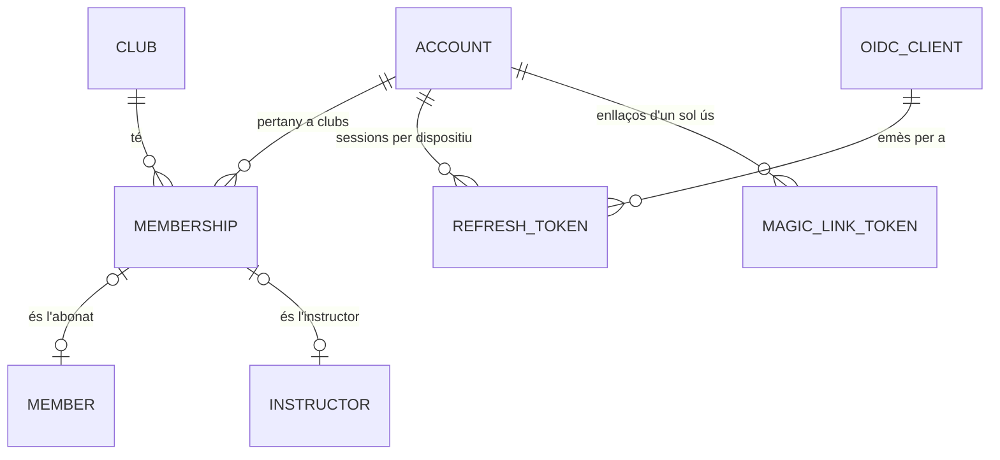
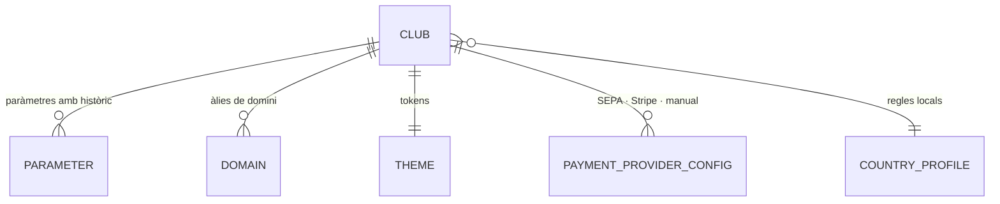
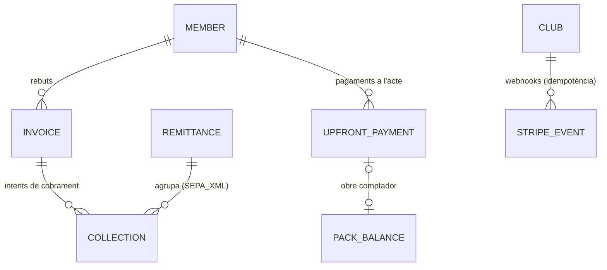
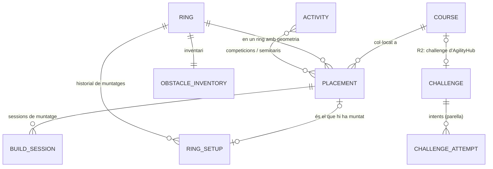

# Model de dades — extensions de plataforma (v1.7-ext · 03-09-2026)

**Complementa `MODEL_DADES_CANIC.md` v1.6** (que segueix sent la referència de tot el domini del club revisat pel Josep). Aquest document és **additiu**: afegeix les entitats de plataforma decidides el 03-09 (ADR-009…013) i llista els punts on **substitueix** v1.6. Regla de precedència: v1.6 mana, excepte en el que aquí es marca com a **[substitueix]**. Quan es regeneri la spec v1.7, els dos documents es fonen.

Convenció: els noms de taula en català són els del model (per parlar-ne amb el Josep); els noms **de codi** (classes Java, col·leccions Mongo, tipus TS) són en anglès i es fixen al glossari §0 — **el codi només usa els noms anglesos**.

---

## 0. Glossari model ↔ codi (obligatori per al vibe-coding)

| Model (CA) | Codi (EN) · col·lecció | Context | `clubId` |
|---|---|---|---|
| COMPTE | `Account` · `accounts` | identity | **no** (global) |
| MEMBRESIA | `Membership` · `memberships` | identity | sí |
| token d'enllaç màgic · refresh · impersonació | `MagicLinkToken`, `RefreshToken`, `ImpersonationGrant` | identity | segons cas |
| client OIDC | `OidcClient` · `oidc_clients` | identity | no |
| CLUB | `Club` · `clubs` | platform | — (és el tenant) |
| PARAMETRE | `Parameter` · `parameters` | platform | sí (+ defaults de producte al codi) |
| perfil de país | `CountryProfile` (interfície; `ES`, `GENERIC`) | platform | — |
| ABONAT | `Member` · `members` | clubs/census | sí |
| GRUP_FAMILIAR | `FamilyGroup` · `family_groups` | clubs/census | sí |
| GOS | `Dog` · `dogs` | clubs/census | sí |
| DOCUMENT_GOS | `DogDocument` · `dog_documents` | clubs/census | sí |
| NIVELL | `Level` · `levels` | clubs/catalogs | sí |
| escala AgilityHub (només recorreguts/challenges, mai nivells de club — A5 06-09) | `AgilityHubLevel` (enum global `EASY · MEDIUM · HARD`) | courses | no |
| PISTA (= ring) | `Ring` · `rings` | clubs/catalogs (+ geometria per a courses) | sí |
| INSTRUCTOR | `Instructor` · `instructors` | clubs/catalogs | sí |
| MODALITAT · TARIFA | `Plan` · `plans` / `Price` · `prices` | clubs/billing | sí |
| PLANTILLA_SETMANAL · franja · classe de plantilla | `WeekTemplate` · `week_templates` (amb `TimeBand[]` i `TemplateClass[]` embeguts) | clubs/scheduling | sí |
| SETMANA | `Week` · `weeks` | clubs/scheduling | sí |
| CLASSE | `ClassSession` · `class_sessions` | clubs/scheduling | sí |
| ENTRENAMENT_SLOT | `TrainingSlot` (**valor calculat** a partir d'horari, classes, bloquejos i reserves; sense col·lecció — S09) | clubs/training | — |
| BLOQUEIG_PISTA | `RingBlock` · `ring_blocks` | clubs/scheduling | sí |
| ACTIVITAT · INSCRIPCIO_ACTIVITAT | `Activity` · `activities` / `ActivityRegistration` · `activity_registrations` | clubs/activities | sí |
| INSCRIPCIO_CLASSE | `Booking` · `bookings` | clubs/bookings | sí |
| ASSISTENCIA | `Attendance` · `attendances` | clubs/bookings | sí |
| LLISTA_ESPERA | `WaitlistEntry` · `waitlist_entries` | clubs/bookings | sí |
| RESERVA_ENTRENAMENT | `TrainingBooking` · `training_bookings` | clubs/training | sí |
| BLOQUEIG_TEMPORAL | `SeatHold` · `seat_holds` (TTL index) | clubs/bookings | sí |
| TASCA · ADJUNT | `Task` · `tasks` / `Attachment` · `attachments` | clubs/followup | sí |
| PERIODE_INACTIVITAT · SOL_LICITUD_BAIXA | `InactivityPeriod` · `inactivity_periods` / `LeaveRequest` · `leave_requests` | clubs/census | sí |
| REBUT · LINIA_REBUT | `Invoice` · `invoices` (línies embegudes `InvoiceLine`) | payments | sí |
| COBRAMENT (nou) | `Collection` · `collections` | payments | sí |
| REMESA | `Remittance` · `remittances` | payments | sí |
| COBRAMENT_ANTICIPAT | `UpfrontPayment` · `upfront_payments` | payments | sí |
| CONSUM_PACK | `PackBalance` · `pack_balances` (moviments embeguts) | clubs/billing | sí |
| esdeveniment Stripe (nou) | `StripeEvent` · `stripe_events` | payments | sí |
| PLANTILLA_COMUNICAT | `MessageTemplate` · `message_templates` | clubs/messaging | sí |
| NOTIFICACIO | `Notification` · `notifications` | clubs/messaging | sí |
| PREFERENCIA_AVIS | `NotificationPreference` (embegut a `Member`) | clubs/messaging | sí |
| subscripció push (nova) | `PushSubscription` · `push_subscriptions` | clubs/messaging | sí |
| VISTA_LLISTAT | `SavedView` · `saved_views` | clubs/common | sí |
| FAQ | `FaqEntry` · `faq_entries` | clubs/content | sí |
| pàgina del club (nova, 05-09) | `ClubPage` · `club_pages` (normes, privacitat, imatge, guia…) | clubs/content | sí |
| VENUE (nou, 05-09; planner) | `Venue` · `venues` (un club = un venue; venues sense club a R2) | courses | opcional |
| AUDITORIA | `AuditEntry` · `audit_entries` | platform | sí (o `null` per a accions de plataforma) |
| esdeveniment de domini (nou) | `DomainEventRecord` · `domain_events` (outbox) | platform | sí |
| RECORREGUT (nou) | `Course` · `courses` | courses | **opcional** (`ownerType`) |
| COL·LOCACIÓ (nova) | `Placement` · `placements` | courses | sí |
| RECORREGUT_MUNTAT (nou) | `RingSetup` · `ring_setups` | courses | sí |
| SESSIÓ_MUNTATGE (nova) | `BuildSession` · `build_sessions` | courses | sí |
| INVENTARI_OBSTACLES (nou) | `ObstacleInventory` · `obstacle_inventories` | courses | sí |
| CHALLENGE · INTENT (R2) | `Challenge` · `challenges` / `ChallengeAttempt` · `challenge_attempts` | courses | no / sí |
| execució de facturació · simulació · càrrec pendent (nous) | `BillingRun` · `billing_runs` / `BillingSimulation` · `billing_simulations` / `PendingCharge` · `pending_charges` (+ `billing_locks`) | payments | sí |
| bloqueig de plaça tècnic · idempotència (nous) | `seat_locks` · `idempotency_records` (TTL) | clubs/bookings · shared | sí |
| seguiment D14 (projecció) | `FollowupItem` · `followup_items` / `followup_read_marks` | clubs/followup | sí |
| exportació · supressió RGPD · esdeveniment de seguretat (nous) | `ExportJob` · `export_jobs` / `ErasureRequest` · `erasure_requests` / `SecurityEvent` · `security_events` | platform | sí / sí / segons cas |
| execució de procés · lock (nous) | `JobRun` · `job_runs` / `job_locks` (TTL) | platform | sí |
| migració (nou) | `MigrationRun` · `migration_runs` | migration | sí |

Vocabulari fix a l'API i al codi: *member* (abonat), *dog*, *pair* (parella — només al codi, mai a la UI), *ring* (pista), *level*, *plan* (modalitat), *price* (tarifa), *class session* (classe), *booking* (inscripció a classe), *training booking* (reserva d'entrenament), *waitlist*, *invoice* (rebut), *remittance* (remesa), *collection* (cobrament), *course* (recorregut), *placement* (col·locació), *ring setup* (recorregut muntat), *build session* (sessió de muntatge).

---

## 1. Identitat — AgilityHub ID **[substitueix USUARI de v1.6]** (ADR-010)

### ACCOUNT (global)
| Atribut | Notes |
|---|---|
| id, **email** (únic, normalitzat), emailVerifiedAt | l'email és la clau universal de la plataforma |
| passwordHash (opcional) | bcrypt (`$2y$`/`$2a$`, importat de Learn) o argon2id per a noves; `null` = només enllaç màgic |
| name, givenName, familyName, avatarUrl | |
| **locale** | idioma de l'usuari a tots els productes (ADR-011); a l'alta al club, el de la pantalla |
| platformRoles[] | `AGILITYHUB_ADMIN` (consola de clubs, recorreguts públics) |
| externalIds | `learnUserId` (importació), futurs |
| status | ACTIVE · BLOCKED · MERGED (→ `mergedIntoAccountId`) |
| createdAt, lastLoginAt, lastLoginClientId | |

### MEMBERSHIP
| Atribut | Notes |
|---|---|
| id, accountId, clubId | únic per parella compte–club |
| roles[] | `MEMBER` · `INSTRUCTOR` · `ADMIN` — es gestionen a D10 («Rols d'accés») i D17; tots els instructors i admins són abonats (model v1.6) |
| memberId, instructorId | FKs segons rol |
| defaultProfile | tria de 03b recordada (`MEMBER`/`INSTRUCTOR`/`ADMIN`) |
| status | ACTIVE · SUSPENDED (baixa de l'abonat → la membresia queda però sense accés a reserves) |
| createdAt, lastAccessAt | «últim accés» de v1.6 viu aquí |

### Tokens i clients
- **MAGIC_LINK_TOKEN**: hash del token, accountId, clientId, redirect, expiresAt (15 min), usedAt, ip/userAgent. Un sol ús.
- **REFRESH_TOKEN**: hash, accountId, clientId, clubId (context), deviceLabel, expiresAt (30 dies lliscants, paràmetre `auth.sessionDays`), revokedAt, replacedBy (rotació).
- **IMPERSONATION_GRANT**: actorAccountId, memberId suplantat, clubId, expiresAt (1 h), reason; el JWT emès porta `actorAccountId` + `impersonatedMemberId`.
- **OIDC_CLIENT**: clientId, tipus (public/confidential), redirectUris[], grants permesos (`authorization_code`, `refresh_token`, `password`, `urn:agilityhub:grant:magic-link`), scopes, marca (per a la pantalla de login: AgilityHub o `clubId`).

**JWT d'accés** (15 min): `sub` (accountId), `email`, `locale`, `clubId`, `roles[]`, `memberId`, `instructorId`, `platformRoles[]`, `actorAccountId`/`impersonatedMemberId` (si escau), `azp` (client). Sense context de club (p. ex. `apps/id`): `clubId` absent.

---

## 2. CLUB ampliat i configuració **[substitueix CLUB de v1.6]**

### CLUB
| Bloc | Atributs | Notes |
|---|---|---|
| Identitat | id, slug, name, legalName, taxId, address (per camps), contactEmail, contactPhone, websiteUrl | |
| Localització (ADR-011) | **locales[]**, **defaultLocale**, **timeZone** (IANA), **currency** (ISO 4217), **countryProfile** (`ES` · `GENERIC`) | Cànic: `[ca, es]`, `ca`, `Europe/Madrid`, `EUR`, `ES` |
| Dominis | domains[] {host, app: `clubs`/`clubs-admin`, verifiedAt} | resolució del tenant pel host (ADR-002) |
| Tema | theme {logoUrl, logoDarkUrl, markUrl, colors {primary, background, surface, text…}, fontFamily, radius, ringPalette[], mode: `dark`/`light`/`auto`}, pwa {name, shortName, icons} | tokens consumits per `packages/ui` i pel manifest PWA |
| **Mòduls** (ADR-012) | modules[] | claus del `CATALEG_MODULS.md` |
| Pagaments (ADR-009) | paymentProviders {SEPA_XML {creditorId, creditorName, iban, suffix, invoiceSeries, nextNumber}, STRIPE {secretKeyEnc, publishableKey, webhookSecretEnc, mode}, MANUAL {instructions: LocalizedText}} | claus xifrades (AES-GCM amb clau del servidor) |
| Legal | privacyPolicyUrl, imageConsentText: LocalizedText, legalTextsVersion | consentiments versionats per `legalTextsVersion` |
| Operació | status (ONBOARDING · ACTIVE · SUSPENDED), createdAt, onboardingChecklist {dns, sepa, branding, templates, faq, legal, firstAdmin} | consola de clubs (S17) |
| Comptadors | usage {smsSentMonth, storageBytes} | per al futur model SAAS |

### PARAMETER **[amplia PARAMETRE]**
| Atribut | Notes |
|---|---|
| clubId, key (p. ex. `bookings.maxCurrentWeek`), value (JSON tipat), type (`int` · `bool` · `enum` · `time` · `duration` · `money` · `localizedText` · `ref` · `json`), scope (`club` · `ring` · `level`) | valor per defecte de producte al codi (`ParameterCatalog`), override per club a la col·lecció |
| history[] {value, changedAt, changedByAccountId} | «últim canvi: … amb històric» (D11) |
| Catàleg complet | `05-desenvolupament/specs/00-transversal/CATALEG_PARAMETRES.md` — cap valor de negoci fora del catàleg |

### LocalizedText (tipus comú)
`{ "ca": "…", "es": "…", "en": "…" }` — qualsevol subconjunt; lectura amb fallback `locale usuari → defaultLocale del club → primer disponible`. Camps que el fan servir: `Plan.name/description/conditions`, `MessageTemplate.title/body`, `FaqEntry.category/question/answer`, `Activity.title/shortDescription/longDescription`, `Level.name` (opcional), paràmetres de tipus `localizedText` (textos d'alta, instruccions de pagament, avisos), `Course.name/notes`.

---

## 3. Canvis en entitats del club **[substitueix els punts indicats de v1.6]**

| Entitat | Canvi | Motiu |
|---|---|---|
| **ABONAT** (`Member`) | `accountId` en lloc de FK USUARI; sense email/contrasenya/idioma (viuen a ACCOUNT — els **2 emails de contacte** del club es mantenen a `Member.contactEmails[]`; el primer coincideix amb `Account.email` per defecte) · **`paymentMethod`** {type: `SEPA_DD` {iban, holderName, holderTaxId, mandateRef, mandateSignedAt} · `CARD` {stripeCustomerId, stripePaymentMethodId, last4, brand} · `MANUAL` {channel: cash/transfer/bizum}} · `gender` (`MALE`/`FEMALE`/`OTHER`) · `bookingBlock` {active, reason, since, byAccountId} · `lastDogForClass`, `lastDogForTraining` | ADR-009, ADR-010, ADR-011 |
| **GOS** (`Dog`) | `levelId` **opcional** quan `levels.enabled=false` · `freeTrainingOverride` (`null` = segons nivell; `true/false` = ajust manual) — «Pot entrenar sol» = `override ?? level.grantsFreeTraining` | ADR-012 |
| **NIVELL** (`Level`) | `name: LocalizedText` (fallback al text pla), `order`, `color`, `capacity` (aforament), `active`, **`grantsFreeTraining`** (bool; Cànic: D..G) — **sense** `agilityhubLevel` (Jordi 06-09, A5: els nivells de club són catàleg 100 % local; `EASY·MEDIUM·HARD` només a `Course`/`RingSetup`/`Challenge`) | ADR-002, decisió 03-09 |
| **PISTA** (`Ring`) | `shortName`, `color`, `allowsFreeTraining`, `trainingCapacity` (1), `active`, **`geometry`** (opcional, §5), `activeSetupId` (recorregut muntat vigent) | ADR-013 |
| **CLASSE** i **classe de plantilla** | **`instructorIds[]`** (mida ≤ `classes.maxInstructorsPerClass`; Cànic 1) · `levelIds[]` (buit = sense restricció si `levels.enabled=false`) · `description` (auto/manual, v1.6) · `placementId` (opcional: recorregut previst per a la classe) | ADR-012, ADR-013 |
| **MODALITAT** (`Plan`) | `type`: `MONTHLY` · `PACK` · **`SINGLE_CLASS`** · `entryFee` {amount, percentOfStandard} · `maintenanceFee` (mensual mentre no fa classe en grup — la «teràpia» del Cànic és un `MONTHLY` amb `entryFee.percent=50` + `maintenanceFee`) · `pack` {sessions, validityMonths} · `singleClass` {pricePerClass, chargeMode: `CHARGE_ON_ATTENDANCE` / `PAY_TO_BOOK`, cancelPolicy} · `texts: LocalizedText` · `showOnSignup`, `offerLabel` | ADR-009, ADR-012 |
| **TARIFA** (`Price`) | `amount: Money` (minor units + currency), `taxPercent`, `validFrom/To`, `periodicity` | ADR-011 |
| **LLISTA_ESPERA** (`WaitlistEntry`) | `position` (mode FIFO), `notifiedAt`, `confirmBy` (FIFO: `notifiedAt + waitlist.fifoConfirmMinutes`), `state` (ACTIVE · NOTIFIED · CONSOLIDATED · EXPIRED · CANCELLED) | ADR-012 |
| **INSCRIPCIO_CLASSE** (`Booking`) | `chargeInvoiceLineRef` (classe individual per consum) · `paymentIntentId` (PAY_TO_BOOK) | ADR-009 |
| **PLANTILLA_COMUNICAT**, **FAQ**, **ACTIVITAT** | camps de text com a `LocalizedText`; NOTIFICACIO guarda `locale` amb què s'ha renderitzat | ADR-011 |
| **PREFERENCIA_AVIS** | embeguda a `Member.notificationPreferences` {categoria → canals, reminderMinutesBefore (`null` = mai), pushClubNews} | simplificació |
| **AUDITORIA** | `actorAccountId`, `impersonatedMemberId`, `clubId` (`null` per a accions de plataforma), `entityType/entityId`, `action`, `before/after` (JSON), `at`, `ip` | ADR-010 |
| Límits setmanals | el comptador és per **gos** o per **abonat** segons `bookings.limitUnit` — mateix esquema, càlcul diferent | ADR-012 |

---

## 4. Pagaments (ADR-009) **[amplia REBUT/REMESA de v1.6]**

### INVOICE (`Invoice`) — rebut, neutre de proveïdor
| Atribut | Notes |
|---|---|
| series, number, issueDate, memberId, period (`YearMonth`), lines[] {priceId, description (congelada, en l'idioma del club), amount: Money, taxPercent, origin: `MONTHLY_FEE` · `INACTIVITY_FEE` · `SINGLE_CLASS` (+ bookingId) · `PACK` · `ADJUSTMENT`}, total: Money | numeració per sèrie del club, mai reutilitzada (retrocés = anul·lació + reemissió amb el mateix número només dins del flux de retrocés de remesa, com v1.6) |
| paymentMethod (congelat: `SEPA_DD` + IBAN emmascarat/titular, `CARD`, `MANUAL`) | |
| status | `PENDING` → `COLLECTING` → `PAID` · `FAILED` (impagat: marca manual per SEPA, webhook per Stripe) · `CANCELLED` (retrocés) |
| remittanceId (SEPA), paidAt, failedReason | |

### COLLECTION (`Collection`) — intent de cobrament
| Atribut | Notes |
|---|---|
| invoiceId, provider (`SEPA_XML` · `STRIPE` · `MANUAL`), amount, status (`CREATED` · `SUBMITTED` · `SUCCEEDED` · `FAILED` · `REFUNDED`), providerRef (id del PaymentIntent / referència del mandat), attempts[], createdAt, resolvedAt | append-only; un rebut pot tenir més d'un intent (reintent Stripe, remesa retrocedida i repetida) |

### REMITTANCE (`Remittance`) — com v1.6
simulació → generació (XML pain.008, `collections[]`) → `SUBMITTED` → retrocés (`ROLLED_BACK`: anul·la rebuts i cobraments, retrocedeix numeració i dates de proper rebut, tot auditat).

### UPFRONT_PAYMENT (`UpfrontPayment`) — pagament a l'acte
`concept` (`ENTRY_FEE` · `FIRST_MONTH` · `PACK` · `SINGLE_CLASS` · `ACTIVITY` · `OTHER`), `amountDue`, `amountPaid`, `provider` (`STRIPE` → `checkoutSessionId`, `paymentIntentId` · `MANUAL` → canal i data), `status`, `dogId`/`bookingId`/`activityRegistrationId` segons concepte.

### STRIPE_EVENT
`eventId` (únic), `clubId`, `type`, `receivedAt`, `processedAt`, `payload` — garanteix idempotència del webhook.

---

## 5. Recorreguts i muntatge (ADR-013) — mòdul `courses`

### COURSE (`Course`) — recorregut
| Atribut | Notes |
|---|---|
| id, **ownerType** (`CLUB` · `AGILITYHUB` · `ACCOUNT`), clubId (si CLUB), ownerAccountId (si ACCOUNT), **visibility** (`PRIVATE` · `CLUB` · `PUBLIC`) | la biblioteca del club = `CLUB` + els `PUBLIC` d'AgilityHub |
| name: LocalizedText, discipline (`AGILITY` · `JUMPING` · `OTHER`), designerName, agilityhubLevel (opcional), tags[], notes | |
| **source** (`SMARTER` · `EDITOR` · `IMAGE` · `AGILITYHUB`), sourceFileUrl (S3), imageUrl (plànol/foto) | `IMAGE` = només plànol, sense geometria (suficient per al «recorregut muntat» bàsic) |
| **model** (JSON `course-core`, `schemaVersion`): obstacles[] {id, type, x, y, rotation, number, props}, sequence[], dimensions, units | format canònic de tota AgilityHub |
| createdAt, updatedAt, createdByAccountId | |

### Geometria del RING (embeguda a `Ring.geometry`)
`width`, `length` (m), `orientationDeg`, `origin`, `gates[]` {x, y, width, flow: `IN`/`OUT`/`BOTH`}, `noGoZones[]` (polígons), `calibrationMarkers[]` {id, x, y, qrPayload}, `surface`, `notes`. Un ring **sense** geometria admet només `RingSetup` d'imatge.

### PLACEMENT (`Placement`) — recorregut col·locat en un ring
`courseId`, `ringId`, `transform` {dx, dy, rotationDeg, mirror}, `warnings[]` {code, severity, obstacleId?} (marges, portes, no-go, inventari insuficient — calculats per `course-core`), `resolvedObstacles[]` (posicions absolutes al ring — el que consumeix l'AR), `createdByAccountId`, `createdAt`, `activityId` (opcional).

### RING_SETUP (`RingSetup`) — recorregut muntat (IDEA-02)
`ringId`, `placementId` **o** `courseId` amb imatge, `kind` (`AGILITY` · `JUMPING` · `FUN` · `OBSTACLE_DRILL` · `EMPTY`), `agilityhubLevel`/`levelIds[]` orientatius, `builtAt`, `builtByAccountId`, `expectedUntil`, `expiresAt` (caducitat automàtica `courses.setupAutoExpireDays`), `status` (`ACTIVE` · `EXPIRED` · `DISMANTLED`), `notes`. Vist a 08 (abans de reservar), detall de reserva, 10/23, D12.

### BUILD_SESSION (`BuildSession`)
`placementId`, `startedByAccountId`, `startedAt`, `finishedAt`, `obstacles[]` {obstacleId, status: `PENDING` · `PLACED` · `VERIFIED`, byAccountId, at}, `live` (bool; canvis publicats per SSE/WebSocket per a l'AR i el mòbil), `buildSheetUrl` (PDF generat).

### OBSTACLE_INVENTORY (`ObstacleInventory`)
per ring o per club: `items[]` {type, count, notes}. Alimenta l'avís «inventari insuficient» de la col·locació.

### CHALLENGE · CHALLENGE_ATTEMPT (R2 — només reservat)
`Challenge` (global, owner AgilityHub): `courseId`, `title/description: LocalizedText`, `agilityhubLevel`, `rules` (JSON), `validFrom/To`, `status`. `ChallengeAttempt` (clubId): `challengeId`, `memberId`, `dogId`, `ringSetupId`, `time`, `faults`, `videoUrl`, `submittedAt`, `validatedBy`.

---

## 6. Esdeveniments de domini i outbox (transversal)

`DomainEventRecord`: `id`, `clubId`, `type` (catàleg `CATALEG_ESDEVENIMENTS.md`), `aggregateType/aggregateId`, `payload` (JSON), `occurredAt`, `actorAccountId`, `processedAt`, `attempts`. S'escriu **dins la mateixa transacció** que el canvi de negoci; un *dispatcher* els processa (notificacions, comptadors, projeccions) amb idempotència per `id`. És també la traça funcional que complementa AUDITORIA.

---

## 7. Aïllament, índexs i esborrat

- **Globals** (sense `clubId`): `accounts`, `oidc_clients`, `clubs`, `courses` amb `ownerType != CLUB`, `challenges`, catàleg `AgilityHubLevel`. La façana de persistència exposa dos tipus de repositori: `TenantRepository<T>` (injecta `clubId` sempre) i `GlobalRepository<T>` (només des dels contextos `identity`/`platform`/`courses`).
- Índexs compostos obligatoris `{clubId, …}` a totes les col·leccions de club; `accounts.email` únic; `memberships {accountId, clubId}` únic; `seat_holds.expiresAt` TTL; `magic_link_tokens.expiresAt` TTL; `stripe_events.eventId` únic; `invoices {clubId, series, number}` únic; `bookings {clubId, classSessionId, dogId, state}`; `training_bookings {clubId, slotId}`; `ring_setups {clubId, ringId, status}`.
- **Res s'esborra físicament** (v1.6). RGPD: la **supressió d'un compte** es fa per **pseudonimització** (`Account.status=MERGED/ERASED`, email → hash, `Member` amb dades personals substituïdes per «Abonat suprimit #n», documents esborrats de S3) mantenint els moviments comptables; procediment a S14.

---

## 8. Punts de v1.6 que aquest document deixa superats

| v1.6 | Ara |
|---|---|
| USUARI (email, contrasenya, rols, idioma, perfil per defecte) dins del club | ACCOUNT global + MEMBERSHIP per club (§1) |
| «selector d'idioma desactivat fins que hi hagi castellà» | CA/ES/EN complets des de R1; selector actiu (ADR-011) |
| CLUB: id, nom, NIF, adreça, logo, colors, SEPA, sèrie | CLUB de §2 (localització, dominis, tema, mòduls, proveïdors de pagament, legal, estat) |
| REBUT lligat a la remesa SEPA | INVOICE neutre + COLLECTION per proveïdor + REMITTANCE només per a `SEPA_XML` (§4) |
| MODALITAT tipus «quota / pack / teràpia» | `MONTHLY` · `PACK` · `SINGLE_CLASS`; teràpia = configuració (§3) |
| CLASSE «un sol instructor» | `instructorIds[]` amb màxim per paràmetre (Cànic 1) |
| LLISTA_ESPERA «sense posicions» | mode `ALL_AT_ONCE` (Cànic) o `FIFO` |
| «pot entrenar sol: automàtic des de nivell D (PAR-14)» | atribut `Level.grantsFreeTraining` + override per gos |
| PISTA sense geometria; cap entitat de recorregut | `Ring.geometry` + mòdul `courses` (§5) |
| Sense esdeveniments de domini | outbox `domain_events` (§6) |

---

## Annex B — camps, estats i col·leccions fixats per les specs (revisió 03-09)

Les specs S01–S20 concreten camps que v1.6 i les seccions §1–§7 només insinuaven. Aquesta taula és la **referència de codi** (el detall i les regles són a cada spec). Estats en `UPPER_SNAKE`; «derivat» = es calcula, no es persisteix.

| Entitat (codi) | Camps i estats fixats | Spec |
|---|---|---|
| `Account` | `emailHash`, `security {failedLogins, lockedUntil, passwordChangedAt, tokenFamilyVersion}`, `createdSource (SIGNUP · IMPORT_LEARN · CONSOLE · MIGRATION)`, `lastLoginClientId`, `welcomeSentAt`, `sharing {dogLevels, leaderboardName}` (R2) · `status ACTIVE · BLOCKED · MERGED · ERASED` | S01, S18, S19 |
| `Membership` | `rememberProfile`, `adminProfile {shortName, since, active}`, `memberId` **opcional** mentre el club és `ONBOARDING` · `status ACTIVE · SUSPENDED · ERASED` | S01, S05, S17 |
| `Club` | `slug`, `billing {invoiceSeriesPattern, nextNumber, resetYearly}` (fora de `SEPA_XML`), `publicApiKeyHash`, `template`, `notes`, `nextMemberNumber`, `usage.membersActive`, `onboardingChecklist` (derivada) · `status ONBOARDING · ACTIVE · SUSPENDED` · `domains[].status PENDING · VERIFIED · BROKEN` | S02, S12, S17, S18 |
| `Member` | `number`, `status PENDING · ACTIVE · LEFT` (+ `displayStatus` derivat: `PENDING · ACTIVE · INACTIVE_PERIOD · LEAVE_SCHEDULED · LEFT`), `leftAt`, `leftReason (SIGNUP_REJECTED · LEAVE_REQUEST · ADMIN · PACK_EXPIRED · MIGRATED)`, `leaveDate`, `leaveRequestId`, `leaveHistory[]`, `billingMode (MONTHLY_FEE · MAINTENANCE)`, `contactEmails[] {email, bounced}`, `phones[] {number, label}`, `consents[] {type, version, granted, acceptedAt, ipHash, source}`, `signup {…}`, `familyGroupClaim`, `internalNotes`, `remarks`, `trainingSeq` (tècnic), `sourceIds {playoffMemberId, playoffNumber}` · `billedViaMemberId` **derivat** (= titular del grup) | S03, S04, S12, S13, S18 |
| `Dog` | `status PENDING · ACTIVE · INACTIVE` + `deactivationReason (CLUB · MEMBER_LEFT · SIGNUP_REJECTED)`, `levelAssignedAt`, `levelHistory[]`, `instructorNote` (de l'alumne), `remarks` + `remarksMeta` (observacions privades), `photoFileKey`, `licenses[] {organisation, number, category?, grade?, division?}` (09-09: `category` i `division` venen de Playoff), **`handlerName`** (09-09: nom del guia quan no és l'abonat; informatiu, sense compte ni permisos), `trainingSeq`, `sourceIds` | S03, S04, S09, S10, S18 |
| `FamilyGroup` · `DogDocument` | `holderMemberId`, `memberIds[]`, `status`, `sourceIds` · `type` (de `census.dogDocumentTypes`), `state PENDING · RECEIVED`, `files[] {fileKey, name, removedAt}` | S03, S04 |
| `Level` · `Ring` | `name: LocalizedText`, `order`, `color`, `capacity`, `active`, `grantsFreeTraining` · `shortName`, `color`, `order`, `allowsFreeTraining`, `trainingCapacity`, `active`, `geometry?`, `activeSetupId` | S05, S16 |
| `Plan` · `Price` | `type MONTHLY · PACK · SINGLE_CLASS`, `dogsIncluded`, `entryFee {mode STANDARD · AMOUNT · PERCENT · NONE, amount?, percent?}`, `pack {sessions, validityMonths}`, `singleClass {chargeMode, cancelPolicy}`, `texts {name, description, conditions, priceLabel, offerLabel}`, `showOnSignup`, `showOnWeb`, `order`, `active` · `planId`, `concept MONTHLY_FEE · MAINTENANCE_FEE · PACK · SINGLE_CLASS`, `amount: Money`, `taxPercent`, `validFrom`, `validTo?`, `locked`/`status` derivats | S05, S12 |
| `WeekTemplate` · `Week` | `kind WEEKDAYS · SATURDAY`, `name`, `timeBands[]`, `classes[] TemplateClass {bandId, dayOfWeek, instructorIds[], ringId?, levelIds[], capacity, capacityMode AUTO · MANUAL, description?, placementId?}`, `inconsistencies[] InconsistencyType` · `isoYear`, `isoWeek`, `startDate`, `state PENDING · GENERATED · VALIDATED`, `generatedAt`, `validatedAt`, `weekdayTemplateId`, `saturdayTemplateId` | S06 |
| `ClassSession` | `state DRAFT · ACTIVE · FINISHED · CANCELLED`, `instructorIds[]`, `levelIds[]`, `capacity` + `capacityMode`, `description`, `placementId?`, `risk {exempt, notifiedBookingIds[], adminNotifiedAt}`, `counters {booked, waitlisted}`, `cancellation {reason (ADMIN · RISK_REVIEW · ACTIVITY), adminText, byAccountId, at}`, `attendanceSummary` (l'escriu S10), `templateClassId?`, `weekId` | S06, S10, S15 |
| `RingBlock` · `Activity` · `ActivityRegistration` | `kind RESERVATION · BLOCK`, `reason`, `from`, `to`, `ringId`, `activityId?`, `createdByAccountId`, `note` · `slug`, `type`, `state DRAFT · PUBLISHED · FINISHED · CANCELLED`, `registration {opensAt, closesAt}`, `places {min, max}`, `levelIds[]`, `waitlistEnabled`, `ringIds[]`, `ringBlockIds[]`, `placementIds[]`, `priceTiers[]` (buit a R1), `publicUrl` · `state ACTIVE · WAITLISTED · CANCELLED`, `cancelReason`, `origin`, `position` | S06, S07, S09 |
| `Booking` · `SeatHold` · `WaitlistEntry` | `state PAYMENT_PENDING · ACTIVE · CANCELLED · CANCELLED_LATE · CANCELLED_BY_CLUB`, `origin APP · BACKOFFICE · INSTRUCTOR · SYSTEM`, `cancel {by, reason, late, minutesBefore, at, message}`, `charge {mode, price, chargeInvoiceLineRef, checkoutSessionId, paymentIntentId, paidAt}`, `waitlistEntryId?`, `swapFromBookingId?`, `packMovementId?`, `classStartsAt`, `classEndsAt`, `bookingWeekKey` · `seat_holds` (TTL) + `seat_locks {_id: classId, version}` + `idempotency_records` (TTL 24 h) · `position`, `notifiedAt`, `confirmBy`, `state ACTIVE · NOTIFIED · CONSOLIDATED · EXPIRED · CANCELLED` | S08 |
| `TrainingBooking` · `Attendance` | `ringId`, `startsAt`, `endsAt`, `seatIndex`, `weekStart`, `state`, `cancelReason`, `origin` (índex únic parcial `{clubId, ringId, startsAt, seatIndex}` sobre `ACTIVE`; els slots es calculen) · `bookingId`, `state PENDING · PRESENT · NOTIFIED · NO_SHOW`, `markedByAccountId`, `markedAt`, `late`, `noticeSentAt` | S09, S10 |
| `Task` · `Attachment` · seguiment | `state PENDING · DONE`, `doneAt`, `doneBy`, `deletedAt` · `entityType`, `entityId`, `fileKey`, `name`, `mime`, `size` · col·leccions `followup_items` (projecció D14) i `followup_read_marks {accountId, readAllAt, readItemIds[]}` | S10 |
| `InactivityPeriod` · `LeaveRequest` | `fromMonth`, `toMonth?`, `state REQUESTED · APPROVED · ACTIVE · FINISHED · DENIED · CANCELLED`, `feeSnapshot {firstMonth, followingMonths}`, `finishReason`, `origin`, `comments`, `decisionNote` · `requestedDate`, `effectiveDate`, `reasonKey`, `nps`, `comment`, `state PENDING · APPROVED · DENIED · CANCELLED`, `source REQUEST · ADMIN · PACK_EXPIRED · MIGRATED`, `decision` | S13, S18 |
| `Invoice` · `Collection` · `Remittance` · `BillingRun` · `BillingSimulation` · `UpfrontPayment` · `PackBalance` · `PendingCharge` | `Invoice.kind PERIODIC · MANUAL · MIGRATED`, `displayNumber`, `memberSnapshot`, `refundedTotal`, `sourceIds`; `Collection.attempt`, `refunds[]`; `Remittance.status GENERATED · SUBMITTED · ROLLED_BACK`, `messageId`, `requestedCollectionDate`, `xsdValidatedAt`; `BillingRun {period, status GENERATED · CHARGING · COMPLETED · ROLLED_BACK, byProvider, previousDates[]}`; `BillingSimulation {incidents[], cashMembers[], invoicesPreview[], kpis}`; `UpfrontPayment.status DUE · CHECKOUT_PENDING · PARTIAL · PAID · CANCELLED · REFUNDED`, `concept ENTRY_FEE · FIRST_MONTH · PACK · SINGLE_CLASS · ACTIVITY · OTHER`, `bookingId?`, `packBalanceId?`; `PackBalance.movements[] {type OPEN · CONSUME · REFUND · ADJUST · EXPIRE, delta, bookingId?, reason?, at}`, `expiresOn`, `state ACTIVE · EXPIRED · CLOSED`, `expiryWarnedAt`, `sourceIds`; `PendingCharge {bookingId, priceId, amount, invoiceId?, voidedAt?}`; `billing_locks` | S04, S12, S18 |
| `MessageTemplate` · `Notification` · `PushSubscription` | `code`, `category`, `system`, `channelsByAudience {MEMBER · INSTRUCTORS · ADMINS → [APP, EMAIL, SMS, PUSH]}`, `translations {locale → {title, body, smsBody}}`, `icon`, `color`, `version` · `channelStates[] {channel, state QUEUED · SENT · DELIVERED · FAILED · SKIPPED_BY_PREFERENCE · SKIPPED_MODULE_OFF · SKIPPED_NO_CONTACT · SKIPPED_CAP · SKIPPED_STALE}`, `readAt`, `locale`, `action` · `endpoint`, `keys`, `deviceLabel`, `state` | S11 |
| `AuditEntry` · `ExportJob` · `ErasureRequest` · `SecurityEvent` | `action` (enum `AuditAction`, S14 R-14-09), `entityType`, `entityId`, `entityLabel`, `changes[] {path, before, after}`, `actorRole`, `actorName`, `impersonatedName`, `origin`, `ip`, `userAgent`, `details` · `kind LIST · MEMBER_DATA · ACCOUNTING`, `state QUEUED · RUNNING · READY · EXPIRED · FAILED`, `fileKey`, `deliverToMember` · `scope`, `executeAt`, `state SCHEDULED · BLOCKED · ERASED · CANCELLED`, `blockReasons[]` · `type`, `emailHash`, `ip`, `route` | S14 |
| `DomainEventRecord` · `JobRun` · `job_locks` · `MigrationRun` | `processedAt` per consumidor, `attempts` · `job`, `scheduledFor`, `trigger SCHEDULE · CATCH_UP · MANUAL`, `status`, `dryRun`, `counters`, `items[]` (≤ 500), `errors[]` · lease amb TTL · `mode`, `env`, `inputManifest`, `mappingVersion`, `status PREPARED · RUNNING · COMPLETED · FAILED · RECONCILED`, `counters`, `reportFileKey` | S15, S18 |
| `Course` · `Placement` · `RingSetup` · `BuildSession` | `history[]` (10 versions), `deletedAt`, `stats` · `stale`, `resolvedObstacles[]`, `warnings[] {code, severity WARN · BLOCK}` · `status ACTIVE · EXPIRED · DISMANTLED`, `expectedUntil`, `expiresAt` · `obstacles[].status PENDING · PLACED · VERIFIED`, `live`, `participants[]`, `finishedAt` — **revisió 05-09 (S16 §14.2)**: els noms i camps s'alineen amb l'esquema del web-planner (`Course.normalizedJson/designLengthM/designWidthM/canvasWidth/canvasHeight/origin/courseGrade/courseType/sizeCategory`, `Placement.offsetXM/offsetYM/rotationDeg/flipX/flipY/warningThresholdM/warningsJson/scheduledAt/mode/grades[]/sizes[]/displayName`, `BuildSession.joinCode/joinToken/selectedStrategy/lastKnownMarkerId/progressJson`, `Ring.geometry.markers[].aprilTagId/physicalWidthM/physicalHeightM/zM/rotationYDeg/role`, `CalibrationLog`, `Venue`) | S16 |
| `ClubPage` | `key`, `title/body: LocalizedText`, `version`, `publishedAt`, `active`; consentiments amb `pageVersion` | S05/S11/S04 |
| `Account` (05-09) | `onboardingPending` (pantalla «Completa el teu perfil» al primer accés dels comptes importats/migrats), `externalIds.learnRole`; `locale` ∈ `ca es en fr de no pt` | S01 §14 |

Regla: si una spec i aquest annex discrepen, s'arregla l'annex **i** la spec al mateix PR (el model és la referència de codi; la spec, la del comportament).
