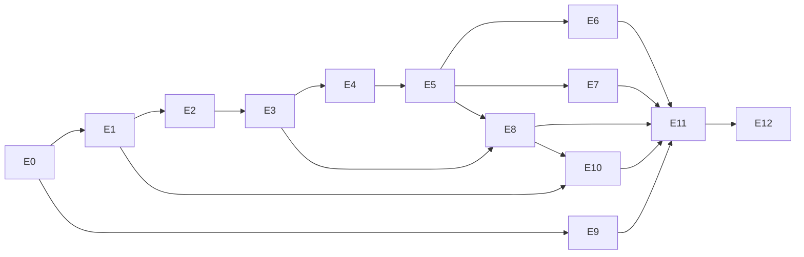

# Pla de desenvolupament — plataforma AgilityHub (Clubs · ID · Recorreguts) · release R1 «Cànic operatiu»

**v2.0 · 03-09-2026** (substitueix la v1.0 del 02-09) · Equip: Jordi + IA (2–3 fils en paral·lel) · **Per etapes, no per dates**: cada etapa té un criteri de sortida verificable; l'objectiu declarat per Jordi és tenir-ho **tot operatiu a final d'octubre de 2026** · Visió: `04-arquitectura/VISIO_PLATAFORMA_AGILITYHUB.md` · Plans companys: `PLA_BACKEND.md` v2 · `PLA_FRONTEND.md` v2 · `METODOLOGIA_VIBE_CODING.md` · Specs: `specs/` (S01–S20) · Decisions: ADR-001…004 (actualitzades) + ADR-009…013

---

## 1. Objectiu i abast

Construir **`agilityhub-core-api` + `agilityhub-core-web`**: la plataforma AgilityHub amb tres contextos — **AgilityHub ID** (compte únic), **AgilityHub Clubs** (gestió de clubs, marca blanca, multi-tenant, el Cànic com a client 1) i **Recorreguts** (biblioteca, Smarter, rings, col·locació, muntatge) — més pagaments multi-proveïdor, i18n total i mòduls/regles configurables per club.

**R1 (aquest pla)** = tot el que el Cànic necessita per deixar Playoff **més** el que fa que el segon club sigui configuració: E0–E12. **R2** (SSO complet amb Learn, selector de productes, challenges), **R3** (AR/VR) i **R4** (SAAS comercial) queden a VISIO §6 i a les specs S19/S20.

Fora de R1 (dissenyat, no construït): estadístiques i lliga social (27/27b), TPV d'activitats a externs, Stripe Connect, facturació del SAAS.

## 2. Fonts de veritat (ordre de precedència)

| Què | On | Regla |
|---|---|---|
| Model de dades | `04-arquitectura/MODEL_DADES_CANIC.md` v1.6 + **`MODEL_DADES_PLATAFORMA.md`** (extensions; substitueix els punts que llista al §8) | mana el model; PLATAFORMA mana sobre v1.6 només on ho diu |
| Comportament de cada vertical | **`specs/Sxx-*.md`** (20 specs) + `specs/00-transversal/*` (API, permisos, mòduls, paràmetres, notificacions, esdeveniments, i18n) | el document que es carrega a cada sessió de vibe-coding; si contradiu el model, mana el model i s'anota a la spec |
| Contracte d'UI | `03-disseny/mockups/pantalles/{mobil,escriptori}/*.html|png` (una pantalla per fitxer; `README.md` = índex pantalla → spec) | el mockup mana per a `ca`; les pantalles sense mockup (D18, D19, `apps/id`, visor de recorreguts) es fan amb el design system i es validen a staging |
| Valors operatius | `specs/00-transversal/CATALEG_PARAMETRES.md` (= `ParameterCatalog` al codi, test T-02-03) | cap valor de negoci al codi |
| Arquitectura | ADR-001…004 (actualitzades 03-09), ADR-009 (pagaments), ADR-010 (ID), ADR-011 (i18n), ADR-012 (mòduls i regles), ADR-013 (recorreguts) | oberts: ADR-005 (email, es tanca a E1), ADR-006 (pain.008, E8), ADR-008 (migració, E12 — resum a S18 §13), ADR-014 (AR, R3) |
| Especificació antiga | `02-requisits/ESPECIFICACIONS_SOFTWARE_CANIC.md` v1.6, `DETALL_FUNCIONAL.md` v1.0 | context històric; les specs les substitueixen per al codi |
| Pendents | `PENDENTS_DESENVOLUPAMENT.md` v2 | integrats a les etapes (§8) |

## 3. Arquitectura decidida (resum)

- **`agilityhub-core-api`**: Spring Boot 3.5 · Java LTS · MongoDB replica set · monòlit modular amb contextos `identity` · `clubs` · `courses` · `payments` · `platform`, capes Avanta dins de cada context · outbox d'esdeveniments · schedulers per club en hora local · OpenAPI publicat (ADR-001/002).
- **`agilityhub-core-web`**: pnpm + Turborepo · React 19 + TS + Vite + Tailwind 4 · `apps/clubs` (PWA), `apps/clubs-admin` (backoffice + consola), `apps/id` · `packages/ui` (tokens per club), `i18n` (ca/es/en), `api-client` (tipus generats), `auth`, `course-core`, `course-ui` (ADR-001/011/013).
- **Hosts**: `id.` · `clubs.` · `clubsadmin.` · `core.agilitydoghub.com` + àlies per club (`app/admin.agilitycanic.cat`); droplet DO + Docker Compose + Caddy (on-demand TLS) + S3; staging al mateix droplet amb dades fictícies (ADR-003).
- **Pagaments**: rebut neutre + cobrament per `SEPA_XML` / `STRIPE` (compte del club) / `MANUAL` (ADR-009). **Identitat**: compte global + membresies, OIDC, Learn federat sense canviar contrasenyes (ADR-010). **Mòduls i regles** per club (ADR-012). **i18n** total + perfil de país (ADR-011).

## 4. Principis de desenvolupament

1. **Marca blanca primer**: tot és `Club` + `Parameter` + catàleg + `LocalizedText` + mòdul. Una constant «del Cànic» que aparegui en una feature es converteix en paràmetre **en el mateix PR** (i s'afegeix al catàleg).
2. **Principi 0.3.7 (control manual absolut)**: tot automatisme té interruptor, traça, simulació i marxa enrere (S15).
3. **Immutabilitat comptable** i «res no s'esborra físicament» (S12, S14: RGPD per pseudonimització).
4. **i18n des del dia 1 en tres idiomes** (ca/es/en): claus i ICU, mai text al codi; fus horari i moneda del club (ADR-011).
5. **Esdeveniments, no crides creuades**: els verticals emeten esdeveniments a l'outbox; notificacions i projeccions són consumidors (CATALEG_ESDEVENIMENTS).
6. **Contract-first**: OpenAPI → tipus generats → front; el diff de l'OpenAPI es valida a CI. Cada spec té un paquet «Contracte» que va primer.
7. **Testing exhaustiu del backend** (PLA_BACKEND §9): cap PR sense tests; aïllament de tenant, matriu de rols i mòdul-off a cada mòdul; llindars JaCoCo.
8. **Vocabulari d'usuari**: mai «parella/parelles», «amigable», «(paràmetre)», codis interns a les pantalles; estats exactes dels mockups (linter de vocabulari a CI).
9. **RGPD**: staging i seeds només amb dades fictícies; Playoff només lectura; secrets només en variables d'entorn.
10. **Etapes, no dates**: una etapa es tanca quan el seu criteri de sortida es demostra en staging; el pla es revisa cada divendres.

## 5. Repositoris, entorns i governança

- **Repos GitHub** (org AgilityHub, privats): `agilityhub-core-api`, `agilityhub-core-web` (+ `agilityhub-ar-spike` a R3). Aquest Dropbox conté només documentació; el codi mai hi viu. Learn (`agilityhub-api`/`agilityhub-web`) rep un PR petit a E1 (adaptador de login).
- **Branques i PR**: `main` protegida; `feat/Sxx-paquet` per paquet de feina d'una spec (p. ex. `feat/S08-WP-B-reserves`); PR amb descripció tècnica + paràgraf no tècnic + referència a la spec i als tests `T-xx-nn` que cobreix; conventional commits; revisió humana de Jordi abans de fusionar.
- **Entorns**: dev (Docker Compose: mongo + api; fronts amb Vite) · staging (`*.staging.agilitydoghub.com`, seed `club-canic` + `demo-seed` + `club-minim`) · prod.
- **Definition of Done per paquet**: codi + tests del paquet en verd a CI (back: unitaris + integració + tenant + rols + mòdul-off; front: components amb lògica + E2E quan la spec ho marca) + claus i18n en ca/es/en + pantalla revisada contra el mockup (o contra el design system si no n'hi ha) + esdeveniments i auditoria del catàleg + entrada al CHANGELOG + OpenAPI actualitzat + paràmetres nous al catàleg.
- **Documentació viva**: `CLAUDE.md`/`AGENTS.md` a cada repo (context IA, apunta a les specs), `DEPLOY.md` (runbook), OpenAPI publicat, `CHANGELOG.md`. Skills IA creades a E0 (`METODOLOGIA_VIBE_CODING.md` §4).

## 6. Metodologia amb IA

Detall a `METODOLOGIA_VIBE_CODING.md`. Resum: **2–3 fils en paral·lel** (§8), cada sessió = un paquet de feina d'una spec amb el seu contracte ja fixat; ordre dins d'un vertical: contracte → back → front → integració amb seed; WIP màxim 1 paquet per fil; revisió humana de tots els PR; divendres: repàs d'etapes i ajust del pla (mai de l'abast d'una spec sense anotar-ho).

## 7. Etapes (criteris de sortida verificables)

| Etapa | Contingut (specs · paquets) | Depèn de | Criteri de sortida (demo en staging) | Fil |
|---|---|---|---|---|
| **E0 · Fonaments** | Repos + scaffolding per contextos · CI (build, tests, JaCoCo, lint i18n/vocabulari, diff OpenAPI) · Docker Compose · outbox + dispatcher · `TenantContext`/repositoris · `ParameterCatalog` complet · perfil de país ES/GENERIC · `/branding` + tema per tokens + shell de les 3 apps · `@RequiresModule` + mapa mòdul→UI · i18n (ca/es/en) als dos repos · **club-as-code** (`club:apply`) + seeds `club-canic`, `club-minim`, `demo-seed` · esquelet `identity` amb grant `password` (per a tests) · skills IA · `DEPLOY.md` inicial (S02 WP-A/C/E · S17 WP-A · S01 esquelet · S14 `@Audited` base) | — | `docker compose up` aixeca api + mongo; `club:apply seeds/club-canic.yaml` deixa el Cànic configurat; les tres apps mostren la shell amb el tema del Cànic i el «club mínim» amb el tema AgilityHub; CI en verd amb els tests de tenant, catàleg (T-02-03) i mòdul-off d'exemple | A + C |
| **E1 · AgilityHub ID** | S01 complet (comptes, membresies, enllaç màgic, contrasenya, refresh lliscant, 03b, impersonació, handoff, OIDC provider, `apps/id`, rate limit, `SecurityEvent`) · **ADR-005** (email transaccional) decidit i integrat (S11 **WP-11-B0** «Correu base»: `EmailSender` + dobles + N-25/N-26/N-27) · importació de Learn en `--dry-run` amb CSV fictici · PR d'adaptador a Learn preparat (no desplegat) | E0 | Login real per enllaç màgic i per contrasenya al host del Cànic; 03b amb tria recordada; «Entra com l'abonat» emet token auditat; `openid-configuration` + flux code/PKCE amb un client de prova; import de Learn sense canviar cap hash | C |
| **E2 · Cens i catàlegs** | S03 (cens, D5/D10/D15, 13/28, bloqueig, rols, documents) · S05 (nivells, pistes, equip, modalitats/preus, FAQ manteniment) · S02 WP-B/D (D11 generat del catàleg) · S14 WP-B/C (auditoria + motor d'exports) · S18 WP-A/B (importador de cens en dry-run sobre fixtures anonimitzades) | E1 | L'admin gestiona el cens sencer amb filtre universal, vistes i exports; D10 amb totes les accions; alumne veu 13/28; D8/D16/D17/D11 operatius; `migration:playoff --dry-run` produeix un informe sobre fixtures | A (back) + B (front) |
| **E3 · Alta pública i tauler** | S04 (16–19, D2, consentiments, pagament inicial, Checkout amb doble) · S14 WP-A (D1) · N-01/N-02/N-03 reals | E2, E1 | Una alta fictícia entra per la web pública, es valida a D2 i l'abonat rep la benvinguda i entra; D1 mostra pendents i KPIs | A + B |
| **E4 · Planificació i activitats** | S06 (plantilles, generació, validació, calendari, anul·lació amb inscrits, bloquejos, quadres 10/23) · S07 WP manteniment (D7, blocs de pista) | E2 | L'admin genera i valida una setmana; alumne i instructor veuen 10/23; D4c anul·la una classe amb inscrits ficticis (transacció + esdeveniments) | A + B |
| **E5 · Reserves i entrenaments** | S08 (03/04/06/29/07, límits, SeatHold, swap, llista d'espera 2 modes) · S09 (08, 24, slots, comptador) · S07 inscripcions · S15 marc + P1 (obertura), P6 (FIFO), P7 (pagaments pendents), P9 (neteja) · prova de càrrega k6 del pic | E4 | Cicle sencer reservar/anul·lar/espera/entrenament amb els processos actius a staging; k6 al pic de dg 20:00 dins d'objectius | A + B |
| **E6 · Assistència i seguiment** | S10 (20/21/22/25/26, D12/D13/D14, tasques, adjunts) · S15 P3 (no presentats), P8 (finalització) | E5 | Passar llista des del mòbil i D12; «ha avisat» allibera plaça i avisa l'espera; tasques amb adjunts; D14 amb no llegits | A + B |
| **E7 · Comunicacions** | S11 complet (motor, matriu, D9, 11, 12 preferències, 30 FAQ, push VAPID, **Twilio SMS**, correu amb bounces, comunicats massius) · S15 P4 (recordatoris) | E5 (esdeveniments), E1 (email) | Cada acció del cicle E5/E6 dispara els avisos correctes per canal i preferència (proves de matriu); SMS real de prova; push a iOS/Android instal·lat | C |
| **E8 · Facturació, pagaments, inactivitat i baixa** | S12 (simulació, run, remesa pain.008 amb **ADR-006** tancat, Stripe test, manual, retrocés, packs, classe individual, exports) · S13 (14/15, D10) · S15 P5 (venciments), P10 · S18 WP-C (importador de facturació) | E3, E5 | Remesa simulada i generada sobre el cens fictici; XML validat amb XSD i golden file; retrocés provat; cobrament Stripe en mode test amb webhook; inactivitat i baixa amb efectes | A + B |
| **E9 · Recorreguts i muntatge** (fil independent des d'E0) | S16: **WP-0 revisió del web-planner** → `course-core` → `course-ui` → back `courses` → sessions live → D18 + D16 geometria → mòbil (registre, visor, sessió) + integracions 08/10/23/07/D12/D7/D3 · biblioteca AgilityHub · migració Supabase si cal | E0 (core), E5/E6 (integracions) | Importar un Smarter real, col·locar-lo en un ring amb geometria, registrar-lo com a muntat i veure'l a 08/10; sessió de muntatge sincronitzada entre dos mòbils; full de muntatge PDF | C |
| **E10 · Consola de clubs** | S17 WP-B/C/D (API de plataforma, D19, assistent, dominis on-demand TLS, clonatge, equip, accés de suport) | E1, E2, E8 (proveïdors) | **Segon club** (fictici) creat des de la consola, amb domini propi verificat, tema, mòduls, catàlegs clonats i primer admin entrat — en menys d'una hora sense codi | C |
| **E11 · Hardening i QA** | S14 WP-D (RGPD: paquet de dades, pseudonimització, retenció, esdeveniments de seguretat) · revisió de seguretat (rate limits, headers, CORS, secrets, dependències) · backups amb restauració provada · Lighthouse/accessibilitat · textos es/en complets revisats · E2E Playwright dels fluxos crítics · **assaig de migració** a staging amb dades anonimitzades (S18 WP-D) · **QA guiat amb el Josep** sobre staging (checklist per pantalla) · `DEPLOY.md` definitiu | E7, E8, E9, E10 | Checklist de go-live (§11) en verd | A + B + C |
| **E12 · Migració i go-live** | S18 WP-E (tall: export final, càrrega a producció, conciliació, benvingudes per lots) · documents legals penjats · DNS del Cànic · Twilio i email en producció · primera setmana generada al nou sistema | E11 | **Cànic en producció** sense Playoff; primera remesa real al tancament del mes següent (supervisada, amb retrocés a mà) | A + C |

Post-R1: **R2** S19 (SSO, selector, recomanacions, challenges v1) · **R3** S20 (spike AR/VR → ADR-014 → app) · **R4** SAAS comercial (VISIO §6).

## 8. Fils en paral·lel i camí crític

- **Fil A (nucli del club, back)**: E0 → E2 → E3 → E4 → E5 → E6 → E8 → E11/E12.
- **Fil B (front del club)**: entra a E2 amb el contracte d'E2 fixat i va una etapa per darrere del fil A (E2 → E3 → E4 → E5 → E6 → E8) + el front d'E7.
- **Fil C (plataforma i recorreguts)**: E0 (tema, seeds) → E1 (ID) → E9 (course-core, back courses) → E7 (motor de comunicacions) → E10 (consola) → E11 (hardening).
- **Camí crític**: E0 → E1 → E2 → E3 → E4 → E5 → E8 → E11 → E12. Tot el que no hi és (E6 parcial, E9, E10, E7 avançat) es pot moure sense retardar el go-live; si cal retallar, l'ordre és: consola D19 (queda `club:apply`) → sessions de muntatge live → biblioteca AgilityHub → exports PDF → 25 històric. **Mai**: facturació, reserves, identitat, seguretat, i18n.
- Cada divendres: estat per etapa (`✅ E2 (10-10)`), paquets oberts per fil, riscos.

## 9. Dependències externes (i a quina etapa es resolen)

| Dependència | Etapa | Acció |
|---|---|---|
| Accés al codi de **Learn** (`AH_LearnPlatform`) i del **web-planner** | E1 / E9 | muntar les carpetes a la sessió (no s'ha pogut el 03-09); WP-19-B i WP-16-0 revisen i ajusten S01/S16 |
| Proveïdor d'email transaccional (**ADR-005**; SendGrid conegut de Learn) i domini verificat | E1 | decidir a E1: els enllaços màgics en depenen |
| **Twilio** (compte, remitent, cost) | E7 | alta + estimació amb la regla SMS del Josep (S11) |
| **Stripe** compte de test del Cànic (encara que no l'usi) i de prova per a clubs | E8 | mode test; `STRIPE` desactivat al seed del Cànic |
| XSD oficial pain.008 (+ confirmació `FRST/RCUR` amb el banc) | E8 | ADR-006; fixtures golden |
| Documents legals (privacitat v3 URL, text d'imatge) | E12 (bloqueja alta real) | club; S04/S17 |
| Format d'export comptable | E8 | reunió amb qui porta els comptes (S12 §13) |
| Exports de Playoff (lectura) + llista d'instructors/admins + mapatge de tipologies | E2 (estructura) / E12 (dades) | Josep; S18 WP-A |
| Respostes (*) del Josep (2 h vs 4 h · WhatsApp 21 · consells 13 · gamificació 27 · dubtes §13 de cada spec) | abans de l'etapa corresponent | cap bloqueja: les specs porten l'assumpció vigent |
| DNS del Cànic (CNAME) i on-demand TLS | E10/E12 | S17 WP-D |

## 10. Riscos principals

| Risc | Mitigació |
|---|---|
| Abast gran per a un sol desenvolupador amb IA i objectiu «final d'octubre» | etapes amb criteri de sortida; retallades ordenades (§8); res del camí crític es paral·lelitza a cegues: contracte primer |
| Codi del web-planner diferent del previst | WP-16-0 abans d'escriure una línia; S16 v0.2; `course-core` es reescriu si cal (TS pur, abast acotat) |
| Federació de Learn (login social, hashes no bcrypt) | WP-19-B revisa; fase 1 és reversible (`Auth::attempt`) |
| SEPA/facturació malament | simulació obligatòria, golden files, retrocés, primera remesa real supervisada |
| Fuga entre tenants | `TenantRepository` + tests d'aïllament a cada mòdul (DoD) + revisió E11 |
| Pic dg 20:00 | SeatHold + `seat_locks` + índexs + k6 a E5 |
| Push iOS | canal garantit = correu/SMS; push = millora |
| Scope creep del Josep | canvi → issue etiquetada R2 tret que trenqui un flux de R1; les specs tenen secció «Canvis» |
| Rate limits d'IA / dependència de sessions | paquets petits i autoexplicatius; el pla i les specs són al Dropbox; qualsevol sessió pot reprendre |

## 11. Porta de go-live (E11 → E12)

Tests de CI en verd amb llindars JaCoCo · tests d'aïllament de tenant i de mòdul-off a tots els mòduls · golden file pain.008 + XSD · Stripe en mode test amb webhooks signats · assaig de migració a staging conciliat (≤ 1 %) i revisat pel Josep · backups amb restauració provada · revisió de seguretat (rate limits, headers, secrets, dependències) · Lighthouse PWA ≥ 90 i TTI < 3 s en 4G · es/en complets · E2E dels 4 fluxos crítics · QA del Josep signat per pantalla · documents legals penjats · Twilio i email en producció · DNS i TLS del Cànic · `DEPLOY.md` definitiu amb rollback · pla de suport D+7.

## 12. Seguiment

Aquest document marca l'estat per etapa (`✅ + data`); cada spec porta la secció «Canvis»; el `CHANGELOG.md` de cada repo llista els paquets tancats. Revisió setmanal Jordi + IA (divendres): etapes tancades, paquets oberts per fil, riscos, retallades si cal.
