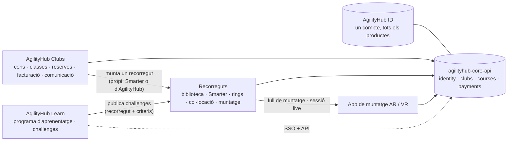

# Visió de plataforma — AgilityHub (Learn · Clubs · ID · Recorreguts · AR)

**v1.0 · 03-09-2026** · Decisions Jordi 03-09 (2a sessió) · Documents que en depenen: `05-desenvolupament/PLA_DESENVOLUPAMENT.md` v2, ADR-009…013, `MODEL_DADES_PLATAFORMA.md`, `05-desenvolupament/specs/`

---

## 1. La visió en una frase

**Una sola plataforma AgilityHub on el club gestiona les classes i munta les pistes, l'alumne aprèn amb Learn i prova els challenges, i tot passa amb un únic compte.** El software de club comença pel Cànic, però és marca blanca des del primer commit i és la porta d'entrada de clubs i alumnes cap a Learn (la monetització).

## 2. Els productes

| Producte | Què és | Estat avui | Stack | Domini | Paper al negoci |
|---|---|---|---|---|---|
| **AgilityHub Learn** | Acadèmia: programa d'aprenentatge, vídeos, challenges | En producció (~1.000 usuaris) | Laravel 10 + MySQL 8 + Vue 3 (repos `agilityhub-api`, `agilityhub-web`); JWT + bcrypt; API a `app.agilitydoghub.com` | learn.agilitydoghub.com | **Monetització** |
| **AgilityHub Clubs** | Gestió del club: cens, classes, reserves, entrenaments, assistència, comunicació, facturació | Aquest projecte (Cànic = client 1) | Spring Boot + MongoDB · React PWA + backoffice | clubs.agilitydoghub.com · clubsadmin.agilitydoghub.com (+ àlies per club: app/admin.agilitycanic.cat) | **Captació** de clubs i alumnes; marca blanca |
| **AgilityHub ID** | Compte únic, login, membresies, selector de productes | Nou (mòdul `identity` del core) | Spring Authorization Server (OIDC) + `apps/id` | id.agilitydoghub.com | Cola de tota la vertical |
| **Recorreguts** (course platform) | Biblioteca de recorreguts, importació Smarter, rings amb geometria, col·locació, sessions de muntatge, challenges | Parcialment fet al `@agilityhub/web-planner` (Next + Supabase + three.js) → es **recupera** al core | `packages/course-core` (TS pur) + `packages/course-ui` (React/three) + mòdul `courses` del core | dins de Clubs (i de Learn) | Diferencial de producte; base de l'AR |
| **App de muntatge AR/VR** | Muntar la pista al camp amb el mòbil (AR) o previsualitzar-la (VR) | **Ja iniciada** al course-builder: app **Unity** amb marcadors **AprilTag** (D-037, export `BuildSessionExportV1`) + placeholder **Quest** (VR) — verificat 05-09 | Unity (AR/VR) consumint el core (OIDC + export de sessió); WebXR només com a pla B | — | «Tota la vertical» |

`agilityhub-core-api` és **la** plataforma: un monòlit modular amb contextos delimitats (`identity`, `clubs`, `courses`, `payments`) i una sola base de dades. Learn s'hi federa (ID) i hi consumeix recorreguts/challenges per API; no es reescriu.

## 3. La vertical — el flux de valor

1. **El club** (Clubs) dona d'alta alumnes i gossos, programa la setmana, cobra les quotes i comunica. Els instructors passen llista i deixen tasques.
2. **El club munta pistes**: tria un recorregut de la seva biblioteca, un fitxer Smarter o un recorregut d'AgilityHub (challenge), el col·loca al ring i el munta (full de muntatge; més endavant, AR). L'alumne veu **què hi ha muntat** abans d'anar a entrenar.
3. **L'alumne aprèn** amb Learn (programa per nivells) i **prova els challenges** al club: el recorregut del challenge està muntat, corre, i el resultat/vídeo torna a Learn.
4. **AgilityHub** veu la progressió de la parella (nivell del gos mapejat a l'escala AgilityHub) a través de clubs i de Learn.

Cada pas és un mòdul que un club pot activar o no (ADR-012): un club només pot tenir cens + classes; un altre, tot.

## 4. Principis de plataforma (manen sobre qualsevol decisió de detall)

1. **Un compte** (AgilityHub ID): l'email és la clau; les credencials de Learn no canvien (ADR-010). Les dades del club queden al tenant; el compte només té identitat i membresies.
2. **Marca blanca real**: club = logo + colors + textos + catàlegs + **mòduls** + **regles configurables** (ADR-002, ADR-012). Cap literal del Cànic al codi.
3. **Internacionalitzable de veritat**: idioma de l'usuari a UI, correus, SMS i notificacions; fus horari, moneda i **perfil de país** per club (ADR-011). Afegir un idioma = afegir fitxers; afegir un país = implementar un perfil.
4. **Pagaments per proveïdor**: SEPA per remesa bancària, Stripe (targeta / SEPA per Stripe) o manual — configurable per club i per abonat (ADR-009).
5. **Recorreguts al core**: `course-core` és el format canònic de recorregut de tota AgilityHub (Clubs, Learn, AR) (ADR-013).
6. **Contract-first**: OpenAPI publicat; front i altres productes consumeixen tipus generats. Un canvi de contracte és un PR coordinat.
7. **Testing exhaustiu al backend** (PLA_BACKEND §9): la lògica viu al core i s'hi prova.
8. **Etapes, no dates**: el pla es mesura per criteris de sortida de cada etapa i es treballa amb 2–3 fils d'IA en paral·lel.

## 5. Fronteres i contractes

| Frontera | Contracte | Direcció |
|---|---|---|
| Learn ↔ ID | OAuth2 grant password (fase 1, login invisible) → OIDC authorization code + PKCE (fase 2, SSO) | Learn és client del core |
| Learn ↔ Recorreguts | `GET /api/v1/courses`, `GET /api/v1/challenges`, `POST /api/v1/challenges/{id}/attempts` (fase 2) | Learn publica challenges (owner AgilityHub) i llegeix intents |
| Clubs ↔ Recorreguts | Mateix core, mòdul `RECORREGUTS` activable | El club té biblioteca pròpia + accés a la pública d'AgilityHub |
| AR ↔ Recorreguts | OIDC natiu + `GET /rings/{id}`, `GET /placements/{id}`, `PATCH /build-sessions/{id}` (live) | L'AR és un client més |
| Club ↔ web del club | API pública de lectura amb clau per club (activitats, modalitats, textos) | Només lectura, mai noms |
| Consola AgilityHub ↔ Clubs | Rol de plataforma `AGILITYHUB_ADMIN`; `POST /api/v1/clubs` amb clonatge de catàlegs base | Onboarding d'un club en menys d'una hora |

## 6. Full de ruta per releases (etapes al `PLA_DESENVOLUPAMENT.md`)

| Release | Contingut | Criteri de sortida |
|---|---|---|
| **R1 · «Cànic operatiu» — objectiu final d'octubre 2026** | Etapes E0–E12: ID, cens, alta, planificació, reserves, assistència, comunicacions, facturació + pagaments, recorreguts (course-core recuperat: biblioteca, Smarter, rings, col·locació, recorregut muntat, full de muntatge), consola de clubs mínima, migració Playoff, go-live | El Cànic funciona sense Playoff; un segon club es pot crear des de la consola sense codi |
| **R2 · «Un compte, tots els productes»** | Learn fase 2 (botó «Continua amb AgilityHub», sessió compartida, selector de productes), challenges v1 (Learn publica, el club munta, l'alumne registra intents), contingut Learn recomanat pel nivell del gos dins Clubs | Un alumne entra a Learn i a Clubs sense tornar a identificar-se; un challenge es corre en un club |
| **R3 · «Muntatge al camp»** | Prova de camp de l'app Unity existent (AprilTag) connectada al core (S20 v0.2) → tolerància de col·locació i dispositius → ADR-014 → app de muntatge en producció (i Quest/VR si convé) | Muntar una pista real amb l'app en un ring calibrat |
| **R4 · «SAAS»** | Facturació del SAAS als clubs (Stripe), autoservei de branding, més perfils de país, estadístiques/lliga social (mockups 27/27b), TPV d'activitats a externs | N clubs actius amb onboarding autoservei |

## 7. Decisions preses el 03-09 (2a sessió) — resum

| Tema | Decisió |
|---|---|
| Identitat | AgilityHub ID com a mòdul `identity` del core (Spring Authorization Server, OIDC); COMPTE global + MEMBRESIA per club; usuaris de Learn importats amb el seu hash bcrypt (**sense canviar contrasenyes**); Learn fase 1 = login invisible per grant password (~2 dies a Laravel) |
| Recorreguts | Course-core i col·locació **es recuperen a l'MVP** (R1); el core és la font de veritat de recorreguts, rings i challenges; el web-planner (Next + Supabase) es retira |
| i18n | Idioma total (UI + correus + SMS + notificacions, ICU) + **perfil de país** per club; Espanya implementada, la resta darrere d'interfície; fus horari i moneda per club |
| Mòduls per club | Tots activables des de l'MVP: entrenaments lliures, facturació, packs, activitats, grup familiar, FAQ, SMS, push, llista d'espera, tasques, recorreguts, inactivitat, enllaç Learn. «Teràpia» no és un mòdul: és una modalitat del Cànic configurada com a dada |
| Regles generalitzades | Instructors per classe = màxim N (Cànic 1) · llista d'espera «tothom alhora» o FIFO · límits per gos o per persona · nivells opcionals |
| Pagaments | REBUT independent del proveïdor; cobrament per `SEPA_XML`, `STRIPE` (compte Stripe propi de cada club) o `MANUAL`; classe individual amb càrrec per consum o pagament a l'acte |
| Escala AgilityHub | `NIVELL.agilityhubLevel` opcional des d'ara |
| Repos i noms | `agilityhub-core-api` + `agilityhub-core-web` · productes «AgilityHub Learn / Clubs / ID» · id./clubs./clubsadmin./core.agilitydoghub.com |
| Calendari | Per etapes amb criteris de sortida, sense setmanes; objectiu R1 a final d'octubre; 2–3 fils d'IA en paral·lel |
| Detall | Una spec per vertical a `05-desenvolupament/specs/` + mockups partits per pantalla a `03-disseny/mockups/pantalles/` |

## 8. Punts oberts de la visió (no bloquegen R1)

- **Learn**: confirmar si hi ha login social o usuaris sense contrasenya abans d'escriure l'script d'importació (cal revisar el codi de `AH_LearnPlatform`).
- **Web-planner**: revisió del codi real de `course-core` (format del model, tests) abans de tancar l'etapa E9 — la spec S16 marca què cal verificar.
- **Challenges**: definició funcional a Learn (què és un challenge, criteris, vídeo, validació) — R2.
- **AR/VR**: viabilitat tècnica (precisió del calibratge amb marcadors, dispositius) — R3.
- **Model comercial del SAAS**: preu per club, qui paga els SMS, Stripe Connect o no — R4.
