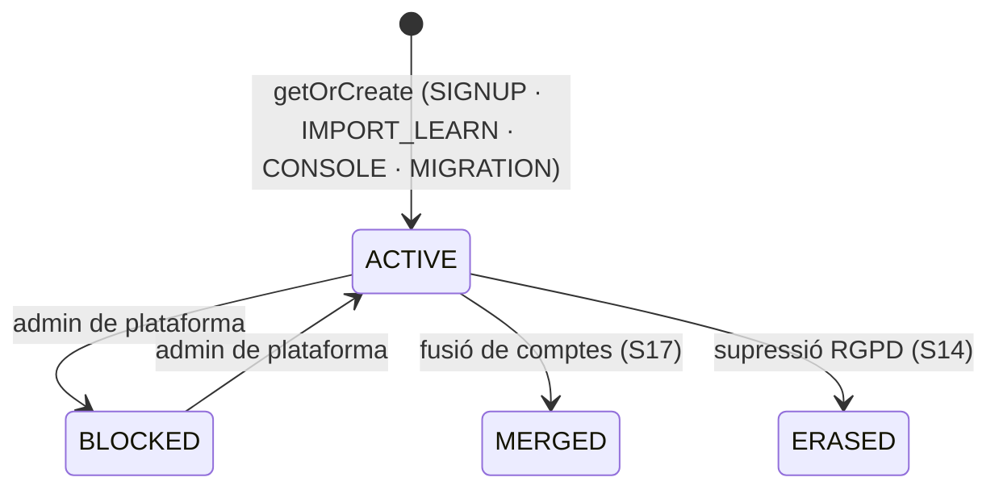
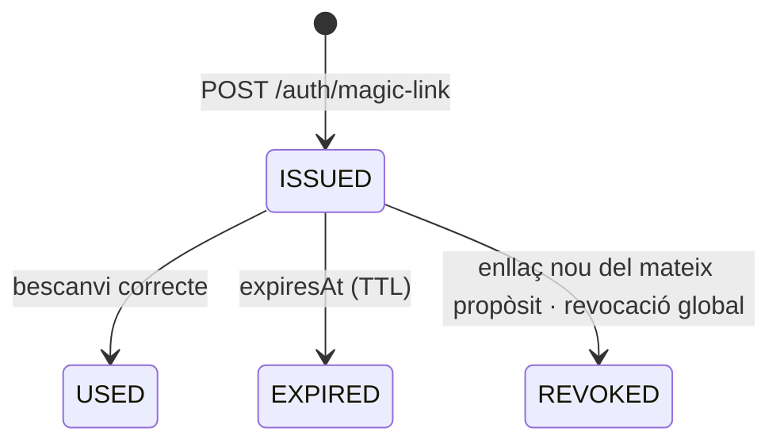

# S01 — AgilityHub ID i accés

**Etapa:** E1 (l'esquelet d'`identity` i el grant de contrasenya a E0 per a les proves) · **Mòduls:** — (transversal; el correu transaccional és ADR-005) · **Pantalles:** 01, 02, 03b, 12 (files «Canvia la contrasenya», «Canviar de perfil», «Idioma», tancar sessió) (`03-disseny/mockups/pantalles/mobil/`), `apps/id` (sense mockup: login OIDC, enllaç màgic, contrasenya, compte, selector de productes — design system) · **Model:** PLATAFORMA §1 (ACCOUNT, MEMBERSHIP, tokens, OIDC_CLIENT) — **substitueix** USUARI de v1.6 · ADR-004 + ADR-010 · **Estat:** esborrany (03-09-2026) · **Versió:** 0.2 (05-09: revisió del codi de Learn, §14)

## 1. Propòsit i abast

Resol **qui és l'usuari i com entra** a qualsevol producte AgilityHub: el compte únic (`Account`, clau = email), les pertinences a clubs amb rols (`Membership`), l'entrada per **enllaç màgic** (via principal) o **contrasenya opcional**, la sessió persistent de 30 dies lliscants, la tria de perfil recordada (03b), el canvi de perfil sense tornar a entrar (12), el JWT amb context de club, la **impersonació** («Entra com l'abonat», D10) auditada, l'**Authorization Server OIDC** per als altres productes (Learn fase 2, app AR), la **federació de Learn** sense canviar contrasenyes (importació de comptes + adaptador de login a Laravel), i les pantalles d'`apps/id`. Aquí viu la seguretat de l'accés (rate limit, bloqueig progressiu, rotació de refresh tokens, esdeveniments de seguretat).

| Fora d'abast | On viu |
|---|---|
| Alta d'abonat i creació del compte a la validació | S04 (crida `AccountService.getOrCreate`) |
| Rols des de D10/D17 (escriptura de `Membership.roles`) | S03/S05 (criden `MembershipService`) |
| Preferències d'avís, push, contingut de 12 llevat de les files d'accés | S11 |
| Enviament dels correus (motor) | S11 (aquí: contingut i moment de N-25/N-26/N-27) |
| Consola de plataforma, rols de plataforma, canvi de context multi-club | S17 |
| Selector de productes «estil Google», SSO complet amb Learn (redirecció) | S19 (R2) — aquí es deixa preparat |
| Esdeveniments de seguretat: consulta | S14 (aquí s'escriuen) |

## 2. Pantalles i rutes

| Mockup | App | Ruta | Rol | Comportament |
|---|---|---|---|---|
| 01 | clubs | `/entrar` | ANON | Logo del club (tema per host). Camps «correu@exemple.cat» + «contrasenya» + **[ENTRA]** → `POST /oauth2/token` (`grant_type=password`). Enllaç «Envia'm un enllaç per entrar sense contrasenya» (via principal: amb el correu informat → `POST /auth/magic-link`; sense → focus al camp amb missatge «Escriu el teu correu»). «Has oblidat la contrasenya? Recupera-la» → mateix `POST /auth/magic-link` amb `purpose=RESET` (l'enllaç porta a 02 «Ja hi ets»). «Encara no hi ets? Apunta-t'hi →» → `/apuntat-hi` (S04) només si `signup.enabled`. Resposta sempre neutra: «Si el correu és al club, hi rebràs l'enllaç» (no revela existència). Errors: credencials → «Correu o contrasenya incorrectes» (`401 INVALID_CREDENTIALS`), compte bloquejat temporalment (`429 LOGIN_LOCKED` + `Retry-After`) → «Massa intents. Torna-ho a provar d'aquí a {min} min», sense membresia al club del host → «Aquest correu no pertany a {club}» (`403 NO_MEMBERSHIP`), membresia suspesa → «El teu accés està desactivat. Contacta amb el club». Peu «{club} · {població}». |
| 02 | clubs | `/activacio` (des de l'enllaç) | ANON→MEMBER | S'obre amb l'enllaç màgic (`GET /activacio?t=…`): la PWA bescanvia el token (`POST /oauth2/token grant_type=urn:agilityhub:grant:magic-link`) i mostra: «Benvinguda, {nom}!» (ICU per `gender`; `purpose=RESET` → títol «Ja hi ets»), text «Has entrat amb l'enllaç del correu. La sessió queda iniciada en aquest dispositiu i es manté pels propers dies.», badge «Compte activat» (només primer accés: `Account.emailVerifiedAt == null` abans), **[CONTINUAR]** (→ 03b si té > 1 perfil, si no → 03), bloc secundari «Si vols, tria una contrasenya per a futurs accessos» amb «nova contrasenya» / «repeteix-la» + [DESA LA CONTRASENYA] → `PUT /me/password` (sessió ja iniciada) → toast «Contrasenya desada» i segueix. Peu: «La contrasenya és opcional: sempre pots entrar amb l'enllaç del correu. La sessió queda oberta en aquest dispositiu.» Enllaç caducat/usat → pantalla «Aquest enllaç ja no és vàlid» + botó «Envia-me'n un de nou» (→ 01 amb el correu preomplert). |
| 03b | clubs | `/perfil-acces` | MEMBER+ | Només si la `Membership` té > 1 rol: «Hola, {nom}!» «Com hi vols entrar avui?» + targetes «Com a alumna · Les meves reserves, classes i entrenaments» / «Com a instructora · Grups del dia, passar llista i fitxes d'alumnes» / «Com a administradora · Gestió del club — millor des de l'ordinador» (gènere per ICU; només les del rol que té) + casella «Recorda la meva tria» (per defecte marcada) → `PUT /me/profile {activeProfile, remember}`; peu «Podràs canviar de perfil des del teu perfil, sense tornar a entrar.» Amb tria recordada, el següent accés hi va directe. «Com a administradora» al mòbil obre `clubsadmin` (mateix compte, redirecció amb el token: R-01-13). |
| 12 (files) | clubs | `/perfil` | MEMBER+ | «Canvia la contrasenya» → full amb contrasenya actual (si en té) + nova + repeteix → `PUT /me/password`. «Canviar de perfil · {perfil actual}» (només amb > 1 rol) → 03b sense re-login. «Idioma · Català ▾» → `PATCH /me {locale}` (S11 documenta la resta). «Tanca la sessió» (assumpció: fila al final, sense mockup) → `POST /oauth2/revoke` + neteja local. |
| `apps/id` | id | `/login`, `/magic-link`, `/set-password`, `/account`, `/products` | ANON/compte | Pantalla de login per al flux OIDC (`/oauth2/authorize` redirigeix aquí amb `client_id`): mateixos elements que 01 amb la marca del client (AgilityHub o club). `/magic-link?t=` bescanvia i torna al `redirect_uri`. `/account`: nom, email, idioma, contrasenya, sessions actives (dispositius) amb «Tanca aquesta sessió», membresies (club + rols) i productes. `/products`: selector (R2; a R1 mostra enllaços estàtics a Learn i Clubs). Textos en ca/es/en; sense dades del club. |
| D10 | clubs-admin | `/abonats/:id` | ADMIN | **«Entra com l'abonat»** → `POST /members/{id}/impersonation-token` (S03) → obre `clubs` (host del club) en una pestanya nova amb `#impersonation=<token>`; la PWA el guarda **només en memòria de sessió** (mai al storage persistent), mostra el bàner «Estàs veient l'app com {nom} · Surt» i tot el que fa porta `origin=BACKOFFICE`. «Surt» → `POST /oauth2/revoke` del token d'impersonació. |

## 3. Entitats i camps

### `Account` (`accounts`, global — `GlobalRepository`)
| Camp | Tipus | Obl. | Validació / notes |
|---|---|---|---|
| `id` | UUID | sí | `sub` del JWT |
| `email` | string | sí | normalitzat (trim, minúscules, NFC); únic (índex únic + `emailHash` per a cerques sense revelar) |
| `emailVerifiedAt` | instant | no | primer bescanvi d'enllaç màgic o Checkout completat |
| `passwordHash` | string | no | bcrypt `$2y$`/`$2a$`/`$2b$` (importat de Learn) o argon2id (`$argon2id$`) per a noves; `null` = només enllaç màgic |
| `name`, `givenName`, `familyName`, `avatarUrl` | string | `name` sí | `name` es deriva de l'abonat a la validació (S04) |
| `locale` | string | sí | BCP-47 dins dels idiomes de producte (`ca`, `es`, `en`); per defecte el de la pantalla d'alta |
| `platformRoles[]` | enum | — | `AGILITYHUB_ADMIN` (S17) |
| `externalIds` | map | — | `learnUserId` (importació) |
| `status` | enum | sí | `ACTIVE` · `BLOCKED` (admin de plataforma) · `MERGED` (`mergedIntoAccountId`) · `ERASED` (S14) |
| `security` | objecte | — | `failedLogins`, `lockedUntil`, `passwordChangedAt`, `tokenFamilyVersion` (revocació global) |
| `createdAt`, `createdSource` (`SIGNUP` · `IMPORT_LEARN` · `CONSOLE` · `MIGRATION`), `lastLoginAt`, `lastLoginClientId` | | | |

### `Membership` (`memberships`)
`accountId`, `clubId` (únic per parell), `roles[]` (`MEMBER` · `INSTRUCTOR` · `ADMIN`; ≥ 1), `memberId`, `instructorId?`, `defaultProfile` (`MEMBER` · `INSTRUCTOR` · `ADMIN` · `null`), `rememberProfile` (bool), `status` (`ACTIVE` · `SUSPENDED` · `ERASED`), `adminProfile?` (S05), `createdAt`, `lastAccessAt`.

### Tokens
| Col·lecció | Camps | Notes |
|---|---|---|
| `magic_link_tokens` | `tokenHash` (SHA-256 del token de 32 bytes), `accountId`, `clubId?`, `clientId`, `purpose` (`LOGIN` · `RESET` · `WELCOME` · `RECOGNITION` (S04) · `ACCESS_RESEND`), `redirectUri?`, `expiresAt` (TTL), `usedAt?`, `ipHash`, `userAgent` | un sol ús; `WELCOME` amb validesa `auth.welcomeLinkDays` (proposta S04, 7 dies), la resta `auth.magicLinkMinutes` (15) |
| `refresh_tokens` | `tokenHash`, `accountId`, `clientId`, `clubId?`, `activeProfile?`, `familyId`, `deviceLabel` (UA resumit), `createdAt`, `expiresAt`, `lastUsedAt`, `revokedAt?`, `replacedByHash?` | rotació a cada ús; reutilització d'un token rotat → revoca tota la família (`REFRESH_TOKEN_REUSED`) |
| `impersonation_grants` | `actorAccountId`, `clubId`, `impersonatedMemberId`, `impersonatedAccountId`, `reason?`, `expiresAt`, `revokedAt?` | JWT de 60 min (`auth.impersonationMinutes`), no refrescable |
| `oidc_clients` | `clientId`, `type` (`PUBLIC` · `CONFIDENTIAL`), `secretHash?`, `redirectUris[]`, `postLogoutRedirectUris[]`, `grantTypes[]`, `scopes[]`, `branding` (`AGILITYHUB` · `CLUB_BY_HOST`), `accessTokenMinutes` (15), `refreshDays` (30), `requirePkce` | seed: `clubs-app` (PUBLIC, PKCE, grants password + magic-link + refresh), `clubs-admin` (idem), `id-web` (PUBLIC, authorization_code + PKCE), `learn` (CONFIDENTIAL, password + refresh a R1; authorization_code a R2), `ar-app` (PUBLIC, PKCE, R3) |

### JWT d'accés (15 min, RS256, `kid` rotatiu, JWKS a `/.well-known/jwks.json`)
`iss = https://id.agilitydoghub.com`, `sub = accountId`, `aud = clientId`, `email`, `name`, `locale`, `platformRoles[]`, i **context de club** quan el client és de club: `clubId`, `roles[]`, `memberId?`, `instructorId?`, `activeProfile`; impersonació: `actorAccountId`, `impersonatedMemberId`, `imp = true`. Sense context (`apps/id`): cap camp de club. Claims sempre derivades de la BBDD en emetre; un canvi de rols es reflecteix al següent refresh (≤ 15 min) o immediatament amb `tokenFamilyVersion` (R-01-10).

## 4. Regles de negoci

| Regla | Enunciat | Paràmetres | Exemple |
|---|---|---|---|
| **R-01-01 Email = identitat** | Un `Account` per email normalitzat. `AccountService.getOrCreate(email, name, locale, source)` és l'única via de creació (S04 validació, S17 consola, S18 migració, importació Learn). Canvi d'email: només des d'`/account` amb verificació del nou (enllaç màgic `purpose=LOGIN` al nou correu) i correu d'avís a l'antic (N-26 variant). `Member.contactEmails[0]` és independent (S03). | — | `Laura.Serra@Exemple.cat ` → `laura.serra@exemple.cat`. |
| **R-01-02 Context pel host** | La PWA/backoffice envia `client_id` i el host; el servidor resol el `clubId` pel host (`Club.domains`) i **només emet tokens de club si el compte té una `Membership ACTIVE` en aquell club** (`403 NO_MEMBERSHIP`; `SUSPENDED` → `403 MEMBERSHIP_SUSPENDED`). El token porta el context d'**un sol** club. Host desconegut → `404`. | — | `app.agilitycanic.cat` → Cànic; `laura@…` amb membresia → token amb `clubId` del Cànic. |
| **R-01-03 Grant de contrasenya** | `POST /oauth2/token grant_type=password` (només clients first-party amb PKCE no aplicable; `learn` confidencial amb `client_secret`): comprova `status ACTIVE`, `passwordHash` no nul i verificació (bcrypt o argon2id segons prefix), bloqueig (R-01-08). Sense contrasenya establerta → `401 INVALID_CREDENTIALS` (mateix missatge: no es revela). Èxit → access + refresh (R-01-06) + `lastLoginAt`. | `auth.passwordMinLength = 8` | Usuari de Learn amb hash `$2y$10$…` entra a Clubs amb la mateixa contrasenya. |
| **R-01-04 Enllaç màgic** | `POST /auth/magic-link {email, purpose, client_id, redirect_uri?}` → resposta **sempre** `202` neutra. Si el compte existeix (o, per a `client_id` de club, té membresia): token aleatori 32 bytes (base64url), es desa el hash, `expiresAt = now + auth.magicLinkMinutes`, correu N-25 amb `https://{host del client}/activacio?t=…` (client de club) o `https://id.agilitydoghub.com/magic-link?t=…` (OIDC). Bescanvi: `grant_type=urn:agilityhub:grant:magic-link&token=…&client_id=…` → valida hash, no usat, no caducat, `client_id` coincident → marca `usedAt`, `emailVerifiedAt` si nul, emet tokens, `MagicLinkRequested` s'havia emès a la petició. Segon bescanvi → `400 MAGIC_LINK_INVALID` + `SecurityEvent MAGIC_LINK_INVALID`. Màxim 3 enllaços vius per compte i propòsit (els anteriors es revoquen en crear-ne un de nou). | `auth.magicLinkMinutes = 15`, `auth.welcomeLinkDays` (7, `WELCOME`) | Laura demana l'enllaç a les 10:00; a les 10:20 → «Aquest enllaç ja no és vàlid». |
| **R-01-05 Contrasenya opcional** | `PUT /me/password {current?, new, repeat}` amb sessió iniciada: `current` obligatori només si `passwordHash` no és nul; `new` ≥ `auth.passwordMinLength`, no igual a l'email, comprovació contra llista de contrasenyes compromeses (k-anonimity HIBP opcional, §13); hash argon2id; `passwordChangedAt`; revoca les **altres** sessions (`tokenFamilyVersion++`, es conserva la família actual); N-26. «Recupera-la» (01) = enllaç màgic `RESET` → 02 «Ja hi ets» → l'usuari estableix la nova. Mai s'envia una contrasenya per correu. | `auth.passwordMinLength` | Laura tria «duna2023» (8) → OK; «1234567» → `400 PASSWORD_TOO_SHORT`. |
| **R-01-06 Sessió persistent** | Refresh token opac (32 bytes) per dispositiu, `expiresAt = now + auth.sessionDays`, **lliscant**: cada `grant_type=refresh_token` rota el token i estén `expiresAt`; l'access token dura 15 min. Emmagatzematge a la PWA: `refresh` a `localStorage` xifrat amb clau del dispositiu (WebCrypto, no exportable) — cookie httpOnly no és possible entre `clubs.*` i `core.*` sense `SameSite=None` + tercers (decisió: storage; §13). Sense ús durant 30 dies → `401 REFRESH_EXPIRED` → 01. Dispositiu nou → 01. Nombre màxim de sessions per compte: `auth.maxSessions` (proposta, 10; en superar-lo es revoca la més antiga). | `auth.sessionDays = 30` | Laura entra el 5-10 i usa l'app el 20-10 → sessió fins al 19-11. |
| **R-01-07 Tria de perfil** | Perfils = rols de la `Membership` del context. Amb 1 rol → cap 03b, `activeProfile` = aquell. Amb > 1: si `rememberProfile ∧ defaultProfile` → directe; si no → 03b. `PUT /me/profile {activeProfile, remember}` valida que el rol existeix (`422 PROFILE_NOT_AVAILABLE`), desa `defaultProfile`/`rememberProfile` (si `remember`) i **emet un access token nou** amb `activeProfile` (el refresh guarda l'`activeProfile` per als següents). El perfil actiu **només** canvia la navegació de l'app; l'autorització del back és per la unió de rols (MATRIU_PERMISOS). `ADMIN` triat al mòbil → redirecció a `clubsadmin` amb el mateix refresh (R-01-13). Un rol retirat mentre és el perfil actiu → al següent refresh, `activeProfile` cau al primer rol disponible i la PWA mostra «El teu perfil ha canviat». | — | Estel (alumna + instructora) marca «Recorda la meva tria» com a instructora → el proper accés obre 20 directament. |
| **R-01-08 Antiabús i bloqueig** | Per compte: 5 errors de contrasenya en 15 min → `lockedUntil = now + 15 min` (progressiu: ×2 fins a 24 h) → `429 LOGIN_LOCKED` + `Retry-After` + `SecurityEvent LOGIN_LOCKED`; l'enllaç màgic **no** es bloqueja (és la via de recuperació) però té rate limit. Per IP (Caddy `X-Forwarded-For`): `/oauth2/token` 30/min, `/auth/magic-link` 10/h per email i 60/h per IP → `429 RATE_LIMITED`. Respostes de temps constant en la verificació de credencials (`dummy hash` si no hi ha compte). Cap enumeració d'emails: mateixos missatges. | — | 6è intent fallit de `laura@…` en 10 min → bloquejada 15 min; l'enllaç màgic segueix funcionant. |
| **R-01-09 Impersonació** | `POST /members/{id}/impersonation-token` (ADMIN del mateix club, mai un token ja impersonat → `403 IMPERSONATION_DENIED`): comprova `Member ACTIVE/INACTIVE` amb `Membership`; crea `ImpersonationGrant` (60 min) i emet un JWT amb `sub = compte de l'abonat`, `roles = [MEMBER]`, `actorAccountId`, `impersonatedMemberId`, `imp = true`, **sense refresh**. `ImpersonationStarted` + `AuditEntry IMPERSONATION_STARTED{reason}`. Tota escriptura amb aquest token porta `origin = BACKOFFICE` i l'auditoria registra els dos ids (S14 R-14-09). Endpoints `ADMIN`/`INSTRUCTOR` rebutgen `imp = true` (`403`). `POST /oauth2/revoke` → `ImpersonationEnded`. Un admin que és alhora aquell abonat no necessita impersonar (perfil). | `auth.impersonationMinutes = 60` | Jordi entra com la Laura i reserva dc 18:50 → `Booking.origin = BACKOFFICE`, N-36 a la Laura. |
| **R-01-10 Revocació** | `POST /oauth2/revoke {token}` (refresh o impersonació). Revocació global d'un compte (canvi de contrasenya, admin de plataforma, supressió RGPD): `tokenFamilyVersion++` → tots els refresh anteriors invàlids; els access tokens vius caduquen en ≤ 15 min (acceptat; per a `BLOCKED`/`ERASED` el filtre comprova una llista negra en memòria de `sub` bloquejats, TTL 15 min). Retirar tots els rols d'una membresia (`SUSPENDED`) → mateix mecanisme per a aquell `clubId`. | — | Baixa de la Laura → `Membership SUSPENDED` → al següent refresh, `403 MEMBERSHIP_SUSPENDED`. |
| **R-01-11 OIDC per a altres productes** | `GET /.well-known/openid-configuration`, `/oauth2/authorize` (code + PKCE S256 obligatori per a clients públics; `prompt`, `login_hint`, `ui_locales`), `/oauth2/token`, `/oauth2/userinfo` (`sub, email, email_verified, name, locale, memberships[{clubId, clubName, roles}]` amb scope `memberships`), `/oauth2/revoke`, `/connect/logout` (RP-initiated), JWKS. La pantalla de login viu a `apps/id` (`/login?flow=…`): el servidor guarda l'estat de l'autorització en una cookie de sessió **del domini `id.*`** (httpOnly, SameSite=Lax) — és la sessió compartida que a R2 dona l'SSO (S19). Clients registrats només per seed/consola (S17). Scopes: `openid profile email memberships offline_access`. | — | L'app AR fa `authorize` amb PKCE → login a `id.*` → `code` → tokens. |
| **R-01-12 Federació de Learn (fase 1)** | **Importació** (`identity:import-learn <csv>`: `id,email,password,name,locale,created_at`; hash bcrypt tal qual; `createdSource = IMPORT_LEARN`, `externalIds.learnUserId`; email ja existent → es conserva el compte i s'afegeix `learnUserId` (si el compte no tenia contrasenya, adopta el hash de Learn; si en tenia, es manté la nostra i s'informa al report); idempotent per `learnUserId`; report sense dades personals (comptes: creats/fusionats/errors). **Adaptador a Laravel** (~2 dies): `LoginController` → `POST /oauth2/token` (`grant_type=password`, `client_id=learn`, `client_secret`); èxit → `Auth::login($userLocal)`; `RegisterController`/`ResetPassword`/`ChangePassword` → primer `POST /platform/accounts` (client `learn`, scope `accounts:write`) o `PUT /accounts/{id}/password`, després local; columna `users.agilityhub_account_id`. Rollback: `Auth::attempt()` local. **Contrasenyes no canvien.** Divergències (usuari canvia la contrasenya a Learn amb l'adaptador caigut) → l'adaptador reintenta amb cua; mentre no sincronitza, Learn accepta la local. | — | 1.240 usuaris importats en 40 s; 3 amb email duplicat → fusionats. |
| **R-01-13 Canvi d'app amb la mateixa sessió** | Del mòbil (`clubs`) a `clubsadmin` (i a l'inrevés): `POST /oauth2/token grant_type=refresh_token` amb `client_id` destí **no** és vàlid (refresh lligat al client). Mecanisme: `POST /auth/handoff {targetClientId}` (autenticat) → codi d'un sol ús (60 s) → `https://{host destí}/entrar?handoff=…` → el destí bescanvia (`grant_type=urn:agilityhub:grant:handoff`) i obté els seus tokens. Sense re-login. | — | Estel tria «Com a administradora» → `admin.agilitycanic.cat` obert i entrat. |
| **R-01-14 Idioma i dades del compte** | `PATCH /me {locale, name?}`: `locale` ∈ idiomes de producte; canvia el `locale` a totes les apps (claim al següent access token; la PWA el rellegeix a `GET /me`). El nom d'abonat (S03) és independent del `name` del compte; S03 sincronitza `Account.name` quan l'admin edita l'abonat i el compte només té aquesta membresia (assumpció §13). | — | Laura tria «Castellà» a 12 → Learn també en castellà. |
| **R-01-15 `GET /me`** | Agregat d'arrencada de l'app: `{account {id, email, name, locale, platformRoles}, membership {clubId, roles, activeProfile, profiles[], memberId, instructorId, defaultProfile, rememberProfile}, impersonation?: {actorName}, features: branding.modules}` — la PWA el crida després de cada login/refresh i en tornar a primer pla. | — | — |
| **R-01-16 Seguretat de transport i claus** | TLS només; JWT RS256 amb rotació de claus (2 vius, `kid`), claus privades a `.env`/volum; secrets de clients `CONFIDENTIAL` hash bcrypt; CORS: hosts de clubs registrats + `id.*`; cookies de `id.*` `Secure` + `HttpOnly`; `Strict-Transport-Security`; cap token a URL llevat del codi de handoff/enllaç màgic (un sol ús, curts); logs sense tokens ni contrasenyes. | — | — |
| **R-01-17 Tenant i rols** | Cap endpoint d'aquest vertical accepta `clubId` del client; el context surt del host + membresia. `Account` és global però **cap** endpoint de club el llista; `GET /members` (S03) no exposa `passwordHash` ni `security`. `AGILITYHUB_ADMIN` sense membresia no obté token de club (S17 usa `apps/id`/consola). | — | — |

## 5. Estats i transicions

`RefreshToken`: `ACTIVE → ROTATED` (ús) · `ACTIVE/ROTATED → REVOKED` (logout, família reutilitzada, `tokenFamilyVersion`) · `ACTIVE → EXPIRED`. `Membership.status`: `ACTIVE ⇄ SUSPENDED` (S03/S13) · `→ ERASED` (S14). `ImpersonationGrant`: `ACTIVE → EXPIRED | REVOKED`.

| Transició | Qui | Condició | Efectes | Esdeveniment |
|---|---|---|---|---|
| compte creat | S04/S17/S18/import | email nou | `Account ACTIVE` | `AccountCreated{source}` |
| enllaç sol·licitat | ANON | compte (i membresia si client de club) | token + correu | `MagicLinkRequested` |
| login OK | ANON | R-01-03/04 | `lastLoginAt`, refresh nou | — (`SecurityEvent` només en fallada) |
| contrasenya canviada | compte | R-01-05 | hash nou, `tokenFamilyVersion++` | `PasswordChanged` |
| perfil triat | compte | R-01-07 | `defaultProfile`, token nou | — |
| impersonació | ADMIN | R-01-09 | grant + JWT | `ImpersonationStarted` / `ImpersonationEnded` |
| rols canviats | S03/S05 | — | claims al proper refresh | `MembershipChanged` |

## 6. API

Hosts: `id.agilitydoghub.com` per als endpoints OAuth2/OIDC i `apps/id`; la resta a `core.*/api/v1`. Rols: `ANON` = sense token; `compte` = qualsevol token vàlid.

| Mètode | Ruta | Rol | Idem. | Descripció | Cos / paràmetres | Respostes i errors |
|---|---|---|---|---|---|---|
| GET | `/.well-known/openid-configuration` · `/.well-known/jwks.json` | ANON | — | descoberta OIDC | — | `200` |
| POST | `/oauth2/token` | ANON (client) | — | grants `password` · `urn:agilityhub:grant:magic-link` · `urn:agilityhub:grant:handoff` · `authorization_code` · `refresh_token` | form-urlencoded segons grant (`client_id`, `client_secret?`, `code_verifier?`, `username/password`, `token`, `refresh_token`, `scope?`) | `200 {access_token, token_type, expires_in, refresh_token?, id_token?, scope}` · `400 invalid_grant` (`MAGIC_LINK_INVALID`, `HANDOFF_INVALID`, `REFRESH_EXPIRED`, `REFRESH_REUSED`) · `401 INVALID_CREDENTIALS` · `403 NO_MEMBERSHIP` / `MEMBERSHIP_SUSPENDED` / `ACCOUNT_BLOCKED` · `429 LOGIN_LOCKED` / `RATE_LIMITED` |
| GET | `/oauth2/authorize` | ANON | — | flux code + PKCE (clients OIDC) | `response_type=code, client_id, redirect_uri, scope, state, code_challenge, code_challenge_method=S256, login_hint?, ui_locales?, prompt?` | redirecció a `apps/id /login` o al `redirect_uri` amb `code` · `400 invalid_request` |
| POST | `/oauth2/revoke` | compte | sí | revoca refresh o impersonació | `{token}` | `200` |
| GET | `/oauth2/userinfo` | compte (scope) | — | claims | — | `200` |
| GET | `/connect/logout` | — | — | RP-initiated logout (sessió `id.*`) | `id_token_hint, post_logout_redirect_uri` | redirecció |
| POST | `/auth/magic-link` | ANON | — | R-01-04 | `{email, purpose: LOGIN·RESET, client_id, redirect_uri?}` | `202` sempre · `429 RATE_LIMITED` |
| POST | `/auth/handoff` | compte | — | R-01-13 | `{targetClientId}` | `201 {code, url}` · `403 NO_MEMBERSHIP` (el rol destí) |
| GET | `/me` | compte | — | R-01-15 | — | `200` |
| PATCH | `/me` | compte | — | R-01-14 | `{locale?, name?}` | `200` · `400 LOCALE_NOT_SUPPORTED` |
| PUT | `/me/password` | compte (no `imp`) | — | R-01-05 | `{current?, new, repeat}` | `200` · `400 PASSWORD_TOO_SHORT` / `PASSWORD_MISMATCH` / `PASSWORD_COMPROMISED` · `401 INVALID_CREDENTIALS` (current) · `403` (impersonat) |
| PUT | `/me/profile` | compte (context de club) | — | R-01-07 | `{activeProfile, remember}` | `200 {access_token}` · `422 PROFILE_NOT_AVAILABLE` |
| GET | `/me/sessions` · DELETE `/me/sessions/{id}` | compte | — | dispositius (`/account`) | — | `200` |
| POST | `/members/{id}/impersonation-token` | ADMIN (no `imp`) | — | R-01-09 (definit a S03, implementat aquí) | `{reason?}` | `201 {token, expiresAt}` · `403 IMPERSONATION_DENIED` · `404` |
| POST | `/platform/accounts` · PUT `/accounts/{id}/password` | client `learn` (scope `accounts:write`) · S17 | sí | R-01-12 (adaptador Laravel) | `{email, name, locale, passwordHash?}` · `{passwordHash}` | `201`/`200` · `409 EMAIL_EXISTS` |
| CLI | `identity:import-learn <csv> [--dry-run]` | ops | sí | R-01-12 | — | report |

Serveis interns: `AccountService.getOrCreate`, `MembershipService.setRoles/suspend/resume`, `TokenService.issue*`, `CurrentUser` (claims tipades per als altres contextos), `SecurityEventWriter` (S14).

## 7. Esdeveniments

**Emesos**: `AccountCreated{accountId, email(hash), source}` · `MagicLinkRequested{accountId, clientId, purpose}` · `PasswordChanged{accountId}` · `MembershipChanged{accountId, clubId, roles before/after, status}` (quan S03/S05 criden `MembershipService`) · `ImpersonationStarted{actorAccountId, memberId, clubId, grantId}` · `ImpersonationEnded{grantId, reason: LOGOUT·EXPIRED}` · `AccessResent` (S03 el demana: aquí s'emet en crear l'enllaç `ACCESS_RESEND`) · **nous (§13)**: `AccountLocaleChanged{accountId, locale}`, `AccountEmailChanged{accountId}`, `SessionRevoked{accountId, familyId, reason}`, `LearnAccountsImported{created, merged, errors}`.

**Consumits**: `MemberValidated` (S04 crida `getOrCreate` + `Membership` dins la seva transacció — no és consumidor asíncron) · `MemberStatusChanged{LEFT}` (S13) → `Membership SUSPENDED` · `AccountErasureRequested` (S14) → revoca sessions; `AccountErased` → `status ERASED`.

**Esdeveniments de seguretat** (S14 R-14-17, escrits aquí): `LOGIN_FAILED`, `LOGIN_LOCKED`, `MAGIC_LINK_INVALID`, `REFRESH_TOKEN_REUSED`, `IMPERSONATION_DENIED`, `HANDOFF_INVALID`.

## 8. Notificacions

| Codi | Moment | Públic → canals | Variables |
|---|---|---|---|
| N-25 Enllaç per entrar | `MagicLinkRequested` (`LOGIN`, `RESET`, `RECOGNITION`) | compte → EMAIL (SYSTEM, no configurable) | `link`, `expires_minutes`, `club_name` (client de club) o «AgilityHub» |
| N-02 Benvinguda i accés | `MemberValidated` (S04) — l'enllaç és `purpose=WELCOME` | MEMBER → EMAIL | `member_first_name`, `gender`, `club_name`, `link` |
| N-26 Contrasenya establerta/canviada | `PasswordChanged` · canvi d'email (variant) | compte → EMAIL | `changed_at`, `device` |
| N-27 Accés reenviat | `AccessResent` (D10, S03) | MEMBER → EMAIL | `link` (`ACCESS_RESEND`, validesa `auth.welcomeLinkDays`) |

Idioma: `Account.locale`; correus amb la marca del client (club per host, AgilityHub per `apps/id`).

## 9. Paràmetres i mòduls

Llegeix: `auth.sessionDays`, `auth.magicLinkMinutes`, `auth.impersonationMinutes`, `auth.passwordMinLength`, `signup.enabled` (enllaç «Apunta-t'hi»), `club.locales`/`defaultLocale` (idiomes oferts a 01/02), `club.timeZone` (dates dels dispositius). **Propostes (§13)**: `auth.welcomeLinkDays` (7, S04), `auth.maxSessions` (10), `auth.lockoutMinutes` (15), `auth.lockoutMaxAttempts` (5), `auth.checkCompromisedPasswords` (bool, true). Cap mòdul de club condiciona l'accés; `Membership.status` sí.

## 10. i18n i localització

- Namespaces `auth` (01, 02, 03b, files de 12, errors d'accés) i `id` (`apps/id`); `enums:profile.{MEMBER, INSTRUCTOR, ADMIN}` amb gènere: `{gender, select, female {Com a alumna} other {Com a alumne}}`, `{gender, select, female {Benvinguda} other {Benvingut}}`.
- Correus N-25/N-26/N-27 en `ca/es/en` amb layout del client; `apps/id` complet en els tres idiomes des de R1 (és el punt d'entrada de Learn i AR).
- `Accept-Language` ∩ `club.locales` per als anònims (01); després, `Account.locale`.
- Dates de sessions a `/account` amb el fus del dispositiu (no del club).

## 11. Criteris d'acceptació i tests obligatoris

**Domini (unitaris)**
- T-01-01 (R-01-01) normalització d'email (majúscules, espais, NFC) i unicitat; `getOrCreate` idempotent.
- T-01-02 (R-01-03) verificació de hash: `$2y$` (Laravel), `$2a$`, argon2id; contrasenya nul·la → `INVALID_CREDENTIALS`; temps constant (dummy hash) mesurat ± 20 %.
- T-01-03 (R-01-04) token de 32 bytes, hash SHA-256 desat, un sol ús, caducitat 15 min amb `Clock`, 3 vius màxim per propòsit.
- T-01-04 (R-01-06) rotació de refresh: el token antic queda `ROTATED`; reutilitzar-lo revoca la família; `expiresAt` lliscant.
- T-01-05 (R-01-07) perfils: 1 rol → sense 03b; > 1 amb `remember` → directe; rol retirat → caiguda al primer disponible.
- T-01-06 (R-01-08) bloqueig progressiu 15 → 30 → 60 min; l'enllaç màgic no es bloqueja.

**Integració (Testcontainers, doble d'email)**
- T-01-07 login amb contrasenya al host del Cànic → JWT amb `clubId`, `roles`, `memberId`; el mateix compte al host d'un altre club sense membresia → `403 NO_MEMBERSHIP`; membresia `SUSPENDED` → `403 MEMBERSHIP_SUSPENDED`; compte `BLOCKED` → `403 ACCOUNT_BLOCKED`.
- T-01-08 flux complet d'enllaç màgic: `202` neutre per a email inexistent (mateixa resposta i temps); correu N-25 al doble amb l'enllaç del host del club; bescanvi → tokens + `emailVerifiedAt`; segon bescanvi → `400 MAGIC_LINK_INVALID` + `SecurityEvent`.
- T-01-09 `PUT /me/password`: sense contrasenya prèvia no demana `current`; amb prèvia i `current` erroni → `401`; canvi → `tokenFamilyVersion++` i l'altre dispositiu rep `400 REFRESH_REUSED`/`REFRESH_EXPIRED` al següent refresh; N-26 emès.
- T-01-10 `PUT /me/profile` → access token nou amb `activeProfile`; `PROFILE_NOT_AVAILABLE` per a un rol que no té; `defaultProfile` persistit només amb `remember`.
- T-01-11 impersonació: ADMIN obté token amb `imp`, `actorAccountId`, `impersonatedMemberId`; `POST /bookings` amb aquest token → `Booking.origin = BACKOFFICE` i `AuditEntry` amb els dos ids (S08/S14); `GET /members` amb el token → `403`; token d'impersonació a `/members/{id}/impersonation-token` → `403 IMPERSONATION_DENIED`; caducitat 60 min; `revoke` → `ImpersonationEnded`.
- T-01-12 handoff: codi d'un sol ús de 60 s; bescanvi des del client destí → tokens del client destí; reutilització → `400 HANDOFF_INVALID`.
- T-01-13 OIDC: `openid-configuration` vàlida; `authorize` sense PKCE per a client públic → `400`; flux code + PKCE amb un client de test → `id_token` verificable amb JWKS; `userinfo` amb `memberships`; `connect/logout`.
- T-01-14 (R-01-12) importació de Learn: CSV fictici de 50 files amb hashes `$2y$` generats en test → 50 comptes; re-execució → 0 creats; email ja existent sense contrasenya → adopta el hash; report sense emails en clar; login amb la contrasenya original → `200`.
- T-01-15 (R-01-08) rate limit: 31 `POST /oauth2/token` en 1 min des d'una IP → `429` amb `Retry-After`; 11 enllaços màgics/h al mateix email → `429`.
- T-01-16 (R-01-10) revocació global per `AccountErasureRequested`: cap refresh del compte funciona; access tokens vius rebutjats pel filtre en < 15 min (llista negra).
- T-01-17 tenant: cap resposta conté `passwordHash`, `security` ni tokens; `GET /me` d'un compte amb membresies a dos clubs retorna només la del host.

**Front**
- T-01-18 01: literals exactes; enllaç sense correu → focus + missatge; `429` → compte enrere; «Apunta-t'hi» ocult amb `signup.enabled=false`.
- T-01-19 02: «Benvinguda, Laura!» / «Benvingut, Marc!» / no binari → masculí; [CONTINUAR] abans del bloc de contrasenya; `purpose=RESET` → «Ja hi ets»; enllaç invàlid → pantalla d'error amb reenviament.
- T-01-20 03b: targetes segons rols i gènere; «Recorda la meva tria»; administradora → obre `clubsadmin` entrat (handoff, E2E).
- T-01-21 PWA: refresh xifrat al storage; sessió sobreviu a tancar l'app; 30 dies sense ús → 01; bàner d'impersonació persistent i «Surt» revoca.
- T-01-22 `apps/id`: login OIDC amb marca del client; tres idiomes; `/account` llista sessions i les tanca.

**Cobertura addicional (traçabilitat regla → test)**
- T-01-23 (R-01-14) `PATCH /me {locale: es}` → claim `locale` al següent access token, `GET /me` en castellà; `locale: fr` (no de producte) → `400 LOCALE_NOT_SUPPORTED`; `Account.name` no canvia en editar l'abonat si el compte té dues membresies.
- T-01-24 (R-01-02, R-01-09, R-01-11, R-01-13) inclosos a T-01-07 (context pel host), T-01-11 (impersonació), T-01-13 (OIDC) i T-01-12 (handoff); R-01-05 a T-01-09 (contrasenya opcional: sense `current` quan `passwordHash` és nul).
- T-01-25 (R-01-15, R-01-16, R-01-17) `GET /me` retorna `account`, `membership` del host, `profiles[]` i `features`; cap resposta de cap endpoint conté `passwordHash`, `security` ni tokens (test de serialització sobre tots els DTO d'`identity`); JWT signat RS256 amb `kid` present al JWKS i rotació de claus sense tallar sessions; CORS rebutja un origen no registrat; secret d'un client `CONFIDENTIAL` desat com a hash.

## 12. Paquets de feina (per a fils d'IA en paral·lel)

| Paquet | Repo | Depèn de | Lliurable verificable |
|---|---|---|---|
| WP-01-A Contracte | `agilityhub-core-api` (OpenAPI) + `packages/api-client` + `packages/auth` | S02 (`/branding` per host) | esquemes `Me`, `TokenResponse`, errors; `packages/auth`: client de tokens, storage xifrat, interceptor de refresh, guards de rol/perfil, bàner d'impersonació; mock server |
| WP-01-B Nucli identity | `agilityhub-core-api/identity` | WP-01-A, E0 (Mongo, outbox) | `Account`, `Membership`, tokens, grants `password`/`magic-link`/`refresh`, `GET /me`, `PATCH /me`, `PUT /me/password`, `PUT /me/profile`, revocació, rate limit, `SecurityEvent`; T-01-01…10, 15…17 |
| WP-01-C Impersonació + handoff | `agilityhub-core-api/identity` | WP-01-B | grants, `AuditEntry`, filtre `imp`; T-01-11, 12 |
| WP-01-D OIDC provider | `agilityhub-core-api/identity` + `apps/id` | WP-01-B | Spring Authorization Server: discovery, authorize + PKCE, userinfo, logout, JWKS rotatiu, clients seed; `apps/id` (login, magic-link, set-password, account, products); T-01-13, 22 |
| WP-01-E Federació Learn | `agilityhub-core-api` (CLI) + PR a `agilityhub-api` (Laravel) | WP-01-B, ADR-005 (email) | `identity:import-learn`, `/platform/accounts`, `PUT /accounts/{id}/password`; adaptador Laravel (login/registre/reset) amb rollback; T-01-14 + prova en staging amb un export fictici |
| WP-01-F Front clubs | `agilityhub-core-web/apps/clubs` (+ `clubs-admin` login) | WP-01-A | 01, 02, 03b, files de 12, bàner; T-01-18…21 |

Ordre: A → B → C ∥ D ∥ F → E. Fils: (1) B+C, (2) D+E, (3) F.

## 13. Dubtes oberts

| # | Dubte | Qui | Assumpció mentrestant |
|---|---|---|---|
| 1 | Emmagatzematge del refresh a la PWA: storage xifrat (dominis diferents) o cookie via proxy `same-site` (`app.agilitycanic.cat/api` → core)? | Jordi | storage xifrat amb WebCrypto; el proxy és una millora d'E11 |
| 2 | Comprovació de contrasenyes compromeses (HIBP k-anonymity) a R1? | Jordi | sí, amb `auth.checkCompromisedPasswords` |
| 3 | Learn: hi ha login social o usuaris sense contrasenya? Versió de bcrypt/cost? | revisió de `AH_LearnPlatform` | només email + bcrypt `$2y$` |
| 4 | Sincronització `Account.name` ↔ nom de l'abonat quan un compte té diverses membresies | Jordi | només amb una sola membresia |
| 5 | «Tanca la sessió» a 12 (sense mockup) | Josep | fila al final de 12 |
| 6 | Enllaç màgic per a admins d'escriptori: mateixa validesa de 15 min | Jordi | sí |
| 7 | Pantalles d'`apps/id` sense mockup | Jordi | design system, marca AgilityHub; validar a staging |

**Propostes de claus noves** (bloc sistema): `auth.welcomeLinkDays` (int, 7) · `auth.maxSessions` (int, 10) · `auth.lockoutMinutes` (int, 15) · `auth.lockoutMaxAttempts` (int, 5) · `auth.checkCompromisedPasswords` (bool, true). **Esdeveniments**: `AccountLocaleChanged`, `AccountEmailChanged`, `SessionRevoked`, `LearnAccountsImported`, `ImpersonationEnded{reason}`. **Errors**: `INVALID_CREDENTIALS`, `LOGIN_LOCKED`, `NO_MEMBERSHIP`, `MEMBERSHIP_SUSPENDED`, `ACCOUNT_BLOCKED`, `MAGIC_LINK_INVALID`, `HANDOFF_INVALID`, `REFRESH_EXPIRED`, `REFRESH_REUSED`, `PROFILE_NOT_AVAILABLE`, `PASSWORD_TOO_SHORT`, `PASSWORD_MISMATCH`, `PASSWORD_COMPROMISED`, `LOCALE_NOT_SUPPORTED`, `IMPERSONATION_DENIED`, `EMAIL_EXISTS`. **Rutes a afegir a CONVENCIONS_API §3**: `/auth/handoff`, `/me/sessions`, `/platform/accounts`, `/accounts/{id}/password`, `/oauth2/userinfo`, `/connect/logout`. **Auditoria** (S14): `IMPERSONATION_STARTED` (ja), `ACCOUNT_BLOCKED`, `ACCOUNT_EMAIL_CHANGED`.

## 14. Revisió del codi de Learn (WP-19-B, 05-09-2026) — fets verificats i ajustos (v0.2)

Codi revisat: `AH_LearnPlatform/agilityhub-api` (Laravel 10, PHP 8.1, MySQL 8) i `agilityhub-front` (Vue 3, JS), més `AgilityHub_Technical_Analysis.md` i `prod-sync/`.

| Fet verificat | Conseqüència per a aquesta spec |
|---|---|
| **Auth = JWT (`tymon/jwt-auth`)**, guard `api`, TTL 5 dies / refresh 14 dies; `AuthService::login` decodifica **email i contrasenya en base64** i fa `Auth::guard('api')->attempt(...)`; **no hi ha login social** ni usuaris sense contrasenya (llevat del compte convidat) | R-01-12 es manté: importació de hashes + adaptador de login. L'adaptador substitueix només l'`attempt()`; la decodificació base64 i el JWT de Learn es conserven |
| **Mode convidat**: `isAnonymousUser=1` inicia sessió amb un usuari `anonymous@agilityhub.com` hardcoded | El convidat **no passa per l'ID** (queda local a Learn); l'ID no coneix aquest compte |
| Hash: `config/hashing.php` → **bcrypt, `BCRYPT_ROUNDS=12`**, cast `password => 'hashed'` (`$2y$12$…`) | Spring `BCryptPasswordEncoder` verifica `$2y$` tal qual; **cap contrasenya canvia** |
| `users`: `name, role (user·admin·anonymous·coach·designer), email (únic), password, country, picture(s), subscribe, is_active, email_verified_at, stripe_customer_id, use_license, has_used_trial, cancel_at_period_end, membresis, access_to, accept_terms, accept_messages`; **sense `locale`** (l'idioma es detecta al navegador); ~1.000 usuaris (PII real: només a producció) | Importació: `Account.email/passwordHash/name/emailVerifiedAt/createdAt`, `externalIds.learnUserId`, `externalIds.learnRole`; `locale` inicial = **`es`** (fallback de Learn) modificable a 12/`/account`; `is_active=0` (subscripció caducada) **no** bloqueja el compte (`status ACTIVE`); `role=admin` → `platformRoles` només per als comptes que Jordi indiqui (assumpció: cap per defecte) |
| Alta real = `POST /api/v1/users` (`UsersService::store` → `Hash::make`); `POST /auth/register` és només admin; reset i verificació per SendGrid (`ForgotPassword/ResetPassword/VerificationController`) | Adaptador (fase 1): `UsersService::store/update` i `ResetPasswordController` **després** de fer el hash local criden `POST /platform/accounts {email, name, passwordHash}` / `PUT /accounts/{id}/password {passwordHash}` (el hash bcrypt viatja, mai el text en clar); si l'ID no respon, Learn continua i encua la sincronització (`agilityhub_sync_pending`) |
| Rols de Learn per columna `users.role`; Spatie només per a permisos de pla; els permisos de pla **no** s'apliquen al servidor | L'ID no gestiona plans de Learn; `userinfo` no exposa `membresis`. Els rols de Learn no es mapegen a rols de club |
| API de Learn a **`app.agilitydoghub.com/api/v1/*`**; el SPA a `learn.agilitydoghub.com`; front amb **6 idiomes** (`de en es fr no pt`, fallback `es`) | Correcció d'ADR-003/VISIO: `app.*` és l'API de Learn (no `api.*`). **Idiomes de producte** = `ca es en fr de no pt` (unió); Clubs serveix `ca/es/en` a R1 i resol `Account.locale ∉ club.locales` → `club.defaultLocale` (R-01-14 ampliada) |
| Correu transaccional de Learn = **SendGrid** (2 correus síncrons; webhook d'esdeveniments no persistit) | ADR-005 tancat: SendGrid per a tota la plataforma (decisió Jordi 05-09) |
| Deutes de seguretat de Learn documentats (§9 de l'anàlisi): login base64, verificació d'email sense signatura, Mixpanel rep el hash de contrasenya, `update/{id}` sense comprovació de propietat | Fora d'abast d'aquesta spec, però l'adaptador **no** ha d'empitjorar-ho: mai registrar la contrasenya en clar; recomanació de corregir `identifyUser()` de Mixpanel en el mateix PR |
| `.agent/` amb convencions del desenvolupador extern; deploy manual per SSH (`prod-sync/DEPLOY.md`) | El PR de l'adaptador segueix el seu runbook; s'aplica en una finestra amb rollback (`Auth::attempt` local) |

**Ajustos a les regles**: R-01-12 (importació + adaptador) queda concretada per la taula anterior; R-01-14 admet qualsevol `locale` de producte i defineix el fallback per app; R-01-01: l'email de Learn ja és únic (`users.email unique`) — cap fusió prevista llevat de comptes creats abans pel club amb el mateix email (es conserva el hash de Learn).

**Onboarding dels comptes importats i migrats (decisió Jordi 05-09, PENDENTS §2)**: el **primer accés** d'un compte creat per importació/migració (`Account.onboardingPending = true`) mostra, després de l'enllaç màgic o del login, la pantalla **«Completa el teu perfil»** (`apps/clubs` `/benvinguda` · `apps/id` `/welcome`): dades bàsiques que falten (nom, idioma, telèfon si el club ho demana) + **casella obligatòria** «He llegit i accepto la política de privacitat» (versió vigent; escriu `consents[]`) + casella opcional d'imatge; es pot ometre la part de dades («Ho faré més tard») però no la casella legal. Substitueix el bàner de S18 §13-4. Paràmetre nou: `signup.onboardingFields` (json, camps demanats). Test T-01-26: compte importat → pantalla obligatòria una sola vegada; consentiment desat amb versió i data.

**Nou pendent**: muntar l'arrel del monorepo `agilityhub-course-builder` no afecta aquesta spec; per a Learn no cal res més.

## Canvis

- 03-09-2026 · v0.1 · esborrany inicial a partir dels mockups 01/02/03b/12 (V8), D10 (V7), ADR-004/ADR-010 i PLATAFORMA §1.
- 05-09-2026 · v0.2 · §14: revisió del codi de Learn (auth JWT + bcrypt 12, sense login social, convidat local, alta per `POST /users`, 6 idiomes, API a `app.agilitydoghub.com`), onboarding «Completa el teu perfil» per als comptes importats/migrats, idiomes de producte = unió amb Learn.
