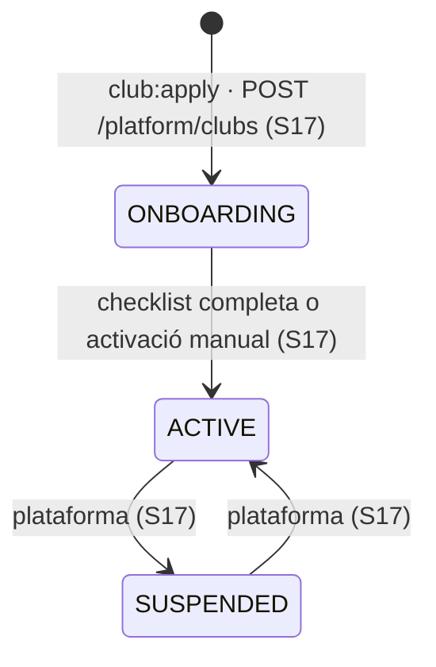

# S02 — Club, configuració i paràmetres

**Etapa:** E0 (tenant, `/branding`, tema, mòduls, perfil de país, `ParameterCatalog`, seed) · E2 (pantalla D11) · **Mòduls:** tots (aquest vertical els serveix) · **Pantalles:** D11 (`escriptori/D11-parametres-del-club.html`; la targeta FAQ és S05, les pistes són D16/S05), `/branding` per a totes les apps · **Model:** PLATAFORMA §2 (CLUB, PARAMETER, LocalizedText) — **substitueix** CLUB de v1.6; ADR-002, ADR-011, ADR-012 · **Estat:** esborrany (03-09-2026) · **Versió:** 0.1

## 1. Propòsit i abast

Resol **què és un club dins la plataforma** i com es configura sense codi: la resolució del tenant pel host, l'entitat `Club` (identitat, localització, dominis, tema, mòduls, proveïdors de pagament, legal, estat), el **catàleg de paràmetres** tipats amb valor per defecte de producte i override per club amb històric (D11), el **perfil de país** (regles locals darrere d'interfície), la **caché de configuració** que consumeixen tots els verticals (`ClubConfig`), l'endpoint públic `GET /branding` (tema + mòduls + idiomes + perfil de país per a les apps abans del login), la generació de D11 **a partir del catàleg** (cap formulari a mà) i els seeds (`club-canic-seed`, `club-minim-seed`). La consola de creació de clubs és S17; aquí hi ha el que el propi club pot tocar.

| Fora d'abast | On viu |
|---|---|
| Crear clubs, dominis, proveïdors de pagament, tema, mòduls (escriptura de plataforma) | S17 (aquí: lectura i els mòduls «autoservei») |
| Catàlegs (nivells, pistes, instructors, modalitats, FAQ) | S05 |
| Identitat, JWT, membresies | S01 |
| Auditoria dels canvis de paràmetres (escriptura) | aquí; consulta a S14 |
| Processos programats i els seus interruptors `jobs.*` (targeta «Processos automàtics») | S15 (usa `ParameterCatalog`) |

## 2. Pantalles i rutes

| Mockup | App | Ruta | Rol | Comportament |
|---|---|---|---|---|
| D11 | clubs-admin | `/parametres` | ADMIN | Títol «Paràmetres» + línia «últim canvi: {clau} · {dd/mm} · {qui} — amb històric» (enllaç → calaix d'històric global). **Blocs generats del catàleg** en aquest ordre i amb aquests títols: «Classes» · «Entrenaments lliures» (`FREE_TRAINING`) · «Llista d'espera» (`WAITLIST`) · «Quotes, packs i remesa» (`BILLING`) · «Club i pistes» · «Comunicacions» · «Alta i consentiments» · «Recorreguts» (`COURSES`) · «Processos automàtics» (S15) · «Preguntes freqüents — pàgina «Info» de l'app» (S05). Cada fila = etiqueta + valor formatat (el mockup: «Màx. classes setmana en curs (per gos) · 2», «Obertura d'inscripcions i canvi de setmana · Diumenge 20:00», «Llindar d'anul·lació tardana («classe feta») · 2 h abans — sense límit per anul·lar», «Llindar d'avís a la llista d'espera · 30 min abans», «Aforament: per nivell (classe = mínim dels seus nivells) · Cadells 5 · A–D 5 · E–G 4 · Teràpia 1» (fila de lectura que enllaça a la targeta de nivells, S05), «Revisió de classes en risc · abast · 7:30 · dia en curs + 2 dies vista», «Mostrar instructor a l'abonat · El dia abans», «Antelació màxima (dies naturals) · dia en curs + 3 dies», «Màx. entrenaments/setmana (reinici dg 20:00) · 3», «Anul·lació fins a · 2 h abans», «Durada del slot · gossos alhora per pista · 30 min · 1», «Nivell mínim (marca automàtica per gos) · D» (lectura: resum dels nivells amb `grantsFreeTraining`, S05), «Màx. per classe · màx. llistes per gos i setmana · 3 · 2 (1 si ja ha fet classe)», «Entrada per gos (matrícula) · 100 €», «Caducitat Pack 6 · Pack 10 · 3 mesos · 5 mesos» (lectura, S05), «Quota d'inactivitat · 20 € 1r mes · 10 €/mes següents», «Dades SEPA del creditor · identificador · IBAN d'abonament · sufix» (lectura emmascarada; edició a S17), «Sèrie i numeració de rebuts · 2026-····»); clic a la fila → **calaix d'edició** amb el control segons `type` (int/duration/time/enum/bool/money/localizedText per idioma/json amb formulari específic per a `openingHours`, `weekOpensAt`, `coverage.thresholds`, `holidays`), validació, «Motiu del canvi» opcional, [DESA] → `PUT /parameters/{key}` i «Restableix el valor de producte» → `DELETE /parameters/{key}`. Botó «Històric» per fila → `GET /parameters/{key}/history`. Bloc «Club i pistes»: files de pistes (lectura, → D16), «Horari d'obertura: dl–dg 7:00–22:00 · idiomes: CA · ES · recordatori de classe: el tria cada abonat (…)» amb l'horari editable (`club.openingHours`) i els idiomes/fus/moneda **en lectura** (edició a S17). Mòduls «autoservei» (`FAQ`, `PUSH`, `LEARN_LINK`) com a commutadors al peu del bloc «Club i pistes» (assumpció §13). Estats: carregant/error; sense permís → `403`. |
| — | clubs · clubs-admin · id | arrencada | ANON | `GET /branding` (per host) abans de renderitzar res: tema (tokens CSS), logo, nom, idiomes, fus, moneda, perfil de país (camps de l'alta), mòduls, `signup.enabled`, URL de privacitat, `clubSlug`. Host desconegut → pàgina de producte «AgilityHub Clubs» sense dades (404 de tenant). |

## 3. Entitats i camps

### `Club` (`clubs`, global — vegeu PLATAFORMA §2 per al detall complet)
| Bloc | Camp | Tipus | Obl. | Notes |
|---|---|---|---|---|
| Identitat | `slug` | string | sí | `^[a-z0-9-]{3,40}$`, únic, immutable (usat a `/public/{clubSlug}` i als ids de mandat) |
| | `name`, `legalName`, `taxId`, `address {street, postalCode, city, region, country}`, `contactEmail`, `contactPhone`, `websiteUrl` | | `name` sí | `taxId` validat pel perfil de país |
| Localització | `locales[]`, `defaultLocale`, `timeZone`, `currency`, `countryProfile` | | sí | `locales ⊆` idiomes de producte; `defaultLocale ∈ locales`; `timeZone` IANA vàlid; `currency` ISO 4217; `countryProfile ∈ {ES, GENERIC}` |
| Dominis | `domains[] {host, app: clubs · clubs-admin, verifiedAt, primary}` | | ≥ 1 per app (S17) | `host` únic **global** entre clubs |
| Tema | `theme {logoUrl, logoDarkUrl, markUrl, colors {primary, onPrimary, background, surface, surfaceAlt, text, textMuted, success, warning, danger}, fontFamily, radius, ringPalette[], mode: dark · light · auto}`, `pwa {name, shortName, iconUrls{}}` | | sí (defaults de producte) | tokens → CSS variables; contrast mínim WCAG AA validat en desar (S17) |
| Mòduls | `modules[]` | enum[] | sí | `CATALEG_MODULS.md`; dependències validades |
| Pagaments | `paymentProviders {SEPA_XML?, STRIPE?, MANUAL?}`, `billing {invoiceSeriesPattern, nextNumber, resetYearly}` (S12) | | | secrets xifrats; lectura sempre emmascarada |
| Legal | `legal {privacyPolicyUrl, imageConsentText: LocalizedText, legalTextsVersion}` | | `privacyPolicyUrl` sí per a `signup.enabled` | |
| Operació | `status`, `onboardingChecklist`, `publicApiKeyHash`, `createdAt`, `usage {smsSentMonth, storageBytes, membersActive}` | | | `status ∈ ONBOARDING · ACTIVE · SUSPENDED` |
| Versió | `version` | int | | optimistic locking |

### `Parameter` (`parameters`)
| Camp | Tipus | Obl. | Notes |
|---|---|---|---|
| `clubId`, `key` | | sí | únic per parell; `key` ∈ `ParameterCatalog` (`400 UNKNOWN_PARAMETER`) |
| `value` | JSON | sí | validat pel `type` i les restriccions del catàleg (`min/max/enum/pattern`) |
| `scopeRef?` | string | — | per a `scope = ring | level` (override per pista/nivell, p. ex. `training.capacityPerRingSlot` per `ringId`) |
| `history[] {value, changedAt, changedByAccountId, reason?}` | | | append; «últim canvi» = darrer element |
| `updatedAt`, `version` | | | |

### `ParameterCatalog` (codi, no BBDD)
Per clau: `type`, `default` (valor de producte), `block` (D11), `label`/`help` (claus i18n), `constraints`, `modules[]` (la fila només es mostra si algun mòdul és actiu), `scope`, `editableBy` (`CLUB` · `PLATFORM`), `restartRequired` (sempre `false` a R1), `validator?` (Java: p. ex. `openingHours` coherent, `weekOpensAt` dia+hora, `coverage.thresholds` decreixents). El catàleg **és** `CATALEG_PARAMETRES.md` en codi: un test compara els dos (T-02-03).

### `ClubConfig` (objecte en memòria)
`club` (sense secrets) + `parameters` resolts (`default` ⊕ override) + `modules` + `countryProfile` + `theme`; cache per `clubId` amb TTL 60 s i invalidació per esdeveniment (`ClubUpdated`, `ParameterChanged`, `ClubModulesChanged`). Tots els verticals hi accedeixen per `ClubConfigService.get(clubId)` — **mai** a la col·lecció directament.

### `CountryProfile` (interfície)
`validateIdDocument(type, value)`, `idDocumentTypes()`, `postalCodeLookup(code) → towns[]`, `defaultPhonePrefix()`, `normalizePhone(raw)`, `validateTaxId(value)`, `requiresIbanFor(paymentType)`, `mandateTextKey()`, `taxLabelKey()`; implementacions `ES` (DNI/NIE lletra de control, NIE X/Y/Z, passaport lliure; dataset de CPs; `+34` i 9 dígits; NIF/CIF), `GENERIC` (document lliure amb tipus, sense lookup, E.164 obligatori, cap validació de NIF).

## 4. Regles de negoci

| Regla | Enunciat | Paràmetres | Exemple |
|---|---|---|---|
| **R-02-01 Resolució del tenant** | Cada petició anònima resol el `clubId` pel `Host` (Caddy injecta `X-Club-Host`); autenticada, pel claim `clubId` (S01) — si els dos existeixen i no coincideixen → `403 TENANT_MISMATCH`. Endpoints de plataforma (`/platform/*`) no tenen tenant. `TenantContext` és immutable durant la petició; la façana `TenantRepository` l'injecta a totes les queries (ADR-002). | — | `app.agilitycanic.cat` → `clubId` del Cànic. |
| **R-02-02 `/branding`** | `GET /branding` (ANON, per host) retorna el subconjunt públic de `ClubConfig`: `{clubId, slug, name, locales, defaultLocale, timeZone, currency, countryProfile: {idDocumentTypes, postalCodeLookup, phonePrefix, requiresIban, mandateTextKey, taxLabelKey}, theme, pwa, modules, signup: {enabled}, legal: {privacyPolicyUrl}, app}`; cache HTTP 60 s (`ETag`). Mai paràmetres de negoci sensibles ni secrets. | `signup.enabled` | La PWA pinta el tema i amaga «Entrenaments» si `FREE_TRAINING` no hi és. |
| **R-02-03 Valor efectiu d'un paràmetre** | `value(key, scopeRef?) = override(club, key, scopeRef) ?? override(club, key) ?? default(catàleg)`. Els tipus es validen al desar i **també** en llegir (un default de producte canviat en una versió nova invalida overrides incompatibles → es registra i s'usa el default, `ParameterInvalidOverride` a l'arrencada). | tots | `training.capacityPerRingSlot` per a la pista Petita = override `ring:PET` ?? club ?? 1. |
| **R-02-04 Edició amb històric** | `PUT /parameters/{key} {value, reason?, scopeRef?, version}` (ADMIN si `editableBy = CLUB`; `PLATFORM` → `403 PLATFORM_ONLY`): valida tipus/restriccions/validator (`400 PARAMETER_INVALID{details}`), comprova que el mòdul de la clau és actiu (`404 MODULE_DISABLED`), desa amb `history` i emet `ParameterChanged{key, before, after, scopeRef}` + `AuditEntry PARAMETER_CHANGED`; invalida la cache. `DELETE` restableix el default (també amb històric). Cap canvi és retroactiu: els rebuts emesos, les reserves fetes i els comptadors ja calculats no es recalculen (cada vertical ho documenta). | — | Canvi de `bookings.lateCancelThresholdMinutes` de 120 a 240 el 10-10 a les 12:00 → afecta les anul·lacions fetes a partir d'aquell moment. |
| **R-02-05 Paràmetres de temps** | `time` i `weekOpensAt` són **hora local** del club; la UI mostra el fus («Diumenge 20:00 · Europe/Madrid»). Canviar `club.timeZone` (S17) és una operació de plataforma que exigeix que no hi hagi classes futures generades (`409 TIMEZONE_CHANGE_BLOCKED`) — les dates de negoci es guarden com a locals, els instants en UTC. | `club.timeZone` | — |
| **R-02-06 Perfil de país** | `CountryProfileRegistry.get(club.countryProfile)`; les validacions d'alta (S04), de fitxa (S03) i de mètode de pagament (S03/S12) hi deleguen. Canviar de perfil (S17) no revalida dades existents. `GENERIC` és el fallback obligatori de qualsevol país nou fins que tingui implementació pròpia. | `club.countryProfile` | Club a Portugal: `GENERIC` (NIF sense validar, telèfon E.164). |
| **R-02-07 Mòduls** | La lectura dels mòduls actius és de `ClubConfig`; `@RequiresModule` i els guards del front consulten el mateix conjunt. Mòduls «autoservei» (`FAQ`, `PUSH`, `LEARN_LINK`) es commuten des de D11 (`PUT /club/modules/{module}` ADMIN); la resta només des de S17. Dependències (`CATALEG_MODULS.md`) validades a tots dos llocs (`422 MODULE_DEPENDENCY`). Desactivar no esborra dades. Emet `ClubModulesChanged` + auditoria `CLUB_MODULES_CHANGED`. | — | Activar `PUSH` des de D11 → la PWA mostra el toggle a 12 al següent `/branding`. |
| **R-02-08 Tema per tokens** | `theme` → `GET /branding.theme` → `packages/ui` genera les CSS variables (`--color-primary`…) i el manifest PWA (`name`, `theme_color`, icones) es serveix per host (`GET /manifest.webmanifest` dinàmic). Mode `auto` segueix `prefers-color-scheme`. Cap color al codi de les apps: els tests de `packages/ui` fallen si troben literals de color fora dels tokens (lint). | — | Cànic: `primary #E26A2A`, fons negre, Montserrat, radi 3–4 px, `ringPalette` de 5 colors. |
| **R-02-09 Horari i festius** | `club.openingHours` per dia (`{MONDAY: {open, close}, …}`, tancat = absent); `club.holidays` llista de dates locals amb etiqueta; validacions: `open < close`, granularitat 5 min. Consumidors: slots d'entrenament (S09), generació de setmanes (S06: cap classe en festiu), plantilles (S06: franges dins l'horari). | `club.openingHours`, `club.holidays` | «dl–dg 7:00–22:00». |
| **R-02-10 Seeds** | `club-canic-seed`: `Club` del Cànic (identitat fictícia excepte nom/domini, `Europe/Madrid`, `[ca, es]`, `EUR`, `ES`, mòduls de `CATALEG_MODULS.md`, tema de marca), overrides de paràmetres = **cap** (els valors del Cànic són els defaults de producte de `CATALEG_PARAMETRES.md`; només `club.openingHours` com a dades (els **festius els entra el club** des de D11: cap festiu al seed, Josep 08-09)), catàlegs (S05), plantilles de comunicat (S11), FAQ (S05). `club-minim-seed`: club «Demo» amb mòduls mínims i `GENERIC`. Els seeds s'apliquen amb `club:apply` (S17) i són la base de tests, dev, staging i demos. | — | — |
| **R-02-11 Estat del club** | `SUSPENDED` (S17): `/branding` respon amb `status` i les apps mostren «Aquest club està temporalment desactivat»; el login de club → `403 CLUB_SUSPENDED` (S01); els processos programats el salten (S15). `ONBOARDING`: tot funciona però la PWA mostra un bàner «Club en configuració» als admins. | — | — |
| **R-02-12 Tenant i rols** | `GET /parameters`, `PUT`, `DELETE`, `/club` (lectura del propi club sense secrets), `/club/modules` → només `ADMIN` del club; `INSTRUCTOR`/`MEMBER` → `403`; tot filtrat pel tenant. Els secrets (`STRIPE.secretKeyEnc`, `webhookSecretEnc`, IBAN del creditor complet) **mai** surten per `/club`: només `configured: true/false` i màscares. | — | — |
| **R-02-13 i18n** | Etiquetes i ajudes de D11 = claus `admin-settings:param.{key}.label/help` (ca/es/en); valors `localizedText` editats per idioma actiu del club; valors formatats amb `fmt*` (durades «2 h abans», hores locals, diners). | `club.locales` | «30 min abans» / «30 min before». |

## 5. Estats i transicions

`Parameter`: sense estats; cada `PUT`/`DELETE` afegeix una entrada a `history` (`ParameterChanged`).

## 6. API

| Mètode | Ruta | Rol | Mòdul | Idem. | Descripció | Cos / paràmetres | Respostes i errors |
|---|---|---|---|---|---|---|---|
| GET | `/branding` | ANON | — | — | R-02-02 | host | `200 Branding` (ETag) · `404 UNKNOWN_HOST` |
| GET | `/manifest.webmanifest` | ANON | — | — | manifest PWA per host | — | `200` |
| GET | `/club` | ADMIN | — | — | club propi sense secrets | — | `200 ClubView` |
| GET | `/parameters` | ADMIN | — | — | catàleg resolt per a D11: blocs, files, valor efectiu, override?, últim canvi, `editableBy`, mòdul | `block?` | `200 {blocks[{key, title, rows[{key, type, label, help, value, isOverride, lastChange?, editableBy, constraints, module?}]}], lastChange}` |
| GET | `/parameters/{key}` · `/parameters/{key}/history` | ADMIN | — | — | valor i històric | `scopeRef?` | `200` · `400 UNKNOWN_PARAMETER` |
| PUT | `/parameters/{key}` | ADMIN | el de la clau | no (`version`) | R-02-04 | `{value, reason?, scopeRef?, version}` | `200` · `400 PARAMETER_INVALID` / `UNKNOWN_PARAMETER` · `403 PLATFORM_ONLY` · `404 MODULE_DISABLED` · `409 STALE_VERSION` |
| DELETE | `/parameters/{key}` | ADMIN | idem | sí | restableix el default | `scopeRef?` | `200` |
| PUT | `/club/modules/{module}` | ADMIN | — | sí | R-02-07 (autoservei) | `{enabled}` | `200 {modules[]}` · `403 PLATFORM_ONLY` · `422 MODULE_DEPENDENCY` |
| PUT | `/club/opening-hours` · `/club/holidays` | ADMIN | — | no | R-02-09 (àlies de `PUT /parameters/club.*` amb formulari propi) | JSON | `200` · `400 PARAMETER_INVALID` |
| GET | `/country-profile/postal-codes/{code}` | ANON · compte | — | — | R-02-06 (S03/S04 el consumeixen) | — | `200 [{town, region}]` (buit si el perfil no fa lookup) |
| GET | `/platform/parameter-catalog` | AGILITYHUB_ADMIN | — | — | catàleg complet amb defaults (consola S17) | — | `200` |

## 7. Esdeveniments

**Emesos**: `ParameterChanged{key, scopeRef?, before, after, reason?}` · `ClubModulesChanged{before[], after[]}` (autoservei) · **nou (§13)**: `ParameterInvalidOverride{key, value, error}` (arrencada/lectura). **Consumits** (cache): `ClubCreated`, `ClubUpdated`, `ClubStatusChanged` (S17), `ParameterChanged`, `ClubModulesChanged`.

## 8. Notificacions

Cap. (Els canvis de paràmetres no notifiquen; l'admin els veu a D11 i a l'auditoria.)

## 9. Paràmetres i mòduls

Aquest vertical **és** el catàleg (`CATALEG_PARAMETRES.md`): tota clau nova s'hi afegeix i a `ParameterCatalog`, i D11 la mostra automàticament. Llegeix directament: `club.openingHours`, `club.holidays`, `signup.enabled`. Mòduls: D11 amaga els blocs dels mòduls inactius; `FAQ`/`PUSH`/`LEARN_LINK` commutables des d'aquí.

## 10. i18n i localització

- Namespace `admin-settings` (títols de bloc, `param.{key}.label/help`, calaix, històric, «Restableix el valor de producte», «Motiu del canvi»); `enums:module.*` («Entrenaments lliures», «Facturació»…).
- `localizedText` amb pestanyes per idioma del club; obligatori el `defaultLocale`.
- Format dels valors: `duration` → «2 h abans» / «30 min abans»; `time` → hora local + fus visible a l'ajuda; `money` → `fmtMoney`; `weekOpensAt` → «Diumenge 20:00».
- Tot text de D11 dels mockups és `ca`; `es`/`en` generats al mateix PR.

## 11. Criteris d'acceptació i tests obligatoris

**Domini (unitaris)**
- T-02-01 (R-02-03) resolució `scopeRef ?? club ?? default` per a `training.capacityPerRingSlot`; override amb tipus incorrecte → ignorat + `ParameterInvalidOverride`.
- T-02-02 (R-02-04) validadors: `openingHours` amb `open ≥ close` → error; `coverage.thresholds` no decreixents → error; `weekOpensAt` amb dia invàlid → error; `localizedText` sense `defaultLocale` → error.
- T-02-03 (R-02-10) **catàleg = document**: test que llegeix `CATALEG_PARAMETRES.md` (taula) i compara claus, tipus i defaults amb `ParameterCatalog` — divergència = test vermell.
- T-02-04 (R-02-06) `ES`: DNI `12345678Z` vàlid, `12345678A` invàlid; NIE `X1234567L`; CP `08349` → «Cabrera de Mar»; telèfon `612345678` → `+34612345678`; `GENERIC`: cap validació de format, E.164 obligatori.
- T-02-05 (R-02-08) `packages/ui`: tokens → CSS variables; lint de colors literals falla amb `#E26A2A` fora dels tokens.

**Integració**
- T-02-06 (R-02-01) host del Cànic → `clubId`; host desconegut → `404 UNKNOWN_HOST`; token del club A amb host del club B → `403 TENANT_MISMATCH`; `/platform/*` sense tenant.
- T-02-07 (R-02-02) `/branding` del Cànic conté tema, mòduls, `countryProfile.idDocumentTypes = [DNI, NIE, PASSPORT]`, `signup.enabled`; sense cap secret ni paràmetre de negoci; `ETag` i `304`.
- T-02-08 (R-02-04) `PUT /parameters/bookings.lateCancelThresholdMinutes` 120 → 240: `history` amb qui/quan/motiu, `ParameterChanged` a l'outbox, `AuditEntry PARAMETER_CHANGED`, `ClubConfig` refrescat (< 1 s), `GET /parameters` mostra «últim canvi»; `DELETE` → torna a 120 amb entrada a l'històric; `version` antiga → `409`.
- T-02-09 (R-02-07) `PUT /club/modules/PUSH {enabled:false}` → `/branding.modules` sense `PUSH`; `PUT /club/modules/BILLING` → `403 PLATFORM_ONLY`; activar `PACKS` amb `BILLING` off → `422 MODULE_DEPENDENCY` (via S17).
- T-02-10 (R-02-11) club `SUSPENDED` → `/branding.status`, login → `403 CLUB_SUSPENDED` (S01), scheduler el salta (S15).
- T-02-11 (R-02-12) `INSTRUCTOR`/`MEMBER` sobre `/parameters` → `403`; `GET /club` sense `secretKeyEnc` ni IBAN complet; club B no veu paràmetres del club A.
- T-02-12 (R-02-10) `club:apply club-canic-seed` en una BBDD buida → `/branding` i `/parameters` iguals a les fixtures esperades; reaplicar → cap canvi (idempotent).

**Front**
- T-02-13 D11: blocs i files generats del catàleg amb els literals del mockup; fila → calaix amb el control del tipus; «Restableix»; històric; blocs de mòduls inactius ocults; commutadors autoservei; línia «últim canvi».
- T-02-14 PWA/admin: tema aplicat des de `/branding` abans del primer render (sense *flash*); manifest amb nom i colors del club; mode `auto`.

**Cobertura addicional (traçabilitat regla → test)**
- T-02-15 (R-02-05) `PUT /parameters/bookings.weekOpensAt {SUNDAY, 20:00}` en un club `America/Argentina/Buenos_Aires` → l'obertura (S15) cau a les 20:00 locals (23:00Z); `PATCH /platform/clubs/{id} {timeZone}` amb classes futures → `409 TIMEZONE_CHANGE_BLOCKED`.
- T-02-16 (R-02-09) `PUT /club/opening-hours` amb `open ≥ close` → `400 PARAMETER_INVALID`; festiu afegit → S06 no genera classes aquell dia i S09 no ofereix slots.
- T-02-17 (R-02-13) D11 en `es`/`en`: etiquetes i ajudes de tots els paràmetres presents (i18n-parser); valors `duration` formatats («2 h antes», «2 h before»).

## 12. Paquets de feina (per a fils d'IA en paral·lel)

| Paquet | Repo | Depèn de | Lliurable verificable |
|---|---|---|---|
| WP-02-A Tenant + config (E0) | `agilityhub-core-api/platform` | E0 esquelet | `TenantContext` + filtre, `TenantRepository`/`GlobalRepository`, `Club`, `Parameter`, `ParameterCatalog` (totes les claus del catàleg), `ClubConfigService` + cache, `CountryProfile ES/GENERIC`, `/branding`, `/manifest.webmanifest`; T-02-01…07, 12 |
| WP-02-B Paràmetres API (E2) | `agilityhub-core-api/platform` | WP-02-A, S14 (`@Audited`) | `/parameters*`, `/club`, `/club/modules`, `/club/opening-hours`, `/club/holidays`, `/country-profile/postal-codes`; T-02-08…11 |
| WP-02-C Tema i shell (E0) | `agilityhub-core-web/packages/ui` + apps | WP-02-A (mock de `/branding`) | tokens → CSS variables, lint de colors, `BrandingProvider`, manifest dinàmic, mapa mòdul→UI (`modules.ts`), esquelet de les tres apps amb el tema del Cànic; T-02-05, 14 |
| WP-02-D D11 (E2) | `agilityhub-core-web/apps/clubs-admin` | WP-02-B | pantalla generada del catàleg, calaixos per tipus, històric; T-02-13 |
| WP-02-E Seeds (E0) | `agilityhub-core-api` | WP-02-A, S05/S11 (dades) | `club-canic-seed`, `club-minim-seed`, `demo-seed` (cens fictici) via `club:apply`; usats per tests i staging |

Ordre: A ∥ C → B ∥ E → D. Fils: (1) A+B, (2) C+D, (3) E.

## 13. Dubtes oberts

| # | Dubte | Qui | Assumpció mentrestant |
|---|---|---|---|
| 1 | Commutadors de mòduls autoservei a D11 (sense mockup) | Jordi | peu del bloc «Club i pistes» |
| 2 | La fila «Nivell mínim (marca automàtica per gos) · D» del mockup és ara un atribut per nivell (S05): D11 la mostra com a resum de lectura? | Jordi | sí, «Nivells amb entrenament lliure: D · E · F · G» |
| 3 | ~~Edició de `club.holidays`: llista simple o importació d'un calendari?~~ **Resolt (Josep 08-09): «ho hem de poder definir des de dins del propi sistema»** → llista de dates amb etiqueta mantinguda a D11 (`PUT /club/holidays`), sense importació de calendari i **sense cap llista al seed** (el club els entra). | — | — |
| 4 | Retroactivitat: cap paràmetre és retroactiu — cal avís a D11 en canviar-ne un d'operatiu (p. ex. llindars)? | Jordi | text d'ajuda «S'aplica a partir d'ara» |
| 5 | `GET /branding` amb host de club però `app` no coincident (obrir `clubsadmin` per un host de `clubs`) | Jordi | `404 UNKNOWN_HOST` |

**Propostes**: esdeveniment `ParameterInvalidOverride`; errors `UNKNOWN_HOST`, `TENANT_MISMATCH`, `UNKNOWN_PARAMETER`, `PARAMETER_INVALID`, `PLATFORM_ONLY`, `TIMEZONE_CHANGE_BLOCKED`, `CLUB_SUSPENDED`, `MODULE_DEPENDENCY` (compartit amb S17); rutes a afegir a CONVENCIONS §3: `/manifest.webmanifest`, `/club`, `/club/modules/{module}`, `/club/opening-hours`, `/club/holidays`, `/parameters/{key}/history`, `/country-profile/postal-codes/{code}`, `/platform/parameter-catalog`. Cap paràmetre nou.

## Canvis

- 03-09-2026 · v0.1 · esborrany inicial a partir de D11 (V7), PLATAFORMA §2, ADR-002/011/012 i els catàlegs transversals.
- 08-09-2026 · respostes del Josep (registre part B, §13-3): `club.holidays` es manté **des del sistema** (D11), sense importació de calendari i **sense llista al seed**.
