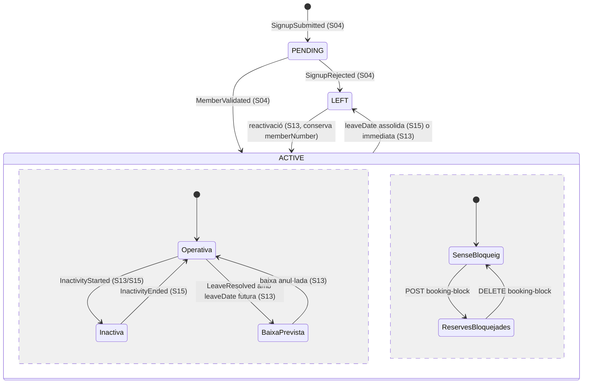
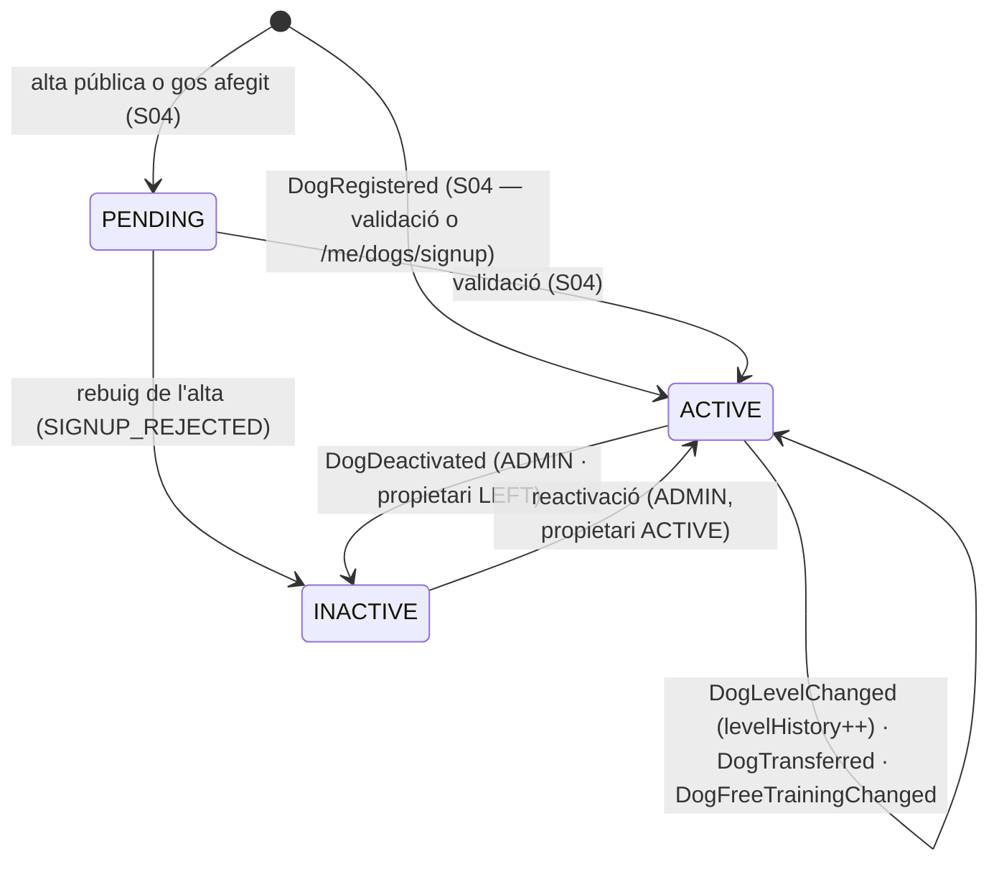

# S03 — Cens: abonats, gossos, grup familiar i fitxes

**Etapa:** E2 · **Mòduls:** `FAMILY_GROUP`, `TASKS` (notes als instructors), `BILLING` (camps de pagament a D10), `FREE_TRAINING` («Pot entrenar sol») · **Pantalles:** D5, D10, D15, 13, 28 (fitxers a `03-disseny/mockups/pantalles/`) · **Model:** §A de v1.6 (ABONAT, GRUP_FAMILIAR, GOS, DOCUMENT_GOS, VISTA_LLISTAT, AUDITORIA) + §1 i §3 de `MODEL_DADES_PLATAFORMA.md` · **Estat:** esborrany (03-09-2026) · **Versió:** 0.1

## 1. Propòsit i abast

Resol el **cens** del club: l'abonat (`Member`), els seus gossos (`Dog`), el grup familiar (`FamilyGroup`), els documents del gos (`DogDocument`), la fitxa d'abonat D10 amb totes les accions de capçalera i de peu, els llistats universals D5/D15 (cerca, filtre universal, columnes, vistes desades, exports, accions massives), la pantalla 13 «Els meus gossos» i la 28 «Les meves dades». Aquí viuen la **màquina d'estats** de `Member` i `Dog`, el **bloqueig de reserves** (manual, reversible, N-29), el canvi de **nivell** del gos (N-09), la **transferència** de gos entre abonats, el canvi de **mètode de pagament** per l'admin (N-38), el recordatori de **cartilla pendent** (N-23), els **rols d'accés** (escriuen a `Membership`) i el consumidor del **darrer gos seleccionat**.

Fora d'abast (spec on viu): alta pública, `/me/dogs/signup` i validació D2 (**S04**) · catàlegs de nivells, pistes, instructors, modalitats (**S05**) · reserves i comprovació efectiva del bloqueig (**S08**, entrenaments **S09**, activitats **S07**) · entitat `Task`, adjunts, observacions, D13/D14 (**S10**) · contingut de la matriu de preferències i plantilles (**S11**) · rebuts, packs, mandat SEPA, Stripe (**S12**) · inactivitat i baixa amb data (**S13**: aquí només els botons d'entrada i les transicions d'estat) · UI d'auditoria, exports RGPD i supressió (**S14**) · compte, enllaç màgic, mecànica d'impersonació (**S01**).

## 2. Pantalles i rutes

| Mockup | App | Ruta | Rol | Notes de comportament |
|---|---|---|---|---|
| D5 `escriptori/D5-llistat-d-abonats-patro-de-llistat-universal.html` | `apps/clubs-admin` | `/abonats` | ADMIN | Capçalera «Abonats · {n} d'alta» (recompte `status=ACTIVE`). Cerca «Cerca per nom, DNI, gos…» (`q`, debounce 300 ms). Xip d'estat «Alta ▾» (alta · baixa · tots → R-03-03). Botó «Filtre» (universal: tria de columna → valors amb recompte de `filter-values` → operador); amb filtres actius el botó mostra «Filtre (n): {Columna} = «{valor}»» i obre el detall per modificar-los o treure'ls. «Columnes ▾» (visibles + ordre arrossegant). «Vistes: «{nom}» ▾» (desar, carregar, compartir, eliminar). «Excel · PDF» (export de la vista actual). Selecció múltiple → barra «{n} seleccionats — accions massives: Enviar comunicat (S11) · Exportar selecció · Canviar nivell». Peu: «Pàgina {p} de {t}» + «{size} files per pàgina ▾» (20 · 50 · 200 · 1000). Clic a la fila → D10. «Nou abonat» → formulari d'alta al backoffice (S04, §13). Estats: carregant = esquelet de 6 files; buit = «Cap abonat amb aquests criteris» + [Treu els filtres]; error = toast per `code` + [Torna-ho a provar]. |
| D10 `escriptori/D10-fitxa-d-abonat.html` | `apps/clubs-admin` | `/abonats/:id` | ADMIN | Capçalera: nom · «núm. {n}» · «alta des de {any}» · «titular del grup familiar» / «membre del grup familiar» (`FAMILY_GROUP`) · distintiu vermell «Reserves bloquejades» si `bookingBlock.active` · «Compte no informat» si R-03-07 · botons «WhatsApp» (obre `wa.me/{prefix}{número}`; amb dos telèfons, menú), «Reenvia accés» (confirmació → `POST …/access-resend` → toast «Enllaç enviat a {email}»), «Entra com l'abonat» (confirmació amb motiu opcional → `POST …/impersonation-token` → obre `apps/clubs` en una pestanya nova amb el bàner de S01), «Edita» (calaix amb els camps de R-03-08). Bloc «Dades i pagament» (files Contacte · Modalitat · Pagament · Proper rebut · Consentiments · Rols d'accés · Grup familiar). Bloc «Gossos» (nom · raça · xip de nivell · «Pot entrenar sol» · pack · › fitxa del gos). Bloc «Preferències d'avisos» (S11, `PUT /members/{id}/notification-preferences`). Bloc «Rebuts recents i auditoria» (2 rebuts, «Tots els rebuts (n) ›» → D6 filtrat, «Tota l'auditoria ›» → S14, «Darrers canvis: …»). Peu: «Inactivitat» (S13, `INACTIVITY`), «Bloqueja les reserves» / «Desbloqueja les reserves» (diàleg amb motiu), «Baixa (amb data)» (S13). |
| D15 `escriptori/D15-llistat-de-gossos.html` | `apps/clubs-admin` | `/gossos` | ADMIN | Mateix patró que D5: «Gossos · {n} actius», cerca «Cerca per gos, abonat, xip…», xip «Actius ▾» (actius · baixa · tots), filtre universal (inactiu per defecte), columnes Gos · Raça · Nivell · Abonat · Entrenament lliure · Llicències · Estat, vistes («Amb llicència»), files per pàgina. Clic a la fila → fitxa del gos. |
| Fitxa del gos (sense mockup propi, §13) | `apps/clubs-admin` | `/gossos/:id` | ADMIN (INSTRUCTOR lectura) | Composició dels blocs de gos de D13 (S10) + barra d'accions d'aquesta spec: canvi de nivell, «Pot entrenar sol» (segons nivell / sí / no), transferència, documents (pujar amb nom, treure, «Recorda la cartilla»), llicències, baixa/reactivació del gos, foto. |
| 13 `mobil/13-els-meus-gossos.html` | `apps/clubs` | `/gossos` | MEMBER (i impersonat) | Una targeta per gos **propi** actiu: foto (toc → canviar-la), «{raça} · {sexe} · {n} anys», «Nivell {codi}» (si `levels.enabled`), «NOTES ALS INSTRUCTORS (què vols obtenir del club, aspectes a tenir en compte…)» (`TASKS`: text editable in situ, desa en perdre el focus o amb [DESA]), «TASQUES (marca-les quan estiguin fetes)» (`TASKS`: pendents amb casella, fetes ratllades «feta el {data}», clip d'adjunts, «Veure l'historial ›» → S10), documents «{nom} · {nom}» + «＋ DOC.» (diàleg: tipus + nom + fitxer), «Pot entrenar sol» (verd, només si és cert), llicències «{organisme} · llicència {número} · {grau}», pack «{modalitat} · caduca {data} · {n} consumides · {n} disponibles» (`PACKS`, S12). «＋ AFEGEIX UN GOS» → S04. Peu fix: «El nivell l'assigna el club · Per donar de baixa un dels gossos, comunica-ho al club». Buit (cap gos actiu): text «Encara no tens cap gos donat d'alta» + «＋ AFEGEIX UN GOS». |
| 28 `mobil/28-modificar-les-meves-dades.html` | `apps/clubs` | `/dades` | MEMBER (i impersonat) | Entrada tocant el nom a 12. Lectura: «DNI — {emmascarat}», Nom, Cognom 1, Cognom 2. Edició: «Emails» (principal + «Segon email (opcional)», ajuda «Les comunicacions s'envien a tots els emails»), «Telèfons» (dos, cadascun amb «Descripció», ajuda «Si t'enviem un SMS, s'envia a tots dos telèfons»), «Adreça» («Carrer i número», «CP», «Població (proposada pel CP)» desplegable si el CP dona més d'una), «Domiciliació» (només `BILLING` i `SEPA_DD`: «···· ···· ···· ···· {4}» + «Per canviar el compte de domiciliació, contacta amb el club»). [DESA] → `PATCH /me/profile`; errors de camp del `400` sota cada camp. |

## 3. Entitats i camps

Només el que aquesta spec crea o modifica; la resta d'atributs, al model. Tots amb `clubId` (`TenantRepository`), `version`, `createdAt`, `updatedAt`.

### `Member` (`members`) — ABONAT v1.6 + PLATAFORMA §3
| Camp | Tipus | Oblig. | Validació / notes |
|---|---|---|---|
| `accountId` | UUID | sí (des d'ACTIVE) | `Account` global (S01); `null` només mentre PENDING sense compte |
| `memberNumber` | int | des d'ACTIVE | seqüència per club assignada a la validació (S04); únic; mai es reassigna |
| `idDocument` | `{type, number}` | sí | `type` segons `countryProfile.idDocumentTypes` (ES: `DNI`·`NIE`·`PASSPORT`); format validat pel perfil; **únic per club** (`409 ID_DOCUMENT_ALREADY_EXISTS`) |
| `firstName`, `lastName1`, `lastName2` | string ≤ 60 | sí, sí, no | `fullName` derivat «{firstName} {lastName1} {lastName2}» |
| `gender` | enum `MALE`·`FEMALE`·`OTHER` | sí | ICU `select` als textos; `OTHER` → masculí en ca/es |
| `birthDate` | date | sí | ≥ 16 anys a l'alta (S04) |
| `contactEmails[]` | `[{email, bounced}]` 1..2 | sí (1) | format RFC 5322, sense duplicats; `bounced` el posa S11; el primer coincideix amb `Account.email` per defecte (canvi del login: S01) |
| `phones[]` | `[{prefix, number, label}]` 1..2 | sí (1) | `prefix` per defecte `countryProfile.phonePrefix`; `number` segons perfil (ES: 9 dígits); `label` ≤ 30 («Laura», «Joan») |
| `address` | `{street, postalCode, city, province?, country?}` | sí | CP segons perfil; `city` proposada pel CP (S02) |
| `paymentMethod` | veg. PLATAFORMA §3 | `BILLING` | `SEPA_DD {iban?, holderName, holderTaxId?, mandateRef, mandateSignedAt}` · `CARD {…}` · `MANUAL {channel}`; **l'IBAN mai surt de l'API** (només `maskedAccount` = 4 últims) |
| `planId`, `priceId`, `nextInvoiceDate` | ref, ref, date | `BILLING` | els fixa S04/S12; aquí només lectura |
| `consents` | `{privacyPolicy {acceptedAt, version}, imageRights {granted, at, version, byAccountId}}` | sí | `version` = `Club.legalTextsVersion` del moment; només `imageRights` és modificable (ADMIN, auditat) |
| `remarks`, `internalNotes` | text ≤ 2000 | no | observacions visibles a l'abonat · notes internes (ADMIN) |
| `status` | enum `PENDING`·`ACTIVE`·`LEFT` | sí | §5; mai s'esborra |
| `joinedAt`, `leaveDate`, `leaveRequestId` | instant, date, ref | — | `leaveDate` pot ser futura (S13) |
| `bookingBlock` | `{active, reason ≤ 200, since, byAccountId}` | sí (`active=false`) | R-03-04 |
| `lastDogForClass`, `lastDogForTraining` | UUID? | no | R-03-21 |
| `familyGroupId` | UUID? | no | `FAMILY_GROUP`; com a molt un grup |
| `notificationPreferences` | embegut | — | S11 |

### `FamilyGroup` (`family_groups`)
| Camp | Tipus | Oblig. | Notes |
|---|---|---|---|
| `holderMemberId` | UUID | sí | titular = pagador únic (S12); ha de ser dins `memberIds` |
| `memberIds[]` | UUID[] ≥ 2 | sí | tots del mateix club; un abonat només en un grup actiu |
| `status` | enum `ACTIVE`·`DISSOLVED` | sí | dissoldre = `DISSOLVED` + `familyGroupId=null` als membres; el registre queda |

### `Dog` (`dogs`)
| Camp | Tipus | Oblig. | Notes |
|---|---|---|---|
| `memberId` | UUID | sí | propietari (transferible, R-03-14) |
| `name`, `breed` | string ≤ 40 / ≤ 60 | sí | |
| `chip` | string ≤ 20 | sí | **únic per club** (`409 CHIP_ALREADY_EXISTS`); **mai es retorna a `/me/*`** |
| `sex`, `birthDate` | enum `MALE`·`FEMALE`, date | sí | «Mascle»/«Femella»; edat derivada en anys (R-03-29) |
| `photoFileKey` | string? | no | ≤ `files.dogPhotoMaxMb`; URL signada a lectura |
| `levelId`, `levelAssignedAt` | ref?, instant? | si `levels.enabled` | obligatori per a gossos ACTIVE quan `levels.enabled=true` |
| `levelHistory[]` | `[{levelId, from, to?, byAccountId}]` | — | append-only; la fila oberta és el nivell vigent |
| `freeTrainingOverride` | bool? | no | `null` = segons nivell (R-03-13) |
| `instructorNote` | `{text ≤ 2000, updatedAt, updatedByAccountId}` | `TASKS` | només l'alumne l'edita (R-03-17) |
| `remarks` | text | — | observacions privades (S10) |
| `licenses[]` | `[{organisation ≤ 20, number ≤ 30, grade? ≤ 30}]` | no | un registre per organisme (R-03-19) |
| `status`, `registeredAt`, `deactivatedAt`, `deactivationReason` | enum `PENDING`·`ACTIVE`·`INACTIVE`, instant, instant?, enum? | sí | `deactivationReason`: `CLUB`·`MEMBER_LEFT`·`SIGNUP_REJECTED` |

### `DogDocument` (`dog_documents`)
| Camp | Tipus | Oblig. | Notes |
|---|---|---|---|
| `dogId`, `type` | UUID, string | sí | `type` = clau de `census.dogDocumentTypes` (§13); **un document per (gos, tipus)** |
| `state` | enum `PENDING`·`RECEIVED` | derivat | `RECEIVED` si té ≥ 1 fitxer no retirat |
| `files[]` | `[{id, fileKey, name ≤ 80, mimeType, sizeBytes, uploadedAt, uploadedByAccountId, removedAt?, removedByAccountId?}]` | — | `name` es demana en pujar («cartilla_Duna_1.jpg»); retirada = marca, no esborrat |
| `lastReminderAt` | instant? | — | R-03-16 |

### `SavedView` (`saved_views`) — VISTA_LLISTAT
`ownerAccountId`, `listKey` (`members`·`dogs`·…), `name ≤ 40`, `columns[]` (claus ordenades), `filters[]` (`{field, op, value}`), `sort`, `shared` (bool). Únic `(clubId, listKey, ownerAccountId, name)`.

## 4. Regles de negoci

| Id | Regla | Paràmetres / mòduls | Excepcions | Exemple |
|---|---|---|---|---|
| R-03-01 | Tot recurs del cens es llegeix i s'escriu amb el `clubId` del JWT; un id d'un altre club respon `404`. Índexs `{clubId, memberNumber}`, `{clubId, idDocument.number}`, `{clubId, chip}` únics. | — | — | Admin del club B demana `/members/{id del club A}` → `404`. |
| R-03-02 | Un `MEMBER` només veu i edita el seu `Member`, els seus gossos i (lectura) els del grup familiar. `GET /me/dogs` retorna **només els gossos propis** actius (pantalla 13); els del grup surten a `GET /me/family-group` per als selectors (S08/S09). Un token d'impersonació té el mateix abast i tota escriptura s'audita amb `actorAccountId` + `impersonatedMemberId`, `origin=BACKOFFICE`. | `FAMILY_GROUP` | — | Laura (grup amb Joan Antoni) veu a 13 Duna i Rock; Toby (de Joan Antoni) només al selector de Reservar. |
| R-03-03 | `status ∈ {PENDING, ACTIVE, LEFT}`. L'**estat de visualització** (`displayStatus {kind, date}`) es deriva al back amb la data d'avui del club: `PENDING`→«pendent» · `ACTIVE` amb `InactivityPeriod` actiu→«inactiva fins {to}» · `ACTIVE` amb `leaveDate ≥ avui`→«baixa {leaveDate}» · `ACTIVE`→«alta» · `LEFT`→«baixa». Xip de D5: alta = `status:eq:ACTIVE` · baixa = `LEFT` · tots = sense filtre (els pendents surten com a «pendent»). | `club.timeZone`; `INACTIVITY` | — | Eva, inactiva fins al 15/09 → fila «inactiva fins 15/09» però compta a «184 d'alta». |
| R-03-04 | **Bloqueig de reserves**: marca manual i reversible de l'ADMIN amb `reason` obligatori. Mentre `bookingBlock.active`, cap reserva nova de classe, entrenament ni activitat feta **per l'abonat o per a un gos seu** (també des d'un grup familiar o per impersonació): S07/S08/S09 criden `MemberBookingEligibility` → `422 BOOKING_BLOCKED {reason, since}`. Les reserves existents es mantenen. Activar sobre un bloqueig actiu → `409 BOOKING_BLOCK_ALREADY_ACTIVE`; treure'n un d'inexistent → `409 BOOKING_BLOCK_NOT_ACTIVE`. Cada canvi: `BookingBlockChanged` (N-29) + auditoria. L'app mostra el motiu (S08) i D10 el distintiu vermell. | suggeriments de motiu: `census.bookingBlockReasons` (§13) | l'ADMIN el pot treure abans d'actuar com l'abonat | Bloqueig «rebut de juliol impagat» → Marc intenta reservar dijous: `422 BOOKING_BLOCKED`; la classe de dimarts que ja tenia es manté. |
| R-03-05 | «Entra com l'abonat»: només `ADMIN` amb token **no** d'impersonació (`403 IMPERSONATION_DENIED` altrament), i només si l'abonat té `Membership.status=ACTIVE` (`409 MEMBER_NOT_ACTIVE` per a PENDING/LEFT). Retorna un token de S01 amb caducitat `auth.impersonationMinutes`; `ImpersonationStarted` s'audita a S01. | `auth.impersonationMinutes` = 60 | — | Admin Jordi → Laura: token 60 min, l'app mostra «Estàs actuant com Laura Serra». |
| R-03-06 | «Reenvia accés»: només abonats `ACTIVE` amb `accountId` (`409 MEMBER_NOT_ACTIVE`); genera un enllaç màgic (S01) a `Account.email` i emet `AccessResent` (N-27). El límit de freqüència és el de `/auth/magic-link` (S01). | `auth.magicLinkMinutes` = 15 | l'abonat inactiu (període) també pot rebre'l | Laura no troba el correu de benvinguda → «Reenvia accés» → N-27. |
| R-03-07 | **Mètode de pagament**: només ADMIN (`PATCH /members/{id}/payment-method`); el `type` ha de correspondre a un proveïdor actiu del club (`SEPA_DD`↔`SEPA_XML`, `CARD`↔`STRIPE`, `MANUAL`↔`MANUAL`; altrament `422 PAYMENT_PROVIDER_NOT_ENABLED`). `SEPA_DD`: IBAN amb dígit de control vàlid (`400 INVALID_IBAN`), `holderName` obligatori, `holderTaxId` segons perfil; `mandateRef`/`mandateSignedAt` els fixa S12. `CARD`: només amb `stripeSetupIntentId` confirmat (S12). L'IBAN és **d'escriptura només**: tota lectura, l'auditoria (`before/after`) i els exports porten `maskedAccount` («···· ···· ···· ···· 2231»). `SEPA_DD` amb `iban=null` és un estat vàlid → distintiu vermell «Compte no informat» (D10, D1, D2). Emet `MemberPaymentMethodChanged` (N-38). L'abonat no pot canviar-lo (28). | `BILLING`; `Club.paymentProviders`; `club.countryProfile` | — | Canvi d'IBAN de Laura → N-38 «···· 2231»; auditoria «canvi d'IBAN (admin Jordi)». |
| R-03-08 | **Edició per l'ADMIN** (`PATCH /members/{id}`): `idDocument`, noms, `gender`, `birthDate`, `contactEmails`, `phones`, `address`, `remarks`, `internalNotes`, `consents.imageRights`. `version` obligatori (`409 STALE_VERSION`). Modalitat/tarifa es canvien a S12. Si `status=PENDING`, l'esdeveniment és `SignupEdited` (S04); altrament `MemberUpdated{diff}` → auditoria. Un canvi d'email reinicia `bounced`. | `club.countryProfile` | — | Dos admins editen Laura alhora: el segon rep `409 STALE_VERSION`. |
| R-03-09 | **Les meves dades (28)**: el `MEMBER` edita només `contactEmails` (1..2), `phones` (1..2 amb `label`) i `address`; qualsevol altre camp al cos → `400 VALIDATION_ERROR` amb `fieldErrors[].code=READ_ONLY`. El primer email i el primer telèfon són obligatoris. `idDocument` es retorna emmascarat (R-03-27). Emet `MemberUpdated{origin: APP}`. Canviar `contactEmails[0]` **no** canvia `Account.email` (S01). | `club.countryProfile` | impersonació: mateix abast, auditat | Laura afegeix «feina@exemple.cat» i el telèfon d'en Joan → N-* futurs van als dos emails i l'SMS als dos telèfons. |
| R-03-10 | **Rols d'accés** (`PUT /members/{id}/roles`): `MEMBER` sempre present (`422 ROLE_MEMBER_REQUIRED`); cal `Membership` (abonat ACTIVE, `409 MEMBER_NOT_ACTIVE`); no es pot treure `ADMIN` a un mateix (`422 CANNOT_CHANGE_OWN_ADMIN_ROLE`) ni deixar el club sense cap `ADMIN` (`422 LAST_ADMIN`). Afegir `INSTRUCTOR` crea (si no existeix) el registre `Instructor` actiu (S05); treure'l el desactiva via S05 (que rebutja si té classes futures). Emet `MembershipChanged{before, after}`. | — | — | Laura passa a instructora → xip «instructor» verd a D10, apareix a D17. |
| R-03-11 | **Gos**: pertany a un sol abonat; `status PENDING·ACTIVE·INACTIVE` (`PENDING` = pendent de validació, S04). Només gossos ACTIVE d'abonats ACTIVE poden reservar (S08/S09 llegeixen `Dog.status`). Baixa manual (ADMIN, `POST /dogs/{id}/deactivation`): rebutjada si té reserves de classe, entrenament o llista d'espera futures actives (`409 DOG_HAS_FUTURE_BOOKINGS {bookings[]}`). Baixa automàtica: rebuig de l'alta (S04) i **abonat que passa a LEFT** (consumidor de `MemberStatusChanged`, `reason=MEMBER_LEFT`). Reactivació només ADMIN i amb propietari ACTIVE. Els INACTIVE no surten a cap selector ni a 13. L'alumne no pot donar de baixa un gos («comunica-ho al club»). | — | — | Trevi (Montse, baixa 31/08) → l'1/09 Trevi passa a INACTIVE, D15 «baixa 31/08». |
| R-03-12 | **Nivell del gos** (`PATCH /dogs/{id}/level`): només ADMIN; `levels.enabled=false` → `422 LEVELS_DISABLED`; nivell inexistent o inactiu → `422 LEVEL_NOT_ACTIVE`; el mateix → `422 LEVEL_UNCHANGED`. Efectes: `levelId`, `levelAssignedAt=ara`, tanca la fila oberta de `levelHistory` i n'obre una; `DogLevelChanged{before, after}` (N-09 al propietari; S08 recalcula visibilitat; S06 cobertura). Les reserves futures en classes que no admeten el nou nivell **es mantenen** i la resposta porta `warnings.futureBookingsOutsideLevel` (§13). L'instructor proposa el canvi a les observacions (S10), mai el fixa. | `levels.enabled` = true | — | Duna C → D: N-09 «Duna passa al nivell D», D5 mostra «Duna D». |
| R-03-13 | «**Pot entrenar sol**» = `freeTrainingOverride ?? (levels.enabled && levelId != null ? level.grantsFreeTraining : false)`. ADMIN fixa `override` a `true`/`false`/`null` (`PATCH /dogs/{id}/free-training`). S'emet `DogFreeTrainingChanged{allowed, source: LEVEL·MANUAL}` **només si el valor efectiu canvia**; es recalcula també en consumir `DogLevelChanged` i `LevelChanged` (canvi de `grantsFreeTraining`). Es mostra només quan és cert (verd a D10, D15, 13); D15 mostra «—» altrament. S09 aplica el dret. | `FREE_TRAINING`; `levels.enabled`; `Level.grantsFreeTraining` (Cànic: D..G) | `training.freeTrainingRequiresLicense` és informatiu | Rock (D, override null) → sí; Duna (C, override true) → sí, `source=MANUAL`. |
| R-03-14 | **Transferència** (`POST /dogs/{id}/transfer`): ADMIN; destí ≠ origen (`422 SAME_MEMBER`), del mateix club i ACTIVE (`409 TARGET_MEMBER_NOT_ACTIVE`); rebutjada amb reserves futures actives (`409 DOG_HAS_FUTURE_BOOKINGS`) o pack obert amb sessions restants (`409 DOG_HAS_OPEN_PACK`, S12). El gos conserva nivell, històric, documents, tasques i notes; els `lastDogFor*` de l'origen que l'apuntin es posen a `null`. `DogTransferred{fromMemberId, toMemberId}` + auditoria; sense notificació (§13). | `PACKS` | — | Nass passa d'Anna a la seva filla Clara (abonada pròpia). |
| R-03-15 | **Documents del gos**: tipus del catàleg `census.dogDocumentTypes` (`400 DOCUMENT_TYPE_UNKNOWN`); els tipus `required` es creen `PENDING` en registrar el gos (S04) si no s'han pujat. Fitxer: `mimeType ∈ files.allowedTypes` (`400 FILE_TYPE_NOT_ALLOWED`), mida ≤ `files.maxSizeMb` (`400 FILE_TOO_LARGE`), `name` demanat en pujar (per defecte el nom original), pujada per URL signada (`POST /attachments/upload-url {purpose: DOG_DOCUMENT}` → `fileKey`). Puja el `MEMBER` per als gossos propis (13 «＋ DOC.») o l'ADMIN. Retirar un fitxer: només ADMIN, marca `removedAt` (l'objecte queda fins a la supressió RGPD, S14). `DogDocumentUploaded` en pujar; `DogDocumentPending` si un document requerit torna a PENDING. Un gos amb algun document requerit PENDING mostra «{tipus} pendent» a D15/D10/fitxa. | `census.dogDocumentTypes` (§13); `files.*`; `signup.requireDogDocumentAtSignup` = false | — | Duna: «cartilla_Duna_1.jpg · cartilla_Duna_2.jpg · Assegurança.pdf». |
| R-03-16 | **Recordatori de cartilla** (N-23): manual des de D10/D15/fitxa del gos (`POST /dogs/{id}/documents/reminder {type}`) per a un document requerit PENDING (`422 DOCUMENT_NOT_PENDING`); màxim un per (gos, tipus) cada 24 h (`409 DOCUMENT_REMINDER_TOO_SOON`). Emet `DogDocumentPending{trigger: MANUAL}`. El recordatori programat només existeix si `messaging.documentReminderDays > 0` (S15). | `messaging.documentReminderDays` = 0 | — | Admin prem «Recorda la cartilla» a Nass → N-23 «Ens falta la cartilla de vacunes de Nass». |
| R-03-17 | **Notes als instructors** (`PUT /me/dogs/{id}/instructor-note`): mòdul `TASKS`; un sol camp per gos; l'escriu **només l'alumne propietari** (també per impersonació, auditat); ≤ 2000 caràcters; es pot buidar. Cada desat amb text diferent emet `MemberNoteChanged` (N-22 als instructors; D14). Adjunts via `/attachments` amb `entityType=INSTRUCTOR_NOTE` (S10). Instructors i ADMIN només lectura. | `TASKS` | — | Laura escriu «A veure si treballem una mica el doble…» → avís a Estel i Marc. |
| R-03-18 | **Tasques a 13**: `GET /me/dogs` embed per gos les tasques `PENDING` i les `DONE` dels darrers 30 dies (constant de producte) amb `{id, text, createdAt, instructorName, attachmentsCount, doneAt}`; marcar feta = S10 (`POST /tasks/{id}/completion`); «Veure l'historial ›» → S10. | `TASKS` | — | «Treballar l'«espera»… 28-07 · Estel · feta el 02-08» ratllada. |
| R-03-19 | **Llicències per organisme**: `licenses[]` amb `organisation` únic per gos (`400 VALIDATION_ERROR`), `number` obligatori, `grade` opcional; text lliure amb suggeriments de `GET /dogs/filter-values?field=licenseOrganisation`. Les edita l'ADMIN (`PATCH /dogs/{id}`); l'alumne les veu («{org} · llicència {número} · {grau}»; D15 «{org} {número} ({grau})»). | — | — | Rock: «FCAG · llicència 3241 · Iniciació» / «RSCE · llicència 13298 · G2». |
| R-03-20 | **Grup familiar**: mòdul `FAMILY_GROUP`; grup = titular + ≥ 1 membre més, tots ACTIVE del club; un abonat només en un grup ACTIVE (`409 FAMILY_GROUP_MEMBER_ALREADY_IN_GROUP`); el titular ha de ser membre; treure'l exigeix nomenar-ne un altre; menys de 2 membres → `422 FAMILY_GROUP_TOO_SMALL` (cal dissoldre). Dissoldre: `status=DISSOLVED`, `familyGroupId=null` als membres. D10: distintiu «titular del grup familiar» / «membre del grup familiar» + fila «Grup familiar» amb els membres. Emet `FamilyGroupChanged` (§13). La tarifa familiar la fixa S12 (no es recalcula sola). | `FAMILY_GROUP` | mòdul off: `404 MODULE_DISABLED`, cap distintiu, només gossos propis als selectors | Grup 87: titular Laura, membre Joan Antoni; Toby surt al selector de Laura com «Toby · B (Joan Antoni)». |
| R-03-21 | **Darrer gos seleccionat**: consumidor de `BookingCreated` → `lastDogForClass=dogId` i de `TrainingBooked` → `lastDogForTraining=dogId` (qualsevol `origin`); es posen a `null` en donar de baixa o transferir el gos. Es llegeixen a `/me` (S01) i els usen 04 i 08. | `FREE_TRAINING` (entrenaments) | — | Laura reserva classe amb Rock → 04 proposa Rock la propera vegada; 08 continua proposant Duna. |
| R-03-22 | **Llistat universal** (`CONVENCIONS_API` §4): `q` cerca per `fullName`, `idDocument.number`, `contactEmails.email`, `phones.number`, `dogs.name` (D5) i `name`, `owner.fullName`, `chip` (D15); camps filtrables/ordenables = els declarats a §6 (`400 INVALID_FILTER` per a la resta); `size ∈ {20, 50, 200, 1000}`, per defecte 50; `filter-values` retorna `{value, label, count}` amb la resta de filtres i `q` aplicats (facetes) i `label` resolt en el `locale` de l'usuari per a `LocalizedText`. `appliedFilters` alimenta l'indicador «Filtre (n)». | — | — | `filter=planId:eq:p-abonat` → «Filtre (1): Modalitat = «Abonat»». |
| R-03-23 | **Columnes i vistes**: cada llistat declara el catàleg de columnes (§6) amb visibles per defecte; l'usuari en tria i les reordena arrossegant; `SavedView` desa columnes, filtres i ordre; `name` únic per propietari i llista (`409 SAVED_VIEW_NAME_TAKEN`); `shared=true` la fa visible a tots els ADMIN/INSTRUCTOR del club, editable pel propietari o un ADMIN; claus de columna desconegudes s'ignoren en carregar. | — | INSTRUCTOR: només vistes pròpies | Vista compartida «Baixes previstes» = `displayStatus:eq:LEAVE_SCHEDULED`, ordre `leaveDate`. |
| R-03-24 | **Exportació**: mateixos `q`/`filter`/`sort` i les columnes visibles; `xlsx`/`pdf`; ≤ 5.000 files síncron, més → `202` + `/exports/{jobId}`; mai IBAN complet ni `chip` a `/me`; emet `DataExported{listKey, format, rows}` (S14). | — | — | «Exportar selecció» = export amb `filter=id:in:{ids}`. |
| R-03-25 | **Accions massives D5** sobre la selecció de la pàgina actual: «Enviar comunicat» → S11 amb `memberIds[]`; «Exportar selecció» (R-03-24); «Canviar nivell» → diàleg que llista els gossos actius dels seleccionats amb el nivell nou i aplica `PATCH /dogs/{id}/level` gos a gos (cada un auditat; errors per fila). | `levels.enabled` | — | 2 abonats seleccionats → 3 gossos al diàleg. |
| R-03-26 | **Auditoria i immutabilitat**: tota mutació ADMIN sobre `Member`, `Dog`, `FamilyGroup`, `DogDocument` escriu `AuditEntry` (`actorAccountId`, `impersonatedMemberId`, `entityType/Id`, `action`, `before/after` només dels camps canviats, dades bancàries emmascarades). Res s'esborra: gossos, grups i fitxers passen d'estat. D10 «Darrers canvis» = 2 darreres entrades («{dd/mm} {acció} ({rol} {nom})»); «Tota l'auditoria ›» → S14. | — | `SavedView` és preferència d'UI: s'esborra físicament | «03/08 canvi d'IBAN (admin Jordi)». |
| R-03-27 | **Emmascarament** (format únic): IBAN → «···· ···· ···· ···· {4 últims}» (`fmtMaskedIban`); `idDocument` a 28 → 2 primers + «······» + 2 últims (`fmtMaskedId`). Els telèfons es mostren sencers (les xifres amb punts del mockup són dades fictícies, §13). | — | — | `ES91…2231` → «···· ···· ···· ···· 2231»; `38xxxxxx1P` → «38······1P». |
| R-03-28 | **Perfil de país**: tipus i format d'`idDocument`, prefix i longitud del telèfon, CP → població i `holderTaxId` els valida `CountryProfile` (`ES` / `GENERIC`); el front munta els camps amb `GET /branding.countryProfile` i demana la població a S02. | `club.countryProfile` = ES | `GENERIC`: camps lliures | Club a l'Argentina: document lliure, prefix +54, sense proposta de població. |
| R-03-29 | **Dates i edat**: «{n} anys» = anys complets entre `birthDate` i la data d'avui del club; «alta des de {any}» = any de `joinedAt` al fus del club; `leaveDate`/`nextInvoiceDate` es formaten segons `locale` (curt: dd/mm). | `club.timeZone` | — | Duna 12-03-2022 → «4 anys» el 03-09-2026. |
| R-03-30 | **Branques per mòdul i regla**: `BILLING` off → sense files Modalitat (preu), Pagament, Proper rebut, sense bloc Domiciliació a 28, `/payment-method` → `404` · `FREE_TRAINING` off → cap «Pot entrenar sol», columna oculta, `/free-training` → `404` · `TASKS` off → 13 sense Notes ni Tasques, `/instructor-note` → `404` · `PACKS` off → cap pack · `FAMILY_GROUP` off → R-03-20 · `INACTIVITY` off → sense botó Inactivitat ni estat «inactiva» · `levels.enabled=false` → cap xip/columna de nivell, `levelId` opcional, R-03-12 `422`. | catàleg de mòduls | — | Club mínim: D10 només Contacte · Consentiments · Rols d'accés. |
| R-03-31 | **Vista d'instructor**: `INSTRUCTOR` llegeix `/members`, `/members/{id}`, `/dogs` amb la projecció `MemberInstructorView` (sense `paymentMethod`, `nextInvoiceDate`, `consents`, `internalNotes`, `bookingBlock.reason`); no pot cridar cap mutació d'aquesta spec (`403`). | — | — | Estel obre la fitxa de Laura des de D13: contacte sí, IBAN no. |
| R-03-32 | **Textos**: cap literal al codi; noms de nivell (`Level.name`), modalitat (`Plan.name`) i tipus de document (`census.dogDocumentTypes[].label`) són `LocalizedText` resolts al `locale` del lector (fallback `club.defaultLocale`); els xips de nivell mostren `Level.code`. Vocabulari prohibit (`parell*`, `amigable`, codis) verificat a CI. | `club.locales`, `club.defaultLocale` | — | Usuari `en` en club `ca/es` veu el nom del nivell en `ca`. |

## 5. Estats i transicions

| Transició `Member` | Qui | Condició | Efectes | Esdeveniment |
|---|---|---|---|---|
| `[*]` → PENDING | públic / ADMIN («Nou abonat») | S04 | `Member` + `Dog`s creats, documents requerits PENDING | `SignupSubmitted` |
| PENDING → ACTIVE | ADMIN (D2) | nivell per gos si `levels.enabled`, `nextInvoiceDate` si `BILLING` | `memberNumber`, `joinedAt`, `Membership` ACTIVE, gossos ACTIVE | `MemberValidated`, `MembershipChanged` |
| PENDING → LEFT | ADMIN (D2) | motiu | gossos INACTIVE (`SIGNUP_REJECTED`) | `SignupRejected`, `MemberStatusChanged` |
| ACTIVE → ACTIVE + `leaveDate` | ADMIN (S13) | data ≥ avui | `displayStatus` «baixa dd/mm» | `LeaveResolved`, `MemberStatusChanged{effectiveDate}` |
| ACTIVE → LEFT | S15 (data assolida) / S13 (immediata) | — | reserves posteriors cancel·lades (S08/S09), `Membership` SUSPENDED (S01), gossos INACTIVE (`MEMBER_LEFT`), `lastDogFor*=null`, bloqueig es manté | `MemberStatusChanged` |
| ACTIVE ↔ inactiva | S13/S15 | `InactivityPeriod` | només `displayStatus`; reserves dins l'interval (S13) | `InactivityStarted/Ended` |
| LEFT → ACTIVE | ADMIN (S13) | — | `Membership` ACTIVE; els gossos **continuen** INACTIVE fins que l'ADMIN els reactiva | `MemberStatusChanged` |
| bloqueig off → on / on → off | ADMIN (D10) | `reason` / — | R-03-04 | `BookingBlockChanged{active}` |

| Transició `Dog` | Qui | Condició | Efectes | Esdeveniment |
|---|---|---|---|---|
| `[*]` → ACTIVE | S04 | propietari ACTIVE o validació simultània | `levelId` + `levelHistory[0]`, documents requerits PENDING | `DogRegistered` (N-37) |
| nivell | ADMIN | R-03-12 | `levelHistory`, recalcul «Pot entrenar sol» | `DogLevelChanged` (N-09), `DogFreeTrainingChanged`? |
| propietari | ADMIN | R-03-14 | `memberId`, `lastDogFor*` de l'origen | `DogTransferred` |
| ACTIVE → INACTIVE | ADMIN / sistema | R-03-11 | fora de selectors i de 13; `lastDogFor*=null` | `DogDeactivated` (N-37) |
| INACTIVE → ACTIVE | ADMIN | propietari ACTIVE | torna a 13 i als selectors | `DogUpdated{status}` |

## 6. API

Tots els endpoints: `Authorization` obligatori, tenant del JWT, `403` per rol no permès, `404` per recurs d'un altre club o mòdul desactivat. Recursos editables porten `version`. «Idemp.» = idempotent per naturalesa (GET/PUT/DELETE) o per efecte (repetir no duplica).

| Mètode | Ruta | Rol(s) | Mòdul | Idemp. | Descripció | Cos / paràmetres clau | Respostes i errors |
|---|---|---|---|---|---|---|---|
| GET | `/members` | ADMIN, INSTRUCTOR (R-03-31) | — | sí | Llistat universal D5 | `page,size,sort,q,filter,fields`. `x-filterable`: `memberNumber, lastName, fullName(contains), status, displayStatus, planId, priceId, paymentMethodType, nextInvoiceDate, joinedAt, leaveDate, bookingBlocked, familyGroupId, imageRightsGranted, roles, city, postalCode, dogLevelId, dogName(contains), hasPendingDocuments, freeTrainingAllowed, gender, birthDate`. `x-sortable`: `lastName, firstName, memberNumber, joinedAt, leaveDate, nextInvoiceDate, city`. Columnes (`x-columns`, * = visible per defecte): `fullName*` Abonat · `dogs*` Gossos (nivell) · `plan*` Modalitat · `displayStatus*` Estat · `memberNumber` · `contact` · `paymentMethod` (`BILLING`, emmascarat) · `nextInvoiceDate` (`BILLING`) · `familyGroup` (`FAMILY_GROUP`) · `joinedAt` · `leaveDate` · `bookingBlocked` · `imageRights` · `roles` · `city` · `postalCode` · `pendingDocuments` · `freeTraining` (`FREE_TRAINING`) · `birthDate` · `gender` · `idDocument` | `200 {items: MemberListItem[], page, size, totalItems, totalPages, appliedFilters}` · `400 INVALID_FILTER` |
| GET | `/members/filter-values?field=` | ADMIN, INSTRUCTOR | — | sí | Valors + recompte per al filtre universal | `field` filtrable + els mateixos `q`/`filter` | `200 {field, values: [{value, label, count}]}` · `400 INVALID_FILTER` |
| GET | `/members/export?format=xlsx\|pdf` | ADMIN | — | sí | R-03-24 | + `columns=` | `200` fitxer · `202 {jobId}` |
| GET | `/members/{id}` | ADMIN, INSTRUCTOR | — | sí | Recurs complet (o `MemberInstructorView`) | — | `200 Member` (amb `maskedAccount`, `displayStatus`, `version`) |
| GET | `/members/{id}/overview` | ADMIN | — | sí | Agregat de D10 | — | `200 {member (+ accountMissing: bool = SEPA_DD sense IBAN), familyGroup?, dogs[{id, name, breed, level, freeTrainingAllowed, pack?, pendingDocuments[]}], notificationPreferences, recentInvoices[≤2], invoicesCount, recentAudit[≤2], nextInvoice {date, amount}?}` |
| PATCH | `/members/{id}` | ADMIN | — | no (`version`) | R-03-08 | camps de R-03-08 + `version` | `200 Member` · `400 VALIDATION_ERROR` · `409 ID_DOCUMENT_ALREADY_EXISTS \| STALE_VERSION` |
| PATCH | `/members/{id}/payment-method` | ADMIN | `BILLING` | no | R-03-07 | `{type, sepa?: {iban, holderName, holderTaxId}, card?: {stripeSetupIntentId}, manual?: {channel}}` | `200 {type, maskedAccount, holderName}` · `400 INVALID_IBAN` · `422 PAYMENT_PROVIDER_NOT_ENABLED` |
| POST | `/members/{id}/booking-block` | ADMIN | — | per efecte | R-03-04 activar | `{reason}` | `201 {active, reason, since, byAccountId}` · `409 BOOKING_BLOCK_ALREADY_ACTIVE` |
| DELETE | `/members/{id}/booking-block` | ADMIN | — | sí | R-03-04 treure | — | `204` · `409 BOOKING_BLOCK_NOT_ACTIVE` |
| POST | `/members/{id}/access-resend` | ADMIN | — | per efecte | R-03-06 | — | `202 {sentTo}` · `409 MEMBER_NOT_ACTIVE` · `429` |
| POST | `/members/{id}/impersonation-token` | ADMIN (no impersonat) | — | no | R-03-05 (mecànica S01) | `{reason?}` | `201 {token, expiresAt, launchUrl}` · `403 IMPERSONATION_DENIED` · `409 MEMBER_NOT_ACTIVE` |
| PUT | `/members/{id}/roles` | ADMIN | — | sí | R-03-10 | `{roles: [MEMBER, INSTRUCTOR?, ADMIN?]}` | `200 {roles}` · `409 MEMBER_NOT_ACTIVE` · `422 ROLE_MEMBER_REQUIRED \| LAST_ADMIN \| CANNOT_CHANGE_OWN_ADMIN_ROLE` |
| GET | `/dogs` | ADMIN, INSTRUCTOR | — | sí | Llistat universal D15 | `x-filterable`: `name(contains), breed(contains), levelId, memberId, ownerName(contains), status, freeTrainingAllowed, hasLicense, licenseOrganisation, hasPendingDocuments, sex, birthDate, chip, registeredAt, levelAssignedAt`. `x-sortable`: `name, breed, levelOrder, ownerLastName, registeredAt, levelAssignedAt`. Columnes: `name*` Gos · `breed*` Raça · `level*` Nivell (`levels.enabled`) · `owner*` Abonat · `freeTraining*` Entrenament lliure (`FREE_TRAINING`) · `licenses*` Llicències · `displayStatus*` Estat · `sex` · `age` · `chip` · `pendingDocuments` · `levelAssignedAt` Al nivell des de · `pack` (`PACKS`) · `registeredAt` | `200 {items: DogListItem[], …}` · `400 INVALID_FILTER` |
| GET | `/dogs/filter-values`, `/dogs/export` | ADMIN (export), ADMIN+INSTRUCTOR (values) | — | sí | com a `/members` | — | idem |
| GET | `/dogs/{id}` | ADMIN, INSTRUCTOR | — | sí | Fitxa del gos (agregat) | — | `200 {dog (amb chip: només al backoffice), owner {id, fullName, memberNumber, status}, level, levelHistory[], freeTraining {allowed, source, override}, documents[], licenses[], pack?, tasksSummary (S10), version}` |
| PATCH | `/dogs/{id}` | ADMIN | — | no (`version`) | dades bàsiques + llicències | `{name?, breed?, sex?, birthDate?, chip?, licenses?[], version}` | `200` · `409 CHIP_ALREADY_EXISTS \| STALE_VERSION` |
| PATCH | `/dogs/{id}/level` | ADMIN | — | no | R-03-12 | `{levelId}` | `200 {level, levelAssignedAt, warnings: {futureBookingsOutsideLevel}}` · `422 LEVELS_DISABLED \| LEVEL_NOT_ACTIVE \| LEVEL_UNCHANGED` |
| PATCH | `/dogs/{id}/free-training` | ADMIN | `FREE_TRAINING` | sí | R-03-13 | `{override: true\|false\|null}` | `200 {allowed, source, override}` |
| POST | `/dogs/{id}/transfer` | ADMIN | — | no | R-03-14 | `{toMemberId, reason?}` | `200 Dog` · `422 SAME_MEMBER` · `409 TARGET_MEMBER_NOT_ACTIVE \| DOG_HAS_FUTURE_BOOKINGS \| DOG_HAS_OPEN_PACK` |
| POST | `/dogs/{id}/deactivation` · `/dogs/{id}/reactivation` | ADMIN | — | per efecte | R-03-11 | `{reason?}` | `200 Dog` · `409 DOG_HAS_FUTURE_BOOKINGS \| DOG_NOT_ACTIVE \| TARGET_MEMBER_NOT_ACTIVE` |
| PUT | `/dogs/{id}/photo` · `/me/dogs/{id}/photo` | ADMIN · MEMBER | — | sí | foto (`purpose: DOG_PHOTO`) | `{fileKey}` | `200 {photoUrl}` · `400 FILE_TOO_LARGE \| FILE_TYPE_NOT_ALLOWED` |
| GET | `/dogs/{id}/documents` | ADMIN, INSTRUCTOR | — | sí | R-03-15 | — | `200 [{id, type, typeLabel, state, files[{id, name, url (signada), uploadedAt}]}]` |
| POST | `/dogs/{id}/documents` · `/me/dogs/{id}/documents` | ADMIN · MEMBER (propi) | — | per `fileKey` | R-03-15 pujar (després de `POST /attachments/upload-url {purpose: DOG_DOCUMENT, fileName, mimeType, sizeBytes}`) | `{type, name, fileKey}` | `201 DogDocument` · `400 DOCUMENT_TYPE_UNKNOWN \| FILE_TOO_LARGE \| FILE_TYPE_NOT_ALLOWED` |
| DELETE | `/dogs/{id}/documents/{docId}/files/{fileId}` | ADMIN | — | sí | retirar fitxer (marca) | — | `204` |
| POST | `/dogs/{id}/documents/reminder` | ADMIN | — | per 24 h | R-03-16 | `{type}` | `202` · `422 DOCUMENT_NOT_PENDING` · `409 DOCUMENT_REMINDER_TOO_SOON` |
| POST | `/family-groups` | ADMIN | `FAMILY_GROUP` | no | R-03-20 crear | `{holderMemberId, memberIds[]}` | `201 FamilyGroup` · `409 FAMILY_GROUP_MEMBER_ALREADY_IN_GROUP` · `422 FAMILY_GROUP_TOO_SMALL` |
| GET / PUT / DELETE | `/family-groups/{id}` | ADMIN (GET també INSTRUCTOR) | `FAMILY_GROUP` | sí | llegir · substituir membres/titular · dissoldre | PUT `{holderMemberId, memberIds[], version}` | `200 FamilyGroup {members[{id, fullName, memberNumber, dogs[]}]}` · `204` · errors de R-03-20 |
| GET | `/me/family-group` | MEMBER | `FAMILY_GROUP` | sí | grup del qui crida | — | `200 {id, holder, members[{id, fullName, dogs[{id, name, levelCode}]}]}` · `204` sense grup |
| GET | `/me/dogs` | MEMBER | — | sí | Agregat de 13 (R-03-02, R-03-18) | — | `200 {dogs: [{id, name, breed, sex, ageYears, photoUrl, level?, instructorNote?, tasks?, documents[], freeTrainingAllowed, licenses[], pack?}], canAddDog}` |
| PUT | `/me/dogs/{id}/instructor-note` | MEMBER (propi) | `TASKS` | sí | R-03-17 | `{text}` | `200 {text, updatedAt}` · `403` si no és propi |
| GET | `/me/profile` | MEMBER | — | sí | Pantalla 28 | — | `200 {idDocumentMasked, firstName, lastName1, lastName2, contactEmails[], phones[], address, paymentMethod?: {type, maskedAccount}, version}` |
| PATCH | `/me/profile` | MEMBER | — | no (`version`) | R-03-09 | `{contactEmails, phones, address, version}` | `200` · `400 VALIDATION_ERROR (READ_ONLY, INVALID_EMAIL, INVALID_PHONE, INVALID_POSTAL_CODE)` · `409 STALE_VERSION` |
| GET / POST / PUT / DELETE | `/saved-views`, `/saved-views/{id}` | ADMIN, INSTRUCTOR | — | sí | R-03-23 (`?listKey=`) | `{listKey, name, columns[], filters[], sort, shared}` | `200/201/204` · `409 SAVED_VIEW_NAME_TAKEN` · `403` en editar la d'un altre sense ser ADMIN |

`ErrorCode` nous d'aquesta spec: `ID_DOCUMENT_ALREADY_EXISTS`, `CHIP_ALREADY_EXISTS`, `MEMBER_NOT_ACTIVE`, `IMPERSONATION_DENIED`, `BOOKING_BLOCK_ALREADY_ACTIVE`, `BOOKING_BLOCK_NOT_ACTIVE`, `BOOKING_BLOCKED`, `PAYMENT_PROVIDER_NOT_ENABLED`, `INVALID_IBAN`, `ROLE_MEMBER_REQUIRED`, `LAST_ADMIN`, `CANNOT_CHANGE_OWN_ADMIN_ROLE`, `LEVELS_DISABLED`, `LEVEL_NOT_ACTIVE`, `LEVEL_UNCHANGED`, `SAME_MEMBER`, `TARGET_MEMBER_NOT_ACTIVE`, `DOG_HAS_FUTURE_BOOKINGS`, `DOG_HAS_OPEN_PACK`, `DOG_NOT_ACTIVE`, `DOCUMENT_TYPE_UNKNOWN`, `DOCUMENT_NOT_PENDING`, `DOCUMENT_REMINDER_TOO_SOON`, `FILE_TOO_LARGE`, `FILE_TYPE_NOT_ALLOWED`, `FAMILY_GROUP_MEMBER_ALREADY_IN_GROUP`, `FAMILY_GROUP_TOO_SMALL`, `SAVED_VIEW_NAME_TAKEN`. Missatge localitzat a `messages_{ca,es,en}.properties` (`error.<CODE>`).

## 7. Esdeveniments

**Emesos** (outbox, mateixa transacció): `MemberUpdated{memberId, diff}` (R-03-08/09) · `SignupEdited` (si PENDING, S04) · `MemberPaymentMethodChanged{memberId, type, masked}` · `BookingBlockChanged{memberId, active, reason}` · `MembershipChanged{accountId, clubId, roles before/after}` · `AccessResent{memberId, accountId}` (§13: cal afegir-lo al catàleg) · `DogUpdated{dogId, diff}` · `DogDeactivated{dogId, memberId, reason}` · `DogTransferred{dogId, fromMemberId, toMemberId}` · `DogLevelChanged{dogId, before, after}` · `DogFreeTrainingChanged{dogId, allowed, source}` · `DogDocumentUploaded{dogId, type, fileId}` · `DogDocumentPending{dogId, type, trigger: REGISTRATION·FILE_REMOVED·MANUAL}` · `MemberNoteChanged{dogId, memberId}` · `FamilyGroupChanged{groupId, holderMemberId, memberIds before/after, status}` (§13) · `DataExported{listKey, format, rows}`. `MemberStatusChanged` l'emet el servei de domini `MemberStatusService` d'aquesta spec quan S04/S13/S15 hi invoquen una transició.

**Consumits** (idempotents per `eventId`):

| Esdeveniment | Què fa aquest vertical |
|---|---|
| `BookingCreated`, `TrainingBooked` | actualitza `lastDogForClass` / `lastDogForTraining` (R-03-21) |
| `DogLevelChanged`, `LevelChanged` (canvi de `grantsFreeTraining` o `active`) | recalcula «Pot entrenar sol» dels gossos amb `override=null` i emet `DogFreeTrainingChanged` si canvia (R-03-13) |
| `MemberStatusChanged{after: LEFT}` | gossos → INACTIVE (`MEMBER_LEFT`), `lastDogFor*=null` (R-03-11) |
| `SignupRejected` | gossos → INACTIVE (`SIGNUP_REJECTED`) |
| `DogRegistered` (S04) | crea els `DogDocument` requerits en PENDING si no s'han pujat → `DogDocumentPending{trigger: REGISTRATION}` |
| `InactivityStarted/Ended`, `LeaveResolved` | cap escriptura: `displayStatus` es deriva a lectura (R-03-03) |
| `MemberValidated` | invalida la cache de recomptes de D5/D15 («184 d'alta», «242 actius») |

## 8. Notificacions

| Codi | Moment exacte | Destinatari | Variables |
|---|---|---|---|
| N-09 Canvi de nivell | `DogLevelChanged` (R-03-12), també des de «Canviar nivell» massiu (una per gos) | propietari (MEMBER) | `dog_name`, `level_name` (nom resolt en l'idioma del destinatari; fallback `code`) · acció `OPEN_DOG` |
| N-22 Nota de l'alumne | `MemberNoteChanged` (R-03-17) | INSTRUCTORS | `member_name`, `dog_name` · `OPEN_DOG` |
| N-23 Cartilla pendent | `DogDocumentPending{trigger: MANUAL}` (R-03-16); el `SCHEDULED` és de S15 | propietari | `dog_name`, `document_type` (label localitzat) · `OPEN_DOG` |
| N-27 Accés reenviat | `AccessResent` (R-03-06) | compte de l'abonat (EMAIL) | `link`, `expires_minutes` |
| N-29 Reserves bloquejades / desbloquejades | `BookingBlockChanged` (R-03-04); la plantilla usa `active` per triar títol i cos | MEMBER | `reason` (en desbloquejar, el motiu del bloqueig que s'aixeca) |
| N-37 Gos donat de baixa | `DogDeactivated{reason: CLUB}` (R-03-11); per `MEMBER_LEFT`/`SIGNUP_REJECTED` no s'envia (ja hi ha N-28/N-03); el «nou gos» el dispara `DogRegistered` (S04) | MEMBER | `dog_name` · `OPEN_DOG` |
| N-38 Canvi de mètode de pagament | `MemberPaymentMethodChanged` (R-03-07) | MEMBER (EMAIL) | `masked_account` (per `MANUAL`/`CARD`: canal o «targeta ···· {last4}») |

## 9. Paràmetres i mòduls

| Clau / mòdul | Ús en aquesta spec | Desactivat / branca |
|---|---|---|
| `auth.impersonationMinutes` (60), `auth.magicLinkMinutes` (15) | R-03-05, R-03-06 (valors llegits per S01) | — |
| `levels.enabled` (true) | R-03-12, R-03-13, R-03-30; columnes i xips de nivell; `Dog.levelId` obligatori | `false`: sense nivell enlloc; `PATCH …/level` → `422 LEVELS_DISABLED`; dret d'entrenament només per `override` |
| `files.maxSizeMb` (25), `files.allowedTypes`, `files.dogPhotoMaxMb` (8) | R-03-15, fotos | — |
| `messaging.documentReminderDays` (0) | R-03-16: 0 = només manual | > 0: S15 programa `DocumentReminderDue` |
| `training.freeTrainingRequiresLicense` (false) | informatiu a 13/D15 (cap validació) | — |
| `signup.requireDogDocumentAtSignup` (false) | origen dels documents PENDING (S04) | `true`: mai hi ha PENDING de cartilla en registrar |
| `club.timeZone`, `club.locales`, `club.defaultLocale`, `club.currency`, `club.countryProfile` | R-03-28, R-03-29, R-03-32, etiquetes de preu a D5/D10 | `GENERIC`: camps lliures |
| `census.dogDocumentTypes`, `census.bookingBlockReasons` | **proposades** (§13) | — |
| `BILLING` | files Modalitat (preu) · Pagament · Proper rebut · «Compte no informat» · bloc Domiciliació de 28 · `/payment-method` · columnes `paymentMethod`, `nextInvoiceDate` | off: tot això desapareix; `Plan.name` es continua mostrant sense preu |
| `PACKS` | pack per gos a D10/13/D15 | off: sense pack; `DOG_HAS_OPEN_PACK` mai |
| `FREE_TRAINING` | «Pot entrenar sol», `/free-training`, columna, `lastDogForTraining` | off: ocult, `404`, cap `DogFreeTrainingChanged` |
| `FAMILY_GROUP` | `/family-groups`, `/me/family-group`, distintius i fila de D10, columna `familyGroup` | off: `404`, ocult, només gossos propis |
| `TASKS` | Notes als instructors i Tasques a 13, `/instructor-note`, `tasksSummary` | off: blocs absents, `404` |
| `INACTIVITY` | botó «Inactivitat» a D10, estat «inactiva fins» | off: botó ocult, `displayStatus` mai `INACTIVE_PERIOD` |
| `SMS`, `PUSH` | bloc de preferències a D10 (contingut S11) | segons S11 |

## 10. i18n i localització

- Namespaces nous: `admin-census` (D5, D10, D15, fitxa del gos), `dogs` (13), `profile` (28); `enums:` per a `memberDisplayStatus.{PENDING, ACTIVE, INACTIVE_PERIOD, LEAVE_SCHEDULED, LEFT}` («pendent», «alta», «inactiva fins {date}», «baixa {date}», «baixa»), `dogDisplayStatus.{ACTIVE, INACTIVE}` («actiu», «baixa {date}»), `paymentMethodType`, `dogSex`, `gender`, `documentState`, `membershipRole` («alumne», «instructor», «administrador»). Claus en ca/es/en al mateix PR.
- Literals fixats pels mockups (valor `ca`): «Pot entrenar sol», «Bloqueja les reserves», «Desbloqueja les reserves», «Reserves bloquejades», «Entra com l'abonat», «Reenvia accés», «Compte no informat», «no autoritza l'ús de la seva imatge», «titular del grup familiar», «canvi només admin», «El nivell l'assigna el club · Per donar de baixa un dels gossos, comunica-ho al club», «Per canviar el compte de domiciliació, contacta amb el club», «Les comunicacions s'envien a tots els emails», «Si t'enviem un SMS, s'envia a tots dos telèfons».
- `LocalizedText` implicats: `Level.name`, `Plan.name`, `census.dogDocumentTypes[].label`, `census.bookingBlockReasons[]`; l'API retorna el text resolt (`label`) i el mapa on l'ADMIN edita.
- Gènere: `Member.gender` alimenta `gender` de les plantilles (S11); cap text d'aquesta spec en depèn.
- Fus horari: `displayStatus`, edat, «alta des de» i el límit de 24 h del recordatori es calculen amb `club.timeZone`; el front formata amb `fmtDate` i el `timeZone` de `/branding`.
- Perfil de país: `GET /branding.countryProfile` munta els camps d'identitat, telèfon i CP de 28 i del calaix d'edició de D10.

## 11. Criteris d'acceptació i tests obligatoris

| Id | Grup | Given / When / Then | Regles |
|---|---|---|---|
| T-03-01 | domini | Given un `Member` ACTIVE amb `InactivityPeriod` 09/2026 i avui 15/09 al fus del club · When es deriva `displayStatus` · Then `INACTIVE_PERIOD` amb `date=30/09`; amb `leaveDate=31/08` i avui 20/08 → `LEAVE_SCHEDULED`; LEFT → `LEFT`; PENDING → `PENDING` | R-03-03 |
| T-03-02 | domini | Given nivell D `grantsFreeTraining=true` · When `override=null` → `allowed=true, source=LEVEL`; `override=false` → `false, MANUAL`; `levels.enabled=false` i `override=null` → `false` | R-03-13 |
| T-03-03 | domini | Given IBAN `ES91…2231` i DNI `38xxxxxx1P` · When `fmtMaskedIban` / `fmtMaskedId` · Then «···· ···· ···· ···· 2231» i «38······1P» | R-03-27 |
| T-03-04 | domini | Given `birthDate=2022-03-12`, club `Europe/Madrid`, avui `2026-09-03T00:30Z` · Then `ageYears=4`; club `America/Argentina/Buenos_Aires` amb la mateixa UTC → data d'avui 02/09, mateix resultat; `joinedAt=2023-12-31T23:30Z` → «alta des de 2024» a Madrid, «2023» a Buenos Aires | R-03-29 |
| T-03-05 | domini | Given `DogDocument` cartilla amb un fitxer · When es retira el fitxer · Then `state=PENDING` i `DogDocumentPending{FILE_REMOVED}` | R-03-15 |
| T-03-06 | domini | When `MemberStatusService` rep LEFT→PENDING o PENDING→LEFT sense motiu · Then `IllegalStateTransition`; PENDING→ACTIVE→LEFT→ACTIVE conserven `memberNumber` | R-03-03 |
| T-03-07 | domini | Given perfil `ES` · When DNI `12345678Z` / NIE `X1234567L` / telèfon 8 dígits / CP `0834` · Then vàlid / vàlid / invàlid / invàlid; perfil `GENERIC` accepta document lliure i exigeix prefix | R-03-28 |
| T-03-08 | integració | Given 60 abonats amb estats barrejats · When `GET /members?filter=status:eq:ACTIVE&size=20&sort=lastName,asc` · Then 20 ítems ordenats, `totalItems` correcte, `appliedFilters` amb l'`eq`; `filter=foo:eq:1` → `400 INVALID_FILTER`; `q=Duna` troba la propietària | R-03-22 |
| T-03-09 | integració | When `GET /members/filter-values?field=planId&filter=status:eq:ACTIVE` · Then valors amb `label` del `Plan.name` en el `locale` del JWT i `count` només d'actius | R-03-22, R-03-32 |
| T-03-10 | integració | Given una vista «Baixes previstes» compartida per l'admin A · When l'instructor B la llista · Then la veu; When B la modifica → `403`; When A crea una altra amb el mateix nom → `409 SAVED_VIEW_NAME_TAKEN` | R-03-23 |
| T-03-11 | integració | When `GET /members/export?format=xlsx&columns=fullName,paymentMethod` · Then el fitxer conté «···· 2231» i mai l'IBAN; outbox amb `DataExported{rows}`; 5.001 files → `202` | R-03-24 |
| T-03-12 | integració | When `PATCH /members/{id}` amb DNI d'un altre abonat · Then `409 ID_DOCUMENT_ALREADY_EXISTS`; amb `version` antic → `409 STALE_VERSION`; happy path → `MemberUpdated` i `AuditEntry` només amb els camps canviats; sobre PENDING → `SignupEdited` | R-03-08, R-03-26 |
| T-03-13 | integració | Given club amb `SEPA_XML` i `MANUAL` · When `PATCH …/payment-method {type: CARD}` → `422 PAYMENT_PROVIDER_NOT_ENABLED`; IBAN amb dígit de control erroni → `400 INVALID_IBAN`; IBAN vàlid → `200 {maskedAccount}`, `GET /members/{id}` sense `iban`, auditoria `before/after` emmascarats, `MemberPaymentMethodChanged` → N-38; `SEPA_DD` sense IBAN → `overview.member.accountMissing=true` | R-03-07 |
| T-03-14 | integració | When `POST …/booking-block {reason}` · Then `201`, `BookingBlockChanged{active:true}` → N-29, auditoria; repetir → `409 BOOKING_BLOCK_ALREADY_ACTIVE`; `DELETE` → `204` + esdeveniment `{active:false}`; segon `DELETE` → `409`; sense `reason` → `400` | R-03-04 |
| T-03-15 | integració | Given Laura bloquejada i Joan Antoni del seu grup · When `MemberBookingEligibility.check(actor=Joan, dog=Duna de Laura)` / `(actor=Laura via impersonació, dog=Rock)` · Then `BOOKING_BLOCKED` amb `reason`; les reserves existents de Laura no canvien | R-03-04, R-03-02 |
| T-03-16 | integració | When `POST …/access-resend` sobre ACTIVE · Then `202`, `AccessResent` → N-27 a `Account.email`; sobre PENDING → `409 MEMBER_NOT_ACTIVE` | R-03-06 |
| T-03-17 | integració | When `POST …/impersonation-token` amb JWT d'admin → `201` amb `expiresAt = ara + auth.impersonationMinutes`; amb JWT ja impersonat → `403 IMPERSONATION_DENIED`; sobre LEFT → `409` | R-03-05 |
| T-03-18 | integració | When `PUT …/roles` sense MEMBER → `422 ROLE_MEMBER_REQUIRED`; l'únic admin es treu ADMIN → `422 CANNOT_CHANGE_OWN_ADMIN_ROLE`; afegir INSTRUCTOR → `Instructor` creat + `MembershipChanged` | R-03-10 |
| T-03-19 | integració | When `PATCH /dogs/{id}/level {D}` sobre Duna (C, override null, D dona dret) · Then `levelHistory` amb 2 files, `DogLevelChanged` → N-09, `DogFreeTrainingChanged{true, LEVEL}`, `warnings.futureBookingsOutsideLevel=1` si té classe de nivell C futura; mateix nivell → `422 LEVEL_UNCHANGED`; `levels.enabled=false` → `422 LEVELS_DISABLED` | R-03-12, R-03-13 |
| T-03-20 | integració | When `PATCH …/free-training {override:true}` sobre un gos que ja hi tenia dret pel nivell · Then `200` i **cap** `DogFreeTrainingChanged`; mòdul off → `404 MODULE_DISABLED` | R-03-13, R-03-30 |
| T-03-21 | integració | When `POST /dogs/{id}/transfer` cap a un abonat LEFT → `409 TARGET_MEMBER_NOT_ACTIVE`; amb reserva futura → `409 DOG_HAS_FUTURE_BOOKINGS {bookings[]}`; amb pack obert → `409 DOG_HAS_OPEN_PACK`; happy path → `memberId` nou, documents i `levelHistory` intactes, `lastDogForClass` de l'origen a `null`, `DogTransferred` | R-03-14, R-03-21 |
| T-03-22 | integració | When `POST /dogs/{id}/deactivation` amb entrada de llista d'espera futura → `409`; sense → `INACTIVE`, `DogDeactivated{CLUB}` → N-37, el gos desapareix de `/me/dogs`; reactivació amb propietari LEFT → `409 TARGET_MEMBER_NOT_ACTIVE` | R-03-11 |
| T-03-23 | integració | Given `files.maxSizeMb=25` · When `POST /attachments/upload-url {DOG_DOCUMENT, 30 MB}` → `400 FILE_TOO_LARGE`; `.exe` → `400 FILE_TYPE_NOT_ALLOWED`; `POST /me/dogs/{id}/documents {type: VACCINATION_CARD, name: cartilla_Duna_1.jpg}` sobre gos propi → `201`, `state=RECEIVED`, `DogDocumentUploaded`; sobre gos del grup → `403`; `type` fora del catàleg → `400 DOCUMENT_TYPE_UNKNOWN`; `DELETE …/files/{id}` per MEMBER → `403` | R-03-15, R-03-02 |
| T-03-24 | integració | When `POST …/documents/reminder {VACCINATION_CARD}` amb document PENDING · Then `202`, `DogDocumentPending{MANUAL}` → N-23 amb `document_type` localitzat; repetir abans de 24 h → `409 DOCUMENT_REMINDER_TOO_SOON`; sobre RECEIVED → `422 DOCUMENT_NOT_PENDING`; amb `messaging.documentReminderDays=0` cap `DocumentReminderDue` programat | R-03-16 |
| T-03-25 | integració | When `PUT /me/dogs/{id}/instructor-note {text}` → `200`, `MemberNoteChanged` → N-22 als instructors; mateix text → cap esdeveniment; 2.001 caràcters → `400`; instructor/admin → `403`; per impersonació → auditoria amb `actorAccountId` + `impersonatedMemberId`; `TASKS` off → `404` | R-03-17, R-03-02, R-03-30 |
| T-03-26 | integració | Given Laura (Duna, Rock; grup amb Joan Antoni/Toby) · When `GET /me/dogs` · Then 2 gossos, sense `chip`, `tasks` amb pendents + fetes ≤ 30 dies, `pack` només a Rock, `freeTrainingAllowed` coherent amb T-03-02, `licenses` de Rock; Toby només a `/me/family-group` | R-03-02, R-03-18, R-03-19, R-03-11 |
| T-03-27 | integració | When `PATCH /me/profile {firstName: 'X'}` → `400` amb `fieldErrors[0].code=READ_ONLY`; `{contactEmails: []}` → `400`; happy path amb 2 emails i 2 telèfons → `200`, `MemberUpdated{origin: APP}`, `Account.email` inalterat; `GET /me/profile` retorna `idDocumentMasked` i `maskedAccount` | R-03-09, R-03-27 |
| T-03-28 | integració | When `POST /family-groups {holder: Laura, members: [Laura]}` → `422 FAMILY_GROUP_TOO_SMALL`; amb un membre ja en un altre grup → `409`; happy path → `familyGroupId` als dos, `FamilyGroupChanged`; `DELETE` → `DISSOLVED` i `familyGroupId=null`; mòdul off → `404` a `/family-groups` i `/me/family-group` | R-03-20, R-03-30 |
| T-03-29 | integració (consumidor) | When arriba `BookingCreated{dog: Rock, origin: BACKOFFICE}` · Then `lastDogForClass=Rock` i `lastDogForTraining` intacte; reprocessar el mateix `eventId` no canvia res | R-03-21 |
| T-03-30 | integració (consumidor) | When `LevelChanged{D: grantsFreeTraining false→true}` · Then per a cada gos de nivell D amb `override=null` s'emet un `DogFreeTrainingChanged{true, LEVEL}` i cap per als `override=false` | R-03-13 |
| T-03-31 | integració (consumidor) | When `MemberStatusChanged{after: LEFT}` de Montse · Then Trevi → INACTIVE `MEMBER_LEFT`, sense N-37, D15 «baixa {data}»; posterior reactivació de Montse deixa Trevi INACTIVE | R-03-11 |
| T-03-32 | integració | When `PATCH /dogs/{id} {licenses: [{FCAG,3241,Iniciació},{FCAG,…}]}` → `400`; `{chip}` duplicat → `409 CHIP_ALREADY_EXISTS`; happy path → D15 «FCAG 3241 (Iniciació)» | R-03-19, R-03-11 |
| T-03-33 | integració | When INSTRUCTOR fa `GET /members/{id}` · Then sense `paymentMethod`, `nextInvoiceDate`, `consents`, `internalNotes`; `PATCH` → `403` | R-03-31 |
| T-03-34 | integració | When `GET /members/{id}/overview` amb `BILLING` off · Then sense `recentInvoices`, `nextInvoice`, `member.paymentMethod`; amb `FAMILY_GROUP` off sense `familyGroup`; amb `PACKS` off sense `dogs[].pack` | R-03-30 |
| T-03-35 | tenant/rols | Per a **cada** endpoint de §6: id d'un altre club → `404`; cada rol no permès → `403`; MEMBER contra `/members/*`, `/dogs/*`, `/family-groups/*` → `403`; token d'impersonació contra qualsevol endpoint ADMIN → `403 IMPERSONATION_DENIED` | R-03-01, R-03-05, R-03-31 |
| T-03-36 | tenant/rols | Given dos clubs amb un gos amb el mateix `chip` i un abonat amb el mateix DNI · Then els dos es creen (unicitat per club) | R-03-01 |
| T-03-37 | concurrència | Given dos `POST …/booking-block` simultanis · Then un `201` i un `409`; dos `PATCH /members/{id}` amb la mateixa `version` → un `200` i un `409 STALE_VERSION` | R-03-04, R-03-08 |
| T-03-38 | front | D5: filtre universal mostra «Filtre (1): Modalitat = «Abonat»» a partir d'`appliedFilters`, columnes reordenables (drag) persisteixen a la vista, «files per pàgina» canvia `size` sense perdre la selecció, xip «Alta ▾» amb 3 valors, accions massives només amb selecció | R-03-22, R-03-23, R-03-25 |
| T-03-39 | front | D10 amb `overview` de Laura: distintius «núm. 87», «alta des de 2023», «titular del grup familiar», «no autoritza l'ús de la seva imatge», «···· ···· ···· ···· 2231» + «canvi només admin», «Pot entrenar sol» només a Rock, «Pack 10: 6/4 · caduca 12-11»; amb `bookingBlock.active` → distintiu vermell i botó «Desbloqueja les reserves»; amb `SEPA_DD` sense IBAN → «Compte no informat»; «WhatsApp» construeix `wa.me/34655…` | R-03-04, R-03-07, R-03-27, R-03-13 |
| T-03-40 | front | 13: gossos propis, «4 anys», «Nivell C», nota editable que desa i mostra toast, tasca marcada feta queda ratllada «feta el {data}», «＋ DOC.» demana nom i tipus, «Pot entrenar sol» només si `freeTrainingAllowed`, llicències una per línia, peu literal; `TASKS` off amaga Notes i Tasques | R-03-17, R-03-18, R-03-15, R-03-30 |
| T-03-41 | front | 28: DNI i noms no editables, segon email opcional, CP `08349` proposa «Cabrera de Mar», CP amb dues poblacions mostra desplegable, `READ_ONLY` del back es mostra sota el camp, Domiciliació absent amb `BILLING` off | R-03-09, R-03-28, R-03-30 |
| T-03-42 | front (i18n) | Snapshot de D5/D10/D15/13/28 en ca, es i en sense cap clau absent (`i18next-parser`); linter de vocabulari prohibit en verd; usuari `en` en club `ca/es` veu `Level.name` i `Plan.name` en `ca` (fallback) i la UI en `en` | R-03-32 |

## 12. Paquets de feina (per a fils d'IA en paral·lel)

| Paquet | Repo | Depèn de | Lliurable verificable |
|---|---|---|---|
| WP-03-A Contracte | `agilityhub-core-api` (OpenAPI) + `packages/api-client` | S01 (JWT), S02 (`/branding`) | `openapi.json` amb tots els endpoints de §6, `x-filterable/x-sortable/x-columns`, esquemes `Member`, `MemberListItem`, `MemberInstructorView`, `Dog`, `DogListItem`, `DogDocument`, `FamilyGroup`, `SavedView`, `MeDogs`, `MeProfile`; mock server (Prism) amb les dades fictícies dels mockups (Laura, Duna, Rock…) |
| WP-03-B Back cens | `agilityhub-core-api` (`clubs/census`) | WP-03-A | domini (`MemberStatusService`, `MemberBookingEligibility`, `FreeTrainingPolicy`, `DogTransferService`, documents), endpoints de `/members`, `/dogs`, `/family-groups`, `/me/*`, consumidors de §7, `ErrorCode` nous, T-03-01…07, 12…37 en verd |
| WP-03-C Back llistat universal | `agilityhub-core-api` (`clubs/common`) | WP-03-A | parser de `filter`/`sort`/`q` reutilitzable, `filter-values` facetat, `SavedView` CRUD, export xlsx/pdf síncron + job, `DataExported`; T-03-08…11 |
| WP-03-D Front D5/D15 | `agilityhub-core-web` (`apps/clubs-admin`, `packages/ui`) | WP-03-A (mock), WP-03-C per a integració | component `UniversalList` (cerca, xip d'estat, filtre universal amb indicador, columnes drag, vistes, export, files per pàgina, selecció) + pantalles `/abonats`, `/gossos`; T-03-38 |
| WP-03-E Front D10 + fitxa del gos | `agilityhub-core-web` (`apps/clubs-admin`) | WP-03-A (mock), WP-03-B | `/abonats/:id` amb tots els blocs i accions (calaix d'edició, bloqueig, rols, mètode de pagament, impersonació, reenviament), `/gossos/:id` amb la barra d'accions; T-03-39 |
| WP-03-F Front 13 + 28 | `agilityhub-core-web` (`apps/clubs`) | WP-03-A (mock), WP-03-B | `/gossos` i `/dades` amb pujada de documents/foto, nota, tasques (S10 mock), formulari 28 amb perfil de país; T-03-40, T-03-41 |
| WP-03-G Integració | tots dos | WP-03-B…F | seed del Cànic (184 abonats ficticis, 242 gossos, nivells amb `grantsFreeTraining`), E2E Playwright: D5 → D10 → bloqueig → 13 mostra el motiu (amb S08 mock), 28 desa; T-03-42 |

Ordre: A → (B ∥ C) → (D ∥ E ∥ F) → G. Tres fils típics: fil 1 = A + B, fil 2 = C + D, fil 3 = E + F (contra el mock fins que B estigui).

## 13. Dubtes oberts

| # | Dubte | Amb qui | Assumpció mentrestant |
|---|---|---|---|
| 1 | «Nou abonat» (D5) i alta d'un gos nou per a un abonat existent des del backoffice: no hi ha pantalla. | Jordi | «Nou abonat» obre el formulari d'alta de S04 dins el backoffice (crea PENDING → D2); gos nou = «Entra com l'abonat» → «＋ AFEGEIX UN GOS» (S04). |
| 2 | Fitxa del gos al backoffice (`/gossos/:id`) sense mockup propi. | Jordi (Josep si canvia la UI) | Blocs de gos de D13 + barra d'accions de §2; validar-la a la primera demo. |
| 3 | Calaix «Edita» de D10: sense mockup. Literals proposats que no són als mockups: «Desbloqueja les reserves», «Reserves bloquejades» (distintiu), «membre del grup familiar», «{tipus} pendent». | Jordi | Mateixos camps que 28 + camps només admin (document, noms, naixement, gènere, observacions, notes internes, dret d'imatge); literals com a valor `ca` provisional. |
| 4 | Reserves futures en classes que ja no admeten el nou nivell del gos (R-03-12). | Josep | Es mantenen; l'admin veu l'avís amb el recompte i les anul·la des de D4c si cal. |
| 5 | Transferència i baixa de gos amb reserves futures (R-03-11/14). | Josep | Es rebutgen (`409`) fins que l'admin les anul·la (impersonació o D4c); sense notificació a la transferència. |
| 6 | Gossos d'un abonat que passa a baixa (R-03-11) i reactivació. | Josep | Baixa automàtica (`MEMBER_LEFT`), sense N-37; en reactivar l'abonat, els gossos es reactiven un a un des de la fitxa. |
| 7 | Bloqueig de reserves sota impersonació i sobre membres del grup que reserven per a un gos del bloquejat (R-03-04). | Josep | S'aplica en tots dos casos; l'admin ha de treure el bloqueig abans. |
| 8 | Els telèfons apareixen amb punts als mockups (D10, 28). | Jordi | Són dades fictícies: es mostren sencers; només IBAN i DNI s'emmascaren (R-03-27). |
| 9 | Nom i cognoms a 28: editables? C6 no els inclou. | Josep | Només lectura; es canvien des del club (D10). |
| 10 | Canvi de `contactEmails[0]` vs email de login. | Jordi | Independents: el login es canvia a S01 (12 / `apps/id`). |
| 11 | Els grups familiars canvien de composició més tard (alta d'un membre nou, dissolució): recàlcul de la tarifa familiar. | Josep | Manual a S12 (canvi de tarifa auditat); cap automatisme. |
| 12 | Tasques fetes visibles a 13: finestra de 30 dies (constant de producte). | Jordi | 30 dies; la resta a «Veure l'historial ›». |
| 13 | Llicències: catàleg d'organismes per club o text lliure. | Jordi | Text lliure amb suggeriments dels valors existents. |
| 14 | Endpoint de CP → població del perfil de país (S02): ruta a fixar. | Jordi | Proposta `GET /country-profile/postal-codes/{code}` → `[{city, province}]`. |

**Propostes de claus noves** (`CATALEG_PARAMETRES.md`): `census.dogDocumentTypes` · `json` (llista `{key, label: localizedText, required: bool}`) · defecte `[{VACCINATION_CARD, «Cartilla de vacunes», true}, {INSURANCE, «Assegurança», false}, {OTHER, «Altres», false}]` · bloc «Alta i consentiments» — `census.bookingBlockReasons` · `list` de `localizedText` · defecte «rebut impagat» · «cartilla pendent» · «decisió del club» · bloc «Club i pistes».

**Propostes al catàleg d'esdeveniments**: `AccessResent{memberId, accountId}` (el cita N-27 però no és al catàleg) · `FamilyGroupChanged{groupId, holderMemberId, memberIds before/after, status}` · `DocumentReminderDue{dogId, type}` (programat, S15; el cita N-23). **Notificacions**: cap de nova.

## Canvis

- 03-09-2026 · v0.1 · esborrany inicial a partir dels mockups V8/V7, model v1.6 + PLATAFORMA i catàlegs transversals.
- 03-09-2026 · revisió: `Dog.status` incorpora `PENDING` (S04); diagrama actualitzat.
- 03-09-2026 · revisió: `IMPERSONATION_NOT_ALLOWED` → `IMPERSONATION_DENIED` (codi únic, CATALEG_ERRORS).
- 03-09-2026 · revisió (contractes d'S12/S13): D10 bloc «Dades i pagament» incorpora la fila **«Mode de facturació» (quota / quota de manteniment)** → `Member.billingMode` (`MONTHLY_FEE` · `MAINTENANCE`, ADMIN, `BILLING`, auditat `MEMBER_PLAN_CHANGED`); `GET /members` afegeix els filtres/columnes `leaveSource`, `inactivityUntil`, `hasPendingRequest` i `overview` retorna `inactivity` i `plannedLeave` (S13 R-13-17).
