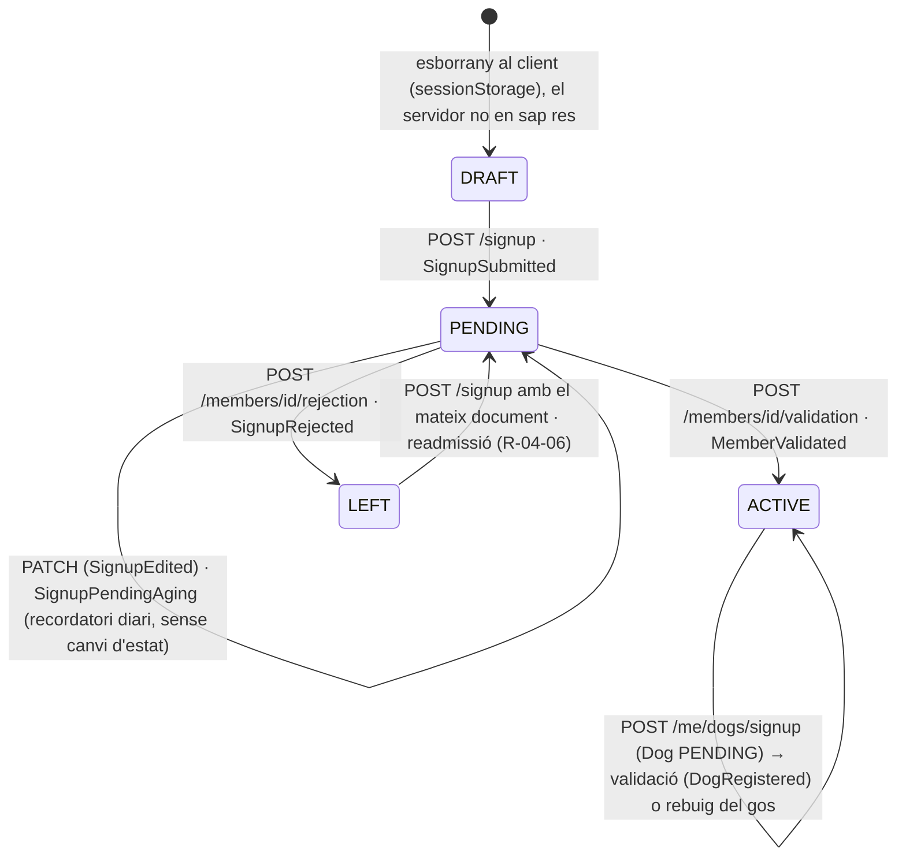
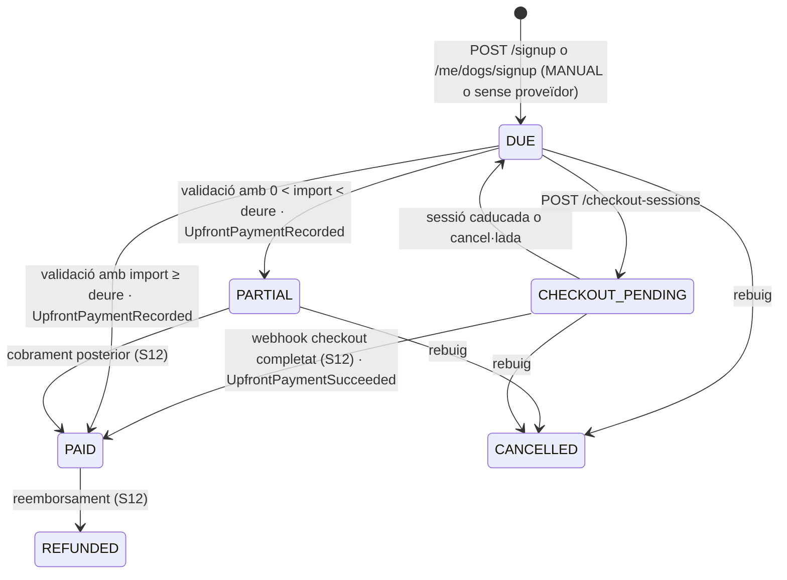

# S04 — Alta pública i validació

**Etapa:** E3 · **Mòduls:** `BILLING`, `PACKS`, `FAMILY_GROUP`, `SINGLE_CLASS` (només per a la llista de modalitats) · **Pantalles:** 16, 17, 18, 19, D2 (+ la targeta «Preinscripcions pendents» de D1, que pertany a S14 però s'alimenta d'aquí) (fitxers a `03-disseny/mockups/pantalles/`) · **Model:** ABONAT, GRUP_FAMILIAR, GOS, DOCUMENT_GOS, MODALITAT/TARIFA, COBRAMENT_ANTICIPAT, PARAMETRE/AUDITORIA de v1.6 + §1 (ACCOUNT/MEMBERSHIP), §2 (CLUB: `paymentProviders`, `legal`, `countryProfile`), §3 (`Member.paymentMethod`, `gender`, `Plan`, `Price`) i §4 (`UpfrontPayment`) de PLATAFORMA · **Estat:** esborrany (03-09-2026) · **Versió:** 0.1

## 1. Propòsit i abast

Resol l'entrada d'una persona i el seu gos al club sense intervenció prèvia de l'administrador: formulari públic anònim (resolt pel host → `clubId`) en 4 passos, detecció de socis existents (només es registra el gos nou), documents del gos opcionals amb estat «pendent», tria de modalitat i mètode de pagament segons el catàleg i els proveïdors del club, pagament inicial fora de remesa (o a l'acte amb Stripe), consentiments versionats, avís al club (N-01) i validació al backoffice (D2): edició, rebuig amb motiu o validació amb nivell inicial, proper rebut, tarifa i import cobrat → número d'abonat, compte, membresia i benvinguda amb accés (N-02). Inclou el camí «afegir un gos» des de l'app (13 → passos 17/19 per a un abonat existent).

**Cap preinscripció és una entitat nova**: la sol·licitud pendent **és** el `Member` en estat `PENDING` (amb els seus `Dog` `PENDING` i el bloc embegut `Member.signup`); un gos afegit per un abonat actiu és un `Dog` `PENDING` d'un `Member` `ACTIVE`.

| Fora d'abast | On viu |
|---|---|
| Manteniment de modalitats, tarifes, nivells (D8, D16) | S05 |
| Rebuts, remesa, cobraments posteriors, webhooks Stripe (processament) | S12 — aquí només el lliurament a Checkout/SetupIntent |
| Mecànica d'identitat (enllaç màgic, tokens, `apps/id`) | S01 — aquí només s'invoca |
| Fitxa D10, llistats D5/D15, edició d'abonats i gossos ja actius, transferència de gossos | S03 (aquí es fixa què pot editar D2 mentre és `PENDING`) |
| Tauler D1 (KPIs, targeta de pendents), auditoria, RGPD | S14 (aquí es defineixen els camps que la targeta consumeix) |
| Recordatori de sol·licituds pendents (N-34), neteja de fitxers orfes | S15 |
| Redacció dels documents legals | `PENDENTS_DESENVOLUPAMENT.md` §1 (bloqueja obrir l'alta real, no el codi) |

## 2. Pantalles i rutes

Apps: `apps/clubs` (PWA, ruta pública `/apuntat-hi/*`, PLA_FRONTEND §3) i `apps/clubs-admin` (`/preinscripcions/:memberId`). L'esborrany del formulari viu **només al client** (`sessionStorage`, clau `signup.draft.v1`, descartat als 24 h o en enviar); el servidor no coneix res fins a `POST /signup`. Capçalera comuna: títol «Apunta-t'hi», selector d'idioma «CAT ▾» (anònim → `localStorage`, refetch de `GET /signup` amb `Accept-Language`), punts de progrés («Pas n de N»: N = 4 amb `FAMILY_GROUP`, 3 sense).

| Mockup | App | Ruta | Rol | Notes de comportament |
|---|---|---|---|---|
| 16 | clubs | `/apuntat-hi` | ANON | Carrega `GET /branding` + `GET /signup`. Si `signup.enabled=false` o el club no és `ACTIVE`: només `signup.text.closed`. Camps segons `countryProfile` (R-04-01…03): «DNI / NIE» i «Passaport — si no tens DNI/NIE» (el passaport només s'habilita si DNI/NIE és buit), nom, 2 cognoms, data de naixement, «Gènere» (xips Masculí · Femení · Altres / No binari), «Email», «Segon email (opcional)», 2 telèfons amb prefix i «Descripció», «Carrer i número», «CP», «Població (proposada pel CP)». Nota grisa fixa «Ja ets soci i vols afegir un altre gos? …». [CONTINUA]: validació en viu (400 del back mapejat a camps) i `POST /signup/identity-checks` (R-04-05): `NEW` → 17 · `VERIFICATION_SENT` → estat «Revisa el correu» (masked email, botó «Torna-m'ho a enviar» amb rate limit) · `SIGNUP_ALREADY_PENDING` / `CONTACT_CLUB` → missatge inline, no continua. |
| 17 | clubs | `/apuntat-hi/gos` | ANON · MEMBER (mode afegir gos) | «Pas 2 de 4 · El teu gos (n'hi podràs afegir més després)»: un sol gos per sol·licitud. Camps: «Nom del gos», Mascle/Femella, «Raça», «Naix.» (mes/any), «Núm. de xip», «Cartilla de vacunes» (uploader: `POST /signup/upload-urls` → PUT S3; cada fitxer amb nom proposat `cartilla_{nom}_{n}.{ext}`; «＋ Afegir un altre full»), nota «És imprescindible per començar les classes: si ara no la tens a mà, te la demanarem més endavant.» (només si `signup.requireDogDocumentAtSignup=false`). Textos `signup.text.freeTrainingConditions` i `signup.text.therapyIntro` (si no són buits). Bloc «Modalitat»: targetes de `GET /signup.plans` (R-04-09): preu, «Entrada n €», `conditions`, «Ofertes si es porta més d'un gos per família» (només `FAMILY_GROUP`), [ACTIVAR]/selecció. Sense `BILLING`: targetes sense imports. [CONTINUA] → 18 (o 19 si `FAMILY_GROUP` off o mode afegir gos). |
| 18 | clubs | `/apuntat-hi/familia` | ANON | Requereix `FAMILY_GROUP`. «‹» torna a 17 conservant l'esborrany. Text `signup.text.familyGroupIntro`; targeta «Quota familiar» amb l'entrada per gos nou; «Dades del responsable del grup»: «Nom del responsable» + «Nom d'un dels seus gossos». Amb els dos camps buits, [CONTINUA] passa sense reclamació. Amb dades: `POST /signup/family-group-lookups` → `FOUND`: nota verda «Grup trobat: {holderDisplayName}. El gos nou quedarà vinculat al seu grup familiar.» · `NOT_FOUND`: error inline (literal del mockup) amb l'enllaç «Deixa-ho pendent i continua ›» (només si `signup.allowFamilyGroupPending=true`; si no, cal corregir o buidar). Peu: «La vostra tarifa s'ajustarà en el moment de la validació de l'alta.» |
| 19 | clubs | `/apuntat-hi/pagament` | ANON · MEMBER | «Pas 4 de 4 · Pagament i consentiments». Bloc «Pagament dels rebuts mensuals» només amb `BILLING`: text `signup.text.monthlyPaymentIntro`; segment amb els mètodes de `GET /signup.paymentMethods` (R-04-10): «Domiciliació» → «IBAN» + «Titular del compte» (preomplert, editable) + text del mandat + `signup.text.paymentDay` · «Targeta» → text «pagaràs amb targeta de forma segura en enviar» + `signup.text.paymentDay` · «Efectiu» → `signup.text.cashConditions`. Targeta «Pagament inicial» (R-04-14/15): «Entrada (n gos)», «Quota mensual — tria quan vols començar:» amb 2 opcions radio, «Total a pagar al club», instruccions `MANUAL.instructions` (o «El pagament es fa en enviar» amb Stripe). Consentiments: «Accepto la política de privacitat» + «Pots consultar-la aquí» (obre `privacyPolicyUrl` en pestanya nova, sense sortir del flux) · «Autoritzo l'ús de la meva imatge» + «què vol dir?» (desplega `signup.text.imageConsent`). [ENVIA LA SOL·LICITUD] deshabilitat sense privacitat acceptada → `POST /signup` (o `POST /me/dogs/signup`) → amb Stripe: `POST /checkout-sessions` + redirecció · si no: `/apuntat-hi/enviada`. Peu: «El club revisarà la sol·licitud i el pagament, i t'enviarà la benvinguda amb l'accés i la Guia de l'usuari.» |
| — | clubs | `/apuntat-hi/enviada` | ANON | Confirmació (sense mockup, assumpció §13): títol «Sol·licitud enviada», el peu de 19 i, si hi ha Checkout, «Rebràs la confirmació del pagament per correu». Neteja l'esborrany. Retorn de Stripe (`?cs=`) mostra el mateix; `?cs=cancel` torna a 19 amb avís «El pagament no s'ha completat: pots reintentar-lo des del correu que t'hem enviat». |
| 13 → 17/19 | clubs | `/gossos/nou`, `/gossos/nou/pagament` | MEMBER (també impersonat, auditat) | [＋ AFEGEIX UN GOS] de 13 obre 17 en mode afegir gos (`GET /signup` autenticat retorna `member`): modalitat preseleccionada amb la vigent; 18 no existeix; 19 mostra el mètode de pagament vigent en només lectura («Domiciliació · ···· 2231»), el pagament inicial del gos nou (R-04-14) i els consentiments només si `legalTextsVersion` ha canviat des de l'última acceptació. Envia amb `POST /me/dogs/signup`. |
| D2 | clubs-admin | `/preinscripcions/:memberId` | ADMIN | Carrega `GET /members/{id}/signup`. Capçalera «Preinscripció #{number o id curt} — {nom} + {gossos}» + badge «pendent des de fa n dies» (avís si n ≥ `dashboard.pendingSignupAgeWarnDays`). Targeta Persona (nom, DNI/NIE, contacte amb WhatsApp `wa.me`, «Grup familiar» amb badge «tarifa familiar en validar», «Pagament» amb IBAN emmascarat); avís groc d'imatge (R-04-18); avís vermell «Compte no informat» (R-04-10). Targeta «Gos (i de n)» per gos: dades, xip, «Documents» (enllaços signats), «Notes als instructors», «Nivell inicial» (només `levels.enabled`), «Data del proper rebut» amb badge «obligatori» (només `BILLING` i pla `MONTHLY`). Targeta «Modalitat i tarifa» (selector pla/tarifa, `dryRun` recalcula) i «Pagament inicial (anticipat)» amb «Import efectivament cobrat:» (només lectura + badge «cobrat» si Stripe ha pagat). Botons: [EDITA LES DADES] (formulari amb els camps de 16/17/19, `PATCH /members/{id}` i `PATCH /dogs/{id}`), [REBUTJA (amb motiu)] (modal amb motiu obligatori), [VALIDA L'ALTA] (`POST /members/{id}/validation`; els errors 422 es mostren sobre el camp). Després de validar: toast i retorn a D1. |
| D1 (targeta) | clubs-admin | `/tauler` | ADMIN | S14. Files «{nom curt} + {gos} ({raça}) · {pla} · {mètode}» + badge «Compte no informat» + [VALIDA] → D2. Font: `GET /members?filter=signupPending:eq:true&sort=signup.submittedAt,asc&fields=id,shortName,pendingDogs,planName,paymentMethodType,warnings,signup.submittedAt`; comptador del menú «Preinscripcions» = `totalItems`. |

## 3. Entitats i camps

Només el que aquest vertical crea o modifica. Tipus segons `CONVENCIONS_API.md` §5 (Money en unitats menors, dates `YYYY-MM-DD`, instants UTC).

### `Member` (col·lecció `members`, `clubId` implícit)
| Camp | Tipus | Oblig. | Validació | Notes |
|---|---|---|---|---|
| `number` | int | a la validació | seqüència per club, mai reutilitzat | `null` mentre `PENDING` (R-04-21) |
| `status` | enum `PENDING` · `ACTIVE` · `LEFT` | sí | màquina d'estats §5 | v1.6: Pendent → Alta → Baixa |
| `idDocument` | `{type: DNI · NIE · PASSPORT · OTHER, value}` | sí | per `CountryProfile` (R-04-01); `value` normalitzat (majúscules, sense espais ni guions); únic al club entre no-`LEFT` | `OTHER` només perfil `GENERIC` |
| `firstName`, `lastName1`, `lastName2` | string 1–60 | sí, sí, no | trim | `shortName` derivat: «Marta R.» |
| `birthDate` | date | sí | passat, ≥ 1900-01-01 | edat mínima: dubte §13 |
| `gender` | enum `MALE` · `FEMALE` · `OTHER` | sí | — | «Altres / No binari» = `OTHER` (textos en masculí en ca/es) |
| `contactEmails[]` | `[{email, primary, bounced}]` màx. 2 | ≥ 1 | format, minúscules, diferents entre si; `[0].primary=true` | `[0]` esdevé `Account.email` a la validació |
| `phones[]` | `[{e164, label}]` màx. 2 | ≥ 1 | per perfil (R-04-03); `label` ≤ 30, obligatori al 2n | SMS a tots dos (S11) |
| `address` | `{street, postalCode, town}` | sí | CP per perfil; `town` de la proposta o lliure (R-04-02) | |
| `paymentMethod` | `{type: SEPA_DD · CARD · MANUAL, …}` | amb `BILLING` | R-04-10; IBAN opcional però vàlid si s'informa | `SEPA_DD{iban, holderName, holderTaxId?, mandateRef (validació), mandateSignedAt=submittedAt}` · `CARD{…omplert pel webhook S12}` · `MANUAL{channel: null}` |
| `consents[]` | `[{type: PRIVACY_POLICY · IMAGE_USE, granted, version, at, locale, ipHash}]` | sí | R-04-17 | històric append-only |
| `planId`, `priceId` | ref `Plan`, `Price` | validació | pla actiu i disponible pel mòdul (R-04-09) | a `PENDING` només `signup.planIdRequested` |
| `nextInvoiceDate` | date | validació si `BILLING` i pla `MONTHLY` | ≥ `signup.upfront.firstMonth.startDate` | R-04-15 |
| `familyGroupId` | ref `FamilyGroup` | no | fixat a la validació (R-04-13) | |
| `notesToInstructors` | — | — | — | viu al `Dog` (v1.6): vegeu més avall |
| `accountId` | ref `Account` (global) | validació | R-04-22 | |
| `leftAt`, `leftReason` | instant, enum (+ `SIGNUP_REJECTED`) | rebuig | | S13 gestiona la resta de motius |
| `version` | int | sí | optimistic locking | `409 STALE_VERSION` |

### `Member.signup` (embegut; només té sentit mentre hi ha alguna cosa pendent, però es conserva)
| Camp | Tipus | Notes |
|---|---|---|
| `source` | `PUBLIC` · `APP_ADD_DOG` | qui l'ha originat |
| `submittedAt`, `locale`, `ipHash`, `userAgent` | instant, BCP-47, sha-256 truncat, string | `locale` = idioma de la pantalla → `Account.locale` a la validació |
| `planIdRequested`, `paymentMethodTypeRequested` | ref, enum | el que l'aplicant ha triat; l'admin decideix el definitiu a D2 |
| `familyGroupClaim` | `{status: NONE · FOUND · NOT_FOUND_PENDING, holderName, dogName, holderMemberId?}` | R-04-12 |
| `upfront` | `{lines: [{concept, dogId, amountDue}], firstMonth: {option, startDate, amountDue}?, totalDue}` | congelat en enviar; recalculable amb `dryRun` a D2 (R-04-14) |
| `readmission` | bool | R-04-06 |
| `validatedAt`, `validatedByAccountId`, `rejectedAt`, `rejectedByAccountId`, `rejectionReason` | | |

### `Dog` (`dogs`)
| Camp | Tipus | Oblig. | Validació | Notes |
|---|---|---|---|---|
| `memberId`, `status` | ref, enum `PENDING` · `ACTIVE` · `INACTIVE` | sí | | `INACTIVE{SIGNUP_REJECTED}` en rebuig (R-04-23); estats de `Dog` segons S03 |
| `name`, `sex`, `breed`, `birthMonth` | string 1–40, `MALE` · `FEMALE`, string ≤ 60, `YYYY-MM` | sí | `birthMonth` ≤ mes actual | «Naix. — 04/2024» |
| `chip` | string | sí | perfil `ES`: 15 dígits; `GENERIC`: 8–15 alfanumèrics; únic al club entre gossos no-`INACTIVE` (R-04-07) | mai es mostra a l'app (v1.6) |
| `levelId` | ref `Level` | validació si `levels.enabled` | nivell actiu | `levelAssignedAt` = validació |
| `notesToInstructors` | string ≤ 1000 | no | | camp opcional afegit a 17 (dubte §13); adjunts només des de 13 (S10) |
| `freeTrainingOverride` | — | — | — | mai a l'alta («s'assigna després des de la fitxa») |

### `DogDocument` (`dog_documents`) · `FamilyGroup` (`family_groups`) · `UpfrontPayment` (`upfront_payments`)
| Entitat | Camps creats aquí | Notes |
|---|---|---|
| `DogDocument` | `dogId`, `type` (`VACCINATION_CARD` · `INSURANCE` · `OTHER`), `state` (`PENDING` · `RECEIVED`), `files[] {fileKey, name, contentType, sizeBytes, uploadedAt}` | A l'alta sempre es crea el `VACCINATION_CARD`: `RECEIVED` si ≥ 1 fitxer, si no `PENDING` (+ `DogDocumentPending`) (R-04-08) |
| `FamilyGroup` | `holderMemberId`, `memberIds[]`, `createdAt` | creat o ampliat només a la validació (R-04-13) |
| `UpfrontPayment` | `memberId`, `dogId`, `concept` (`ENTRY_FEE` · `FIRST_MONTH` · `PACK`), `amountDue`, `amountPaid`, `provider` (`STRIPE{checkoutSessionId, paymentIntentId}` · `MANUAL{channel?, paidAt}` · `null`), `status` (§5), `createdAt` | un registre per línia del bloc «Pagament inicial»; moviments immutables: les correccions són registres nous (S12) |

### `Account` · `Membership` (identity, via el servei d'S01) · `Plan` / `Price` (lectura)
| Entitat | Ús en aquest vertical |
|---|---|
| `Account` | creat a la validació si `contactEmails[0].email` no existeix: `{email, name, givenName, familyName, locale: signup.locale, passwordHash: null, status: ACTIVE}` → `AccountCreated{source: SIGNUP}`; si existeix, es reutilitza (R-04-22) |
| `Membership` | `{accountId, clubId, roles: [MEMBER], memberId, defaultProfile: MEMBER, status: ACTIVE}` → `MembershipChanged` |
| `Plan` | camps llegits: `type`, `active`, `showOnSignup`, `offerLabel`, `name/description/conditions` (LocalizedText), `entryFee {amount?, percentOfStandard?}`, `maintenanceFee`, `pack {sessions, validityMonths}` |
| `Price` | vigent a la data (`validFrom ≤ avui < validTo`), `periodicity`, `amount`, `scope` (`STANDARD` · `FAMILY`, S05) |

## 4. Regles de negoci

Valors del Cànic sempre com a `clau = valor`. «Avui» = data local del club (`CLUB.timeZone`).

| Regla | Enunciat · paràmetres · exemple |
|---|---|
| **R-04-01 Document d'identitat** | Segons `CLUB.countryProfile`. `ES`: DNI = 8 dígits + lletra de control `TRWAGMYFPDXBNJZSQVHLCKE[n mod 23]` (7 dígits → zero a l'esquerra); NIE = X/Y/Z + 7 dígits + lletra (X→0, Y→1, Z→2 abans del mòdul); passaport 5–20 alfanumèrics **només** si DNI/NIE és buit (el front amaga el camp; si arriben tots dos → `400 ID_DOCUMENT_AMBIGUOUS`). `GENERIC`: `type` `PASSPORT`/`OTHER`, valor lliure ≥ 4. Valor normalitzat. **Exemples:** `12345678Z` ✓ · `12345678A` ✗ `INVALID_ID_DOCUMENT` · `x1234567-l` → `X1234567L` ✓ · `Y1234567X` ✓ · `Z1234567R` ✓ · `1234567L` → `01234567L` ✓. |
| **R-04-02 CP → població** | `ES`: CP de 5 dígits; `GET /signup/towns?postalCode=` retorna les poblacions del dataset: 0 → camp lliure obligatori · 1 → preomplerta · >1 → llista (la primera per defecte). `GENERIC`: CP lliure 3–10 caràcters, població lliure. **Exemple:** `08349` → [Cabrera de Mar]; un CP amb 3 poblacions → llista de 3. |
| **R-04-03 Telèfons i emails** | `ES`: prefix per defecte `+34`, 9 dígits nacionals; `GENERIC`: prefix obligatori, 7–15 dígits. Es desa E.164 (`+34655123456`). 1r telèfon obligatori; 2n opcional amb `label` obligatori. Emails: format RFC 5322 simplificat, minúscules, diferents entre si; el 1r és `primary`. **Exemple:** `655 12 34 56` + `+34` → `+34655123456` ✓ · `55 12 34 56` ✗ `INVALID_PHONE`. |
| **R-04-04 Gènere i textos** | `gender` obligatori. Els textos amb gènere usen ICU `select` amb `MALE`/`FEMALE`/`OTHER`; en `ca`/`es` `OTHER` cau al masculí, en `en` és neutre. **Exemple N-02:** `ca` «Benvinguda, Marta!» (FEMALE) · «Benvingut, Pau!» (MALE i OTHER) · `es` «¡Bienvenida, Marta!» · `en` «Welcome, Marta!» (tots). |
| **R-04-05 Persona existent** | `POST /signup/identity-checks` (i de nou dins `POST /signup`) cerca al club, entre `Member` `PENDING`/`ACTIVE`: `idDocument.value` igual **o** `contactEmails[0].email` ∈ emails de l'aplicant (només l'email principal: els segons emails poden ser compartits en família). Resultats: cap → `NEW` · `PENDING` → `SIGNUP_ALREADY_PENDING` (missatge «Ja tenim una sol·licitud pendent amb aquestes dades; el club la revisarà aviat», assumpció) · `ACTIVE` amb `Account` → `VERIFICATION_SENT`: s'emet `SignupRecognitionRequested{memberId, accountId}` (proposta §13) → enllaç màgic d'S01 (`auth.magicLinkMinutes = 15`, `redirect=/gossos/nou`) al correu principal de l'abonat; la resposta només porta `maskedEmail` («m•••a@e•••.cat») · `ACTIVE` sense `Account` → `CONTACT_CLUB`. El document mana sobre l'email. A `POST /signup` la mateixa coincidència → `409 SIGNUP_ALREADY_PENDING` / `409 MEMBER_ALREADY_EXISTS`. **Exemples:** Marta (activa) torna a omplir el pas 1 amb el seu DNI → `VERIFICATION_SENT`; Pau posa `pau@exemple.cat` (2n email de Marta) i el seu DNI → `NEW`; Pau posa `marta@exemple.cat` com a email principal → `VERIFICATION_SENT` a Marta (Pau necessita un email propi). |
| **R-04-06 Readmissió** | `POST /signup` amb l'`idDocument` d'un `Member` `LEFT` del club: no es crea cap registre; el mateix `Member` torna a `PENDING` amb les dades enviades (contacte, adreça, mètode de pagament, entrades noves de consentiments), `signup.readmission=true`, `number` conservat; els gossos antics segueixen `LEFT` llevat de R-04-07. D2 mostra el distintiu «Readmissió» (literal nou, §13). **Exemple:** Joan (núm. 214, baixa 2025) s'apunta amb el mateix DNI → Member 214 `PENDING`; en validar conserva el 214. |
| **R-04-07 Xip únic** | `chip` únic al club entre gossos no-`INACTIVE`. Coincideix amb un gos d'**un altre** abonat (actiu o `INACTIVE`) → `422 DOG_CHIP_ALREADY_REGISTERED` («Aquest xip ja està registrat: contacta amb el club», les transferències són de l'admin, S03). Coincideix amb un gos `LEFT` del **mateix** abonat (readmissió) → aquell `Dog` torna a `PENDING` amb les dades noves. |
| **R-04-08 Cartilla** | `signup.requireDogDocumentAtSignup = false`: fitxers opcionals; sense fitxer el `DogDocument` `VACCINATION_CARD` queda `PENDING` → `DogDocumentPending` (D15, reclamació N-23 manual des de D10 o per `messaging.documentReminderDays` a S15). `true` → `422 DOG_DOCUMENT_REQUIRED`. Pujada: `POST /signup/upload-urls` → URL signada PUT (15 min) amb clau `signup/{clubId}/{yyyyMM}/{uuid}/{nomSanejat}`; mida ≤ `files.maxSizeMb = 25`; tipus `image/*` i `application/pdf` (∩ `files.allowedTypes`); ≤ 10 fitxers per sol·licitud; nom ≤ 80 caràcters (la UI proposa `cartilla_{Nom}_{n}.{ext}`). En enviar, el back comprova que cada `fileKey` existeix i és del prefix del club (`400 FILE_NOT_FOUND`); claus orfes es netegen als 48 h (S15). |
| **R-04-09 Modalitats mostrades** | `GET /signup.plans` = `Plan.active ∧ showOnSignup` ∧ tipus permès (`PACK` requereix `PACKS`; `SINGLE_CLASS` requereix `SINGLE_CLASS`; `MONTHLY` sempre), ordre del catàleg, amb la tarifa `STANDARD` vigent i l'entrada resolta = `Plan.entryFee.amount` ?? `billing.entryFeePerDog × percentOfStandard/100` ?? (`MONTHLY`: `billing.entryFeePerDog = 100 €` · `PACK`/`SINGLE_CLASS`: 0). Sense `BILLING`: mateixa llista sense imports. Llista buida → el bloc no es mostra i `planIdRequested = null`. Pla fora de la llista → `422 PLAN_NOT_AVAILABLE`. **Cànic:** Abonat `MONTHLY` 60 €/mes + entrada 100 € · Pack 6 `PACK` 135 € (3 mesos) · Pack 10 `PACK` 180 € (5 mesos) · Teràpia `MONTHLY` amb `entryFee.percentOfStandard = 50` → 50 €, `maintenanceFee` 10 €/mes i sense tarifa estàndard («condicions i cost segons cada cas»). |
| **R-04-10 Mètodes de pagament** | Només amb `BILLING`. `GET /signup.paymentMethods` = proveïdors actius de `CLUB.paymentProviders`: `SEPA_XML → SEPA_DD` («Domiciliació»), `STRIPE → CARD` («Targeta»), `MANUAL → MANUAL` («Efectiu»), en l'ordre configurat; tipus no ofert → `422 PAYMENT_METHOD_NOT_AVAILABLE`. `SEPA_DD`: IBAN **opcional** (pot no tenir-lo a mà) però validat si s'informa (mod-97 + longitud del país; ES = 24); titular preomplert amb el nom complet de l'aplicant (o del responsable si «Grup trobat»), editable; `holderTaxId` opcional (perfil `ES`: DNI/NIE/NIF); text del mandat = clau `signup:payment.mandate.{perfil}` amb `[[club_legal_name]]` (només `ES` cita la llei 16/2009); `mandateSignedAt = submittedAt`, `mandateRef` l'assigna S12 a la validació. **«Compte no informat»** = `SEPA_DD ∧ iban = null` → avís `ACCOUNT_NOT_PROVIDED` (vermell a D1 i D2); no bloqueja la validació (assumpció §13) i persisteix a D10 fins que hi ha IBAN. `CARD`: no es captura res al formulari (R-04-26). `MANUAL`: `channel = null` (l'admin el pot fixar a D10). |
| **R-04-11 Pas 18** | Només amb `FAMILY_GROUP` i mai en mode afegir gos. Dos camps buits → `familyGroupClaim.status = NONE`; un de sol → error de camp; reclamació amb el mòdul off → `400`. |
| **R-04-12 Cerca del responsable** | Normalització (minúscules, sense accents, espais compactats). Candidats: `Member` `ACTIVE` o `PENDING` del club el nom complet dels quals conté **tots** els tokens de `holderName` (mínim 2 tokens) **i** amb un `Dog` no-`LEFT` de nom igual a `dogName`. Exactament 1 → `FOUND` amb `holderDisplayName` (nom + inicial: «Marta R.»); 0 o >1 → `NOT_FOUND`. L'id del titular **no** viatja al client: `POST /signup` repeteix la cerca i desa `holderMemberId`; si en aquell moment ja no és únic → `NOT_FOUND_PENDING`. «Deixa-ho pendent i continua ›» només si `signup.allowFamilyGroupPending = true`. **Exemples:** «Marta Roca» + «Kiwi» → `FOUND` «Marta R.» · «Marta» + «Kiwi» → `NOT_FOUND` (1 token) · «Marta Roca» + «Kiwy» → `NOT_FOUND`. |
| **R-04-13 Grup i tarifa familiar a la validació** | `FOUND` → el `FamilyGroup` del titular (es crea si no en té: `holderMemberId`, `memberIds=[titular]`) incorpora el nou abonat. `NOT_FOUND_PENDING` → D2 mostra el que va escriure l'aplicant i un cercador d'abonats per triar-lo o «Sense grup» (`familyGroupId` opcional al cos). Proposta de tarifa: si el grup resultant té ≥ 2 gossos no-`LEFT`, la tarifa `FAMILY` del pla si existeix (Cànic: 90 €/mes), si no la `STANDARD` amb la pista informativa `billing.familyDiscountPercentFromSecondDog = 50`; l'admin pot canviar-la. Qui rep el rebut unificat = S12. **Exemple:** Pau (1 gos) s'uneix al grup de Marta (Kiwi) → 2 gossos → proposta `FAMILY` 90 €/mes. |
| **R-04-14 Línies del pagament inicial** | Per `Plan.type`: `MONTHLY` → `ENTRY_FEE` per gos (omesa si 0) + `FIRST_MONTH` només si el pla té tarifa `STANDARD` mensual vigent (import R-04-15) · `PACK` → `PACK` (tarifa) + `ENTRY_FEE` només si > 0 · `SINGLE_CLASS` → `ENTRY_FEE` només si > 0 · sense `BILLING` → cap línia (bloc ocult) · mode afegir gos → només `ENTRY_FEE` (assumpció §13). `totalDue` = suma, en `CLUB.currency`. **Exemples:** Abonat el 17-08 → 100 + 30 = 130 € («Total a pagar al club 130 €») · Pack 6 → 135 € · Teràpia → 50 € (sense `FIRST_MONTH`: no té tarifa estàndard). |
| **R-04-15 Mig mes / mes complet** | D = `signup.firstMonthSplitDay = 16`, d = dia d'avui (local del club), P = tarifa mensual. d < D: A «Alta avui, {data} (mes complet)» = P, `startDate` = avui · B «Alta el dia {D} de {mes} (mig mes)» = P/2, `startDate` = dia D. d ≥ D: A «Alta avui, {data} (mig mes)» = P/2, `startDate` = avui · B «Alta l'1 de {mes següent} (mes complet)» = P, `startDate` = 1 del mes següent. Per defecte A. P/2 = `amountMinor/2` arrodonit HALF_UP. Proposta de `nextInvoiceDate` = dia `billing.nextInvoiceDayOfMonth = 1` del mes següent al de `startDate`. **Exemples:** 17-08-2026: A 30 € (17-08 → rebut 01-09-2026), B 60 € (01-09 → 01-10-2026) · 05-08-2026: A 60 € (05-08 → 01-09), B 30 € (16-08 → 01-09) · 16-08-2026: branca d ≥ D · 31-12-2026: B «Alta l'1 de gener (mes complet)» → 01-02-2027 · P = 65 € → 32,50 € · P = 59,99 € → 30,00 €. Fus: `2026-08-15T22:30:00Z` és 16-08 00:30 a `Europe/Madrid` (d = 16) i 15-08 19:30 a Buenos Aires (d = 15). |
| **R-04-16 Import efectivament cobrat** | A la validació, `upfrontAmountPaid` obligatori si `BILLING` ∧ `totalDue > 0` ∧ cap pagament Stripe; 0 permès (la UI confirma «No s'ha cobrat res: queda pendent»); > `totalDue` → `422 UPFRONT_AMOUNT_EXCEEDS_DUE`. Assignació en cascada per l'ordre de línies (`ENTRY_FEE` → `FIRST_MONTH`/`PACK`): cada línia queda `PAID`, `PARTIAL` o `DUE` amb `provider = MANUAL{paidAt}`; `UpfrontPaymentRecorded` per línia amb import > 0. Si Stripe ja ha cobrat, el camp és de lectura amb «cobrat». **Exemples:** deure 100 + 30, cobrat 130 → tot `PAID` («cobrat») · 100 → entrada `PAID`, quota `DUE` · 50 → entrada `PARTIAL` (50/100), quota `DUE` · 0 → tot `DUE` (D10 ho mostra com a pendent, S03/S12). |
| **R-04-17 Consentiments versionats** | `GET /signup.legal = {privacyPolicyUrl, legalTextsVersion, imageConsentText}` (de `CLUB.legal`; `club.privacyPolicyUrl = agilitycanic.cat/ca/politica-de-privacidad/`). Enviar exigeix `consents.privacyPolicy.accepted = true` amb `version = CLUB.legal.legalTextsVersion` (`400` si no s'accepta, `422 CONSENT_VERSION_OUTDATED` si la versió és vella: el client recarrega la configuració i torna a demanar-ho); `imageUse.granted` bool. Cada entrada desa `{version, at, locale, ipHash}`; mai s'edita ni s'esborra. Mode afegir gos: la privacitat només es torna a demanar si l'última entrada `PRIVACY_POLICY` és d'una versió anterior. «Pots consultar-la aquí» obre la URL en pestanya nova i no interromp el flux. **Exemple:** el club puja `legalTextsVersion` de `2026-09` a `2027-01` amb el formulari obert → `422` → la casella es desmarca amb l'enllaç nou. |
| **R-04-18 Avisos de D2** | `GET /members/{id}/signup.warnings[]`: `NO_IMAGE_CONSENT` → groc «No autoritza l'ús de la seva imatge: no publiqueu fotos on surti ella.» (ICU per `gender`: FEMALE «ella», altrament «ell»; `es` «ella/él»; `en` «her/him», OTHER «them») · `ACCOUNT_NOT_PROVIDED` → vermell «Compte no informat» · `DOCUMENT_PENDING` · `FAMILY_HOLDER_NOT_FOUND` · `UPFRONT_UNPAID` · `READMISSION`. Els consentiments **només** apareixen com a avís (v1.6): si autoritza la imatge no es mostra res. |
| **R-04-19 Edició a D2** | Mentre `Member.status = PENDING`, l'ADMIN pot editar la persona (camps de 16), `paymentMethod` (incloent-hi informar l'IBAN, que resol «Compte no informat»), `signup.planIdRequested` i cada `Dog` `PENDING` (camps de 17 + afegir/treure fitxers) amb `PATCH /members/{id}` i `PATCH /dogs/{id}` (contracte d'S03) i `version`. Els consentiments no són editables. S'emet `SignupEdited{memberId, diff}` (en lloc de `MemberUpdated`) i s'audita `before/after`. Amb l'abonat `ACTIVE` (gos afegit) només s'editen aquí els gossos `PENDING`; la persona, per D10. |
| **R-04-20 Rate limit i antiabús** | Per IP (de `X-Forwarded-For` que injecta Caddy) i club: `identity-checks` 10/h · `family-group-lookups` 20/h · `upload-urls` 30/h · `POST /signup` 5/h i 20/dia · `POST /checkout-sessions` anònim 10/h · `towns` 60/h → `429 RATE_LIMITED` + `Retry-After`. Camp trampa `website` (ocult): si arriba ple → `202` i es descarta sense desar res (log). Cos ≤ 64 KB, ≤ 10 fitxers. `signupToken` (HMAC amb clau del servidor, 24 h, lligat a `memberId`) obligatori a `/checkout-sessions` anònim. Les cerques només revelen `maskedEmail` / `holderDisplayName`. Sense CAPTCHA a R1 (Turnstile opcional, §13). Logs amb `traceId`, `clubId`, `ipHash`. |
| **R-04-21 Número d'abonat** | A la validació: `number` = comptador per club incrementat atòmicament (`findAndModify`); mai es reutilitza ni es reassigna; readmissió conserva el número. **Exemple:** darrer 356 → Marta 357. |
| **R-04-22 Compte i membresia** | A la validació, amb l'email principal: `Account` existent (usuari de Learn, abonat d'un altre club) → es reutilitza; inexistent → es crea (`AccountCreated{source: SIGNUP}`, `locale = signup.locale`, sense contrasenya). `Membership {roles: [MEMBER], memberId, defaultProfile: MEMBER}` → `MembershipChanged`; si ja existia una membresia al club → `409 MEMBERSHIP_EXISTS`. `MemberValidated` → N-02 amb `link` = enllaç màgic de benvinguda (validesa `auth.welcomeLinkDays`, proposta §13; caducat → es demana un de nou des de 01). Tot en una transacció (Member, Dogs, FamilyGroup, UpfrontPayments, Account/Membership, outbox). |
| **R-04-23 Rebuig** | `reason` 3–500 caràcters, obligatori. `PENDING` → `LEFT` (`leftAt`, `leftReason = SIGNUP_REJECTED`); tots els gossos `PENDING` → `INACTIVE{SIGNUP_REJECTED}`; `UpfrontPayment` `DUE`/`PARTIAL`/`CHECKOUT_PENDING` → `CANCELLED` (els `PAID` es mantenen: D2 avisa «Hi ha un pagament cobrat: caldrà retornar-lo des de Facturació», reemborsament a S12); reclamació descartada; cap `Account`. Abonat `ACTIVE` (gos afegit): només els gossos `PENDING` → `LEFT` i els seus pagaments. `SignupRejected{memberId, dogIds, reason}` → N-03. Un `LEFT` rebutjat pot tornar a sol·licitar l'alta (R-04-06). Auditat amb el motiu. |
| **R-04-24 Antiguitat i recordatori** | Res no caduca ni s'esborra. `signup.submittedAt` alimenta el badge «pendent des de fa n dies» (avís si n ≥ `dashboard.pendingSignupAgeWarnDays = 7`) i el procés diari `SignupPendingAging` → N-34 quan n > `signup.pendingExpiryDays = 30` (S15: `count`, `oldest_days`). Els fitxers d'una sol·licitud `PENDING` mai es netegen. |
| **R-04-25 Afegir un gos des de l'app** | `POST /me/dogs/signup` (MEMBER; impersonat → auditat amb els dos ids, `origin = BACKOFFICE`) exigeix `Member.status = ACTIVE`; crea `Dog` `PENDING`, `DogDocument`, `UpfrontPayment` `ENTRY_FEE` (si > 0) i emet `SignupSubmitted{memberId, dogIds, source: APP_ADD_DOG}` → N-01 (abonat: APP+EMAIL; admins). D1 el llista com «{nom} + {gos} (nou gos)». Validació amb el mateix `POST /members/{id}/validation` (abonat `ACTIVE`): `dogs[{dogId, levelId}]`, canvi opcional de `planId/priceId` (tarifa familiar), `nextInvoiceDate` opcional (es conserva), `upfrontAmountPaid` → gossos `ACTIVE`, `DogRegistered` per gos → N-37; **no** s'emet `MemberValidated` ni N-02 ni canvia número/compte. La pantalla 13 mostra el gos amb el xip «pendent de validació» (assumpció §13). |
| **R-04-26 Lliurament a Stripe** | Si `CLUB.paymentProviders.STRIPE` és actiu i (`totalDue > 0` ∨ `paymentMethodType = CARD`): `POST /signup` respon `checkout.required = true` i el client crida `POST /checkout-sessions {memberId, signupToken, successUrl, cancelUrl}` → `PaymentProvider.createCheckoutSession`: `mode = payment` (o `setup` si `totalDue = 0` i `CARD`), una línia per `UpfrontPayment` (descripció en `signup.locale`), `customer_email`, `client_reference_id = memberId`, `metadata {clubId, memberId, upfrontPaymentIds}`, `setup_future_usage = off_session` si `CARD`, `expires_at = +24 h`; línies → `CHECKOUT_PENDING` amb `checkoutSessionId`; resposta `{checkoutUrl, checkoutSessionId}`. La confirmació arriba per webhook (S12) → `UpfrontPaymentSucceeded` → `PAID` i `Member.paymentMethod.CARD{stripeCustomerId, stripePaymentMethodId, last4, brand}`; `checkout.session.expired` → tornen a `DUE` (enllaç de reintent `pay_link` a N-01, proposta §13). Doble de test `FakeCheckoutGateway`: retorna `https://checkout.test/{sessionId}` i exposa `complete(sessionId)` / `expire(sessionId)`, que invoquen el mateix handler que el webhook. Stripe no actiu → cap opció «Targeta» i `POST /checkout-sessions` → `422 PAYMENT_PROVIDER_NOT_ENABLED`. |
| **R-04-27 Tenant, idempotència, transaccions** | Host → club (`404 CLUB_NOT_FOUND` si no resol); totes les consultes per `clubId` (`TenantRepository`); D2 sobre un abonat d'un altre club → `404 NOT_FOUND`. `POST /signup` i `POST /me/dogs/signup` accepten `Idempotency-Key` (24 h: la segona crida retorna el mateix `201`). Enviament, validació i rebuig en transacció Mongo amb l'outbox; validació i rebuig s'exclouen per `status` + `version` (`409 INVALID_STATE` / `409 STALE_VERSION`). `signup.enabled = false` o club no `ACTIVE` → `409 SIGNUP_CLOSED` (`GET /signup` ho anticipa amb `enabled = false` + `signup.text.closed`). |

## 5. Estats i transicions

### Sol·licitud d'alta (= `Member.status` amb `Member.signup`)



| Transició | Qui | Condició | Efectes | Esdeveniment |
|---|---|---|---|---|
| DRAFT → PENDING | ANON (host) | R-04-01…17, `signup.enabled` | `Member` + `Dog` `PENDING`, `DogDocument`, `UpfrontPayment` (`DUE`), consentiments, reclamació | `SignupSubmitted`, `DogDocumentPending`? |
| PENDING → PENDING | ADMIN | `version` | diff auditat | `SignupEdited` |
| PENDING → ACTIVE | ADMIN | nivell si `levels.enabled`; `nextInvoiceDate` si `BILLING` ∧ `MONTHLY`; pla disponible; import ≤ deure | `number`, `Account`/`Membership`, `FamilyGroup`, `Dog` `ACTIVE` + `levelAssignedAt`, `planId/priceId`, pagaments assignats, `mandateRef` | `MemberValidated`, `AccountCreated`?, `MembershipChanged`, `UpfrontPaymentRecorded`* |
| PENDING → LEFT | ADMIN | motiu | gossos `INACTIVE{SIGNUP_REJECTED}`, pagaments `CANCELLED` | `SignupRejected` |
| LEFT → PENDING | ANON | document d'un `LEFT` | dades substituïdes, `readmission` | `SignupSubmitted{readmission: true}` |
| Dog PENDING → ACTIVE / INACTIVE | ADMIN | amb el seu abonat | `levelId` | (dins `MemberValidated`) o `DogRegistered` (gos afegit) / `SignupRejected` |

### `UpfrontPayment.status`



Els imports no es modifiquen mai sobre un registre existent: un canvi de pla a D2 (`dryRun` → validació) **cancel·la** les línies `DUE` i en crea de noves; les `PAID` es conserven i es descompten del nou deure.

## 6. API

Base `/api/v1` (CONVENCIONS_API §1). Tenant per host als endpoints `ANON`. Tots els errors segons §6.

| Mètode | Ruta | Rol(s) | Mòdul | Idempotent | Descripció | Cos/paràmetres clau | Respostes i errors |
|---|---|---|---|---|---|---|---|
| GET | `/branding` | ANON | — | sí | S02: `modules[]`, `countryProfile`, `timeZone`, `locales`, tema | — | 200 · 404 `CLUB_NOT_FOUND` |
| GET | `/signup` | ANON · MEMBER | — | sí | configuració del formulari (una crida per pantalla) | → `{enabled, closedText?, steps[], plans[{id, type, name, description, conditions, offerLabel, price?, entryFee?, pack?, maintenanceFee?}], paymentMethods[{type, label, mandateText?, instructions?}], texts{freeTrainingConditions, therapyIntro, familyGroupIntro, monthlyPaymentIntro, paymentDay, cashConditions, imageConsent}, legal{privacyPolicyUrl, legalTextsVersion}, upfront{firstMonthSplitDay, today, firstMonthOptions[]}, member?{planId, paymentMethodMasked, consentsUpToDate}}` | 200 · 404 |
| POST | `/signup/identity-checks` | ANON | — | sí (pot enviar correu) | R-04-05 | `{idDocument{type, value}, emails[]}` → `{result: NEW·VERIFICATION_SENT·SIGNUP_ALREADY_PENDING·CONTACT_CLUB, maskedEmail?}` | 200 · 400 · 429 |
| GET | `/signup/towns?postalCode=` | ANON | — | sí | R-04-02 | → `[{name, region}]` (buit si el perfil no té dataset) | 200 · 400 · 429 |
| POST | `/signup/upload-urls` | ANON · MEMBER | — | sí | R-04-08 | `{fileName, contentType, sizeBytes}` → `{uploadUrl, fileKey, expiresAt}` | 200 · 400 `FILE_TYPE_NOT_ALLOWED`/`FILE_TOO_LARGE` · 429 |
| POST | `/signup/family-group-lookups` | ANON | `FAMILY_GROUP` | sí | R-04-12 | `{holderName, dogName}` → `{result: FOUND·NOT_FOUND, holderDisplayName?}` | 200 · 404 `MODULE_DISABLED` · 429 |
| POST | `/signup` | ANON | — | `Idempotency-Key` | enviament (cos a sota) | → `201 {memberId, signupToken, upfront{lines, totalDue}, checkout{required}}` | 400 `VALIDATION_ERROR` · 409 `SIGNUP_CLOSED`/`SIGNUP_ALREADY_PENDING`/`MEMBER_ALREADY_EXISTS` · 422 `PLAN_NOT_AVAILABLE`/`PAYMENT_METHOD_NOT_AVAILABLE`/`DOG_CHIP_ALREADY_REGISTERED`/`DOG_DOCUMENT_REQUIRED`/`CONSENT_VERSION_OUTDATED` · 429 |
| POST | `/checkout-sessions` | ANON (`signupToken`) · MEMBER · ADMIN | `BILLING` | `Idempotency-Key` | R-04-26 | `{memberId, signupToken?, successUrl, cancelUrl}` → `201 {checkoutUrl, checkoutSessionId}` | 401 (token) · 404 · 409 `INVALID_STATE` (res a pagar) · 422 `PAYMENT_PROVIDER_NOT_ENABLED` |
| POST | `/me/dogs/signup` | MEMBER (impersonat: auditat) | — | `Idempotency-Key` | R-04-25 | `{dog, documents[], planIdRequested?, consents?}` → `201 {dogId, upfront, checkout}` | 400 · 409 `MEMBER_NOT_ACTIVE` · 422 (com `/signup`) |
| GET | `/members/{id}/signup` | ADMIN | — | sí | agregat de D2 | → `{member, dogs[{…, documents[{type, state, files[{name, downloadUrl}]}]}], signup, familyGroupClaim{…, holder?}, upfront{lines, totalDue, totalPaid}, proposals{nextInvoiceDate, planId, priceId, familyGroupId?, levels[]}, warnings[], version}` | 200 · 404 |
| GET | `/members?filter=signupPending:eq:true` | ADMIN | — | sí | targeta D1 (S14); camps virtuals `signupPending`, `pendingDogs`, `warnings` declarats `x-filterable` | contracte de llistats §4 | 200 |
| PATCH | `/members/{id}` · `/dogs/{id}` | ADMIN | — | `version` | R-04-19 (contracte d'S03; aquí: permès en `PENDING`) | cos parcial + `version` | 200 · 400 · 409 `STALE_VERSION` · 422 |
| POST | `/members/{id}/validation?dryRun=` | ADMIN | — | `version` | R-04-13…16, 21, 22, 25 | `{version, dogs[{dogId, levelId?}], planId?, priceId?, nextInvoiceDate?, familyGroupId?, upfrontAmountPaid?}` → `dryRun=true`: `{upfront, price, nextInvoiceDate, warnings}` · real: `200 {memberId, number, accountId, dogIds}` | 400 · 404 · 409 `INVALID_STATE`/`STALE_VERSION` · 422 `LEVEL_REQUIRED`/`NEXT_INVOICE_DATE_REQUIRED`/`UPFRONT_AMOUNT_EXCEEDS_DUE`/`PLAN_NOT_AVAILABLE`/`MEMBERSHIP_EXISTS` |
| POST | `/members/{id}/rejection` | ADMIN | — | `version` | R-04-23 | `{version, reason}` → `200 {memberId, status, dogIds}` | 400 · 404 · 409 `INVALID_STATE` |

Cos de `POST /signup` (tot en una crida; `website` és el camp trampa):

```json
{ "locale": "ca", "website": "",
  "person": { "idDocument": {"type": "DNI", "value": "12345678Z"}, "firstName": "Marta", "lastName1": "Roca", "lastName2": "Pujol",
              "birthDate": "1991-05-08", "gender": "FEMALE", "emails": ["marta@exemple.cat", "pau@exemple.cat"],
              "phones": [{"prefix": "+34", "number": "655123456", "label": "Marta"}, {"prefix": "+34", "number": "617123456", "label": "Pau"}],
              "address": {"street": "C. de la Riera, 12", "postalCode": "08349", "town": "Cabrera de Mar"} },
  "dog": { "name": "Kiwi", "sex": "FEMALE", "breed": "Whippet", "birthMonth": "2024-04", "chip": "941000012345678", "notesToInstructors": "Iniciar-nos a l'agility i socialitzar",
           "documents": [{"type": "VACCINATION_CARD", "files": [{"fileKey": "signup/…/cartilla_Kiwi_1.jpg", "name": "cartilla_Kiwi_1.jpg"}]}] },
  "planId": "…", "familyGroupClaim": {"holderName": "Marta Roca", "dogName": "Kiwi", "leavePending": false},
  "payment": { "type": "SEPA_DD", "iban": "ES0000000000000000000000", "holderName": "Marta Roca Pujol", "holderTaxId": null, "firstMonthOption": "TODAY" },
  "consents": { "privacyPolicy": {"accepted": true, "version": "2026-09"}, "imageUse": {"granted": false, "version": "2026-09"} } }
```

`firstMonthOption` ∈ `TODAY` · `ALTERNATIVE` (l'opció B de R-04-15); el back recalcula tot l'import i ignora qualsevol import enviat pel client.

## 7. Esdeveniments

| Emès | Quan | Payload (a més dels camps comuns) |
|---|---|---|
| `SignupSubmitted` | `POST /signup` i `POST /me/dogs/signup` (commit) | `memberId`, `dogIds[]`, `planId` (sol·licitat), `paymentMethodType`, `source` (`PUBLIC` · `APP_ADD_DOG`), `readmission`, `checkoutRequired` |
| `SignupRecognitionRequested` (proposta §13) | `identity-checks` → `VERIFICATION_SENT` | `memberId`, `accountId`, `redirect` — el consumidor demana l'enllaç màgic a identity (S01) |
| `DogDocumentPending` | enviament sense fitxer de cartilla | `dogId`, `type`, `state` |
| `SignupEdited` | `PATCH` sobre `Member`/`Dog` `PENDING` | `memberId`, `dogId?`, `diff` |
| `MemberValidated` | validació d'un `Member` `PENDING` | `memberId`, `memberNumber`, `dogs[{dogId, levelId}]`, `nextInvoiceDate`, `upfrontPaymentIds[]`, `familyGroupId?`, `readmission` |
| `AccountCreated` · `MembershipChanged` | validació (via servei d'identity) | segons catàleg (`source: SIGNUP`) |
| `UpfrontPaymentRecorded` | validació amb import > 0 per línia | `paymentId`, `concept`, `provider: MANUAL`, `amountPaid` |
| `DogRegistered` | validació de gossos d'un abonat `ACTIVE` | `dogId`, `memberId`, `levelId` |
| `SignupRejected` | rebuig | `memberId`, `dogIds[]`, `reason`, `memberWasActive` |

| Consumit | Efecte aquí |
|---|---|
| `UpfrontPaymentSucceeded` / `UpfrontPaymentFailed` (S12, webhook) | actualitza `status` i `provider` de la línia; D2 mostra «cobrat» o `UPFRONT_UNPAID`; si `CARD`, omple `Member.paymentMethod.CARD` |
| `PlanChanged` / `PriceChanged` / `ParameterChanged` / `ClubUpdated` | invalida la cache de `GET /signup` (TTL 60 s) |
| `MagicLinkRequested` (S01) | cap: l'enllaç de reconeixement i el de benvinguda els envia S01/S11 |

## 8. Notificacions

| Codi | Moment exacte | Públic → canals | Variables |
|---|---|---|---|
| N-01 Sol·licitud d'alta rebuda | commit de `SignupSubmitted` | `APPLICANT` → EMAIL (abonat existent: MEMBER → APP+EMAIL) · `ADMINS` → APP+EMAIL, acció `OPEN_SIGNUP` (obre D2) | `member_name`, `dogs`, `plan_name`, `club_name` + proposta: `upfront_total`, `payment_instructions`, `pay_link` (Checkout pendent) |
| N-02 Benvinguda i accés | commit de `MemberValidated` | `MEMBER` → EMAIL (enllaç de benvinguda) + APP (un cop dins) | `member_first_name`, `gender`, `club_name`, `link` |
| N-03 Sol·licitud rebutjada | commit de `SignupRejected` | `APPLICANT` → EMAIL (abonat existent: també APP) | `member_name`, `reason`, `club_name` |
| N-37 Nou gos afegit | `DogRegistered` (gos afegit validat) | `MEMBER` → APP, `OPEN_DOG` | `dog_name` |
| N-39 Verifica que ets tu (proposta §13) | `SignupRecognitionRequested` | compte de l'abonat → EMAIL (SYSTEM) | `link`, `expires_minutes`, `club_name` |
| N-34 (S15) · N-30 (S12) · N-23 (S03) | alimentats per `signup.submittedAt`, `UpfrontPaymentSucceeded`, `DogDocumentPending` | — | — |

Cap notificació s'envia des dels services (CONVENCIONS_API §8); el correu de N-01 a l'aplicant es renderitza en `signup.locale`, el dels admins en el `locale` de cada admin.

## 9. Paràmetres i mòduls

| Clau (Cànic) | On s'usa |
|---|---|
| `signup.enabled` (true), `signup.text.closed` | `GET /signup.enabled`; `409 SIGNUP_CLOSED` |
| `signup.firstMonthSplitDay` (16), `billing.nextInvoiceDayOfMonth` (1) | R-04-15 |
| `signup.requireDogDocumentAtSignup` (false), `files.maxSizeMb` (25), `files.allowedTypes` | R-04-08 |
| `signup.allowFamilyGroupPending` (true) | R-04-12 |
| `signup.text.paymentDay`, `signup.text.cashConditions`, `signup.text.freeTrainingConditions`, `signup.text.imageConsent` + propostes `signup.text.monthlyPaymentIntro`, `signup.text.therapyIntro`, `signup.text.familyGroupIntro` | textos de 17/18/19 (`GET /signup.texts`) |
| `club.privacyPolicyUrl` (CLUB.legal), `CLUB.legal.legalTextsVersion` | R-04-17 |
| `billing.entryFeePerDog` (100 €), `billing.familyDiscountPercentFromSecondDog` (50) | R-04-09, R-04-13 |
| `signup.pendingExpiryDays` (30), `dashboard.pendingSignupAgeWarnDays` (7) | R-04-24 |
| `levels.enabled` (true) | «Nivell inicial» a D2; `LEVEL_REQUIRED` |
| `auth.magicLinkMinutes` (15) + proposta `auth.welcomeLinkDays` (7) | R-04-05, R-04-22 |
| `CLUB.paymentProviders`, `CLUB.countryProfile` (ES), `CLUB.timeZone`, `CLUB.currency`, `CLUB.locales`/`defaultLocale` | R-04-10, R-04-01…03, R-04-15, imports, idiomes |

| Mòdul / regla | Desactivat: què passa |
|---|---|
| `BILLING` off | `GET /signup` sense `paymentMethods`, `upfront` ni imports als plans; 19 només consentiments; `POST /signup` ignora `payment` (400 si hi ha IBAN); cap `UpfrontPayment`; D2 sense «Modalitat i tarifa» (només nom de modalitat), «Pagament inicial» ni «Data del proper rebut»; validació sense `nextInvoiceDate` ni `upfrontAmountPaid` |
| `PACKS` off · `SINGLE_CLASS` off | plans d'aquest tipus fora de la llista encara que tinguin `showOnSignup`; `422 PLAN_NOT_AVAILABLE` si arriben |
| `FAMILY_GROUP` off | sense pas 18 (`steps` = 3), sense «Ofertes si es porta més d'un gos per família», `family-group-lookups` → 404, reclamació → 400, D2 sense fila «Grup familiar» ni proposta de tarifa familiar |
| Stripe no configurat | cap «Targeta»; `POST /checkout-sessions` → 422; pagament inicial només per instruccions `MANUAL` |
| `levels.enabled = false` | D2 sense «Nivell inicial»; `dogs[].levelId` ignorat; `Dog.levelId = null` |
| `FREE_TRAINING` off | cap efecte propi (el text `signup.text.freeTrainingConditions` és contingut del club: s'oculta si és buit) |

## 10. i18n i localització

- **Namespaces nous**: `signup` (16–19, `/apuntat-hi/enviada`, mode afegir gos) i `admin-census` (D2: `signup.*`). Claus principals: `signup:step1.title` («Apunta-t'hi»), `signup:progress.step` (ICU `{n}`/`{total}`), `signup:step1.existingMemberHint`, `signup:step1.verificationSent`, `signup:step2.dogTitle`, `signup:step2.documentHint`, `signup:step2.familyOffer`, `signup:step3.title`, `signup:step3.found` (`{holder}`), `signup:step3.notFound`, `signup:step3.leavePending` («Deixa-ho pendent i continua ›»), `signup:step4.entryFee` (ICU plural `{dogs}`), `signup:step4.firstMonth.todayFull|todayHalf|splitDayHalf|nextMonthFull` (`{date}`), `signup:step4.total`, `signup:step4.privacyLink` («Pots consultar-la aquí»), `signup:step4.imageWhat` («què vol dir?»), `signup:step4.submit` («ENVIA LA SOL·LICITUD»), `signup:sent.*`, `admin-census:signup.imageConsentWarning` (ICU `gender`), `admin-census:signup.accountNotProvided` («Compte no informat»), `admin-census:signup.actions.edit|reject|validate`. Back: `notif.N-01.*`, `notif.N-02.*` (ICU `gender`), `notif.N-03.*`, `notif.N-39.*`, `signup.mandate.ES`, `signup.mandate.GENERIC`, `error.*` per a cada codi d'aquesta spec. Tres idiomes al mateix PR (DoD).
- **`LocalizedText`**: `Plan.name/description/conditions`, `CLUB.paymentProviders.MANUAL.instructions`, tots els `signup.text.*`. Lectura resolta al `locale` de la petició (anònim: `Accept-Language` ∩ `club.locales`, selector «CAT ▾»); fallback `defaultLocale`.
- **Dates i imports**: «avui» i el dia de la regla R-04-15 són de `CLUB.timeZone`; les etiquetes «Alta avui, 17 d'agost» es formaten amb `fmtDate(long)` en el `locale` de l'usuari; imports amb `fmtMoney` i `CLUB.currency`. El back retorna `today` i `firstMonthOptions[{option, startDate, amount}]` ja calculats: el front **no** reimplementa la regla.
- **Gènere**: `Member.gender` → ICU `select` a N-02 i a l'avís d'imatge de D2 (R-04-04, R-04-18).
- **Perfil de país**: `GET /branding.countryProfile {idDocumentTypes[], postalCodeLookup, phonePrefix, requiresIban, mandateTextKey}` decideix els camps de 16 i 19; el back valida amb la implementació (`ES`, `GENERIC`). Afegir un país = perfil nou + dataset + tests, sense tocar pantalles.

## 11. Criteris d'acceptació i tests obligatoris

**Domini (unitaris, sense Mongo)**
- T-04-01 (R-04-01) Donada la implementació `ES`, quan es validen `12345678Z`, `12345678A`, `x1234567-l`, `Y1234567X`, `Z1234567R`, `1234567L`, llavors resulten ✓ · ✗ · ✓ (`X1234567L`) · ✓ · ✓ · ✓ (`01234567L`).
- T-04-02 (R-04-01) Passaport amb DNI buit ✓; passaport i DNI alhora → `ID_DOCUMENT_AMBIGUOUS`; perfil `GENERIC` amb `type=OTHER` i «AB-12» ✓ i «AB» ✗.
- T-04-03 (R-04-02) Dataset de prova amb `08349` → 1 població, un CP amb 3 → 3, CP inexistent → 0; `GENERIC` → sempre 0 i CP lliure acceptat.
- T-04-04 (R-04-03) `655 12 34 56`+`+34` → `+34655123456`; 8 dígits → `INVALID_PHONE`; `GENERIC` sense prefix → error; dos emails iguals → `fieldErrors[emails[1]]`.
- T-04-05 (R-04-15) Taula: (17-08-2026, 60 €) → A 30 € start 17-08 / B 60 € start 01-09, propostes 01-09 / 01-10 · (05-08) → A 60 € / B 30 € start 16-08 · (16-08) → branca d ≥ D · (31-12-2026) → B start 01-01-2027, proposta 01-02-2027 · 65 € → 3250 · 5999 → 3000 · instant `2026-08-15T22:30:00Z` → d = 16 a `Europe/Madrid` i d = 15 a `America/Argentina/Buenos_Aires` · `firstMonthSplitDay = 10` canvia la branca del dia 12.
- T-04-06 (R-04-14) Línies: Abonat → `ENTRY_FEE` 100 + `FIRST_MONTH`; Pack 6 → `PACK` 135 sense entrada; Teràpia → `ENTRY_FEE` 50 sol; `BILLING` off → cap; mode afegir gos → `ENTRY_FEE` sol; pla amb `entryFee.amount = 0` → sense línia d'entrada.
- T-04-07 (R-04-16) Cascada: 130 → `PAID`+`PAID`; 100 → `PAID`+`DUE`; 50 → `PARTIAL`(50)+`DUE`; 0 → `DUE`+`DUE`; 131 → `UPFRONT_AMOUNT_EXCEEDS_DUE`.
- T-04-08 (R-04-12) «Marta Roca»+«Kiwi» → `FOUND` «Marta R.»; «marta roca»+«KIWI» → `FOUND`; «Marta»+«Kiwi» → `NOT_FOUND`; dos candidats → `NOT_FOUND`; gos `INACTIVE` no compta; titular `PENDING` sí.
- T-04-09 (R-04-09) Amb `PACKS` off els packs desapareixen; `showOnSignup = false` desapareix; entrada resolta 100 / 50 (`percentOfStandard`) / 0 (`PACK`); sense `BILLING` cap `price`.
- T-04-10 (R-04-04, R-04-18) Snapshots en `ca`/`es`/`en` de N-02 per a `MALE`/`FEMALE`/`OTHER` («Benvingut, Pau!» · «Benvinguda, Marta!» · «Welcome, Pau!») i de l'avís d'imatge («…on surti ella» / «…on surti ell» / «…where she appears» / «…they»).

**Integració (endpoint, Mongo de test, `FakeCheckoutGateway`, outbox)**
- T-04-11 (R-04-05) Seed Marta `ACTIVE` amb compte: pas 1 amb el seu DNI → `VERIFICATION_SENT` + `maskedEmail` sense nom + `SignupRecognitionRequested` a l'outbox; amb el seu email principal i un altre DNI → `VERIFICATION_SENT`; amb el seu 2n email → `NEW`; contra un `PENDING` → `SIGNUP_ALREADY_PENDING` sense esdeveniment; `POST /signup` amb el DNI de Marta → `409 MEMBER_ALREADY_EXISTS`.
- T-04-12 (R-04-06, R-04-07) Joan `LEFT` núm. 214 amb gos Bruc `INACTIVE` (xip X): `POST /signup` amb el seu DNI i xip X → cap document nou, Member 214 `PENDING` `readmission = true`, Bruc `PENDING`; xip d'un gos d'un altre abonat → `422 DOG_CHIP_ALREADY_REGISTERED`.
- T-04-13 (R-04-08) Sense fitxers → `DogDocument` `PENDING` + `DogDocumentPending`; amb `signup.requireDogDocumentAtSignup = true` → `422`; `fileKey` inexistent o d'un altre club → `400 FILE_NOT_FOUND`; `upload-urls` amb `video/mp4` → `400 FILE_TYPE_NOT_ALLOWED`, 30 MB → `FILE_TOO_LARGE`.
- T-04-14 (R-04-10) `SEPA_DD` sense IBAN → 201 i `warnings` conté `ACCOUNT_NOT_PROVIDED` a `GET /members/{id}/signup` i al llistat de D1; IBAN amb mod-97 incorrecte → 400; `CARD` amb Stripe no configurat → `422 PAYMENT_METHOD_NOT_AVAILABLE`; `GET /signup.paymentMethods[SEPA_DD].mandateText` cita la llei 16/2009 amb perfil `ES` i no amb `GENERIC`.
- T-04-15 (R-04-17) Privacitat no acceptada → 400; versió `2026-08` amb club a `2026-09` → `422 CONSENT_VERSION_OUTDATED`; correcte → dues entrades `consents[]` amb `version`, `locale`, `ipHash`; `POST /me/dogs/signup` d'un abonat amb consentiment vigent no n'exigeix.
- T-04-16 (R-04-11, R-04-13) Reclamació `FOUND` → `holderMemberId` desat; `NOT_FOUND` + `leavePending = true` → `NOT_FOUND_PENDING`; `leavePending` amb `signup.allowFamilyGroupPending = false` → 400; validació d'un `FOUND` crea el `FamilyGroup` del titular i el `dryRun` proposa la tarifa `FAMILY`.
- T-04-17 (R-04-21, R-04-22) Validació correcta: `number` = anterior + 1, `Account` nou amb `locale = ca` (o reutilitzat si l'email existeix), `Membership [MEMBER]`, gossos `ACTIVE` amb `levelId` i `levelAssignedAt`, `nextInvoiceDate`, línies assignades, outbox amb `MemberValidated`, `AccountCreated`, `MembershipChanged`, `UpfrontPaymentRecorded`, `AuditEntry` amb `before/after`.
- T-04-18 (R-04-15, R-04-16) Sense `levelId` amb `levels.enabled` → `422 LEVEL_REQUIRED`; sense `nextInvoiceDate` en pla `MONTHLY` → `422 NEXT_INVOICE_DATE_REQUIRED`; pack sense data → 200; `dryRun = true` no escriu res i retorna `upfront` recalculat en canviar de pla.
- T-04-19 (R-04-23) Rebuig: abonat `LEFT` i gossos `INACTIVE{SIGNUP_REJECTED}`, línies `CANCELLED` (una `PAID` es conserva i `warnings` ho diu), `SignupRejected` + N-03 a la cua; segon rebuig → `409 INVALID_STATE`; nova sol·licitud amb el mateix DNI → readmissió.
- T-04-20 (R-04-19) `PATCH /members/{id}` en `PENDING` emet `SignupEdited` (no `MemberUpdated`); informar l'IBAN treu `ACCOUNT_NOT_PROVIDED`; `PATCH` de `consents` → 400; `version` vella → `409 STALE_VERSION`.
- T-04-21 (R-04-25) `POST /me/dogs/signup`: `Dog` `PENDING`, `SignupSubmitted{source: APP_ADD_DOG}`; validació → `DogRegistered` i **cap** `MemberValidated`, número i compte intactes; rebuig → només el gos `INACTIVE`; abonat `LEFT` → `409 MEMBER_NOT_ACTIVE`; token d'impersonació → `AuditEntry` amb `actorAccountId` + `impersonatedMemberId` i `origin = BACKOFFICE`.
- T-04-22 (R-04-26) Club amb Stripe: `POST /signup` → `checkout.required = true`; `POST /checkout-sessions` amb `signupToken` → sessió del doble amb 2 línies (100 + 30) i `metadata.memberId`; línies `CHECKOUT_PENDING`; `fake.complete()` → `PAID` i `paymentMethod.CARD.last4`; `fake.expire()` → `DUE`; sense `signupToken` → 401; token d'un altre `memberId` → 401; Stripe off → 422.
- T-04-23 (R-04-27) Dues crides `POST /signup` amb la mateixa `Idempotency-Key` → mateix `memberId` i un sol document; claus diferents amb el mateix DNI → `409 SIGNUP_ALREADY_PENDING`; `signup.enabled = false` → `409 SIGNUP_CLOSED`.
- T-04-24 (R-04-24) `GET /members/{id}/signup` retorna `pendingDays` i D1 marca «avís» a partir de `dashboard.pendingSignupAgeWarnDays`; res no s'esborra passats `signup.pendingExpiryDays` (N-34 es prova a S15).

**Tenant i rols**
- T-04-25 Host desconegut → `404 CLUB_NOT_FOUND`; sol·licitud del club A invisible des del club B (`GET /members/{id}/signup`, `validation`, `rejection` → 404); `MEMBER`/`INSTRUCTOR` a D2 → 403; token d'impersonació a `/members/{id}/validation` → 403; `ANON` a `/me/dogs/signup` → 401; `identity-checks` d'un DNI d'un altre club → `NEW`.
- T-04-26 Variants de mòdul amb el seed «club mínim»: `BILLING` off (sense `paymentMethods`, `POST /signup` amb IBAN → 400, validació sense data ni import → 200, cap `UpfrontPayment`); `FAMILY_GROUP` off (`steps = 3`, lookups → 404, reclamació → 400); `PACKS` off (Pack 6 → `422 PLAN_NOT_AVAILABLE`); `levels.enabled = false` (validació sense nivell → 200, `levelId = null`).

**Concurrència**
- T-04-27 Validació i rebuig simultanis → un 200 i un `409 INVALID_STATE`; dues validacions → un 409; 20 validacions en paral·lel de 20 sol·licituds → 20 números consecutius sense duplicats.

**Rate limit i antiabús**
- T-04-28 (R-04-20) 6a `POST /signup` en una hora des de la mateixa IP → `429` amb `Retry-After`; `website` ple → `202` i cap document; cos de 65 KB → 400; 11 fitxers → 400.

**Front (component i E2E)**
- T-04-29 Stepper: l'esborrany sobreviu a una recàrrega i es descarta als 24 h; `steps` = 4 o 3 segons `FAMILY_GROUP`; `fieldErrors` del 400 es mapegen al camp; estat «Revisa el correu» amb `maskedEmail`; canviar l'idioma refà `GET /signup` i conserva l'esborrany.
- T-04-30 Pas 17: pujada contra mock d'URL signada amb nom `cartilla_Kiwi_1.jpg` i «＋ Afegir un altre full»; targetes sense imports amb `BILLING` off; «Ofertes si es porta més d'un gos per família» absent sense `FAMILY_GROUP`.
- T-04-31 Pas 18: estat «Grup trobat: Marta R. …»; error inline amb «Deixa-ho pendent i continua ›» només si `allowFamilyGroupPending`; camps buits → continua sense reclamació; «‹» conserva el gos.
- T-04-32 Pas 19: segment amb els mètodes rebuts; mandat i text del dia 25 només a «Domiciliació»; `cashConditions` només a «Efectiu»; dues opcions de quota amb les dates rebudes i «Total a pagar al club»; [ENVIA LA SOL·LICITUD] inactiu fins a marcar la privacitat; «Pots consultar-la aquí» obre pestanya nova sense abandonar el pas; «què vol dir?» desplega el text; amb `checkout.required` es redirigeix a `checkoutUrl`.
- T-04-33 D2: avís groc amb gènere i «Compte no informat» quan toca; enllaços de documents; canviar el pla llança `dryRun` i refà «Pagament inicial (anticipat)»; 422 sobre el camp; modal de rebuig amb motiu obligatori; [EDITA LES DADES] desa amb `version`.
- T-04-34 E2E (Playwright contra staging amb seed i bústia de proves): alta fictícia completa → targeta de D1 → D2 → [VALIDA L'ALTA] → correu N-02 capturat → entrada per l'enllaç → 03; camí «＋ AFEGEIX UN GOS» fins a N-37; lint de vocabulari prohibit sobre `signup` i `admin-census` en `ca`/`es`.

## 12. Paquets de feina (per a fils d'IA en paral·lel)

| Paquet | Repo | Depèn de | Lliurable verificable |
|---|---|---|---|
| WP-04-1 Contracte | `agilityhub-core-api` (OpenAPI) + `packages/api-client` | S02 (`/branding`), S01 (identity) | esquemes de §6 (`SignupConfig`, `SignupRequest`, `SignupResult`, `MemberSignupView`, `ValidationRequest`, `RejectionRequest`, `CheckoutSessionRequest`), codis d'error a `ErrorCode`, tipus TS generats, mock server per als fronts; diff OpenAPI validat a CI |
| WP-04-2 Domini | `agilityhub-core-api` | WP-04-1 | `CountryProfile` (`ES`, `GENERIC`) amb validacions, `FirstMonthCalculator`, `UpfrontAllocator`, `FamilyHolderMatcher`, `SignupPlanCatalog`, màquines d'estat de §5; T-04-01…10 en verd |
| WP-04-3 Endpoints | `agilityhub-core-api` | WP-04-2 | `/signup*`, `/checkout-sessions` (amb `FakeCheckoutGateway` i interfície `PaymentProvider`), `/me/dogs/signup`, `/members/{id}/signup`, `/members/{id}/validation`, `/members/{id}/rejection`, camps virtuals del llistat, rate limit, outbox; T-04-11…28 en verd; seed del Cànic i «club mínim» |
| WP-04-4 Stepper públic | `agilityhub-core-web/apps/clubs` | WP-04-1 (mock) | rutes `/apuntat-hi/*` i `/gossos/nou*`, components `SignupStepper`, `Uploader`, `PlanCards`, `PaymentBlock`, `ConsentBlock`, `sessionStorage` draft, claus `signup` en ca/es/en; T-04-29…32 |
| WP-04-5 D2 + targeta D1 | `agilityhub-core-web/apps/clubs-admin` | WP-04-1 (mock) | `/preinscripcions/:id` amb avisos, edició, rebuig, validació amb `dryRun`; targeta i comptador de D1 (coordinat amb S14); claus `admin-census`; T-04-33 |
| WP-04-6 Integració | tots dos | WP-04-3, 4, 5 | fronts contra staging amb seed, correus a la bústia de proves, T-04-34; demo: «una alta fictícia entra per la web pública, es valida i l'abonat rep la benvinguda i entra» (PLA_DESENVOLUPAMENT F2) |

Fils en paral·lel: **A** = WP-1 → WP-2 → WP-3 · **B** = WP-4 (des que WP-1 publica el mock) · **C** = WP-5 (idem). WP-6 tanca.

## 13. Dubtes oberts

| # | Dubte | Amb qui | Assumpció mentrestant |
|---|---|---|---|
| 1 | «Notes als instructors» no surt al mockup 17 (V8) però el model v1.6 i D2 diuen que es demana a l'alta | Jordi | camp opcional a 17 sota «Núm. de xip», sense adjunts |
| 2 | Text d'error del pas 18 diu «Revisa el DNI i el nom del gos» tot i que el titular ja no s'identifica pel DNI (V5) | Jordi → Josep | es manté el literal del mockup; proposta: «Revisa el nom del responsable i el del gos» |
| 3 | «Compte no informat»: la validació pot completar-se sense IBAN? | Josep | sí (avís, no bloqueig); S12 ho reporta com a incidència de simulació |
| 4 | Gos afegit per un abonat actiu: pagament inicial = només entrada? i el primer mes? La quota familiar entra al rebut següent? | Josep | només `ENTRY_FEE`; el canvi de tarifa aplica al proper rebut |
| 5 | Readmissió d'un abonat `LEFT`: conserva número i entra com a `PENDING` amb distintiu «Readmissió»; cal tornar a cobrar l'entrada? | Josep | sí, entrada segons el pla (l'admin pot posar 0 a l'import cobrat) |
| 6 | Edat mínima / menors (consentiment del tutor) i xip obligatori per a cadells | Josep + revisió legal (PENDENTS §1) | cap edat mínima; xip obligatori |
| 7 | Detecció de socis: la resposta `VERIFICATION_SENT` revela que el DNI/email existeix al club (oracle) | Jordi | acceptat amb rate limit i `maskedEmail`; alternativa: Turnstile |
| 8 | Pantalla de confirmació `/apuntat-hi/enviada` i xip «pendent de validació» a 13: sense mockup | Jordi | textos mínims descrits a §2; afegir al proper lot de mockups |
| 9 | Duplicitat `CLUB.legal.imageConsentText` (PLATAFORMA §2) vs paràmetre `signup.text.imageConsent` (catàleg) | Jordi | mana el paràmetre; el camp de CLUB es retira a la v1.7 |
| 10 | Validesa de l'enllaç de benvinguda (N-02) amb `auth.magicLinkMinutes = 15` és massa curta | Jordi | `auth.welcomeLinkDays = 7` (proposta) |

### Propostes de claus noves (a incorporar als catàlegs si s'accepten)

| Tipus | Proposta | Motiu |
|---|---|---|
| Paràmetres | `signup.text.monthlyPaymentIntro` (localizedText; «La quota mensual per abonats es cobrarà normalment el dia 1. En el cas de packs no es genera cap càrrec.») · `signup.text.therapyIntro` (localizedText; paràgraf de teràpia de 17) · `signup.text.familyGroupIntro` (localizedText; paràgraf de 18 amb «90 €») · `auth.welcomeLinkDays` (int, 7) · `signup.rateLimit.*` (json, límits de R-04-20; sistema) | textos del Cànic amb imports i literals del Josep; validesa de la benvinguda; límits ajustables per club |
| Esdeveniments | `SignupRecognitionRequested {memberId, accountId, redirect}` | reconeixement d'un soci existent sense acoblar el vertical a identity |
| Notificacions | N-39 «Verifica que ets tu per afegir un gos» (SYSTEM, EMAIL, vars `link`, `expires_minutes`, `club_name`) · variables noves a N-01: `upfront_total`, `payment_instructions`, `pay_link` | correu de reconeixement; instruccions de pagament i reintent de Checkout |
| Rutes (CONVENCIONS_API §3) | `POST /signup/identity-checks` · `POST /signup/family-group-lookups` · `POST /signup/upload-urls` · `GET /signup/towns` · `GET /members/{id}/signup` · `POST /members/{id}/validation?dryRun=` · `Idempotency-Key` també a `POST /signup` i `POST /me/dogs/signup` | sub-recursos del formulari públic; agregat de D2; reintents del mòbil |
| Codis d'error | `SIGNUP_CLOSED`, `SIGNUP_ALREADY_PENDING`, `MEMBER_ALREADY_EXISTS`, `MEMBER_NOT_ACTIVE`, `MEMBERSHIP_EXISTS`, `ID_DOCUMENT_AMBIGUOUS`, `INVALID_ID_DOCUMENT`, `INVALID_PHONE`, `PLAN_NOT_AVAILABLE`, `PAYMENT_METHOD_NOT_AVAILABLE`, `PAYMENT_PROVIDER_NOT_ENABLED`, `DOG_CHIP_ALREADY_REGISTERED`, `DOG_DOCUMENT_REQUIRED`, `CONSENT_VERSION_OUTDATED`, `LEVEL_REQUIRED`, `NEXT_INVOICE_DATE_REQUIRED`, `UPFRONT_AMOUNT_EXCEEDS_DUE`, `FILE_NOT_FOUND`, `FILE_TYPE_NOT_ALLOWED`, `FILE_TOO_LARGE`, `RATE_LIMITED` | enum `ErrorCode` + `messages_{ca,es,en}` |
| Estats | `UpfrontPayment.status` = `DUE · CHECKOUT_PENDING · PARTIAL · PAID · CANCELLED · REFUNDED` · `Member.leftReason` += `SIGNUP_REJECTED` · `Dog.status` = `PENDING · ACTIVE · INACTIVE` (+ `deactivationReason`, S03) | PLATAFORMA §4 no fixa els valors; S12 i S03 els han de compartir |
| Literals d'UI | «Readmissió» (D2), «pendent de validació» (13), «Sol·licitud enviada» | pendents de mockup |

## Canvis

- 03-09-2026 · v0.1 · esborrany inicial.
- 03-09-2026 · revisió: estats del gos unificats amb S03 (`PENDING · ACTIVE · INACTIVE` + `deactivationReason`); `LEFT` només per a `Member`.
- 05-09-2026 · pantalla 19: enllaç «Normes del club: consulta-les aquí» (`ClubPage RULES`, S05) sense casella; la política de privacitat pot ser la `ClubPage PRIVACY` hostatjada o la URL externa; els consentiments guarden `pageVersion`. Text de la casella d'imatge i aclariment: `05-desenvolupament/legal/AUTORITZACIO_IMATGE.md`.
