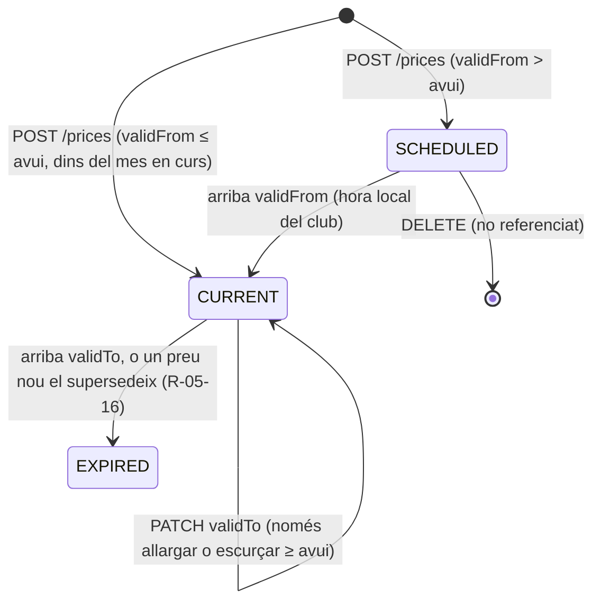
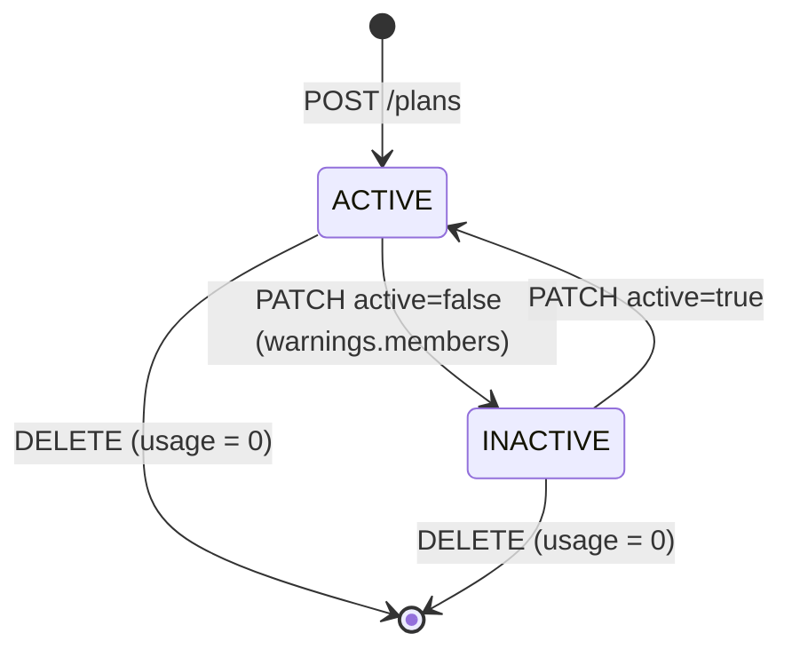

# S05 — Catàlegs del club: nivells, pistes, instructors i administradors, modalitats i tarifes, FAQ

**Etapa:** E2 · **Mòduls:** `FREE_TRAINING` (marca de pista, marca de nivell), `PACKS`, `SINGLE_CLASS`, `BILLING` (preus), `FAQ`, `COURSES` (només el punt d'entrada a la geometria del ring) · **Pantalles:** D8, D16, D17, D11 (targeta FAQ + targeta Nivells proposada) — fitxers a `03-disseny/mockups/pantalles/escriptori/` · **Model:** v1.6 §A NIVELL · MODALITAT/TARIFA (l. 129–143), §B PISTA · INSTRUCTOR (l. 182–193), FAQ (l. 371–375) + PLATAFORMA §0 (glossari), §2 (`LocalizedText`), §3 (`Level`, `Ring`, `Plan`, `Price`), §5 (geometria del ring) · **Estat:** esborrany (03-09-2026) · **v0.1**

## 1. Propòsit i abast

Manteniment, des del backoffice i **per club**, dels catàlegs que la resta de verticals només llegeixen: **nivells** (`Level`), **pistes** (`Ring`), **instructors i administradors** (`Instructor` + rols de `Membership`), **modalitats i tarifes** (`Plan`, `Price`) i **preguntes freqüents** (`FaqEntry`). Inclou la lectura pública de modalitats per al web del club (`GET /public/{clubSlug}/plans`), els guards de coherència (no es pot eliminar el que s'usa; l'últim administrador no es pot treure) i el **seed del Cànic** i el del «club mínim». Cap valor del Cànic viu al codi (ADR-002): tot el que segueix són dades.

Fora d'abast: paràmetres i configuració del club, `/branding` i `billing.entryFeePerDog` (S02) · geometria del ring, col·locacions i recorreguts (S16) · rebuts, línies, consum de packs i «baixa prevista» en caducar (S12/S15) · pantalla 30 «Info» de l'app (S11) · fila «Rols d'accés» de D10 i selector d'abonats (S03) · proposta de tarifa familiar a la validació (S04).

## 2. Pantalles i rutes

Totes a `apps/clubs-admin`, rol `ADMIN` (guard de ruta + `403` al back). Patró comú: taula del design system (`packages/ui`) amb icona d'edició i icona «x» per fila; el formulari s'obre en modal; camps `LocalizedText` amb pestanyes per idioma actiu del club (`CONVENCIONS_I18N` §3); desar envia `version` i, si el back respon `409 STALE_VERSION`, es mostra «Algú ha modificat aquest registre; torna a carregar». Estat buit: text «Encara no hi ha cap {element}» + botó de creació; carregant: skeleton de taula; error: toast per `code`.

| Mockup | App | Ruta | Rol | Notes de comportament |
|---|---|---|---|---|
| D16 `D16-configuracio-pistes.html` | clubs-admin | `/pistes` | ADMIN | Títol «Pistes», botó «Nova pista». Columnes «Nom», «Nom curt», «Color» (punt + hex), «Reservable per entrenaments» (badge «sí»/«no»; columna **oculta** si `FREE_TRAINING` és off). Files ordenades per `order`, arrossegables (→ `PUT /rings/order`). Icona edició → modal (nom, nom curt, color amb paleta `theme.ringPalette[]` + hex lliure, «Reservable per entrenaments», «Gossos alhora per pista» = `trainingCapacity` amb placeholder del valor de `training.capacityPerRingSlot`, «Activa»). Icona «x» → confirmació «Eliminar la pista {nom}?»; si el back respon `409 RING_IN_USE`, el diàleg canvia a «Aquesta pista té classes o reserves: només es pot desactivar» amb botó «Desactiva». Si `COURSES` és on, l'edició mostra l'enllaç «Geometria del ring» → `/pistes/{id}/geometria` (S16). Pistes inactives es mostren atenuades al final. |
| D17 `D17-configuracio-instructors-i-administradors.html` | clubs-admin | `/equip` | ADMIN | Títol «Instructors i administradors». Bloc «Instructors» amb «Nou instructor»: columnes «Abonat» (nom + «(gos)»: primer gos actiu), «Nom curt», «Color», «Actiu». Bloc «Administradors» amb «Nou administrador»: «Abonat», «Nom curt», «Des de» (any de `since`), «Actiu». El camp «Abonat» és un cercador sobre `GET /members?q=…&filter=status:eq:ACTIVE` (S03), només abonats en alta amb compte. Desactivar/eliminar l'últim administrador actiu → `409 LAST_ADMIN` → toast «Hi ha d'haver almenys un administrador actiu». Desactivar un instructor amb classes futures → `409 INSTRUCTOR_IN_USE` → diàleg amb els recomptes «Té {n} classes futures assignades: reassigna-les al calendari abans de desactivar-lo». Si l'admin es desactiva a si mateix (i no és l'últim), confirmació «Perdràs l'accés al backoffice ara mateix». |
| D8 `D8-modalitats-i-tarifes.html` | clubs-admin | `/modalitats` | ADMIN | Títol «Modalitats i tarifes»; a la barra, «entrada per gos (matrícula): {import}» llegit de `billing.entryFeePerDog` amb enllaç a `/parametres` (el «(PAR-29)» del mockup és anotació, no es mostra). Botó «Nova modalitat». Columnes «Modalitat», «Tipus» («quota mensual» · «pack · {n} sessions» · «classe individual»), «Preu» (R-05-19), «Condicions», «Activa». Modal de modalitat: nom, tipus, gossos inclosos, entrada (Estàndard / Import / % de l'estàndard / Sense), pack (sessions, mesos de vigència), classe individual (mode de càrrec, política d'anul·lació), condicions, «Mostra a l'alta», «Mostra al web», activa, i la secció **Tarifes** (files `Price` amb xip «vigent» · «programada» · «caducada», «Nou preu» amb data d'inici per defecte = dia 1 del mes vinent). Targeta «Textos de presentació — {modalitat} (surten a l'alta)»: text de presentació + «Etiqueta d'oferta» + botó «DESA» (edita la modalitat seleccionada a la taula; per defecte la primera). Targeta «Vista prèvia (com ho veu qui es dona d'alta)»: render idèntic a la targeta de la pantalla 17 amb les dades vives del formulari (nom, línia de preu R-05-19, condicions + entrada, etiqueta d'oferta). Peu: «Les tarifes tenen vigència: canviar un preu no altera els rebuts ja emesos. Els packs caduquen per mesos de vigència i generen la baixa prevista automàtica.» (sense el codi «BR-14»). `BILLING` off: columna «Preu», entrada, tarifes i vista prèvia de preu **ocultes** (queden nom, tipus, condicions, textos). `PACKS`/`SINGLE_CLASS` off: el tipus corresponent no apareix al selector. |
| D11 (targeta FAQ) `D11-parametres-del-club.html` | clubs-admin | `/parametres#faq` | ADMIN | Targeta «Preguntes freqüents — pàgina «Info» de l'app» (només si `FAQ` on) amb «Nova pregunta»; columnes «Categoria», «Pregunta», icones edició/«x»; peu «Clica una pregunta per editar-ne la resposta.» (clic a la fila = mateix modal que editar). Modal: categoria (text amb suggeriments de `GET /faq-entries/filter-values?field=category`), pregunta, resposta (àrea de text, salts de línia), ordre, activa — tots tres textos per idioma. Files agrupades per categoria i ordenades per `order`, arrossegables dins la targeta (→ `PUT /faq-entries/order`). |
| D11 (targeta Nivells) — **assumpció, sense mockup** | clubs-admin | `/parametres#nivells` | ADMIN | El bloc «Classes» de D11 mostra «Aforament: per nivell (classe = mínim dels seus nivells) · Cadells 5 · A–D 5 · E–G 4 · Teràpia 1» com a text: aquesta fila passa a ser un **enllaç** a una targeta «Nivells» (mateix patró de taula que D16) amb «Nou nivell» i columnes «Nom», «Codi», «Color», «Aforament», «Entrenament lliure» (badge; oculta si `FREE_TRAINING` off), «Actiu», arrossegables per ordre. El text de la fila del bloc «Classes» es genera de la llista (nom + aforament, agrupant nivells consecutius amb el mateix aforament). La fila «Nivell mínim (marca automàtica per gos)» del bloc «Entrenaments» passa a mostrar els nivells amb `grantsFreeTraining` (Cànic: «D · E · F · G»). Amb `levels.enabled = false` la targeta i les dues files s'amaguen. Validar amb Jordi (§13). |

Les pantalles que **llegeixen** aquests catàlegs (D3/D4 pistes, nivells i instructors; 04/08 nivells i pistes; 17 modalitats; 30 FAQ) les descriuen les seves specs; aquí només es fixa el contracte.

## 3. Entitats i camps

Tots els documents porten `clubId` (injectat per `TenantRepository`), `id` UUID, `version` (optimistic locking), `createdAt/updatedAt`, `createdByAccountId/updatedByAccountId`. `LocalizedText` a escriptura = mapa `{ca, es, …}` amb el `defaultLocale` del club obligatori i només claus de `club.locales` (`400 VALIDATION_ERROR`, `fieldErrors[].code = LOCALE_NOT_ENABLED`); a lectura, resolt + `*I18n`. Colors: `^#[0-9A-Fa-f]{6}$`.

### `Level` · `levels` (v1.6 NIVELL + PLATAFORMA §3)
| Camp | Tipus | Oblig. | Validació | Notes |
|---|---|---|---|---|
| `code` | string | sí | 1–8, `[A-Z0-9_]`, únic per club (sense distingir majúscules) | «Codi» de v1.6; s'usa als xips compactes i als seeds |
| `name` | LocalizedText | sí | ≤ 40 per idioma; únic per club i idioma entre nivells actius | fallback al `defaultLocale` |
| `order` | int | sí | ≥ 0 | per defecte `max + 10`; `PUT /levels/order` el reescriu |
| `color` | string | sí | hex | xips de nivell; per defecte següent color de la paleta |
| `capacity` | int | sí | 1–99 | «aforament»; per defecte `classes.defaultCapacity` |
| `grantsFreeTraining` | bool | sí | — | «dona dret a entrenament lliure»; llegit per S03/S09 (`Dog.freeTrainingOverride ?? level.grantsFreeTraining`); ignorat si `FREE_TRAINING` off |
| `active` | bool | sí | — | inactiu = no seleccionable en gossos nous ni classes de plantilla |
| `usage` (lectura) | `{activeDogs, futureClassSessions, templateClasses}` | — | calculat | per als diàlegs de D11 |

### `Ring` · `rings` (v1.6 PISTA + PLATAFORMA §3/§5)
| Camp | Tipus | Oblig. | Validació | Notes |
|---|---|---|---|---|
| `name` | string | sí | ≤ 40, únic per club | no es tradueix (ADR-011) |
| `shortName` | string | sí | 2–4, `[A-Z0-9]`, únic per club | «Nom curt» (MUN, CEN…) |
| `color` | string | sí | hex | per defecte següent color lliure de `theme.ringPalette[]` |
| `allowsFreeTraining` | bool | sí | — | «Reservable per entrenaments»; ignorat si `FREE_TRAINING` off |
| `trainingCapacity` | int | no | 1–20 | «Gossos alhora per pista»; `null` = `training.capacityPerRingSlot` |
| `order` | int | sí | ≥ 0 | ordre a les graelles (D3, D4, D12, 10, 23) |
| `active` | bool | sí | — | |
| `geometry`, `activeSetupId` | objecte / id | no | — | **S16**: aquest vertical no els escriu; `PATCH /rings/{id}` els ignora |
| `usage` (lectura) | `{futureClassSessions, futureTrainingBookings, templateClasses, ringBlocks}` | — | calculat | |

### `Instructor` · `instructors` (v1.6 INSTRUCTOR)
| Camp | Tipus | Oblig. | Validació | Notes |
|---|---|---|---|---|
| `memberId` | id | sí | abonat del club en estat alta amb `accountId`; un `Instructor` per abonat | «Abonat» |
| `shortName` | string | sí | 1–12 | «Nom curt»; per defecte el nom de pila |
| `color` | string | sí | hex | |
| `active` | bool | sí | — | `true` ⇔ `Membership.roles ∋ INSTRUCTOR` (R-05-11) |
| `usage` (lectura) | `{futureClassSessions, templateClasses}` | — | calculat | |

### Administrador = `Membership` amb `adminProfile` (PLATAFORMA §1; assumpció, §13)
| Camp | Tipus | Oblig. | Validació | Notes |
|---|---|---|---|---|
| `memberId` (via `Membership.memberId`) | id | sí | abonat en alta amb compte | «Abonat» |
| `adminProfile.shortName` | string | sí | 1–12 | «Nom curt» |
| `adminProfile.since` | date | sí | ≤ avui | «Des de»; la taula mostra l'any |
| `adminProfile.active` | bool | sí | — | `true` ⇔ `Membership.roles ∋ ADMIN` (R-05-11); el perfil es conserva en desactivar (historial: «Montse · 2021 · no») |

### `Plan` · `plans` (v1.6 MODALITAT + PLATAFORMA §3)
| Camp | Tipus | Oblig. | Validació | Notes |
|---|---|---|---|---|
| `code` | string | sí | 1–16, `[A-Z0-9_]`, únic per club | |
| `name` | LocalizedText | sí | ≤ 60 | «Modalitat» |
| `type` | enum | sí | `MONTHLY · PACK · SINGLE_CLASS`; immutable si `usage` > 0 | `PACK` requereix `PACKS`; `SINGLE_CLASS` requereix `SINGLE_CLASS` (fieldError `MODULE_DISABLED`) |
| `dogsIncluded` | int | sí | 1–9 | 1 per defecte; «Abonat · 2 gossos (familiar)» = 2 (assumpció, §13) |
| `entryFee` | `{mode, amount?, percent?}` | sí | `mode ∈ STANDARD · AMOUNT · PERCENT · NONE`; `amount` Money si AMOUNT; `percent` 1–100 si PERCENT | entrada per gos: `STANDARD` = `billing.entryFeePerDog`; `PERCENT` = % d'aquest paràmetre («Teràpia» = 50) |
| `billingMode` | enum | sí | `MONTHLY_FEE · MAINTENANCE`; només amb `type = MONTHLY` | **Josep 08-09**: la modalitat porta el tipus de quota. «Teràpia» = `MAINTENANCE` → l'alta implica la quota de manteniment cada mes automàticament fins que l'admin canviï de modalitat (S12 R-12-02). Substitueix `Member.billingMode` |
| `pack` | `{sessions, validityMonths}` | si `PACK` | 1–99 · 1–24 | caducitat → sessions no consumides **perdudes** (S12 R-12-23) + «baixa prevista» automàtica (S13 R-13-14) |
| `singleClass` | `{chargeMode, cancelPolicy}` | si `SINGLE_CLASS` | `CHARGE_ON_ATTENDANCE · PAY_TO_BOOK` · `REFUND · CREDIT · NONE` | `cancelPolicy` per defecte = `billing.singleClassCancelPolicy` |
| `conditions` | LocalizedText | no | ≤ 200 | «Condicions» («només un cop», «després 40% dte. en matrícula») — text informatiu, no s'avalua (§13) |
| `texts.description` | LocalizedText | no | ≤ 1000 | «Textos de presentació» (pantalla 17) |
| `texts.offerLabel` | LocalizedText | no | ≤ 80 | «Etiqueta d'oferta» |
| `texts.priceLabel` | LocalizedText | no | ≤ 80 | text que substitueix el preu quan no n'hi ha de vigent («condicions i cost segons cada cas») |
| `showOnSignup`, `showOnWeb` | bool | sí | — | pantalla 17 · `GET /public/{clubSlug}/plans` |
| `order`, `active` | int, bool | sí | — | inactiva = no s'ofereix enlloc; els abonats que la tenen la conserven |
| `prices[]` (lectura) | `Price[]` amb `status` | — | — | `GET /plans/{id}`; `currentPrices` = vigents avui per concepte |
| `usage` (lectura) | `{members, packBalances, invoiceLines}` | — | calculat | |

### `Price` · `prices` (v1.6 TARIFA + PLATAFORMA §3)
| Camp | Tipus | Oblig. | Validació | Notes |
|---|---|---|---|---|
| `planId` | id | sí | pla del club | |
| `concept` | enum | sí | `MONTHLY_FEE · MAINTENANCE_FEE · PACK · SINGLE_CLASS` | `periodicity` derivada: `MONTHLY` per als dos primers, `ONE_OFF` per als altres. `MAINTENANCE_FEE` materialitza el `Plan.maintenanceFee` del model; `SINGLE_CLASS` el `singleClass.pricePerClass` (§13) |
| `amount` | Money | sí | `amountMinor ≥ 0`; `currency = club.currency` (fieldError `CURRENCY_MISMATCH`) | import final que es cobra |
| `taxPercent` | number | sí | 0–100, 2 decimals | desglossament informatiu al rebut (S12) |
| `validFrom` | date | sí | R-05-16 | |
| `validTo` | date | no | ≥ `validFrom` | `null` = obert |
| `status` (lectura) | enum | — | `SCHEDULED · CURRENT · EXPIRED` | calculat amb la data local del club (§5) |
| `locked` (lectura) | bool | — | referenciat per alguna línia de rebut o `validFrom ≤ avui` | R-05-17 |

### `FaqEntry` · `faq_entries` (v1.6 FAQ)
| Camp | Tipus | Oblig. | Validació | Notes |
|---|---|---|---|---|
| `category` | LocalizedText | sí | ≤ 60 | text lliure amb suggeriments; agrupa a la pantalla 30 |
| `question` | LocalizedText | sí | ≤ 200 | |
| `answer` | LocalizedText | sí | ≤ 2000, text pla amb salts de línia | sense markdown a R1 (assumpció) |
| `order`, `active` | int, bool | sí | — | només les actives surten a la pantalla 30 |

## 4. Regles de negoci

| Regla | Enunciat | Paràmetres / mòduls | Exemple |
|---|---|---|---|
| **R-05-01** Aforament d'una classe | `capacity(classe) = min(level.capacity dels seus nivells)`; sense nivells (o `levels.enabled = false`) = `classes.defaultCapacity`. Servei de domini `CapacityCalculator` d'aquest vertical, cridat per S06. | `classes.defaultCapacity = 5`, `levels.enabled = true` | Classe D+E: min(5, 4) = 4. Classe Cadells: 5. Classe sense nivell: 5. |
| **R-05-02** Eliminació física només sense referències | `DELETE` d'un nivell, pista, instructor, modalitat o FAQ només si `usage` és tot zero (nivell: gossos de qualsevol estat, classes, classes de plantilla; pista: classes, slots, reserves, bloquejos, classes de plantilla, col·locacions; instructor: classes i classes de plantilla; modalitat: abonats, packs, línies de rebut, cobraments anticipats). Altrament `409 {LEVEL,RING,INSTRUCTOR,PLAN}_IN_USE` amb `details = usage` i el camí és **desactivar**. FAQ i `Price` `SCHEDULED` no referenciat s'eliminen sempre. | — | Nivell «G» amb 3 gossos → 409 `LEVEL_IN_USE {activeDogs: 3}`. Pista «Provisional» creada ahir sense classes → 204. |
| **R-05-03** Desactivar un nivell | Sempre permès; efectes: no seleccionable en gossos nous (S03) ni en classes de plantilla noves (S06); els gossos i classes existents el conserven i el mostren amb badge «inactiu»; S06 marca com a inconsistents les classes de plantilla que l'admeten. La resposta porta `warnings = usage`. | — | Desactivar «F» amb 2 gossos: 200 + `warnings {activeDogs: 2, templateClasses: 1}`. |
| **R-05-04** Ordre | `PUT /{levels,rings,faq-entries}/order` rep **tots** els ids del club (actius i inactius) sense repeticions; `order = índex × 10`. Ids que faltin o sobrin → `422 ORDER_INCOMPLETE`. | — | `[CAD, A, B, C, D, E, F, G, TER]` → 0,10,…,80. |
| **R-05-05** `levels.enabled = false` | Els endpoints `/levels` segueixen operatius (un club pot preparar nivells abans d'activar-los); la UI amaga la targeta; `grantsFreeTraining` no s'avalua (dret d'entrenament només manual, S03); R-05-01 retorna `classes.defaultCapacity`. | `levels.enabled` | Club mínim: 0 nivells, classes de 5 places. |
| **R-05-06** Unicitat de pistes | `name` i `shortName` únics per club (majúscules/minúscules indiferents), incloent-hi inactives → `409 DUPLICATE_NAME` amb `details.field`. Mateixa regla per a `Level.code`, `Plan.code` i `Level.name` (per idioma, entre actius). | — | Nova pista «MUN» amb Muntanya existent → 409 `{field: "shortName"}`. |
| **R-05-07** Desactivar una pista | Bloquejat (`409 RING_IN_USE`) mentre tingui classes futures no anul·lades o reserves d'entrenament futures; els bloquejos futurs i les classes de plantilla **no** bloquegen (S06 les marca inconsistents; S09 anul·la els slots lliures futurs de la pista). | — | «Petita» amb 1 classe dissabte vinent → 409 `{futureClassSessions: 1}`; sense classes → 200 i S09 retira els slots. |
| **R-05-08** «Reservable per entrenaments» | Amb `allowsFreeTraining = false` la pista no genera slots (S09). Passar de sí a no amb reserves d'entrenament futures → `409 RING_IN_USE {futureTrainingBookings}`; sense reserves, els slots lliures futurs desapareixen. Amb `FREE_TRAINING` off el camp s'accepta però no té efecte. | `FREE_TRAINING` | Cànic: Cadells i Petita = no. |
| **R-05-09** Capacitat d'entrenament efectiva | `ring.trainingCapacity ?? training.capacityPerRingSlot`. Exposada com a `effectiveTrainingCapacity` a lectura. | `training.capacityPerRingSlot = 1` | Central `null` → 1; una pista «Gran» amb 2 → 2. |
| **R-05-10** Alta d'instructor o administrador | L'abonat ha d'estar en alta i tenir compte (`Membership` existent) → si no, `422 MEMBER_NOT_ACTIVE`. Un abonat només pot tenir un `Instructor`: si n'existeix un d'inactiu, el `POST` el **reactiva** i actualitza nom curt/color (200, no 201). Ídem per a `adminProfile`. | — | «Nou instructor» amb una preinscripció pendent → 422. |
| **R-05-11** Sincronització de rols | `Instructor.active` ⇔ rol `INSTRUCTOR`; `adminProfile.active` ⇔ rol `ADMIN` a `Membership`. Tota alta/baixa passa pel servei `RoleAssignmentService` (aquest vertical), que també usa D10 «Rols d'accés» (S03): donar el rol des de D10 crea l'`Instructor` amb valors per defecte; treure'l aplica R-05-12/R-05-13. Canvi de rols → `MembershipChanged` i la cache de permisos s'invalida; el JWT vigent (15 min) caduca sol. | — | D10: activar «instructor» a la Neus → apareix a D17 amb nom curt «Neus». |
| **R-05-12** Instructor amb classes futures | No es pot desactivar (ni eliminar) un instructor amb classes futures no anul·lades → `409 INSTRUCTOR_IN_USE {futureClassSessions}`; cal reassignar-les (S06). Les classes de plantilla no bloquegen (S06 les marca inconsistents). | — | Estel amb 4 classes la setmana vinent → 409. |
| **R-05-13** Últim administrador | Cap operació pot deixar el club sense administrador actiu → `409 LAST_ADMIN`: desactivar, eliminar, treure el rol des de D10 o l'auto-desactivació per baixa de l'abonat (R-05-14). | — | Club amb un sol admin actiu (Josep): desactivar-lo → 409. |
| **R-05-14** Baixa de l'abonat | En consumir `MemberStatusChanged{after: BAIXA}` es desactiven el seu `Instructor` (si no té classes futures; si en té, es desactiva igualment i S06 rep `InstructorChanged` per marcar-les) i el seu `adminProfile`, llevat que sigui l'últim admin (es conserva i s'audita `LAST_ADMIN_KEPT`). | — | Montse causa baixa → «Administradors: Montse · no». |
| **R-05-15** Un preu vigent per concepte | Per a (`planId`, `concept`) els intervals `[validFrom, validTo]` no se solapen → `409 PRICE_OVERLAP {conflictingPriceId}`. El preu vigent a la data `d` és l'únic amb `validFrom ≤ d ≤ (validTo ?? ∞)`; `PriceResolver.current(planId, concept, d)` (usat per S04 i S12). | — | Abonat: 60 € des de 2026-01-01 obert; 2026-09-15 → 60 €. |
| **R-05-16** Supersessió | `POST /prices` amb `validFrom = F`: si existeix un preu obert del mateix concepte amb `validFrom < F`, es **tanca** automàticament a `F − 1 dia` (mateixa transacció, dos `PriceChanged`). `F` ha de ser ≥ dia 1 del mes en curs (hora del club) i posterior a l'últim període facturat amb el preu anterior → si no, `409 PRICE_LOCKED`. | — | Pujar Abonat a 65 € des de 2027-01-01: el preu de 60 € queda `validTo = 2026-12-31`; els rebuts fins a desembre segueixen a 60 €. |
| **R-05-17** Immutabilitat (BR-14) | Un `Price` amb `locked = true` només admet canviar `validTo` (mai abans d'avui ni abans de l'últim període facturat); `amount`, `taxPercent`, `validFrom`, `concept` → `409 PRICE_LOCKED`. Les línies de rebut congelen import i descripció (S12): cap operació d'aquest vertical toca `invoices`. | — | Editar l'import del preu de 2026-01-01 el 2026-09-03 → 409; corregir-ne un programat per a 2027 → 200. |
| **R-05-18** Entrada per gos d'una modalitat | `entryFee(plan) = STANDARD → billing.entryFeePerDog · AMOUNT → amount · PERCENT → round(entryFeePerDog × percent / 100) · NONE → 0`. Funció `EntryFeeCalculator` d'aquest vertical (la usen S04 i la vista prèvia). Amb `BILLING` off retorna `null`. | `billing.entryFeePerDog = 100,00 €` | Teràpia: 50 € («Entrada a compte: 50 €»). Pack 6: 0. |
| **R-05-18b** Descompte d'entrada en passar de pack a abonat | Un abonat amb pla `PACK` que passa a un pla `MONTHLY` paga l'entrada del pla nou amb un descompte de `billing.packToMemberEntryDiscountPercent` si el seu últim pack tenia ≥ `billing.packToMemberMinSessions` sessions (Cànic: **40 %** venint d'un **pack de 10**; Josep 08-09). `EntryFeeCalculator.forPlanChange(member, newPlan)` retorna l'import ja descomptat i el motiu (`PACK_TO_MEMBER`), que D2/D10 mostren a la línia d'entrada i l'admin pot editar. No s'aplica dues vegades (només un canvi de pla per pack). | `billing.packToMemberEntryDiscountPercent = 40`, `billing.packToMemberMinSessions = 10`; `PACKS`, `BILLING` | Pack 10 caducat → Abonat: entrada 100 € − 40 % = **60 €**. |
| **R-05-19** Línia de preu | `MONTHLY` → «{fee}/mes» (+ « + entrada {entrada}» a D8 si l'entrada > 0) · `PACK` → «{preu}» a D8 i «{preu} · {mesos} mesos» a 17 · `SINGLE_CLASS` → «{preu}/classe» · sense preu vigent → `texts.priceLabel` a 17 i «segons tarifa» a D8. Imports amb `fmtMoney(locale, club.currency)`. `MAINTENANCE_FEE` es mostra a la línia de condicions («quota mínima durant el tractament: {import}/mes»). | `BILLING` | Teràpia a 17: «condicions i cost segons cada cas» + «Entrada a compte: 50 € · quota mínima durant el tractament: 10 €/mes». |
| **R-05-20** Modalitat inactiva o oculta | `active = false` → fora de 17, del web i dels selectors de D2/D10; els abonats assignats la conserven i S12 la segueix facturant; resposta amb `warnings {members}`. `showOnSignup = false` → fora de 17 però seleccionable per l'admin (familiar). | — | Desactivar Pack 6 amb 2 packs vius → 200 + `warnings {members: 2}`. |
| **R-05-21** Lectura pública | `GET /public/{clubSlug}/plans` retorna només modalitats `active && showOnWeb`, amb textos resolts per `Accept-Language ∩ club.locales` (fallback `defaultLocale`) **i** els mapes `*I18n`; preus i entrada només si `BILLING` on; mai cap dada personal. Cal `X-Api-Key` = clau pública del club (S02) → `401 INVALID_API_KEY`. `Cache-Control: public, max-age=300`; rate limit per IP. | `BILLING` | Web del Cànic en castellà: «Abonado · 60 €/mes». |
| **R-05-21b** Contingut provisional de FAQ i textos del club | Josep 08-09: les respostes definitives de la FAQ, la plantilla de **normes del club** i els **textos de les modalitats** arribaran més endavant i el club els omplirà **des de la mateixa eina** (D11 / `ClubPage` / D8). El seed crea les entrades amb text marcat «`[Text pendent — el club l'omplirà des de Paràmetres]`» i `active = true` (perquè es vegin i es puguin editar). Ítem de sortida d'E12: cap text amb aquesta marca a producció (comprovació automàtica al `club:apply` i informe). | `FAQ` | Les 7 preguntes del seed queden amb la pregunta real i la resposta marcada. |
| **R-05-22** FAQ per categories | La pantalla 30 (S11) rep `GET /faq-entries` només actives, ordenades per `order`; les categories s'ordenen per l'`order` mínim de les seves entrades i es comparen pel text resolt. Mòdul `FAQ` off → `404 MODULE_DISABLED`. | `FAQ` | «Convivència al club» (ordres 0, 10) abans que «Reserves de classe» (20…). |

## 5. Estats i transicions

Nivell, pista, instructor, administrador, modalitat i FAQ comparteixen el patró **ACTIVE ⇄ INACTIVE** (+ eliminació física només des de qualsevol estat si R-05-02 ho permet). `Price.status` és **calculat**, no desat.

| Entitat · transició | Qui | Condició | Efectes | Esdeveniment |
|---|---|---|---|---|
| Nivell/pista/FAQ · crear | ADMIN | validació §3, R-05-06 | `order = max + 10` | `LevelChanged/RingChanged/FaqChanged{CREATED}` |
| Nivell · desactivar | ADMIN | sempre (R-05-03) | `warnings`; S06 inconsistències; si canvia `grantsFreeTraining`, S03 recalcula «Pot entrenar sol» | `LevelChanged{DEACTIVATED|UPDATED, diff}` |
| Pista · desactivar / no reservable | ADMIN | R-05-07 / R-05-08 | S09 retira slots lliures futurs; S06 inconsistències | `RingChanged{diff}` |
| Instructor · alta / reactivació | ADMIN (D17 o D10) | R-05-10 | `Membership.roles += INSTRUCTOR` | `InstructorChanged{CREATED}` + `MembershipChanged` |
| Instructor · desactivar | ADMIN | R-05-12 | `roles −= INSTRUCTOR` | `InstructorChanged{DEACTIVATED}` + `MembershipChanged` |
| Administrador · alta / desactivar | ADMIN | R-05-10 / R-05-13 | `roles ± ADMIN`; `adminProfile` conservat | `MembershipChanged` |
| Instructor/admin · baixa de l'abonat | SYSTEM | R-05-14 | com a dalt, o `LAST_ADMIN_KEPT` auditat | `InstructorChanged` + `MembershipChanged` |
| Modalitat · crear / editar tipus | ADMIN | mòduls; tipus immutable amb `usage > 0` (`409 PLAN_IN_USE`) | — | `PlanChanged{diff}` |
| Preu · crear | ADMIN | R-05-15, R-05-16 | tanca l'anterior | `PriceChanged{CREATED}` (+ `{CLOSED}`) |
| Preu · editar / eliminar | ADMIN | R-05-17 / només `SCHEDULED` | — | `PriceChanged{UPDATED|DELETED}` |
| Qualsevol · reordenar | ADMIN | R-05-04 | — | `…Changed{REORDERED}` |

## 6. API

Base `CONVENCIONS_API` §1–§2; `clubId` sempre del JWT. Llistats de catàleg: sense paginació (`{items, totalItems}`), `?includeInactive=true` només per a `ADMIN` (per defecte només actius). Lectura per `MEMBER`/`INSTRUCTOR` retorna una **projecció reduïda** (sense `usage`, sense `memberId` a instructors, sense `*I18n`). Recursos editables retornen i exigeixen `version`.

| Mètode | Ruta | Rol(s) | Mòdul | Idemp. | Descripció | Cos / paràmetres clau | Respostes i errors |
|---|---|---|---|---|---|---|---|
| GET | `/levels` | MEMBER, INSTRUCTOR, ADMIN | — | sí | llista ordenada per `order` | `includeInactive` | 200 |
| POST | `/levels` | ADMIN | — | no | crea | §3 | 201 · 400 · 409 `DUPLICATE_NAME` |
| GET | `/levels/{id}` | ADMIN | — | sí | detall + `usage` | | 200 · 404 |
| PATCH | `/levels/{id}` | ADMIN | — | no | edita (parcial) | camps §3 + `version` | 200 (+`warnings`) · 409 `STALE_VERSION`, `DUPLICATE_NAME` |
| DELETE | `/levels/{id}` | ADMIN | — | sí | elimina si `usage = 0` | | 204 · 409 `LEVEL_IN_USE` |
| PUT | `/levels/order` | ADMIN | — | sí | reordena | `{levelIds[]}` | 200 · 422 `ORDER_INCOMPLETE` |
| GET/POST | `/rings` · GET/PATCH/DELETE `/rings/{id}` · PUT `/rings/order` | com `/levels` | `FREE_TRAINING` només per als camps `allowsFreeTraining`/`trainingCapacity` | — | ídem; lectura inclou `effectiveTrainingCapacity` | `{ringIds[]}` | 409 `RING_IN_USE`, `DUPLICATE_NAME` |
| GET | `/rings/{id}/geometry` | — | `COURSES` | — | **S16** (només l'enllaç des de D16) | | |
| GET | `/instructors` | MEMBER, INSTRUCTOR, ADMIN | — | sí | actius (admin: `includeInactive`) | | 200 |
| POST | `/instructors` | ADMIN | — | no | alta o reactivació (R-05-10) | `{memberId, shortName, color}` | 201 / 200 · 422 `MEMBER_NOT_ACTIVE` · 404 abonat d'un altre club |
| PATCH | `/instructors/{id}` | ADMIN | — | no | nom curt, color, `active` | + `version` | 200 · 409 `INSTRUCTOR_IN_USE`, `STALE_VERSION` |
| DELETE | `/instructors/{id}` | ADMIN | — | sí | R-05-02 | | 204 · 409 `INSTRUCTOR_IN_USE` |
| GET | `/administrators` (**ruta nova, §13**) | ADMIN | — | sí | membresies amb `adminProfile` | `includeInactive` | 200 |
| POST | `/administrators` | ADMIN | — | no | alta o reactivació | `{memberId, shortName, since}` | 201 / 200 · 422 `MEMBER_NOT_ACTIVE` |
| PATCH | `/administrators/{membershipId}` | ADMIN | — | no | nom curt, des de, `active` | + `version` | 200 · 409 `LAST_ADMIN` |
| DELETE | `/administrators/{membershipId}` | ADMIN | — | sí | treu el perfil i el rol | | 204 · 409 `LAST_ADMIN` |
| GET | `/plans` | MEMBER, INSTRUCTOR, ADMIN | — | sí | llista amb `currentPrices` (només si `BILLING`) | `includeInactive` | 200 |
| POST | `/plans` | ADMIN | `PACK`/`SINGLE_CLASS` segons tipus | no | crea (sense preus) | §3 | 201 · 400 (`MODULE_DISABLED` a `type`) · 409 `DUPLICATE_NAME` |
| GET | `/plans/{id}` | ADMIN | — | sí | detall + `prices[]` + `usage` + `entryFeeAmount` (R-05-18) | | 200 |
| PATCH | `/plans/{id}` | ADMIN | — | no | edita | + `version` | 200 (+`warnings`) · 409 `PLAN_IN_USE` (tipus), `STALE_VERSION` |
| DELETE | `/plans/{id}` | ADMIN | — | sí | R-05-02 | | 204 · 409 `PLAN_IN_USE` |
| PUT | `/plans/order` | ADMIN | — | sí | ordre a 17 i al web | `{planIds[]}` | 200 |
| GET | `/prices` | ADMIN | `BILLING` | sí | per modalitat | `planId` (oblig.), `concept` | 200 · 404 `MODULE_DISABLED` |
| POST | `/prices` | ADMIN | `BILLING` | no | crea i supersedeix (R-05-16) | `{planId, concept, amount, taxPercent, validFrom, validTo?}` | 201 `{price, closedPriceId?}` · 400 `CURRENCY_MISMATCH` · 409 `PRICE_OVERLAP`, `PRICE_LOCKED` |
| PATCH | `/prices/{id}` | ADMIN | `BILLING` | no | R-05-17 | + `version` | 200 · 409 `PRICE_LOCKED` |
| DELETE | `/prices/{id}` | ADMIN | `BILLING` | sí | només `SCHEDULED` no referenciat | | 204 · 409 `PRICE_LOCKED` |
| GET | `/faq-entries` | MEMBER, INSTRUCTOR, ADMIN | `FAQ` | sí | actives ordenades (R-05-22) | `includeInactive` | 200 · 404 `MODULE_DISABLED` |
| POST/PATCH/DELETE | `/faq-entries[/{id}]` · PUT `/faq-entries/order` | ADMIN | `FAQ` | — | CRUD + ordre | §3 · `{faqEntryIds[]}` | 201/200/204 · 409 `STALE_VERSION` |
| GET | `/club-pages` · `/club-pages/{key}` | MEMBER, INSTRUCTOR, ADMIN | — | sí | pàgines del club (`ClubPage`, 05-09; files afegides a §6 el 09-09): `?active=true` per a l'app (30 «Info»: pestanyes FAQ · Normes · altres actives) | `active?` | 200 `ClubPage {key, title: LocalizedText, body: LocalizedText (Markdown limitat), version, publishedAt, active}` · 404 |
| POST / PATCH | `/club-pages` · `/club-pages/{key}` | ADMIN | — | — | crea/edita (`key` `RULES · PRIVACY · IMAGE_CONSENT · WELCOME_GUIDE · lliure`); `PATCH` amb `version` → `STALE_VERSION`; publicar = `active=true` + `publishedAt`; cada edició publicada incrementa `version` (els consentiments guarden la versió acceptada, S04/S01 §14) · audit `CATALOG_CHANGED` · event `ClubPageChanged` (proposta §13) | `{title, body, active}` + `version` | 201/200 · 409 `STALE_VERSION` · 400 `VALIDATION_ERROR` (Markdown no permès, mida) |
| GET | `/public/{clubSlug}/pages/{key}` | ANON (`X-Api-Key`) | — | sí | pàgina publicada (web del club, enllaç de l'alta 19 «Normes del club») | `Accept-Language` | 200 · 404 |
| GET | `/faq-entries/filter-values?field=category` | ADMIN | `FAQ` | sí | categories existents amb recompte (§4 de les convencions) | | 200 |
| GET | `/public/{clubSlug}/plans` | ANON | `BILLING` per als preus | sí | R-05-21 | header `X-Api-Key`, `Accept-Language` | 200 `{club: {slug, name, currency}, plans[]}` · 401 `INVALID_API_KEY` · 404 club inexistent · 429 |

Codis d'error d'aquest vertical (enum `ErrorCode`): `DUPLICATE_NAME`, `ORDER_INCOMPLETE`, `LOCALE_NOT_ENABLED`, `CURRENCY_MISMATCH`, `LEVEL_IN_USE`, `RING_IN_USE`, `INSTRUCTOR_IN_USE`, `PLAN_IN_USE`, `LAST_ADMIN`, `MEMBER_NOT_ACTIVE`, `PRICE_OVERLAP`, `PRICE_LOCKED`, `INVALID_API_KEY` (+ transversals `STALE_VERSION`, `MODULE_DISABLED`, `VALIDATION_ERROR`). Tots amb missatge a `messages_{ca,es,en}.properties`.

## 7. Esdeveniments

**Emesos** (outbox, mateixa transacció): `LevelChanged`, `RingChanged`, `InstructorChanged`, `PlanChanged`, `PriceChanged`, `FaqChanged` — payload `{id, action: CREATED · UPDATED · DEACTIVATED · REACTIVATED · DELETED · REORDERED · CLOSED (només Price), diff {camp: {before, after}}}`; `MembershipChanged {accountId, clubId, rolesBefore[], rolesAfter[]}` a cada canvi de rol (R-05-11). Consumidors: auditoria i cache (catàleg) · S03 (`LevelChanged` amb `grantsFreeTraining` al `diff` → un `DogFreeTrainingChanged{source: LEVEL}` per gos del nivell sense `freeTrainingOverride`) · S06 (`LevelChanged`/`RingChanged`/`InstructorChanged` amb `DEACTIVATED` o `allowsFreeTraining` → recalcul d'inconsistències de plantilles) · S09 (`RingChanged` → regeneració de slots lliures futurs de la pista) · S16 (`RingChanged{DEACTIVATED}` → cap acció a R1) · cache de permisos (`MembershipChanged`).

**Consumits**: `MemberStatusChanged{after: BAIXA}` → R-05-14 · `ParameterChanged` (`classes.defaultCapacity`, `training.capacityPerRingSlot`, `levels.enabled`, `billing.entryFeePerDog`) → invalidació de la cache de configuració (cap recalcul persistit: els valors efectius es calculen a lectura) · `ClubModulesChanged` → cap acció (les dades es conserven, ADR-012 §«Desactivar un mòdul»).

## 8. Notificacions

No aplica: cap codi del `CATALEG_NOTIFICACIONS.md` neix d'aquest vertical (els canvis de catàleg són interns; el canvi de nivell d'un gos, N-09, és de S03). Proposta §13: avís opcional a la persona que rep el rol d'instructor o administrador.

## 9. Paràmetres i mòduls

| Clau / mòdul | Ús aquí | Cànic |
|---|---|---|
| `classes.defaultCapacity` | valor per defecte de `Level.capacity` i aforament sense nivells (R-05-01) | 5 |
| `levels.enabled` | R-05-05 | true |
| `training.capacityPerRingSlot` | fallback de `Ring.trainingCapacity` (R-05-09) | 1 |
| `billing.entryFeePerDog` | base de `entryFee.mode = STANDARD/PERCENT` (R-05-18), xip de D8 | 100,00 € |
| `billing.singleClassCancelPolicy` | valor per defecte de `singleClass.cancelPolicy` | REFUND |
| `club.currency`, `club.locales`, `club.defaultLocale`, `club.timeZone` (CLUB) | validació de `Money` i `LocalizedText`; «avui» de `Price.status` | EUR · ca, es · ca · Europe/Madrid |
| `theme.ringPalette[]` (CLUB) | colors proposats a pistes i nivells | paleta del tema Cànic |
| `FREE_TRAINING` off | `allowsFreeTraining`, `trainingCapacity` i `grantsFreeTraining` s'accepten però s'ignoren; columnes ocultes a D16 i a la targeta Nivells | on |
| `BILLING` off | `/prices` → 404; `/plans` només noms, tipus, condicions i textos; `entryFeeAmount = null`; D8 sense preus; API pública sense preus | on |
| `PACKS` off / `SINGLE_CLASS` off | tipus rebutjat en crear (fieldError `MODULE_DISABLED`); modalitats existents d'aquest tipus es llisten però no s'ofereixen (17, web) | on / off |
| `FAQ` off | `/faq-entries` → 404; targeta de D11 oculta | on |
| `COURSES` off | sense enllaç «Geometria del ring» a D16 | on |

## 10. i18n i localització

- Namespaces: `admin-settings` (D16, D17, targetes Nivells i FAQ de D11), `admin-billing` (D8: `plans.*`, `prices.*`, `preview.*`), `enums` (`planType.*`, `priceConcept.*`, `chargeMode.*`, `cancelPolicy.*`, `priceStatus.*`), `errors` (codis de §6). Claus en `ca`, `es`, `en` al mateix PR.
- `LocalizedText`: `Level.name`, `Plan.name/conditions/texts.*`, `FaqEntry.category/question/answer`. `Ring.name`, `shortName` i noms curts d'instructors **no** es tradueixen. Test obligatori de fallback (usuari `en`, club `ca/es` → `ca`).
- Imports: `Money` en `club.currency`; el front formata amb `fmtMoney`. Dates de vigència són **dates de negoci** (`YYYY-MM-DD`) interpretades al fus del club; «avui» de `Price.status` i de R-05-16 = data local del club.
- API pública: locale per `Accept-Language ∩ club.locales`, fallback `defaultLocale`; el web del club pot usar els mapes `*I18n` directament.
- Vocabulari: mai «parella» ni codis (BR-14, PAR-29) als textos de pantalla; «Reservable per entrenaments», «Gossos alhora per pista», «Entrenament lliure» són les etiquetes.

## 11. Criteris d'acceptació i tests obligatoris

**Domini (unitaris)**
- T-05-01 (R-05-01, R-05-05): Given nivells D(5) i E(4) When `CapacityCalculator.forLevels([D,E])` Then 4; Given `[]` Then `classes.defaultCapacity`; Given `levels.enabled=false` i `[D]` Then `classes.defaultCapacity`; Given `levels.enabled=false` When `POST /levels` Then 201 (els endpoints segueixen operatius).
- T-05-02 (R-05-15/16): Given preu obert de 60 € des de 2026-01-01 When es crea 65 € des de 2027-01-01 Then l'anterior queda `validTo = 2026-12-31` i `current(plan, MONTHLY_FEE, 2026-12-31) = 60`, `current(…, 2027-01-01) = 65`; When es crea un preu 2026-06-01..2026-12-31 Then `PRICE_OVERLAP`.
- T-05-03 (R-05-16/17): Given preu de 60 € amb línies de rebut fins a 2026-09 When `validFrom = 2026-08-01` per al nou Then `PRICE_LOCKED`; When es canvia l'import del preu bloquejat Then `PRICE_LOCKED`; When s'escurça `validTo` a 2026-10-31 Then 200.
- T-05-04 (R-05-18): Given `billing.entryFeePerDog = 10000` Then STANDARD → 10000, PERCENT 50 → 5000, AMOUNT 2500 → 2500, NONE → 0; `BILLING` off → `null`.
- T-05-05 (R-05-09): `null` → paràmetre (1); 2 → 2.
- T-05-06 (R-05-04): llista amb un id de menys → `ORDER_INCOMPLETE`; llista completa → `order` 0,10,20….
- T-05-07 (R-05-19): línies de preu per als tres tipus i per a «sense preu» en `ca`, `es`, `en`.
- T-05-08 (LocalizedText): resolució `en` → fallback `ca`; escriptura sense `defaultLocale` → 400 `VALIDATION_ERROR`; clau `fr` en club `ca,es` → `LOCALE_NOT_ENABLED`.
- T-05-09 (R-05-22): ordre de categories per `order` mínim; les inactives no surten.

**Integració (Testcontainers Mongo, seed `club-canic-seed`)** — per a **cada** endpoint de §6: camí feliç · 400 · 403 per a cada rol denegat (MEMBER, INSTRUCTOR, i token d'impersonació als endpoints ADMIN) · 404 amb recurs d'un altre club · 404 amb mòdul off quan escaigui · esdeveniment a l'outbox · OpenAPI actualitzat (`x-filterable` per a `filter-values`).
- T-05-10 (R-05-02/03): DELETE nivell amb gossos → 409 `LEVEL_IN_USE {activeDogs}`; PATCH `active=false` → 200 amb `warnings`; DELETE nivell nou sense ús → 204.
- T-05-11 (R-05-06): pista amb `shortName` «mun» existint «MUN» → 409 `DUPLICATE_NAME {field: shortName}`; ídem `Level.code` i `Plan.code`.
- T-05-12 (R-05-07/08): pista amb classe futura → desactivar 409; amb reserva d'entrenament futura → `allowsFreeTraining=false` 409; sense res → 200 i `RingChanged` a l'outbox amb el `diff`.
- T-05-13 (R-05-10/11): POST `/instructors` amb abonat en alta → 201, `Membership.roles ∋ INSTRUCTOR`, `MembershipChanged` a l'outbox; amb abonat pendent → 422; POST repetit sobre un d'inactiu → 200 reactivat.
- T-05-14 (R-05-12): instructor amb classe futura → PATCH `active=false` 409 `INSTRUCTOR_IN_USE`; només amb classes de plantilla → 200 i `InstructorChanged{DEACTIVATED}`.
- T-05-15 (R-05-13): club amb un sol admin → PATCH `active=false` 409 `LAST_ADMIN`, DELETE 409, revocació via `RoleAssignmentService` 409; amb dos admins → 200 i `roles ∌ ADMIN`.
- T-05-16 (R-05-14): `MemberStatusChanged{BAIXA}` d'un instructor-admin no últim → `Instructor.active=false`, `adminProfile.active=false`, rols buits; si és l'últim admin → rol conservat + auditoria `LAST_ADMIN_KEPT`.
- T-05-17 (R-05-20 + mòduls): crear `PACK` amb `PACKS` off → 400 fieldError `MODULE_DISABLED`; `SINGLE_CLASS` off ídem; `BILLING` off → `GET /prices` 404, `GET /plans` sense `currentPrices`; PATCH `type` d'una modalitat amb abonats → 409 `PLAN_IN_USE`.
- T-05-18 (R-05-21): `GET /public/canic/plans` sense clau → 401; amb clau i `Accept-Language: es` → noms en `es`, només `showOnWeb`, sense `memberId`/dades personals; `BILLING` off → sense `price`/`entryFee`; slug inexistent → 404.
- T-05-19 (tenant): amb el seed de dos clubs, cap `GET /{recurs}` retorna documents de l'altre club; `PATCH /rings/{id}` d'una pista aliena → 404; `POST /instructors` amb `memberId` alié → 404.
- T-05-20 (§7 concurrència): dos `PATCH` amb la mateixa `version` → el segon 409 `STALE_VERSION`; dos `POST /prices` simultanis mateix concepte i data → un 201 i un 409 `PRICE_OVERLAP` (índex únic parcial `{clubId, planId, concept, validFrom}`).
- T-05-21 (seed): `club-canic-seed` carrega §12 sense errors i `GET /levels` retorna 9 nivells en l'ordre del seed, `GET /rings` 5 pistes (Cadells i Petita `allowsFreeTraining=false`), `GET /plans` 5 modalitats amb els preus vigents de la taula; `club-minim-seed` carrega amb els mòduls mínims.

**Front (component / E2E)**
- T-05-22: D16 renderitza el seed en l'ordre i amb els badges del mockup; amaga la columna «Reservable per entrenaments» si `FREE_TRAINING` no és a `/branding.modules`.
- T-05-23: D17 mostra dos blocs; el cercador d'abonat només ofereix abonats en alta; el 409 `LAST_ADMIN` mostra el toast literal de §2.
- T-05-24: D8: la vista prèvia canvia en viu en editar el text de presentació; «Nou preu» amb data anterior al mes en curs mostra l'error de `PRICE_LOCKED`; amb `BILLING` off no hi ha columna «Preu».
- T-05-25: targeta FAQ de D11: crear, editar la resposta clicant la fila, reordenar arrossegant; oculta amb `FAQ` off.
- T-05-26 (E2E Playwright, staging seed): crear una pista → apareix a D3 (S06) i, si és reservable, genera slots a 08 (S09); desactivar-la sense classes → desapareix de les dues.

**Cobertura addicional (traçabilitat regla → test)**
- T-05-27 (R-05-03) ~~desactivar un nivell amb gossos actius → `409 LEVEL_IN_USE`~~ **corregit 09-09 (E2-T03): desactivar és sempre permès (R-05-03) i respon `200` amb `warnings = usage`; `409 LEVEL_IN_USE` només en esborrar físicament (R-05-02)**; el nivell inactiu desapareix dels selectors però es manté a l'històric.
- T-05-28 (R-05-08) treure «Reservable per entrenaments» a una pista amb reserves d'entrenament futures → `409 RING_IN_USE{trainingBookings}`; sense → OK i `GET /training-slots` (S09) ja no la llista.
- T-05-29 (R-05-11) donar d'alta un instructor a D17 → `Membership.roles ∋ INSTRUCTOR` i D10 «Rols d'accés» ho reflecteix; retirar-lo a D10 → desapareix de D17 (`MembershipChanged` una sola vegada).
- T-05-30 (R-05-17) cobert per T-05-03 (`PRICE_LOCKED` sobre import, `validFrom`, `concept`).

**Pàgines del club (`ClubPage`, afegit 09-09 — api E2-T12, web E2-W09)**
- T-05-CP-01 (§6 `/club-pages`): editar el cos d'una pàgina inactiva no canvia `version`; activar-la o editar el cos d'una pàgina activa → `version + 1` i `publishedAt`; `history[]` conserva les 10 darreres versions publicades.
- T-05-CP-02: MEMBER/INSTRUCTOR només veuen pàgines `active = true` (també amb `?active=false`); ADMIN les veu totes.
- T-05-CP-03: `GET /public/{clubSlug}/pages/{key}` amb `X-Api-Key` i `Accept-Language` (cadena de fallback del club); pàgina inactiva → `404`.
- T-05-CP-04: `PATCH` amb `version` antiga → `409 STALE_VERSION`; Markdown no permès (HTML, imatges) o > 20 000 caràcters per idioma → `400 VALIDATION_ERROR` amb `fieldErrors[]`.
- T-05-CP-05: cada `POST/PATCH` escriu `CATALOG_CHANGED {entityType: ClubPage}` i publica `ClubPageChanged` a l'outbox dins la mateixa transacció.
- T-05-CP-06: `club:apply` amb `pages[]` (Cànic: `RULES` i `IMAGE_CONSENT` actives amb el marcador «[Text pendent — el club l'omplirà des de Paràmetres]», `PRIVACY` inactiva) és idempotent: la segona execució no escriu res ni puja `version`.
- T-05-CP-07 (front, E2-W09): D11 «Pàgines del club» llista les pàgines amb estat (publicada · esborrany · versió · data), editor per idioma amb vista prèvia del Markdown i [Publica]/[Desa l'esborrany]; pantalla 30 «Info» mostra les pestanyes FAQ · Normes · altres actives.

## 12. Paquets de feina (per a fils d'IA en paral·lel)

| Paquet | Repo | Depèn de | Lliurable verificable |
|---|---|---|---|
| WP-05-0 Contracte | `agilityhub-core-api` | S02 (`Club`, paràmetres), S01 (`Membership`) | OpenAPI de §6 (esquemes `Level`, `Ring`, `Instructor`, `Administrator`, `Plan`, `Price`, `FaqEntry`, `PublicPlan`), `ErrorCode` nous, tipus generats a `packages/api-client` |
| WP-05-A Catàlegs base | `agilityhub-core-api` | WP-05-0 | `Level`, `Ring`, `FaqEntry` (domini, repos tenant, endpoints, `CapacityCalculator`, ordre) + T-05-01/05/06/08/09/10/11/12/19/20 en verd |
| WP-05-B Equip i rols | `agilityhub-core-api` | WP-05-0, S01 (`Membership`) | `Instructor`, `adminProfile`, `RoleAssignmentService` (usat per S03), consumidor de `MemberStatusChanged` + T-05-13/14/15/16 |
| WP-05-C Modalitats i preus | `agilityhub-core-api` | WP-05-0, S02 (`billing.entryFeePerDog`) | `Plan`, `Price`, `PriceResolver`, `EntryFeeCalculator`, `/public/{clubSlug}/plans`, branques de mòduls + T-05-02/03/04/07/17/18 |
| WP-05-D Pantalles D16 · D17 · D11 (targetes) | `agilityhub-core-web` (`apps/clubs-admin`) | WP-05-0 (mock del contracte) | rutes `/pistes`, `/equip`, `/parametres#nivells`, `/parametres#faq` fidels als mockups + T-05-22/23/25 |
| WP-05-E Pantalla D8 | `agilityhub-core-web` | WP-05-0 | `/modalitats` amb modal de modalitat, secció Tarifes i vista prèvia + T-05-24 |
| WP-05-F Seeds i integració | ambdós | A, B, C | `club-canic-seed` i `club-minim-seed` (taules següents), `demo-seed` amb instructors/admins, T-05-21 i T-05-26 |

Fils recomanats: **fil 1** WP-05-0 → A → D · **fil 2** C → E · **fil 3** B → F. Ordre: contracte → back (domini + endpoints + tests) → front contra mock → integració amb seed.

### Seed `club-canic-seed` (dades, no codi; `validFrom` dels preus = 2026-01-01, assumpció)

Nivells (colors: proposta, els mockups no en fixen; **sense** escala AgilityHub — Jordi 06-09, A5: els nivells són catàleg 100 % local del club):

| code | name.ca | name.es | order | color | capacity | grantsFreeTraining |
|---|---|---|---|---|---|---|
| CAD | Cadells | Cachorros | 0 | #F5D67A | 5 | false |
| A | A | A | 10 | #C9E4F5 | 5 | false |
| B | B | B | 20 | #A9D3F0 | 5 | false |
| C | C | C | 30 | #85B8E8 | 5 | false |
| D | D | D | 40 | #8FCE8F | 5 | true |
| E | E | E | 50 | #F2B58C | 4 | true |
| F | F | F | 60 | #E8A070 | 4 | true |
| G | G | G | 70 | #E26A2A | 4 | true |
| TER | Teràpia | Terapia | 80 | #C9CDD3 | 1 | false |

Pistes (`trainingCapacity = null` → `training.capacityPerRingSlot = 1`; sense geometria):

| name | shortName | color | allowsFreeTraining | order |
|---|---|---|---|---|
| Muntanya | MUN | #F2B58C | true | 0 |
| Central | CEN | #8FCE8F | true | 10 |
| Carretera | CAR | #C9CDD3 | true | 20 |
| Cadells | CAD | #F5D67A | false | 30 |
| Petita | PET | #85B8E8 | false | 40 |

Modalitats (`active = true`; `conditions` i textos en `ca` = literals del mockup; `es`/`en` generats amb revisió):

| code | name.ca | type | dogsIncluded | entryFee | pack | showOnSignup | showOnWeb | order | conditions.ca | texts |
|---|---|---|---|---|---|---|---|---|---|---|
| ABONAT | Abonat | MONTHLY | 1 | STANDARD | — | true | true | 0 | fins a dues classes per setmana | description: «Les classes són sempre amb instructor i se'n poden fer fins a dues per setmana. A més hi ha la possibilitat d'entrenament lliure fora d'hores de classe a partir de nivell D amb llicència esportiva.» · offerLabel: «Ofertes si es porta més d'un gos per família» |
| ABONAT_FAMILIAR | Abonat · 2 gossos (familiar) | MONTHLY | 2 | STANDARD | — | false | true | 10 | 50% de la quota a partir del 2n gos · pagador únic del grup | — |
| PACK6 | Pack 6 | PACK | 1 | NONE | 6 · 3 | true | true | 20 | només un cop | — |
| PACK10 | Pack 10 | PACK | 1 | NONE | 10 · 5 | true | true | 30 | només un cop · després 40% dte. en matrícula | — |
| TERAPIA | Teràpia | MONTHLY | 1 | PERCENT 50 | — | true | true | 40 | pagament inicial a compte del 50% de l'entrada i quota manteniment en tant no es faci classe en grup | description: «Es poden fer també classes de teràpia individual, combinades amb les classes en grup o com a pas previ. Si la teràpia es combina amb classes en grup, selecciona l'opció d'Abonat o Pack; si d'entrada no faràs classes en grup, selecciona l'opció Teràpia.» · priceLabel: «condicions i cost segons cada cas» |

`billingMode` del seed (Josep 08-09): **TERAPIA = `MAINTENANCE`** (l'alta en aquesta modalitat cobra la quota de manteniment cada mes fins que l'admin la canviï, p. ex. a ABONAT); ABONAT i ABONAT_FAMILIAR = `MONTHLY_FEE`; els `PACK` no en tenen. La condició de PACK10 («després 40% dte. en matrícula») és ara una regla real: R-05-18b amb `billing.packToMemberEntryDiscountPercent = 40` i `billing.packToMemberMinSessions = 10`.

Preus (`taxPercent = 0`, `validTo = null`, moneda EUR):

| plan | concept | amountMinor | Línia resultant |
|---|---|---|---|
| ABONAT | MONTHLY_FEE | 6000 | «60 €/mes + entrada 100 €» |
| ABONAT_FAMILIAR | MONTHLY_FEE | 9000 | «90 €/mes» |
| PACK6 | PACK | 13500 | «135 € · 3 mesos» |
| PACK10 | PACK | 18000 | «180 € · 5 mesos» |
| TERAPIA | MAINTENANCE_FEE | 1000 | «quota mínima durant el tractament: 10 €/mes» (+ «Entrada a compte: 50 €» de R-05-18) |

FAQ (`active = true`; només la resposta 5 és literal del mockup 30; la resta són **provisionals** fins que el Josep les redacti, §13):

| order | category.ca | question.ca | answer.ca |
|---|---|---|---|
| 0 | Convivència al club | Puc venir amb més gent al club? | Sí, sempre que no interfereixin a les classes. (provisional) |
| 10 | Convivència al club | El gos pot anar deslligat pel club? | Només dins la pista durant la classe o l'entrenament. (provisional) |
| 20 | Convivència al club | Què faig si la meva gossa té el zel? | Avisa el club abans de venir. (provisional) |
| 30 | Reserves de classe | Quantes classes puc reservar i en quin moment? | Consulta els límits a la pantalla de reserves. (provisional) |
| 40 | Reserves de classe | Què he de fer si no puc venir a una classe? | Des de l'aplicació pots anul·lar la teva classe i queda disponible pels teus companys. Si ho fas fins a dues hores abans de l'hora d'inici podràs reservar una nova classe dins la setmana. Si és més tard, la classe sí que compta com a feta, però hauràs donat als teus companys l'opció d'aprofitar-la i informat als instructors de la teva absència. |
| 50 | Reserves de classe | Què passa si el dia de classe plou? | El club avisa per l'aplicació si s'anul·la. (provisional) |
| 60 | Competicions | Què cal per poder participar a competicions d'agility? | Cal llicència esportiva; pregunta als instructors. (provisional) |
| 70 | Competicions | Pot competir més d'una persona amb el mateix gos? | Depèn del reglament de cada organisme. (provisional) |

Instructors i administradors van al **`demo-seed`** (necessiten abonats ficticis): instructors Estel (Tasmània) #E26A2A · Neus (Patum) #8FCE8F · Josep (Roc) #85B8E8 · Jordi (Volt) #F5D67A; administradors Josep (since 2023-01-01, actiu) · Jordi (2026-01-01, actiu) · Montse (Trevi) (2021-01-01, inactiu).

### Seed `club-minim-seed` (mòduls `WAITLIST`, `FAQ`, `PUSH`; `levels.enabled = false` com a override de S02)

0 nivells · 1 pista «Pista 1» (P1, #8FCE8F, `allowsFreeTraining = false`, ordre 0) · 1 modalitat «Soci» (`SOCI`, MONTHLY, `entryFee.mode = NONE`, sense preus perquè `BILLING` és off, `showOnSignup = true`) · 0 instructors · 1 administrador = l'abonat `firstAdmin` del checklist d'onboarding (S17), `since` = data de creació del club · 1 FAQ «General / Com reservo una classe? / Des de la pestanya Reservar de l'aplicació.» (ordre 0).

## 13. Dubtes oberts

| # | Dubte | Amb qui | Assumpció mentrestant |
|---|---|---|---|
| 1 | Targeta «Nivells» dins D11 (§2) — cal un mockup D11b o s'accepta el patró de D16? | Jordi (→ Josep) | S'implementa dins D11 amb el patró de D16. |
| 2 | Administradors sense entitat pròpia: `Membership.adminProfile` + ruta nova `/administrators` (no és a `CONVENCIONS_API` §3). Alternativa: col·lecció `club_admins`. | Jordi | `adminProfile` embegut i ruta `/administrators` afegida a les convencions. |
| 3 | `Plan.maintenanceFee` i `singleClass.pricePerClass` del model es materialitzen com a `Price.concept` (`MAINTENANCE_FEE`, `SINGLE_CLASS`) per tenir vigència (BR-14). Actualitzar PLATAFORMA §3? | Jordi | Sí: tot import facturable és un `Price`. |
| 4 | «Només un cop» i «després 40% dte. en matrícula» són text (`conditions`) o regles avaluades (un pack per gos; descompte d'entrada després d'un Pack 10)? Si són regles, calen `pack.oncePerDog` i `entryFeeDiscountAfterPercent` i les avalua S04. | Josep | Text informatiu; l'admin ho aplica a mà en validar. |
| 5 | El Cànic aplica IVA a les quotes? Determina `taxPercent` del seed i el desglossament del rebut. | Josep | `taxPercent = 0`, import final. |
| 6 | `Plan.dogsIncluded` (assumpció) és suficient perquè S04 proposi la tarifa familiar, o cal `billing.familyDiscountPercentFromSecondDog` sol? | Jordi | Els dos: el paràmetre proposa, `dogsIncluded` identifica la modalitat. |
| 7 | ~~Escala AgilityHub dels nivells del Cànic (columna `agilityhubLevel` del seed)~~ **Resolt (Jordi 06-09, A5): cap escala AgilityHub als nivells — catàleg 100 % local** · data `validFrom` dels preus (2026-01-01 vs. data de tall de la migració S18). | Jordi | Valors de §12. |
| 8 | Colors de nivell: els mockups no en fixen; s'usen als xips de D15/13? | Jordi | Paleta de §12; els xips usen `Level.color`. |
| 9 | Respostes reals de les 7 FAQ provisionals i possibles categories noves. | Josep | Textos provisionals marcats «(provisional)»; es substitueixen abans del go-live. |
| 10 | Avís a qui rep un rol (proposta N-48 «Ara ets instructor/administrador del club», categoria PERSONAL, APP+EMAIL) i clau pública d'API del club (`Club.publicApiKey`, S02/S17) per a R-05-21. | Jordi | Sense avís a R1; la clau la genera S17 i S02 l'exposa a D11. |
| 11 | Desactivar una pista amb classes de plantilla: bloquejar (com les classes futures) o només inconsistència a S06 (R-05-07)? | Jordi | Inconsistència a S06. |
| 12 | Text de presentació de l'Abonat: D8 mostra una versió curta i la 17 la llarga; el seed usa la de 17. Mockup D8 a alinear? | Jordi | Seed amb el text de 17. |

**Propostes derivades** (a afegir als catàlegs transversals si s'accepten): ruta `/administrators` (§3 de `CONVENCIONS_API`) · codis `ErrorCode` de §6 · N-48 (opcional) · nota a PLATAFORMA §3 sobre `Price.concept`.

## Canvis

- 03-09-2026 · v0.1 · esborrany inicial.
- 03-09-2026 · catàleg tancat: l'avís opcional «Ara ets instructor/administrador del club» és **N-48** (abans N-39); no entra a R1.
- 03-09-2026 · revisió (contracte S17): mentre el club és `ONBOARDING`, un administrador convidat des de la consola pot no tenir fitxa d'abonat (`Membership.memberId = null`); D17 el mostra amb «sense fitxa d'abonat» i la regla «tots els admins són abonats» s'aplica en passar a `ACTIVE` (avís, no bloqueig).
- ~~05-09-2026 · revisió del codi de Learn: `Level.agilityhubLevel` usa l'escala real de Learn `EASY · MEDIUM · HARD`~~ **Superat el 06-09 (Jordi, A5)**: `Level` no té cap escala AgilityHub; `EASY · MEDIUM · HARD` i `GRAND · GARDEN` queden només al domini de recorreguts/Learn (S16/S19).
- 09-09-2026 · aplicada A5: camp `agilityhubLevel` retirat de `Level` (§3, seed §12, i18n `enums`), columna «Escala AgilityHub» retirada de la targeta Nivells de D11.
- 05-09-2026 · nova entitat de contingut **`ClubPage`** (`club_pages`: `key RULES · PRIVACY · IMAGE_CONSENT · WELCOME_GUIDE · lliure`, `title/body: LocalizedText` en Markdown limitat, `version`, `publishedAt`, `active`) mantinguda a **D11 → targeta «Pàgines del club»** (al costat de la FAQ; editor per idioma + vista prèvia); endpoints `GET/POST/PATCH /club-pages`, `GET /public/{clubSlug}/pages/{key}`; seed del Cànic amb `RULES` (`05-desenvolupament/legal/NORMES_CLUB_PLANTILLA.md`) i `IMAGE_CONSENT`. Els consentiments guarden la `version` de la pàgina acceptada (S04).
- 08-09-2026 · respostes del Josep (B10, B12, B22): `Plan.billingMode` (Teràpia = `MAINTENANCE` automàtica, substitueix `Member.billingMode`) · R-05-18b descompte del 40 % d'entrada en passar d'un pack de 10 a abonat · R-05-21b FAQ, normes i textos de modalitats amb contingut provisional que el club omplirà des de l'eina.
