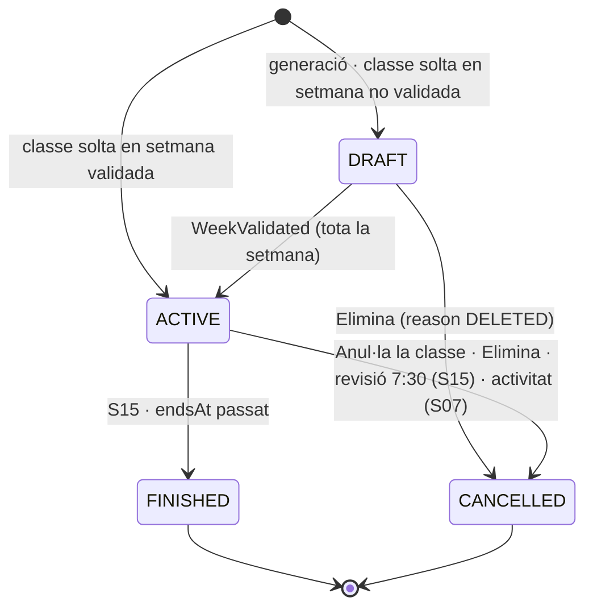
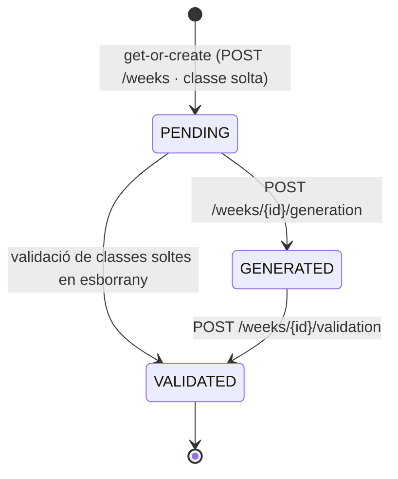

# S06 — Planificació: plantilles, setmanes, calendari, bloquejos i quadres del dia

**Etapa:** E4 · **Mòduls:** `WAITLIST` (només recomptes), `FREE_TRAINING` (cel·les d'entrenament als quadres), `COURSES` (recorregut muntat a la cel·la — punter a S16), `ACTIVITIES` (blocs d'activitat — punter a S07) · **Pantalles:** D3, D3b, D4, D4b, D4c, 10, 23 (fitxers a `03-disseny/mockups/pantalles/`) · **Model:** §B de v1.6 (PISTA, INSTRUCTOR, PLANTILLA_SETMANAL i FRANJA, cobertura, SETMANA, CLASSE, BLOQUEIG_PISTA) + §0 i §3 de PLATAFORMA (`instructorIds[]`, `levelIds[]`, `description`, `placementId`) · **Estat:** esborrany (03-09-2026) · **v1.0**

## 1. Propòsit i abast

Resol com el club **dissenya** l'oferta setmanal (plantilles amb franges i classes), la **genera** setmana a setmana en esborrany, la **valida** de cop, la **modifica o anul·la** (també amb inscrits, avisant-los) i com tothom la **veu**: l'admin al calendari (D4), l'alumne al quadre «Avui» (10) i l'instructor a la «Visió global» (23). Defineix també el **bloqueig de pista** (`RingBlock`) i el càlcul de **cobertura per nivell**.

Fora d'abast (spec on viu): reservar/anul·lar classes i llista d'espera (S08) · slots i reserves d'entrenament, pantalla 24 (S09; l'entitat `RingBlock`, l'endpoint `/ring-blocks` i la regla de conflictes són compartits: R-06-11 ↔ R-09-11…13) · assistència (S10) · revisió de les 7:30, finalització de classes i obertura de setmana (S15: al §7 es llista què necessita d'aquí) · manteniment d'activitats (S07) · recorreguts i muntatge (S16) · catàlegs de pistes, nivells i instructors (S05).

## 2. Pantalles i rutes

| Mockup | App | Ruta | Rol | Notes de comportament |
|---|---|---|---|---|
| D3 | `apps/clubs-admin` | `/plantilles` (`?template=…`) | ADMIN (INSTRUCTOR: lectura) | Pestanyes darrere «Plantilles»: «dl–dv: «{nom}» ▾» (llista de plantilles `WEEKDAYS`) i «Dissabtes ▾» (`SATURDAY`); la tria es recorda (`localStorage`). Botons: [＋ Nova] (nom + tipus), [Duplica] (còpia de la visible), [＋ Franja], [Crear classe]. Quadre franges × dies amb classes apilades; cel·la = `displayDescription` + instructor; color = pista, gris = «sense pista»; cel·la amb incoherència = contorn d'avís; peu: «Clica el nom d'un dia per veure'l per pista o per instructor · color = pista · gris = sense pista». Nota groga: «Incoherència: {dia} {hora} — {text}. Mentre hi hagi incoherències no es poden generar classes d'aquesta plantilla.» Clic a cel·la buida → formulari amb franja+dia preomplerts; clic a cel·la plena → edició; en desar des de cel·la buida, pregunta si en vol una altra a la mateixa franja. Targeta «Generar classes — per setmanes»: selector de setmana (proposta = R-06-07) + [GENERAR CLASSES] (desactivat amb «bloquejat: n incoherència a la plantilla») → confirmació «Es generaran com a esborrany les classes de la setmana del {dd/mm/aaaa}» → taula SETMANES (Any · Setmana · Inici · Classes generades · Validades; «pendent» = no generada). Taula «Cobertura per nivell (places de la setmana)» (R-06-06); amagada si `levels.enabled=false`. Buit: cap plantilla → targeta amb [＋ Nova]. Carregant: esquelet del quadre. Error: toast + reintent. |
| D3b | `apps/clubs-admin` | `/plantilles/:templateId/dia/:dayOfWeek` | ADMIN, INSTRUCTOR | Capçalera «Plantilla: «{nom}» ({dl–dv \| dissabtes})», selector ‹ {dia} ▾ ›, commutador «Visió per pista» / «Visió per instructor». Columnes = només pistes usades aquell dia (ordre del catàleg) + «Sense» si hi ha classes sense pista; per instructor = instructors amb classe. Files = franges de la plantilla. **Derivada al client** de `GET /week-templates/{id}` (cap endpoint propi). [‹ Tornar a la visió setmanal]. |
| D4 | `apps/clubs-admin` | `/calendari?estat=actives\|esborrany\|anul·lades&setmana=YYYY-MM-DD` | ADMIN (INSTRUCTOR: lectura, sense accions) | Segment Actives / Esborrany / Anul·lades = control principal i **determina la setmana inicial** (R-06-09); selector discret ‹ «Setmana en curs» · «Setmana vinent» · «del {d} al {d} de {mes}» ▾ ›. [Crear classe] (mateix formulari que D3 + data) i [Bloqueja pista] (R-06-11). Cel·la: `displayDescription` + `n/n` (+`+e` amb `WAITLIST`) + pista · instructor; anul·lada = atenuada amb «anul·lada · {motiu}»; bloqueig = cel·la «{Pista} bloquejada» + motiu i hores, clicable per editar/anul·lar; contorn taronja = seleccionada; contorn d'avís = incoherència. Peu: «n/n +e = inscrits/places + llista d'espera · {icona} = pista bloquejada · Clica el nom d'un dia per veure'l per pista o per instructor». Les fletxes ‹ › del selector mouen ±1 setmana **dins de l'estat del filtre** (Esborrany: només setmanes amb esborranys); «Setmana en curs» / «Setmana vinent» es calculen amb la data local del club. Clic a la capçalera del dia → mateixa vista que D3b alimentada per `GET /day-grid?view=instructor` (`/calendari/dia/:date`). Targeta «Classe seleccionada — {dia} · {hora} · {descripció} · {pista} · {instructor} [activa] n/n» amb xips Pista · Nivells · Instructor · Límit · Hora i, en activa, [ACCEPTA] · [ANUL·LA LA CLASSE] · [ELIMINA]; targeta «Avisos d'incoherència de la setmana». |
| D4b | `apps/clubs-admin` | idem, `estat=esborrany` | ADMIN | Cel·les amb contorn discontinu (peu: «contorn discontinu = esborrany (els alumnes encara no la veuen)»); classe seleccionada: [ACCEPTA] · [Elimina]. Targeta «Validació de la setmana»: «{Setmana} · del … · {n} classes en esborrany · cap incoherència \| {m} incoherències» + text «En validar, les {n} classes passen a actives alhora i els alumnes ja les poden reservar. No es pot validar una classe sola.» + [VALIDAR LA SETMANA] (desactivat amb incoherències o sense esborranys) → confirmació → `POST /weeks/{id}/validation`. |
| D4c | `apps/clubs-admin` | modal sobre `/calendari` | ADMIN | S'obre en prémer [ANUL·LA LA CLASSE] o [ELIMINA] sobre una classe activa amb inscrits (`GET …/cancellation-preview`). Títol «Anul·lar la classe — {dia} · {hora} · {descripció} · {pista} · {instructor}»; text «Aquesta classe té {n} alumnes inscrits. Si l'anul·les, rebran un avís a l'app, per correu i per SMS amb el text que escriguis a sota.»; llista guia + gos · nivell · canals («app · correu · SMS (2 telèfons)»); «Text de l'avís» (obligatori); peu «S'envia amb la plantilla «Classe anul·lada pel club» · també a la llista d'espera ({w})»; [Torna enrere] · [ANUL·LA I AVISA ELS {n} ALUMNES]. Sense inscrits ni espera: confirmació simple sense text. |
| 10 | `apps/clubs` | `/avui` (`?date=`) | MEMBER (i IMPERSONATED) | Títol «Classes del dia», ‹ {dt 4 d'agost} › i xips dl–ds de la setmana del dia triat (diumenge només per fletxes). Graella pistes × hores amb columnes d'amplada idèntica (capçalera = `Ring.shortName` amb el color de la pista); cel·la classe = descripció + instructor (R-06-12); «Ocupada» + motiu genèric en gris sense fons; classe en risc = requadre d'avís i, en tocar-la, globus amb el text de R-06-13. Peu «Ocupada = pista reservada per a entrenament o bloquejada». Buit: «Cap classe aquest dia». Data = **data local del club**. |
| 23 | `apps/clubs` | `/instructor/visio-global` | INSTRUCTOR, ADMIN | Títol «Visió global», mateixa graella amb `n/n +e`, instructor sempre, cel·les «Entren. {guia} + {gos}», «Bloq. {motiu}», classes anul·lades atenuades; tap a cel·la → detall (classe: pantalla 21 de S10; bloqueig: edició/anul·lació; entrenament: detall de S09). Peu «n/n +e = inscrits/places + llista d'espera · l'instructor previst es mostra sempre». |

## 3. Entitats i camps

Només el que aquest vertical crea o modifica (noms del glossari §0). Tot amb `clubId`, `createdAt/By`, `updatedAt/By` i `version` (optimistic locking).

**`WeekTemplate` · `week_templates`** (PLANTILLA_SETMANAL amb franges i classes embegudes)

| Camp | Tipus | Oblig. | Validació · notes |
|---|---|---|---|
| `name` | string ≤ 40 | sí | únic per club i `kind` (409 `DUPLICATE_NAME`); text lliure del club («Setmana A»), no es tradueix |
| `kind` | enum `WEEKDAYS` · `SATURDAY` | sí | fixa `days`: `MONDAY..FRIDAY` · `SATURDAY`; immutable |
| `notes` | string ≤ 500 | no | |
| `active` | bool | sí | `false` = no surt a les pestanyes ni és seleccionable per generar |
| `bands[]` `TimeBand` | `{id, startTime, endTime}` | — | R-06-01 |
| `classes[]` `TemplateClass` | `{id, bandId, dayOfWeek, instructorIds[], ringId?, levelIds[], capacity, capacityMode, description?, placementId?}` | — | R-06-02/03/04 |

**`Week` · `weeks`** (SETMANA) — índex únic `{clubId, startDate}`

| Camp | Tipus | Notes |
|---|---|---|
| `isoYear`, `isoWeek`, `startDate`, `endDate` | int, int, date, date | setmana ISO-8601 (dilluns–diumenge) calculada al fus del club |
| `state` | `PENDING` · `GENERATED` · `VALIDATED` | §5 |
| `generatedAt`, `generatedByAccountId`, `weekdayTemplateId`, `saturdayTemplateId?` | instant, id | s'informen a la generació |
| `validatedAt`, `validatedByAccountId` | instant, id | [VALIDAR LA SETMANA] |

**`ClassSession` · `class_sessions`** (CLASSE) — índexs `{clubId, date, state}`, `{clubId, startsAt}`, `{clubId, weekId}`, `{clubId, ringId, startsAt}`

| Camp | Tipus | Oblig. | Validació · notes |
|---|---|---|---|
| `weekId` | id | sí | la setmana es crea (get-or-create) si no existeix |
| `date`, `startTime`, `endTime` | date, HH:mm, HH:mm | sí | hora local del club; `startTime < endTime`; múltiples de `classes.slotMinutes`; dins `club.openingHours` del dia |
| `startsAt`, `endsAt` | instant UTC | derivats | R-06-14; recalculats a cada canvi d'hora |
| `ringId` | id? | no | `null` = «sense pista» |
| `levelIds[]` | id[] | segons `levels.enabled` | ≥ 1 si `levels.enabled`; buit permès si no |
| `instructorIds[]` | id[] | sí | 1..`classes.maxInstructorsPerClass`, actius, sense repetits |
| `capacity`, `capacityMode` | int ≥ 1, `AUTO`/`MANUAL` | sí | R-06-04 |
| `description`, `displayDescription` | string ≤ 40 (manual), string (només lectura) | no | R-06-03; `displayDescription` = manual ?? auto en l'idioma del qui llegeix |
| `state` | `DRAFT` · `ACTIVE` · `FINISHED` · `CANCELLED` | sí | §5 |
| `counters` | `{booked, waiting}` | sí (0,0) | desnormalitzats; els manté S08 dins la seva transacció (contracte); `waiting` = 0 sense `WAITLIST` |
| `riskExempt` | bool | sí (false) | principi 0.3.7; S15 salta la classe |
| `cancellation` | `{reason: CLUB_MANUAL · DELETED · RISK_REVIEW · ACTIVITY, adminText?, byAccountId, at, affectedBookings, affectedWaitlist}` | si CANCELLED | el text és el que rep l'alumne |
| `origin` | `{templateId?, templateClassId?}` | no | traçabilitat de la generació |
| `placementId` | id? | no | `COURSES` — S16 |
| `notes` | string ≤ 500 | no | |

**`RingBlock` · `ring_blocks`** (BLOQUEIG_PISTA) — índexs `{clubId, ringId, from, to}`, `{clubId, from}` (contracte compartit amb S09 §3, que el detalla per a la pantalla 24)

| Camp | Tipus | Oblig. | Validació · notes |
|---|---|---|---|
| `ringId` | id | sí | qualsevol pista activa (també les no reservables per entrenaments) |
| `from`, `to` | instants UTC | sí | `to − from` múltiple de `classes.slotMinutes` i ≥ `training.slotMinutes`; dins `club.openingHours`; a lectura s'hi afegeixen `date`, `fromLocal`, `toLocal` (fus del club) |
| `kind` | `BLOCK` · `RESERVATION` | sí | 24: «Bloqueig» / «Reserva de pista»; sense `FREE_TRAINING` només `BLOCK` |
| `reason` | `MAINTENANCE` · `PRIVATE_CLASS` · `THERAPY` · `PREPARATION` · `ACTIVITY` · `OTHER` | sí | combinacions: `RESERVATION` → `PRIVATE_CLASS`/`THERAPY`/`PREPARATION`/`OTHER`; `BLOCK` → `MAINTENANCE`/`OTHER`; `ACTIVITY` només via S07 amb `activityId` |
| `note` | string ≤ 200 | no | visible només a instructor/admin |
| `activityId` | id? | no | gestionat per S07: no editable ni anul·lable directament |
| `createdByAccountId` (+ nom resolt `createdByName`) | id | sí | mai vinculat a cap alumne |
| `state` | `ACTIVE` · `CANCELLED` (+`cancelledAt/By`) | sí | mai esborrat físic |

Lectures d'altres verticals: `Ring` (`shortName`, `color`, `active`, `activeSetupId`), `Level` (`name`, `order`, `capacity`, `active`), `Instructor` (`shortName`, `active`), `Dog`/`Member` (cobertura), `Booking`, `WaitlistEntry`, `TrainingBooking` (quadres i cancel·lació).

## 4. Regles de negoci

**R-06-01 · Estructura de la plantilla.** Una plantilla té franges **homogènies** (`bands[]`): `startTime < endTime`, totes dues múltiples de `classes.slotMinutes` (= 10), **sense solapament** entre franges de la mateixa plantilla (400 `BAND_OVERLAP`) i dins de `club.openingHours` de tots els dies del `kind` (422 `OUTSIDE_OPENING_HOURS`). Esborrar una franja amb classes → 409 `BAND_NOT_EMPTY`. Canviar les hores d'una franja mou totes les seves classes (les setmanes ja generades **no** canvien). *Exemple:* franges 08:30–09:30 · 09:30–10:30 · 16:30–17:30 · 17:40–18:40 · 18:50–19:50 · 20:00–21:00; afegir 17:45–18:45 → 400 (`INVALID_SLOT_GRANULARITY`: 45 no és múltiple de 10); afegir 18:00–19:00 → 400 `BAND_OVERLAP`.

**R-06-02 · Classe de plantilla.** `bandId` de la plantilla, **un sol** `dayOfWeek` ∈ `days`, `instructorIds` 1..`classes.maxInstructorsPerClass` (Cànic 1 → selector únic; 422 `TOO_MANY_INSTRUCTORS`), `ringId` opcional (actiu) o «Sense pista», `levelIds` ≥ 1 si `levels.enabled` (422 `LEVEL_REQUIRED`), `capacity` (R-06-04), `description` (R-06-03). Diverses classes poden compartir franja i dia (apilades). Cada canvi es desa a l'instant (un `PATCH` per canvi; `version`). Les incoherències **no** impedeixen desar (R-06-05).

**R-06-03 · Descripció automàtica i manual.** `description` guarda **només** el text manual. `displayDescription` = `description` si no és buit; si no, text automàtic a partir de `levelIds` ordenats per `Level.order` i amb `Level.name` resolt a l'idioma del lector: 1 nivell → «{nom}»; conjunt **contigu** que arriba a l'últim nivell actiu del catàleg i té ≥ 2 nivells → «{primer} i sup.» (`es` «{primer} y sup.», `en` «{primer} and up»); qualsevol altre conjunt → noms units amb «+». Sense nivells (`levels.enabled=false`) el text manual és obligatori (422 `DESCRIPTION_REQUIRED`). Esborrar el text manual (`description: null`) torna a l'automàtic. La classe generada copia `description` (manual) i `levelIds`; el text automàtic es recalcula sempre en llegir. *Exemple* (catàleg Cadells·A·B·C·D·E·F·G): {B,C} → «B+C» · {C,D,E} → «C+D+E» · {D,E,F,G} → «D i sup.» · {A,C} → «A+C» · {Cadells} → «Cadells» · {B,C} amb manual «Obed. urbana» → «Obed. urbana» fins que s'esborri.

**R-06-04 · Aforament.** `capacityMode=AUTO`: `capacity = min(Level.capacity dels levelIds)` (servei `CapacityCalculator` de S05, R-05-01); sense nivells, `classes.defaultCapacity` (= 5). Es recalcula en canviar els nivells. Si l'admin fixa «Límit» → `MANUAL` fins que s'envia `capacity: null`. En una `ClassSession`, `capacity < counters.booked` → 422 `CAPACITY_BELOW_BOOKINGS`. *Exemple:* B (5) + C (4) → 4; admin posa 5 → MANUAL 5; afegeix D (5) → segueix 5.

**R-06-05 · Incoherències** (`InconsistencyDetector`, càlcul en lectura). Dos elements **se solapen** si són del mateix dia i `start < other.end && other.start < end`. Tipus: `RING_DOUBLE_BOOKED` (dues classes amb el mateix `ringId` no nul), `INSTRUCTOR_DOUBLE_BOOKED` (comparteixen algun `instructorId`), `RING_BLOCKED` (classe i `RingBlock` actiu a la mateixa pista — «pista bloquejada = sense classe»), `RING_TRAINING_CONFLICT` (classe generada sobre una `TrainingBooking` activa; només amb `FREE_TRAINING`), i per canvis de catàleg (S05 R-05-03/07/12): `LEVEL_INACTIVE`, `RING_INACTIVE`, `INSTRUCTOR_INACTIVE`. Àmbits: **plantilla** (les seves `TemplateClass`, per `dayOfWeek` i franja) i **setmana** (`ClassSession` DRAFT/ACTIVE + `RingBlock` ACTIVE + reserves d'entrenament). Efectes: les classes es desen igualment, es marquen a la cel·la i al peu; a la plantilla `canGenerate=false` i `POST …/generation` → 409 `TEMPLATE_INCONSISTENT`; a una setmana amb esborranys `canValidate=false` i `POST …/validation` → 409 `WEEK_INCONSISTENT`; en una setmana validada són **avisos** (targeta «Avisos d'incoherència de la setmana»). Excepció (S09 R-09-13): crear o moure **interactivament** una classe a una pista amb reserves d'entrenament vives → 409 `RING_HAS_BOOKINGS {bookings[]}` llevat que l'ADMIN enviï `cancelBookings: true` (les reserves passen a `CANCELLED_BY_CLUB` dins la mateixa transacció, avís de S09). Una classe «sense pista» mai genera conflicte de pista. *Exemples:* dc 20:00, dues classes a Central → `RING_DOUBLE_BOOKED` («dimecres 20:00 — pista Central amb dues classes alhora»); dj 18:50, Marc a Cadells i a Petita → `INSTRUCTOR_DOUBLE_BOOKED`; amb `maxInstructorsPerClass=2`, [Marc, Neus] 18:50–19:50 i [Neus] 19:00–20:00 → incoherència per Neus; es desactiva el nivell F → totes les classes de plantilla amb F queden `LEVEL_INACTIVE` i bloquegen la generació fins que es corregeixen.

**R-06-06 · Cobertura per nivell** (càlcul, mai desat; només si `levels.enabled`). Per a cada nivell actiu L (ordre del catàleg, Cadells inclòs) sobre el conjunt de classes C (plantilla: classes de la plantilla dl–dv visible + de la de dissabtes visible; setmana: `ClassSession` no anul·lades):

- `maxSeats(L)` = Σ `capacity` de les classes on L ∈ `levelIds` · `propSeats(L)` = Σ `capacity / |levelIds|` d'aquestes classes.
- `dogsTotal(L)` = gossos amb `Dog.status = ACTIVE`, `Member.status = ACTIVE` (S03) i `levelId = L` · `dogsActive(L)` = els que tenen ≥ 1 `Booking` en estat `ACTIVE` o `CANCELLED_LATE` en una classe de la setmana en curs o de les `coverage.activeDogWeeks − 1` (= 1) anteriors.
- `maxRatioPct` = round(100 · maxSeats / dogsTotal) · `propRatioPct` = round(100 · propSeats / dogsActive); denominador 0 → `null` i estat `NO_DOGS`.
- Estat segons `propRatioPct` i `coverage.thresholds {ok:240, tight:190, short:150}`: `OK` («bé») si > ok · `TIGHT` («ajustat») si tight ≤ x ≤ ok · `SHORT` («manca oferta») si short ≤ x < tight · `EXPAND` («cal ampliar») si < short.

*Exemple:* c1 {A} cap 5 · c2 {A,B} cap 5 · c3 {B,C} cap 4. A: max 10, prop 7,5; B: max 9, prop 4,5; C: max 4, prop 2. Gossos A 4 totals / 3 actius → 250 % · 250 % → **bé**; B 5/3 → 180 % · 150 % → **manca oferta** (150 és el límit inferior inclòs); C 2/1 → 200 % · 200 % → **ajustat**. La cobertura reacciona a `DogLevelChanged` i a canvis d'estat d'abonat sense cap acció (es recalcula a cada lectura).

**R-06-07 · Generació d'una setmana.**
- Candidates: setmanes ISO des de la setmana en curs (data local del club) fins a +12 no generades; **proposta** = la primera posterior a l'última generada (cap generada → la setmana en curs).
- Cos: `weekdayTemplateId` (obligatori, `kind=WEEKDAYS`, si no 422 `TEMPLATE_KIND_MISMATCH`) i `saturdayTemplateId` (opcional, `kind=SATURDAY`; el front envia la que hi ha a la pestanya «Dissabtes»: s'aplica automàticament, sense tria a la targeta; `null` = cap classe de dissabte).
- Precondicions: `Week.generatedAt == null` i `state ≠ VALIDATED` (409 `WEEK_ALREADY_GENERATED`), cap incoherència a cap de les dues plantilles (409 `TEMPLATE_INCONSISTENT`), setmana no acabada (422 `WEEK_IN_PAST`).
- Per a cada `TemplateClass`: `date = startDate + offset(dayOfWeek)`; si `date ∈ club.holidays` o `date < avui` → s'omet i es compta a `skipped[]`; si no, es crea una `ClassSession` **DRAFT** copiant hores de la franja, pista, nivells, instructors, aforament (+mode), descripció manual (+mode) i `origin`.
- Tot en **una transacció** amb `Week` (`state=GENERATED`, `generatedAt`, plantilles usades, `version+1`) + `WeekGenerated` a l'outbox. Idempotència: bloqueig optimista sobre `Week` + índex únic → de dues crides simultànies una crea i l'altra rep 409; amb el mateix `Idempotency-Key` es retorna la mateixa resposta (doble clic innocu).
- Les classes soltes ja existents a la setmana es respecten (no es dedupliquen). Abans de cridar, la UI confirma «Es generaran com a esborrany les classes de la setmana del {dd/mm/aaaa}».
- *Exemple:* l'última generada és 2026-W34 → la proposta és 2026-W35 (24–30/08) encara que W36 tampoc estigui generada; sense cap setmana generada, la proposta és la setmana en curs. Plantilla A amb 40 classes dl–dv + dissabtes 6 = 46; el 26/08 és festiu (5 classes) → 41 creades, `skipped: [{date: 2026-08-26, reason: HOLIDAY, count: 5}]`; canviar `club.holidays` després no toca les classes ja generades (l'admin les anul·la des de D4).

**R-06-08 · Validació de la setmana.** [VALIDAR LA SETMANA] passa **totes** les classes `DRAFT` de la setmana a `ACTIVE` alhora (una transacció; `Week.state=VALIDATED`, `validatedAt`; `WeekValidated{classIds}`). Cal ≥ 1 esborrany (409 `NOTHING_TO_VALIDATE`) i cap incoherència entre esborranys i bloquejos (409 `WEEK_INCONSISTENT`). No existeix validació classe a classe. Els esborranys són **invisibles** per als alumnes (quadres, llistes i endpoints d'abonat els exclouen). Que la setmana sigui **reservable** depèn de `bookings.weekOpensAt` (S08): validar la setmana vinent el dijous no l'obre abans de diumenge 20:00.

**R-06-09 · Cicle i edició d'una classe.**
- Estat en crear-la solta ([Crear classe]): `ACTIVE` si la seva `Week` és `VALIDATED` (la UI avisa «Els alumnes la veuran de seguida»), si no `DRAFT`. La data pot ser festiva (decisió explícita de l'admin; la UI ho avisa).
- Camps editables ([ACCEPTA]): `ringId`, `levelIds`, `instructorIds`, `capacity`, `startTime/endTime`, `description`, `notes`, `riskExempt`; la **data no** (es crea una classe nova). `version` obligatori (409 `STALE_VERSION`). `FINISHED` i `CANCELLED`: només `notes` (409 `INVALID_STATE`).
- Si la classe és `ACTIVE` amb `counters.booked > 0` i el diff toca `startTime`, `ringId` o `instructorIds` → `ClassSessionUpdated{diff}` dispara **N-08b** als inscrits; canvis de nivells, aforament o descripció no avisen. Canviar nivells no toca les inscripcions existents (responsabilitat de l'admin).
- Filtre inicial de D4: Actives → setmana en curs; Esborrany → primera setmana ≥ en curs amb classes `DRAFT`; Anul·lades → setmana en curs. Vista Actives = `ACTIVE` + `FINISHED` + `CANCELLED` (atenuades, com al mockup); Esborrany = `DRAFT`; Anul·lades = només `CANCELLED`.
- `FINISHED` el posa S15 quan `endsAt < ara`; fins llavors la classe segueix `ACTIVE` i editable amb les mateixes regles.

**R-06-10 · Anul·lació i eliminació amb inscrits.**
- [ANUL·LA LA CLASSE] → `reason=CLUB_MANUAL`; [ELIMINA] → `reason=DELETED`; **totes dues** acaben en `CANCELLED` (mai esborrat físic) i, si hi ha inscrits o espera, passen pel modal D4c.
- Precondicions: `state ∈ {DRAFT, ACTIVE}` (409 `INVALID_STATE`); `adminText` obligatori (1–500 caràcters) si `counters.booked > 0` o `waiting > 0` (422 `ADMIN_TEXT_REQUIRED`); en un esborrany sense inscrits no cal text ni hi ha avisos.
- **Transacció única** (`ClassCancellationUseCase`): (1) classe → `CANCELLED` + `cancellation{reason, adminText, byAccountId, at, affectedBookings, affectedWaitlist}`; (2) cada `Booking` `ACTIVE` → `CANCELLED_BY_CLUB` (no compta per a límits ni assistència); (3) per a cada inscripció pagada amb pack → moviment de retorn (`PackRefunded`, només amb `PACKS`); (4) cada `WaitlistEntry` `ACTIVE`/`NOTIFIED` → `CANCELLED`; (5) `SeatHold` vius eliminats; (6) `counters` a 0; (7) `ClassCancelledByClub{reason, adminText, affected[], waitlistIds[]}` a l'outbox. Qualsevol error → rollback complet.
- El dispatcher envia **N-08a** (app + correu + SMS) a cada inscrit **i** a cada entrada d'espera, a l'instructor (app + correu) i als admins (app). S08 comprova `state == ACTIVE` dins la seva pròpia transacció: cap reserva pot néixer sobre una classe anul·lada.
- *Exemple:* dc 12 · 18:50 · B i C amb 4 inscrits (2 amb pack) i 2 en espera → 4 `CANCELLED_BY_CLUB`, 2 `PackRefunded`, 2 espera cancel·lades, 6 N-08a a alumnes amb `[[admin_text]]` = «La classe de dimecres 12 … Disculpeu les molèsties!», botó [ANUL·LA I AVISA ELS 4 ALUMNES].

**R-06-11 · Bloquejos de pista** (regla compartida amb S09 R-09-11…13; un sol endpoint). Els crea l'admin (D4 [Bloqueja pista]: dia + hores lliures múltiples de `classes.slotMinutes`, convertides a instants amb el fus del club) o l'instructor (24: slots de `training.slotMinutes`), sempre **sense alumne** i amb `from > ara`. En crear-lo o modificar-lo, qualsevol solapament amb una `ClassSession` `DRAFT`/`ACTIVE`, un altre `RingBlock` `ACTIVE` o una `TrainingBooking` `ACTIVE` de la pista → 409 `RING_BLOCK_CONFLICT {conflicts[]}` (el bloqueig no es desa mai inconsistent); l'ADMIN pot forçar només el cas de reserves d'entrenament amb `cancelBookings: true` (409 `RING_HAS_BOOKINGS` sense). La incoherència `RING_BLOCKED` només neix quan una classe es genera o es mou sobre un bloqueig ja existent (R-06-05). Efectes: slots d'entrenament `BLOCKED` (S09), «Ocupada» + motiu genèric als alumnes, «Bloq. {motiu}» + nota + autor als instructors/admin, registre d'ús de pistes. Modificar (`PATCH`, només futurs, `version`) o anul·lar (`POST …/cancellation`): qualsevol INSTRUCTOR o ADMIN; `activityId ≠ null` → 409 `RING_BLOCK_MANAGED_BY_ACTIVITY` (S07 el crea i l'anul·la amb l'activitat). *Exemple:* l'admin bloqueja Carretera dc 12 · 16:00–18:00 «manteniment» amb la reserva de Sergio + Thai a les 17:00 → 409 `RING_HAS_BOOKINGS`; repeteix amb `cancelBookings: true` → bloqueig creat i reserva «cancel·lada pel club» amb avís; el dj, D i E a Carretera 17:40 segueix intacta perquè el bloqueig és del dc.

**R-06-12 · Què veu cadascú als quadres.** Files = hores d'inici diferents de tots els elements del dia; columnes = pistes actives (ordre del catàleg) + «Sense» només si hi ha classes sense pista.

| Element | MEMBER (10) | INSTRUCTOR / ADMIN (23, dia de D4) |
|---|---|---|
| Classe `ACTIVE`/`FINISHED` | descripció + instructor **només** si `ara ≥ startsAt − bookings.showInstructorHoursBefore` h (= 24; `0` = sempre); **sense** recomptes | descripció + `n/n` (+`+e`) + instructor sempre |
| Classe `DRAFT` | no | no (només al calendari D4b) |
| Classe `CANCELLED` | no | atenuada «anul·lada» |
| Reserva d'entrenament | «Ocupada · entren.» (mai qui) | «Entren. {guia} + {gos}» |
| `RingBlock` | «Ocupada · {motiu genèric}» | «Bloq. {motiu}» + nota + autor |
| Bloc d'activitat (`ACTIVITIES`) | «Activitat · {títol}» | idem + enllaç a D7 |
| En risc (R-06-13) | requadre + globus en tocar | requadre + `atRisk` |
| Recorregut muntat (`COURSES`) | icona a la capçalera de la columna (S16) | idem |

*Exemple:* classe dt 4 · 20:00 · Estel; l'alumne mira el quadre dl 3 a les 19:00 → «B+C» sense nom; a les 20:00 (24 h abans) → «B+C · Estel». L'instructor la veu «B+C 3/5 · Estel» sempre.

**R-06-13 · Classe en risc (visualització).** `atRisk = state == ACTIVE ∧ ¬riskExempt ∧ counters.booked < classes.minDogs (= 2) ∧ date ≤ avui + classes.riskLookaheadDays (= 2) ∧ ara < reviewAt`, amb `reviewAt = date` a `classes.riskReviewTime` (= 07:30) al fus del club. Càlcul pur (`RiskEvaluator`) compartit amb S15, que és qui avisa (N-16) i anul·la. Text del globus (ICU, `home:today.riskTooltip`, `{count}` = gossos inscrits, `{time}`, `{day}` = dia de la classe en l'idioma de l'alumne): =0 «Aquesta classe no té cap alumne: si no s'hi apunta un mínim de {minDogs} gossos, s'anul·larà com a màxim a les {time} de {day}.» · one «Aquesta classe només té un alumne: si ningú més s'hi apunta abans de les {time} de {day}, s'anul·larà.» Si `classes.riskAutoCancelSameDay=false`, la frase final és «el club decidirà si es fa» (`…riskTooltipNoAutoCancel`). *Exemple:* dl 3 a les 18:00, classe dt 4 · 20:00 amb 1 inscrit → en risc, «…abans de les 7:30 de dimarts…»; la mateixa classe dj 6 → encara no (fora del marge).

**R-06-14 · Temps local, UTC i canvi d'hora.** `date` + `startTime/endTime` són l'única font (hora local, `CLUB.timeZone`); `startsAt/endsAt` es deriven amb `ZonedDateTime.of(date, time, zone)` i serveixen per a ordenar, schedulers i límits. En generar, cada setmana torna a derivar: dl 8:30 és sempre 8:30 local encara que l'UTC canviï. Hora local inexistent (salt endavant) → es desplaça endavant i s'avisa al log; ambigua (salt enrere) → primera ocurrència. *Exemple (Europe/Madrid):* ds 24/10/2026 08:30 → `06:30Z`; dl 26/10/2026 08:30 (després del canvi) → `07:30Z`; ds 28/03/2026 08:30 → `07:30Z`, dl 30/03 → `06:30Z`. `reviewAt`, «Setmana en curs» i la data d'«Avui» es calculen amb el fus del club, mai del dispositiu.

**R-06-15 · Variants per club.**

| Variant | Efecte |
|---|---|
| `classes.maxInstructorsPerClass > 1` | selector múltiple (xips) a D3/D4; cel·la mostra «Marc, Neus»; incoherència per **cada** instructor compartit |
| `levels.enabled = false` | sense xips de nivell; `levelIds` buits; descripció manual obligatòria; cobertura amagada (`GET /coverage` → 404 `LEVELS_DISABLED`); aforament = `classes.defaultCapacity`; el quadre 10 mostra totes les classes igualment |
| `WAITLIST` off | `counters.waiting` sempre 0, cap «+e», `affectedWaitlist` buit |
| `FREE_TRAINING` off | cap cel·la d'entrenament, cap `RING_TRAINING_CONFLICT`, `RingBlock.kind` només `BLOCK` |
| `ACTIVITIES` off | cap bloc d'activitat; `reason=ACTIVITY` rebutjat |
| `COURSES` off | sense `placementId` ni icona de recorregut |

## 5. Estats i transicions



| Transició | Qui | Condició | Efectes | Esdeveniment |
|---|---|---|---|---|
| → DRAFT / → ACTIVE | ADMIN | R-06-07 / R-06-09 | `Week` get-or-create | `WeekGenerated` · `ClassSessionCreated` |
| DRAFT → ACTIVE | ADMIN | R-06-08 | visibles per als alumnes | `WeekValidated` |
| DRAFT → CANCELLED | ADMIN | sense inscrits | `cancellation.reason=DELETED` | `ClassCancelledByClub` (sense destinataris) |
| ACTIVE → CANCELLED | ADMIN · S15 · S07 | R-06-10 | inscripcions, espera, packs, N-08a | `ClassCancelledByClub` |
| ACTIVE → FINISHED | S15 | `endsAt < ara` | assistència queda (S10) | — (`SchedulerRun`) |
| ACTIVE (edit) | ADMIN | R-06-09 | N-08b si escau | `ClassSessionUpdated` |
| riskExempt | ADMIN | ACTIVE | S15 la salta | `ClassRiskExemptionChanged` |



`RingBlock`: `ACTIVE` → `CANCELLED` (`POST …/cancellation`; ADMIN, INSTRUCTOR, o S07 per a `activityId`) amb `RingBlockCancelled`.

## 6. API

Base `CONVENCIONS_API.md`; totes les rutes són de club (tenant del JWT). `I` = idempotent. Mòdul «—» = sempre.

| Mètode | Ruta | Rol(s) | Mòdul | I | Descripció | Cos/paràmetres clau | Respostes i errors |
|---|---|---|---|---|---|---|---|
| GET | `/week-templates` | ADMIN, INSTRUCTOR | — | sí | llista per a les pestanyes | `?kind=&active=` | 200 `{items:[{id,name,kind,active,classCount,inconsistencyCount,updatedAt}]}` |
| POST | `/week-templates` | ADMIN | — | no | [＋ Nova] / [Duplica] | `{name, kind, copyFromId?}` | 201 plantilla; 400; 409 `DUPLICATE_NAME` |
| GET | `/week-templates/{id}` | ADMIN, INSTRUCTOR | — | sí | plantilla completa (D3, D3b) | — | 200 (forma A); 404 |
| PATCH | `/week-templates/{id}` | ADMIN | — | sí | nom, notes, actiu | `{name?, notes?, active?, version}` | 200; 409 `STALE_VERSION` |
| POST | `/week-templates/{id}/bands` | ADMIN | — | no | [＋ Franja] | `{startTime, endTime}` | 201 plantilla; 400 `BAND_OVERLAP`/`INVALID_SLOT_GRANULARITY`; 422 `OUTSIDE_OPENING_HOURS` |
| PATCH / DELETE | `/week-templates/{id}/bands/{bandId}` | ADMIN | — | sí | canviar hores / esborrar franja buida | `{startTime?, endTime?, version}` | 200 / 204; 409 `BAND_NOT_EMPTY` |
| POST | `/week-templates/{id}/classes` | ADMIN | — | no | [CREA LA CLASSE] | `{bandId, dayOfWeek, instructorIds[], ringId?, levelIds[], capacity?, description?}` | 201 plantilla (amb incoherències); 422 `TOO_MANY_INSTRUCTORS`/`LEVEL_REQUIRED`/`DESCRIPTION_REQUIRED` |
| PATCH / DELETE | `/week-templates/{id}/classes/{classId}` | ADMIN | — | sí | editar (clic a cel·la plena) / treure de la plantilla | camps de la classe + `version` | 200 plantilla / 204; 409 `STALE_VERSION` |
| GET | `/coverage` | ADMIN, INSTRUCTOR | — (`levels.enabled`) | sí | taula de cobertura | `?templateId=&saturdayTemplateId=` **o** `?weekId=` | 200 (forma C); 404 `LEVELS_DISABLED` |
| GET | `/weeks` | ADMIN, INSTRUCTOR | — | sí | taula SETMANES, selector de D4 | filtre universal (`startDate`, `state`), `sort` | 200 llistat estàndard |
| GET | `/weeks/generation-candidates` | ADMIN | — | sí | selector de «Generar classes» | — | 200 `{items:[{startDate,endDate,isoYear,isoWeek,weekId?,state,proposed}]}` |
| POST | `/weeks` | ADMIN | — | sí | get-or-create | `{startDate}` (dilluns) | 200 existent / 201 creada; 400 si no és dilluns |
| GET | `/weeks/{id}` | ADMIN, INSTRUCTOR | — | sí | fitxa | — | 200; 404 |
| POST | `/weeks/{id}/generation` | ADMIN | — | per estat + `Idempotency-Key` | [GENERAR CLASSES] | `{weekdayTemplateId, saturdayTemplateId?}` | 200 `{weekId, classCount, skipped[{date,reason:HOLIDAY·PAST,count}]}`; 409 `WEEK_ALREADY_GENERATED`/`TEMPLATE_INCONSISTENT`; 422 `TEMPLATE_KIND_MISMATCH`/`WEEK_IN_PAST` |
| POST | `/weeks/{id}/validation` | ADMIN | — | per estat | [VALIDAR LA SETMANA] | `{}` | 200 `{validatedClassIds[]}`; 409 `WEEK_INCONSISTENT`/`NOTHING_TO_VALIDATE` |
| GET | `/weeks/{id}/calendar` | ADMIN, INSTRUCTOR | — | sí | agregat de D4/D4b (forma B) | `?filter=ACTIVE\|DRAFT\|CANCELLED` | 200; 404 |
| GET | `/class-sessions` | ADMIN, INSTRUCTOR | — | sí | llistat universal | `filter=date:between:…`, `state`, `ringId`, `instructorId`, `levelId` | 200 llistat; MEMBER → 403 (usa `/day-grid` i S08) |
| POST | `/class-sessions` | ADMIN | — | no | [Crear classe] al calendari | `{date, startTime, endTime, ringId?, levelIds[], instructorIds[], capacity?, description?, cancelBookings?}` | 201 classe (estat per R-06-09); 422 idem plantilla; 409 `RING_HAS_BOOKINGS` (R-06-05) |
| GET | `/class-sessions/{id}` | ADMIN, INSTRUCTOR, MEMBER | — | sí | detall (23; base per a S08/S10) | — | 200 projecció per rol (MEMBER: només `ACTIVE`/`FINISHED`, instructor segons R-06-12, sense `notes`); 404 |
| PATCH | `/class-sessions/{id}` | ADMIN | — | sí | [ACCEPTA] | camps R-06-09 + `version` (+ `cancelBookings?` en canviar de pista/hora) | 200; 409 `STALE_VERSION`/`INVALID_STATE`/`RING_HAS_BOOKINGS`; 422 `CAPACITY_BELOW_BOOKINGS` |
| GET | `/class-sessions/{id}/cancellation-preview` | ADMIN | — | sí | dades del modal D4c | — | 200 `{bookings:[{bookingId,memberName,dogName,levelName,channels[],phoneCount}], waitlistCount}` |
| POST | `/class-sessions/{id}/cancellation` | ADMIN | — | per estat + `Idempotency-Key` | [ANUL·LA I AVISA…] · [ELIMINA] | `{reason: CLUB_MANUAL\|DELETED, adminText?}` | 200 classe; 409 `INVALID_STATE`; 422 `ADMIN_TEXT_REQUIRED` |
| POST | `/class-sessions/{id}/risk-exemption` | ADMIN | — | sí | exempció de la revisió 7:30 | `{exempt: bool}` | 200; 409 `INVALID_STATE` |
| GET | `/ring-blocks` · `/ring-blocks/{id}` | MEMBER (redactat), INSTRUCTOR, ADMIN | — | sí | llistat universal / detall (contracte detallat a S09 §6) | `from`, `to`, `ringId?`, `kind?`, `state?` | 200 (MEMBER: sense `note` ni `createdByName`) |
| POST | `/ring-blocks` | ADMIN, INSTRUCTOR | — (`RESERVATION` → `FREE_TRAINING`) | `Idempotency-Key` | [Bloqueja pista] / 24 | `{ringId, from, to, kind, reason, note?, cancelBookings?}` | 201; 400 `INVALID_TIME_RANGE`/`INVALID_SLOT_GRANULARITY`; 422 `OUTSIDE_OPENING_HOURS`; 409 `RING_BLOCK_CONFLICT`/`RING_HAS_BOOKINGS`; 404 `MODULE_DISABLED` |
| PATCH | `/ring-blocks/{id}` | ADMIN, INSTRUCTOR | — | sí | modificar (només futurs) | camps de creació + `version` | 200; 409 `STALE_VERSION`/`RING_BLOCK_CONFLICT`/`RING_BLOCK_MANAGED_BY_ACTIVITY`/`INVALID_STATE` |
| POST | `/ring-blocks/{id}/cancellation` | ADMIN, INSTRUCTOR | — | per estat | anul·lar | `{}` | 200; 409 `INVALID_STATE`/`RING_BLOCK_MANAGED_BY_ACTIVITY` |
| GET | `/day-grid` | tots (autenticats) | — | sí | quadre del dia (10, 23, dia de D4) | `?date=YYYY-MM-DD&view=member\|instructor` | 200 (forma D); 403 si `view=instructor` sense rol; 400 data invàlida |

Tot endpoint d'un altre club → 404. Tokens d'impersonació: només `GET /day-grid?view=member` i `GET /class-sessions/{id}`.

**Forma A — `GET /week-templates/{id}`**
```json
{ "id":"…","name":"Setmana A","kind":"WEEKDAYS","days":["MONDAY","TUESDAY","WEDNESDAY","THURSDAY","FRIDAY"],"active":true,"version":7,
  "bands":[{"id":"b1","startTime":"08:30","endTime":"09:30"}],
  "classes":[{"id":"c1","bandId":"b1","dayOfWeek":"MONDAY","instructorIds":["i1"],"ringId":"r2","levelIds":["lB","lC"],
              "capacity":4,"capacityMode":"AUTO","description":null,"displayDescription":"B+C","inconsistencyIds":[]}],
  "inconsistencies":[{"id":"x1","type":"RING_DOUBLE_BOOKED","dayOfWeek":"WEDNESDAY","bandId":"b6","ringId":"r2","itemIds":["c9","c12"],
                      "message":"dimecres 20:00 — pista Central amb dues classes alhora"}],
  "canGenerate":false }
```
**Forma B — `GET /weeks/{id}/calendar?filter=ACTIVE`**
```json
{ "week":{"id":"…","isoYear":2026,"isoWeek":33,"startDate":"2026-08-10","endDate":"2026-08-16","state":"VALIDATED","generatedAt":"…","validatedAt":"…","relative":"CURRENT|NEXT|OTHER"},
  "rows":["08:30","09:30","17:40","18:50"],
  "classes":[{"id":"…","date":"2026-08-12","startTime":"18:50","endTime":"19:50","ringId":"r2","levelIds":["lB","lC"],"instructorIds":["i3"],
              "capacity":5,"capacityMode":"AUTO","displayDescription":"B+C","description":null,"state":"ACTIVE","counters":{"booked":4,"waiting":0},
              "atRisk":false,"riskExempt":false,"cancellation":null,"version":3,"inconsistencyIds":[]}],
  "ringBlocks":[{"id":"…","ringId":"r3","from":"2026-08-12T14:00:00Z","to":"2026-08-12T16:00:00Z","date":"2026-08-12","fromLocal":"16:00","toLocal":"18:00",
                 "kind":"BLOCK","reason":"MAINTENANCE","note":null,"activityId":null,"createdByName":"Marc","state":"ACTIVE","version":1}],
  "inconsistencies":[{"id":"…","type":"INSTRUCTOR_DOUBLE_BOOKED","date":"2026-08-13","startTime":"18:50","instructorId":"i3","itemIds":["…","…"],
                      "message":"dj 18:50 — Marc assignat a dues pistes alhora (Cadells i Petita)"}],
  "draftCount":0,"canValidate":false }
```
**Forma C — `GET /coverage`**
```json
{ "scope":"TEMPLATE","thresholds":{"ok":240,"tight":190,"short":150},"activeDogWeeks":2,
  "levels":[{"levelId":"lA","name":"A","maxSeats":100,"propSeats":70.5,"dogsTotal":43,"dogsActive":31,"maxRatioPct":233,"propRatioPct":227,"status":"TIGHT","booked":null}] }
```
(`scope=WEEK` afegeix `booked` = inscripcions actives de gossos del nivell a la setmana.)

**Forma D — `GET /day-grid?date=2026-08-04&view=instructor`** (a `view=member`: sense `occupancy`, sense `TRAINING`/`BLOCK`, que es converteixen en `OCCUPIED`, i `instructorName` només segons R-06-12)
```json
{ "date":"2026-08-04","dayOfWeek":"TUESDAY","timeZone":"Europe/Madrid","view":"INSTRUCTOR",
  "columns":[{"ringId":"r1","shortName":"Mun","name":"Muntanya","color":"#5B8C5A","activeSetupId":null}],
  "rows":[{"time":"08:00","cells":[{"ringId":"r3","kind":"TRAINING","endTime":"08:30","who":["Pau + Blat"],"trainingBookingIds":["…"]}]},
          {"time":"08:30","cells":[{"ringId":"r1","kind":"CLASS","classId":"…","endTime":"09:30","description":"C i sup.","instructorName":"Marc",
                                   "state":"ACTIVE","atRisk":false,"riskText":null,"occupancy":{"booked":3,"capacity":5,"waiting":0}}]},
          {"time":"16:00","cells":[{"ringId":"r3","kind":"BLOCK","blockId":"…","endTime":"18:00","reason":"MAINTENANCE","note":null,"createdByName":"Marc"}]},
          {"time":"20:00","cells":[{"ringId":"r3","kind":"CLASS","classId":"…","endTime":"21:00","description":"D i sup.","instructorName":"Estel","state":"ACTIVE",
                                   "atRisk":true,"riskText":"Aquesta classe només té un alumne: si ningú més s'hi apunta abans de les 7:30 de dimarts, s'anul·larà.","occupancy":{"booked":1,"capacity":5,"waiting":0}}]}] }
```
Només es retornen cel·les no buides; dues cel·les amb el mateix `ringId` a la mateixa fila s'apilen; un dia sense elements retorna `rows: []`. `kind` ∈ `CLASS · OCCUPIED · TRAINING · BLOCK · ACTIVITY`; a `view=member` el bloqueig de les 16:00 seria `{"ringId":"r3","kind":"OCCUPIED","endTime":"18:00","reason":"MAINTENANCE"}` i l'entrenament `{"kind":"OCCUPIED","reason":"TRAINING"}`; la cel·la `ACTIVITY` porta `activityId` i `title` (resolt) a totes dues vistes.

**Altres formes.** `GET /weeks` (element): `{id, isoYear, isoWeek, startDate, endDate, state, generatedAt, validatedAt, weekdayTemplateName, saturdayTemplateName, classCounts: {draft, active, cancelled}}`. `GET /class-sessions/{id}` per a MEMBER: `{id, date, startTime, endTime, ring: {id, name, color}, levelIds, displayDescription, instructorName (R-06-12), state, capacity, freeSeats, waiting?}` — S08 hi afegeix l'estat de reserva del gos; per a INSTRUCTOR/ADMIN s'hi sumen `instructorIds`, `counters`, `atRisk`, `riskExempt`, `cancellation`, `origin`, `placementId`, `notes` (només ADMIN) i `version`.

## 7. Esdeveniments

**Emesos** (outbox, mateixa transacció): `WeekTemplateChanged{templateId, diff, inconsistencies[]}` (qualsevol mutació de plantilla, franja o classe de plantilla) · `WeekGenerated{weekId, classCount, templateId}` · `WeekValidated{weekId, classIds[]}` · `ClassSessionCreated{classId}` · `ClassSessionUpdated{classId, diff, bookedCount}` · `ClassCancelledByClub{classId, reason, adminText, affected[{bookingId, memberId, dogId}], waitlistIds[]}` · `ClassRiskExemptionChanged{classId, exempt}` · `RingBlockCreated{blockId, ringId, from, to, reason, activityId?}` · `RingBlockCancelled{blockId}` · **nou** `RingBlockUpdated` (§13).

**Consumits**: cap per a les activitats — S07 crida **síncronament** `RingBlockService.syncForActivity()` dins la seva transacció (els conflictes tornen com a `409` a l'admin, S07 R-07-05); `ActivityPublished/Updated/Cancelled` només s'usen aquí per refrescar les graelles · `ClassAutoCancelled` (S15) usa el **mateix cas d'ús** de R-06-10 amb `reason=RISK_REVIEW` i `adminText` de `messages_*` (`scheduling.autoCancel.text`) · `LevelChanged`, `RingChanged`, `InstructorChanged` (S05): res a desar (el detector llegeix l'estat del catàleg) — invalidació de la cache de plantilla/calendari · `DogLevelChanged`, `MemberStatusChanged`: res (cobertura calculada en lectura) · `BookingCreated/Cancelled`, `WaitlistJoined/Left/Consolidated` (S08) mantenen `counters` **dins la transacció de S08**, no per esdeveniment.

**Contracte amb S15** (schedulers): `RiskEvaluator.evaluate(class, now)`; `ClassCancellationUseCase.cancel(classId, RISK_REVIEW, autoText)`; `ClassSessionRepository.findActiveBetween(clubId, from, to)` (índex `{clubId, date, state}`); `finishEnded(now)` → `ACTIVE`→`FINISHED`; `WeekValidated` per a N-33 quan la setmana ja és oberta. **Amb S05/S08/S09/S16**: S05 exposa `CapacityCalculator` i consulta `ClassSessionRepository.countFutureByRing/Instructor` (R-05-07/12); S08 comprova `state == ACTIVE` i `startsAt`, manté `counters`; S09 exposa `TrainingOccupancyService.occupancy(range, ringIds?, viewerRole)` (intervals d'entrenament i bloqueig que el `DayGridQuery` fusiona amb les classes) i `TrainingConflictService.findActiveBookings(ringId, from, to)` (R-06-05/11), i consumeix `ClassSessionCreated/Updated`, `WeekGenerated/Validated`, `RingBlock*` per invalidar la seva graella; S16 escriu `placementId` i `Ring.activeSetupId`.

## 8. Notificacions

| Codi | Moment exacte | Destinataris i canals | Variables |
|---|---|---|---|
| N-08a «Classe anul·lada pel club» | consumidor de `ClassCancelledByClub` amb `reason ∈ {CLUB_MANUAL, DELETED, ACTIVITY}` i `affected ∪ waitlist ≠ ∅` (per a `RISK_REVIEW` el llança S15 via N-17) | cada inscrit i cada entrada d'espera (un missatge per gos) → APP+EMAIL+**SMS** (`SMS` on; totes les línies de l'abonat); instructors de la classe → APP+EMAIL; ADMINS → APP; acció `CHANGE_CLASS` | `dog_name`, `class_date`, `class_time`, `class_description` (= `displayDescription` en l'idioma del destinatari), `ring_name`, `admin_text` |
| N-08b «Classe modificada pel club» | consumidor de `ClassSessionUpdated` quan `bookedCount > 0` i el diff conté `startTime`, `ringId` o `instructorIds` | inscrits → APP+EMAIL+SMS; instructors (nous i antics) → APP; acció `OPEN_BOOKING` | `dog_name`, `class_date`, `changes` (llista «Hora: 18:50 → 19:00 · Pista: Central → Muntanya» en l'idioma del destinatari) |

Cossos SMS per defecte (`ca`, ≤ 160 GSM-7, sense enllaç; l'admin els pot editar a D9): N-08a «[[club_name]]: la classe de [[class_date]] a les [[class_time]] ([[class_description]]) queda anul·lada. [[admin_text]]» — si el text de l'admin no hi cap, l'SMS s'escurça amb «…» i el text complet va per app i correu · N-08b «[[club_name]]: la classe de [[dog_name]] de [[class_date]] ha canviat: [[changes]]. Mira-ho a l'app.» Idempotència del dispatcher: una notificació per (`eventId`, destinatari, canal); reintentar la cancel·lació amb el mateix `Idempotency-Key` no en duplica cap.

Cap altra notificació neix aquí (N-16/N-17/N-33 són de S15; N-32 de S07).

## 9. Paràmetres i mòduls

Llegeix: `classes.defaultCapacity`, `classes.minDogs`, `classes.riskReviewTime`, `classes.riskLookaheadDays`, `classes.riskAutoCancelSameDay`, `classes.maxInstructorsPerClass`, `classes.slotMinutes`, `levels.enabled`, `coverage.thresholds`, `coverage.activeDogWeeks`, `bookings.showInstructorHoursBefore`, `bookings.weekOpensAt` (només per a la nota de R-06-08 i el consumidor de `WeekValidated`), `club.holidays`, `club.openingHours`, `CLUB.timeZone`, `training.slotMinutes` (bloquejos des de 24). Cap altre valor al codi. Mòduls i efecte desactivat: taula de R-06-15 (`WAITLIST`, `FREE_TRAINING`, `ACTIVITIES`, `COURSES`, `SMS` només al canal de N-08a/b).

## 10. i18n i localització

- Namespaces: `admin-scheduling` (D3, D3b, D4, D4b, D4c: `templates.*`, `calendar.*`, `cancelModal.*`, `coverage.*`, `inconsistency.*`), `home:today.*` (10), `instructor:overview.*` (23), `enums:classState.*`, `enums:ringBlockReason.*`, `enums:coverageStatus.*`, `enums:inconsistencyType.*`, `enums:cancellationReason.*`, `errors:*` per als codis nous del §13. Literals dels mockups = valor `ca`.
- Back (`messages_{ca,es,en}.properties`): `scheduling.description.andAbove` («{level} i sup.»), `scheduling.description.join` («+»), `scheduling.inconsistency.{type}`, `scheduling.risk.tooltip` (ICU plural), `scheduling.risk.tooltipNoAutoCancel`, `scheduling.autoCancel.text`, `notif.N-08a.*`, `notif.N-08b.*` (+ `.sms` ≤ 160 GSM-7).
- `LocalizedText`: `Level.name` (descripció automàtica, cobertura, `levelName` del modal); `Activity.title` als blocs. `Ring.name/shortName`, `Instructor.shortName`, `WeekTemplate.name` i `description` manual: no es tradueixen.
- Dates: etiquetes «Setmana en curs», «Setmana vinent», «del 10 al 16 d'agost», «dt 4 d'agost», `{day}` del globus → `fmtDate(weekday|long)` amb `timeZone` del club; el back només formata dins de notificacions. Setmana de negoci = ISO (dilluns) independentment del `locale`.
- Gènere: no aplica. Perfil de país: no aplica.

## 11. Criteris d'acceptació i tests obligatoris

**Domini (unitaris)**
- T-06-01 (R-06-01) Given franges 17:40–18:40 When afegeixo 18:00–19:00 Then `BAND_OVERLAP`; 17:45 → `INVALID_SLOT_GRANULARITY`; 06:30 amb obertura 07:00 → `OUTSIDE_OPENING_HOURS`.
- T-06-02 (R-06-03) Given catàleg Cadells…G Then {B,C}→«B+C», {D,E,F,G}→«D i sup.», {A,C}→«A+C», {Cadells}→«Cadells»; manual «Obed. urbana» preval; `null` restaura l'automàtic; en `es` «D y sup.», en `en` «D and up».
- T-06-03 (R-06-04) B(5)+C(4) → 4 AUTO; límit manual 5 sobreviu a afegir D; sense nivells → `classes.defaultCapacity`.
- T-06-04 (R-06-05) dues classes dc 20:00 Central → `RING_DOUBLE_BOOKED`; 18:50–19:50 i 19:00–20:00 mateix instructor → `INSTRUCTOR_DOUBLE_BOOKED`; 18:50–19:50 i 19:50–20:50 → cap; «sense pista» → cap conflicte de pista; classe generada a les 17:40 sobre un bloqueig 16:00–18:00 → `RING_BLOCKED`; nivell/pista/instructor desactivats → `LEVEL_INACTIVE`/`RING_INACTIVE`/`INSTRUCTOR_INACTIVE`.
- T-06-05 (R-06-06) exemple de la regla (A 250/250 bé · B 180/150 manca oferta · C 200/200 ajustat); denominador 0 → `NO_DOGS`; llindars exactes 240→`TIGHT`, 190→`TIGHT`, 189→`SHORT`, 149→`EXPAND`; `activeDogWeeks=1` només compta la setmana en curs.
- T-06-06 (R-06-13) `RiskEvaluator`: 1 inscrit i classe demà → `atRisk`; 2 inscrits → no; `riskExempt` → no; classe d'aquí a 3 dies amb lookahead 2 → no; avui a les 08:00 amb `reviewAt` 07:30 passat → no; text ICU per a 0 i 1 gos en ca/es/en.
- T-06-07 (R-06-14) ds 24/10/2026 08:30 → `06:30Z` i dl 26/10 08:30 → `07:30Z` (Madrid); mateix cas a `America/Argentina/Buenos_Aires` sense canvi; `reviewAt` de 07:30 correcte en tots dos fusos.
- T-06-08 (§5) màquina d'estats completa de `ClassSession` i `Week`: totes les transicions permeses i les prohibides (`FINISHED`→edició, `CANCELLED`→cancel·lació) llancen `INVALID_STATE`.

**Integració (endpoints, Testcontainers)**
- T-06-09 (R-06-02) `POST /week-templates/{id}/classes`: camí feliç (201 amb `displayDescription`), 2 instructors amb màxim 1 → 422 `TOO_MANY_INSTRUCTORS`, sense nivells amb `levels.enabled` → 422 `LEVEL_REQUIRED`, `bandId` d'una altra plantilla → 400.
- T-06-10 (R-06-05) plantilla amb incoherència → `GET` retorna `canGenerate=false` i `POST …/generation` → 409 `TEMPLATE_INCONSISTENT` amb `details.inconsistencies`.
- T-06-11 (R-06-07) generació de 2026-W35 amb festiu 26/08: 41 classes `DRAFT`, `skipped` correcte, `Week` GENERATED amb plantilles, `WeekGenerated` a l'outbox; segona crida → 409 `WEEK_ALREADY_GENERATED`; `saturdayTemplateId=null` → cap classe de dissabte; setmana passada → 422 `WEEK_IN_PAST`; setmana en curs → dies anteriors a avui omesos (`reason=PAST`).
- T-06-12 (R-06-08) validació: totes les `DRAFT` → `ACTIVE`, `validatedAt`, `WeekValidated{classIds}`; amb incoherència → 409 i cap classe canvia; sense esborranys → 409 `NOTHING_TO_VALIDATE`; abans de validar `GET /day-grid?view=member` no mostra cap classe de la setmana i després sí.
- T-06-13 (R-06-09) `POST /class-sessions` en setmana VALIDATED → `ACTIVE`; en setmana PENDING → `DRAFT` i la setmana es crea; `PATCH` amb `version` antic → 409 `STALE_VERSION`; canvi d'hora amb 3 inscrits → `ClassSessionUpdated` i N-08b a 3 destinataris; canvi de nivells → cap N-08b; `capacity` 2 amb 4 inscrits → 422 `CAPACITY_BELOW_BOOKINGS`; `date` al cos → 400.
- T-06-14 (R-06-10) anul·lació amb 4 inscrits (2 amb pack) i 2 en espera: classe `CANCELLED`, 4 `CANCELLED_BY_CLUB`, 2 `PackRefunded`, 2 espera `CANCELLED`, `counters {0,0}`, un sol `ClassCancelledByClub` amb `affected` de 4 i `waitlistIds` de 2; N-08a: 6 alumnes APP+EMAIL+SMS amb `[[admin_text]]`, instructor APP+EMAIL, admins APP; sense `adminText` → 422 i **res** canvia (rollback verificat); `reason=DELETED` idèntic; esborrany sense inscrits → `CANCELLED` sense notificacions; `SMS` off → canal `SKIPPED_MODULE_OFF`.
- T-06-15 (R-06-10) `cancellation-preview` retorna guia + gos + nivell + canals (preferències i 2 telèfons → «SMS (2 telèfons)») i `waitlistCount`.
- T-06-16 (R-06-11) `POST /ring-blocks` per INSTRUCTOR i ADMIN; apareix a `/weeks/{id}/calendar` i com `OCCUPIED` a `view=member` sense `note` ni autor; sobre una classe activa → 409 `RING_BLOCK_CONFLICT {conflicts[{type: CLASS}]}`; sobre una reserva d'entrenament → 409 `RING_HAS_BOOKINGS` i amb `cancelBookings: true` (ADMIN) → 201 + reserva `CANCELLED_BY_CLUB` en la mateixa transacció (INSTRUCTOR amb `cancelBookings` → 403); `activityId` → `PATCH`/cancel·lació 409 `RING_BLOCK_MANAGED_BY_ACTIVITY`; `FREE_TRAINING` off → `kind=RESERVATION` 404 `MODULE_DISABLED`; `POST /class-sessions` sobre una pista amb reserva d'entrenament → 409 `RING_HAS_BOOKINGS`.
- T-06-17 (R-06-12) `GET /day-grid?view=member` amb `showInstructorHoursBefore=24`: classe a 25 h → `instructorName=null`; a 23 h → nom; `=0` → sempre; mai `occupancy`; `DRAFT` i `CANCELLED` absents; entrenament → `OCCUPIED` amb `reason=TRAINING` i sense noms; `view=instructor` → `occupancy`, `TRAINING` amb `who`, `CANCELLED` atenuada; `WAITLIST` off → `waiting` absent.
- T-06-18 (R-06-06) `GET /coverage?templateId&saturdayTemplateId` suma les dues plantilles; `?weekId` exclou anul·lades i inclou `booked`; `levels.enabled=false` → 404 `LEVELS_DISABLED`.
- T-06-19 (R-06-15) `maxInstructorsPerClass=2`: classe amb 2 instructors OK i incoherència per l'instructor compartit; `levels.enabled=false`: classe sense nivells amb descripció manual OK, sense descripció → 422.
- T-06-20 contracte OpenAPI: formes A–D validades al diff de CI; `x-filterable` de `/class-sessions` i `/weeks`.
- T-06-31 (R-06-07) `GET /weeks/generation-candidates`: amb W34 generada i W36 no → `proposed` a W35; sense cap generada → setmana en curs; les generades no hi surten; setmana amb només classes soltes (PENDING) hi surt.
- T-06-32 (R-06-11) bloqueig des de D4 16:10–16:40 (múltiple de `classes.slotMinutes`, durada ≥ `training.slotMinutes`) OK; 16:10–16:30 → 400 `INVALID_TIME_RANGE`; 06:00 amb obertura 07:00 → 422 `OUTSIDE_OPENING_HOURS`; `from` passat → 400; `PATCH` d'un bloqueig futur el reflecteix a `/day-grid` i emet `RingBlockUpdated`; `PATCH` d'un bloqueig començat → 409 `INVALID_STATE`; MEMBER a `GET /ring-blocks` rep el llistat sense `note` ni `createdByName`.
- T-06-33 (R-06-14) generar la setmana del canvi d'hora (26/10/2026) i l'anterior: hores locals idèntiques a les de la plantilla i `startsAt` amb una hora de diferència UTC entre setmanes; mateix test per a un club a `America/Argentina/Buenos_Aires` sense salt.
- T-06-34 (R-06-03, N-08a) lector amb `locale=es` rep `displayDescription` «D y sup.»; destinatari `en` de N-08a rep `class_description` «D and up» i `class_date` en anglès amb el fus del club; text manual «Obed. urbana» idèntic en tots els idiomes.
- T-06-35 (R-06-12) `view=instructor` per ADMIN i INSTRUCTOR mostra `instructorName` amb `showInstructorHoursBefore=24` a 72 h vista; dia sense elements → `rows: []`; el quadre inclou la columna «Sense» només amb classes sense pista.
- T-06-36 (R-06-15) `ACTIVITIES` off → `reason=ACTIVITY` 400 i cap cel·la `ACTIVITY`; `COURSES` off → `activeSetupId` i `placementId` absents del contracte de resposta; `FREE_TRAINING` off → cap `RING_TRAINING_CONFLICT` encara que hi hagi documents `training_bookings` antics.

**Tenant i rols**
- T-06-21 per a **cada** endpoint del §6: rol permès 2xx, cada rol denegat 403 (INSTRUCTOR a `POST /weeks/{id}/generation`, MEMBER a `GET /class-sessions` i a `POST /ring-blocks`, `view=instructor` per MEMBER), token d'impersonació als endpoints ADMIN → 403, recurs d'un altre club → 404 (plantilla, setmana, classe, bloqueig, `day-grid` no filtra classes d'un altre club).

**Concurrència**
- T-06-22 (R-06-07) dues `POST …/generation` en paral·lel → exactament 41 classes, una 200 i una 409; amb el mateix `Idempotency-Key` dues 200 iguals.
- T-06-23 (R-06-08/09) validació concurrent amb un `PATCH` de classe: o el PATCH entra abans (classe validada amb el canvi) o després (409 `STALE_VERSION` si `version` vella; si no, edició d'activa) — mai una classe `DRAFT` en una setmana `VALIDATED`.
- T-06-24 (R-06-10) dues cancel·lacions simultànies → una 200 i una 409; reserva de S08 concurrent amb la cancel·lació → cap `Booking` `ACTIVE` sobre la classe `CANCELLED`.

**Schedulers (contracte amb S15)**
- T-06-25 `finishEnded(now)` idempotent: dues execucions → mateixes classes `FINISHED`; `ClassAutoCancelled` via el cas d'ús de R-06-10 deixa el mateix estat que una anul·lació manual amb `reason=RISK_REVIEW`.

**Front (component / E2E)**
- T-06-26 D3: clic a cel·la buida preomple franja i dia; en desar pregunta si en vol una altra; descripció s'omple sola en triar nivells i el text manual es manté; cel·la i peu marquen la incoherència; [GENERAR CLASSES] desactivat amb el text «bloquejat: n incoherència a la plantilla»; confirmació «Es generaran com a esborrany les classes de la setmana del …».
- T-06-27 D3b/D4 dia: columnes només de pistes usades (+ «Sense»), commutació per instructor, [‹ Tornar a la visió setmanal].
- T-06-28 D4/D4b/D4c (Playwright contra seed): filtre Esborrany obre la primera setmana amb esborranys; targeta de validació amb recompte; [VALIDAR LA SETMANA] → totes actives; anul·lar activa amb inscrits obre el modal amb la llista i el botó «ANUL·LA I AVISA ELS 4 ALUMNES»; [ELIMINA] passa pel mateix modal; sense text el botó queda desactivat.
- T-06-29 10/23: columnes d'amplada idèntica; «Ocupada» en gris sense fons; globus de risc en tocar; 23 mostra `n/n +e` i noms d'entrenament; data «d'avui» = fus del club (test amb dispositiu en un altre fus).
- T-06-30 linter de vocabulari (`CONVENCIONS_I18N.md` §1): cap terme prohibit ni codi intern a les claus `ca`/`es`/`en` d'aquest vertical; els literals del §2 existeixen a `ca` amb el text exacte del mockup.

## 12. Paquets de feina (per a fils d'IA en paral·lel)

| Paquet | Repo | Depèn de | Lliurable verificable |
|---|---|---|---|
| P1 Contracte | `agilityhub-core-api` | S02 (paràmetres), S05 (catàlegs) | OpenAPI del §6 amb les formes A–D, `ErrorCode` nous, esquemes Mongo + índexs, mocks per al front; T-06-20 |
| P2 Back plantilles + cobertura + generació | `agilityhub-core-api` | P1 | `WeekTemplate`, `Week`, `TemplateClass`, `DescriptionResolver`, `InconsistencyDetector`, `CoverageCalculator`, `WeekGenerationUseCase`; T-06-01…05, 09…11, 18, 19, 22, 31, 33, 34 |
| P3 Back calendari + classes + cancel·lació + bloquejos + quadres | `agilityhub-core-api` | P1 (en paral·lel amb P2; comparteix `InconsistencyDetector`) | `ClassSession`, `RingBlock`, `WeekValidationUseCase`, `ClassCancellationUseCase` (transacció), `RiskEvaluator`, `DayGridQuery`, `CalendarQuery`, N-08a/b al dispatcher; T-06-06…08, 12…17, 21, 23…25, 32, 35, 36 |
| P4 Front D3 + D3b | `agilityhub-core-web/apps/clubs-admin` | P1 (mocks) | quadre de plantilla, formulari de classe amb descripció automàtica, targetes de generació i cobertura, vista del dia; T-06-26, 27 |
| P5 Front D4 + D4b + D4c | `apps/clubs-admin` | P1, component de quadre de P4 | calendari amb filtres i selector, edició de classe, validació, modal d'anul·lació, bloquejos; T-06-28 |
| P6 Front 10 + 23 | `agilityhub-core-web/apps/clubs` | P1 | `DayGrid` compartit (`packages/ui`), globus de risc, «Ocupada», visió global; T-06-29, 30 |
| P7 Integració amb seed | tots dos | P2–P6 | `demo-seed` amb plantilles A/B + dissabtes, setmana validada amb inscrits, bloqueig i incoherència; E2E T-06-28 en verd contra staging |

Ordre: P1 → (P2 ‖ P3 ‖ P4 ‖ P6) → P5 → P7.

## 13. Dubtes oberts

| # | Dubte | Amb qui | Assumpció mentrestant |
|---|---|---|---|
| 1 | Descripció automàtica: els mockups barregen «B+C» (D3, 10, 23), «B i C» (D4) i «≥D» (D3) / «C i sup.» (D4, 10) | Jordi | forma única «B+C» i «D i sup.» a tot arreu (R-06-03) |
| 2 | Pantalla 10: la cel·la «Teràpia 1 g · Estel» mostra un recompte a l'alumne | Jordi | l'alumne mai veu recomptes (R-06-12) |
| 3 | [ELIMINA] d'una activa vs [ANUL·LA LA CLASSE]: cap diferència funcional més enllà del `reason`; cal amagar les «eliminades» del filtre Anul·lades? | Josep | totes surten a Anul·lades amb el motiu al detall |
| 4 | La validació ha de quedar **bloquejada** per incoherències o només avisar-ne? (model: «amb els avisos d'incoherència») | Josep | bloqueja (R-06-08), com la generació |
| 5 | Cobertura «amb ocupació real» a D4: el mockup no la dibuixa | Jordi | `scope=WEEK` existeix a l'API; la UI no la mostra a R1 |
| 6 | Toggle «exempta de la revisió de risc» no és a cap mockup | Jordi | xip a la targeta «Classe seleccionada» de D4 |
| 7 | Classes en diumenge per a altres clubs (`kind` només dl–dv / dissabte) | Jordi | no a R1; si cal, `WeekTemplate.days[]` lliure |
| 8 | Esborrat físic de franges i classes de plantilla (configuració, no dades de negoci) | Jordi | permès amb `AuditEntry` abans/després |
| 9 | Generar sobre una setmana ja validada amb classes soltes | Josep | 409; l'admin crea les classes a mà |
| 10 | Un instructor pot veure D3/D4 (lectura) segons la matriu; cal amagar-li el menú «Camp»? | Jordi | visible en lectura, sense botons |
| 11 | Bloqueig sobre una classe: S09 el refusa (409) mentre el model diu que els bloquejos «compten a la validació» | Jordi | adoptat S09: refús interactiu; `RING_BLOCKED` només per a classes generades/mogudes sobre un bloqueig previ (R-06-05/11) |

**Propostes de catàleg (a incorporar als transversals):** esdeveniment `RingBlockUpdated{blockId, diff}` (també proposat a S09) · `ErrorCode` nous: `BAND_OVERLAP`, `BAND_NOT_EMPTY`, `INVALID_SLOT_GRANULARITY`, `OUTSIDE_OPENING_HOURS`, `TOO_MANY_INSTRUCTORS`, `LEVEL_REQUIRED`, `DESCRIPTION_REQUIRED`, `TEMPLATE_KIND_MISMATCH`, `TEMPLATE_INCONSISTENT`, `WEEK_ALREADY_GENERATED`, `WEEK_IN_PAST`, `WEEK_INCONSISTENT`, `NOTHING_TO_VALIDATE`, `INVALID_STATE`, `CAPACITY_BELOW_BOOKINGS`, `ADMIN_TEXT_REQUIRED`, `LEVELS_DISABLED` (reutilitzats de S05/S09: `DUPLICATE_NAME`, `RING_BLOCK_CONFLICT`, `RING_HAS_BOOKINGS`, `RING_BLOCK_MANAGED_BY_ACTIVITY`, `INVALID_TIME_RANGE`) · tipus d'incoherència `RING_DOUBLE_BOOKED`, `INSTRUCTOR_DOUBLE_BOOKED`, `RING_BLOCKED`, `RING_TRAINING_CONFLICT`, `LEVEL_INACTIVE`, `RING_INACTIVE`, `INSTRUCTOR_INACTIVE` (enum `InconsistencyType`) · rutes d'agregació `GET /weeks/{id}/calendar`, `GET /weeks/generation-candidates`, `GET /class-sessions/{id}/cancellation-preview`, `POST /class-sessions/{id}/risk-exemption` · `Idempotency-Key` també a `/weeks/{id}/generation` i `/class-sessions/{id}/cancellation` · claus i18n `scheduling.risk.tooltipNoAutoCancel` i la pregunta «Vols afegir-ne una altra a la mateixa franja?» (`admin-scheduling:templates.addAnotherInBand`). Cap paràmetre ni notificació nous.

## Canvis

- 03-09-2026 · v1.0 · esborrany inicial.
- 03-09-2026 · revisió: la sincronització de bloquejos d'activitat és síncrona (crida de S07), no un consumidor d'esdeveniments.
