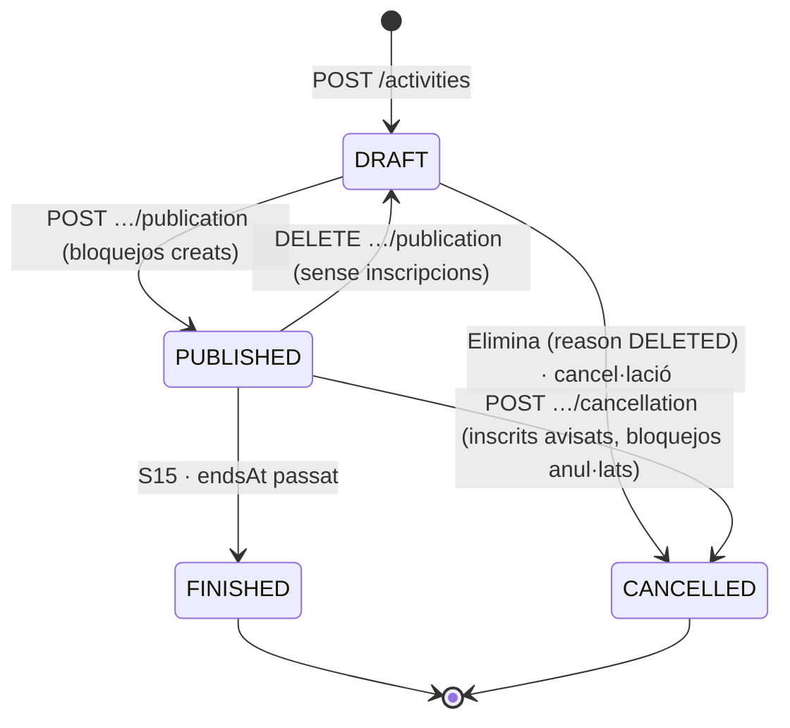
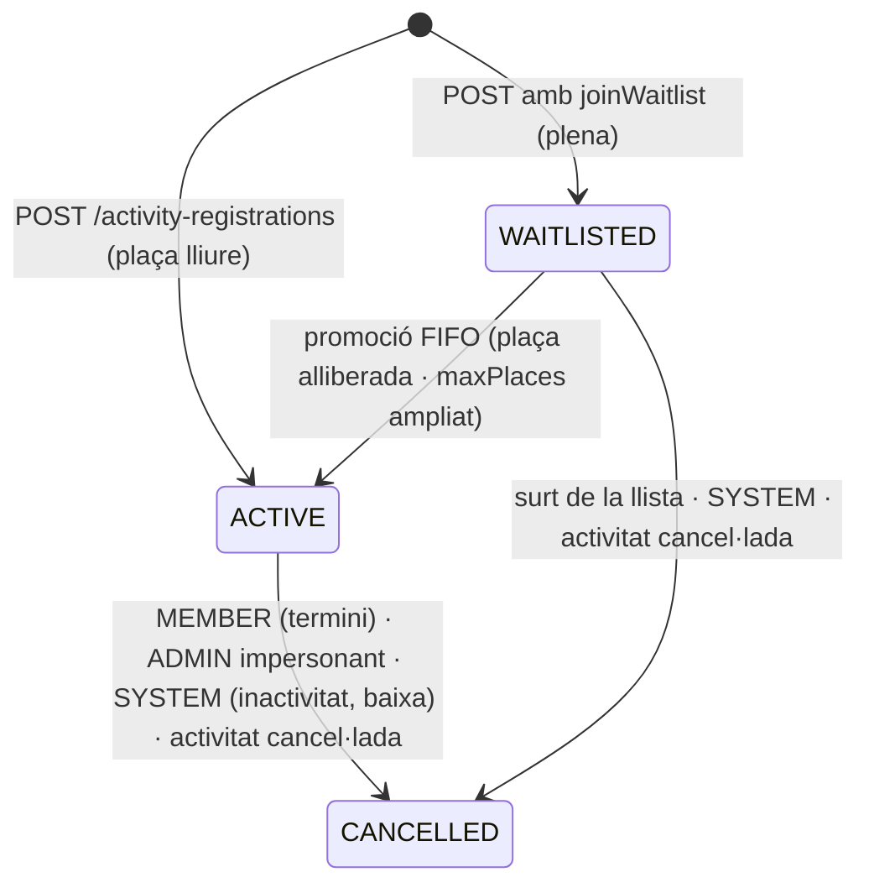

# S07 — Activitats: manteniment (D7), inscripcions, bloqueig de pistes i API pública del web

**Etapa:** E4 (manteniment D7, amb la planificació) + E5 (inscripcions, amb les reserves) · **Mòduls:** `ACTIVITIES` (tota la vertical), `WAITLIST` (llista d'espera de l'activitat sí/no), `COURSES` (col·locacions vinculades a una activitat — punter a S16), `BILLING`/Stripe (fase 2: preus) · **Pantalles:** D7, 04 (bloc ACTIVITATS), 03 (files «inscrita»), 25 (files d'activitat) (fitxers a `03-disseny/mockups/pantalles/`) · **Model:** v1.6 §B BLOQUEIG_PISTA i ACTIVITAT (l. 241–256), §C INSCRIPCIO_ACTIVITAT (l. 316–319) + PLATAFORMA §0 (glossari), §2 (`LocalizedText`), §4 (`UpfrontPayment.concept = ACTIVITY`), §5 (`Placement.activityId`) · **Estat:** esborrany (03-09-2026) · **v0.1**

## 1. Propòsit i abast

Resol com el club **manté** les activitats (seminaris, lligues socials, competicions, demostracions, cursets) a D7, les **publica** i **cancel·la**, com les **pistes vinculades queden bloquejades automàticament** mentre dura l'activitat, com l'abonat **s'hi inscriu per persona** (sense gos) des del bloc ACTIVITATS de 04 amb places i llista d'espera opcional, com la inscripció es veu a 03 («inscrita») i a 25 («feta», «anul·lada», «cancel·lada pel club»), i com les properes activitats s'exposen a l'**API de la web del club** sense cap dada personal. Fase 1: visibilitat només abonats i sense preus (decisió Josep, D7 V2); el model deixa els ganxos (`priceTiers[]`, `UpfrontPayment.concept = ACTIVITY`).

| Fora d'abast | On viu |
|---|---|
| Reserves de classes, `/me/home` i `/me/bookable-classes` (aquí es defineix el servei de consulta que hi aporta les files d'activitat) | S08 |
| Quadres del dia i calendari D4 (aquí es defineix el contingut de la cel·la `ACTIVITY`) · entitat `RingBlock` i `/ring-blocks` | S06 (amb S09) |
| Contingut de col·locacions i recorreguts d'una activitat (`Placement.activityId`) | S16 |
| Preus, tipologies, cobrament anticipat d'activitats (fase 2) | S12 |
| Renderitzat i enviament de N-32a/b/c · pantalla 11 | S11 |
| Finalització automàtica (`finishEnded`) | S15 (contracte al §7) |
| Pantalla 25 i `/me/history` (aquí només les files d'activitat) | S10 |

## 2. Pantalles i rutes

| Mockup | App | Ruta | Rol | Notes de comportament |
|---|---|---|---|---|
| D7 llistat `escriptori/D7-activitats-llistat-i-manteniment.html` | `apps/clubs-admin` | `/activitats` | ADMIN (INSTRUCTOR: lectura) | Títol «Activitats», botó «Nova activitat» (crea un `DRAFT` amb títol i tipus i obre el manteniment). Taula del llistat universal (`GET /activities`, filtre universal amb «Filtre (n)» com D5) amb columnes Activitat («{títol} · {tipus}»; R-07-01), Data (R-07-13: «ds 7 · 18:30–20:30», «ds 12/09 · 9:00–13:00», «dg 4/10»), Pistes («totes — bloquejades» si totes les pistes actives · «{punt de color} Central» · «Muntanya, Central» · «— (fora del club)» · «—»), Inscripcions («22/40 · fins el 6/08» · «obertes · socis» si sense màxim · «—» en esborrany/cancel·lada), Estat (distintiu «esborrany» · «publicada» · «finalitzada» · «cancel·lada»), › obre el manteniment. Ordre per defecte `date desc`; per defecte s'amaguen les eliminades (`deleted:eq:false`). Buit: «Encara no hi ha cap activitat» + botó. Carregant: esquelet. Error: toast per `code` + [Torna-ho a provar]. |
| D7 manteniment (mateix fitxer) | `apps/clubs-admin` | `/activitats/:id` | ADMIN | Targeta «Manteniment de l'activitat — {títol}»: Títol (per idioma actiu), xip de tipus «Competició ▾», Descripció curta, «Descripció llarga (text ric)» (editor R-07-03), imatge («imatge_torneig.jpg», càmera) i documents («normativa.pdf») pujats per URL signada. Targeta «Dates, places i pistes»: «ds 7 d'agost · 18:30–20:30» (data + hores), «Inscripció: de l'1/07 al 6/08» (dues dates), «Places: 40» (buit = sense màxim), xip «Nivells: tots ▾» (multi-selecció; amagat si `levels.enabled=false`), xip «Llista d'espera: sí/no» (només `WAITLIST`), «Pistes vinculades (es bloquegen):» xips de totes les pistes actives (ordre del catàleg; desactivats si el lloc és fora del club), distintiu d'estat + «URL: {url pública} · surt a l'API de la web (mai noms)», [DESA] (`PATCH` amb `version`). **Assumpció (sense mockup):** al costat de [DESA], [PUBLICA] en esborrany, [CANCEL·LA L'ACTIVITAT] en publicada (modal R-07-06), [ELIMINA] en esborrany, i l'enllaç «Inscrits ({n}) ›». En publicar amb conflictes de pista s'obre el diàleg de R-07-05. `FINISHED`/`CANCELLED`: només lectura + `internalNotes`. |
| Inscrits (sense mockup, §13) | `apps/clubs-admin` | `/activitats/:id/inscrits` | ADMIN, INSTRUCTOR | Llistat universal de `GET /activities/{id}/registrations`: Abonat (nom, núm.), Estat («inscrita» · «en llista d'espera (n)» · «anul·lada» · «cancel·lada pel club»), Data d'inscripció, Origen, Contacte; «Excel · PDF». |
| 04 `mobil/04-reservar-activitats-i-classes.html` (bloc «Activitats») | `apps/clubs` | `/reservar` | MEMBER (i IMPERSONATED) | Bloc «Activitats» amb les files de `activities[]` de `GET /me/bookable-classes` (S08; contingut R-07-11): «{títol} · {dia} · {hora}» + distintiu «n places» · «Obertes» (sense màxim; assumpció) · «Completa · ⏳n» (`WAITLIST` i llista activada) · «Completa» (inerta). Tocar una fila → detall (fila següent). Bloc absent sense `ACTIVITIES` o sense cap activitat oberta. Bloqueig de reserves: files inertes sota el bàner de S08. |
| Detall d'activitat (sense mockup, §13) | `apps/clubs` | `/activitats/:id` | MEMBER (i IMPERSONATED) | `GET /me/activities/{id}`: imatge, títol, tipus, «{dia} · {hores}», lloc o pistes, descripció curta, descripció llarga (HTML sanejat), documents (URL signada), «Inscripció fins el {data}», places. Botó segons `myRegistration`/`rowState`: [INSCRIU-M'HI] (`POST /activity-registrations`), [APUNTA'M A LA LLISTA D'ESPERA] (diàleg «Vols apuntar-te a la llista d'espera de {títol}?» → `joinWaitlist: true` → toast «Ets a la llista d'espera»), [ANUL·LA LA INSCRIPCIÓ] / [SURT DE LA LLISTA D'ESPERA] (diàleg de confirmació → `POST …/cancellation`); fora de termini, text «Per anul·lar la inscripció, posa't en contacte amb el club» (assumpció). Errors 409/422 → missatge per `code` i refetch. |
| 03 `mobil/03-inici-abonat.html` | `apps/clubs` | `/inici` | MEMBER | Files `type=ACTIVITY` de `reservations[]` (S08): «{títol}» + distintiu «inscrita» / «en llista d'espera»; segona línia «{Dia} · {hores} · {lloc}» («totes les pistes», noms de pista o lloc). Mai nom de gos. › → detall. |
| 25 `mobil/25-historic-classes-entrenaments-i-activitats.html` | `apps/clubs` | `/historic` | MEMBER | Files d'activitat de `/me/history` (S10, contracte R-07-11): «{d} {dd/mm}» + «{títol}» + «feta» · «anul·lada» · «cancel·lada pel club» (+ línia «{admin_text}» entre cometes) — sense gos. Xip «Activitats» = `type=ACTIVITY`. Les files d'activitat no depenen del gos triat (assumpció). |
| 10 · 23 · D4 (S06) | ambdues | — | tots | Cel·la `ACTIVITY` (R-07-11): «Activitat · {títol}» per a tothom; INSTRUCTOR/ADMIN amb enllaç a D7. |

## 3. Entitats i camps

Context `clubs/activities`. Tot amb `clubId` (`TenantRepository`), `id` UUID, `version`, `createdAt/By`, `updatedAt/By`. Res s'esborra físicament.

**`Activity` · `activities`** — índexs `{clubId, slug}` únic, `{clubId, state, startsAt}`, `{clubId, date}`

| Camp | Tipus | Oblig. | Validació · notes |
|---|---|---|---|
| `title` | LocalizedText ≤ 80 | sí | `defaultLocale` obligatori; només claus de `club.locales` (400 `LOCALE_NOT_ENABLED`) |
| `type` | enum `SEMINAR` · `SOCIAL_LEAGUE` · `COMPETITION` · `DEMONSTRATION` · `COURSE` · `OTHER` | sí | tipus de producte (R-07-01); etiqueta a `enums:activityType.*` |
| `typeLabel` | LocalizedText ≤ 30 | no | etiqueta lliure del club; si existeix, substitueix l'etiqueta de l'enum a tot arreu |
| `shortDescription` | LocalizedText ≤ 160 | no | text pla |
| `longDescription` | LocalizedText ≤ 20 000 | no | HTML restringit (R-07-03); es desa sanejat |
| `image` | `{fileId, fileKey, name ≤ 80, mimeType, sizeBytes}` | no | una sola; `mimeType` `image/*` ∈ `files.allowedTypes`; ≤ `files.maxSizeMb` |
| `documents[]` | `[{id, fileKey, name ≤ 80, mimeType, sizeBytes, uploadedAt}]` ≤ 10 | no | tipus de `files.allowedTypes`; el nom es demana en pujar |
| `location` | `{atClub: bool, name ≤ 80?, address ≤ 200?, url?}` | sí | `atClub=false` ⇒ `ringIds` buit i `name` obligatori |
| `ringIds[]` | id[] | no | pistes **actives** del catàleg, sense repetits; només amb `atClub` |
| `date`, `startTime`, `endTime` | date, HH:mm?, HH:mm? | `date` sí | hora local del club (R-07-13); `startTime < endTime`; ambdues obligatòries si `ringIds` no és buit i alineades a `classes.slotMinutes` (400 `INVALID_SLOT_GRANULARITY`) |
| `startsAt`, `endsAt` | instants | derivats | `endsAt` = `endTime` o fi del dia local si no n'hi ha |
| `ringBlockWindow` | `{fromTime, toTime}` | no | finestra de bloqueig si és més àmplia que l'activitat (muntatge/desmuntatge); ha de contenir `[startTime, endTime]`; per defecte = l'activitat (assumpció) |
| `registrationFrom`, `registrationTo` | date, date | sí per publicar | `from ≤ to ≤ date`; instants derivats `registrationOpensAt` = `from` 00:00 local, `registrationClosesAt` = `to` + 1 dia 00:00 local (exclusiu) |
| `minPlaces`, `maxPlaces` | int?, int? | no | `1 ≤ min ≤ max`; `maxPlaces = null` = sense màxim («obertes»); `minPlaces` només informatiu (`belowMinimum` a lectura) |
| `levelIds[]` | id[] | no | buit = tots; ignorat i buidat si `levels.enabled=false`; nivells actius |
| `waitlistEnabled` | bool | sí (false) | forçat `false` sense `WAITLIST` |
| `visibility` | enum `MEMBERS` (fase 2: `PUBLIC`) | sí | fase 1 només `MEMBERS` (400 altrament) |
| `priceTiers[]` | `[]` | — | ganxo fase 2 (S12): sempre buit a R1 |
| `slug` | string `^[a-z0-9]+(-[a-z0-9]+)*$` 3–80 | sí | únic per club (409 `DUPLICATE_SLUG`); R-07-02 |
| `state` | `DRAFT` · `PUBLISHED` · `FINISHED` · `CANCELLED` | sí | §5 |
| `publishedAt/By`, `finishedAt`, `cancellation` | instant, instant, `{reason: CLUB_MANUAL · DELETED, adminText?, at, byAccountId, affectedCount}` | segons estat | el text és el que rep l'inscrit |
| `counters` | `{active, waiting}` | sí (0,0) | desnormalitzats; es mantenen dins la transacció d'inscripció (R-07-08) |
| `internalNotes` | string ≤ 1000 | no | només ADMIN |
| `placementIds[]` (lectura) | id[] | — | `COURSES`: col·locacions amb `activityId` (S16); aquí no s'escriu |

**`ActivityRegistration` · `activity_registrations`** — índexs `{clubId, activityId, memberId}` **únic parcial** sobre `state ∈ {ACTIVE, WAITLISTED}`, `{clubId, memberId, activityStartsAt, state}`, `{clubId, activityId, state, position}`

| Camp | Tipus | Oblig. | Validació · notes |
|---|---|---|---|
| `activityId`, `memberId` | id, id | sí | **per persona, sense gos** (R13-08); `memberId` = l'abonat del JWT o l'impersonat |
| `state` | `ACTIVE` · `WAITLISTED` · `CANCELLED` | sí | §5 |
| `origin` | `APP` · `BACKOFFICE` | sí | R-07-10 |
| `registeredAt`, `registeredBy {accountId, impersonatedMemberId?, displayName}` | | sí | |
| `position` | int? | si `WAITLISTED` | `max + 1` a l'alta; ordre de promoció (R-07-08) |
| `promotedAt` | instant? | no | pas `WAITLISTED → ACTIVE` |
| `cancelledAt`, `cancelledBy {accountId, role: MEMBER · ADMIN · SYSTEM}`, `cancelReason` | | si `CANCELLED` | `cancelReason`: `MEMBER` · `ACTIVITY_CANCELLED` · `INACTIVITY` · `MEMBER_LEFT` · `ADMIN` |
| `activityStartsAt` | instant | sí | desnormalitzat per a 03/25 i inactivitat; es refresca amb `ActivityUpdated{startsAt}` |
| `upfrontPaymentId` | id? | no | ganxo fase 2 |

Altres agregats: **llegeix** `Member.status/leaveDate/bookingBlock`, `Dog.levelId/status/memberId`, `Level`, `Ring`, `InactivityPeriod`, `ClassSession`, `TrainingBooking`, `Club.publicApiKey/websiteUrl/locales/timeZone`; **escriu** `RingBlock` (només via `RingBlockService`, R-07-05).

## 4. Regles de negoci

**R-07-01 · Tipus, títol i camps.** `type` és un enum de producte amb etiqueta traduïda (`ca`: seminari · lliga social · competició · demostració · curset · altres); `typeLabel` permet una etiqueta lliure per club. El llistat mostra «{títol} · {etiqueta}». Crear (`POST`) només exigeix `title` i `type`; la resta es completa al manteniment i es valida en **publicar** (R-07-04: 422 `ACTIVITY_INCOMPLETE {fieldErrors[]}`). Fora del club (`atClub=false`) no s'admeten pistes (400 `VALIDATION_ERROR`, camp `ringIds`). *Exemple:* «Demostració Festa Major», `DEMONSTRATION`, `date` 2026-10-04 sense hores, fora del club → esborrany vàlid («dg 4/10 · — (fora del club)»); en publicar-la sense `registrationFrom/To` → 422 `ACTIVITY_INCOMPLETE`.

**R-07-02 · Slug i URL pública.** En crear, `slug` = transliteració del `title[defaultLocale]` (minúscules, sense accents, `-`), amb sufix `-2`, `-3`… si ja existeix; editable mentre `DRAFT`; **immutable** des de la primera publicació (409 `SLUG_LOCKED`) perquè la URL pot estar enllaçada. URL mostrada a D7 i retornada a l'API = `activities.publicUrlTemplate` (§13; per defecte `{websiteUrl}/activitat/{slug}`). *Exemple:* «Torneig d'Estiu 2026» → `torneig-estiu-2026`; un segon amb el mateix títol → `torneig-estiu-2026-2`.

**R-07-03 · Text ric.** `longDescription` s'accepta com a HTML i es **saneja al back** (OWASP Java HTML Sanitizer) amb la llista blanca: `p, br, strong, em, u, s, h3, h4, ul, ol, li, blockquote, a[href]`; `href` només `http(s):` o `mailto:` (s'afegeix `rel="noopener" target="_blank"`); tot altre element o atribut (imatges, estils, scripts, classes, `id`) s'elimina sense error. Es desa el resultat sanejat i es retorna tal qual (`longDescriptionHtml`) més una versió en text pla (`longDescriptionText`, ≤ 500 caràcters) per a la web. L'editor de D7 només ofereix aquests elements. *Exemple:* `<p onclick="x()">Cal <b>portar</b>  la cartilla</p>` → `<p>Cal <strong>portar</strong> la cartilla</p>`.

**R-07-04 · Cicle de vida.** `DRAFT` (edició lliure, invisible per als abonats i per a la web) → **publicar** (`POST …/publication`): exigeix `title`, `date`, `registrationFrom/To`, `location` vàlida, hores si hi ha pistes (422 `ACTIVITY_INCOMPLETE`), `date ≥ avui` local (422 `ACTIVITY_IN_PAST`) i la sincronització de bloquejos (R-07-05); efectes: `PUBLISHED`, `publishedAt`, `ActivityPublished{notifyEmail}` (N-32a). **Editar** una `PUBLISHED` (`PATCH`, `version`): tots els camps llevat de `slug`; si el diff toca `date`, hores, `ringIds`, `ringBlockWindow` o `atClub`, la mateixa transacció resincronitza els bloquejos; `maxPlaces < counters.active` → 422 `CAPACITY_BELOW_REGISTRATIONS` (assumpció: no s'expulsa ningú). **Despublicar** (`DELETE …/publication`): només sense inscripcions vives (409 `ACTIVITY_HAS_REGISTRATIONS`) → `DRAFT`, bloquejos anul·lats, desapareix de 04 i de la web. **Eliminar** un `DRAFT` ([ELIMINA]) → `CANCELLED{reason: DELETED}` sense avisos (mai esborrat físic). **Finalitzar**: S15 (`finishEnded(now)`) passa `PUBLISHED` amb `endsAt < now` a `FINISHED` + `ActivityFinished`; les inscripcions `ACTIVE` queden com a «feta». `FINISHED`/`CANCELLED`: només `internalNotes` (409 `INVALID_STATE`). *Exemple:* el Seminari de handling es publica el 20/08 amb inscripció 1–6/09: surt a la web des del 20/08 i a 04 només de l'1 al 6/09.

**R-07-05 · Bloqueig automàtic de pistes** (contracte compartit amb S06 R-06-11 i S09 R-09-11/13). Només una activitat `PUBLISHED` bloqueja: per a cada `ringId`, un `RingBlock{kind: BLOCK, reason: ACTIVITY, activityId, from, to, createdByAccountId = qui publica}` amb `[from, to]` = `date` + `ringBlockWindow` (o `[startTime, endTime]`) al fus del club, dins `club.openingHours` (422 `OUTSIDE_OPENING_HOURS`), durada ≥ `training.slotMinutes`. `RingBlockService.syncForActivity(activity, options)` s'executa **síncronament dins la transacció** de publicació/edició: crea els que falten (`RingBlockCreated`), mou els que canvien de finestra (`RingBlockUpdated`, proposat a S06/S09), anul·la els de pistes que ja no hi són (`RingBlockCancelled`). Conflictes, per pista: `ClassSession` `DRAFT`/`ACTIVE` o un altre `RingBlock` `ACTIVE` solapat → 409 `RING_BLOCK_CONFLICT {conflicts[{ringId, type: CLASS · RING_BLOCK, id, from, to, label, bookedCount}]}`; `TrainingBooking` `ACTIVE` solapada (`TrainingConflictService.findActiveBookings`) → 409 `RING_HAS_BOOKINGS {bookings[]}`. L'ADMIN pot forçar amb `options {cancelBookings: true}` (reserves d'entrenament → `CANCELLED_BY_CLUB{RING_BLOCK}`, avís de S09) i `{cancelClasses: true, adminText}` (cada classe en conflicte s'anul·la amb `ClassCancellationUseCase.cancel(classId, ACTIVITY, adminText)` de S06 → N-08a als inscrits; `adminText` obligatori si alguna té inscrits o espera: 422 `ADMIN_TEXT_REQUIRED`); `GET …/ring-conflicts` retorna la vista prèvia per al diàleg. Tot o res. Els bloquejos amb `activityId` **no** s'editen ni s'anul·len per `/ring-blocks` (409 `RING_BLOCK_MANAGED_BY_ACTIVITY`) i s'anul·len amb la cancel·lació, la despublicació o en treure la pista. Un esborrany mai bloqueja (§13). *Exemple:* Torneig ds 7/08 18:30–20:30 amb les 5 pistes; a Central hi ha la classe de dissabte 18:30 amb 3 inscrits i a Muntanya la reserva d'entrenament de Pau + Blat de 19:00 → 409 amb els dos conflictes; l'admin envia `{cancelClasses: true, adminText: «Dissabte 7 fem el Torneig d'Estiu: la classe queda anul·lada…», cancelBookings: true}` → 5 bloquejos creats, classe `CANCELLED{ACTIVITY}` + N-08a a 3 alumnes, entrenament cancel·lat pel club. Els dilluns següents la setmana generada per S06 marcarà `RING_BLOCKED` si una classe caigués dins la finestra.

**R-07-06 · Cancel·lació d'una activitat** (`POST …/cancellation`). Estats `DRAFT`/`PUBLISHED` (409 `INVALID_STATE`); `adminText` (1–500) obligatori si `counters.active + waiting > 0` (422 `ADMIN_TEXT_REQUIRED`). **Transacció única**: activitat → `CANCELLED{reason, adminText, affectedCount}`; cada inscripció `ACTIVE`/`WAITLISTED` → `CANCELLED{ACTIVITY_CANCELLED, by: SYSTEM}`; bloquejos → `RingBlockService.cancelForActivity`; `counters` a 0; `ActivityCancelled{adminText, affected[{registrationId, memberId, state}]}`. El dispatcher envia **N-32c** (app + correu + SMS: acció del club sobre una acció de l'abonat) a cada afectat, també als de la llista d'espera. Modal D7 (`GET …/cancellation-preview`, patró D4c): «Aquesta activitat té {n} inscrits. Si la cancel·les, rebran un avís a l'app, per correu i per SMS amb el text que escriguis a sota.» + llista (nom · estat · canals) + «Text de l'avís» + [CANCEL·LA I AVISA ELS {n} INSCRITS] (literals assumits). *Exemple:* Torneig amb 22 inscrits i 3 en espera → 25 `CANCELLED`, 25 N-32c amb `[[admin_text]]` = «Pluja forta: pistes tancades», 5 bloquejos anul·lats.

**R-07-07 · Qui es pot inscriure.** Ordre de comprovació (servei `ActivityEligibility.check(member, activity, dogId?)`): (1) activitat `PUBLISHED` (invisible → 404; `FINISHED`/`CANCELLED` → 409 `ACTIVITY_NOT_PUBLISHED`); (2) període: `registrationOpensAt ≤ now < registrationClosesAt` (409 `REGISTRATION_CLOSED {reason: NOT_YET_OPEN · CLOSED, opensAt, closesAt}`); (3) `Member.status = ACTIVE` i membresia activa (422 `MEMBER_NOT_ACTIVE`); baixa amb data futura: `startsAt ≥ leaveDate` → 422 `MEMBER_NOT_ACTIVE {reason: LEAVING}`; (4) `MemberBookingEligibility` de S03: `bookingBlock.active` de l'abonat inscrit **o** de qui actua → 422 `BOOKING_BLOCKED {reason, since}` (R-03-04: «cap reserva nova de classe, entrenament ni activitat»); (5) amb `INACTIVITY`: `date` dins un `InactivityPeriod` `APPROVED`/`ACTIVE` de l'abonat → 422 `INACTIVITY_PERIOD {from, to}` (BR-16: compta la data de la sessió); (6) nivell: amb `levels.enabled` i `levelIds` no buit, l'abonat és **admès** si té ≥ 1 `Dog` propi `ACTIVE` amb `levelId ∈ levelIds` (409 `LEVEL_NOT_ALLOWED`); sense nivells o `levelIds` buit, tothom; (7) sense inscripció viva del mateix abonat (409 `ALREADY_REGISTERED`; índex únic parcial). L'anul·lació d'una inscripció **no** passa per (4) ni (5). *Exemple:* Laura (Duna C, Rock D) es pot inscriure a una activitat «Nivells: D, E»; Joan Antoni (Toby B) rep `LEVEL_NOT_ALLOWED`; Marc, amb reserves bloquejades per «rebut de juliol impagat», rep `BOOKING_BLOCKED` però pot anul·lar la que ja tenia.

**R-07-08 · Places, concurrència i llista d'espera.** `POST /activity-registrations {activityId, joinWaitlist?}` amb `Idempotency-Key` és **una transacció Mongo** que (1) fa `findOneAndUpdate` sobre l'`Activity` (`$inc: {registrationSeq: 1}`): dues transaccions concurrents sobre la mateixa activitat entren en `WriteConflict` i la perdedora es reintenta (≤ 3, backoff 50–150 ms) veient l'estat nou; (2) aplica R-07-07; (3) si `maxPlaces = null` o `counters.active < maxPlaces` → `ACTIVE`; si no, amb `WAITLIST` i `waitlistEnabled` → `WAITLISTED{position}` **només** si el client ha enviat `joinWaitlist: true` (altrament 409 `ACTIVITY_FULL {waitlistAvailable: true, waiting}`); sense llista → 409 `ACTIVITY_FULL {waitlistAvailable: false}`; (4) insereix (l'índex únic parcial és la guarda final), actualitza `counters`, emet `ActivityRegistrationChanged{state}`. Sense límit per abonat ni per activitat a la llista d'espera (assumpció). **Promoció**: quan una `ACTIVE` passa a `CANCELLED` mentre l'abonat encara podria inscriure's (mateix termini que R-07-09), dins la mateixa transacció la `WAITLISTED` amb `position` mínima passa a `ACTIVE{promotedAt}` (`ActivityRegistrationChanged{state: ACTIVE, promoted: true}` → N-32b); fora de termini la plaça queda lliure i el club la gestiona a mà. Un `PATCH` que augmenta `maxPlaces` promou tantes com places noves, per ordre. *Exemple:* 40 places, 40 actives, 3 en espera; dues persones toquen alhora [INSCRIU-M'HI] a la plaça 40: una `ACTIVE`, l'altra `ACTIVITY_FULL{waitlistAvailable: true}` i, en confirmar el diàleg, `WAITLISTED` posició 4; l'endemà una anul·lació promou la posició 1.

**R-07-09 · Anul·lació per l'abonat i baixes de sistema.** `POST /activity-registrations/{id}/cancellation` sobre `ACTIVE`/`WAITLISTED` (409 `INVALID_STATE` altrament) mentre `now <` termini de `activities.cancelDeadline` (§13; `REGISTRATION_CLOSE` → `registrationClosesAt` · `EVENT_START` → `startsAt`); després → 409 `REGISTRATION_NOT_CANCELLABLE {deadline}`. Sortir de la llista d'espera: sempre fins a `startsAt`. Amb impersonació, l'ADMIN pot anul·lar fins a `startsAt` (`cancelReason: ADMIN`, `reason` obligatori, auditat). Sistema: `InactivityResolved{APPROVED}` amb `inactivity.cancelBookingsOnApproval` → inscripcions amb `date` dins l'interval → `CANCELLED{INACTIVITY}` (N-32b); `MemberStatusChanged{after: LEFT · SUSPENDED}` → futures → `CANCELLED{MEMBER_LEFT}` sense avís. Paràmetre Cànic: `activities.cancelDeadline = REGISTRATION_CLOSE`. *Exemple:* Torneig ds 7/08, inscripció fins al 6/08: la Laura pot anul·lar fins al 6/08 23:59 local; el 7/08 a les 9:00 rep `REGISTRATION_NOT_CANCELLABLE`; el club, «com l'abonat», sí que pot.

**R-07-10 · Origen, impersonació i auditoria.** Token normal → `origin=APP`; token d'impersonació → `origin=BACKOFFICE`, `registeredBy/cancelledBy` amb els dos ids i `AuditEntry` (actor + suplantat). Els endpoints d'inscripció **rebutgen** `ADMIN`/`INSTRUCTOR` sense impersonar (403); els d'ADMIN rebutgen tokens d'impersonació (403). Tota mutació d'`Activity` per l'ADMIN escriu `AuditEntry` amb `before/after` dels camps canviats. Notificació: `APP` → N-32b (app); `BACKOFFICE` → N-32b amb canals de `CLUB_CHANGES` (app + correu + SMS; proposta §13). *Exemple:* l'admin inscriu la Montse des de D10 «Entra com l'abonat» → inscripció `BACKOFFICE`, auditoria «inscripció a Torneig d'Estiu (admin Jordi com Montse)», avís amb SMS.

**R-07-11 · Què veu cadascú** (`ActivityQueryService`, consumit per S08/S10/S06):
- `bookableFor(memberId, dogId?)` (04): activitats `PUBLISHED` amb `registrationOpensAt ≤ now < registrationClosesAt`, sense inscripció viva de l'abonat, admeses (R-07-07.6) per al **gos seleccionat** si `dogId` (S08 R-08-22) o per a qualsevol gos propi si no; ordenades per `startsAt`. Fila: `{id, title, typeLabel, startsAtLocal, endsAtLocal, placeLabel, rowState, freeSeats, waiting, waitlistEnabled}` amb `rowState ∈ OPEN · FULL_WAITLIST · FULL · NOT_BOOKABLE{reason}` → distintius «n places» · «Obertes» (`freeSeats = null`) · «Completa · ⏳{waiting}» · «Completa» (inerta) · inerta amb bàner.
- `liveRegistrationsFor(memberId)` (03): `ACTIVE`/`WAITLISTED` amb `endsAt > now` → `{type: ACTIVITY, id: registrationId, activityId, state: REGISTERED · WAITLISTED, title, startsAtLocal, endsAtLocal, ringName: placeLabel, dogId: null}` (S08 `reservations[]`).
- `historyRowsFor(memberId, from, to)` (25): inscripcions amb `activityStartsAt` dins `[from, to]` (S10 aplica `history.monthsVisible`) i estat de visualització: `ACTIVE` + activitat `FINISHED` → «feta»; `CANCELLED{MEMBER, ADMIN}` → «anul·lada» («Per tu, el {data}» / «Pel club»); `CANCELLED{ACTIVITY_CANCELLED}` → «cancel·lada pel club» + «{admin_text}»; `INACTIVITY`/`MEMBER_LEFT` → «anul·lada». Les `WAITLISTED` no surten a l'històric.
- `titles(activityIds, locale)` (S06): resol `title` per a la cel·la `ACTIVITY` del quadre i del calendari: `{ringId, kind: "ACTIVITY", blockId, activityId, title, endTime}` a `view=member` i `view=instructor` (S06 Forma D); D4 afegeix `activityTitle` als `ringBlocks[]` amb `reason=ACTIVITY`. Es mostra «Activitat · {títol}» a tothom, una cel·la per pista bloquejada; els abonats no admesos també la veuen.
- `placeLabel`: `atClub=false` → `location.name`; `ringIds` = totes les actives → «totes les pistes» (i18n); si no, `Ring.name` units amb «, ». Amb `ACTIVITIES` off, tots els mètodes retornen buit.
*Exemple:* la Duna (C) veu el «Seminari de handling · ds 12/09 · 9:00 · 6 places» (nivells tots); amb en Rock (D) seleccionat també; el «Torneig» ja inscrit no surt a 04 i sí a 03 «Dissabte 7 · 18:30–20:30 · totes les pistes · inscrita».

**R-07-12 · API pública del web.** `GET /public/{clubSlug}/activities` (ANON, `X-Api-Key = Club.publicApiKey` → 401 `INVALID_API_KEY`, com S05 R-05-21) llista `PUBLISHED` amb `endsAt ≥ now` ordenades per `startsAt` (`?scope=past` → `FINISHED` dels 12 mesos anteriors); `GET …/activities/{slug}` retorna una `PUBLISHED`/`FINISHED`/`CANCELLED` (`DRAFT` → 404). Camps (Forma C): `slug, state, type, typeLabel, title, shortDescription, longDescriptionHtml, longDescriptionText` (resolts per `Accept-Language ∩ club.locales` **i** mapes `*I18n`), `imageUrl, documents[{name, url}]`, `location`, `ringNames[]`, `date, startTime, endTime, timeZone`, `registration {from, to, open: bool, channel: "APP"}`, `places {max, free, waitlist}` (`free = null` sense màxim), `levels[]` (noms), `publicUrl`. **Mai** cap camp d'inscrit ni recompte identificable (`counters.active` només com a `free`). Fitxers: `GET …/activities/{slug}/files/{fileId}` (ANON, sense clau, només estats públics) → 302 a URL signada de 15 min; `imageUrl`/`documents[].url` apunten aquí. Cache: `Cache-Control: public, max-age=300` + `ETag`; cache de servidor per `clubSlug` invalidada pels esdeveniments `Activity*`; rate limit per IP. `ACTIVITIES` off → 404 `MODULE_DISABLED`. *Exemple:* la web del Cànic en castellà demana `/public/canic/activities` amb `Accept-Language: es` → «Torneo de Verano 2026 · 18 plazas libres · inscripción hasta el 6/08».

**R-07-13 · Temps local, UTC i formats.** `date`, `startTime`, `endTime`, `registrationFrom/To` són l'única font (fus `CLUB.timeZone`, R-06-14); els instants es deriven amb `ZonedDateTime` i serveixen per a ordenar, terminis, bloquejos i `finishEnded`. Període d'inscripció: obre a les 00:00 locals de `from` i tanca a les 00:00 locals de l'endemà de `to`. Formats de la UI: D7 llistat i 04 «{dia curt} {d}» si el mes és l'actual, si no «{dia curt} {d}/{mm}», seguit de « · {hh:mm}[–{hh:mm}]» quan hi ha hores (hores sense zero inicial); manteniment «ds 7 d'agost · 18:30–20:30»; 03 «Dissabte 7 · 18:30–20:30»; 25 «ds 12/07». *Exemple (Europe/Madrid):* Torneig 07-08-2026 18:30 → `16:30Z`; inscripció 01/07–06/08 → obre `2026-06-30T22:00Z`, tanca `2026-08-06T22:00Z`; la mateixa activitat en un club a `America/Argentina/Buenos_Aires` → `21:30Z` i tancament `2026-08-07T03:00Z`.

**R-07-14 · Variants per club.**

| Variant | Efecte |
|---|---|
| `ACTIVITIES` off | tots els endpoints del §6 (també `/public/*/activities`) → 404 `MODULE_DISABLED`; D7 i el menú «Activitats» amagats; cap bloc a 04, cap fila a 03/25; cap cel·la `ACTIVITY` ni `reason=ACTIVITY` (S06 R-06-15); S15 no finalitza res; les dades es conserven |
| `WAITLIST` off | `waitlistEnabled` forçat `false` (el `PATCH` l'ignora), xip amagat; activitats plenes → «Completa» inerta, `joinWaitlist` → 409 `ACTIVITY_FULL{waitlistAvailable: false}` |
| `levels.enabled = false` | `levelIds` buidat, xip «Nivells» amagat, R-07-07.6 admet tothom, N-32a a tots els abonats actius |
| `INACTIVITY` off | sense comprovació R-07-07.5 ni consum d'`InactivityResolved` |
| `SMS` off | N-32c/N-32b (`BACKOFFICE`) sense canal SMS (`SKIPPED_MODULE_OFF`) |
| `FREE_TRAINING` off | cap `RING_HAS_BOOKINGS` (S09 no té reserves) |
| `COURSES` off | `placementIds[]` absent |

## 5. Estats i transicions



| Transició | Qui | Condició | Efectes | Esdeveniment |
|---|---|---|---|---|
| → DRAFT | ADMIN | `title`, `type` | `slug` generat | `ActivityUpdated{created}` |
| DRAFT → PUBLISHED | ADMIN | R-07-04, R-07-05 | `RingBlock` per pista, visible a 04/web | `ActivityPublished`, `RingBlockCreated`… |
| PUBLISHED (edit) | ADMIN | `version`; resync si toca dates/pistes | bloquejos ajustats; promocions si puja `maxPlaces` | `ActivityUpdated{diff}`, `RingBlock*` |
| PUBLISHED → DRAFT | ADMIN | `counters = (0,0)` | bloquejos anul·lats | `ActivityUpdated{state}`, `RingBlockCancelled` |
| DRAFT/PUBLISHED → CANCELLED | ADMIN | R-07-06 | inscripcions `CANCELLED`, bloquejos anul·lats, N-32c | `ActivityCancelled` |
| PUBLISHED → FINISHED | S15 | `endsAt < now` | «feta» a 25; web `scope=past` | `ActivityFinished` |



| Transició | Qui | Condició | Efectes | Esdeveniment |
|---|---|---|---|---|
| → ACTIVE | MEMBER (APP/BACKOFFICE) | R-07-07, plaça | `counters.active + 1` | `ActivityRegistrationChanged{ACTIVE}` (N-32b) |
| → WAITLISTED | MEMBER | R-07-07, plena, `joinWaitlist` | `position`, `counters.waiting + 1` | `ActivityRegistrationChanged{WAITLISTED}` (N-32b) |
| WAITLISTED → ACTIVE | sistema (dins la transacció d'alliberament) | dins termini R-07-09 | `promotedAt`, comptadors | `ActivityRegistrationChanged{ACTIVE, promoted}` (N-32b) |
| ACTIVE/WAITLISTED → CANCELLED | MEMBER · ADMIN · SYSTEM · S07 (cancel·lació) | R-07-09 / R-07-06 | comptadors; promoció si escau | `ActivityRegistrationChanged{CANCELLED, cancelReason}` (N-32b només MEMBER/ADMIN/INACTIVITY); dins `ActivityCancelled` per a `ACTIVITY_CANCELLED` |

## 6. API

Base `CONVENCIONS_API.md`; totes les rutes de club porten `@RequiresModule("ACTIVITIES")`; tenant del JWT; `I` = accepta `Idempotency-Key`. `MEMBER` inclou `IMPERSONATED`.

| Mètode | Ruta | Rol(s) | Mòdul | I | Descripció | Cos/paràmetres clau | Respostes i errors |
|---|---|---|---|---|---|---|---|
| GET | `/activities` | ADMIN, INSTRUCTOR | ACTIVITIES | sí | llistat universal D7 | `q` (títol), `x-filterable`: `state, type, date, ringId, levelId, deleted, registrationOpen`; `x-sortable`: `date, title, state, createdAt`; columnes `title*, date*, rings*, registrations*, state*, type, slug, registrationTo` | 200 llistat estàndard; 400 `INVALID_FILTER` |
| GET | `/activities/filter-values` · `/activities/export` | ADMIN (export), +INSTRUCTOR (values) | ACTIVITIES | sí | com S03 R-03-22/24 | `field=` · `format=xlsx\|pdf` | 200 · 202 `{jobId}` |
| POST | `/activities` | ADMIN | ACTIVITIES | no | «Nova activitat» | `{title, type}` | 201 activitat `DRAFT` (Forma A); 400 |
| GET | `/activities/{id}` | ADMIN, INSTRUCTOR | ACTIVITIES | sí | fitxa de manteniment | — | 200 Forma A (INSTRUCTOR sense `internalNotes`); 404 |
| PATCH | `/activities/{id}` | ADMIN | ACTIVITIES | sí | [DESA] | camps del §3 + `version` (+ `cancelBookings?`, `cancelClasses?`, `adminText?` si resincronitza) | 200; 400 `VALIDATION_ERROR`/`INVALID_SLOT_GRANULARITY`/`INVALID_TIME_RANGE`; 409 `STALE_VERSION`/`SLUG_LOCKED`/`DUPLICATE_SLUG`/`INVALID_STATE`/`RING_BLOCK_CONFLICT`/`RING_HAS_BOOKINGS`; 422 `CAPACITY_BELOW_REGISTRATIONS`/`OUTSIDE_OPENING_HOURS`/`ADMIN_TEXT_REQUIRED` |
| PUT / DELETE | `/activities/{id}/image` | ADMIN | ACTIVITIES | sí | imatge (després de `POST /attachments/upload-url {purpose: ACTIVITY_IMAGE}`) | `{fileKey, name}` | 200 `{image}` / 204; 400 `FILE_TOO_LARGE`/`FILE_TYPE_NOT_ALLOWED` |
| POST / DELETE | `/activities/{id}/documents` · `…/documents/{docId}` | ADMIN | ACTIVITIES | per `fileKey` | documents (`purpose: ACTIVITY_DOCUMENT`) | `{fileKey, name}` | 201 / 204; 400 idem; 422 `TOO_MANY_DOCUMENTS` |
| GET | `/activities/{id}/ring-conflicts` | ADMIN | ACTIVITIES | sí | vista prèvia del diàleg de R-07-05 | — | 200 `{conflicts[], trainingBookings[]}` |
| POST | `/activities/{id}/publication` | ADMIN | ACTIVITIES | per estat + `Idempotency-Key` | [PUBLICA] | `{notifyEmail?: bool, cancelBookings?, cancelClasses?, adminText?}` | 200 Forma A; 409 `INVALID_STATE`/`RING_BLOCK_CONFLICT`/`RING_HAS_BOOKINGS`; 422 `ACTIVITY_INCOMPLETE`/`ACTIVITY_IN_PAST`/`OUTSIDE_OPENING_HOURS`/`ADMIN_TEXT_REQUIRED` |
| DELETE | `/activities/{id}/publication` | ADMIN | ACTIVITIES | per estat | despublicar | — | 200 Forma A; 409 `INVALID_STATE`/`ACTIVITY_HAS_REGISTRATIONS` |
| GET | `/activities/{id}/cancellation-preview` | ADMIN | ACTIVITIES | sí | modal de R-07-06 | — | 200 `{registrations[{registrationId, memberName, state, channels[], phoneCount}], activeCount, waitingCount}` |
| POST | `/activities/{id}/cancellation` | ADMIN | ACTIVITIES | per estat + `Idempotency-Key` | [CANCEL·LA I AVISA…] · [ELIMINA] | `{reason: CLUB_MANUAL\|DELETED, adminText?}` | 200 Forma A; 409 `INVALID_STATE`; 422 `ADMIN_TEXT_REQUIRED` |
| GET | `/activities/{id}/registrations` (+ `/export`) | ADMIN, INSTRUCTOR | ACTIVITIES | sí | llistat universal d'inscrits | `x-filterable`: `state, origin, registeredAt, memberId`; `x-sortable`: `registeredAt, position, memberLastName` | 200 `{items[{registrationId, member{id, fullName, memberNumber, phones, emails}, state, position, origin, registeredAt, cancelledAt, cancelReason}]}` |
| POST | `/activity-registrations` | MEMBER | ACTIVITIES (`WAITLIST` si `joinWaitlist`) | sí | inscriure's | `{activityId, joinWaitlist?}` | 201 Forma B; 404 (activitat no visible); 409 `ACTIVITY_NOT_PUBLISHED`/`REGISTRATION_CLOSED`/`ACTIVITY_FULL`/`LEVEL_NOT_ALLOWED`/`ALREADY_REGISTERED`; 422 `MEMBER_NOT_ACTIVE`/`BOOKING_BLOCKED`/`INACTIVITY_PERIOD` |
| GET | `/activity-registrations/{id}` | MEMBER (pròpia), INSTRUCTOR, ADMIN | ACTIVITIES | sí | detall | — | 200 Forma B; 404 |
| POST | `/activity-registrations/{id}/cancellation` | MEMBER (pròpia) | ACTIVITIES | sí | anul·lar / sortir de la llista | `{reason?}` (obligatori si impersonació fora de termini) | 200 Forma B; 403; 409 `INVALID_STATE`/`REGISTRATION_NOT_CANCELLABLE` |
| GET | `/me/activities` | MEMBER | ACTIVITIES | sí | agregat: obertes + les meves | `dogId?` | 200 `{bookable[] (R-07-11), mine[] (Forma B resumida)}`; 404 `DOG_NOT_ACCESSIBLE` |
| GET | `/me/activities/{activityId}` | MEMBER | ACTIVITIES | sí | detall de l'app | — | 200 Forma A pública per a l'abonat + `myRegistration?` + `rowState` + `cancellableUntil`; 404 si no és `PUBLISHED`/`FINISHED` |
| GET | `/public/{clubSlug}/activities` · `…/activities/{slug}` | ANON | ACTIVITIES | sí | R-07-12 | `X-Api-Key`, `Accept-Language`, `?scope=upcoming\|past` | 200 Forma C; 401 `INVALID_API_KEY`; 404; 429 |
| GET | `/public/{clubSlug}/activities/{slug}/files/{fileId}` | ANON | ACTIVITIES | sí | imatge/documents per a la web | — | 302 URL signada; 404 |

`GET /ring-blocks` (S06/S09) retorna els bloquejos d'activitat amb `activityId` i `activityTitle`; `PATCH`/`cancellation` sobre ells → 409 `RING_BLOCK_MANAGED_BY_ACTIVITY`. Tot recurs d'un altre club → 404. Tokens d'impersonació: només els endpoints marcats MEMBER.

**Forma A — `GET /activities/{id}`** (ADMIN)
```json
{ "id":"a1","slug":"torneig-estiu-2026","state":"PUBLISHED","type":"COMPETITION","typeLabel":null,"typeDisplay":"competició",
  "title":"Torneig d'Estiu 2026","titleI18n":{"ca":"Torneig d'Estiu 2026","es":"Torneo de Verano 2026"},
  "shortDescription":"Jornada social de tancament de l'estiu","shortDescriptionI18n":{"ca":"…"},"longDescriptionHtml":"<p>…</p>","longDescriptionI18n":{"ca":"<p>…</p>"},
  "image":{"fileId":"f1","name":"imatge_torneig.jpg","url":"https://…signed"},"documents":[{"id":"f2","name":"normativa.pdf","url":"https://…signed"}],
  "location":{"atClub":true,"name":null},"ringIds":["r1","r2","r3","r4","r5"],"rings":[{"id":"r1","name":"Muntanya","color":"#5B8C5A"}],"allRings":true,
  "date":"2026-08-07","startTime":"18:30","endTime":"20:30","startsAt":"2026-08-07T16:30:00Z","endsAt":"2026-08-07T18:30:00Z","ringBlockWindow":null,
  "registrationFrom":"2026-07-01","registrationTo":"2026-08-06","registrationOpen":true,"minPlaces":null,"maxPlaces":40,
  "levelIds":[],"levelNames":[],"waitlistEnabled":true,"visibility":"MEMBERS","priceTiers":[],
  "counters":{"active":22,"waiting":0},"freeSeats":18,"belowMinimum":false,"publicUrl":"https://agilitycanic.cat/activitat/torneig-estiu-2026",
  "ringBlockIds":["rb1","rb2","rb3","rb4","rb5"],"placementIds":[],"publishedAt":"2026-06-20T10:02:00Z","cancellation":null,"internalNotes":null,"version":7 }
```
**Forma B — `POST /activity-registrations`** (201)
```json
{ "id":"reg1","activityId":"a1","memberId":"m1","state":"ACTIVE","origin":"APP","position":null,
  "activity":{"id":"a1","title":"Torneig d'Estiu 2026","startsAtLocal":"2026-08-07T18:30","endsAtLocal":"2026-08-07T20:30","placeLabel":"totes les pistes"},
  "registeredAt":"2026-07-03T18:14:02Z","registeredBy":{"displayName":"Laura","viaClub":false},"cancellableUntil":"2026-08-06T22:00:00Z","cancellation":null,"impersonation":null }
```
**Forma C — `GET /public/canic/activities`** (element)
```json
{ "slug":"torneig-estiu-2026","state":"PUBLISHED","type":"COMPETITION","typeLabel":"competició","title":"Torneig d'Estiu 2026","titleI18n":{"ca":"…","es":"…"},
  "shortDescription":"…","longDescriptionHtml":"<p>…</p>","longDescriptionText":"…","imageUrl":"https://core.agilitydoghub.com/api/v1/public/canic/activities/torneig-estiu-2026/files/f1",
  "documents":[{"name":"normativa.pdf","url":"…/files/f2"}],"location":{"atClub":true,"name":"Club Agility Cànic","address":"…"},"ringNames":["Muntanya","Central","Carretera","Cadells","Petita"],
  "date":"2026-08-07","startTime":"18:30","endTime":"20:30","timeZone":"Europe/Madrid","registration":{"from":"2026-07-01","to":"2026-08-06","open":true,"channel":"APP"},
  "places":{"max":40,"free":18,"waitlist":true},"levels":[],"publicUrl":"https://agilitycanic.cat/activitat/torneig-estiu-2026" }
```
`ErrorCode` d'aquesta spec (nous en negreta): **`ACTIVITY_FULL`**, **`REGISTRATION_CLOSED`**, **`ALREADY_REGISTERED`**, **`ACTIVITY_NOT_PUBLISHED`**, **`ACTIVITY_INCOMPLETE`**, **`ACTIVITY_IN_PAST`**, **`ACTIVITY_HAS_REGISTRATIONS`**, **`REGISTRATION_NOT_CANCELLABLE`**, **`CAPACITY_BELOW_REGISTRATIONS`**, **`DUPLICATE_SLUG`**, **`SLUG_LOCKED`**, **`TOO_MANY_DOCUMENTS`**; reutilitzats: `LEVEL_NOT_ALLOWED`, `BOOKING_BLOCKED`, `INACTIVITY_PERIOD`, `MEMBER_NOT_ACTIVE`, `RING_HAS_BOOKINGS`, `RING_BLOCK_CONFLICT`, `RING_BLOCK_MANAGED_BY_ACTIVITY`, `INVALID_STATE`, `STALE_VERSION`, `ADMIN_TEXT_REQUIRED`, `INVALID_TIME_RANGE`, `INVALID_SLOT_GRANULARITY`, `OUTSIDE_OPENING_HOURS`, `FILE_TOO_LARGE`, `FILE_TYPE_NOT_ALLOWED`, `LOCALE_NOT_ENABLED`, `INVALID_API_KEY`, `INVALID_FILTER`, `DOG_NOT_ACCESSIBLE`, `MODULE_DISABLED`, `VALIDATION_ERROR`. Transaccions Mongo obligatòries: publicació/edició amb sincronització de bloquejos (R-07-05), cancel·lació amb inscrits (R-07-06), inscripció (R-07-08), anul·lació amb promoció (R-07-08/09).

## 7. Esdeveniments

**Emesos** (outbox, mateixa transacció): `ActivityPublished{activityId, levelIds[], notifyEmail}` · `ActivityUpdated{activityId, diff, state, registrantCount}` (tota mutació, també la creació i la despublicació) · `ActivityCancelled{activityId, reason, adminText, affected[{registrationId, memberId, state}]}` · `ActivityFinished{activityId}` (S15) · `ActivityRegistrationChanged{registrationId, activityId, memberId, state, origin, cancelReason?, promoted?}` · via `RingBlockService`: `RingBlockCreated/Cancelled{…, activityId}` i `RingBlockUpdated` (proposat) · `ClassCancelledByClub{reason: ACTIVITY}` i `TrainingCancelled` via els casos d'ús de S06/S09 quan l'admin força conflictes.

**Consumits** (idempotents per `eventId`):

| Esdeveniment | Què fa aquesta vertical |
|---|---|
| `InactivityResolved{APPROVED}` (S13) amb `inactivity.cancelBookingsOnApproval` | inscripcions `ACTIVE`/`WAITLISTED` amb `date` dins l'interval → `CANCELLED{INACTIVITY}` (promoció si escau) |
| `MemberStatusChanged{after: LEFT · SUSPENDED}` (S03/S13) | inscripcions futures → `CANCELLED{MEMBER_LEFT}` sense avís |
| `RingChanged{active: false}` (S05) | cap escriptura: la fitxa mostra l'avís «pista inactiva» i el `PATCH` següent l'exigeix treure (400) |
| `ParameterChanged{levels.enabled, club.timeZone}` (S02) | invalida la cache de consulta; instants es recalculen a la lectura següent |
| `ActivityPublished/Updated/Cancelled/Finished` (propis) | invalida la cache de l'API pública i la de `bookableFor` |

**Contractes amb altres verticals.** S06/S09 exposen `RingBlockService.syncForActivity(activity, options)` i `cancelForActivity(activityId)` (context `scheduling`; si encara no existeixen, el P2 d'aquesta spec els implementa allà), `TrainingConflictService.findActiveBookings`, `ClassCancellationUseCase.cancel(classId, ACTIVITY, adminText)`; S06 consumeix `ActivityQueryService.titles()`; S08 consumeix `bookableFor` i `liveRegistrationsFor`; S10 `historyRowsFor`; S03 `MemberBookingEligibility.check`; **S15**: `ActivityService.finishEnded(now)` (idempotent; `ActivityRepository.findPublishedEndedBefore(clubId, now)`, salta el club sense `ACTIVITIES`).

## 8. Notificacions

| Codi | Moment exacte | Destinataris i canals | Variables |
|---|---|---|---|
| N-32a «Activitat publicada» | consumidor d'`ActivityPublished` (també en republicar després de despublicar) | abonats `ACTIVE` admesos (R-07-07.6, `ActivityAudienceService.admittedMemberIds`) → APP (+EMAIL si `notifyEmail`); acció `OPEN_ACTIVITY` (obre el detall) | `activity_title` (idioma del destinatari), `date` (data local formatada), `club_name` |
| N-32b «Inscripció confirmada / anul·lada» | `ActivityRegistrationChanged` amb `state ∈ {ACTIVE (alta o promoció), WAITLISTED, CANCELLED{MEMBER, ADMIN, INACTIVITY}}` | MEMBER → APP; amb `origin=BACKOFFICE` → APP+EMAIL+SMS (proposta §13); acció `OPEN_ACTIVITY` | `activity_title`, `date`, `state` (la plantilla tria el text amb `{state, select, …}`) |
| N-32c «Activitat cancel·lada pel club» | consumidor d'`ActivityCancelled` amb `affected ≠ ∅` | cada afectat (`ACTIVE` i `WAITLISTED`) → APP+EMAIL+**SMS** (`SMS` on; tots els telèfons); sense acció | `activity_title`, `date`, `admin_text` |

SMS per defecte (`ca`, ≤ 160 GSM-7, editable a D9): N-32c «[[club_name]]: l'activitat [[activity_title]] ([[date]]) queda cancel·lada. [[admin_text]]» (escurçat amb «…» si no hi cap; text complet per app i correu). Cap avís per `ACTIVITY_CANCELLED` fora de N-32c, ni per `MEMBER_LEFT`. Idempotència: una notificació per (`eventId`, destinatari, canal).

## 9. Paràmetres i mòduls

Llegeix: `levels.enabled`, `classes.slotMinutes` (alineació d'hores amb pistes), `training.slotMinutes` (durada mínima del bloqueig), `club.openingHours`, `club.holidays` (només avís a D7: «dia festiu», no bloqueja), `CLUB.timeZone/locales/defaultLocale/websiteUrl/publicApiKey`, `files.maxSizeMb`, `files.allowedTypes`, `history.monthsVisible` (via S10), `inactivity.cancelBookingsOnApproval`, `messaging.sms.monthlyCap` (via el dispatcher). **Proposats** (§13): `activities.cancelDeadline` (enum `REGISTRATION_CLOSE` · `EVENT_START`; Cànic `REGISTRATION_CLOSE`; bloc «Activitats» nou a D11) · `activities.publicUrlTemplate` (string, `{websiteUrl}/activitat/{slug}`; bloc Club i pistes). Constants de producte (no de club): ≤ 10 documents, ≤ 20 000 caràcters de text ric, cache pública 300 s. Mòduls: taula de R-07-14.

## 10. i18n i localització

- Namespaces **nous** (§13): `activities` (app: `activities:detail.*`, `activities:list.freeSeats` `{count, plural, one {# plaça} other {# places}}`, `activities:list.open` «Obertes», `activities:list.full` «Completa», `activities:list.fullWaitlist` «Completa · ⏳{waiting}», `activities:detail.registerButton`, `.joinWaitlistButton`, `.cancelButton`, `.leaveWaitlistButton`, `.registrationUntil` «Inscripció fins el {date}», `.allRings` «totes les pistes», `.contactClubToCancel`) i `admin-activities` (D7: `list.*`, `form.*` amb «Pistes vinculades (es bloquegen):», «surt a l'API de la web (mai noms)», `cancelModal.*`, `conflictsDialog.*`). Enums: `enums:activityType.*`, `enums:activityState.*` («esborrany», «publicada», «finalitzada», «cancel·lada»), `enums:activityRegistrationState.*` («inscrita», «en llista d'espera», «anul·lada», «cancel·lada pel club», «feta»). `errors:` per als codis del §6. Literals dels mockups = valor `ca`.
- Back: `notif.N-32a.*`, `notif.N-32b.*` (ICU `select` per `state`), `notif.N-32c.*` (+ `.sms`), `error.<CODE>`, `activities.typeLabel.<TYPE>` (per a `typeDisplay` i l'API pública) en `ca`, `es`, `en`.
- `LocalizedText`: `title`, `typeLabel`, `shortDescription`, `longDescription` (editor per idioma actiu a D7, `defaultLocale` obligatori); `Level.name` als xips i a l'API pública; `Ring.name` i `location.name` no es tradueixen. API pública: `Accept-Language ∩ club.locales` amb fallback i mapes `*I18n`.
- Dates: R-07-13 amb `fmtDate`/`fmtTime` i el `timeZone` de `/branding`; el back només formata dins de notificacions (`date` en l'idioma del destinatari). Gènere i perfil de país: no apliquen. Prohibit «parella» (la inscripció és «per persona»).

## 11. Criteris d'acceptació i tests obligatoris

**Domini (unitaris, `Clock` injectat)**
- T-07-01 (R-07-02) «Torneig d'Estiu 2026» → `torneig-estiu-2026`; repetit → `-2`; caràcters «ç/·/’» transliterats; canvi de slug en `PUBLISHED` → `SLUG_LOCKED`.
- T-07-02 (R-07-03) Sanejador: `<script>`, `onclick`, ``, `style` eliminats; `<b>`→`<strong>`; `href="javascript:…"` eliminat; `mailto:` conservat amb `rel="noopener"`; text pla ≤ 500.
- T-07-03 (R-07-01/04) Validació de publicació: sense `registrationFrom/To` → `ACTIVITY_INCOMPLETE{fieldErrors}`; pistes sense `endTime` → idem; `atClub=false` amb pistes → 400; `date` passada → `ACTIVITY_IN_PAST`; `registrationTo > date` → 400 `INVALID_TIME_RANGE`.
- T-07-04 (R-07-05) Finestra de bloqueig: sense `ringBlockWindow` → `[18:30, 20:30]` local → `16:30Z–18:30Z`; amb `{17:30, 21:00}` → ampliada; finestra que no conté l'activitat → 400; 18:35 amb `slotMinutes=10` OK, 18:37 → `INVALID_SLOT_GRANULARITY`; 06:00 amb obertura 07:00 → `OUTSIDE_OPENING_HOURS`.
- T-07-05 (R-07-07) Elegibilitat en ordre: `FINISHED` → `ACTIVITY_NOT_PUBLISHED`; abans d'obrir → `REGISTRATION_CLOSED{NOT_YET_OPEN}`; després de tancar → `{CLOSED}`; `LEFT` → `MEMBER_NOT_ACTIVE`; `leaveDate ≤ date` → `{LEAVING}`; bloqueig de l'abonat o de qui actua → `BOOKING_BLOCKED`; inactivitat que conté `date` → `INACTIVITY_PERIOD`; «Nivells: D, E» amb Duna C + Rock D → admesa, amb Toby B → `LEVEL_NOT_ALLOWED`; `levels.enabled=false` → tothom; ja inscrita → `ALREADY_REGISTERED`.
- T-07-06 (R-07-09) `cancelDeadline=REGISTRATION_CLOSE`: 06-08 23:59 local → 200; 07-08 00:00 → `REGISTRATION_NOT_CANCELLABLE`; `EVENT_START` → fins a 18:29; espera → fins a 18:30; impersonació fora de termini sense `reason` → 400, amb `reason` → 200 `ADMIN`.
- T-07-07 (R-07-11) `historyRowsFor`: `ACTIVE`+`FINISHED` → «feta»; `CANCELLED{MEMBER}` → «anul·lada»; `{ACTIVITY_CANCELLED}` → «cancel·lada pel club» amb `admin_text`; `WAITLISTED` absent; `placeLabel` «totes les pistes» / «Muntanya, Central» / nom del lloc.
- T-07-08 (R-07-13) Instants i període a `Europe/Madrid` i `America/Argentina/Buenos_Aires` (exemple de la regla); activitat el dia del canvi d'hora (25-10-2026) amb hores locals intactes.
- T-07-09 (§5) Màquines d'estats d'`Activity` i `ActivityRegistration`: transicions permeses i prohibides (`FINISHED`→publicar, `CANCELLED`→inscriure) → `INVALID_STATE`.

**Integració (Testcontainers; per endpoint: camí feliç · 400 · 403 · tenant creuat 404 · mòdul off 404 · estat invàlid 409 · outbox · OpenAPI)**
- T-07-10 (R-07-04/05) Publicar el Torneig amb 5 pistes lliures → `PUBLISHED`, 5 `RingBlock{reason: ACTIVITY, activityId}`, `ActivityPublished` + 5 `RingBlockCreated`; `GET /day-grid?view=member` del 07-08 mostra 5 cel·les `ACTIVITY` amb `title`; `GET /weeks/{id}/calendar` porta `activityTitle`; segona publicació → 409 `INVALID_STATE`; mateix `Idempotency-Key` → mateixa resposta.
- T-07-11 (R-07-05) Amb classe activa (3 inscrits) a Central i entrenament a Muntanya → 409 `RING_BLOCK_CONFLICT` (+`RING_HAS_BOOKINGS` a `ring-conflicts`) i **cap** bloqueig creat (rollback); `{cancelClasses: true}` sense `adminText` → 422; amb text + `cancelBookings` → classe `CANCELLED{ACTIVITY}`, N-08a a 3, entrenament `CANCELLED_BY_CLUB`, 5 bloquejos; INSTRUCTOR → 403.
- T-07-12 (R-07-05) Cicle del bloqueig: `PATCH` que treu Petita → el seu bloqueig `CANCELLED` i els altres intactes; `PATCH` d'hora → `RingBlockUpdated` i `from/to` nous; `PATCH /ring-blocks/{id}` i `…/cancellation` sobre un bloqueig d'activitat → 409 `RING_BLOCK_MANAGED_BY_ACTIVITY`; `DELETE …/publication` → bloquejos anul·lats i `DRAFT`; cancel·lació → anul·lats; `POST /ring-blocks` per un instructor sobre la finestra → 409 `RING_BLOCK_CONFLICT{type: RING_BLOCK}`; un esborrany no crea cap bloqueig.
- T-07-13 (R-07-06) Cancel·lació amb 22 actives + 3 en espera: 25 `CANCELLED{ACTIVITY_CANCELLED}`, `counters {0,0}`, un `ActivityCancelled` amb 25 `affected`, 25 N-32c APP+EMAIL+SMS amb `[[admin_text]]`; sense text → 422 i res canvia; `reason=DELETED` sobre `DRAFT` sense inscrits → cap notificació; `SMS` off → `SKIPPED_MODULE_OFF`; `cancellation-preview` retorna noms, estats i canals.
- T-07-14 (R-07-08) `POST /activity-registrations`: 201 `ACTIVE`, `counters.active + 1`, N-32b; plena sense llista → `ACTIVITY_FULL{waitlistAvailable: false}`; plena amb llista sense `joinWaitlist` → `{waitlistAvailable: true}`; amb `joinWaitlist` → `WAITLISTED` posició 1 i N-32b; `Idempotency-Key` repetida → una sola inscripció.
- T-07-15 (R-07-08/09) Anul·lació d'una `ACTIVE` dins termini amb 3 en espera → posició 1 `ACTIVE{promotedAt}` + N-32b `promoted`, comptadors coherents; fora de termini (impersonació) → cap promoció; `PATCH maxPlaces 40→42` amb 3 en espera → 2 promocions; `maxPlaces 40→20` amb 22 actives → 422 `CAPACITY_BELOW_REGISTRATIONS`.
- T-07-16 (R-07-11, S08) `GET /me/bookable-classes?dogId=` i `GET /me/home`: files d'activitat segons R-07-11 (obertes, no inscrites, nivell del gos), `state` `REGISTERED`/`WAITLISTED`, `ringName` = `placeLabel`; `GET /me/activities/{id}` amb `myRegistration` i `cancellableUntil`; `DRAFT` → 404.
- T-07-17 (R-07-12) `GET /public/canic/activities` sense clau → 401; amb clau i `Accept-Language: es` → textos en `es` + mapes, només `PUBLISHED` futures, `scope=past` → `FINISHED`; slug d'esborrany → 404; `files/{fileId}` → 302 sense clau i 404 per a un `DRAFT`; `Cache-Control` i `ETag` presents; snapshot de l'esquema de resposta **sense** cap camp `member*`, `registrations`, nom ni telèfon (test d'esquema negatiu).
- T-07-18 (R-07-04) `finishEnded(now)` passa a `FINISHED` només `endsAt < now`, idempotent (dues execucions = mateix resultat), salta clubs sense `ACTIVITIES`; després, 25 mostra «feta».
- T-07-19 (§7) `InactivityResolved{APPROVED, 01-11..30-11}` → inscripció del 15-11 `CANCELLED{INACTIVITY}` + N-32b, la del 31-10 es manté; `MemberStatusChanged{LEFT}` → futures `CANCELLED{MEMBER_LEFT}` sense notificació.
- T-07-20 (R-07-01/03) Pujada: `upload-url {ACTIVITY_IMAGE, video/mp4}` → 400 `FILE_TYPE_NOT_ALLOWED`; 30 MB → `FILE_TOO_LARGE`; 11è document → 422 `TOO_MANY_DOCUMENTS`; `longDescription` amb `<script>` → desat sanejat.
- T-07-21 `GET /activities` i `…/registrations`: filtre universal (`state`, `type`, `ringId`, `registrationOpen`), `filter-values`, export xlsx; camp no declarat → 400 `INVALID_FILTER`; `deleted` amagades per defecte.

**Tenant i rols**
- T-07-22 Matriu completa per a cada endpoint: ADMIN manté (2xx), INSTRUCTOR llegeix (`GET` 200, `POST/PATCH` 403), MEMBER s'inscriu (endpoints `/activity-registrations`, `/me/activities`) i rep 403 a `/activities` (`POST/PATCH`) i 403 a `GET /activities` (llistat d'admin); `GET /activity-registrations/{id}` d'un altre abonat → 404; ADMIN sense impersonar a `POST /activity-registrations` → 403; token d'impersonació als endpoints ADMIN → 403; recursos del club B des del club A → 404 (activitat, inscripció, bloqueig, `public/{slugB}` amb clau d'A → 401).
- T-07-23 (R-07-10) Impersonació: inscripció i anul·lació amb `origin=BACKOFFICE`, `registeredBy` amb els dos ids, `AuditEntry`, N-32b amb canals `CLUB_CHANGES`.

**Concurrència**
- T-07-24 (R-07-08) 20 fils s'inscriuen a l'última plaça: exactament 1 `ACTIVE`; amb llista → 1 `ACTIVE` + 19 `WAITLISTED` amb posicions 1..19 úniques; sense llista → 19 `ACTIVITY_FULL`; `counters` = recompte real.
- T-07-25 (R-07-08) Anul·lació concurrent de 2 actives amb 1 en espera → una sola promoció; doble clic a [ANUL·LA LA INSCRIPCIÓ] (mateixa clau) → una resposta 200 repetida.
- T-07-26 (R-07-05) Publicació d'activitat concurrent amb `POST /ring-blocks` d'un instructor sobre la mateixa pista i franja → només un dels dos existeix `ACTIVE`.

**Mòduls i variants**
- T-07-27 (R-07-14) `ACTIVITIES` off: tots els endpoints del §6 → 404 `MODULE_DISABLED` (també `/public/*/activities`); `/me/home` sense files `ACTIVITY`; `day-grid` sense cel·les `ACTIVITY` encara que hi hagi bloquejos antics; `finishEnded` no toca res; reactivar-lo torna a mostrar-ho tot. `WAITLIST` off: `waitlistEnabled` ignorat, `joinWaitlist` → `ACTIVITY_FULL{false}`. `levels.enabled=false`: `levelIds` buidat, N-32a a tots els abonats actius. `INACTIVITY` off: cap `INACTIVITY_PERIOD`.
- T-07-28 (N-32a/b/c) Matriu canals × preferències × mòduls: N-32a APP a 31 abonats admesos (i EMAIL amb `notifyEmail`), cap a l'abonat de nivell B; N-32b `select` per estat en ca/es/en; N-32c SMS ≤ 160 GSM-7 amb escurçament; destinatari `en` rep `date` en anglès amb el fus del club.

**Front (component / E2E)**
- T-07-29 D7: llistat amb les 4 files del mockup (formats de Data, Pistes, Inscripcions, distintius); «Nova activitat» crea i obre el manteniment; xips de pistes desactivats amb «fora del club»; «Nivells» amagat amb `levels.enabled=false`; «Llista d'espera» amagat sense `WAITLIST`; [PUBLICA] amb conflictes obre el diàleg amb els conflictes i el text; [CANCEL·LA L'ACTIVITAT] obre el modal amb «CANCEL·LA I AVISA ELS 22 INSCRITS» desactivat sense text.
- T-07-30 App: bloc «Activitats» de 04 amb els distintius exactes; detall amb botons segons `rowState`/`myRegistration`; diàleg d'espera → toast «Ets a la llista d'espera»; 03 mostra «Torneig d'Estiu · inscrita · Dissabte 7 · 18:30–20:30 · totes les pistes» sense gos; 25 mostra «ds 12/07 · Seminari d'obstacles · feta» amb el xip «Activitats».
- T-07-31 (i18n) Linter de vocabulari sobre `activities`, `admin-activities` i enums; tres idiomes complets; visor a `America/Bogota` veu «18:30» per a `16:30Z` d'agost.
- T-07-32 E2E Playwright (seed demo): admin crea, publica (amb un conflicte forçat) i veu els bloquejos a D4; Laura veu l'activitat a 04, s'hi inscriu, la veu a 03, anul·la dins termini; l'admin la cancel·la i Laura rep N-32c al feed 11; el mateix en `es`.

## 12. Paquets de feina (per a fils d'IA en paral·lel)

| Paquet | Repo | Depèn de | Lliurable verificable |
|---|---|---|---|
| P1 Contracte | `agilityhub-core-api` | S05 (`Ring`, `Level`), S03 (`Member`), S06/S09 (`RingBlock`), S02 (`publicApiKey`) | OpenAPI del §6 amb les Formes A–C, `ErrorCode` nous, esquemes Mongo + índexs (únic parcial), purposes `ACTIVITY_IMAGE/DOCUMENT`, mocks per al front; diff a CI |
| P2 Back activitats + bloquejos + API pública | `agilityhub-core-api` (`clubs/activities`, + `scheduling` per a `syncForActivity`) | P1 | `Activity`, `SlugGenerator`, `HtmlSanitizer`, `ActivityLifecycleService` (publicar/despublicar/cancel·lar/finalitzar), `RingBlockService.syncForActivity/cancelForActivity`, `/activities/*`, `/public/*/activities*`, `finishEnded`; T-07-01…04, 09…13, 17, 18, 20, 21, 26 |
| P3 Back inscripcions + consultes | `agilityhub-core-api` | P1 (paral·lel a P2 amb dobles) | `ActivityRegistration`, `ActivityEligibility`, `ActivityRegistrationService` (transacció, promoció), `ActivityQueryService` (04/03/25/quadres), `ActivityAudienceService`, consumidors del §7, N-32a/b/c al dispatcher, `/activity-registrations*`, `/me/activities*`; T-07-05…08, 14…16, 19, 22…25, 27, 28 |
| P4 Front D7 | `agilityhub-core-web/apps/clubs-admin` | P1 (mocks) | llistat universal, manteniment amb editor de text ric i pujades, diàleg de conflictes, modal de cancel·lació, llistat d'inscrits; T-07-29 |
| P5 Front app | `agilityhub-core-web/apps/clubs` | P1 (mocks), components de S08 (03/04) | bloc «Activitats» de 04, detall `/activitats/:id`, files de 03 i 25, i18n `activities`; T-07-30, 31 |
| P6 Integració amb seed | tots dos | P2–P5 | `demo-seed` amb les 4 activitats del mockup (una amb conflicte de classe), inscrits i espera; E2E T-07-32 en verd contra staging |

Ordre: P1 → (P2 ‖ P3 ‖ P4+P5) → P6. Tres fils: back-P2, back-P3, front-P4+P5.

## 13. Dubtes oberts

| # | Dubte | Amb qui | Assumpció mentrestant |
|---|---|---|---|
| 1 | Tipus d'activitat: enum de producte + etiqueta lliure (`typeLabel`) en lloc de catàleg per club; les files 3 i 4 del mockup no porten sufix de tipus | Jordi | enum + etiqueta; el sufix «· {tipus}» es mostra sempre |
| 2 | Termini d'anul·lació per l'abonat: tancament de la inscripció o inici de l'activitat | Josep | paràmetre `activities.cancelDeadline = REGISTRATION_CLOSE`; el club pot anul·lar «com l'abonat» fins a l'inici |
| 3 | Llista d'espera d'activitat: promoció automàtica FIFO (sense «agafa la plaça» ni límits) i només dins el termini de l'abonat | Jordi / Josep | així (R-07-08) |
| 4 | Un esborrany no bloqueja pistes: entre crear i publicar, S06 pot generar classes a sobre (es resolen en publicar amb el diàleg de conflictes) | Jordi | bloqueig només en publicar |
| 5 | Publicar forçant l'anul·lació de classes amb inscrits (`cancelClasses` + text → N-08a) des de D7, en lloc d'obligar a fer-ho a D4 | Josep | permès amb el diàleg (R-07-05) |
| 6 | Bloc «Activitats» de 04 filtrat pel gos seleccionat (S08 R-08-22) tot i que la inscripció és per persona: un abonat amb dos gossos veu l'activitat només amb el gos admès | Jordi | es manté S08; l'API valida per persona (qualsevol gos propi) |
| 7 | Files d'activitat de 25 i 03 independents del gos triat; la fila mai mostra gos | Jordi | sí |
| 8 | Pantalles sense mockup: detall d'activitat a l'app, botons [PUBLICA]/[CANCEL·LA L'ACTIVITAT]/[ELIMINA], diàleg de conflictes, modal de cancel·lació, llistat d'inscrits, literals («INSCRIU-M'HI», «Obertes», «Inscripció fins el…», «cancel·lada»/«finalitzada») | Josep (revisió de literals) | els proposats al §2 |
| 9 | `ringBlockWindow` (muntatge/desmuntatge) i `minPlaces` només informatiu (sense anul·lació automàtica per manca d'inscrits) | Josep | així; si cal automatisme, S15 amb N-16-like |
| 10 | Canvis de data/hora/lloc d'una activitat publicada amb inscrits: cal avís amb SMS (regla del Josep) → proposta **N-32d «Activitat modificada pel club»** (CLUB_CHANGES, APP+EMAIL+SMS, `activity_title, changes`) | Jordi | mentre no s'accepti, `ActivityUpdated` no notifica i l'admin envia un comunicat (N-24) |
| 11 | `BOOKING_BLOCKED`/`INACTIVITY_PERIOD`/`MEMBER_NOT_ACTIVE`: S03/S09 els retornen 422, S08 409 | Jordi | 422 (propietari S03) |
| 12 | S06 §7 descriu `syncForActivity` com a consumidor d'esdeveniments; aquí és una crida síncrona dins la transacció (els conflictes han d'arribar a l'admin com a 409) | Jordi | crida síncrona; els esdeveniments `Activity*` només invaliden caches i notifiquen |
| 13 | Activitats de més d'un dia (lliga de cap de setmana) i recordatori N-13 per a activitats | Josep | un sol dia a R1; sense recordatori |
| 14 | Imatge i documents públics via redirecció signada (no cal clau al ``) | Jordi | així (R-07-12) |

**Propostes de catàleg (a incorporar als transversals):** paràmetres `activities.cancelDeadline` i `activities.publicUrlTemplate` · notificació N-32d (dubte 10) i variant `CLUB_CHANGES` de N-32b quan `origin=BACKOFFICE` · esdeveniments: payloads ampliats d'`ActivityPublished{levelIds, notifyEmail}`, `ActivityUpdated{diff, state, registrantCount}`, `ActivityCancelled{adminText, affected[]}`, `ActivityRegistrationChanged{origin, cancelReason, promoted}`; reutilització de `RingBlockUpdated` (S06/S09) · `ErrorCode` nous del §6 · purposes `ACTIVITY_IMAGE`, `ACTIVITY_DOCUMENT` a `/attachments/upload-url` · namespaces i18n `activities` i `admin-activities` · rutes d'agregació `GET /activities/{id}/ring-conflicts`, `GET /activities/{id}/cancellation-preview`, `DELETE /activities/{id}/publication`, `GET /me/activities/{activityId}` · camp `activityTitle` als `ringBlocks[]` de `GET /weeks/{id}/calendar` (S06, compatible).

## Canvis

- 03-09-2026 · v0.1 · esborrany inicial a partir de D7 (V7), 04/03/25 (V8), model v1.6 + PLATAFORMA v1.7-ext, DETALL_FUNCIONAL (D7, G1/G2), spec §3.6 i catàlegs transversals v1.0; alineada amb S03, S05, S06, S08 i S09.
