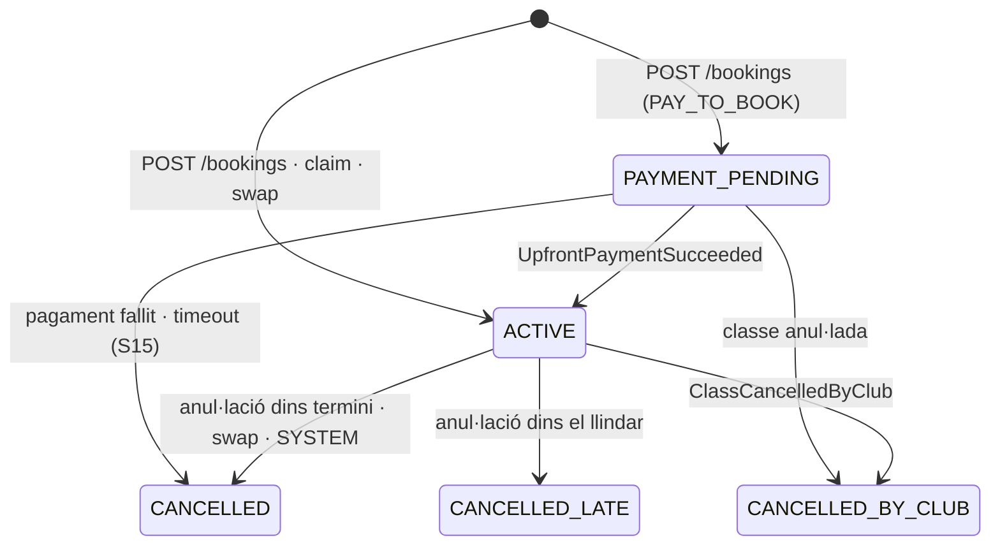
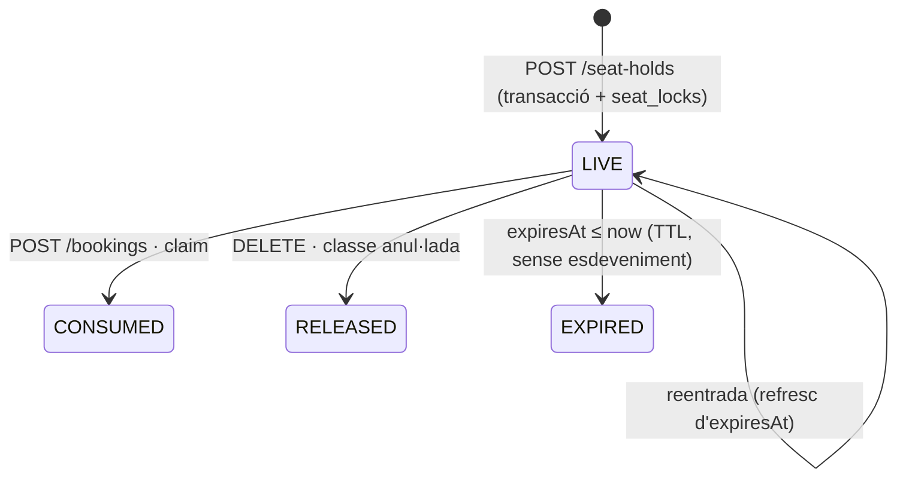
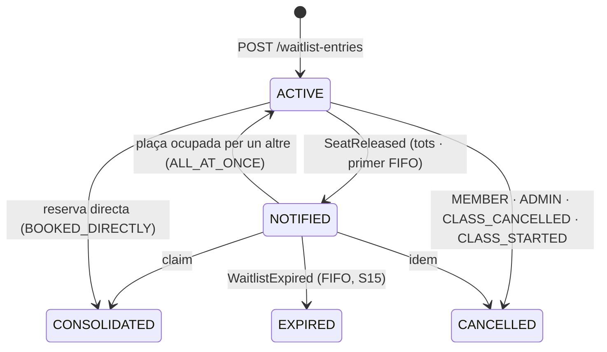

# S08 — Reserves de classes i llista d'espera

**Etapa:** E5 · **Mòduls:** `WAITLIST`, `PACKS`, `SINGLE_CLASS`, `FAMILY_GROUP`, `ACTIVITIES` (files d'activitat a 04; la inscripció és S07), `INACTIVITY` (comprovació BR-16) · **Pantalles:** 03, 04, 06, 29, 07 (fitxers a `03-disseny/mockups/pantalles/mobil/`) · **Model:** §C de v1.6 (INSCRIPCIO_CLASSE, LLISTA_ESPERA, BLOQUEIG_TEMPORAL, CONSUM_PACK), ABONAT (darrer gos, bloqueig de reserves), GRUP_FAMILIAR + §0 i §3 de PLATAFORMA (`Booking`, `WaitlistEntry`, `Member`, `Plan`) · **Estat:** esborrany (03-09-2026) · **Versió:** 0.1

## 1. Propòsit i abast

Cobreix el cicle complet de la reserva de classe d'un abonat amb un gos: veure les seves reserves (03), triar classe (04), confirmar-la amb la plaça bloquejada temporalment i intercanvi si ha arribat al límit (06/29), consultar-la i anul·lar-la (07), i la llista d'espera de les classes plenes en els dos modes de club. És el vertical amb més concurrència del producte (pic a `bookings.weekOpensAt`): l'algorisme de `SeatHold`, la consolidació de plaça i el `claim` en són el nucli.

Per a: alumnes (`MEMBER`), membres d'un grup familiar (reserven per a qualsevol gos del grup), administrador «com l'abonat» (mateix flux, origen `BACKOFFICE`) i instructor (només l'anul·lació «ha avisat», via S10).

| Fora d'abast | On viu |
|---|---|
| Reserves d'entrenament lliure (les files «Entrenament» de 03 surten d'una consulta a S09) | S09 |
| Assistència, «ha avisat», «no presentat», pantalla 21, històric 25 | S10 |
| Processos programats: obertura de setmana (N-33), caducitat FIFO, recordatoris, escombrada d'entrades d'espera en començar la classe, caducitat de pagament pendent | S15 |
| Inscripció a activitats (04 en mostra les files; 03 l'estat «inscrita») | S07 |
| Compra de packs, rebuts, línies de classe individual, Checkout Stripe i webhooks | S12 |
| Graelles, generació i validació de setmanes, anul·lació de classe amb inscrits (crida el servei d'aquesta spec) | S06 |
| Renderitzat i enviament de N-04/N-05/N-15/N-36 (aquí es fixa quan i amb quines variables) | S11 |

## 2. Pantalles i rutes

| Mockup | App | Ruta | Rol | Notes de comportament |
|---|---|---|---|---|
| 03 `03-inici-abonat.html` | `apps/clubs` | `/inici` | MEMBER | `GET /me/home?dogId=`. «Hola, {nom}!». Selector de gossos: propis + del grup (`FAMILY_GROUP`), «Tots» al final i actiu per defecte només si hi ha > 1 gos accessible; canviar de xip refà la crida amb `dogId` (sense = «Tots»); és només filtre de vista. Comptadors «1 classe aquesta setm. · ＋1 classe setmana vinent» (sense màxim). Bloc «Les meves reserves»: files cronològiques de classes («confirmada»), esperes («en llista d'espera» + «t'avisarem si s'allibera plaça»), entrenaments (S09) i activitats («inscrita», S07); «· amb Duna» només amb «Tots»; instructor segons R-08-20 («instructor: es mostra el dia abans»); › obre 07 (o el detall S09/S07). Enllaç «Veure l'històric ({n} mesos) ›» → 25. Campaneta amb animació si `unreadCount > 0`. Buit: «Encara no tens cap reserva» + botó cap a 04 (assumpció). Carregant: esquelet; error: toast + reintent. |
| 04 `04-reservar-activitats-i-classes.html` | `apps/clubs` | `/reservar` | MEMBER | `GET /me/bookable-classes?dogId=`. Xips **sense «Tots»**; gos proposat = `Member.lastDogForClass` si encara és accessible, si no el primer propi; amb un sol gos, un xip sol amb el seu nom. Targeta de pack del gos («Pack 10 — amb Duna» · «caduca 12-11-2026» · «6 consumides · 4 disponibles»; `PACKS`). Text «Seleccioneu l'activitat o classe que vulgueu reservar.». Bloc «Activitats» (`ACTIVITIES`): «{títol} · {dia} · {hora}» + «n places» → flux S07. Bloc «Classes»: files «dc 5 · 18:50 · B+C» amb punt del color de la pista i distintiu segons `state` (R-08-03): «2 places» · «Completa · ⏳1» · «Completa · ⏳3/3» (fila inerta, sense ›) · «Límit setmanal» · «Properament» · «Sense sessions» (assumpció). Tocar una fila: `BOOKABLE`, `WEEKLY_LIMIT_DONE`, `NOT_YET_OPEN` → `POST /seat-holds` i navega a 06/29; `WAITLIST_OPEN` → diàleg «Vols apuntar-te a la llista d'espera de {classe}?» (assumpció) → `POST /waitlist-entries` → toast «Ets a la llista d'espera» i la fila desapareix. Bloqueig de reserves actiu: bàner amb el motiu i files inertes. |
| 06 `06-confirmar-reserva-bloqueig-i-canvi-de-classe.html` | `apps/clubs` | `/reservar/confirmar` | MEMBER | Es pinta amb la resposta de `POST /seat-holds`. Targeta «Nova reserva» (dia i hores, distintiu «nova», xips «Nivell C» · «amb Duna», pista). Compte enrere «Plaça bloquejada per a tu · 0:26» = `expiresAt − serverNow`. Si `limit.reached`: nota groga «Ja tens 2 classes aquesta setmana amb la Duna (límit per gos).», títol «Tria quina anul·les per fer-li lloc», targetes seleccionables (`swappable`: «Classe B+C · Central · anul·lable dins termini») i no seleccionables (`notSelectable`: «Classe B+C · ja feta — no es pot seleccionar» / «fora de termini — no es pot seleccionar», assumpció la segona); botó «ANUL·LA {dia} I CONFIRMA {dia}» → `POST /bookings {seatHoldId, swapBookingId}`. «CANCEL·LAR LA NOVA RESERVA» i sortida enrere → `DELETE /seat-holds/{id}`. En confirmar: nota verda amb enllaços de calendari «Google · Outlook · .ics» (literal assumit: «Reserva confirmada. Afegeix-la al calendari: Google · Outlook · .ics»). |
| 29 `29-confirmar-reserva-estats.html` | `apps/clubs` | `/reservar/confirmar` | MEMBER | Mateixa ruta, quatre variants: normal → «CONFIRMAR LA RESERVA» (+ compte enrere) → `POST /bookings {seatHoldId}`; `409 BOOKING_LIMIT_REACHED` sense `swappable` → nota groga «Aquesta setmana ja has fet dues classes amb la Duna. Podràs reservar per a la setmana vinent a partir de diumenge a les 20 h.»; `409 NOT_YET_OPEN` → nota grisa «Disponible a partir de diumenge 24 a les 20 h.»; compte enrere a 0 o `409 SEAT_HOLD_EXPIRED` → nota vermella «Reserva cancel·lada per temps. Toca per tornar a la llista de classes.» (tocar-la → 04). Amb `SINGLE_CLASS`: `PAY_TO_BOOK` → botó «PAGAR I CONFIRMAR ({preu})» i redirecció a Checkout; `CHARGE_ON_ATTENDANCE` → nota «Aquesta classe es carregarà al proper rebut ({preu}).» (assumpcions). |
| 07 `07-detall-d-una-reserva-anullacio.html` | `apps/clubs` | `/reserves/:id` | MEMBER | `GET /bookings/{id}`. «Detall de la reserva»; targeta «Classe B+C · amb Duna» + «confirmada», «Dilluns 3 · 18:50–19:50 · Central», «Reservada el dijous 30/07 a les 20:14» (per un altre membre del grup: «Reservada per {nom} el…»; pel club: «Reservada pel club el…» — assumpcions). «ANUL·LA LA RESERVA» visible mentre `state=ACTIVE` i la classe no ha acabat; diàleg previ que avisa si és tard («Falten menys de 2 h: la sessió comptarà com a feta.», assumpció) → `POST /bookings/{id}/cancellation`. Després: nota verda «Anul·lació feta dins el termini establert: pots reservar una altra classe per aquesta setmana.» o groga «Anul·lació feta amb menys de 2 hores d'antelació. T'agraïm que ens avisis: habilitem una plaça per si algú s'hi pot afegir a última hora. Aquesta sessió, però, compta dins el teu còmput de classes.». Entrada d'espera (`/espera/:id`): mateixa targeta amb «en llista d'espera» i botó «SURT DE LA LLISTA D'ESPERA» (assumpció) → `POST /waitlist-entries/{id}/cancellation`. |
| 11 (S11) | `apps/clubs` | `/notificacions` | MEMBER | Només el que toca S08: [AGAFA LA PLAÇA] de N-15 → `POST /seat-holds {classSessionId, dogId, waitlistEntryId}` → 06/29 → `POST /waitlist-entries/{id}/claim {seatHoldId}`. |

## 3. Entitats i camps

Col·leccions pròpies: `bookings`, `seat_holds`, `waitlist_entries`, `seat_locks` (tècnica), `idempotency_records` (tècnica, compartida). Cap document de negoci s'esborra (BR-12); només `seat_holds` (TTL) i `seat_locks` són efímers.

### `Booking` · `bookings`
| Camp | Tipus | Oblig. | Validació / notes |
|---|---|---|---|
| id, clubId, classSessionId, dogId | UUID | sí | índex `{clubId, classSessionId, dogId, state}`; com a màxim una reserva viva per gos i classe |
| memberId | UUID | sí | **propietari del gos** (`Dog.memberId`), no qui reserva: és la unitat «abonat + gos» del model; qui reserva queda a `bookedBy` |
| state | enum | sí | `PAYMENT_PENDING` · `ACTIVE` · `CANCELLED` · `CANCELLED_LATE` · `CANCELLED_BY_CLUB` (§5) |
| origin | enum | sí | `APP` · `BACKOFFICE` · `INSTRUCTOR` (R-08-19) |
| bookedAt, bookedBy {accountId, impersonatedMemberId?, displayName} | | sí | «Reservada el … a les …» (07) |
| classStartsAt, classEndsAt, bookingWeekKey | instant, instant, `YYYY-MM-DD` | sí | desnormalitzats de `ClassSession` per als comptadors (índex `{clubId, dogId, bookingWeekKey, state}` i `{clubId, memberId, bookingWeekKey, state}`); S06 els actualitza si canvia l'hora (`ClassSessionUpdated`) |
| cancelledAt, cancelledBy {accountId, role: MEMBER·INSTRUCTOR·ADMIN·SYSTEM, displayName}, cancelReason, cancelMessage, late, minutesBefore | | no | `cancelReason`: `MEMBER` · `SWAP` · `INSTRUCTOR_NOTICE` · `CLUB_CLASS_CANCELLED` · `AUTO_CANCELLED` · `INACTIVITY` · `LEAVE` · `PAYMENT_TIMEOUT`; `cancelMessage` = text del club (25) |
| swapFromBookingId, swapToBookingId, waitlistEntryId | UUID | no | traça de l'intercanvi i de la consolidació |
| packMovementId, packRefundMovementId | UUID | no | moviments de `PackBalance` (S12) |
| charge {mode, price: Money, chargeInvoiceLineRef, checkoutSessionId, paymentIntentId, paidAt} | objecte | no | només `SINGLE_CLASS` (R-08-18); `chargeInvoiceLineRef` l'escriu S12 |
| version, createdAt, updatedAt | | sí | |

### `SeatHold` · `seat_holds` (TTL `expiresAt`, únic `{clubId, classSessionId, dogId}`)
`id`, `clubId`, `classSessionId`, `dogId`, `memberId`, `accountId` (propietari del bloqueig; en impersonació, el compte de l'admin), `waitlistEntryId?`, `createdAt`, `expiresAt = createdAt + bookings.seatHoldSeconds`. El TTL de Mongo esborra amb fins a 60 s de retard: **tota consulta filtra `expiresAt > now`**.

### `WaitlistEntry` · `waitlist_entries`
| Camp | Tipus | Oblig. | Notes |
|---|---|---|---|
| id, clubId, classSessionId, dogId, memberId, accountId, joinedAt | | sí | índexs `{clubId, classSessionId, state}`, `{clubId, dogId, bookingWeekKey, state}` |
| state | enum | sí | `ACTIVE` · `NOTIFIED` · `CONSOLIDATED` · `EXPIRED` · `CANCELLED` |
| position | int | FIFO | ordre d'entrada (`max + 1` a l'alta); en `ALL_AT_ONCE` es guarda però no s'usa |
| notifiedAt, confirmBy | instant | no | `confirmBy` només FIFO (R-08-14) |
| bookingId, cancelledAt, cancelReason | | no | `cancelReason`: `MEMBER` · `CLASS_CANCELLED` · `CLASS_STARTED` · `ADMIN` · `BOOKED_DIRECTLY` |
| classStartsAt, bookingWeekKey | | sí | desnormalitzats com a `Booking` |

### Tècniques
- `SeatLock` · `seat_locks`: `_id = classSessionId`, `clubId`, `version` (int). Document de serialització per classe (R-08-07).
- `IdempotencyRecord` · `idempotency_records` (TTL 24 h): `{clubId, accountId, key, method, path, requestHash, status, body, createdAt}`; clau única `{clubId, accountId, key}` (CONVENCIONS_API §7).

### Camps d'altres agregats que aquest vertical modifica o llegeix
`Member.lastDogForClass` (escriu: R-08-23) · `Member.bookingBlock` (llegeix) · `Member.status`, `Member.leaveDate` (llegeix) · `Member.planId → Plan.type/singleClass` · `Dog.levelId`, `Dog.memberId`, `Dog.active`, `Dog.sex` · `FamilyGroup` (gossos accessibles) · `ClassSession.state/startsAt/endsAt/capacity/levelIds/ringId/instructorIds/description` · `PackBalance` via `PackBalanceService.consume/refund` (S12) · `InactivityPeriod` (S13) · `ActivityRegistration` i `TrainingBooking` (només consulta per a 03/04).

## 4. Regles de negoci

**R-08-01 Setmanes de reserva i obertura.** Sigui `O(t)` la darrera ocurrència de `bookings.weekOpensAt` (dia i hora **locals** del club) anterior o igual a `t`. La *setmana de reserva* és l'interval `[O(t), O(t) + 7 dies)` en hora local (167/169 h amb canvi horari); `bookingWeekKey` = data local de `O`. `W0` = setmana de `now`; `W1` = la següent; `W2+` = les posteriors. Una classe pertany a la setmana que conté `startsAt`. `W0` i `W1` són reservables; `W2+` és «Properament» i s'obre a `opensAt = inici(W(classe)) − 7 dies`. Paràmetre: `bookings.weekOpensAt = {SUNDAY, 20:00}`. *Exemple (Europe/Madrid):* dimarts 06-10-2026 10:00 → `W0` = [dg 04-10 20:00, dg 11-10 20:00), `W1` = [dg 11-10 20:00, dg 18-10 20:00). La classe de dijous 15-10 18:50 és a `W1` (reservable, límit 1); la de dimarts 20-10 és a `W2` → «Disponible a partir de diumenge 11 a les 20 h.»; una classe de diumenge 11-10 a les 21:00 pertany a `W1`.

| Instant `now` (Madrid) | `W0` | `W1` | Classe | Setmana | Estat / `opensAt` |
|---|---|---|---|---|---|
| dg 04-10-2026 19:59 | dg 27-09 20:00 → dg 04-10 20:00 | dg 04-10 20:00 → dg 11-10 20:00 | dl 12-10 18:50 | `W2` | «Properament» · s'obre dg 04-10 20:00 |
| dg 04-10-2026 20:00 | dg 04-10 20:00 → dg 11-10 20:00 | dg 11-10 20:00 → dg 18-10 20:00 | dl 12-10 18:50 | `W1` | reservable (màx. 1) |
| dl 05-10-2026 09:00 | idem | idem | dg 11-10 21:00 | `W1` | reservable (màx. 1) |
| dl 05-10-2026 09:00 | idem | idem | dc 07-10 18:50 | `W0` | reservable (màx. 2) |
| dl 26-10-2026 09:00 (després del canvi d'hora) | dg 25-10 20:00 CET → dg 01-11 20:00 | dg 01-11 20:00 → dg 08-11 20:00 | dt 03-11 19:00 | `W1` | reservable; `opensAt` = dg 25-10 20:00 CET = 19:00Z |

**R-08-02 Què compta i per a qui.** Compten al límit d'una setmana les reserves de classe d'aquella setmana amb estat `ACTIVE` (futures, fetes i «no presentat» — l'assistència no canvia l'estat), `PAYMENT_PENDING` i `CANCELLED_LATE`. **No** compten `CANCELLED` (dins termini o pel sistema) ni `CANCELLED_BY_CLUB`. Unitat (`bookings.limitUnit`): `DOG` → es compten les reserves del gos, les hagi fet qui les hagi fet; `MEMBER` → les de tots els gossos del **propietari** del gos (`Booking.memberId`). Amb `FAMILY_GROUP`, qualsevol membre del grup reserva per a qualsevol gos del grup; el comptador segueix sent del gos o del seu propietari. *Exemple `DOG`:* la Duna té dl 05-10 (feta) `ACTIVE` + dc 07-10 `CANCELLED_LATE` + dj 08-10 `CANCELLED` → compta 2. *Exemple `MEMBER`:* la Laura (Duna + Rock, màx. 2): Duna dl + Rock dc → límit assolit per a tots dos; en Toby (d'en Joan Antoni) reservat per la Laura compta a en Joan Antoni.

| Reserves de la Duna a `W0` (dg 04-10 → dg 11-10) | Compta | Comptador | Fila d'una 3a classe de `W0` |
|---|---|---|---|
| dl 05 18:50 `ACTIVE` (feta) · dv 09 20:00 `ACTIVE` | sí · sí | 2/2 | «n places» → 06 amb intercanvi (dv 09 és `swappable`) |
| dl 05 `ACTIVE` (feta) · dc 07 `CANCELLED_LATE` | sí · sí | 2/2 | «Límit setmanal» → 29 informativa |
| dl 05 `ACTIVE` (feta) · dc 07 `CANCELLED` · dj 08 `CANCELLED_BY_CLUB` | sí · no · no | 1/2 | «n places» → 29 normal |
| dl 05 `ACTIVE` · dv 09 `ACTIVE`, ara = dv 09 18:30 (dins el llindar) | sí · sí | 2/2 | «Límit setmanal» (dv 09 és `LATE_WINDOW`, no seleccionable) |

Els comptadors de 03 («1 classe aquesta setm.») sumen les reserves que compten de tots els gossos del filtre («Tots» = propis + grup) a `W0` i `W1`; no mostren el màxim.

**R-08-03 Límits i estat de fila.** `bookings.maxCurrentWeek = 2` per a `W0`, `bookings.maxNextWeek = 1` per a `W1`. Estat de fila a 04 per ordre de prioritat: `NOT_BOOKABLE` (bloqueig, inactivitat, baixa) → `NOT_YET_OPEN` → `PACK_EMPTY` → `WEEKLY_LIMIT_DONE` (límit assolit **i cap** reserva intercanviable: R-08-09) → `WAITLIST_FULL` / `WAITLIST_OPEN` / `FULL` (sense `WAITLIST`) → `BOOKABLE` (amb `limit.reached` a la resposta del hold quan cal intercanvi). «Límit setmanal» només surt, doncs, quan totes les reserves que compten estan fetes, són tardanes o ja no s'arriben a temps d'anul·lar; amb una de viva, la fila és normal i 06 proposa el canvi. *Exemple:* Duna a `W0` amb dl (feta) i dv 09-10 20:00 (viva) → fila «2 places» + intercanvi; amb dl (feta) i dc `CANCELLED_LATE` → «Límit setmanal».

**R-08-04 Elegibilitat de classe i gos.** Es llisten a 04 les `ClassSession` `ACTIVE` amb `startsAt > now` fins a la fi de `W2`, que no tinguin ja reserva viva ni entrada d'espera viva del gos. Amb `levels.enabled = true`, `Dog.levelId ∈ ClassSession.levelIds` (buit = sense restricció); amb `false`, totes. El gos ha de ser actiu i propi o del grup (`404 DOG_NOT_ACCESSIBLE`). L'abonat ha d'estar en Alta (`422 MEMBER_NOT_ACTIVE`); amb data de baixa futura (BR-07), les classes amb `startsAt ≥ leaveDate` no són reservables (`NOT_BOOKABLE{LEAVING}`, assumpció). Reservar es tanca a `startsAt` (`409 CLASS_NOT_BOOKABLE`). *Exemple:* Duna (C) veu «B+C», «C+D» i «C»; no veu «D i sup.».

**R-08-05 Bloqueig de reserves.** `Member.bookingBlock.active` (del propietari del gos **o** de qui reserva) → cap reserva nova, entrada d'espera ni `claim` (`422 BOOKING_BLOCKED`, `details.reason`); les existents es mantenen; 04 mostra el bàner «Les reserves estan bloquejades: {motiu}. Posa't en contacte amb el club.» (assumpció). L'intent rebutjat no s'audita: queda només al log amb `traceId`.

**R-08-06 Inactivitat (BR-16).** Amb `INACTIVITY`, si la data local de la classe cau dins un `InactivityPeriod` `APPROVED`/`ACTIVE` de l'abonat propietari → `NOT_BOOKABLE{INACTIVITY}` / `422 INACTIVITY_PERIOD {from, to}`. Les reserves ja fetes dins l'interval les anul·la S13 en aprovar (`inactivity.cancelBookingsOnApproval`) cridant `cancel(by=SYSTEM, reason=INACTIVITY)` → `CANCELLED`, pack retornat. *Exemple:* inactivitat 2026-11 → 2026-12 aprovada el 20-10; la classe del 03-11 no es pot reservar; la del 30-10 sí.

**R-08-07 Bloqueig temporal (SeatHold).** En tocar una fila reservable, `POST /seat-holds` executa **una transacció Mongo**: (1) `seat_locks.findOneAndUpdate({_id: classId}, {$inc: {version: 1}}, upsert)` — qualsevol transacció concurrent sobre la mateixa classe rep `WriteConflict` i es reintenta (≤ 3 cops, backoff 50–150 ms); (2) validacions R-08-01…06; (3) `taken = count(bookings ACTIVE|PAYMENT_PENDING) + count(seat_holds vius d'altres gossos)`; si `taken ≥ ClassSession.capacity` → `409 CLASS_FULL` (`details.heldOnly = true` si sense els holds hi cabria: la UI diu «Algú altre està acabant de reservar l'última plaça. Torna-ho a provar d'aquí a uns segons.», assumpció); (4) upsert del hold del gos (tornar a entrar a la pantalla **refresca** el mateix hold); (5) `SeatHeld`. Un hold viu és una garantia: cap altre gos pot ocupar la plaça mentre `expiresAt > now`. `DELETE` o sortida → `SeatHoldReleased`; la caducitat per TTL no emet res. Paràmetre `bookings.seatHoldSeconds = 30`. La resposta porta `serverNow` per al compte enrere. *Exemple:* dg 20:00:00 dues persones toquen l'última plaça; la primera transacció crea el hold, la segona reintenta, veu `taken = capacity` i rep `CLASS_FULL{heldOnly: true}`.

**R-08-08 Confirmació.** `POST /bookings {seatHoldId}` amb `Idempotency-Key` (= `seatHoldId`) en transacció: bloqueig `seat_locks`; el hold ha d'existir, ser del mateix `accountId` i `expiresAt > now` (`409 SEAT_HOLD_EXPIRED`); es repeteixen les validacions (l'estat pot haver canviat); es crea `Booking ACTIVE` (o `PAYMENT_PENDING`, R-08-18), es consumeix pack (R-08-17), s'esborra el hold, es consolida una entrada d'espera viva del gos si n'hi ha (`BOOKED_DIRECTLY`→`CONSOLIDATED`), s'escriu `Member.lastDogForClass` (del qui reserva) i s'emeten `BookingCreated` + `SeatHoldReleased`. La resposta inclou `calendarLinks {google, outlook, ics}` (l'`.ics` amb token signat vàlid fins a `classEndsAt`). Un segon `POST` amb la mateixa clau retorna la mateixa resposta (també si va ser 409).

**R-08-09 Intercanvi atòmic.** Si el límit de la setmana de la classe nova està assolit, `swappable` = reserves `ACTIVE` que compten a **aquella** setmana (del gos, o de tots els gossos del propietari amb `MEMBER`), amb `startsAt − now ≥ bookings.lateCancelThresholdMinutes`; `notSelectable` = la resta que compta (`DONE` si `startsAt ≤ now` o `CANCELLED_LATE`; `LATE_WINDOW` si és dins el llindar). `POST /bookings {seatHoldId, swapBookingId}` en una sola transacció: anul·la la vella (`CANCELLED`, `cancelReason=SWAP`, `late=false`, `SeatReleased` segons R-08-11, pack retornat) i crea la nova (`swapFromBookingId`); `swapBookingId` invàlid → `409 SWAP_NOT_ALLOWED`. Si `swappable` és buit no es crea cap hold: `409 BOOKING_LIMIT_REACHED` (variant informativa de 29). *Exemple:* dijous 08-10 16:00, Duna té dl 05-10 (feta) i dv 09-10 20:00; tria ds 10-10 9:00 → botó «ANUL·LA DIVENDRES 9 I CONFIRMA DISSABTE 10».

**R-08-10 Anul·lació.** `POST /bookings/{id}/cancellation` sempre possible mentre `state=ACTIVE`, `now < classEndsAt` **i** no existeix cap `Attendance` `PRESENT`/`NO_SHOW` de la reserva (contracte S10 R-10-03; `409 BOOKING_NOT_CANCELLABLE` altrament). `minutesBefore = (classStartsAt − now)` en minuts (pot ser negatiu). `late = now > classStartsAt − bookings.lateCancelThresholdMinutes` (llindar **inclòs** com a dins termini). `late=false` → `CANCELLED` (no compta, pack retornat, política `billing.singleClassCancelPolicy` si estava pagada); `late=true` → `CANCELLED_LATE` (compta, sense retorn). Qui: el membre (propi o del grup), l'admin «com l'abonat» (`origin=BACKOFFICE`), l'instructor si `bookings.instructorLastMinuteNotice=true` (`origin=INSTRUCTOR`, `reason=INSTRUCTOR_NOTICE`), el sistema (S13/S15, sempre `CANCELLED`). L'admin sense impersonar → `403`. Paràmetre `bookings.lateCancelThresholdMinutes = 120`. *Exemples (classe dj 15-10 18:50):* anul·lació a les 16:50:00 → dins termini; 16:50:01 → tard; 19:05 (classe començada) → tard, `minutesBefore = −15`.

**R-08-11 Alliberament de plaça i llindar d'avís.** Tota anul·lació d'una reserva `ACTIVE`/`PAYMENT_PENDING` amb `now < classStartsAt` emet `SeatReleased{classId, freeSeats, minutesBefore, notifyWaitlist}` amb `notifyWaitlist = WAITLIST actiu ∧ minutesBefore > waitlist.notifyThresholdMinutes ∧ hi ha entrades ACTIVE`. Per sota del llindar la plaça queda lliure a 04 sense avisar ningú. Paràmetre `waitlist.notifyThresholdMinutes = 30`. *Exemples (classe 18:50):* anul·lació a les 16:49 → tard **i** amb avís (121 > 30); a les 18:20:00 → sense avís (30 no és > 30); a les 18:25 → sense avís.

**R-08-12 Entrada a la llista d'espera.** Només amb `WAITLIST` i classe plena per reserves (`taken` sense holds ≥ capacity; altrament `409 CLASS_NOT_FULL`); no hi cap el gos amb reserva viva (`ALREADY_BOOKED`) ni amb entrada viva (`ALREADY_ON_WAITLIST`). Límits: entrades vives per classe < `waitlist.maxPerClass` (3) → fila «Completa · ⏳3/3»; entrades vives del gos a la setmana de la classe < `waitlist.maxPerDogPerWeek` (2), o < `waitlist.maxPerDogPerWeekIfAttended` (1) si el gos ja té a la setmana alguna reserva que compta amb `classStartsAt ≤ now` o `CANCELLED_LATE` («ja ha fet classe»); `409 WAITLIST_LIMIT {scope: CLASS | DOG_WEEK}`. Cal poder acceptar la plaça: comptador de la setmana < límit **o** almenys una reserva intercanviable; si no, `409 BOOKING_LIMIT_REACHED`. Amb `limitUnit=MEMBER` els límits «per gos» s'apliquen per propietari. *Exemple:* Duna, `W0`, 1 classe feta + 1 entrada d'espera → segona entrada rebutjada (`DOG_WEEK`, límit 1).

**R-08-13 Mode `ALL_AT_ONCE` (Cànic).** En rebre `SeatReleased{notifyWaitlist=true}`: totes les entrades `ACTIVE` de la classe passen a `NOTIFIED` (`WaitlistNotified{entryIds}` → N-15 amb SMS). La plaça és per a qui la confirma primer via hold + `claim` (R-08-15). Quan `freeSeats` torna a 0, les `NOTIFIED` restants tornen a `ACTIVE` i s'informen (N-46, proposta §13); una nova plaça les tornarà a avisar. Les ja `NOTIFIED` no es tornen a avisar mentre ho siguin. *Exemple:* 3 entrades, plaça alliberada a les 15:00 (4 h abans): 3 avisos; en Pau confirma a les 15:02 → `CONSOLIDATED`; l'Anna i en Marc → `ACTIVE`.

**R-08-14 Mode `FIFO`.** Es notifica només l'entrada `ACTIVE` amb `position` mínima: `NOTIFIED`, `confirmBy = min(now + waitlist.fifoConfirmMinutes, classStartsAt)`. Si confirma → `CONSOLIDATED`; si `confirmBy` passa, S15 emet `WaitlistExpired` → `EXPIRED` i S08 (`WaitlistService.offerNext`) notifica la següent mentre quedin places i temps (`minutesBefore > notifyThresholdMinutes`). Amb `freeSeats = n` es notifiquen les `n` primeres. `waitlist.fifoConfirmMinutes = 30`. *Exemple:* Pau (1), Anna (2); plaça a les 15:00 → Pau fins a les 15:30; no respon → Anna fins a les 16:00; confirma a les 15:45.

**R-08-15 Agafar la plaça (claim).** [AGAFA LA PLAÇA] → `POST /seat-holds {…, waitlistEntryId}` (l'entrada ha de ser `NOTIFIED` i, en FIFO, `confirmBy > now`; si no, `409 WAITLIST_NOT_NOTIFIED` / `WAITLIST_OFFER_EXPIRED`) → pantalla 06/29 → `POST /waitlist-entries/{id}/claim {seatHoldId, swapBookingId?}` amb `Idempotency-Key`. Mateixa transacció que R-08-08 amb `entry → CONSOLIDATED`, `Booking.waitlistEntryId` i `WaitlistConsolidated`. Sense plaça (per reserva o hold d'un altre) → `409 SEAT_TAKEN`. Respecta BR-01: al límit amb reserves vives, el hold retorna `limit.swappable` i 06 proposa l'intercanvi; sense cap intercanviable, `409 BOOKING_LIMIT_REACHED`. Els límits d'espera no s'apliquen al claim. *Exemple:* dues persones toquen alhora [AGAFA LA PLAÇA]: una obté el hold, l'altra `SEAT_TAKEN`; si la primera deixa caducar el hold, la segona pot tornar-ho a provar mentre sigui `NOTIFIED`.

**R-08-16 Baixa d'entrades d'espera.** `CANCELLED` amb `cancelReason`: `MEMBER` (`POST …/cancellation`, `WaitlistLeft`), `ADMIN` (D4/D12, S06), `CLASS_CANCELLED` (S06 crida `WaitlistService.cancelAll(classId)` dins la transacció d'anul·lació; N-08a els inclou), `CLASS_STARTED` (S15 en començar la classe, silenciós), `BOOKED_DIRECTLY` → en realitat `CONSOLIDATED` (R-08-08). Un canvi de nivell del gos no toca les entrades.

**R-08-17 Packs.** Amb `PACKS` i `Plan.type = PACK` del propietari: `PackBalance` de l'abonat + gos; 1 reserva = 1 sessió consumida **en confirmar** (`PackBalanceService.consume(dogId, bookingId)` → `PackConsumed`, mateixa transacció); es retorna (`PackRefunded`) amb `CANCELLED` i `CANCELLED_BY_CLUB`, mai amb `CANCELLED_LATE`. Saldo 0 o pack caducat (`expiresOn < data de la classe`) → fila `PACK_EMPTY` «Sense sessions» i `409 PACK_EMPTY` (tampoc s'accepta l'espera). `PACKS` off o pla `MONTHLY`: no s'aplica res. *Exemple:* Pack 10 amb 4 disponibles, caduca 12-11-2026: reserva 05-11 → 3; anul·lació dins termini → 4; classe del 15-11 → «Sense sessions».

**R-08-18 Classe individual (`SINGLE_CLASS`).** `Plan.type = SINGLE_CLASS` del propietari: la fila mostra `price` («2 places · 12,00 €», assumpció) i `charge.mode`: `CHARGE_ON_ATTENDANCE` → reserva normal amb `charge {mode, price}`; S12 crea la línia (`origin=SINGLE_CLASS`, `bookingId`) en consumir `AttendanceMarked{PRESENT|NO_SHOW}` o `BookingCancelled{late=true}` i escriu `chargeInvoiceLineRef`. `PAY_TO_BOOK` → `POST /bookings` crea la reserva en `PAYMENT_PENDING` (ocupa plaça i compta), demana `POST /checkout-sessions {bookingId}` a S12 i retorna `checkoutUrl`; `UpfrontPaymentSucceeded{bookingId}` → `ACTIVE` + `BookingCreated` (N-04); `UpfrontPaymentFailed` o `bookings.paymentPendingMinutes` (proposta, 30 = mínim de caducitat d'un Checkout de Stripe) exhaurits (S15) → `CANCELLED{PAYMENT_TIMEOUT}` + `SeatReleased` + N-40 (proposta). Reserva pagada anul·lada dins termini → S12 aplica `billing.singleClassCancelPolicy`. Mòdul off: cap preu ni pagament.

**R-08-19 Origen i actor.** `origin`: `APP` (JWT sense impersonació, acció pròpia), `BACKOFFICE` (JWT amb `impersonatedMemberId`: `bookedBy/cancelledBy` porten els dos ids, `AuditEntry` amb actor + suplantat), `INSTRUCTOR` (anul·lació «ha avisat» des de 21 → S10 crida `BookingCancellationService.cancel(bookingId, actor, origin=INSTRUCTOR)`). Notificació resultant: `APP` → N-04/N-05; `BACKOFFICE` → N-36 (app + correu + SMS); `INSTRUCTOR` → N-05 (l'acció és a iniciativa de l'alumne; assumpció). Els endpoints d'aquest vertical rebutgen `ADMIN` sense impersonar (`403`), llevat dels de lectura.

**R-08-20 Visibilitat de l'instructor.** A 03/07 el nom de l'instructor només s'inclou si `classStartsAt − now ≤ bookings.showInstructorHoursBefore` hores (absolutes); `0` = sempre. Abans, `instructor = null` i `instructorVisibleAt`; text «instructor: es mostra el dia abans» (24 h) o «es mostra {n} h abans». *Exemple:* classe dl 12-10 18:50, paràmetre 24 → visible des de dg 11-10 18:50.

**R-08-21 Canvis posteriors a la reserva.** `DogLevelChanged` (S03) i `ClassSessionUpdated` (hora, pista, instructor; S06) no toquen reserves ni entrades: «les classes que ja teníeu reservades … segueixen sent vàlides». `ClassCancelledByClub` (S06/S15): S06 crida `BookingService.cancelByClub(classId, adminText)` dins la seva transacció → reserves vives `CANCELLED_BY_CLUB` (pack retornat, `PAYMENT_PENDING` inclosa), entrades `CANCELLED{CLASS_CANCELLED}`, holds esborrats; les notificacions les fa N-08a.

**R-08-22 Activitats a 03/04.** Amb `ACTIVITIES`, 04 llista les `Activity` publicades amb inscripció oberta, no inscrites per l'abonat, admeses per al nivell del gos seleccionat (o sense restricció) via el servei de consulta de S07; 03 mostra les `ActivityRegistration` vives («inscrita»). Tocar-les → flux S07. Mòdul off: blocs absents.

**R-08-23 Selector de gos.** 03 i 25: «Tots» (per defecte amb > 1 gos accessible) filtra la vista. 04: sempre **un** gos; `Member.lastDogForClass` s'actualitza en cada `BookingCreated`/`WaitlistJoined` del qui reserva i es proposa mentre el gos segueixi accessible; un gos donat de baixa o fora del grup deixa de proposar-se. Els gossos del grup es mostren «Toby · B (Joan Antoni)». Amb `FAMILY_GROUP` off només els propis.

## 5. Estats i transicions







| Transició | Qui | Condició | Efectes | Esdeveniment |
|---|---|---|---|---|
| — → `ACTIVE` | MEMBER (APP/BACKOFFICE) | hold viu, R-08-01…06, plaça | pack −1, hold esborrat, `lastDogForClass`, entrada d'espera → `CONSOLIDATED` | `BookingCreated`, `SeatHoldReleased` (+ `PackConsumed`, `WaitlistConsolidated`) |
| — → `PAYMENT_PENDING` | MEMBER | `PAY_TO_BOOK` | ocupa plaça, Checkout | `SeatHoldReleased` (no `BookingCreated` fins al pagament) |
| `ACTIVE` → `CANCELLED` | MEMBER · INSTRUCTOR · SYSTEM | `late=false` o `by=SYSTEM` | pack +1, plaça alliberada | `BookingCancelled{late:false}`, `SeatReleased`, `PackRefunded` |
| `ACTIVE` → `CANCELLED_LATE` | MEMBER · INSTRUCTOR | `late=true` | plaça alliberada, compta | `BookingCancelled{late:true}`, `SeatReleased` |
| `*` → `CANCELLED_BY_CLUB` | S06/S15 (servei) | classe anul·lada | pack +1, no compta | dins `ClassCancelledByClub` (+ `PackRefunded`) |
| `PAYMENT_PENDING` → `ACTIVE` | consumidor `UpfrontPaymentSucceeded` | pagament confirmat | `charge.paidAt` | `BookingCreated` (N-04) |
| `PAYMENT_PENDING` → `CANCELLED` | consumidor `UpfrontPaymentFailed` · S15 timeout | `paymentPendingMinutes` exhaurits | plaça alliberada | `BookingCancelled{reason: PAYMENT_TIMEOUT}`, `SeatReleased` |
| hold `LIVE` → `CONSUMED` / `RELEASED` | MEMBER · S06 | confirmació · `DELETE` · classe anul·lada | document esborrat | `SeatHoldReleased` |
| espera — → `ACTIVE` | MEMBER | classe plena, límits R-08-12 | `position`, `lastDogForClass` | `WaitlistJoined` |
| `ACTIVE` → `NOTIFIED` (espera) | dispatcher `SeatReleased` | `notifyWaitlist` | `notifiedAt`, `confirmBy` FIFO | `WaitlistNotified` |
| `NOTIFIED` → `CONSOLIDATED` | MEMBER | hold viu, plaça | reserva `ACTIVE` | `WaitlistConsolidated`, `BookingCreated` |
| `NOTIFIED` → `ACTIVE` | dispatcher | `ALL_AT_ONCE` i `freeSeats = 0` | `notifiedAt` conservat a l'històric | (N-46 proposada) |
| `NOTIFIED` → `EXPIRED` | S15 | FIFO, `confirmBy ≤ now` | — | `WaitlistExpired` → `offerNext` |
| `ACTIVE`/`NOTIFIED` → `CANCELLED` | MEMBER · ADMIN · S06 · S15 | vegeu R-08-16 | `cancelReason` | `WaitlistLeft` (MEMBER/ADMIN); dins `ClassCancelledByClub` (S06); silenciós (`CLASS_STARTED`) |

## 6. API

Totes les rutes sota `/api/v1`; tenant pel JWT; `MEMBER` inclou el token d'impersonació (`IMPERSONATED`). `I` = accepta `Idempotency-Key`.

| Mètode | Ruta | Rol(s) | Mòdul | I | Descripció | Cos / paràmetres clau | Respostes i errors |
|---|---|---|---|---|---|---|---|
| GET | `/me/home` | MEMBER | — | — | Agregat de 03 | `dogId?` (absent = «Tots») | 200 (JSON avall) · 404 `DOG_NOT_ACCESSIBLE` |
| GET | `/me/bookable-classes` | MEMBER | — | — | Agregat de 04 | `dogId?` (absent = gos proposat) | 200 (JSON avall) · 404 `DOG_NOT_ACCESSIBLE` |
| POST | `/seat-holds` | MEMBER | — (`WAITLIST` si `waitlistEntryId`) | — | Bloqueja plaça i retorna el context de 06/29 | `{classSessionId, dogId, waitlistEntryId?}` | 201 (JSON avall) · 409 `CLASS_FULL{heldOnly}` `CLASS_NOT_BOOKABLE` `NOT_YET_OPEN{opensAt}` `BOOKING_LIMIT_REACHED{…}` `BOOKING_BLOCKED` `INACTIVITY_PERIOD` `MEMBER_NOT_ACTIVE` `LEVEL_NOT_ALLOWED` `ALREADY_BOOKED` `PACK_EMPTY` `SEAT_TAKEN` `WAITLIST_NOT_NOTIFIED` `WAITLIST_OFFER_EXPIRED` |
| DELETE | `/seat-holds/{id}` | MEMBER (propi) | — | — | Allibera el bloqueig | — | 204 (també si ja no existeix) |
| POST | `/bookings` | MEMBER | — | sí | Confirma (o intercanvia) | `{seatHoldId, swapBookingId?}` | 201 `Booking` + `calendarLinks` (+ `checkoutUrl` si `PAYMENT_PENDING`) · 409 `SEAT_HOLD_EXPIRED` `SWAP_NOT_ALLOWED` + els de `/seat-holds` |
| GET | `/me/bookings` | MEMBER | — | — | Reserves pròpies (03/07 de suport; l'històric és `/me/history`, S10) | `dogId?`, `state?`, `from?`, `to?` | 200 llista |
| GET | `/bookings/{id}` | MEMBER (pròpia/grup) · INSTRUCTOR · ADMIN | — | — | Detall 07 (qui i quan; anul·lació) | — | 200 · 404 |
| GET | `/bookings/{id}/calendar.ics` | token signat | — | — | Fitxer `text/calendar` | `token` | 200 · 404 |
| POST | `/bookings/{id}/cancellation` | MEMBER (pròpia/grup) · INSTRUCTOR (si paràmetre) | — | — | Anul·la (R-08-10) | `{message?}` | 200 `Booking{state, late, minutesBefore}` · 403 · 409 `BOOKING_NOT_CANCELLABLE` |
| GET | `/bookings` | ADMIN · INSTRUCTOR | — | — | Llistat universal (§4 CONVENCIONS) per a D10/D12 | `filter=`, `sort=`, `page` | 200 |
| POST | `/waitlist-entries` | MEMBER | `WAITLIST` | — | S'apunta (R-08-12) | `{classSessionId, dogId}` | 201 · 409 `CLASS_NOT_FULL` `ALREADY_BOOKED` `ALREADY_ON_WAITLIST` `WAITLIST_LIMIT{scope}` `BOOKING_LIMIT_REACHED` `BOOKING_BLOCKED` `INACTIVITY_PERIOD` `PACK_EMPTY` `LEVEL_NOT_ALLOWED` |
| GET | `/waitlist-entries/{id}` | MEMBER (pròpia) · INSTRUCTOR · ADMIN | `WAITLIST` | — | Detall d'espera | — | 200 · 404 |
| POST | `/waitlist-entries/{id}/cancellation` | MEMBER (pròpia) · ADMIN | `WAITLIST` | — | Surt / cancel·la | — | 200 · 409 `WAITLIST_ENTRY_NOT_LIVE` |
| POST | `/waitlist-entries/{id}/claim` | MEMBER | `WAITLIST` | sí | Consolida la plaça (R-08-15) | `{seatHoldId, swapBookingId?}` | 201 `Booking` · 409 `SEAT_TAKEN` `SEAT_HOLD_EXPIRED` `WAITLIST_NOT_NOTIFIED` `WAITLIST_OFFER_EXPIRED` `BOOKING_LIMIT_REACHED` `SWAP_NOT_ALLOWED` |
| GET | `/class-sessions/{id}/bookings`, `/class-sessions/{id}/waitlist-entries` | INSTRUCTOR · ADMIN | — / `WAITLIST` | — | Lectura per a 21/D4/D12 (S06/S10 les consumeixen) | — | 200 |

`GET /me/home?dogId=` (200):
```json
{ "member": {"id":"m1","firstName":"Laura","gender":"FEMALE"},
  "dogs": [{"id":"d1","name":"Duna","levelName":"C","own":true,"ownerFirstName":null},{"id":"d2","name":"Rock","levelName":"D","own":true,"ownerFirstName":null},{"id":"d3","name":"Toby","levelName":"B","own":false,"ownerFirstName":"Joan Antoni"}],
  "selectedDogId": null,
  "limits": {"unit":"DOG","currentWeek":{"count":1,"max":2,"weekKey":"2026-10-04"},"nextWeek":{"count":1,"max":1,"weekKey":"2026-10-11"}},
  "reservations": [
    {"type":"CLASS","id":"b1","state":"CONFIRMED","dogId":"d1","dogName":"Duna","title":"Classe B+C","startsAt":"2026-10-05T16:50:00Z","startsAtLocal":"2026-10-05T18:50","endsAtLocal":"2026-10-05T19:50","ringName":"Central","instructorName":null,"instructorVisibleAt":"2026-10-04T16:50:00Z"},
    {"type":"TRAINING","id":"t1","state":"CONFIRMED","dogId":"d2","dogName":"Rock","title":"Entrenament","startsAtLocal":"2026-10-06T08:00","endsAtLocal":"2026-10-06T08:30","ringName":"Muntanya"},
    {"type":"CLASS_WAITLIST","id":"w1","state":"WAITLISTED","dogId":"d1","dogName":"Duna","title":"Classe C i sup.","startsAtLocal":"2026-10-08T20:00","endsAtLocal":null,"ringName":"Carretera"},
    {"type":"ACTIVITY","id":"a1","state":"REGISTERED","dogId":null,"title":"Torneig d'Estiu","startsAtLocal":"2026-10-10T18:30","endsAtLocal":"2026-10-10T20:30","ringName":"totes les pistes"},
    {"type":"CLASS","id":"b4","state":"CONFIRMED","dogId":"d2","dogName":"Rock","title":"Classe D i sup.","startsAt":"2026-10-14T17:00:00Z","startsAtLocal":"2026-10-14T19:00","endsAtLocal":"2026-10-14T20:00","ringName":"Muntanya","instructorName":null,"instructorVisibleAt":"2026-10-13T17:00:00Z"} ],
  "history": {"monthsVisible": 2}, "notifications": {"unreadCount": 2}, "impersonation": null }
```
`type`: `CLASS` (`CONFIRMED` · `PAYMENT_PENDING`), `CLASS_WAITLIST` (`WAITLISTED`), `TRAINING` (S09), `ACTIVITY` (`REGISTERED` · `WAITLISTED`, S07); ordenat per `startsAt`; només futures (`endsAt > now`).

`GET /me/bookable-classes?dogId=d1` (200):
```json
{ "dog": {"id":"d1","name":"Duna","sex":"FEMALE","levelId":"l3","levelName":"C","own":true},
  "dogs": [ … com a /me/home … ],
  "pack": {"planName":"Pack 10","sessionsTotal":10,"consumed":6,"available":4,"expiresOn":"2026-11-12","state":"ACTIVE"},
  "singleClass": null, "bookingBlock": null,
  "activities": [{"id":"a2","title":"Seminari de handling","startsAtLocal":"2026-09-12T09:00","freeSeats":6}],
  "classes": [
    {"id":"c1","startsAtLocal":"2026-10-07T18:50","endsAtLocal":"2026-10-07T19:50","description":"B+C","ringName":"Central","ringColor":"#8FCE8F","week":"CURRENT","state":"BOOKABLE","freeSeats":2,"waiting":0,"waitlistMax":3,"opensAt":null,"price":null},
    {"id":"c2","startsAtLocal":"2026-10-08T20:00","description":"C+D","ringName":"Carretera","week":"CURRENT","state":"WAITLIST_OPEN","freeSeats":0,"waiting":1,"waitlistMax":3},
    {"id":"c3","startsAtLocal":"2026-10-09T17:40","description":"Teràpia","week":"CURRENT","state":"WAITLIST_FULL","freeSeats":0,"waiting":3,"waitlistMax":3},
    {"id":"c4","startsAtLocal":"2026-10-10T09:00","description":"C","week":"CURRENT","state":"BOOKABLE","freeSeats":3,"waiting":0,"waitlistMax":3},
    {"id":"c5","startsAtLocal":"2026-10-12T18:50","description":"B+C","week":"NEXT","state":"BOOKABLE","freeSeats":4,"waiting":0,"waitlistMax":3},
    {"id":"c6","startsAtLocal":"2026-10-19T09:30","description":"C","week":"LATER","state":"NOT_YET_OPEN","freeSeats":5,"opensAt":"2026-10-11T18:00:00Z"} ] }
```
`state` ∈ `BOOKABLE` · `WAITLIST_OPEN` · `WAITLIST_FULL` · `FULL` · `WEEKLY_LIMIT_DONE` · `NOT_YET_OPEN` · `PACK_EMPTY` · `NOT_BOOKABLE{reason: BLOCKED|INACTIVITY|LEAVING}`; `week` ∈ `CURRENT` · `NEXT` · `LATER`; `pack.state` ∈ `ACTIVE` · `EXPIRING` · `EXPIRED` · `EMPTY`; `singleClass` = `{chargeMode, pricePerClass}` quan escau. A l'exemple la Duna té el límit de `W0` assolit amb una reserva intercanviable (dv 09-10): `c4` és `BOOKABLE` i el hold retornarà `limit.reached=true`; si dv 09-10 fos `CANCELLED_LATE`, `c4` seria `WEEKLY_LIMIT_DONE` (R-08-03). La resposta és la mateixa per a tots els estats de fila: el front no calcula res.

`POST /seat-holds` (201):
```json
{ "id":"h1","classSessionId":"c4","dogId":"d1","expiresAt":"2026-10-08T14:00:30Z","serverNow":"2026-10-08T14:00:00Z","holdSeconds":30,
  "classSession": {"startsAtLocal":"2026-10-10T09:00","endsAtLocal":"2026-10-10T10:00","description":"C","levelNames":["C"],"ringName":"Muntanya","ringColor":"#F2B58C"},
  "dog": {"id":"d1","name":"Duna","sex":"FEMALE"},
  "limit": {"reached":true,"unit":"DOG","week":"CURRENT","count":2,"max":2,
    "swappable":[{"bookingId":"b2","startsAtLocal":"2026-10-09T20:00","description":"Classe C","ringName":"Carretera"}],
    "notSelectable":[{"bookingId":"b0","startsAtLocal":"2026-10-05T10:00","description":"Classe B+C","reason":"DONE"}]},
  "payment": null, "pack": {"available":4,"expiresOn":"2026-11-12"} }
```
`409 BOOKING_LIMIT_REACHED` porta els mateixos `details.limit` (amb `swappable: []`) més `nextBookableAt` (inici de la propera setmana de reserva); `409 NOT_YET_OPEN` porta `details.opensAt`:
```json
{ "code":"BOOKING_LIMIT_REACHED", "message":"Aquesta setmana ja has fet dues classes amb la Duna.",
  "details": {"unit":"DOG","week":"CURRENT","limit":2,"current":2,"swappable":[],"notSelectable":[{"bookingId":"b0","reason":"DONE"},{"bookingId":"b3","reason":"DONE"}],"nextBookableAt":"2026-10-11T18:00:00Z"}, "traceId":"…" }
```

`POST /bookings` (201) i `POST /waitlist-entries/{id}/claim` (201) retornen el mateix `Booking`:
```json
{ "id":"b9","state":"ACTIVE","origin":"APP","classSessionId":"c4","dogId":"d1","memberId":"m1",
  "classSession": {"startsAtLocal":"2026-10-10T09:00","endsAtLocal":"2026-10-10T10:00","description":"C","ringName":"Muntanya","instructorName":null,"instructorVisibleAt":"2026-10-09T07:00:00Z"},
  "bookedAt":"2026-10-08T14:00:12Z","bookedBy":{"displayName":"Laura","viaClub":false},
  "swapFromBookingId":"b2","pack":{"available":3,"expiresOn":"2026-11-12"},"charge":null,"checkoutUrl":null,
  "calendarLinks":{"google":"https://calendar.google.com/calendar/render?action=TEMPLATE&…","outlook":"https://outlook.live.com/calendar/0/deeplink/compose?…","ics":"https://core.agilitydoghub.com/api/v1/bookings/b9/calendar.ics?token=…"},
  "cancellation": null }
```
`GET /bookings/{id}` afegeix `cancellation {at, byDisplayName, byRole, late, minutesBefore, message}` quan escau i `displayState` derivat per a la UI: `confirmada` (`ACTIVE` futura) · `feta` (`ACTIVE` passada) · `no presentat` (`ACTIVE` passada amb assistència `NO_SHOW`, S10) · `anul·lada` · `anul·lada tard` · `cancel·lada pel club` · `pendent de pagament`.

Esquelet de les tres transaccions crítiques (Spring `@Transactional` sobre `MongoTransactionManager`, reintent en `WriteConflict`):
```
hold(classId, dogId, entryId?):                         // POST /seat-holds
  seatLocks.incVersion(classId)                         // (1) serialitza per classe: WriteConflict → reintent
  cls = classSessions.get(classId); assertBookable(cls, dog, member, now)      // R-08-04..06, entrada NOTIFIED si entryId
  limit = limitStatus(unit(dog|member), week(cls))
  if limit.reached && limit.swappable.isEmpty: throw BOOKING_LIMIT_REACHED(limit, nextBookableAt)
  taken = activeBookings(cls) + liveHolds(cls, excloent dog)
  if taken >= cls.capacity: throw entryId ? SEAT_TAKEN : CLASS_FULL(heldOnly = activeBookings(cls) < cls.capacity)
  hold = seatHolds.upsert({classId, dogId}, expiresAt = now + seatHoldSeconds); emit SeatHeld
  return context(hold, cls, dog, limit, pack, payment)

confirm(seatHoldId, swapId?):                           // POST /bookings
  hold = seatHolds.get(seatHoldId); assert hold.accountId == caller && hold.expiresAt > now   // altrament SEAT_HOLD_EXPIRED
  seatLocks.incVersion(hold.classId); cls = ...; assertBookable(...); limit = limitStatus(...)  // es repeteix tot
  if limit.reached: require swapId ∈ limit.swappable (SWAP_NOT_ALLOWED); cancel(swapId, by=MEMBER, reason=SWAP)  // R-08-10/11
  assert taken(cls, excloent hold) < cls.capacity
  booking = plan.payToBook ? Booking.paymentPending(...) : Booking.active(...)
  packs.consume(dog, booking); seatHolds.delete(hold); waitlist.consolidateIfAny(cls, dog); member.lastDogForClass = dog
  emit BookingCreated (només ACTIVE), SeatHoldReleased; return booking + calendarLinks (+ checkoutUrl)

claim(entryId, seatHoldId, swapId?):                    // POST /waitlist-entries/{id}/claim
  entry = waitlist.get(entryId); assert entry.state == NOTIFIED && (mode != FIFO || entry.confirmBy > now)
  assert hold.waitlistEntryId == entryId; booking = confirm(seatHoldId, swapId)  // mateixa transacció
  entry.consolidate(booking.id); emit WaitlistConsolidated
  if freeSeats(cls) == 0 && mode == ALL_AT_ONCE: waitlist.demoteNotified(cls)   // NOTIFIED → ACTIVE (+ N-46)
```

Codis d'error propis (tots `409` llevat d'indicació; missatge localitzat al back, `errors:` al front): `CLASS_NOT_BOOKABLE` · `NOT_YET_OPEN` · `CLASS_FULL` · `SEAT_TAKEN` · `SEAT_HOLD_EXPIRED` · `BOOKING_LIMIT_REACHED` · `BOOKING_BLOCKED` · `INACTIVITY_PERIOD` · `MEMBER_NOT_ACTIVE` · `LEVEL_NOT_ALLOWED` · `ALREADY_BOOKED` · `ALREADY_ON_WAITLIST` · `CLASS_NOT_FULL` · `WAITLIST_LIMIT` · `WAITLIST_NOT_NOTIFIED` · `WAITLIST_OFFER_EXPIRED` · `WAITLIST_ENTRY_NOT_LIVE` · `PACK_EMPTY` · `SWAP_NOT_ALLOWED` · `BOOKING_NOT_CANCELLABLE` · `DOG_NOT_ACCESSIBLE` (404) · `MODULE_DISABLED` (404) · `VALIDATION_ERROR` (400).

Transaccions Mongo obligatòries: hold (R-08-07), hold → reserva (R-08-08), intercanvi (R-08-09), anul·lació + `SeatReleased` (R-08-10), claim (R-08-15), `cancelByClub` (dins la de S06). Serialització per classe amb `seat_locks`; reintent automàtic en `WriteConflict`/`TransientTransactionError`.

## 7. Esdeveniments

**Emesos** (outbox, mateixa transacció): `SeatHeld`, `SeatHoldReleased` (només DELETE/consum/anul·lació de classe), `BookingCreated{bookingId, classId, memberId, dogId, origin, swapFromBookingId?, packMovementId?, waitlistEntryId?}`, `BookingCancelled{bookingId, by, late, minutesBefore, origin, reason}`, `SeatReleased{classId, freeSeats, minutesBefore, notifyWaitlist}`, `WaitlistJoined`, `WaitlistLeft`, `WaitlistNotified{entryIds[], classId, confirmBy?}`, `WaitlistConsolidated{entryId, bookingId}`; via `PackBalanceService` (S12) dins la mateixa transacció: `PackConsumed`, `PackRefunded`.

**Consumits** (idempotents per `eventId`):
| Esdeveniment | Què fa S08 |
|---|---|
| `SeatReleased{notifyWaitlist=true}` | `WaitlistService.offerSeats(classId, freeSeats)`: notifica segons `waitlist.mode` (R-08-13/14) |
| `WaitlistConsolidated` · `BookingCreated` que deixa `freeSeats = 0` | `ALL_AT_ONCE`: `NOTIFIED` restants → `ACTIVE` (+ N-46 proposada) |
| `WaitlistExpired` (S15) | `offerNext(classId)` (FIFO) |
| `UpfrontPaymentSucceeded{bookingId}` / `UpfrontPaymentFailed` (S12) | `PAYMENT_PENDING` → `ACTIVE` + `BookingCreated` / → `CANCELLED{PAYMENT_TIMEOUT}` + `SeatReleased` |
| `ClassSessionUpdated{startsAt/endsAt}` (S06) | refresca `classStartsAt/EndsAt/bookingWeekKey` desnormalitzats |
| `InactivityResolved{APPROVED}` (S13), `MemberStatusChanged{→ baixa efectiva}` (S13/S15) | no consumits com a esdeveniment: S13/S15 criden `cancel(by=SYSTEM)` en la seva transacció |
| `ClassCancelledByClub` | idem: S06 crida `cancelByClub` síncronament; el consumidor només valida que no queda res viu |
| `DogLevelChanged`, `BookingBlockChanged` | cap efecte sobre reserves ni entrades (R-08-21, R-08-05) |

## 8. Notificacions

| Codi | Moment exacte | Destinatari | Variables |
|---|---|---|---|
| N-04 | `BookingCreated{origin ∈ APP, INSTRUCTOR}` (inclou claim i `PAYMENT_PENDING → ACTIVE`) | MEMBER propietari del gos (i, si reserva un altre membre del grup, també ell — assumpció) | dog_name, class_date, class_time, class_description, ring_name, calendar_links |
| N-36 | `BookingCreated`/`BookingCancelled{origin=BACKOFFICE}` | MEMBER (app + correu + SMS) | dog_name, class_date, class_time, actor «el club» |
| N-05 | `BookingCancelled{by ∈ MEMBER, INSTRUCTOR}` | MEMBER | dog_name, class_date, class_time, late |
| N-15 | `WaitlistNotified` (només si `SeatReleased.notifyWaitlist`) | entrades notificades (totes o la primera) | dog_name, class_date, class_time, confirm_by (FIFO) · acció `CLAIM_SEAT` |
| N-32b | `ActivityRegistrationChanged` | S07 (referència) | — |
| N-46 (proposta) | `NOTIFIED → ACTIVE` per plaça ocupada | MEMBER (només app) | dog_name, class_date, class_time |
| N-40 (proposta) | `CANCELLED{PAYMENT_TIMEOUT}` | MEMBER (app + correu) | dog_name, class_date, class_time |

Les anul·lacions `SYSTEM` (inactivitat, baixa) i `CANCELLED_BY_CLUB` es notifiquen des de S13 (N-18b) i S06 (N-08a); S08 no hi afegeix res.

## 9. Paràmetres i mòduls

Llegeix: `bookings.maxCurrentWeek`, `bookings.maxNextWeek`, `bookings.limitUnit`, `bookings.weekOpensAt`, `bookings.lateCancelThresholdMinutes`, `bookings.seatHoldSeconds`, `bookings.showInstructorHoursBefore`, `bookings.instructorLastMinuteNotice`, `levels.enabled`, `waitlist.mode`, `waitlist.fifoConfirmMinutes`, `waitlist.maxPerClass`, `waitlist.maxPerDogPerWeek`, `waitlist.maxPerDogPerWeekIfAttended`, `waitlist.notifyThresholdMinutes`, `history.monthsVisible`, `inactivity.cancelBookingsOnApproval` (S13), `billing.singleClassCancelPolicy` (S12), `club.timeZone`. Proposat: `bookings.paymentPendingMinutes` (§13). L'aforament és `ClassSession.capacity` (S06, derivat de `classes.defaultCapacity` i dels nivells).

| Mòdul off | Efecte |
|---|---|
| `WAITLIST` | `/waitlist-entries*` → 404; files plenes `FULL` («Completa», inertes); `SeatReleased.notifyWaitlist` sempre `false`; 03 sense files d'espera; `waitlistEntryId` al hold → 404 |
| `PACKS` | cap targeta de pack, cap consum/retorn, mai `PACK_EMPTY` |
| `SINGLE_CLASS` | cap `price`, cap `PAYMENT_PENDING`; un `Plan` amb `type=SINGLE_CLASS` es tracta com `MONTHLY` |
| `FAMILY_GROUP` | només gossos propis; «Tots» només si l'abonat en té més d'un |
| `ACTIVITIES` | 04 sense bloc «Activitats»; 03 sense files `ACTIVITY` |
| `INACTIVITY` | sense comprovació BR-16 |
| `FREE_TRAINING` | 03 sense files `TRAINING` (S09) |
| `SMS` | N-15/N-36 sense canal SMS (regla del catàleg) |

## 10. i18n i localització

- Namespaces `home` i `booking`; enums a `enums:bookingState.*` («confirmada», «anul·lada», «anul·lada tard», «cancel·lada pel club», «pendent de pagament» — assumpció l'última), `enums:bookableState.*`, `enums:reservationState.*` («en llista d'espera», «inscrita»).
- Claus principals: `home:greeting` «Hola, {firstName}!» · `home:limits.currentWeek` `{count, plural, one {# classe} other {# classes}} aquesta setm.` · `home:limits.nextWeek` `＋{count, plural, one {# classe} other {# classes}} setmana vinent` · `home:reservations.instructorHidden` `{hours, select, 24 {instructor: es mostra el dia abans} other {instructor: es mostra # h abans}}` · `home:history.link` «Veure l'històric ({months} mesos) ›» · `booking:list.freeSeats` `{count, plural, one {# plaça} other {# places}}` · `booking:list.waitlist` «Completa · ⏳{waiting}» / «Completa · ⏳{waiting}/{max}» (el «⏳» és la icona SVG de rellotge de sorra del mockup, no un caràcter del text) · `booking:confirm.hold` «Plaça bloquejada per a tu · {countdown}» · `booking:confirm.limitNote` `{unit, select, DOG {Ja tens {count} classes aquesta setmana amb {dogArticle}{dogName} (límit per gos).} other {Ja tens {count} classes aquesta setmana (límit per persona).}}` (variant «la setmana vinent» per `week`) · `booking:confirm.swapButton` «Anul·la {oldDay} i confirma {newDay}» · `booking:confirm.limitDone` amb `{max, plural, one {una classe} =2 {dues classes} other {# classes}}` i `{opensAt}` · `booking:confirm.notYetOpen` «Disponible a partir de {opensAt}.» · `booking:confirm.expired` · `booking:detail.bookedAt` «Reservada el {date} a les {time}» · `booking:detail.cancelledInTime` · `booking:detail.cancelledLate` amb `{threshold}` (2 h → «2 hores»; si no és múltiple d'hora, en minuts).
- Article personal català per al gos (`dogArticle`: «la »/«en »/«l'» segons `Dog.sex` i inicial vocàlica) en un helper de `packages/i18n/format.ts`; `es` i `en` no en porten («con Duna»).
- Dates: totes les `*Local` es formaten amb `club.timeZone`; els dies del botó d'intercanvi amb `fmtDate(weekday)` («dilluns 3»); `opensAt` amb «diumenge 11 a les 20 h» (`fmtTime` curt quan els minuts són 00). Càlculs de setmana i llindars al back amb `ZoneId` del club; instants en UTC a l'API.
- `LocalizedText` resolts: `Level.name` (xips i «Nivell C»), `Plan.name` («Pack 10»), `Activity.title`; `ClassSession.description` és text pla (S06).
- Test obligatori de fus (CONVENCIONS_I18N §5) amb `Europe/Madrid` i `America/Argentina/Buenos_Aires`.

## 11. Criteris d'acceptació i tests obligatoris

**Domini (unitaris, `Clock` injectat)**
- T-08-01 (R-08-01) Given dimarts 06-10-2026 10:00 Madrid, `weekOpensAt={SUNDAY,20:00}` → `W0` comença 04-10 20:00; classe dj 15-10 → `W1`; dt 20-10 → `NOT_YET_OPEN` amb `opensAt` = 11-10 20:00 local; classe dg 11-10 21:00 → `W1`.
- T-08-02 (R-08-01) Setmana amb canvi horari (dg 25-10-2026): durada 169 h; `opensAt` i `bookingWeekKey` correctes abans i després del canvi.
- T-08-03 (R-08-02) Comptador `DOG`: `ACTIVE` feta + `CANCELLED_LATE` + `CANCELLED` + `CANCELLED_BY_CLUB` + `PAYMENT_PENDING` → 3.
- T-08-04 (R-08-02) Comptador `MEMBER`: dos gossos del mateix propietari → suma; gos del grup reservat per un altre membre → compta al propietari.
- T-08-05 (R-08-03) Prioritat d'estats de fila per a cada combinació (bloqueig > properament > sense sessions > límit fet > espera > reservable) i `WEEKLY_LIMIT_DONE` només sense intercanviables.
- T-08-06 (R-08-10) `late` a 16:50:00 → fals; 16:50:01 → cert; classe començada → cert amb `minutesBefore` negatiu.
- T-08-07 (R-08-11) `notifyWaitlist`: 121 min → cert; 30 min exactes → fals; 25 → fals; `WAITLIST` off → fals.
- T-08-08 (R-08-12) Límits d'espera: 3 per classe; 2 per gos i setmana; 1 si ja ha fet classe (feta o `CANCELLED_LATE`); rebuig si no pot acceptar la plaça.
- T-08-09 (R-08-20) Instructor visible a 24 h exactes, ocult a 24 h + 1 min; `0` = sempre.
- T-08-10 (R-08-04) `levels.enabled=false`: gos sense nivell veu totes les classes; `true`: només les del seu nivell; `levelIds` buit = totes.
- T-08-11 (R-08-17) Pack: consum en confirmar, retorn amb `CANCELLED`/`CANCELLED_BY_CLUB`, no amb `CANCELLED_LATE`; caducat abans de la classe → `PACK_EMPTY`.
- T-08-42 (R-08-10, R-08-11, R-08-20, DST) Classe dg 25-10-2026 09:00 Madrid (08:00Z, després del canvi): anul·lació a les 06:30 local → `minutesBefore = 150`, dins termini, avís a l'espera; a les 07:00:01 → tard; instructor visible des de ds 24-10 10:00 local (24 h absolutes = 23 h de rellotge). Mateixa hora UTC en un club a `America/Argentina/Buenos_Aires` → resultats diferents i correctes.
- T-08-43 (R-08-09, `limitUnit=MEMBER`) `swappable` inclou reserves d'altres gossos del propietari; el swap d'una reserva del Rock per una de la Duna és vàlid; amb `DOG`, `SWAP_NOT_ALLOWED`.
- T-08-44 (R-08-01) `weekOpensAt = {MONDAY, 00:00}` (club amb setmana natural): `W0` = dl 00:00 → dl 00:00; `opensAt` = dilluns anterior 00:00; cap literal «diumenge» al codi.

**Integració (Testcontainers, per endpoint: camí feliç · 400 · 403 · tenant creuat 404 · mòdul off 404 · estat invàlid 409 · outbox)**
- T-08-12 (R-08-22, R-08-23) `GET /me/home` amb «Tots» i amb `dogId`: comptadors, ordre cronològic, «amb {gos}» només amb «Tots», `unreadCount`, files de S09/S07 presents i absents amb els mòduls off.
- T-08-13 (R-08-22, R-08-23) `GET /me/bookable-classes`: gos proposat = `lastDogForClass`; gos de baixa → primer propi; exclou classes ja reservades o en espera; horitzó fins a `W2`; pack i `singleClass` segons pla i mòduls.
- T-08-14 (R-08-07) `POST /seat-holds` crea, refresca en reentrar, `CLASS_FULL{heldOnly}` amb hold aliè, `CLASS_FULL` per reserves, `NOT_YET_OPEN`, `BOOKING_LIMIT_REACHED` informatiu, hold amb `limit.swappable`; `SeatHeld` a l'outbox; `DELETE` → `SeatHoldReleased`.
- T-08-15 (R-08-08) `POST /bookings`: reserva `ACTIVE`, hold esborrat, pack −1, `lastDogForClass`, `calendarLinks`, N-04 encuada; hold caducat → `SEAT_HOLD_EXPIRED`; hold d'un altre compte → `SEAT_HOLD_EXPIRED`.
- T-08-16 (R-08-08) Idempotència: dues crides amb la mateixa `Idempotency-Key` → una sola reserva i mateixa resposta (també quan la primera va ser 409).
- T-08-17 (R-08-09) Intercanvi: vella `CANCELLED{SWAP}` + nova `ACTIVE` en una transacció; `swapBookingId` fet, tardà o d'una altra setmana → `SWAP_NOT_ALLOWED` sense cap canvi; `SeatReleased` de la vella amb `notifyWaitlist` correcte.
- T-08-18 (R-08-10) Anul·lació dins termini / tard: estats, `late`, pack, `BookingCancelled` + `SeatReleased`; classe acabada → `BOOKING_NOT_CANCELLABLE`; `ADMIN` sense impersonar → 403; `INSTRUCTOR` amb `instructorLastMinuteNotice=false` → 403.
- T-08-19 (R-08-12, R-08-16) `POST /waitlist-entries` amb classe no plena → `CLASS_NOT_FULL`; límits; `cancellation` → `WaitlistLeft`; reserva directa d'un gos en espera → entrada `CONSOLIDATED`.
- T-08-20 (R-08-13) `ALL_AT_ONCE`: `SeatReleased` → totes `NOTIFIED`, `WaitlistNotified` i N-15 (amb SMS) encuades una sola vegada; claim d'un → `CONSOLIDATED`, resta → `ACTIVE`.
- T-08-21 (R-08-14) `FIFO`: només la primera; `confirmBy` = min(+30 min, inici); `WaitlistExpired` → següent; sense temps (≤ llindar) no s'avisa ningú.
- T-08-22 (R-08-15) Claim amb hold sense `waitlistEntryId` o entrada no `NOTIFIED` → 409; claim al límit amb `swappable` → intercanvi; sense → `BOOKING_LIMIT_REACHED`.
- T-08-23 (R-08-05, R-08-06) Bloqueig de reserves i inactivitat: hold, reserva, espera i claim → 409; les reserves existents es mantenen; `INACTIVITY` off ignora el període.
- T-08-24 (R-08-18) `SINGLE_CLASS`: `CHARGE_ON_ATTENDANCE` sense pagament; `PAY_TO_BOOK` → `PAYMENT_PENDING` + `checkoutUrl`, `UpfrontPaymentSucceeded` → `ACTIVE` + N-04, `UpfrontPaymentFailed` → `CANCELLED{PAYMENT_TIMEOUT}` + `SeatReleased`; mòdul off → cap preu.
- T-08-25 (R-08-21) `cancelByClub`: reserves `CANCELLED_BY_CLUB` (pack retornat), entrades `CANCELLED{CLASS_CANCELLED}`, holds esborrats, tot o res.
- T-08-45 (R-08-14) FIFO amb 2 places alliberades alhora: les 2 primeres `NOTIFIED`; la 3a només després d'una caducitat; `WaitlistNotified` porta `confirmBy` a cadascuna.
- T-08-46 (R-08-04, R-08-21) `DogLevelChanged` després de reservar: la reserva i l'entrada d'espera es mantenen; 04 deixa de mostrar les classes del nivell antic no reservades.
- T-08-47 `GET /bookings` (admin/instructor): filtre universal per `state`, `dogId`, `classSessionId`, `bookingWeekKey`; camp no declarat → `400 INVALID_FILTER`; `MEMBER` → 403.

**Tenant, rols i origen**
- T-08-26 Matriu completa: `MEMBER` propi/grup/aliè (404), `INSTRUCTOR`, `ADMIN`, `ANON`, per a cada endpoint; club B no veu ni toca res del club A.
- T-08-27 (R-08-19) Impersonació: reserva i anul·lació amb `origin=BACKOFFICE`, `bookedBy/cancelledBy` amb els dos ids, `AuditEntry`, N-36 encuada (no N-04/N-05); el mateix token a `GET /bookings` d'admin → 403.
- T-08-28 (R-08-19) Anul·lació «ha avisat» via servei amb `origin=INSTRUCTOR` → N-05 amb `late` segons l'hora.

**Concurrència (executors paral·lels sobre Mongo real)**
- T-08-29 (R-08-07) 20 fils creen un hold per a l'última plaça: exactament 1 hold, 19 `CLASS_FULL{heldOnly}`; cap sobrereserva a `bookings` en confirmar.
- T-08-30 (R-08-15) 10 entrades `NOTIFIED` fan hold + claim alhora per a 1 plaça: 1 `CONSOLIDATED`, 9 `SEAT_TAKEN`, 9 tornen a `ACTIVE`; amb 2 places: 2 i 8.
- T-08-31 (R-08-08) Doble clic a «CONFIRMAR LA RESERVA» (dues peticions simultànies, mateixa clau): 1 reserva; amb claus diferents i el mateix hold: 1 reserva + `SEAT_HOLD_EXPIRED`.
- T-08-32 (R-08-09) Intercanvi concurrent amb una anul·lació de la mateixa reserva vella: una guanya, l'altra `SWAP_NOT_ALLOWED`/`BOOKING_NOT_CANCELLABLE`; comptador final coherent.
- T-08-33 Hold caducat però no esborrat pel TTL (60 s) no compta com a ocupat ni serveix per confirmar.

**Schedulers (contracte amb S15)** — T-08-34 `WaitlistExpired` dos cops sobre la mateixa entrada → un sol `offerNext`; T-08-35 caducitat de `PAYMENT_PENDING` idempotent.

**Front (component / E2E)**
- T-08-36 Compte enrere de 06/29 amb rellotge desfasat del dispositiu (`serverNow`); a 0 → nota vermella i tornada a 04.
- T-08-37 04: cada `state` renderitza el distintiu exacte del mockup; files `WAITLIST_FULL`/`NOT_BOOKABLE` sense › ni acció; text de pack; bloc d'activitats només amb `ACTIVITIES`.
- T-08-38 06: selecció única entre `swappable`, no seleccionables inerts, literal del botó amb els dies correctes; «CANCEL·LAR LA NOVA RESERVA» crida `DELETE`.
- T-08-39 07: diàleg previ amb avís de tard; nota verda/groga segons `late`; entrada d'espera amb «SURT DE LA LLISTA D'ESPERA».
- T-08-40 E2E Playwright (seed demo, Laura + Duna): reservar → veure a 03 → anul·lar dins termini → tornar a reservar amb intercanvi → apuntar-se a una classe plena → rebre N-15 (simulada) → agafar la plaça; i el mateix en `es`.
- T-08-41 k6: 200 usuaris virtuals a l'obertura (dg 20:00) sobre 10 classes de 5 places: cap sobrereserva, p95 de `POST /seat-holds` < 500 ms.

## 12. Paquets de feina (per a fils d'IA en paral·lel)

| Paquet | Repo | Depèn de | Lliurable verificable |
|---|---|---|---|
| WP-08-A Contracte | `agilityhub-core-api` | S06 (`ClassSession`), S03 (`Member`, `Dog`), catàlegs | OpenAPI dels endpoints del §6 amb DTOs, enums i `ErrorCode`; tipus generats a `packages/api-client`; diff validat a CI |
| WP-08-B Reserves | `agilityhub-core-api` | WP-08-A | `Booking`, `SeatHold`, `SeatLock`, `IdempotencyRecord`, càlcul de setmanes i límits, `POST /seat-holds`, `DELETE`, `POST /bookings` (+ swap, `PAYMENT_PENDING` darrere la interfície de S12), `/bookings/{id}`, `cancellation`, `.ics`; T-08-01…07, 09–11, 14–18, 23–25, 27–29, 31–33, 42–44, 46, 47 |
| WP-08-C Llista d'espera | `agilityhub-core-api` | WP-08-A (pot avançar amb dobles de WP-08-B) | `WaitlistEntry`, join/leave/claim, consumidors `SeatReleased`/`WaitlistExpired`, dos modes; T-08-08, 19–22, 30, 34, 45 |
| WP-08-D Agregats | `agilityhub-core-api` | WP-08-B, C; consultes de S07/S09/S11/S12 darrere interfícies | `GET /me/home`, `GET /me/bookable-classes` amb estats de fila; T-08-12, 13, 26 |
| WP-08-E Front 03 + 04 | `agilityhub-core-web` | WP-08-A (mock del contracte) | pantalles contra mock MSW, i18n ca/es/en, T-08-37 |
| WP-08-F Front 06/29 + 07 | `agilityhub-core-web` | WP-08-A | compte enrere, intercanvi, variants de 29, anul·lació, detall d'espera; T-08-36, 38, 39 |
| WP-08-G Integració | tots dos | B–F, seed demo | E2E T-08-40, k6 T-08-41, revisió costat a costat amb els mockups |

Ordre: A → (B ∥ C ∥ E/F) → D → G. Tres fils de back en paral·lel: B, C i D (D comença amb dobles de B/C).

## 13. Dubtes oberts

| # | Dubte | Amb qui | Assumpció mentrestant |
|---|---|---|---|
| 1 | Semàntica de setmana: la setmana de reserva comença a `weekOpensAt` (R-08-01), de manera que la «setmana vinent» sempre té 1 plaça reservable i «Properament» és a partir de dues setmanes. El text de 29 «Podràs reservar per a la setmana vinent a partir de diumenge a les 20 h» és imprecís si l'abonat encara no ha usat la plaça de la setmana vinent | Jordi (Josep si canvia el text) | es manté el literal; el back envia `nextBookableAt` |
| 2 | ~~Llindar d'anul·lació: el Josep escriu «4 h» a 06; el paràmetre vigent és 2 h~~ **Resolt (Jordi 05-09): 4 h, editable a D11** | — | `bookings.lateCancelThresholdMinutes = 240` |
| 3 | «Ja ha fet classe» per al límit d'espera (1): compta feta o `CANCELLED_LATE` de la mateixa setmana | Jordi | així (R-08-12) |
| 4 | Claim amb hold previ (primer que toca i confirma en 30 s) en lloc de «primer que confirma» estrictament | Jordi | hold + claim (R-08-15) |
| 5 | Literal «Sense sessions» per a pack esgotat/caducat, «Completa» sense `WAITLIST`, bàner de bloqueig, diàlegs de confirmació d'espera i d'anul·lació tardana, «Reservada per {nom}», «SURT DE LA LLISTA D'ESPERA», nota de calendari, textos de `SINGLE_CLASS` | Josep (revisió de literals) | els proposats al §2 |
| 6 | Reserves d'un gos del grup: N-04 també al membre que ha reservat? | Jordi | sí, a tots dos |
| 7 | `origin=INSTRUCTOR` («ha avisat») → N-05 sense SMS | Jordi | sí |
| 8 | Baixa amb data futura: classes posteriors a la data no reservables (`LEAVING`) | Jordi | sí (R-08-04) |
| 9 | Horitzó de «Properament»: només `W2` | Jordi | `W2` |
| 10 | `bookings.paymentPendingMinutes` (30) i caducitat del Checkout de Stripe; N-40 | Jordi (S12) | 30 min, timeout a S15 |

**Propostes de catàleg** (a afegir si s'accepten): paràmetre `bookings.paymentPendingMinutes` (int, 30, bloc Classes); notificacions N-46 «La plaça ja s'ha ocupat» (OPERATIONAL, MEMBER → APP) i N-40 «Reserva no completada» (OPERATIONAL, MEMBER → APP+EMAIL); codis d'error del §6; esdeveniments existents sense canvis (el `WaitlistNotified` porta `mode`).

## Canvis

- 03-09-2026 · v0.1 · esborrany inicial.
- 03-09-2026 · catàleg tancat: la notificació «La plaça ja s'ha ocupat» és **N-46** (abans proposada com a N-39); «Reserva no completada» queda **N-40**.
- 03-09-2026 · revisió: `MEMBER_NOT_ACTIVE`, `BOOKING_BLOCKED` i `INACTIVITY_PERIOD` passen a **422** (CATALEG_ERRORS, unificat amb S03/S07/S09).
- 03-09-2026 · revisió: R-08-10 incorpora la condició d'assistència ja marcada (contracte S10).
