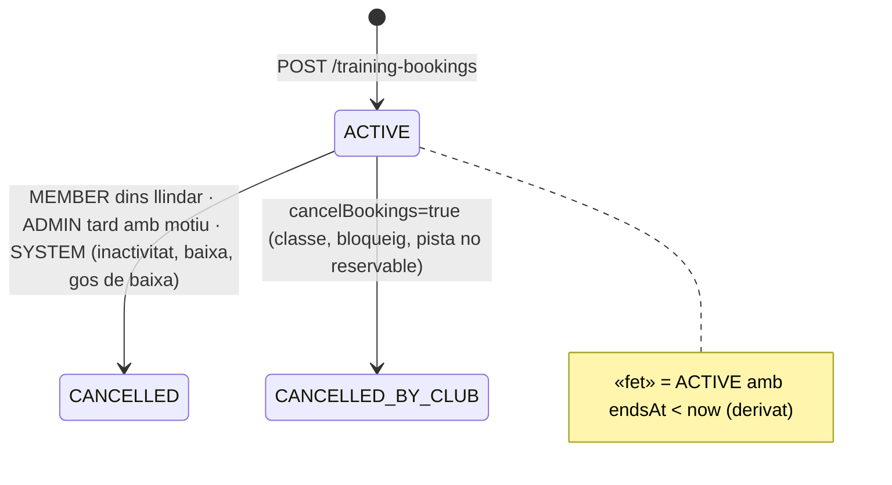
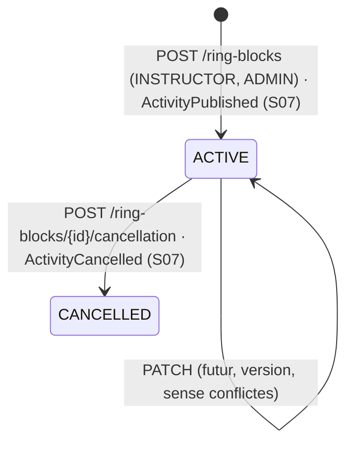

# S09 — Entrenaments lliures

**Etapa:** E5 · **Mòduls:** `FREE_TRAINING` (tota la vertical), `FAMILY_GROUP`, `COURSES` (recorregut muntat abans de reservar — detall a S16), `INACTIVITY` (BR-16) · **Pantalles:** 08, 24 (fitxers a `03-disseny/mockups/pantalles/mobil/`) · **Model:** v1.6 §B (PISTA, ENTRENAMENT_SLOT, BLOQUEIG_PISTA), §C (RESERVA_ENTRENAMENT), GOS + PLATAFORMA §0, §3 (`Dog.freeTrainingOverride`, `Level.grantsFreeTraining`, `Ring.*`, `Member.lastDogForTraining`), §5 (`RingSetup`), §7 (índexs) · **Estat:** esborrany (03-09-2026) · **Versió:** 0.1

## 1. Propòsit i abast

Permet que un gos amb dret («Pot entrenar sol») reservi mitges hores de pista fora de les classes, i que un instructor reservi o bloquegi una pista sense vincular-la a cap alumne. Cobreix: càlcul dels slots (`TrainingSlot`) a partir de l'horari del club, dret per nivell/gos, finestra i comptador setmanal, reserva (`TrainingBooking`) amb «Qualsevol», anul·lació, `RingBlock` de l'instructor (24) i l'aportació d'aquesta vertical als quadres 10/23/D12 i al registre d'ús de pistes.

Fora d'abast: reserves de classes i llista d'espera (S08) · endpoints i render dels quadres del dia/setmana (S06: aquí només es defineix què hi aporta aquesta vertical) · bloqueigs des del calendari D4 (S06, mateix endpoint `/ring-blocks`) · bloqueigs automàtics d'activitats (S07) · assistència i històric (S10) · scheduler d'obertura de setmana i reinici del comptador (S15) · contingut del recorregut muntat (S16) · notificacions: renderitzat i canals (S11).

## 2. Pantalles i rutes

| Mockup | App | Ruta | Rol | Notes de comportament |
|---|---|---|---|---|
| 08 Entrenaments | `apps/clubs` | `/training` (pestanya «Entrenaments» del tabbar) | MEMBER (i impersonació) | **Visibilitat**: la pestanya només existeix si `FREE_TRAINING` és actiu i `GET /me/training-summary` retorna `eligibleDogs` no buit; per URL sense dret → redirecció a `/`. **Càrrega**: esquelet fins a tenir summary + slots; error → avís amb [Torna-ho a provar]. **Gossos**: xips amb tots els `eligibleDogs` (propis i del grup), un de sol seleccionat = `defaultDogId` (darrer recordat). **Dies**: `training.bookingWindowDays`+1 xips («Avui dl 3», «dt 4»…); canviar de dia refetch. **Pistes**: «Qualsevol» (per defecte) + pistes reservables amb punt de color; amb `COURSES` i recorregut muntat, la xip porta indicador i toc → visor S16. **Graella** Matí/Tarda (tall a les 14:00 locals, secció buida no es mostra): `lliure` (vora taronja) · `ocupat` (ratllat, no clicable) · `classe` («HH:mm classe», atenuat, no clicable) · `seleccionat`; en el passat, `ocupat`. Amb «Qualsevol», el slot és lliure si alguna pista ho és; si en tocar-lo n'hi ha >1 de lliures: text «A les {time} hi ha més d'una pista lliure — tria quina vols:» + xips (primera preseleccionada per ordre del catàleg). **Comptador**: targeta «Portes {used}/{limit} entrenaments aquesta setmana» · «reinici {weekOpensAt}» + barra. **Botó**: «CONFIRMA {DIA} · {from}–{to} · {PISTA}» actiu només amb slot (i pista) triats; en confirmar → `POST /training-bookings` → avís d'èxit, refetch, la reserva surt a 03 «LES MEVES RESERVES» («Entrenament · amb {gos}» · «confirmada»). **Al límit**: el botó es substitueix pel missatge segons `cancellableBookings` (R-09-05). Errors 409/422 → missatge per `code` i refetch de la graella. |
| 24 Reservar o bloquejar pista | `apps/clubs` | `/instructor/ring-blocks/new` (des de 20 [RESERVAR O BLOQUEJAR PISTA] i 23) | INSTRUCTOR, ADMIN | Segment «Reserva de pista» / «Bloqueig» (amb `FREE_TRAINING` off només «Bloqueig»). **Motiu** (xips): Reserva → «Classe particular», «Teràpia», «Preparació», «Altres»; Bloqueig → «Manteniment», «Altres». **Dia** (desplegable, fins a l'horitzó de R-09-11) · **franja** («matí» / «tarda») · **pista**: totes les actives (també les no reservables). **Graella** de 30 min de la franja: `lliure` · `ocupat` (classe, bloqueig o reserva viva) · `seleccionat`; selecció contigua. **Nota (opcional)**, màx. 200 car. **Resum**: «Ocupa la pista {ring} de {from} a {to}, surt al quadre global i al registre d'ús de pistes. No es vincula a cap alumne.» **Botó**: «RESERVA LA PISTA» / «BLOQUEJA LA PISTA» → `POST /ring-blocks` → torna a 20/23 amb el bloqueig visible. 409 `RING_BLOCK_CONFLICT` → marca les cel·les en conflicte i refetch. |
| 03, 07, 25 (S08/S10) | `apps/clubs` | — | MEMBER | 03 llista les reserves d'entrenament vives; el detall reutilitza el patró de 07: dia, hora, pista, gos, qui/quan va reservar, [ANUL·LA LA RESERVA] només mentre `now < startsAt − training.cancelThresholdMinutes`; després, text informatiu. 25 mostra «fet» / «anul·lada» / «cancel·lada pel club». |
| 10, 20, 23, D12, D4 (S06/S10) | ambdues | — | tots | Aquesta vertical aporta l'ocupació de pistes (R-09-12): alumne → «Ocupada» + motiu genèric; instructor/admin → «Entren.» + guia i gos, «Bloq.» + motiu (+ nota al detall). La targeta «Reservar o bloquejar pista (sense alumne)» de D12 usa el mateix contracte que 24. |
| «Entrenaments» (menú Camp, escriptori) | `apps/clubs-admin` | `/admin/training` | ADMIN | Sense mockup: llistat universal (`CONVENCIONS_API` §4) de `GET /training-bookings` i `GET /ring-blocks` = registre d'ús de pistes (assumpció, §13). |

Flux de 08 (seqüència de crides):

1. En obrir la pestanya: `GET /me/training-summary` (sense `dogId`) → `eligibleDogs`, `defaultDogId`; si és buit, la pestanya no es mostra.
2. Amb el gos i el dia seleccionats: `GET /training-slots?from={today}&to={today+N}&dogId={dog}` (una sola crida per als N+1 dies; refetch en canviar de gos, en tornar el focus i després de cada mutació) i `GET /me/training-summary?dogId={dog}&date={dia}` per al comptador de la setmana del dia.
3. Tocar un slot lliure: si la xip de pista és concreta → botó actiu; si és «Qualsevol» i `anyFree` amb una sola pista `FREE` → botó actiu amb aquella pista; amb més d'una → text + xips de pista, botó actiu amb la preseleccionada.
4. Confirmar: `POST /training-bookings {dogId, startsAt, ringId}` amb `Idempotency-Key` nou per intent; 201 → avís «Entrenament reservat» (N-06 al feed 11) i refetch (2); 409 `SLOT_TAKEN` → «Aquesta pista ja no està lliure» + refetch; 409 `TRAINING_LIMIT_REACHED` → missatges de R-09-05; 422 → missatge per `code`.
5. Estats de pantalla: *carregant* (esquelet de xips + graella) · *buit* (dia tancat: «El club està tancat aquest dia», `days[].closed`) · *error* (targeta amb [Torna-ho a provar]) · *sense connexió* (última graella en cache del client marcada com a «pot no estar al dia»; el `POST` es bloqueja fins a tenir xarxa).

## 3. Entitats i camps

**`TrainingSlot`** — objecte de valor **calculat**, no persistit (R-09-03). La col·lecció `training_slots` del glossari no es crea a R1. `slotId` = clau determinista `"{ringId}_{startsAt ISO UTC}"` (excepció documentada a la convenció d'UUID: el slot no és un recurs persistit).

| Camp | Tipus | Notes |
|---|---|---|
| ringId, startsAt, endsAt | UUID, instant, instant | `endsAt = startsAt + training.slotMinutes` |
| startsAtLocal, endsAtLocal, date | `HH:mm`, `HH:mm`, `YYYY-MM-DD` | en `club.timeZone` |
| state | `FREE` · `BOOKED` · `BLOCKED` | prioritat BLOCKED > BOOKED > FREE |
| reason | `CLASS` · `RING_BLOCK` · `TRAINING` · `OWN_TRAINING` | `OWN_TRAINING` = reserva del gos consultat (`dogId`) |
| capacity, bookedCount | int | capacitat R-09-02; `BOOKED` quan `bookedCount ≥ capacity` |
| bookable | bool | `FREE ∧ startsAt > now ∧ dins la finestra` (per al rol MEMBER) |
| occupants[], block, classSession | opcionals | només INSTRUCTOR/ADMIN: `{bookingId, memberName, dogName}` · `{id, kind, reason, note, createdByName}` · `{id, description}` |

**`TrainingBooking`** · `training_bookings` (context `clubs/training`). Immutable en el sentit BR-12: mai s'esborra.

| Camp | Tipus | Oblig. | Validació / notes |
|---|---|---|---|
| id, clubId | UUID | sí | `clubId` del JWT |
| memberId | UUID | sí | qui reserva (l'abonat del token o l'impersonat); amb `FAMILY_GROUP`, pot no ser el propietari del gos |
| dogId | UUID | sí | gos amb dret (R-09-01) i accessible per `memberId` |
| ringId, startsAt, endsAt | UUID, instant, instant | sí | slot vàlid de la graella (R-09-03) i pista reservable (R-09-02) |
| slotId | string | sí | derivat, per a esdeveniments i UI |
| seatIndex | int | sí | `0..capacity−1`; guarda d'unicitat (R-09-06) |
| weekStart | instant | sí | inici de la setmana d'entrenament del slot (R-09-05), desnormalitzat per als recomptes |
| state | `ACTIVE` · `CANCELLED` · `CANCELLED_BY_CLUB` | sí | §5; «fet» = `ACTIVE ∧ endsAt < now` (derivat, sense transició) |
| origin | `APP` · `BACKOFFICE` | sí | `BACKOFFICE` = impersonació («Entra com l'abonat»); les anul·lacions de sistema es distingeixen per `cancelledBy` |
| createdAt, createdByAccountId, impersonatedByAccountId? | instant, UUID, UUID | sí | auditoria (R-09-16) |
| cancelledAt, cancelledBy, cancelReason, cancelNote | instant, `MEMBER`·`ADMIN`·`SYSTEM`, enum, string | si anul·lada | `cancelReason`: `MEMBER_REQUEST` · `ADMIN_LATE` · `INACTIVITY` · `MEMBER_LEFT` · `RING_BLOCK` · `CLASS_CONFLICT` · `RING_NOT_RESERVABLE` |
| idempotencyKey | string | no | §7 de `CONVENCIONS_API` |

Índexs: `{clubId, ringId, startsAt, seatIndex}` **únic, parcial** `{state: "ACTIVE"}` (la guarda de concurrència; amb capacitat 1 equival a `{clubId, ringId, startsAt}`) · `{clubId, startsAt}` · `{clubId, dogId, weekStart, state}` · `{clubId, memberId, weekStart, state}`.

**`RingBlock`** · `ring_blocks` (definida a S06; aquí els camps que 24 usa): `ringId` (qualsevol pista activa) · `from`, `to` (instants; `to − from` múltiple de `classes.slotMinutes` i ≥ `training.slotMinutes`) · **`kind`** `RESERVATION` («Reserva de pista») · `BLOCK` («Bloqueig») · **`reason`** `PRIVATE_CLASS` · `THERAPY` · `PREPARATION` · `MAINTENANCE` · `ACTIVITY` · `OTHER` (combinacions vàlides: RESERVATION → PRIVATE_CLASS, THERAPY, PREPARATION, OTHER; BLOCK → MAINTENANCE, OTHER; `ACTIVITY` només via S07) · `note` (≤ 200, visible només a instructors/admins) · `activityId?` · `state` `ACTIVE` · `CANCELLED` · `createdByAccountId`, `createdAt`, `cancelledAt`, `cancelledByAccountId` · `version`. Índex `{clubId, ringId, from, to}`, `{clubId, from}`.

Camps d'altres entitats que aquesta vertical **escriu**: `Member.lastDogForTraining` (UUID, en reservar) · `Dog.trainingSeq` / `Member.trainingSeq` (int tècnic, `$inc` per serialitzar el comptador, R-09-06). **Llegeix**: `Dog.freeTrainingOverride`, `Dog.levelId`, `Dog.status`, `Level.grantsFreeTraining`, `Ring.active/allowsFreeTraining/trainingCapacity/activeSetupId`, `Member.bookingBlock`, `Member.status`, `FamilyGroup`, `ClassSession` (ring, hores, estat), `InactivityPeriod`, `RingSetup`.

## 4. Regles de negoci

**R-09-01 Dret a entrenar.** `canFreeTrain(dog) = dog.status == ACTIVE ∧ (dog.freeTrainingOverride ?? level(dog).grantsFreeTraining)`; amb `levels.enabled = false`, `dog.freeTrainingOverride == true` (null = no). Els gossos elegibles d'un abonat són els propis i, amb `FAMILY_GROUP`, els dels abonats del seu grup (propietari amb `Member.status = ACTIVE`). Paràmetres: `levels.enabled = true`. *Exemple*: Rock (nivell D, `grantsFreeTraining = true`, override null) → sí; Kira (nivell B, override `true`) → sí; Toby (nivell B, override null) → no; Nala (nivell E, override `false`) → no. La Maria (grup amb en Joan, propietari de Kira) veu Rock i Kira.

**R-09-02 Pistes reservables i capacitat.** Un slot existeix per a `Ring.active ∧ Ring.allowsFreeTraining`; `capacity(ring) = ring.trainingCapacity ?? training.capacityPerRingSlot` (Cànic: 1). Els `RingBlock` poden anar a **qualsevol** pista activa. *Exemple*: Cadells i Petita no surten a 08 però sí a 24.

**R-09-03 Càlcul de la graella (calculada, amb cache opcional).** Els slots **no es materialitzen**: es calculen a partir de l'horari, les classes, els bloquejos i les reserves. Algorisme per a un interval de dies locals `[from, to]` i un conjunt de pistes:

1. Per a cada dia local `d`: si `d ∈ club.holidays` o `club.openingHours[dayOfWeek(d)]` és nul → `closed = true`, sense slots.
2. Si no: `start = open`; mentre `start + training.slotMinutes ≤ close`: `startsAt = ZonedDateTime.of(d, start, club.timeZone).toInstant()`, `endsAt = startsAt + slotMinutes`; `start += slotMinutes`. Semàntica Java per al canvi d'hora: hora local dins un buit (primavera) → es desplaça endavant; hora ambigua (tardor) → primera ocurrència. Amb l'horari del Cànic el canvi (02:00–03:00) mai cau dins l'obertura, però l'algorisme no pot fallar-hi.
3. Carrega en una consulta per col·lecció (índexs `{clubId, ringId, …}`): `ClassSession` `DRAFT|ACTIVE` amb `ringId` no nul i solapament amb `[dayStart, dayEnd)`; `RingBlock` `ACTIVE` idem; `TrainingBooking` `ACTIVE` idem.
4. Estat de cada `(ring, slot)`, per prioritat: solapa una classe → `BLOCKED/CLASS`; solapa un bloqueig → `BLOCKED/RING_BLOCK`; `bookedCount ≥ capacity(ring)` → `BOOKED/TRAINING` (o `OWN_TRAINING` si alguna reserva és del `dogId` consultat); altrament `FREE`. «Solapar» = `a.from < slot.endsAt ∧ a.to > slot.startsAt`.
5. Per al rol MEMBER: `bookable = FREE ∧ startsAt > now ∧ dins la finestra (R-09-04)`; `anyFree` = alguna pista `FREE` al slot.

Cache recomanada: capa estàtica (passos 1–3 sense reserves) per `{clubId, date}`, TTL 60 s, invalidada pels esdeveniments de §7; la capa de reserves sempre en viu. **La font de veritat de la concurrència és l'índex únic (R-09-06), mai la cache.** Paràmetres: `training.slotMinutes = 30`, `club.openingHours = dl–dg 07:00–22:00`, `club.holidays`. *Exemples*: dl 05-10-2026 (CEST): 30 slots per pista, 07:00 local = `05:00Z`; dg 25-10-2026 (canvi a CET a les 03:00): també 30 slots, 07:00 local = `06:00Z`; el festiu 12-10-2026 no té slots; una classe 08:30–09:40 a Muntanya bloqueja els slots 08:30, 09:00 i 09:30.

**R-09-04 Finestra de reserva.** Un MEMBER pot reservar slots amb `date ∈ [today, today + training.bookingWindowDays]` (dies naturals en hora local del club) i `startsAt > now`. `GET /training-slots` retalla l'interval a la finestra; `POST` fora → `422 SLOT_OUT_OF_WINDOW`. Paràmetre: `training.bookingWindowDays = 3`. *Exemple*: dl 05-10-2026 23:59 local (`21:59Z`) → reservable fins dj 08-10; a les 00:00 de dt 06-10 (`22:00Z` del dia 5) s'obre dv 09-10 sencer (des de les 07:00).

**R-09-05 Setmana d'entrenament i comptador.** La setmana d'entrenament és `[W, W + 1 setmana)` amb `W` = la darrera ocurrència de `bookings.weekOpensAt` (dia + hora **locals**) ≤ `startsAt` del slot. El comptador d'una unitat (`bookings.limitUnit`: `DOG` → `dogId`; `MEMBER` → `memberId`) = reserves `ACTIVE` (també les ja fetes) amb `weekStart = W`; límit `training.maxPerWeek`. Es compta per la **data de la sessió**, no pel moment de reservar (coherent amb BR-01 i BR-16); a `W` el comptador de la setmana nova és el de les sessions ja reservades dins d'ella. Al límit: si l'abonat té reserves vives futures anul·lables (R-09-10) → «Has arribat al límit de {limit} reserves per aquesta setmana: anul·la alguna de les properes per reservar-ne una altra.»; si no → «Has arribat al límit de {limit} reserves per aquesta setmana.». El comptador de 08 és el de la setmana del **dia seleccionat**. Paràmetres: `bookings.weekOpensAt = {SUNDAY, 20:00}`, `training.maxPerWeek = 3`, `bookings.limitUnit = DOG`. *Exemples*: Rock té reserves dt 06-10 07:30 (feta) i dj 08-10 20:30 → 2/3 a la setmana `[dg 04-10 20:00, dg 11-10 20:00)`; dv 09-10 reserva dl 12-10 08:00 → setmana següent, 1/3. Horari d'estiu: `W` = dg 18-10 20:00 local = `18:00Z`; `W'` = dg 25-10 20:00 local = `19:00Z` (169 h); un slot dg 25-10 19:30 és de la setmana `W`, un de 20:00 és de `W'`. Amb `limitUnit = MEMBER`, la Maria amb Rock (2) i Kira (1) va 3/3.

**R-09-06 Un gos per pista i slot; guarda de concurrència.** Una reserva ocupa un `seatIndex` del slot (`0..capacity−1`, el més baix lliure). Creació = **una transacció Mongo** que es reintenta sencera (màx. 3) en `DuplicateKey` o `WriteConflict`:

1. `$inc` de `Dog.trainingSeq` (`limitUnit = DOG`) o `Member.trainingSeq` (`MEMBER`): dues transaccions concurrents de la mateixa unitat entren en `WriteConflict` i la perdedora es reintenta veient la reserva ja confirmada (serialització del comptador).
2. Comprovacions R-09-01, 02, 04, 08 (elegibilitat, pista, finestra, abonat); el slot ha d'existir a la graella (R-09-03) → si no, `400 SLOT_NOT_ON_GRID` (desalineat) o `422 CLUB_CLOSED` (festiu/fora d'horari).
3. El gos no té cap `TrainingBooking` ni `Booking` de classe (S08) `ACTIVE` que se solapi → si en té, `409 DOG_ALREADY_BOOKED`.
4. Comptador de la setmana (R-09-05) `< training.maxPerWeek` (o `override.limit` de R-09-16) → si no, `409 TRAINING_LIMIT_REACHED`.
5. Estat del slot: `BLOCKED` → `409 SLOT_TAKEN {reason: CLASS|RING_BLOCK}`; `bookedCount ≥ capacity` → `409 SLOT_TAKEN {reason: TRAINING, freeRings}` (o següent pista si «Qualsevol», R-09-07).
6. Insert amb `seatIndex` lliure; l'índex únic parcial `{clubId, ringId, startsAt, seatIndex}` sobre `ACTIVE` és la garantia final encara que la graella llegida fos vella.
7. `Member.lastDogForTraining = dogId`; `AuditEntry`; outbox `TrainingBooked`; commit.

*Exemple*: Pau i Júlia confirmen 08:30 Muntanya al mateix segon: un insert passa; l'altre rep `DuplicateKey` → reintent → pas 5 veu `bookedCount = 1 = capacity` → `409 SLOT_TAKEN {reason: TRAINING, freeRings: [Carretera]}`. Amb `Ring.trainingCapacity = 2` a Central, els seients 0 i 1 admeten dos gossos alhora.

**R-09-07 «Qualsevol».** Si el `POST` no porta `ringId`, el servidor tria la primera pista `FREE` d'aquell slot per **ordre del catàleg** (`Ring.order` de D16; empat → `name` ascendent); si en el reintent la pista ja no és lliure passa a la següent; cap de lliure → `409 SLOT_TAKEN`. La UI, si hi ha >1 pista lliure, les ofereix com a xips i envia `ringId` (preselecció = mateix ordre). *Exemple*: 08:30 amb Muntanya, Central i Carretera lliures → Muntanya; si Muntanya s'ocupa entre la graella i el `POST` → Central.

**R-09-08 Condicions de l'abonat.** Refusos (per ordre): `Member.status ≠ ACTIVE` o membresia `SUSPENDED` → `422 MEMBER_NOT_ACTIVE`; `Member.bookingBlock.active` → `422 BOOKING_BLOCKED` (l'anul·lació segueix permesa); amb `INACTIVITY`: `date(startsAt)` dins d'un `InactivityPeriod` aprovat/actiu de l'abonat → `422 INACTIVITY_PERIOD` (BR-16: compta la data de la sessió). Paràmetre: `inactivity.cancelBookingsOnApproval = true` (R-09-14). *Exemple*: inactivitat del 01-11 al 30-11 aprovada → dv 30-10 pot reservar dl 02-11? No: `INACTIVITY_PERIOD`.

**R-09-09 Confirmació i memòria del darrer gos.** En crear la reserva es desa `Member.lastDogForTraining`; `GET /me/training-summary` retorna `defaultDogId` = aquest gos si encara és elegible, si no el primer elegible (propis abans que els del grup, després `Dog.name`). Es notifica N-06 (R-09-16 per a l'origen).

**R-09-10 Anul·lació.** Un MEMBER (o impersonació) pot anul·lar una reserva `ACTIVE` mentre `now ≤ startsAt − training.cancelThresholdMinutes` (aritmètica sobre instants, immune a l'horari d'estiu); després → `409 TRAINING_CANCEL_TOO_LATE {threshold, minutesBefore}`. Amb token d'impersonació l'ADMIN pot anul·lar tard amb `reason` obligatori (`cancelReason = ADMIN_LATE`, auditat). L'anul·lació allibera el seient i el comptador de la setmana i emet `TrainingCancelled` (N-07). Paràmetre: `training.cancelThresholdMinutes = 120`. *Exemple*: slot dg 25-10 08:00 local (`07:00Z`): anul·lable fins a les 06:00 local (`05:00Z`); a les 06:01 → `TRAINING_CANCEL_TOO_LATE`.

**R-09-11 Reserva o bloqueig de pista (instructor).** `RingBlock` amb `kind` + `reason` vàlids (§3), `ringId` actiu, `from/to` alineats a `classes.slotMinutes` (Cànic 10 min; 24 ofereix la graella de 30 min de la franja), durada ≥ `training.slotMinutes`, `from > now`, `date(from) ≤ today + 60 dies` (assumpció, paràmetre proposat a §13). Conflictes → `409 RING_BLOCK_CONFLICT {conflicts: [{type: CLASS|RING_BLOCK|TRAINING, from, to, label}]}`: cap solapament amb `ClassSession` `DRAFT/ACTIVE` de la pista, `RingBlock` `ACTIVE` ni `TrainingBooking` `ACTIVE`; l'instructor no pot forçar (demana a l'admin: R-09-13). `kind = RESERVATION` requereix `FREE_TRAINING`. Qualsevol INSTRUCTOR o ADMIN pot modificar (`PATCH`, només futurs, `version`) o anul·lar qualsevol bloqueig; els d'`activityId` només via S07 (`409 RING_BLOCK_MANAGED_BY_ACTIVITY`). *Exemple*: dj 08-10 Petita 18:00–19:00 (dues cel·les de 30 min) «Classe particular», nota «Particular amb l'alumna de la tarda» → ocupa Petita per a tothom; l'alumne veu «Ocupada · classe particular», l'instructor «Bloq. · classe particular» i la nota al detall.

**R-09-12 Aportació als quadres (10/23/D12/D4).** `TrainingOccupancyService.occupancy(range, ringIds?, viewerRole)` retorna intervals `{ringId, from, to, type: TRAINING|RING_BLOCK, reason, memberName?, dogName?, note?, blockId?/bookingId?}`; per a MEMBER es redacta a `{type, reason}` (cel·la «Ocupada» + «entren.» o el motiu del bloqueig en minúscula: «manteniment», «classe particular»…, mai qui ni la nota); INSTRUCTOR/ADMIN reben noms («Entren. · Pau + Blat»), motiu i nota. Les reserves d'entrenament ocupen `training.slotMinutes` (mitja alçada a D12). S06 fusiona aquests intervals amb les classes.

**R-09-13 Conflictes creuats.** `TrainingConflictService.findActiveBookings(ringId, from, to)` és obligatori per a S05 (desactivar una pista o treure-li `allowsFreeTraining`), S06 (crear/moure una classe a una pista, bloqueig des de D4) i S07 (bloqueig d'activitat). Amb reserves vives: refús `409 RING_HAS_BOOKINGS {bookings: [...]}` llevat que l'ADMIN enviï `cancelBookings: true` → cada reserva passa a `CANCELLED_BY_CLUB` (`cancelReason` segons el cas) dins la mateixa transacció, amb `TrainingCancelled{by: ADMIN, origin: BACKOFFICE}` (avís N-47 proposat; mentrestant N-07). *Exemple*: l'admin bloqueja Carretera dt 16:00–18:00 per manteniment amb la reserva de Sergio + Thai a les 17:00 → llista + confirmació → anul·lada pel club + SMS.

**R-09-14 Anul·lacions de sistema.** `InactivityResolved{decision: APPROVED}` amb `inactivity.cancelBookingsOnApproval = true` → reserves `ACTIVE` amb `date(startsAt)` dins l'interval → `CANCELLED` (`SYSTEM`, `INACTIVITY`, N-07). `MemberStatusChanged{after ∈ LEFT|SUSPENDED}` → reserves futures de l'abonat → `CANCELLED` (`SYSTEM`, `MEMBER_LEFT`, sense N-07). `DogDeactivated` → idem per al gos. *Exemple*: baixa amb efecte 31-10 → les reserves des de l'01-11 s'anul·len en produir-se l'esdeveniment.

**R-09-15 Recorregut muntat.** Amb `COURSES` i (`courses.showSetupToMembers` o rol ≠ MEMBER), `GET /training-slots` inclou `rings[].setup = {id, kind, levelNames[], builtAt, expectedUntil}` del `RingSetup` `ACTIVE` (`Ring.activeSetupId`); sense mòdul, el camp no existeix. Paràmetre: `courses.showSetupToMembers = true`.

**R-09-16 Origen, impersonació i auditoria.** Token normal → `origin = APP`; token d'impersonació → `origin = BACKOFFICE`, `impersonatedByAccountId` = actor, `AuditEntry` amb els dos ids (crear i anul·lar). L'ADMIN impersonant pot: anul·lar tard amb motiu (R-09-10) i reservar per sobre del límit amb `override: {limit: true, reason}` (RF-RES-06; `cancelReason` no aplica, s'audita `reason`); un token sense impersonació que enviï `override` → `403 OVERRIDE_NOT_ALLOWED`. La finestra R-09-04 i la unicitat R-09-06 no es poden saltar.

## 5. Estats i transicions



| Transició | Qui | Condició | Efectes | Esdeveniment |
|---|---|---|---|---|
| → ACTIVE | MEMBER, impersonació | R-09-01…08 | seient ocupat, comptador +1, `lastDogForTraining` | `TrainingBooked` |
| ACTIVE → CANCELLED | MEMBER, impersonació, SYSTEM | dins llindar, o ADMIN amb motiu, o R-09-14 | seient i comptador alliberats | `TrainingCancelled{by}` |
| ACTIVE → CANCELLED_BY_CLUB | ADMIN (via S05/S06/S07) | `cancelBookings: true` | idem + avís amb SMS | `TrainingCancelled{by: ADMIN}` |



| Transició | Qui | Condició | Efectes | Esdeveniment |
|---|---|---|---|---|
| → ACTIVE | INSTRUCTOR, ADMIN, S07 | R-09-11 | slots → BLOCKED, quadres, registre d'ús | `RingBlockCreated` |
| ACTIVE → ACTIVE | INSTRUCTOR, ADMIN | `from > now`, `version` | recàlcul de conflictes | `RingBlockUpdated` (proposat) |
| ACTIVE → CANCELLED | INSTRUCTOR, ADMIN, S07 | no gestionat per activitat (o des de S07) | slots alliberats | `RingBlockCancelled` |

## 6. API

Totes sota `/api/v1`, tenant pel JWT, `@RequiresModule("FREE_TRAINING")` llevat de `/ring-blocks` (només `kind = RESERVATION` el requereix).

| Mètode | Ruta | Rol(s) | Mòdul | Idempotent | Descripció | Cos/paràmetres clau | Respostes i errors |
|---|---|---|---|---|---|---|---|
| GET | `/training-slots` | MEMBER, INSTRUCTOR, ADMIN | FREE_TRAINING | sí | Graella per dia/slot/pista | `from`, `to` (`YYYY-MM-DD`; MEMBER: retallat a la finestra; altres: ≤ 31 dies), `dogId?`, `ringId?` | 200 (forma sota la taula) · 400 `VALIDATION_ERROR` · 404 `MODULE_DISABLED` |
| GET | `/me/training-summary` | MEMBER | FREE_TRAINING | sí | Gossos elegibles, gos per defecte, comptador de la setmana de `date` | `dogId?`, `date?` (per defecte avui) | 200 · 404 (gos no accessible o mòdul off) |
| GET | `/me/training-bookings` | MEMBER | FREE_TRAINING | sí | Reserves pròpies (i del grup) | `from?`, `to?`, `state?` | 200 `{items}` amb `cancellableUntil` per reserva |
| POST | `/training-bookings` | MEMBER (impersonació admesa) | FREE_TRAINING | `Idempotency-Key` | Reservar | `{dogId, startsAt, ringId?, override?: {limit, reason}}` | 201 reserva · 400 `SLOT_NOT_ON_GRID` · 404 gos/pista no accessible · 409 `SLOT_TAKEN`, `TRAINING_LIMIT_REACHED`, `DOG_ALREADY_BOOKED` · 422 `DOG_NOT_ALLOWED`, `RING_NOT_RESERVABLE`, `SLOT_OUT_OF_WINDOW`, `CLUB_CLOSED`, `BOOKING_BLOCKED`, `INACTIVITY_PERIOD`, `MEMBER_NOT_ACTIVE` · 403 `OVERRIDE_NOT_ALLOWED` |
| GET | `/training-bookings/{id}` | MEMBER (pròpia), INSTRUCTOR, ADMIN | FREE_TRAINING | sí | Detall | — | 200 · 404 |
| POST | `/training-bookings/{id}/cancellation` | MEMBER (pròpia, impersonació) | FREE_TRAINING | sí (estat) | Anul·lar | `{reason?}` (obligatori si tard amb impersonació) | 200 reserva · 409 `TRAINING_CANCEL_TOO_LATE`, `INVALID_STATE` |
| GET | `/training-bookings` | ADMIN (RW), INSTRUCTOR (R) | FREE_TRAINING | sí | Registre d'ús: llistat universal §4 | `filter=` sobre `date, ringId, memberId, dogId, state, origin`; `/export` | 200 pàgina |
| POST | `/ring-blocks` | INSTRUCTOR, ADMIN | — (RESERVATION → FREE_TRAINING) | `Idempotency-Key` | Reservar/bloquejar pista | `{ringId, from, to, kind, reason, note?}` | 201 · 400 `INVALID_TIME_RANGE` · 409 `RING_BLOCK_CONFLICT` · 404 `MODULE_DISABLED` (RESERVATION amb mòdul off) |
| PATCH | `/ring-blocks/{id}` | INSTRUCTOR, ADMIN | — | `version` | Modificar (futur) | camps de creació + `version` | 200 · 409 `STALE_VERSION`, `RING_BLOCK_CONFLICT`, `RING_BLOCK_MANAGED_BY_ACTIVITY`, `INVALID_STATE` |
| POST | `/ring-blocks/{id}/cancellation` | INSTRUCTOR, ADMIN | — | sí (estat) | Anul·lar | — | 200 · 409 `INVALID_STATE`, `RING_BLOCK_MANAGED_BY_ACTIVITY` |
| GET | `/ring-blocks`, `/ring-blocks/{id}` | MEMBER (redactat), INSTRUCTOR, ADMIN | — | sí | Llistat universal / detall | `from`, `to`, `ringId?`, `kind?`, `state?` | 200 (MEMBER: sense `note`, `createdBy`) |

Forma de `GET /training-slots` (rol MEMBER, `dogId = Rock`):

```json
{ "timeZone": "Europe/Madrid", "slotMinutes": 30, "window": {"from": "2026-10-05", "to": "2026-10-08"}, "dogEligible": true,
  "rings": [ {"id": "r-mun", "name": "Muntanya", "shortName": "MUN", "color": "#F2B58C", "order": 1, "capacity": 1,
              "setup": {"id": "s-1", "kind": "AGILITY", "levelNames": ["D"], "builtAt": "2026-10-04T16:10:00Z", "expectedUntil": "2026-10-11"}},
             {"id": "r-cen", "name": "Central", "shortName": "CEN", "color": "#8FCE8F", "order": 2, "capacity": 1} ],
  "days": [ {"date": "2026-10-05", "closed": false, "slots": [ "…" ]},
            {"date": "2026-10-06", "closed": false, "slots": [
      {"startsAt": "2026-10-06T05:30:00Z", "startsAtLocal": "07:30", "endsAtLocal": "08:00", "anyFree": false, "bookable": false,
       "rings": {"r-mun": {"state": "BLOCKED", "reason": "CLASS"}, "r-cen": {"state": "BOOKED", "reason": "OWN_TRAINING", "bookingId": "tb-6"}}},
      {"startsAt": "2026-10-06T06:30:00Z", "startsAtLocal": "08:30", "endsAtLocal": "09:00", "anyFree": true, "bookable": true,
       "rings": {"r-mun": {"state": "FREE"}, "r-cen": {"state": "BOOKED", "reason": "TRAINING"}}} ] } ] }
```
El `slotId` d'una cel·la és `{ringId}_{startsAt}` (derivable, no es repeteix a la resposta). Per a INSTRUCTOR/ADMIN cada `rings[ringId]` afegeix `occupants[]`, `block` i `classSession` (§3). Agregat «Qualsevol» al front: `anyFree` → lliure; si no, tot `CLASS` → «classe»; altrament ratllat.

Forma de `GET /me/training-summary?dogId=d-rock&date=2026-10-06`:

```json
{ "eligibleDogs": [{"id": "d-rock", "name": "Rock", "levelName": "D", "ownerName": null, "rightSource": "LEVEL"},
                   {"id": "d-kira", "name": "Kira", "levelName": "B", "ownerName": "Joan", "rightSource": "MANUAL"}],
  "defaultDogId": "d-rock", "limitUnit": "DOG", "weekOpensAt": {"dayOfWeek": "SUNDAY", "time": "20:00"},
  "week": {"start": "2026-10-04T18:00:00Z", "end": "2026-10-11T18:00:00Z", "current": true},
  "counter": {"used": 2, "limit": 3, "remaining": 1, "resetsAt": "2026-10-11T18:00:00Z"},
  "cancellableBookings": [{"id": "tb-7", "startsAt": "2026-10-08T18:30:00Z", "ringName": "Central", "cancellableUntil": "2026-10-08T16:30:00Z"}],
  "bookingBlock": null, "inactivity": null }
```

`POST /training-bookings` (capçalera `Idempotency-Key: 6f1c…`) i resposta 201:

```json
{ "dogId": "d-rock", "startsAt": "2026-10-05T06:30:00Z", "ringId": "r-mun" }
```
```json
{ "id": "tb-9", "dogId": "d-rock", "dogName": "Rock", "memberId": "m-maria", "ringId": "r-mun", "ringName": "Muntanya",
  "slotId": "r-mun_2026-10-05T06:30:00Z", "startsAt": "2026-10-05T06:30:00Z", "endsAt": "2026-10-05T07:00:00Z",
  "startsAtLocal": "08:30", "endsAtLocal": "09:00", "date": "2026-10-05", "state": "ACTIVE", "origin": "APP",
  "cancellableUntil": "2026-10-05T04:30:00Z", "createdAt": "2026-10-03T17:02:11Z",
  "counter": {"used": 3, "limit": 3, "remaining": 0}, "impersonation": null }
```

`POST /ring-blocks` (INSTRUCTOR) i resposta 201:

```json
{ "ringId": "r-pet", "from": "2026-10-08T16:00:00Z", "to": "2026-10-08T17:00:00Z", "kind": "RESERVATION", "reason": "PRIVATE_CLASS", "note": "Particular amb l'alumna de la tarda" }
```
```json
{ "id": "rb-3", "ringId": "r-pet", "ringName": "Petita", "from": "2026-10-08T16:00:00Z", "to": "2026-10-08T17:00:00Z", "fromLocal": "18:00", "toLocal": "19:00", "date": "2026-10-08",
  "kind": "RESERVATION", "reason": "PRIVATE_CLASS", "note": "Particular amb l'alumna de la tarda", "state": "ACTIVE", "createdByName": "Estel", "createdAt": "2026-10-05T09:41:00Z", "version": 1 }
```

Errors amb `details`: `TRAINING_LIMIT_REACHED {limit, used, weekStart, weekEnd, cancellableBookings[]}` · `SLOT_TAKEN {ringId, startsAt, reason, freeRings[]}` · `SLOT_OUT_OF_WINDOW {from, to}` · `TRAINING_CANCEL_TOO_LATE {thresholdMinutes, minutesBefore}` · `RING_BLOCK_CONFLICT {conflicts[]}` · `RING_HAS_BOOKINGS {bookings[]}`. Tots a `ErrorCode` amb missatge a `messages_{ca,es,en}.properties`.

## 7. Esdeveniments

**Emesos** (outbox, mateixa transacció): `TrainingBooked {trainingBookingId, slotId, ringId, memberId, dogId, origin}` · `TrainingCancelled {trainingBookingId, slotId, ringId, memberId, dogId, origin}` (+ `by`, `cancelReason`, `late`: ampliació proposada a §13) · `RingBlockCreated` / `RingBlockCancelled {blockId, ringId, from, to, reason, activityId?}` · `RingBlockUpdated` (proposat).

**Consumits** (consumidor `training` de l'outbox, idempotent per `eventId`):

| Esdeveniment | Emès a | Què fa aquesta vertical |
|---|---|---|
| `ClassSessionCreated/Updated`, `ClassCancelledByClub`, `ClassAutoCancelled`, `WeekGenerated`, `WeekValidated` | S06/S15 | invalida la cache de graella dels dies afectats |
| `RingBlockCreated/Cancelled`, `ActivityPublished/Cancelled` | S06/S07/S09 | idem |
| `ParameterChanged{training.*, club.openingHours, club.holidays, bookings.weekOpensAt, bookings.limitUnit}`, `RingChanged` | S02/S05 | invalida tota la cache de graella i de summary del club |
| `DogFreeTrainingChanged`, `DogLevelChanged`, `LevelChanged` | S03/S05 | cap estat: l'elegibilitat és calculada; la pestanya 08 es reavalua al següent `GET /me/training-summary` (focus) |
| `InactivityResolved{decision: APPROVED}` | S13 | R-09-14: anul·la les reserves amb sessió dins l'interval (`SYSTEM`, `INACTIVITY`) |
| `MemberStatusChanged{after: LEFT|SUSPENDED}`, `DogDeactivated` | S03/S13 | R-09-14: anul·la les reserves futures (`SYSTEM`, `MEMBER_LEFT`) |
| `WeekOpened`, `TrainingCounterReset` | S15 | invalida el summary; **cap comptador a reiniciar** (és calculat per setmana de sessió) |

## 8. Notificacions

| Codi | Moment | Públic → canals | Variables |
|---|---|---|---|
| N-06 Entrenament reservat | `TrainingBooked` (qualsevol origen) | MEMBER → APP | `dog_name`, `date`, `time` («8:30–9:00»), `ring_name` |
| N-07 Entrenament anul·lat | `TrainingCancelled` llevat de `cancelReason = MEMBER_LEFT` | MEMBER → APP | idem |
| N-13 Recordatori | `ReminderDue` (S15 llegeix `training_bookings` `ACTIVE` i `Member.notificationPreferences.reminderMinutesBefore`) | MEMBER → APP+PUSH | idem |
| N-31 Recorregut nou | S16 (`RingSetupChanged`, destinataris = abonats amb algun gos elegible: R-09-01 exposat com a `TrainingEligibilityService.membersWithRight()`) | — | — |
| N-47 (proposta §13) | `TrainingBooked/Cancelled{origin: BACKOFFICE}` o `by ≠ MEMBER` | MEMBER → APP+EMAIL+SMS | `dog_name`, `date`, `time`, `ring_name`, `admin_text` |

## 9. Paràmetres i mòduls

Llegeix: `training.slotMinutes` (30) · `training.bookingWindowDays` (3) · `training.maxPerWeek` (3) · `training.cancelThresholdMinutes` (120) · `training.capacityPerRingSlot` (1, àmbit `ring`) · `training.freeTrainingRequiresLicense` (false; **informatiu**, no es valida) · `bookings.weekOpensAt` · `bookings.limitUnit` · `levels.enabled` · `classes.slotMinutes` (granularitat dels bloquejos) · `club.openingHours` · `club.holidays` · `club.timeZone` · `courses.showSetupToMembers` · `inactivity.cancelBookingsOnApproval`.

| Mòdul | Desactivat |
|---|---|
| `FREE_TRAINING` | `/training-slots`, `/training-bookings`, `/me/training-*` → `404 MODULE_DISABLED`; pestanya 08 absent; 24 només «Bloqueig» (`kind = RESERVATION` → 404); quadres sense «Ocupada · entren.»; `TrainingOccupancyService` només retorna bloquejos; S15 no reinicia res; D11 bloc Entrenaments i D16 «Reservable per entrenaments» amagats |
| `FAMILY_GROUP` | `eligibleDogs` = només gossos propis; `ownerName` sempre null |
| `COURSES` | sense `rings[].setup`, sense indicador a les xips ni visor |
| `INACTIVITY` | sense comprovació `INACTIVITY_PERIOD` ni consum d'`InactivityResolved` |
| `levels.enabled = false` | dret només per `freeTrainingOverride == true`; `levelName` null a `eligibleDogs` |
| `bookings.limitUnit = MEMBER` | comptador per `memberId` sumant tots els gossos; `$inc` sobre `Member.trainingSeq` |

## 10. i18n i localització

- Namespaces: `training` (08: `training:dogs.select`, `training:days.today` = «Avui {day}», `training:rings.any` = «Qualsevol», `training:grid.morning/afternoon`, `training:grid.classLabel` = «classe», `training:anyRing.choose` = «A les {time} hi ha més d'una pista lliure — tria quina vols:», `training:counter.title` = «Portes {used}/{limit} entrenaments aquesta setmana», `training:counter.reset` = «reinici {weekOpensAt}», `training:confirm.button` = «Confirma {day} · {from}–{to} · {ring}» (majúscules per CSS), `training:limit.withCancellable`, `training:limit.none`) · `instructor` (24: `instructor:ringBlock.kind.RESERVATION/BLOCK`, `.reason.*`, `.note.placeholder` = «Nota (opcional)», `.summary`, `.submit.RESERVATION` = «Reserva la pista», `.submit.BLOCK` = «Bloqueja la pista») · `enums:trainingBookingState.*`, `enums:ringBlockKind.*`, `enums:ringBlockReason.*`, `enums:slotReason.*` · `errors:` per a cada codi de §6.
- Back: `notif.N-06.*`, `notif.N-07.*`, `error.<CODE>` en `ca`, `es`, `en`. Els noms de pista (`Ring.name`) i de gos no es tradueixen; `Level.name` és `LocalizedText`.
- Fus horari: tota data de negoci (dia de la finestra, setmana d'entrenament, llindar) es calcula amb `club.timeZone` al back; el front formata amb `fmtDate(weekday)`/`fmtTime` i el `timeZone` de `/branding`. Sense gènere ni perfil de país. Cap terme de la llista prohibida de `CONVENCIONS_I18N` §1 als textos d'UI (la unitat abonat+gos només s'anomena *pair* al codi).

## 11. Criteris d'acceptació i tests obligatoris

**Domini (unitaris)**
- T-09-01 (R-09-01) Given els quatre gossos de l'exemple, When `canFreeTrain`, Then Rock i Kira sí, Toby i Nala no; amb `levels.enabled=false` només Kira.
- T-09-02 (R-09-01) Given `FAMILY_GROUP` on/off, When `eligibleDogs(Maria)`, Then [Rock, Kira] / [Rock].
- T-09-03 (R-09-02) Given Petita `allowsFreeTraining=false` i Central `trainingCapacity=2`, When es calcula la graella, Then Petita no hi és i Central té `capacity=2`.
- T-09-04 (R-09-03) Given `openingHours` dl–dg 07:00–22:00 i festiu 12-10-2026, When graella del 05-10 i del 12-10, Then 30 slots (07:00 = `05:00Z`) i 0 slots.
- T-09-05 (R-09-03) Given dg 25-10-2026 a `Europe/Madrid` i el mateix club a `America/Argentina/Buenos_Aires`, When graella, Then 30 slots amb 07:00 = `06:00Z` i `10:00Z` respectivament.
- T-09-06 (R-09-03) Given classe `DRAFT` 08:30–09:40 a Muntanya, bloqueig 16:00–18:00 a Carretera i reserva de Rock 09:30 Central, When graella amb `dogId=Rock`, Then 08:30/09:00/09:30 Muntanya `BLOCKED/CLASS`, 16:00–17:30 Carretera `BLOCKED/RING_BLOCK`, 09:30 Central `BOOKED/OWN_TRAINING`.
- T-09-07 (R-09-04) Given ara = 05-10-2026 23:59 local, When `POST` per al 09-10 07:00, Then `422 SLOT_OUT_OF_WINDOW`; a les 00:00 del 06-10 → 201.
- T-09-08 (R-09-05) Given l'exemple de Rock, When comptador setmana 04-10 i 11-10, Then 2/3 i 0/3; una reserva anul·lada no compta; una de feta sí.
- T-09-09 (R-09-05) Given `weekOpensAt={SUNDAY,20:00}` i horari d'estiu, When `weekStart` d'un slot dg 25-10 19:30 i d'un de 20:00, Then `18:00Z` del 18-10 i `19:00Z` del 25-10.
- T-09-10 (R-09-05) Given `limitUnit=MEMBER`, When la Maria té Rock ×2 i Kira ×1, Then 3/3 i `TRAINING_LIMIT_REACHED` amb `cancellableBookings` només les futures dins llindar.
- T-09-11 (R-09-07) Given Muntanya, Central, Carretera lliures, When `POST` sense `ringId`, Then Muntanya; amb Muntanya ocupada → Central (determinisme per `order`).
- T-09-12 (R-09-10) Given slot dg 25-10 08:00 local i llindar 120, When s'anul·la a les 05:59 local i a les 06:01, Then 200 i `409 TRAINING_CANCEL_TOO_LATE {minutesBefore: 119}`.
- T-09-13 (R-09-11) Given `from/to` no alineats o `to−from < 30 min`, Then `400 INVALID_TIME_RANGE`; `kind=BLOCK` amb `reason=THERAPY` → `400 VALIDATION_ERROR`.
- T-09-14 (R-09-03, R-09-06) Given `startsAt` 08:20 (desalineat), 06:30 (abans d'obrir) i 12-10-2026 09:00 (festiu), When `POST`, Then `400 SLOT_NOT_ON_GRID`, `422 CLUB_CLOSED`, `422 CLUB_CLOSED`.
- T-09-15 (R-09-04) Given ara = 05-10-2026 08:31 local, When `POST` per al slot 08:30 d'avui, Then `422 SLOT_OUT_OF_WINDOW` (ja començat); per al 09:00 → 201.

**Integració (endpoint)**
- T-09-16 (R-09-06, R-09-09) Camí feliç `POST /training-bookings` → 201, `Member.lastDogForTraining` actualitzat, `TrainingBooked` a l'outbox, N-06 encuada; `Idempotency-Key` repetida → mateixa resposta i una sola reserva.
- T-09-17 (R-09-08) Given bloqueig de reserves actiu / inactivitat aprovada 01-11–30-11 / abonat `SUSPENDED`, Then `422 BOOKING_BLOCKED` / `INACTIVITY_PERIOD` (slot 02-11) / `MEMBER_NOT_ACTIVE`; anul·lar amb bloqueig actiu → 200.
- T-09-18 (R-09-06) Given Rock amb classe (S08) dt 08:30–09:40 Central, When reserva d'entrenament dt 09:00 Muntanya, Then `409 DOG_ALREADY_BOOKED`.
- T-09-19 (R-09-11, R-09-12) `POST /ring-blocks` per un instructor → 201, `RingBlockCreated`; `GET /training-slots` marca `BLOCKED/RING_BLOCK`; `occupancy()` retorna nota per a INSTRUCTOR i no per a MEMBER.
- T-09-20 (R-09-11) Given reserva viva de Sergio + Thai 17:00 Carretera, When instructor bloqueja 16:00–18:00, Then `409 RING_BLOCK_CONFLICT` amb el conflicte `TRAINING`.
- T-09-21 (R-09-13) Given la mateixa situació, When ADMIN envia `cancelBookings: true` (via S06), Then bloqueig creat, reserva `CANCELLED_BY_CLUB` (`RING_BLOCK`) i `TrainingCancelled{by: ADMIN}` en una sola transacció.
- T-09-22 (R-09-15) Given `COURSES` on i `RingSetup` actiu a Muntanya, Then `rings[0].setup` present; amb `courses.showSetupToMembers=false` absent per a MEMBER i present per a INSTRUCTOR.
- T-09-23 (R-09-16) Given token d'impersonació, When reserva i anul·lació tard amb `reason`, Then `origin=BACKOFFICE`, `AuditEntry` amb actor i impersonat; `override.limit` amb token normal → `403 OVERRIDE_NOT_ALLOWED`.
- T-09-24 Contracte: OpenAPI de tots els endpoints de §6 actualitzat (diff a CI); `filter=` no declarat → `400 INVALID_FILTER`.
- T-09-25 (R-09-10) `POST /training-bookings/{id}/cancellation` dues vegades → 200 i `409 INVALID_STATE`; amb la mateixa `Idempotency-Key` → dues respostes 200 idèntiques; després de l'anul·lació el slot torna a ser `FREE` i el comptador baixa.
- T-09-26 (R-09-11) `PATCH /ring-blocks/{id}` amb `version` antiga → `409 STALE_VERSION`; sobre un bloqueig ja començat → `409 INVALID_STATE`; sobre un bloqueig amb `activityId` → `409 RING_BLOCK_MANAGED_BY_ACTIVITY`.
- T-09-27 (R-09-12) `GET /ring-blocks` com a MEMBER no retorna `note` ni `createdByName`; com a INSTRUCTOR sí; `GET /training-slots` per a INSTRUCTOR inclou `occupants[]` amb guia i gos.
- T-09-28 (R-09-13) Given reserva viva a Cadells, When S05 posa `allowsFreeTraining=false` sense `cancelBookings`, Then `409 RING_HAS_BOOKINGS`; amb `cancelBookings: true` → reserva `CANCELLED_BY_CLUB/RING_NOT_RESERVABLE`.
- T-09-29 (R-09-03) Given cache calenta del 05-10, When arriba `ClassSessionCreated` d'aquell dia, Then la següent `GET /training-slots` reflecteix la classe (invalidació per esdeveniment) sense esperar el TTL.

**Tenant i rols**
- T-09-30 MEMBER: `POST /ring-blocks` → 403; INSTRUCTOR: `POST /training-bookings` per a un gos que no és seu → 404; `GET /training-bookings` MEMBER → 403; recurs d'un altre club → 404 en tots els endpoints.
- T-09-31 (§9) Club amb `FREE_TRAINING` off: `/training-slots`, `/training-bookings`, `/me/training-summary` → `404 MODULE_DISABLED`; `POST /ring-blocks {kind: BLOCK}` → 201 i `{kind: RESERVATION}` → 404.

**Concurrència**
- T-09-32 (R-09-06) 20 `POST` en paral·lel de 20 gossos sobre el mateix slot (capacitat 1) → exactament un 201 i 19 `409 SLOT_TAKEN`; amb capacitat 2 → dos 201.
- T-09-33 (R-09-05, R-09-06) Rock a 2/3: 5 `POST` en paral·lel per a 5 slots diferents → un 201 i quatre `TRAINING_LIMIT_REACHED` (serialització per `Dog.trainingSeq`).
- T-09-34 (R-09-07) 3 `POST` «Qualsevol» en paral·lel amb 3 pistes lliures → 3 reserves en 3 pistes diferents, assignació en ordre de catàleg.

**Schedulers (S15, verificat aquí)**
- T-09-35 (R-09-05) Given `Clock` a dg 11-10-2026 19:59 i 20:00 local, When `GET /me/training-summary` sense `date`, Then `week.start` canvia de `04-10 18:00Z` a `11-10 18:00Z` i `used` passa a comptar només les sessions de la setmana nova; `TrainingCounterReset` només invalida cache.
- T-09-36 (R-09-14) Given `InactivityResolved{APPROVED, 01-11..30-11}` i `cancelBookingsOnApproval=true`, Then les reserves del 02-11 i 15-11 → `CANCELLED/INACTIVITY` + N-07; la del 31-10 es manté.

**Front (component / E2E)**
- T-09-37 (08) Sense gossos elegibles la pestanya no es renderitza i `/training` redirigeix; amb Rock i Kira, Rock (`defaultDogId`) surt seleccionat.
- T-09-38 (08) Graella: `FREE` vora taronja i clicable; `BOOKED` ratllat; `CLASS` «HH:mm classe» atenuat; «Qualsevol» amb dues pistes lliures mostra el text i les xips amb Muntanya preseleccionada; el botó diu «CONFIRMA DILLUNS 5 · 8:30–9:00 · MUNTANYA».
- T-09-39 (08) Al límit amb una reserva anul·lable el botó desapareix i surt el missatge amb enllaç a la reserva; sense cap d'anul·lable, el missatge curt.
- T-09-40 (24) E2E: segment «Bloqueig» amaga els motius de reserva; seleccionar 18:00 i 18:30 a Petita mostra «Ocupa la pista Petita de 18:00 a 19:00…» i, en enviar, el bloqueig apareix a 20 amb «bloquejada» i a 23 com «Bloq. · classe particular».
- T-09-41 (i18n) Vocabulari prohibit absent a `training` i `instructor`; les tres llengües completes; dates formatades amb el fus del club (viewer a `America/Bogota` veu «8:30» per a un slot `06:30Z` d'octubre).

## 12. Paquets de feina (per a fils d'IA en paral·lel)

| Paquet | Repo | Depèn de | Lliurable verificable |
|---|---|---|---|
| WP-09-A Contracte | `agilityhub-core-api` | S02 (paràmetres), S05 (`Ring`, `Level`), S03 (`Dog`, `Member`) | OpenAPI de §6 amb exemples de §6 i codis d'error a `ErrorCode`; mock server per al front |
| WP-09-B Back: graella, dret i reserva | `agilityhub-core-api` | WP-09-A | `TrainingSlotService` (R-09-03/04), `TrainingEligibilityService` (R-09-01), `TrainingBookingService` (R-09-05…10, 16), índex únic parcial, outbox; T-09-01…12, 14…18, 23, 25, 29, 32…36 en verd |
| WP-09-C Back: `RingBlock`, ocupació i conflictes | `agilityhub-core-api` | WP-09-A (paral·lel a B) | `/ring-blocks` complet, `TrainingOccupancyService`, `TrainingConflictService` (R-09-11…14); T-09-13, 19…21, 26…28, 30, 31 |
| WP-09-D Front 08 | `agilityhub-core-web` (`apps/clubs`, `packages/i18n`) | WP-09-A (mock) | pantalla 08 contra el mock + detall/anul·lació; T-09-37…39, 41 |
| WP-09-E Front 24 + targeta D12 | `agilityhub-core-web` | WP-09-A (mock; paral·lel a D) | 24 i targeta D12 contra el mock; T-09-40 |
| WP-09-F Integració i seed | ambdós | B, C, D, E | seed Cànic (5 pistes, nivells amb `grantsFreeTraining`, Rock/Kira/Toby, classes i bloquejos d'exemple); E2E en staging; T-09-22, 24 |

Ordre: A → (B ∥ C) i (D ∥ E) → F. Tres fils: back-B, back-C, front-D+E.

## 13. Dubtes oberts

| # | Dubte | Amb qui | Assumpció mentrestant |
|---|---|---|---|
| 1 | El comptador compta per **data de sessió** (R-09-05): dissabte es pot reservar dilluns encara que la setmana en curs sigui 3/3. Confirmar que és el que el club vol («reinici dg 20:00»). | Josep | Data de sessió (coherent amb BR-01/BR-16 i amb el límit de 3 sessions/setmana per pista). |
| 2 | Les classes en **esborrany** bloquegen slots (R-09-03) perquè l'alumne no reservi on hi haurà classe. | Jordi | Sí; a més S06 valida conflictes en validar/crear (R-09-13). |
| 3 | Etiquetes de la graella de 08: el mockup escriu l'hora de la classe («18:50 classe») dins la cel·la; s'assumeix graella fixa de 30 min amb l'etiqueta «classe». La graella de 24 del mockup comença a 17:40 (18:10–19:10 a la nota i a D12), és a dir, ancorada a l'inici de la franja de classes de la tarda: s'assumeix la mateixa graella que 08 (30 min des de l'hora d'obertura: 18:00, 18:30…) dins la franja triada; si el Josep vol l'ancoratge a la franja de la plantilla, cal llegir `WeekTemplate.timeBands` (S06). | Jordi | Graella fixa des de l'obertura. |
| 4 | Text complet del missatge de límit amb reserves anul·lables (el mockup només en dona un fragment) i el «tres» en xifra. | Josep | Text de R-09-05 amb `{limit}` en xifra. |
| 5 | Segment «Bloqueig» de 24: motius «Manteniment» i «Altres»; botó «BLOQUEJA LA PISTA»; detall i anul·lació d'un bloqueig des de 20/23 (no mocats). | Josep | Segons §2 i R-09-11. |
| 6 | Cancel·lació d'entrenament **pel club** (bloqueig/classe forçats): cal SMS (regla Josep 18-08) → **N-47 proposada** «Entrenament reservat/anul·lat pel club en nom teu» (CLUB_CHANGES, APP+EMAIL+SMS, `dog_name, date, time, ring_name, admin_text`). Mentrestant N-06/N-07. | Jordi | N-07. |
| 7 | Propostes de catàleg: paràmetre `ringBlocks.maxHorizonDays` (int, 60; bloc Club i pistes) · camp `Ring.order` (S05) · esdeveniment `RingBlockUpdated {blockId, diff}` · ampliar `TrainingCancelled` amb `by`, `cancelReason` · codis d'error nous: `TRAINING_LIMIT_REACHED`, `SLOT_TAKEN`, `SLOT_OUT_OF_WINDOW`, `SLOT_NOT_ON_GRID`, `CLUB_CLOSED`, `DOG_NOT_ALLOWED`, `DOG_ALREADY_BOOKED`, `RING_NOT_RESERVABLE`, `BOOKING_BLOCKED`, `INACTIVITY_PERIOD`, `MEMBER_NOT_ACTIVE`, `TRAINING_CANCEL_TOO_LATE`, `OVERRIDE_NOT_ALLOWED`, `RING_BLOCK_CONFLICT`, `RING_BLOCK_MANAGED_BY_ACTIVITY`, `RING_HAS_BOOKINGS`, `INVALID_TIME_RANGE`. | Jordi | S'usen tal com es defineixen aquí. |
| 8 | Pantalla d'escriptori «Entrenaments» (menú Camp) sense mockup: llistat universal de reserves i bloquejos = registre d'ús. | Josep | Patró D5 amb `GET /training-bookings` i `GET /ring-blocks`. |
| 9 | `slotId` com a clau determinista (no UUID v4) i col·lecció `training_slots` no creada a R1. | Jordi | Acceptat com a excepció documentada. |
| 10 | `training.freeTrainingRequiresLicense` queda informatiu (el catàleg ho fixa); si el club vol que el sistema ho validi, cal llicència al gos i un codi d'error nou. | Josep | No es valida. |
| 11 | Reserva d'un slot ja començat (arribar 5 min tard): s'exigeix `startsAt > now` per a tothom (R-09-04). Si el club vol permetre-ho, seria `endsAt > now` només amb impersonació. | Josep | Estricte. |
| 12 | Tall Matí/Tarda a les 14:00 locals: constant de presentació del front (no de negoci); si algun club el vol diferent, paràmetre `training.afternoonStartsAt` (time). | Jordi | Constant al front, seccions buides amagades. |

## Canvis

- 03-09-2026 · v0.1 · esborrany inicial a partir dels mockups V8 (08, 24, 23, 10), model v1.6 + PLATAFORMA v1.7-ext, DETALL_FUNCIONAL §H i catàlegs transversals v1.0.
- 03-09-2026 · catàleg tancat: «Entrenament reservat/anul·lat pel club en nom teu» és **N-47** (abans proposada com a N-39).
