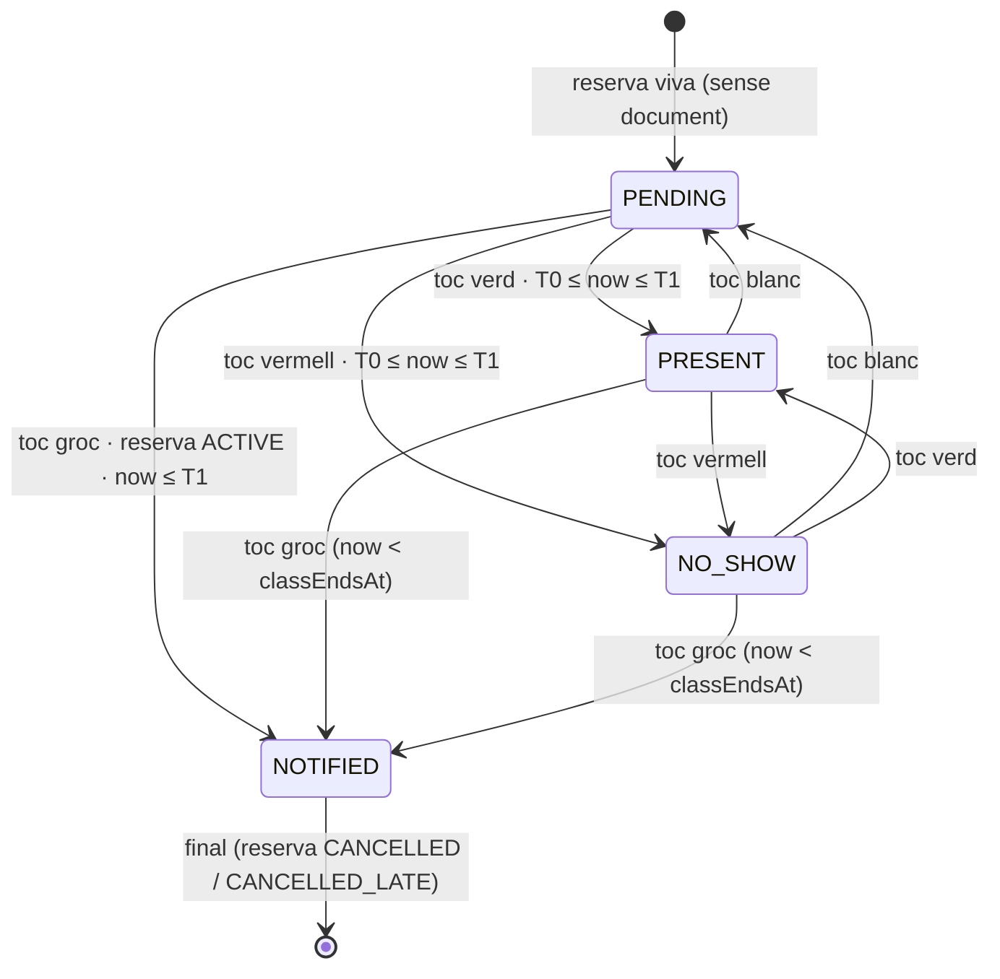
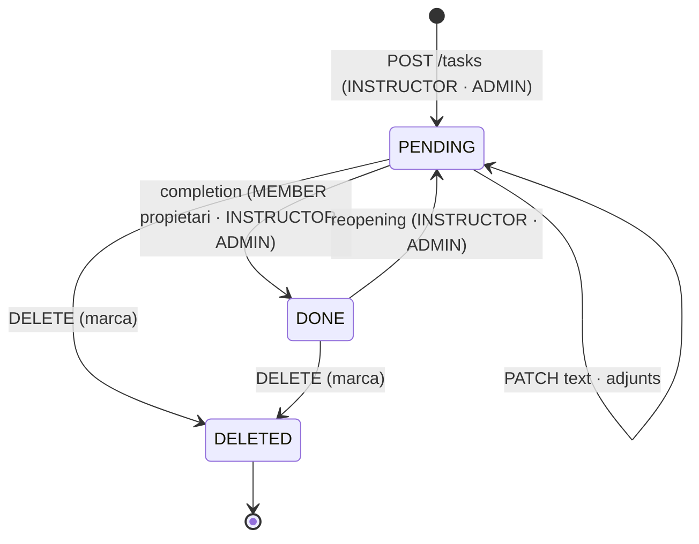

# S10 — Assistència, tasques i seguiment

**Etapa:** E6 · **Mòduls:** `TASKS` (tasques, notes, observacions, D14), `WAITLIST` (espera a 21/20/D12), `FREE_TRAINING` (files d'entrenament a D12/25 i mètrica d'entrenaments), `ACTIVITIES` (files d'activitat a 25), `SINGLE_CLASS` (l'assistència dispara el càrrec) · **Pantalles:** 20, 21, 22, 25, 26 (`03-disseny/mockups/pantalles/mobil/`), D12, D13, D14 (`…/escriptori/`) · **Model:** v1.6 §A GOS (notes, observacions, tasques → TASCA, ADJUNT), §C INSCRIPCIO_CLASSE i ASSISTENCIA, estats; PLATAFORMA §0 (`Attendance`, `Task`, `Attachment`), §3, §6 · **Estat:** esborrany (03-09-2026) · **Versió:** 0.1

## 1. Propòsit i abast

Cobreix el dia a dia de l'instructor i el rastre que en queda per a l'alumne: veure els grups del dia (20) i l'agenda de la setmana (D12), **passar llista** amb un toc per gos (21, D12) amb els efectes de cada estat («ha avisat» allibera la plaça i avisa l'espera; «no presentat» compta i genera l'avís de l'endemà), consultar la **fitxa d'alumne** amb mètriques de 30 dies (22/D13), gestionar **tasques, observacions i adjunts** (26), el **seguiment** transversal amb marques de lectura per usuari (D14) i l'**històric** de l'alumne (25). La unitat de tot el vertical és el gos amb el seu abonat (al codi, *pair*; mai «parella» a la UI).

| Fora d'abast | On viu |
|---|---|
| Regles de reserva i anul·lació (aquí només es **crida** `BookingCancellationService.cancel(…, origin=INSTRUCTOR)`), llista d'espera i els seus avisos | S08 |
| Reserves d'entrenament i bloquejos de pista (24 i la targeta de D12 usen el contracte de S09) | S09 |
| Renderitzat de graelles, `DayGridQuery`, calendari de setmana, estats de classe | S06 |
| Matriu de canals, renderitzat i enviament de N-05/N-15/N-19/N-20/N-21/N-22 | S11 |
| Línies de rebut per classe individual (aquí només s'emet `AttendanceMarked`) | S12 |
| Lot de no presentats de les 8:00 i finalització de classes (aquí es fixa el contracte) | S15 |
| Nota de l'alumne (`PUT /me/dogs/{id}/instructor-note`) i tasques a 13 (`GET /me/dogs`) | S03 |
| Estadístiques i gamificació de 27 (fase 2, `STATS`): aquí només es garanteix que l'assistència queda registrada per gos i data | S19/fase 2 |

## 2. Pantalles i rutes

| Mockup | App | Ruta | Rol | Notes de comportament |
|---|---|---|---|---|
| 20 `20-instructor-grups-del-dia.html` | `apps/clubs` | `/instructor/dia` (`?date=&instructorId=`) | INSTRUCTOR, ADMIN | `GET /instructor/day`. Títol «Grups del dia»; xip d'instructor «{nom curt} ▾» (desplegable **sense «Tot el club»**; per defecte l'instructor del login, R-10-01); xips de dia («dl 3», …, 7 dies des d'avui, assumpció). Targeta per classe: punt del color de la pista, «{h. inici}–{h. fi} · {descripció} · {pista}», distintiu «n/n», «⏳ n» (`WAITLIST`), ›; segona línia: «passar llista pendent» (`attendance.status=PENDING`), «individual» (`capacity=1`), o buida. Peu de llegenda «n/n = inscrits/places · ⏳ = en llista d'espera». Bloquejos del dia (de qualsevol instructor): «{h}–{h} · Pista {nom}» + «bloquejada» + «{motiu} — {nota}». [RESERVAR O BLOQUEJAR PISTA] → 24 (S09). Toc a la classe → 21. Buit: «Cap classe aquest dia» (assumpció). Carregant: esquelet; error: toast + reintent. Tabbar «El meu dia · Visió global · Alumnes · Perfil». |
| 21 `21-instructor-detall-de-classe-i-passar-llista.html` | `apps/clubs` | `/instructor/classes/:id` | INSTRUCTOR, ADMIN | `GET /class-sessions/{id}/attendance`. Títol «{dia} · {hora} · {descripció} · {pista}»; «n/n», «⏳ n en espera», nom curt de l'instructor. Fila per gos: **foto** (toc → pantalla completa; segon toc → tanca), «{guia} + {gos}», xip de nivell, **4 rodones** (blanca · verda · groga · vermella) = `PENDING · PRESENT · NOTIFIED · NO_SHOW`; un toc canvia l'estat local (R-10-03: rodones inactives fora de finestra; NOTIFIED desat = fila fixada). Línies d'estat: «ha avisat ({hora}) · plaça alliberada · espera avisada» (parts segons `notice.*`), «no presentat → avís demà a les {noShowNoticeTime}» (o «avís ja enviat»). Text «Un toc a la rodona per canviar l'estat» + [DESA] → `PUT /class-sessions/{id}/attendance`; `409 STALE_VERSION` → toast «Algú ha desat la llista fa un moment: revisa-la» (assumpció) + recàrrega. Llegenda «○ pendent · ● present · ● ha avisat · ● no presentat». «Llista d'espera (n)»: «{guia} + {gos}» + nivell + «des de {quan}» + text de la regla (R-10-05). Classe `CANCELLED`: bàner «Classe anul·lada pel club» i llista inerta. |
| 22 `22-instructor-fitxa-d-alumne.html` | `apps/clubs` | `/instructor/alumnes/:dogId` | INSTRUCTOR, ADMIN | `GET /dogs/{id}/instructor-card`. «Fitxa d'alumne», lupa → cercador (fila «Alumnes»). Capçalera: foto, «{guia} + {gos}», «{raça} · {n} anys», xip «{nivell} · fa {n} mesos». Tres mètriques: «{pct}%» «assistència 30 dies» · «{n}» «classes 30 dies» · «{x,y}» «entren./setm. 30 dies» (`FREE_TRAINING`). «5 darreres classes»: «{dd/mm} · {descripció} · {instructor}» + distintiu (✓ · «avisat» · «no presentat»). Blocs `TASKS`: «Notes als instructors (de l'alumne)» (text + clips), «Tasques (les veu i marca l'alumne)» («{n} pendents» «{n} feta/es» · «gestiona-les ›» → 26 · darrera tasca), «Observacions (privades)» amb «Només instructors i administració». [GESTIONAR TASQUES I NOTES] → 26. |
| 26 `26-instructor-tasques-i-notes-de-l-alumne.html` | `apps/clubs` | `/instructor/alumnes/:dogId/tasques` | INSTRUCTOR, ADMIN | `TASKS`. «Tasques i notes — {guia} + {gos}». «Observacions · privades · camp únic»: text editable + clip → [DESA] → `PUT /dogs/{id}/observations`. «Tasques» + «＋ Afegir» (només tasques) → formulari text + adjunts → `POST /tasks`. Targeta: «pendent»/«feta», llapis (edita → `PATCH`), ✕ (elimina amb confirmació «Vols eliminar aquesta tasca?», assumpció → `DELETE`), text (ratllat si feta), «{dd-mm} · {autor} · {icona de clip} {fitxer}», feta: «feta per {qui} el {dd-mm}». «Veure l'historial complet ›» → `GET /tasks?dogId&includeDone=true`. «Notes als instructors · de l'alumne · només lectura». |
| 25 `25-historic-classes-entrenaments-i-activitats.html` | `apps/clubs` | `/historic` (`?dogId=&tipus=`) | MEMBER (i IMPERSONATED) | `GET /me/history`. «Històric». Xips de gos (propis + grup: «Toby · B (Joan Antoni)») + «Tots» (per defecte amb > 1 gos; si s'hi arriba amb `dogId`, aquell); amb un sol gos: cap xip ni «· amb {gos}» a les files. Xips «Tot · Classes · Entrenaments · Activitats» (segons mòduls). «Darrers {n} mesos, del més recent al més antic». Fila: «{dd/mm} · {títol} · amb {gos}» + distintiu + línia de detall (R-10-14). Buit: «Encara no hi ha res a l'històric» (assumpció). |
| D12 `D12-instructor-agenda-setmanal-navegador.html` | `apps/clubs-admin` | `/instructor/agenda` (`?setmana=&instructor=&pista=`) | INSTRUCTOR, ADMIN | `GET /instructor/week`. «Agenda de la setmana»; «‹ Setmana actual › del {d} al {d} de {mes}»; «Instructor: Tots ▾» (Tots · Els meus · cadascun), «Totes les pistes ▾», [PDF] → `/instructor/week/export`. Quadre dl–ds × hores amb línies fines als límits d'hora: classe «{descripció} n/n {pista} · {instructor}» (+ «· {n} espera»), reserva d'entrenament a **mitja alçada** «{h} Reserva {pista} — {guia} + {gos}», bloqueig «{h}–{h} Bloqueig {pista} — {motiu}». Peu: «Reserva = pista reservada per a entrenament (mitja alçada: 30 min) · Bloqueig = pista tancada, amb el motiu · clic en una classe: inscrits i passar llista — seleccionada: {dia} {hora}». Clic a classe → sota: «{dia} · {hora} · {descripció} · {pista} · {instructor} — n/n · {n} en espera», files «{guia} + {gos}» (**enllaç a D13**, taronja subratllat) + nivell + «{n} tasques pendents» + distintiu que **cicla en clicar** (— → present → avisat → no presentat → —) + «ha avisat — plaça alliberada» / «avís demà a les {hora}», «En espera: {guia} + {gos} · …», [DESA LA LLISTA] (mateix `PUT`). Targeta «Reservar o bloquejar pista (sense alumne)» = contracte de 24 (S09). |
| D13 `D13-instructor-fitxa-d-alumne-navegador.html` | `apps/clubs-admin` | `/instructor/alumnes/:dogId` | INSTRUCTOR, ADMIN | Mateix agregat que 22. Capçalera «{guia} + {gos}», «Nivell {codi} · fa {n} mesos», «Abonat/Abonada» (gènere), «{raça} · {n} anys», [GESTIONAR TASQUES I NOTES] → 26 en calaix. Mètriques amb subtítols «Assistència · darrers 30 dies» + «{n} no presentat · {n} avisat», «Classes · darrers 30 dies» + «mes mòbil», «Entrenaments / setmana» + «mitjana 30 dies». «Darrera classe» «{dd/mm} · {descripció} · {pista} · {instructor}». Blocs «Notes als instructors — de l'alumne», «Tasques — les veu i marca l'alumne» («{n} pendents» «{n} feta» · files «{dd-mm} · {autor}» + «pendent»/«feta el {dd-mm}»), «Observacions — privades (instructors i administració)». Taula «5 darreres classes»: Data · Nivells · Pista · Instructor · Assistència («present» · «avisat» · «no presentat»). |
| D14 `D14-seguiment-alumnes.html` | `apps/clubs-admin` | `/seguiment` | INSTRUCTOR, ADMIN | `TASKS`. Menú «Seguiment alumnes» amb comptador = `GET /followup/unread-count` (refetch en focus i cada 60 s). «{n} pendents de llegir», xips «Tot · Tasques · Notes d'alumnes», [Marcar-ho tot com a llegit] → `POST /followup/read-all`. Llistat universal (`GET /followup`): Abonat · Gos · Nivell · Data · Creador («{nom} (alumne/alumna)» · «{nom} (tasca)») · Text · Creació · Finalització («—» si pendent); no llegits primer i destacats. Clic a la fila → `POST /followup/{id}/read` + D13 del gos (assumpció: fitxa d'alumne, no D10). |
| Alumnes (sense mockup) | `apps/clubs` | `/instructor/alumnes` | INSTRUCTOR, ADMIN | Cercador: `GET /dogs?q=&filter=status:eq:ACTIVE` (S03, projecció d'instructor); fila «{guia} + {gos} · {nivell}» → 22. §13. |

## 3. Entitats i camps

Col·leccions pròpies (context `clubs/followup` i `clubs/bookings`): `attendances`, `tasks`, `attachments`, `followup_items` (projecció), `followup_read_marks`. Res s'esborra físicament (BR-12): les tasques i els adjunts es marquen. Tots amb `clubId`, `createdAt`, `updatedAt`.

### `Attendance` · `attendances` — una per inscripció, creada al primer desat (sense document = `PENDING`)
| Camp | Tipus | Oblig. | Validació / notes |
|---|---|---|---|
| bookingId | UUID | sí | únic `{clubId, bookingId}` |
| classSessionId, classDate, classStartsAt, classEndsAt, dogId, memberId | | sí | desnormalitzats de `Booking`/`ClassSession`; índexs `{clubId, classSessionId}`, `{clubId, dogId, classStartsAt}` |
| state | enum | sí | `PENDING` · `PRESENT` · `NOTIFIED` · `NO_SHOW` (§5) |
| markedAt, markedBy {accountId, role: INSTRUCTOR·ADMIN, displayName} | | sí | darrer canvi efectiu |
| notice {at, late, minutesBefore, seatReleased, waitlistNotified, afterClassEnd, bookingState} | objecte | si NOTIFIED | resultat de la crida a S08 (R-10-05); `afterClassEnd=true` = només registre |
| noShowNotice {queuedAt, eventId, sentAt?} | objecte | no | idempotència del lot N-19 (R-10-06); índex `{clubId, state, "noShowNotice.queuedAt", classDate}` |
| history[] {state, at, byAccountId} | llista | sí | append-only |

`ClassSession.attendanceSummary {version, marked, present, notified, noShow, savedAt, savedByName}` — subdocument que **escriu S10** dins la transacció de desat (S06 és propietària del document; contracte §7). `version` és l'optimistic locking de la llista (R-10-04).

### `Task` · `tasks` (TASCA)
| Camp | Tipus | Oblig. | Validació / notes |
|---|---|---|---|
| dogId, memberId | UUID | sí | gos `ACTIVE` en crear (`409 DOG_NOT_ACTIVE`); `memberId` = propietari (es refresca amb `DogTransferred`: la tasca segueix el gos, S03 R-03-14) |
| text | string | sí | 1–2000 caràcters |
| state | enum | sí | `PENDING` · `DONE` |
| createdBy, updatedBy, doneBy, deletedBy {accountId, role, displayName} + `createdAt`, `updatedAt`, `doneAt`, `deletedAt` | | | `deletedAt ≠ null` = esborrat lògic (no surt enlloc llevat de `includeDeleted`, només ADMIN) |
| attachmentCount | int | sí | mantingut per `AttachmentService` |
| version | int | sí | `409 STALE_VERSION` |

Índex `{clubId, dogId, deletedAt, state, createdAt}`.

### `Attachment` · `attachments` (ADJUNT, polimòrfic)
| Camp | Tipus | Oblig. | Validació / notes |
|---|---|---|---|
| entityType, entityId | enum, UUID | sí | `TASK` (taskId) · `INSTRUCTOR_NOTE` (dogId, nota de l'alumne) · `DOG_OBSERVATIONS` (dogId); índex `{clubId, entityType, entityId, removedAt}` |
| fileKey, name, mimeType, sizeBytes | | sí | `name` ≤ 80 (per defecte el nom original); `mimeType ∈ files.allowedTypes`; `sizeBytes ≤ files.maxSizeMb` (R-10-11) |
| uploadedAt, uploadedBy {accountId, role} · removedAt?, removedByAccountId? | | | retirada = marca; el fitxer es conserva fins a la supressió RGPD (S14) |

### `FollowupItem` · `followup_items` (projecció de D14) i `FollowupReadMark` · `followup_read_marks`
`FollowupItem`: `{id, kind: TASK·MEMBER_NOTE, taskId?, dogId, memberId, authorAccountId, authorRole: MEMBER·INSTRUCTOR·ADMIN, authorName, textExcerpt (≤ 120), createdAt, completedAt?, activityAt, hidden}`; índexs `{clubId, activityAt}`, `{clubId, kind, activityAt}`. Una fila per tasca; **una** fila per nota d'alumne i gos (`MEMBER_NOTE`, s'actualitza a cada canvi). Noms d'abonat/gos i codi de nivell es resolen en llegir (pàgines ≤ 50 files). `FollowupReadMark`: `{clubId, accountId (únic), readAllAt, readItemIds[]}` (R-10-13).

### Camps d'altres agregats
Escriu: `Dog.remarks` (observacions privades, S03 §3) + `Dog.remarksMeta {updatedAt, updatedByAccountId, updatedByName}`; `ClassSession.attendanceSummary`. Llegeix: `Booking` (estats, `classStartsAt`, `cancelledBy`, `cancelReason`, `cancelMessage`, `late`), `WaitlistEntry`, `ClassSession`, `Dog` (`levelId`, `levelAssignedAt`, `photoFileKey`, `instructorNote`), `Member` (`firstName`, `lastName1`, `gender`, `status`), `Instructor.shortName`, `Level.code/name`, `Ring`, `TrainingBooking` i `ActivityRegistration` (consultes de S09/S07 per a 25 i les mètriques).

## 4. Regles de negoci

**R-10-01 Visió global i filtre per defecte.** Qualsevol `INSTRUCTOR` o `ADMIN` veu totes les classes, alumnes i gossos (MATRIU regla 1), mai dades bancàries. A 20 el desplegable llista els `Instructor` actius i preselecciona `Membership.instructorId` del qui crida; un `ADMIN` sense perfil d'instructor rep el primer per ordre alfabètic de `shortName` (assumpció). A D12 el filtre per defecte és «Tots» (mockup V2); «Els meus» = `instructorId` del qui crida. Els bloquejos de pista es mostren sempre, siguin de qui siguin. *Exemple:* l'Estel obre 20 → «Estel ▾» amb les seves 3 classes de dl 3 i el bloqueig de Carretera creat per en Marc.

**R-10-02 Composició de la llista d'assistència.** Files de 21/D12 = `Booking` de la classe amb `state ∈ {ACTIVE, PAYMENT_PENDING}` ∪ les que tenen `Attendance.state = NOTIFIED` (anul·lades per «ha avisat»; queden visibles i fixades). Les anul·lades per l'alumne, pel club o pel sistema **no** hi surten (han alliberat la plaça; el «n/n» ja ho reflecteix). Ordre: `bookedAt` ascendent (assumpció). Cada fila porta `pendingTasksCount` (`TASKS`). Sense document d'`Attendance` → `PENDING`. *Exemple:* classe 4/5 amb Laura+Duna (present), Marc+Chun-li (pendent), Anna+Nass (ha avisat, plaça alliberada → ara 3/5 amb 4 files) i Eva+Fish (no presentat).

**R-10-03 Finestra i permisos de marcatge.** Sigui `T0` = 00:00 del `classDate` i `T1` = 23:59:59 de `classDate + attendance.editDays` (proposta §13; valor 1), tots dos en hora local del club. `PRESENT`, `NO_SHOW` i el retorn a `PENDING`: permesos a `INSTRUCTOR` si `T0 ≤ now ≤ T1` (`409 ATTENDANCE_NOT_OPEN` abans, `409 ATTENDANCE_WINDOW_CLOSED` després); `ADMIN` sempre (auditat). `NOTIFIED`: permès mentre la reserva és `ACTIVE`, `now ≤ T1` i `bookings.instructorLastMinuteNotice = true` (`409 INSTRUCTOR_NOTICE_DISABLED` si no); és **final**: cap transició des de `NOTIFIED` (`409 ATTENDANCE_NOTIFIED_FINAL`) perquè l'anul·lació de la reserva no es pot desfer (la plaça pot estar ocupada). Classe `DRAFT` o `CANCELLED` → `409 INVALID_STATE`. La classe `FINISHED` (S15) es continua marcant fins a `T1`. La resposta de `GET` porta `sheet.canMarkPresence`, `canMarkNotice`, `editableUntil` per pintar les rodones. *Exemple:* classe dl 3 · 8:30; dl 3 a les 8:25 l'Estel marca present → OK (mateix dia); dt 4 a les 22:00 corregeix un no presentat → OK; dc 5 a les 9:00 → `ATTENDANCE_WINDOW_CLOSED`; l'admin ho pot fer.

**R-10-04 Desat en bloc, versió i idempotència.** `PUT /class-sessions/{id}/attendance {version, items[{bookingId, state}]}` amb `Idempotency-Key` (mateixa clau → mateixa resposta). Una **transacció Mongo**: (1) `seat_locks.incVersion(classId)` (mateixa serialització per classe que S08, perquè «ha avisat» allibera plaça); (2) `version` ≠ `attendanceSummary.version` → `409 STALE_VERSION` amb `details.current` = la llista actual; (3) per a cada ítem amb `state ≠ estat actual`: validar R-10-03 (la reserva ha de ser viva o `NOTIFIED`: si no, `409 ATTENDANCE_BOOKING_NOT_ACTIVE {bookingId}`), aplicar la transició, afegir a `history`, emetre `AttendanceMarked{previousState}`; ítems iguals a l'estat actual = no-op (reenviar la llista sencera és innocu); (4) recalcular `attendanceSummary` i `version + 1`. Qualsevol error → **res** canvia. Dos instructors amb la mateixa `version`: el primer commit guanya, el segon rep `409` amb la llista nova, la torna a carregar i reaplica els seus canvis (fusió al front: només les files que no ha canviat l'altre). *Exemple:* Estel i Marc obren la 8:30 (versió 3); Estel desa Laura=present (→ 4); Marc desa Eva=no presentat amb versió 3 → 409; recarrega (Laura ja present), reenvia Eva → 200 (→ 5).

**R-10-05 «Ha avisat».** Marcar `NOTIFIED` amb `now < classEndsAt` crida, dins la mateixa transacció, `BookingCancellationService.cancel(bookingId, actor, origin=INSTRUCTOR, reason=INSTRUCTOR_NOTICE)` (S08 R-08-10/11/19): `late = now > classStartsAt − bookings.lateCancelThresholdMinutes` → reserva `CANCELLED` (no compta; pack retornat per S08) o `CANCELLED_LATE` (compta; sense retorn); `SeatReleased{notifyWaitlist = WAITLIST ∧ minutesBefore > waitlist.notifyThresholdMinutes ∧ hi ha entrades ACTIVE}`; N-05 a l'alumne (sense SMS: l'acció és a iniciativa seva). El moment que compta és el del **desat**, no el de la trucada de l'alumne. Amb `classEndsAt ≤ now ≤ T1` la reserva ja no és anul·lable (S08): es registra `NOTIFIED{afterClassEnd: true}` sense tocar la reserva (`ACTIVE`, compta com a feta) ni avisar ningú (assumpció §13). Paràmetres: `bookings.lateCancelThresholdMinutes = 120`, `waitlist.notifyThresholdMinutes = 30`, `bookings.instructorLastMinuteNotice = true`. Text de la regla d'espera a 21 segons `waitlist.mode`: `ALL_AT_ONCE` → «Si s'allibera una plaça, s'avisa alhora tothom qui espera.»; `FIFO` → «Si s'allibera una plaça, s'avisa per ordre d'arribada: cadascú té {n} min per confirmar.» (assumpció, `n = waitlist.fifoConfirmMinutes`).

| Classe dj 15-10 18:50–19:50 · «ha avisat» desat a | `minutesBefore` | Reserva | Pack | Espera avisada | Línia a 21 |
|---|---|---|---|---|---|
| 16:00 | 170 | `CANCELLED` | retornat | sí (170 > 30) | «ha avisat (16:00) · plaça alliberada · espera avisada» |
| 16:50:00 | 120 | `CANCELLED` (llindar inclòs) | retornat | sí | idem |
| 16:50:01 | 119 | `CANCELLED_LATE` | no | sí (119 > 30) | idem |
| 18:20:00 | 30 | `CANCELLED_LATE` | no | no (30 no és > 30) | «ha avisat (18:20) · plaça alliberada» |
| 19:05 | −15 | `CANCELLED_LATE` | no | no | «ha avisat (19:05) · plaça alliberada» |
| 20:30 (classe acabada) | — | `ACTIVE` (registre) | no | no | «ha avisat (20:30)» |

**R-10-06 «No presentat».** Marca **sempre manual** (mai automàtica en acabar la classe: l'anotació V3 de 21 va quedar superada per V4). La reserva segueix `ACTIVE` i compta (límits S08, mètriques R-10-08, pack ja consumit). El lot de S15 a `messaging.noShowNoticeTime` (08:00, hora local) reclama amb `AttendanceRepository.claimForNoShowNotice(clubId, today)` = `findAndModify` de les `NO_SHOW` amb `noShowNotice.queuedAt = null` i `classDate < today`, hi escriu `queuedAt` + `eventId` i emet un sol `NoShowNoticeDue{bookingIds[]}` → N-19 per reserva (`dog_name`, `class_date`). Executar el lot dos cops no re-encua res. Desmarcar abans del lot → cap avís; després → l'avís ja és fora (`noShowNotice.sentAt` informat per S11): la fila mostra «avís ja enviat» (assumpció) i la marca es corregeix igualment. Una `NO_SHOW` marcada tard (dins `T1`) entra al lot següent amb la seva `class_date`. *Exemple:* dl 3 l'Eva no ve → «no presentat → avís demà a les 8:00»; dt 4 08:00 N-19 «T'hem trobat a faltar … la classe de dilluns 3»; si dl 3 a les 21:00 l'Estel ho canvia a present, no s'envia res.

**R-10-07 Packs i classe individual.** Aquest vertical **no** mou packs: la sessió es consumeix en confirmar la reserva (S08 R-08-17) i només `NOTIFIED` dins termini la retorna, via S08. Amb `SINGLE_CLASS` i `charge.mode = CHARGE_ON_ATTENDANCE`, S12 consumeix `AttendanceMarked{state ∈ PRESENT, NO_SHOW}` (primer cop per reserva) i `BookingCancelled{late=true}` per crear la línia; un `AttendanceMarked{state: PENDING, previousState: PRESENT|NO_SHOW}` li permet anul·lar la línia si el rebut no s'ha emès (contracte §13). Mòdul off: S12 ignora l'esdeveniment.

**R-10-08 Mètriques de 30 dies (fitxa).** Finestra `W = [now − 30 dies, now)` sobre `Booking.classStartsAt` del gos. `present` = `PRESENT`; `noShow` = `NO_SHOW`; `cancelledLate` = reserves `CANCELLED_LATE` (per l'alumne o per «ha avisat» tard) + `NOTIFIED{afterClassEnd}`; `notified` = `NOTIFIED` dins termini (reserva `CANCELLED`, informativa). `classesCounted = present + noShow + cancelledLate` (les que «compten com a feta»); `attendancePct = round(100 · present / classesCounted)` (`null` si 0 → «—»). Les `ACTIVE` passades sense marca no compten enlloc (assumpció). `trainingsCount` = `TrainingBooking` `ACTIVE` amb `endsAt ∈ W` (S09; `FREE_TRAINING`); `trainingsPerWeek = round1(trainingsCount / (30/7))`. Subtítol de D13: «{noShow} no presentat · {notified} avisat». **Assumpció** (§13): incloure `cancelledLate` al denominador. *Exemple:* present 6, no presentat 1, avisat dins termini 1, cap tardana → 6/7 = **86 %**, «7 classes», «1 no presentat · 1 avisat»; si a més hi ha una anul·lada tard → 6/8 = 75 %, «8 classes». Entrenaments: 10 fets → 10 / 4,29 = **2,3**.

**R-10-09 Darreres classes i antiguitat.** `lastClasses` = les 5 reserves més recents del gos amb `classStartsAt ≤ now` i `state ∈ {ACTIVE, CANCELLED_LATE}` o `Attendance.NOTIFIED`, amb `displayState`: `PRESENT` («present» / ✓ a 22), `NOTIFIED` («avisat»), `NO_SHOW` («no presentat»), `CANCELLED_LATE` («anul·lada tard»), `PENDING` («sense marcar», assumpció). «fa {n} mesos» = mesos sencers entre `Dog.levelAssignedAt` i avui (fus del club; < 1 mes → dies; ≥ 24 → anys), formatat al front amb `fmtRelative`. `levels.enabled = false` → sense xip.

**R-10-10 Tasques.** Crea `INSTRUCTOR`/`ADMIN` (`POST /tasks {dogId, text, attachmentIds?}`, `Idempotency-Key`) → `TaskCreated` (N-20 al propietari del gos). Edita text qualsevol instructor/admin (`PATCH`, `version`) → `TaskUpdated` (sense avís). Elimina (`DELETE`, també les fetes) → `deletedAt` + `TaskDeleted` (fila de D14 amagada). Completa: el propietari des de 13 (S03) o l'instructor/admin des de 26 → `DONE`, `doneBy` (rol i nom), `TaskCompleted` (N-21 a **tots** els instructors actius del club); ja feta → `409 TASK_ALREADY_DONE`; esborrada → `404`. Reobre només instructor/admin (`POST …/reopening`, assumpció) → `PENDING` + `TaskReopened` (proposta). Visibilitat de l'alumne: només gossos propis (13); a 26 i D13 l'historial complet (`includeDone`). *Exemple:* 12-08 l'Estel crea «Practiqueu el balancí…» amb vídeo → N-20 a la Laura; 02-08 la Laura marca feta «Treballar l'“espera”…» → N-21 a Estel, Marc i Núria; la fila queda «28-07 · Estel · feta per la Laura el 02-08».

**R-10-11 Adjunts.** Pujada per URL signada (CONVENCIONS §5): `POST /attachments/upload-url {purpose: TASK|INSTRUCTOR_NOTE|DOG_OBSERVATIONS, fileName, mimeType, sizeBytes}` valida `mimeType ∈ files.allowedTypes` (`400 FILE_TYPE_NOT_ALLOWED`) i `sizeBytes ≤ files.maxSizeMb · 2^20` (`400 FILE_TOO_LARGE`; el bucket rebutja la pujada real si supera la mida declarada); `POST /attachments {entityType, entityId, fileKey, name}` → `AttachmentAdded`. Màxim `files.maxAttachmentsPerEntity` (proposta §13; 10) per entitat (`409 ATTACHMENT_LIMIT_REACHED`). Qui: `TASK` i `DOG_OBSERVATIONS` → instructor/admin; `INSTRUCTOR_NOTE` → el propietari del gos (també impersonat). Lectura: `TASK` → propietari + instructors/admin; `INSTRUCTOR_NOTE` → idem; `DOG_OBSERVATIONS` → **mai** l'alumne (`404`). Les llistes porten `url` signada de curta durada (5 min, assumpció). Retirar = `removedAt` (`AttachmentRemoved`, proposta). Paràmetres: `files.maxSizeMb = 25`, `files.allowedTypes = image/*, video/mp4, video/quicktime, application/pdf`. *Exemple:* «vídeo_balancí.mp4» de 30 MB → `FILE_TOO_LARGE {maxSizeMb: 25}`; «.exe» → `FILE_TYPE_NOT_ALLOWED`.

**R-10-12 Observacions i nota de l'alumne.** Observacions = `Dog.remarks`, camp únic privat, ≤ 2000, editat per instructor/admin (`PUT /dogs/{id}/observations {text, version}`), mai retornat a cap `/me/*`; cada canvi → `DogUpdated{diff: remarks}` + `AuditEntry`; sense notificació ni fila a D14. La nota de l'alumne (`Dog.instructorNote`, S03 R-03-17) és **només lectura** aquí; el seu `MemberNoteChanged` (N-22) es consumeix per crear/actualitzar la fila `MEMBER_NOTE` de D14 (torna a quedar no llegida per a tothom llevat de l'autor).

**R-10-13 Seguiment (D14) i marques de lectura.** Files = `FollowupItem` no amagades; `unread(item, me) = item.activityAt > readAllAt(me) ∧ item.id ∉ readItemIds(me) ∧ item.authorAccountId ≠ me`. `activityAt` = creació de la tasca, o darrer canvi de la nota; completar una tasca actualitza `completedAt` però **no** `activityAt` (l'avís és N-21). Ordre: no llegides primer (`activityAt` desc), després la resta (`activityAt` desc). Comptador del menú = nombre de no llegides. [Marcar-ho tot com a llegit] → `readAllAt = now`, `readItemIds = []` (O(1)). Clic → `readItemIds += id` (es poden podar els ids amb `activityAt < readAllAt`). Filtres universals: `kind`, `memberId`, `dogId`, `authorAccountId`, `unread`. *Exemple:* 5 no llegides per a en Marc; l'Estel crea una tasca (no llegida per a Marc i Núria, no per a Estel); en Marc prem «Marcar-ho tot com a llegit» → 0; la Laura canvia la nota → 1 per a tothom.

**R-10-14 Històric de l'alumne (25).** `GET /me/history?dogId&type` retorna els elements dels gossos accessibles (propis + grup) amb `startsAt ≥ inici del dia local − history.monthsVisible mesos` que **no** són reserves vives (les vives són a 03): reserves de classe (`ACTIVE` amb `classStartsAt ≤ now`, i totes les anul·lades, també futures), entrenaments (`ACTIVE` fets, `CANCELLED`, `CANCELLED_BY_CLUB`; S09) i activitats (S07). Ordre `startsAt` desc; sense paginació (màx. 500, assumpció). Paràmetre `history.monthsVisible = 2`. `showDog` = més d'un gos accessible. Estats i línia de detall (literals de 25):

| Element | `state` | Distintiu | Detall | `counts` |
|---|---|---|---|---|
| Classe `ACTIVE` passada, assistència `PRESENT`/`PENDING` | `DONE` | «feta» | — | sí |
| Classe amb `NO_SHOW` | `NO_SHOW` | «no presentat» | «Sense avís previ · compta com a feta» | sí |
| `CANCELLED_LATE` per l'alumne (o «ha avisat» tard) | `CANCELLED_LATE` | «anul·lada tard» | «Per tu, el {dd/mm} a les {hh:mm} · compta com a feta» (per «ha avisat»: «Vas avisar el club el {dd/mm} a les {hh:mm} · compta com a feta», assumpció) | sí |
| `CANCELLED` dins termini (alumne, «ha avisat», club en nom teu, sistema) | `CANCELLED` | «anul·lada» | «Per tu, dins termini · no compta» · «Vas avisar el club, dins termini · no compta» · «Pel club en nom teu · no compta» · «Per inactivitat o baixa · no compta» (assumpcions) | no |
| `CANCELLED_BY_CLUB` | `CANCELLED_BY_CLUB` | «cancel·lada pel club» | «“{adminText}”» | no |
| Entrenament fet · anul·lat · pel club | `DONE` · `CANCELLED` · `CANCELLED_BY_CLUB` | «fet» · «anul·lada» · «cancel·lada pel club» | — · «Per tu» · — | — |
| Activitat (S07) | segons S07 | «feta» · «anul·lada» · «cancel·lada pel club» | — | — |

**R-10-15 Agenda setmanal (D12).** `GET /instructor/week?date` = setmana ISO de `date` (fus del club), dl–ds (diumenge només si hi ha elements, assumpció). Composició per `WeekAgendaQuery`: classes de `CalendarQuery` (S06 forma B, `filter=ACTIVE`: `ACTIVE`+`FINISHED`+`CANCELLED` atenuades, mai `DRAFT`) + `TrainingOccupancyService.occupancy(range, ringIds, INSTRUCTOR)` (S09 R-09-12: entrenaments amb guia i gos, bloquejos amb motiu i nota). Files = hores d'inici diferents; l'entrenament ocupa `training.slotMinutes` (mitja alçada). Filtres: `instructorId` (només classes; entrenaments i bloquejos es mostren sempre) i `ringId` (tot). Cada classe porta `attendanceStatus` i `waiting`. Export PDF = la mateixa consulta renderitzada en apaïsat amb el logo del club (`GET /instructor/week/export?format=pdf`, síncron). *Exemple:* setmana del 10 al 16 d'agost, filtre «Tots»: dl 8:00 «Reserva Muntanya — Pau + Blat» (mitja alçada) sobre la fila 8:30 «A+B 4/5 Central · Estel»; dc 16:00–18:00 «Bloqueig Carretera — manteniment».

**R-10-16 Variants per club.** `levels.enabled = false` → cap xip de nivell (`levelCode: null`) a 21/22/D12/D13/D14 ni «fa n mesos». `waitlist.mode` → text de R-10-05. `classes.maxInstructorsPerClass > 1` → «Marc, Neus» a les cel·les i el filtre «Els meus» inclou les classes on el qui crida és un dels instructors. `bookings.limitUnit` no afecta res aquí. Mòduls: taula del §9.

## 5. Estats i transicions



| Transició | Qui | Condició | Efectes | Esdeveniment |
|---|---|---|---|---|
| → `PRESENT` / → `NO_SHOW` | INSTRUCTOR (finestra) · ADMIN | R-10-03, reserva viva | `attendanceSummary`; `NO_SHOW` → candidat al lot N-19 | `AttendanceMarked{state, previousState}` |
| → `PENDING` | idem | reserva viva | treu la candidatura a N-19 si no s'ha encuat | `AttendanceMarked{PENDING, previousState}` |
| → `NOTIFIED` | INSTRUCTOR · ADMIN | `instructorLastMinuteNotice`, reserva `ACTIVE` | S08 `cancel(origin=INSTRUCTOR)`: `CANCELLED`/`CANCELLED_LATE`, `SeatReleased`, pack, N-05, N-15 · o registre si la classe ha acabat | `AttendanceMarked{NOTIFIED}` (+ `BookingCancelled`, `SeatReleased` de S08) |
| `NO_SHOW` → lot | S15 | `queuedAt = null`, `classDate < today` | `noShowNotice.queuedAt` | `NoShowNoticeDue{bookingIds}` |



| Transició | Qui | Condició | Efectes | Esdeveniment |
|---|---|---|---|---|
| → `PENDING` | INSTRUCTOR · ADMIN | gos `ACTIVE`, text 1–2000 | fila D14 (no llegida per a la resta), N-20 | `TaskCreated` |
| text / adjunts | INSTRUCTOR · ADMIN | `version` | `updatedBy`, `textExcerpt` de D14 | `TaskUpdated` · `AttachmentAdded` |
| `PENDING` → `DONE` | MEMBER (propi, també impersonat) · INSTRUCTOR · ADMIN | no esborrada | `doneAt/By`, `completedAt` a D14, N-21 | `TaskCompleted{by}` |
| `DONE` → `PENDING` | INSTRUCTOR · ADMIN | — | esborra `doneAt/By`, `completedAt` | `TaskReopened` (proposta) |
| → `DELETED` | INSTRUCTOR · ADMIN | — | `deletedAt`, fila D14 amagada | `TaskDeleted` |

## 6. API

Totes sota `/api/v1`; tenant pel JWT. Els endpoints d'instructor **rebutgen** tokens d'impersonació (`403`); `/me/history` i `POST /tasks/{id}/completion` els accepten com a `MEMBER`. `I` = `Idempotency-Key`.

| Mètode | Ruta | Rol(s) | Mòdul | I | Descripció | Cos / paràmetres clau | Respostes i errors |
|---|---|---|---|---|---|---|---|
| GET | `/instructor/day` | INSTRUCTOR, ADMIN | — (`WAITLIST` → `waiting`) | — | Agregat de 20 | `date?` (avui), `instructorId?` | 200 (JSON avall) · 400 · 404 instructor d'un altre club |
| GET | `/instructor/week` | INSTRUCTOR, ADMIN | — (`FREE_TRAINING` → files `TRAINING`) | — | Agregat de D12 | `date?`, `instructorId?` (`me` = el qui crida), `ringId?` | 200 (JSON avall) |
| GET | `/instructor/week/export` | INSTRUCTOR, ADMIN | — | — | PDF de D12 | mateixos paràmetres, `format=pdf` | 200 `application/pdf` |
| GET | `/class-sessions/{id}/attendance` | INSTRUCTOR, ADMIN | — | — | Llista de 21 / D12 | — | 200 (JSON avall) · 404 |
| PUT | `/class-sessions/{id}/attendance` | INSTRUCTOR, ADMIN | — | sí | [DESA] / [DESA LA LLISTA] (R-10-04) | `{version, items[{bookingId, state}]}` | 200 (com el GET + `applied[]`) · 409 `STALE_VERSION{current}` `ATTENDANCE_NOT_OPEN` `ATTENDANCE_WINDOW_CLOSED` `ATTENDANCE_NOTIFIED_FINAL` `ATTENDANCE_BOOKING_NOT_ACTIVE` `INSTRUCTOR_NOTICE_DISABLED` `INVALID_STATE` · 400 estat desconegut |
| GET | `/attendances` | ADMIN, INSTRUCTOR | — | — | Llistat universal (D10 «assistència», exports, fase 2) | `filter=` sobre `dogId, memberId, classSessionId, classDate, state`; `sort` | 200 pàgina · 400 `INVALID_FILTER` |
| GET | `/dogs/{id}/instructor-card` | INSTRUCTOR, ADMIN | — (`TASKS`, `FREE_TRAINING` → blocs) | — | Agregat de 22/D13 | — | 200 (JSON avall) · 404 |
| PUT | `/dogs/{id}/observations` | INSTRUCTOR, ADMIN | `TASKS` | sí | Observacions (R-10-12) | `{text, version}` | 200 `{text, updatedAt, updatedByName, version}` · 409 `STALE_VERSION` · 404 `MODULE_DISABLED` |
| GET | `/tasks` | MEMBER (gossos propis), INSTRUCTOR, ADMIN | `TASKS` | — | Historial (26, 13 «Veure l'historial ›») | `dogId` (oblig.), `state?`, `includeDone=true`, `includeDeleted` (ADMIN), `page`, `size` | 200 `{items: Task[]}` · 404 `DOG_NOT_ACCESSIBLE` |
| POST | `/tasks` | INSTRUCTOR, ADMIN | `TASKS` | sí | «＋ Afegir» | `{dogId, text, attachmentIds?[]}` | 201 `Task` · 400 · 409 `DOG_NOT_ACTIVE` |
| GET / PATCH / DELETE | `/tasks/{id}` | INSTRUCTOR, ADMIN (GET també MEMBER propi) | `TASKS` | — / `version` / sí | detall · edita text · elimina (marca) | `{text, version}` | 200 / 200 / 204 · 409 `STALE_VERSION` · 404 |
| POST | `/tasks/{id}/completion` | MEMBER (propi, impersonat), INSTRUCTOR, ADMIN | `TASKS` | per estat | marca feta | `{}` | 200 `Task` · 409 `TASK_ALREADY_DONE` · 404 |
| POST | `/tasks/{id}/reopening` | INSTRUCTOR, ADMIN | `TASKS` | per estat | torna a pendent (assumpció) | `{}` | 200 · 409 `TASK_NOT_DONE` |
| POST | `/attachments/upload-url` | segons `purpose` (R-10-11) | `TASKS` (S03 la usa amb `DOG_DOCUMENT`) | — | URL signada | `{purpose, fileName, mimeType, sizeBytes}` | 201 `{uploadUrl, fileKey, expiresAt}` · 400 `FILE_TOO_LARGE` `FILE_TYPE_NOT_ALLOWED` |
| POST | `/attachments` | segons entitat | `TASKS` | sí | registra l'adjunt | `{entityType, entityId, fileKey, name}` | 201 `Attachment{url}` · 403 · 409 `ATTACHMENT_LIMIT_REACHED` · 422 `ATTACHMENT_ENTITY_MISMATCH` (fileKey d'un altre `purpose`) |
| GET / DELETE | `/attachments` (`?entityType&entityId`) · `/attachments/{id}` | segons entitat | `TASKS` | — / sí | llista amb `url` signada · retira | — | 200 / 204 · 403 · 404 |
| GET | `/followup` | INSTRUCTOR, ADMIN | `TASKS` | — | Llistat universal de D14 (R-10-13) | `filter=kind:eq:TASK`, `unread:eq:true`, `memberId`, `dogId`; `page`, `size` | 200 pàgina (JSON avall) |
| GET | `/followup/unread-count` | INSTRUCTOR, ADMIN | `TASKS` | — | comptador del menú | — | 200 `{count}` |
| POST | `/followup/{id}/read` · `/followup/read-all` | INSTRUCTOR, ADMIN | `TASKS` | sí | marca llegida una · totes | `{}` | 204 |
| GET | `/me/history` | MEMBER (i impersonat) | — (`FREE_TRAINING`, `ACTIVITIES` → tipus) | — | Pantalla 25 (R-10-14) | `dogId?` (absent = «Tots»), `type?` `CLASS`·`TRAINING`·`ACTIVITY` | 200 (JSON avall) · 404 `DOG_NOT_ACCESSIBLE` |

`GET /instructor/day?date=2026-08-03` (200):
```json
{ "date":"2026-08-03","timeZone":"Europe/Madrid","selectedInstructorId":"i1",
  "instructors":[{"id":"i1","shortName":"Estel"},{"id":"i2","shortName":"Marc"},{"id":"i3","shortName":"Núria"}],
  "days":[{"date":"2026-08-03","hasClasses":true},{"date":"2026-08-04","hasClasses":true}],
  "classes":[{"id":"c1","startTime":"08:30","endTime":"09:30","displayDescription":"A+B","ring":{"id":"r2","name":"Central","color":"#8FCE8F"},"state":"ACTIVE","booked":4,"capacity":5,"waiting":1,"individual":false,"attendance":{"status":"PENDING","marked":0,"total":4}},
             {"id":"c2","startTime":"17:40","endTime":"18:40","displayDescription":"Teràpia","ring":{"id":"r5","name":"Petita","color":"#85B8E8"},"state":"ACTIVE","booked":1,"capacity":1,"waiting":1,"individual":true,"attendance":{"status":"NONE","marked":0,"total":1}}],
  "ringBlocks":[{"id":"rb1","ringName":"Carretera","fromLocal":"16:00","toLocal":"17:30","kind":"BLOCK","reason":"MAINTENANCE","note":"regar i repassar el terra","createdByName":"Marc"}] }
```
`attendance.status` ∈ `NONE` (abans de `T0`), `PENDING` («passar llista pendent»: dins la finestra i `marked < total`), `DONE` (tots marcats; text «llista passada», assumpció), `CLOSED` (després de `T1`).

`GET /class-sessions/c1/attendance` (200) — `PUT` retorna el mateix + `applied: ["b1"]`:
```json
{ "classSession":{"id":"c1","date":"2026-08-03","startTime":"08:30","endTime":"09:30","displayDescription":"A+B","ring":{"id":"r2","name":"Central","color":"#8FCE8F"},"instructorName":"Estel","state":"ACTIVE","capacity":5,"booked":3,"waiting":1},
  "sheet":{"version":4,"canMarkPresence":true,"canMarkNotice":true,"editableUntil":"2026-08-04T21:59:59Z","savedAt":"2026-08-03T06:41:10Z","savedByName":"Estel","noShowNoticeTime":"08:00"},
  "rows":[
    {"bookingId":"b1","dogId":"d1","dogName":"Duna","dogPhotoUrl":"https://…?sig=…","memberId":"m1","memberFirstName":"Laura","levelCode":"C","state":"PRESENT","final":false,"markedAt":"2026-08-03T06:41:10Z","markedByName":"Estel","pendingTasksCount":2,"notice":null,"noShowNotice":null},
    {"bookingId":"b2","dogName":"Chun-li","memberFirstName":"Marc","levelCode":"A","state":"PENDING","final":false,"pendingTasksCount":0},
    {"bookingId":"b3","dogName":"Nass","memberFirstName":"Anna","levelCode":"B","state":"NOTIFIED","final":true,"notice":{"atLocal":"12:40","at":"2026-08-02T10:40:00Z","late":false,"seatReleased":true,"waitlistNotified":true,"afterClassEnd":false,"bookingState":"CANCELLED"}},
    {"bookingId":"b4","dogName":"Fish","memberFirstName":"Eva","levelCode":"B","state":"NO_SHOW","final":false,"noShowNotice":{"scheduledFor":"2026-08-04T06:00:00Z","queuedAt":null,"sentAt":null}} ],
  "waitlist":{"mode":"ALL_AT_ONCE","entries":[{"entryId":"w1","dogName":"Blat","memberFirstName":"Pau","levelCode":"B","joinedAt":"2026-08-02T19:04:00Z","state":"ACTIVE"}]} }
```
`PUT` (cos): `{"version":4,"items":[{"bookingId":"b2","state":"PRESENT"},{"bookingId":"b4","state":"PENDING"}]}`.

`GET /instructor/week?date=2026-08-12` (200, extracte):
```json
{ "week":{"startDate":"2026-08-10","endDate":"2026-08-15","relative":"CURRENT"},
  "filters":{"instructorId":null,"ringId":null,"instructors":[{"id":"i1","shortName":"Estel"}],"rings":[{"id":"r1","name":"Muntanya","color":"#F2B58C"}]},
  "rows":["08:00","08:30","16:00","18:50"],
  "cells":[
    {"date":"2026-08-10","time":"08:00","endTime":"08:30","kind":"TRAINING","ringName":"Muntanya","who":"Pau + Blat","trainingBookingId":"tb1"},
    {"date":"2026-08-10","time":"08:30","endTime":"09:30","kind":"CLASS","classId":"c1","displayDescription":"A+B","ringName":"Central","ringColor":"#8FCE8F","instructorName":"Estel","booked":4,"capacity":5,"waiting":0,"state":"ACTIVE","attendanceStatus":"DONE"},
    {"date":"2026-08-12","time":"16:00","endTime":"18:00","kind":"BLOCK","blockId":"rb1","ringName":"Carretera","reason":"MAINTENANCE","note":null,"createdByName":"Marc"} ] }
```

`GET /dogs/d1/instructor-card` (200):
```json
{ "dog":{"id":"d1","name":"Duna","breed":"Border collie","sex":"FEMALE","ageYears":4,"photoUrl":"https://…","status":"ACTIVE"},
  "member":{"id":"m1","firstName":"Laura","fullName":"Laura Serra","gender":"FEMALE","displayStatus":{"kind":"ACTIVE"}},
  "level":{"code":"C","name":"C","assignedAt":"2025-12-03T09:00:00Z"},
  "metrics":{"windowDays":30,"attendancePct":86,"present":6,"noShow":1,"notified":1,"cancelledLate":0,"classesCounted":7,"trainingsCount":10,"trainingsPerWeek":2.3},
  "lastClasses":[{"bookingId":"b9","date":"2026-07-28","displayDescription":"B+C","ringName":"Central","instructorName":"Marc","displayState":"PRESENT"},{"bookingId":"b8","date":"2026-07-21","displayDescription":"B+C","ringName":"Central","instructorName":"Marc","displayState":"NOTIFIED"}],
  "instructorNote":{"text":"A veure si treballem una mica el doble a classe…","updatedAt":"2026-08-19T17:02:00Z","attachments":[{"id":"a1","name":"foto_balancí.jpg","mimeType":"image/jpeg","url":"https://…?sig=…"}]},
  "tasks":{"pendingCount":2,"doneCount":1,"latest":{"id":"t1","text":"Practiqueu el balancí amb calma: sessions curtes…","createdAt":"2026-08-12T16:00:00Z","createdByName":"Estel"}},
  "observations":{"text":"Va molt bé amb reforç de pilota…","updatedAt":"2026-08-01T10:00:00Z","updatedByName":"Marc","attachments":[],"version":4} }
```
Sense `TASKS`: `instructorNote`, `tasks`, `observations` absents; sense `FREE_TRAINING`: `trainingsCount`/`trainingsPerWeek` absents.

`Task` (element de `GET /tasks`): `{"id":"t3","dogId":"d1","text":"Treballar l'«espera» a la línia de sortida","state":"DONE","createdAt":"2026-07-28T…","createdBy":{"role":"INSTRUCTOR","displayName":"Estel"},"doneAt":"2026-08-02T…","doneBy":{"role":"MEMBER","displayName":"Laura","gender":"FEMALE"},"attachments":[{"id":"a2","name":"vídeo_balancí.mp4","mimeType":"video/mp4","sizeBytes":8123456,"url":"…"}],"version":2}`.

`GET /followup` (ítem): `{"id":"f1","kind":"TASK","taskId":"t1","dogId":"d1","dogName":"Duna","levelCode":"C","memberId":"m1","memberName":"Laura Serra","authorName":"Estel","authorRole":"INSTRUCTOR","textExcerpt":"Practiqueu el balancí amb calma: sessions curtes","createdAt":"2026-08-12T…","completedAt":null,"activityAt":"2026-08-12T…","unread":true}`; per a una nota: `"kind":"MEMBER_NOTE","authorRole":"MEMBER","authorName":"Laura"` (Creador = «Laura (alumna)», per `gender`).

`GET /me/history?dogId=` (200):
```json
{ "monthsVisible":2,"from":"2026-06-03","showDog":true,
  "dogs":[{"id":"d1","name":"Duna","levelCode":"C","own":true},{"id":"d3","name":"Toby","levelCode":"B","own":false,"ownerFirstName":"Joan Antoni"}],
  "types":["CLASS","TRAINING","ACTIVITY"],
  "items":[
    {"type":"CLASS","id":"b9","date":"2026-07-28","startsAtLocal":"2026-07-28T18:50","title":"Classe B+C","dogId":"d1","dogName":"Duna","state":"DONE","counts":true,"detail":null},
    {"type":"TRAINING","id":"tb4","date":"2026-07-24","startsAtLocal":"2026-07-24T08:00","title":"Entrenament","dogId":"d2","dogName":"Rock","state":"DONE","counts":null,"detail":null},
    {"type":"CLASS","id":"b8","date":"2026-07-21","title":"Classe B+C","dogId":"d1","dogName":"Duna","state":"CANCELLED_LATE","counts":true,"detail":{"kind":"BY_MEMBER","at":"2026-07-21T17:10:00Z","atLocal":"19:10"}},
    {"type":"CLASS","id":"b7","date":"2026-07-17","title":"Classe D i sup.","dogId":"d2","dogName":"Rock","state":"CANCELLED_BY_CLUB","counts":false,"detail":{"kind":"BY_CLUB","message":"Pluja forta: pistes tancades"}},
    {"type":"CLASS","id":"b6","date":"2026-07-14","title":"Classe B+C","dogId":"d1","dogName":"Duna","state":"NO_SHOW","counts":true,"detail":{"kind":"NO_SHOW"}},
    {"type":"ACTIVITY","id":"ar1","date":"2026-07-12","title":"Seminari d'obstacles","dogId":null,"state":"DONE","counts":null,"detail":null},
    {"type":"CLASS","id":"b5","date":"2026-07-08","title":"Classe C+D","dogId":"d1","dogName":"Duna","state":"CANCELLED","counts":false,"detail":{"kind":"BY_MEMBER_IN_TIME"}} ] }
```
`detail.kind` ∈ `BY_MEMBER` · `BY_MEMBER_IN_TIME` · `INSTRUCTOR_NOTICE` · `INSTRUCTOR_NOTICE_IN_TIME` · `BY_CLUB_ON_BEHALF` · `SYSTEM` · `BY_CLUB` · `NO_SHOW`; el front tria la frase (R-10-14).

Codis d'error propis (`ErrorCode`, missatge a `messages_{ca,es,en}.properties`, `errors:` al front): `ATTENDANCE_NOT_OPEN`, `ATTENDANCE_WINDOW_CLOSED`, `ATTENDANCE_NOTIFIED_FINAL`, `ATTENDANCE_BOOKING_NOT_ACTIVE`, `INSTRUCTOR_NOTICE_DISABLED`, `TASK_ALREADY_DONE`, `TASK_NOT_DONE`, `ATTACHMENT_LIMIT_REACHED`, `ATTACHMENT_ENTITY_MISMATCH` (nous, §13); reutilitzats: `STALE_VERSION`, `INVALID_STATE` (S06), `DOG_NOT_ACTIVE`, `DOG_NOT_ACCESSIBLE`, `FILE_TOO_LARGE`, `FILE_TYPE_NOT_ALLOWED` (S03), `MODULE_DISABLED`, `INVALID_FILTER`, `VALIDATION_ERROR`. Transaccions Mongo obligatòries: desat de la llista (R-10-04, amb la cancel·lació de S08 dins), creació de tasca amb adjunts, `read-all`.

## 7. Esdeveniments

**Emesos** (outbox, mateixa transacció): `AttendanceMarked{bookingId, classSessionId, dogId, memberId, state, previousState, by{accountId, role}, late?, afterClassEnd?}` (un per ítem canviat) · `TaskCreated{taskId, dogId, memberId, by}` · `TaskUpdated` · `TaskDeleted` · `TaskCompleted{taskId, dogId, memberId, by{accountId, role}}` · `TaskReopened` (proposta) · `AttachmentAdded{attachmentId, entityType, entityId}` · `AttachmentRemoved` (proposta) · `DogUpdated{dogId, diff: {remarks}}` (observacions; catàleg: emissor S03/S10). Dins la transacció de «ha avisat», **S08** emet `BookingCancelled{by: INSTRUCTOR, late, minutesBefore, origin: INSTRUCTOR}`, `SeatReleased` i, si escau, `PackRefunded`. `MemberNoteChanged` l'emet S03 (endpoint de la nota); el catàleg l'atribueix a S10 pel consumidor de D14.

**Consumits** (idempotents per `eventId`):
| Esdeveniment | Què fa S10 |
|---|---|
| `MemberNoteChanged{dogId, memberId}` (S03) | upsert de la fila `MEMBER_NOTE` de D14: `activityAt = occurredAt`, `textExcerpt` de `Dog.instructorNote.text`, `authorAccountId` = qui l'ha escrit (R-10-12/13) |
| `NoShowNoticeDue` (S15) → `NotificationSent{N-19}` (S11) | escriu `noShowNotice.sentAt` (per mostrar «avís ja enviat») |
| `ClassCancelledByClub`, `ClassAutoCancelled` (S06/S15) | res a escriure: les reserves passen a `CANCELLED_BY_CLUB` i queden fora de la llista i de les mètriques; 21 mostra el bàner |
| `ClassSessionUpdated{startsAt}` (S06) | refresca `classStartsAt/EndsAt/classDate` desnormalitzats de les `Attendance` |
| `DogTransferred` (S03) | `Task.memberId` i files de D14 → nou propietari (la tasca segueix el gos) |
| `DogDeactivated` (S03) | res: tasques i assistència es conserven; 22 mostra el gos com a «baixa» |
| `BookingCancelled{by ∈ MEMBER, ADMIN, SYSTEM}` (S08/S13) | si existeix `Attendance` `PRESENT`/`NO_SHOW` → contradicció: es registra a `history` i s'avisa al log; **proposta** que S08 ho refusi (§13) |

**Contracte amb S15** (schedulers): `AttendanceRepository.claimForNoShowNotice(clubId, today)` (R-10-06) executat a `messaging.noShowNoticeTime` per club (comprova que l'hora és la local del club); `finishEnded` de S06 no toca l'assistència. **Amb S06**: `attendanceSummary` és propietat de S10 (només S10 l'escriu; `PATCH /class-sessions/{id}` no el pot esborrar); `CalendarQuery` i `DayGridQuery` exposen `attendanceStatus` llegint-lo. **Amb S08**: `BookingCancellationService.cancel(bookingId, actor, origin=INSTRUCTOR, reason=INSTRUCTOR_NOTICE)` retorna `{state, late, minutesBefore, seatReleased, waitlistNotified}`; `GET /bookings/{id}.displayState` «no presentat» llegeix `AttendanceQuery.stateOf(bookingId)`. **Amb S09/S07**: `TrainingHistoryQuery.itemsFor(dogIds, from)` i `ActivityHistoryQuery.itemsFor(memberId, from)` per a 25; `TrainingStatsQuery.countDone(dogId, window)` per a la mètrica. **Amb S12**: consumidor d'`AttendanceMarked` (R-10-07).

## 8. Notificacions

| Codi | Moment exacte | Destinatari → canals | Variables |
|---|---|---|---|
| N-05 Reserva anul·lada (per tu) | `BookingCancelled{by: INSTRUCTOR}` emès per S08 dins el desat amb `NOTIFIED` (`now < classEndsAt`) | MEMBER propietari → APP (sense SMS: assumpció compartida amb S08 §13-7) | dog_name, class_date, class_time, late |
| N-15 S'ha alliberat una plaça! | `SeatReleased{notifyWaitlist: true}` (S08 R-08-11/13/14) | entrades en espera → APP+SMS+PUSH | dog_name, class_date, class_time, confirm_by |
| N-19 T'hem trobat a faltar | consumidor de `NoShowNoticeDue` (lot de S15 a `messaging.noShowNoticeTime`), una per reserva | MEMBER propietari → APP+EMAIL segons preferències (`PERSONAL`) | dog_name, class_date (el cos diu «la classe de {class_date}», no «ahir») |
| N-20 Tasca nova | `TaskCreated` | MEMBER propietari → APP+EMAIL · acció `OPEN_TASKS` (obre 13 amb el gos) | dog_name, instructor_name, task_excerpt (≤ 120) |
| N-21 Tasca completada | `TaskCompleted` (qualsevol `by`, també un instructor) | tots els `Instructor` actius del club → APP · `OPEN_DOG` (22) | member_name, dog_name, task_excerpt |
| N-22 Nota de l'alumne nova/canviada | `MemberNoteChanged` (S03) | tots els instructors actius → APP · `OPEN_DOG` | member_name, dog_name |

Cap notificació per a `TaskUpdated`, `TaskDeleted`, `TaskReopened`, adjunts ni observacions. `NOTIFIED{afterClassEnd}` no notifica ningú.

## 9. Paràmetres i mòduls

Llegeix: `bookings.lateCancelThresholdMinutes` (240), `bookings.instructorLastMinuteNotice` (true), `waitlist.notifyThresholdMinutes` (30), `waitlist.mode`, `waitlist.fifoConfirmMinutes` (text de 21), `messaging.noShowNoticeTime` (08:00), `history.monthsVisible` (2), `files.maxSizeMb` (25), `files.allowedTypes`, `files.dogPhotoMaxMb` (foto a 21, S03), `training.slotMinutes` (mitja alçada a D12), `levels.enabled`, `classes.maxInstructorsPerClass`, `club.timeZone`. Proposats (§13): `attendance.editDays` (1), `files.maxAttachmentsPerEntity` (10). La finestra de 30 dies de les mètriques i el màxim de 5 classes són constants de producte (no de club).

| Mòdul off | Efecte |
|---|---|
| `TASKS` | `/tasks*`, `/attachments*`, `/followup*`, `/dogs/{id}/observations` → `404 MODULE_DISABLED`; 22/D13 sense els tres blocs ni [GESTIONAR TASQUES I NOTES]; 26 inaccessible; D14 i el comptador del menú ocults; `pendingTasksCount` absent a 21/D12; 13 sense Notes ni Tasques (S03); cap N-20/N-21/N-22 |
| `WAITLIST` | cap «⏳ n» a 20/D12, cap bloc «Llista d'espera» a 21, `waiting`/`waitlist` absents; «ha avisat» allibera la plaça sense avisar ningú (S08) |
| `FREE_TRAINING` | D12 sense cel·les `TRAINING`; 22/D13 sense «entren./setm.»; 25 sense xip ni files «Entrenaments» |
| `ACTIVITIES` | 25 sense xip ni files «Activitats» |
| `SINGLE_CLASS` | `AttendanceMarked` sense efecte de facturació |
| `FAMILY_GROUP` | 25 només amb gossos propis; «Tots» només si n'hi ha més d'un |
| `SMS` / `PUSH` | només afecten els canals de N-15 (S08/S11) |

## 10. i18n i localització

- Namespaces: `instructor` (20, 21, 22, 26, D12, D13: `instructor:day.*`, `instructor:attendance.*`, `instructor:card.*`, `instructor:tasks.*`, `instructor:agenda.*`), `history` (25), `admin-census:followup.*` (D14). Enums: `enums:attendanceState.{PENDING, PRESENT, NOTIFIED, NO_SHOW}` = «pendent», «present», «ha avisat», «no presentat»; `enums:attendanceStateShort.NOTIFIED` = «avisat» (taules de D12/D13/22); `enums:historyState.*` = «feta», «fet», «anul·lada», «anul·lada tard», «cancel·lada pel club», «no presentat»; `enums:taskState.*` = «pendent», «feta»; `enums:followupKind.*` = «tasca», «nota d'alumne».
- Literals fixats pels mockups (valor `ca`): «Grups del dia», «passar llista pendent», «individual», «n/n = inscrits/places · ⏳ = en llista d'espera», «Un toc a la rodona per canviar l'estat», «plaça alliberada», «espera avisada», «no presentat → avís demà a les {time}», «Llista d'espera ({n})», «Si s'allibera una plaça, s'avisa alhora tothom qui espera.», «Fitxa d'alumne», «assistència 30 dies», «classes 30 dies», «entren./setm. 30 dies», «5 darreres classes», «Notes als instructors (de l'alumne)», «Tasques (les veu i marca l'alumne)», «gestiona-les ›», «Observacions (privades)», «Només instructors i administració», [GESTIONAR TASQUES I NOTES], «＋ Afegir», «Veure l'historial complet ›», [DESA], [DESA LA LLISTA], «Darrers {n} mesos, del més recent al més antic», «Per tu, dins termini · no compta», «Per tu, el {date} a les {time} · compta com a feta», «Sense avís previ · compta com a feta», «Agenda de la setmana», «Seguiment alumnes», «{n} pendents de llegir», «Marcar-ho tot com a llegit», «Notes d'alumnes».
- ICU: `instructor:card.taskCounts` `{pending, plural, one {# pendent} other {# pendents}}` · `{done, plural, one {# feta} other {# fetes}}`; «feta per {article}{name} el {date}» amb article personal segons `gender` (`personArticle` a `packages/i18n/format.ts`, germà de `dogArticle` de S08); «{name} (alumne/alumna)» amb `{gender, select, female {alumna} other {alumne}}`; «Abonat/Abonada» a D13 idem.
- Icones: el «⏳» dels literals és la icona SVG de rellotge de sorra del mockup i el clip dels adjunts la icona SVG de clip; cap dels dos és un caràcter del text (mateix criteri que S08).
- Dates i fus: `T0`/`T1`, la finestra de 30 dies, `classDate < today` del lot i «fa {n} mesos» es calculen al back amb `ZoneId` del club; el front formata amb `fmtDate(weekday)` («dl 3», «dl 28/07»), `fmtTime` («12:40») i `fmtRelative`; `trainingsPerWeek` amb `Intl.NumberFormat` (1 decimal: «2,4» en ca/es, «2.4» en en). `Level.name` és `LocalizedText`; `Ring.name`, `Instructor.shortName`, noms i textos de tasques/notes no es tradueixen. Test de fus obligatori (CONVENCIONS_I18N §5) amb `Europe/Madrid` i `America/Argentina/Buenos_Aires` per a `T0`/`T1` i el lot de les 8:00.

## 11. Criteris d'acceptació i tests obligatoris

**Domini (unitaris, `Clock` injectat)**
- T-10-01 (R-10-03) Classe dl 03-08 8:30 Madrid, `editDays=1`: 02-08 23:59 → `ATTENDANCE_NOT_OPEN`; 03-08 00:00 → obert; 04-08 23:59:59 → obert; 05-08 00:00 → `ATTENDANCE_WINDOW_CLOSED`; ADMIN → sempre; mateixa hora UTC a Buenos Aires → límits diferents i correctes.
- T-10-02 (R-10-03, §5) Màquina d'estats completa: totes les transicions de la taula; des de `NOTIFIED` → `ATTENDANCE_NOTIFIED_FINAL`; estat desconegut → 400; ítem igual a l'actual → no-op sense esdeveniment.
- T-10-03 (R-10-05) Taula d'exemples: 16:00, 16:50:00, 16:50:01, 18:20:00, 19:05 i 20:30 → `late`, estat de la reserva, retorn de pack, `notifyWaitlist` i `afterClassEnd` exactament com a la taula.
- T-10-04 (R-10-08) present 6 · no presentat 1 · avisat dins termini 1 → 86 %, `classesCounted=7`; + 1 `CANCELLED_LATE` → 75 %, 8; + 1 `NOTIFIED{afterClassEnd}` → compta a `cancelledLate`; cap classe → `attendancePct=null`; reserva `CANCELLED_BY_CLUB` i `ACTIVE` sense marca no compten; 10 entrenaments → 2,3.
- T-10-05 (R-10-09) `lastClasses` retorna 5 com a màxim, ordre desc, exclou `CANCELLED`/`CANCELLED_BY_CLUB` i futures; `displayState` per a cada cas; «fa 8 mesos» a partir de `levelAssignedAt` (25 dies → dies; 26 mesos → anys).
- T-10-06 (R-10-13) `unread`: `activityAt > readAllAt`, no a `readItemIds`, autor ≠ jo; `read-all` deixa 0; una nota canviada torna a ser no llegida per a tots menys l'autor; completar una tasca no la fa no llegida.
- T-10-07 (R-10-14) Mapatge d'estats de 25 per a tots els `cancelReason`/`cancelledBy.role` de S08 (`MEMBER` dins/tard, `INSTRUCTOR_NOTICE` dins/tard, `SWAP`, `BACKOFFICE`, `INACTIVITY`, `LEAVE`, `CLUB_CLASS_CANCELLED`, `AUTO_CANCELLED`) → `state`, `counts`, `detail.kind`; finestra `monthsVisible=2` inclou les anul·lades futures i exclou les vives.
- T-10-08 (R-10-06) `claimForNoShowNotice`: `NO_SHOW` d'ahir → reclamada; d'avui → no; ja encuada → no; canviada a `PRESENT` → no; executar dos cops → un sol `NoShowNoticeDue`.

**Integració (Testcontainers; per endpoint: camí feliç · 400 · 403 · tenant creuat 404 · mòdul off 404 · 409 · outbox · OpenAPI)**
- T-10-09 (R-10-01) `GET /instructor/day`: `selectedInstructorId` = el del JWT; admin sense perfil → primer alfabètic; només classes de l'instructor triat i **tots** els bloquejos; `individual` amb `capacity=1`; `attendance.status` `NONE`/`PENDING`/`DONE`/`CLOSED`; `WAITLIST` off → sense `waiting`.
- T-10-10 (R-10-02) `GET /class-sessions/{id}/attendance`: files = vives + `NOTIFIED`; l'anul·lada per l'alumne no hi és; `pendingTasksCount` correcte i absent amb `TASKS` off; `waitlist` amb `mode`; classe `CANCELLED` → `sheet.canMarkPresence=false`.
- T-10-11 (R-10-04, R-10-05) `PUT` amb `NOTIFIED` a 16:00: reserva `CANCELLED`, `PackRefunded`, `SeatReleased{notifyWaitlist:true}`, `WaitlistNotified` + N-15 (una vegada), N-05 sense SMS, `AttendanceMarked{NOTIFIED}`, resposta amb `notice.seatReleased=true, waitlistNotified=true`; a 18:25 → `CANCELLED_LATE`, sense pack ni N-15; a 20:30 → `afterClassEnd`, reserva `ACTIVE`, cap esdeveniment de S08; `instructorLastMinuteNotice=false` → `409 INSTRUCTOR_NOTICE_DISABLED` i res canvia.
- T-10-12 (R-10-04) `PUT` amb un ítem invàlid entre tres → 409 i **cap** dels tres aplicat (rollback); `version` antiga → `409 STALE_VERSION{current}`; mateixa `Idempotency-Key` → mateixa resposta i un sol `AttendanceMarked` per ítem; `attendanceSummary` coherent després de cada desat.
- T-10-13 (R-10-07) `SINGLE_CLASS` on + `CHARGE_ON_ATTENDANCE`: `PRESENT` → `AttendanceMarked` consumible per S12 (doble de S12 rep un sol esdeveniment amb `previousState=PENDING`); tornar a `PENDING` → esdeveniment amb `previousState=PRESENT`; mòdul off → mateixos esdeveniments, cap línia.
- T-10-14 (R-10-08, R-10-09) `GET /dogs/{id}/instructor-card`: mètriques de T-10-04 contra dades reals, `lastClasses`, blocs segons mòduls, adjunts amb `url` signada, `DOG_OBSERVATIONS` mai a `/me/*`; gos d'un altre club → 404.
- T-10-15 (R-10-10) `POST /tasks` → `TaskCreated` + N-20 encuada al propietari (no al grup); text buit → 400; gos `INACTIVE` → `409 DOG_NOT_ACTIVE`; `PATCH` amb `version` antiga → 409; `DELETE` → `deletedAt`, no surt a `GET /tasks` ni a D14, sí amb `includeDeleted` (ADMIN); `completion` per MEMBER propietari (i impersonat, auditat) → N-21 a tots els instructors actius amb `member_name`; per un gos del grup → 404; segon `completion` → `TASK_ALREADY_DONE`; `reopening` per MEMBER → 403.
- T-10-16 (R-10-11) `upload-url` amb 30 MB → `FILE_TOO_LARGE {maxSizeMb}`; `.exe` → `FILE_TYPE_NOT_ALLOWED`; `video/quicktime` de 20 MB → 201; `POST /attachments` amb `fileKey` de `purpose=DOG_DOCUMENT` → `422 ATTACHMENT_ENTITY_MISMATCH`; 11è adjunt → `ATTACHMENT_LIMIT_REACHED`; MEMBER sobre `TASK` → 403 i sobre la seva `INSTRUCTOR_NOTE` → 201; `DELETE` → `removedAt`, fora de les llistes.
- T-10-17 (R-10-12) `PUT /dogs/{id}/observations` → `Dog.remarks`, `remarksMeta`, `DogUpdated{diff}`, `AuditEntry`; `GET /me/dogs` mai retorna `remarks`; `TASKS` off → 404.
- T-10-18 (R-10-13) `GET /followup`: no llegides primer; filtre `kind`; `unread-count` per a dos usuaris diferents; `read` d'una i `read-all`; `MemberNoteChanged` consumit dos cops → una sola fila `MEMBER_NOTE` actualitzada; `TaskDeleted` → fila amagada.
- T-10-19 (R-10-14) `GET /me/history` amb «Tots» (propis + grup, `showDog=true`), amb `dogId` del grup, amb un sol gos (`showDog=false`), `type=TRAINING`; ítems de S09/S07 presents i absents amb els mòduls off; gos aliè → `404 DOG_NOT_ACCESSIBLE`.
- T-10-20 (R-10-15) `GET /instructor/week`: setmana ISO de la data (Madrid i Buenos Aires), classes `DRAFT` absents, `CANCELLED` presents, cel·les `TRAINING` de mitja hora amb `who`, `BLOCK` amb motiu i nota, filtre `instructorId` no amaga entrenaments ni bloquejos, `ringId` filtra tot; `FREE_TRAINING` off → cap `TRAINING`; `/export?format=pdf` → `application/pdf` no buit.
- T-10-21 Contracte OpenAPI: totes les formes del §6 al diff de CI; `x-filterable` de `/attendances` i `/followup`; camp no declarat → `400 INVALID_FILTER`.
- T-10-33 (R-10-16) `levels.enabled=false` → `levelCode: null` a 21/22/D12/D14 i `level` absent de la fitxa; `waitlist.mode=FIFO` → `waitlist.mode` a la resposta de 21 (el front mostra el text FIFO amb `fifoConfirmMinutes`); `classes.maxInstructorsPerClass=2` → `instructorName` «Marc, Neus» a D12 i el filtre «Els meus» inclou la classe compartida; seed «club mínim» (només `WAITLIST`, `FAQ`, `PUSH`): 20/21/25 funcionen i `/tasks`, `/followup`, `/instructor/week` sense cel·les `TRAINING` responen segons el §9.

**Tenant i rols**
- T-10-22 Per a cada endpoint del §6: rol permès 2xx; MEMBER a `/instructor/*`, `/class-sessions/{id}/attendance` (GET i PUT), `/dogs/{id}/instructor-card`, `/followup*` → 403; token d'impersonació als endpoints d'instructor → 403; INSTRUCTOR marca assistència d'una classe d'un altre instructor → 200 (visió global); recurs d'un altre club (classe, gos, tasca, adjunt, ítem de seguiment) → 404; `GET /tasks?dogId` d'un gos aliè per MEMBER → 404.

**Concurrència**
- T-10-23 (R-10-04) Dos instructors desen la mateixa llista amb la mateixa `version` en paral·lel → un 200 i un `409 STALE_VERSION`; el segon reenvia amb la versió nova → 200 i els quatre estats finals són els esperats; el mateix `PUT` repetit (mateixa clau) → idèntic.
- T-10-24 (R-10-04, R-10-05) «Ha avisat» i un `claim` de la llista d'espera sobre la mateixa classe alhora: la plaça només és visible per al `claim` després del commit del desat (serialització per `seat_locks`); cap sobrereserva.
- T-10-25 (R-10-10) Doble clic a «＋ Afegir» (mateixa `Idempotency-Key`) → una tasca; dues `completion` simultànies → un 200 i un `TASK_ALREADY_DONE`; una sola N-21.

**Schedulers (contracte amb S15)** — T-10-26 (R-10-06) Lot a les 08:00 locals de dt 04-08 amb 3 `NO_SHOW` de dl 03-08 (una desmarcada a les 21:00) → un `NoShowNoticeDue{2 bookingIds}`; segona execució → res; `NO_SHOW` marcada dc 05-08 per a la classe de dl → surt al lot de dj; club a Buenos Aires → lot a la seva hora local.

**Front (component / E2E)**
- T-10-27 20/21: xips de dia, «passar llista pendent», bloqueig amb motiu i nota; a 21 un toc canvia la rodona, fila `NOTIFIED` desada queda fixada, rodones inactives fora de finestra (`sheet.*`), foto a pantalla completa i tornada, línies «ha avisat (12:40) · plaça alliberada · espera avisada» i «no presentat → avís demà a les 8:00», text de la regla d'espera per `mode`; [DESA] envia només els ítems canviats i mostra el toast en 409.
- T-10-28 22/26/D13: mètriques amb «—» quan `null`, «C · fa 8 mesos», 5 classes amb distintius exactes, blocs absents amb `TASKS` off; 26: «＋ Afegir» crea amb adjunt (mock de pujada), llapis edita, ✕ demana confirmació, feta ratllada amb «feta per la Laura el 02-08», [DESA] desa les observacions.
- T-10-29 D12: quadre amb entrenament a mitja alçada i bloqueig; filtres; clic a classe → llista sota amb noms enllaçats a D13, distintiu que cicla (— → present → avisat → no presentat → —) i [DESA LA LLISTA]; «En espera: …»; PDF descarregable.
- T-10-30 D14: comptador del menú, «{n} pendents de llegir», no llegides destacades, xips, «Marcar-ho tot com a llegit» posa el comptador a 0, clic → D13 i la fila deixa d'estar destacada.
- T-10-31 25: xips de gos amb «Tots» per defecte i «Toby · B (Joan Antoni)», sense xips amb un sol gos, xips de tipus segons mòduls, cada estat amb el distintiu i la línia de detall exactes del mockup.
- T-10-32 (i18n) Snapshot de 20/21/22/25/26/D12/D13/D14 en ca, es i en sense claus absents; linter de vocabulari prohibit (`parell*`, «amigable», codis) en verd; usuari `en` veu `Level.name` amb fallback `ca`.

## 12. Paquets de feina (per a fils d'IA en paral·lel)

| Paquet | Repo | Depèn de | Lliurable verificable |
|---|---|---|---|
| WP-10-A Contracte | `agilityhub-core-api` | S06 (`ClassSession`), S08 (`Booking`, servei d'anul·lació), S03 (`Dog`, `Member`), S09/S07 (consultes) | OpenAPI del §6 amb totes les formes, `ErrorCode` nous, esquemes Mongo + índexs, mocks MSW per al front; T-10-21 |
| WP-10-B Back assistència, agregats d'instructor i històric | `agilityhub-core-api` (`clubs/bookings`, `clubs/scheduling` lectura) | WP-10-A | `Attendance`, `AttendanceSheetService` (transacció + S08), `attendanceSummary`, `claimForNoShowNotice`, `InstructorDayQuery`, `WeekAgendaQuery` + PDF, `InstructorCardQuery` (mètriques), `HistoryQuery`, `/attendances`; T-10-01…05, 07…14, 19, 20, 22 (part), 23, 24, 26, 33 |
| WP-10-C Back tasques, adjunts, observacions i seguiment | `agilityhub-core-api` (`clubs/followup`) | WP-10-A (paral·lel a B) | `Task`, `Attachment` (URL signada, límits), observacions, `FollowupItem` + `FollowupReadMark`, consumidors de `MemberNoteChanged`/`DogTransferred`, N-20/N-21 al dispatcher; T-10-06, 15…18, 22 (part), 25 |
| WP-10-D Front mòbil 20 + 21 + 25 | `agilityhub-core-web` (`apps/clubs`) | WP-10-A (mocks) | grups del dia, passar llista (rodones, foto, DESA, 409), històric; T-10-27, 31 |
| WP-10-E Front mòbil 22 + 26 i escriptori D13 + D14 | `agilityhub-core-web` (`apps/clubs`, `apps/clubs-admin`) | WP-10-A (mocks) | fitxa d'alumne compartida (`packages/ui`), tasques i adjunts, seguiment amb comptador; T-10-28, 30 |
| WP-10-F Front D12 | `apps/clubs-admin` | WP-10-A, component de quadre de S06 (P4/P5) | agenda setmanal amb entrenaments a mitja alçada, llista d'assistents, targeta de S09, PDF; T-10-29 |
| WP-10-G Integració | tots dos | B–F, `demo-seed` | seed amb la classe dl 3 8:30 (Laura, Marc, Anna, Eva + Pau en espera), tasques i nota de la Laura; E2E: passar llista → «ha avisat» → N-15 simulada → N-19 al lot → 25 mostra els estats; T-10-32 |

Ordre: A → (B ∥ C ∥ D/E/F contra mocks) → G. Tres fils: back-B, back-C, front-D+E+F.

## 13. Dubtes oberts

| # | Dubte | Amb qui | Assumpció mentrestant |
|---|---|---|---|
| 1 | Fórmula del % d'assistència: incloure les anul·lades tard al denominador (R-10-08) o només present / (present + no presentat) — el «92 %» de D13 amb «1 no presentat · 1 avisat» quadra amb 12/13 (avisat exclòs), coherent amb totes dues variants | Josep | s'inclou `cancelledLate` (compten com a fetes) |
| 2 | Finestra d'edició de l'assistència: fins a la fi de l'endemà (`attendance.editDays = 1`) i ADMIN sense límit | Josep | així (R-10-03) |
| 3 | Es pot passar llista abans de l'inici de la classe (des de les 00:00 del dia) | Jordi | sí, des de `T0` |
| 4 | «Ha avisat» quan la classe ja ha acabat: registre sense anul·lació (compta com a feta, cap avís) | Josep | així (R-10-05) |
| 5 | El moment que compta per a «ha avisat» és el del desat, no l'hora en què l'alumne ha trucat (no hi ha camp d'hora al mockup) | Josep | desat |
| 6 | S08 hauria de refusar l'anul·lació de l'alumne quan ja hi ha `PRESENT`/`NO_SHOW` (`BOOKING_NOT_CANCELLABLE{reason: ATTENDANCE_MARKED}`) | Jordi (S08) | S10 ho registra i avisa al log |
| 7 | Files de 21 per a anul·lacions tardanes de l'alumne (no hi surten) | Jordi | fora de la llista |
| 8 | «Entrenaments / setmana … (amb Rock)» a D13: la mètrica és per gos; el mockup barreja la Duna amb en Rock | Jordi | per gos de la fitxa |
| 9 | Cercador «Alumnes» de l'instructor (icona de lupa a 22) sense mockup | Josep | llistat de `GET /dogs` amb cerca |
| 10 | Clic a D14 → D13 (fitxa d'alumne) o D10 (fitxa d'abonat) | Josep | D13 |
| 11 | Literals no presents als mockups: «Cap classe aquest dia», «llista passada», «avís ja enviat», «sense marcar», «Vols eliminar aquesta tasca?», toast de 409, text FIFO de la regla d'espera, línies de detall de 25 per «ha avisat», club en nom teu i sistema, «Encara no hi ha res a l'històric» | Josep (revisió de literals) | els del §2/§4 |
| 12 | Reobrir una tasca feta (`/tasks/{id}/reopening`) només instructor/admin | Jordi | així |
| 13 | Tasques i adjunts dels gossos del grup familiar: l'alumne només veu els propis (13) | Jordi | només propis |
| 14 | Anul·lades futures a l'històric (apareixen a dalt per data de classe) | Jordi | sí, perquè deixen de ser a 03 |
| 15 | Fase 2 (27, `STATS`): l'assistència queda per gos i data a `attendances` (`{clubId, dogId, classStartsAt}`); no cal cap projecció més a R1 | Jordi | res més a R1 |

**Propostes de catàleg** (a incorporar als transversals si s'accepten): paràmetres `attendance.editDays` (int, 1, bloc Classes) i `files.maxAttachmentsPerEntity` (int, 10, bloc sistema) · esdeveniments: ampliar `AttendanceMarked` amb `classSessionId, memberId, previousState, late, afterClassEnd`; nous `TaskReopened{taskId, dogId, by}` i `AttachmentRemoved{attachmentId, entityType, entityId}`; `DogUpdated` emès també des de S10 (observacions); `MemberNoteChanged` amb emissor S03 i consumidor S10 · notificacions: cap de nova (N-19 amb `class_date` explícita en lloc d'«ahir») · codis d'error del §6 · rutes: `GET /instructor/day`, `GET /instructor/week` (+ `/export`), `GET/PUT /class-sessions/{id}/attendance`, `PUT /dogs/{id}/observations`, `POST /tasks/{id}/completion`, `POST /tasks/{id}/reopening`, `GET /followup/unread-count`, `POST /followup/{id}/read` · `Idempotency-Key` també a `PUT …/attendance`, `POST /tasks`, `POST /attachments` · claus i18n `enums:attendanceStateShort.*`, `enums:historyState.*`, helper `personArticle`.

## Canvis

- 03-09-2026 · v0.1 · esborrany inicial a partir dels mockups V8 (20, 21, 22, 25, 26) i V7 (D12, D13, D14), model v1.6 + PLATAFORMA v1.7-ext, DETALL_FUNCIONAL §I i catàlegs transversals v1.0; alineada amb S03, S06, S08 i S09.
