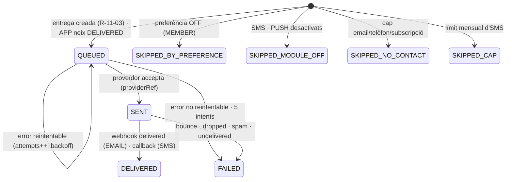
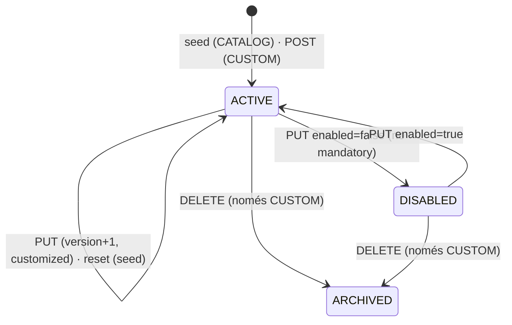

# S11 — Comunicacions: motor de notificacions, plantilles, preferències, correu/SMS/push, feed i FAQ

**Etapa:** E7 (la infraestructura de correu — `EmailSender`, ADR-005 — es construeix a **E1** perquè S01 pugui enviar enllaços màgics) · **Mòduls:** `SMS`, `PUSH`, `FAQ`, `LEARN_LINK` (només entrada de menú) · **Pantalles:** 11, 12 (bloc «Avisos», push, idioma), 30, D9, D10 (bloc «Preferències d'avisos») (fitxers a `03-disseny/mockups/pantalles/`) · **Model:** PLANTILLA_COMUNICAT · NOTIFICACIO · PREFERENCIA_AVIS · FAQ de v1.6 + §0, §2 (`LocalizedText`), §3 (`NotificationPreference` embegut, `PushSubscription`), §6 (outbox) de PLATAFORMA · **Estat:** esborrany (03-09-2026) · **Versió:** 0.1

## 1. Propòsit i abast

Resol **com arriba cada avís a cada persona**: el consumidor de l'outbox converteix un esdeveniment de domini en un codi del `CATALEG_NOTIFICACIONS.md`, tria la `MessageTemplate` del club, calcula destinataris i canals (matriu de la plantilla ∩ preferències ∩ mòduls), renderitza en l'idioma de cada destinatari amb el fus del club, despatxa per canal darrere d'interfícies (`EmailSender`, `SmsSender`, `PushSender`) amb idempotència i reintents, i ho deixa tot al log `notifications` que alimenta el feed (11). Inclou el manteniment de plantilles amb la matriu canals × públics (D9), «Enviar comunicat» des dels llistats (N-24), les preferències d'avís (12/D10) amb el recordatori per abonat, la subscripció push, el selector d'idioma i la pàgina «Info» (30). Els correus d'identitat (N-25/26/27) **s'envien des d'aquí** amb textos de producte no editables.

| Fora d'abast | On viu |
|---|---|
| Els esdeveniments que disparen cada avís (quan, amb quines variables) | cada vertical (§8 de S03…S13) |
| Processos programats: `ReminderDue`, `NoShowNoticeDue`, `SignupPendingAging`, `DocumentReminderDue`, `WeekOpened` | S15 |
| Manteniment de FAQ a D11 (`FaqEntry` CRUD, ordre) — aquí només la pantalla 30 | S05 (R-05-22) |
| Contingut i flux dels correus d'identitat (enllaç màgic, contrasenya) | S01 |
| Verificació DNS del domini de correu del club, alta de proveïdors | S17 |
| WhatsApp: **només manual** (botó `wa.me` a D10, S03); no existeix canal automàtic | S03 |

## 2. Pantalles i rutes

| Mockup | App | Ruta | Rol | Notes de comportament |
|---|---|---|---|---|
| 11 `mobil/11-notificacions.html` | `apps/clubs` | `/notificacions` | MEMBER, INSTRUCTOR, ADMIN (i IMPERSONATED) | `GET /me/notifications?page=0&size=20`. Targeta per notificació: icona i color de la plantilla (vora esquerra del color si `color ∈ {WARNING, ERROR, ACCENT}`, com al mockup), títol i cos **renderitzats**, línia «{fa 2 min · avui 07:00 · ahir 19:12}» amb `fmtRelative` i, si s'ha enviat SMS, « · i per SMS». Botó natiu per `action.type` (R-11-11): [CANVIA DE CLASSE], [AGAFA LA PLAÇA]; desactivat si `action.enabled=false`. En entrar, la llista es marca llegida (`POST /me/notifications/read-all`, assumpció) i la campaneta de 03 (`bell-anim` + punt taronja quan `unreadCount > 0`) s'apaga. Scroll infinit. Buit: «Encara no tens cap avís» (assumpció). Error: toast + reintent. |
| 12 `mobil/12-perfil-i-preferencies.html` (blocs «Avisos», «Idioma») | `apps/clubs` | `/perfil` | MEMBER (IMPERSONATED: lectura + escriptura auditada) | `GET/PUT /me/notification-preferences`. Capçalera «App · Correu». Files: «Operativa (reserves i canvis que has fet tu)» (tick verd · toggle OFF), «Comunicats personals per a tu» (tick · ON), «Canvis en reserves que has fet (fets pel club)» (tick amb «+SMS» · ON), «Recordatori de classe» (desplegable «Mai ▾» · opcions de `messaging.reminderOptionsMinutes`), divisor, «Vull rebre notificacions al mòbil quan hi hagi comunicats del club» (toggle). El tick verd és fix (APP sempre). Cada canvi desa immediatament (`PUT`, debounce 300 ms) i mostra toast d'error si falla. Activar el toggle de push o triar un recordatori ≠ «Mai» demana el permís del navegador **en context** (R-11-07); denegat → la preferència es desa igualment i la fila mostra «Activa les notificacions al navegador per rebre-les al mòbil» (assumpció). Bloc «Idioma»: desplegable amb `club.locales` («Català ▾») → `PATCH /me {locale}` (S01); **actiu** (ADR-011 supera l'atenuat del mockup). `LEARN_LINK` on: fila «Aprèn amb AgilityHub ›» (enllaç extern; posició §13). |
| 30 `mobil/30-info-preguntes-frequents.html` | `apps/clubs` | `/info` | MEMBER, INSTRUCTOR | `GET /faq-entries` (S05). Títol «Info»; grups per `category` resolta amb l'ordre de R-05-22; cada pregunta és un acordió: **obrir-ne una tanca les altres**; resposta = text pla amb salts de línia. 6a icona «Info» (icona `info` del joc del sistema) del tabbar només amb `FAQ` on; mòdul off → sense pestanya, ruta redirigeix a `/inici`. Buit: «El club encara no ha publicat preguntes» (assumpció). |
| D9 `escriptori/D9-comunicats-i-plantilles-d-avis.html` | `apps/clubs-admin` | `/comunicats` (`?template=id`) | ADMIN | `GET /message-templates`. Targeta «Plantilles per categoria» amb recomptes (Operativa · Comunicats individuals · Canvis en reserves · Comunicats del club) i llista (icona + nom, «(N-xx)» per a les de catàleg); [＋ Nova plantilla] → `POST` (categoria + títol; R-11-12). Editor: «Títol», xip de categoria (només editable a `CUSTOM`), «Icona:» (xips del joc d'icones del sistema), color, «idioma: CA ▾ (amb versió ES)» = pestanyes per `club.locales`, cos amb xips de variable (`[[…]]`, etiqueta en l'idioma de l'admin, valor desat = clau de codi), línia «Variables:» (només les del codi), «SMS (text curt)» quan la fila SMS és editable, taula «Canals per públic — aquesta plantilla» (App · Correu · SMS × Alumne · Instructors · Administrador; «✓ segons prefer.» sota Correu de l'alumne; cel·les fora dels `caps` del codi són «—» inertes; columna SMS només amb `SMS` on; columna Push informativa amb `PUSH` on), peu «L'SMS només és actiu a les plantilles de «Canvis en reserves fets pel club» · WhatsApp: només manual (wa.me)», [Vista prèvia] (`POST …/preview` amb l'esborrany, per idioma) · [DESA] (`PUT`, `409 STALE_VERSION` → «Algú ha modificat aquesta plantilla; recarrega-la»). Accions secundàries: «Restaura el text per defecte» (catàleg), «Desactiva» (no obligatòries), «Elimina» (`CUSTOM`). Diàleg «Enviar comunicat» (obert des de D5/D15 amb la selecció o els filtres, S03): plantilla (`CUSTOM` de `CLUB_NEWS`/`PERSONAL` o N-24), «S'enviarà a {n} abonats» (`dryRun`), [ENVIA] → `POST …/send`. |
| D10 bloc `escriptori/D10-fitxa-d-abonat.html` | `apps/clubs-admin` | `/abonats/:id` | ADMIN | «Preferències d'avisos (mantenibles aquí i al perfil)»: mateixa matriu que 12 amb literals «Operativa (reserves i canvis fets per l'abonat)», «Comunicats personals», «Canvis en reserves (fets pel club)» (+SMS), «Recordatori de classe» («Mai ▾»), «Notificacions push de comunicats del club». `PUT /members/{id}/notification-preferences` (auditat). Sota, enllaç «Avisos enviats ›» → `/notificacions?filter=memberId:eq:{id}` (assumpció). |
| Log d'avisos (sense mockup) | `apps/clubs-admin` | `/notificacions` | ADMIN | Llistat universal (`CONVENCIONS_API` §4) sobre `GET /notifications`: columnes data · codi · destinatari · canals amb estat · llegida; filtres per `code`, `channel`, `status`, `memberId`, `createdAt`. Detall: cos renderitzat + entregues + errors del proveïdor. |

## 3. Entitats i camps

Col·leccions pròpies: `message_templates`, `notifications`, `push_subscriptions`. Embegut: `Member.notificationPreferences`. Escriu també `Member.contactEmails[].bounced` (S03) i `Club.usage.smsSentMonth`. Tot amb `clubId`, `version` on s'edita, `createdAt/By`, `updatedAt/By`. Res s'esborra (`ARCHIVED`).

### `MessageTemplate` · `message_templates`
| Camp | Tipus | Oblig. | Validació / notes |
|---|---|---|---|
| `code` | string? | `CATALOG` | `N-01`…`N-38`; `null` a `CUSTOM`; únic `{clubId, code}` |
| `kind` | enum `CATALOG` · `CUSTOM` | sí | `CATALOG` neix del seed i no s'elimina; `CUSTOM` neix de [＋ Nova plantilla] |
| `category` | enum `OPERATIONAL` · `PERSONAL` · `CLUB_CHANGES` · `CLUB_NEWS` | sí | fixa a `CATALOG` (del `NotificationCatalog`); `SYSTEM` mai és plantilla (textos a `messages_*`) |
| `title`, `body`, `smsBody` | `LocalizedText` | títol/cos sí; `smsBody` si alguna cel·la SMS és activa | `defaultLocale` obligatori; `body` ≤ 2000, `smsBody` ≤ 160 GSM-7 renderitzat amb dades de mostra (R-11-06); sintaxi R-11-05 validada (`400 TEMPLATE_SYNTAX_ERROR`, `TEMPLATE_UNKNOWN_VARIABLE`, `TEMPLATE_MISSING_VARIABLE`) |
| `icon` | enum del joc d'icones (`check` · `x` · `unlock` · `warn` · `up` · `heart` · `bell` · `doc` · `flag` · `mail` · `cal` · `clock` · `info` · `paw` · `cone` · `lock`) | sí | mateixos ids que els mockups (`#i-…`); icones del sistema, mai emojis |
| `color` | enum `NEUTRAL` · `OK` · `WARNING` · `ERROR` · `ACCENT` | sí | tokens del tema (`text2`, `ok`, `avis`, `error`, `taronja`) |
| `matrix` | `{MEMBER, INSTRUCTORS, ADMINS} × {APP, EMAIL, SMS}: bool` | sí | només cel·les dins de `caps` del codi/categoria (`400 CHANNEL_NOT_ALLOWED`); `APPLICANT` i `PUSH` no s'hi desen (fixats pel codi) |
| `enabled`, `mandatory` | bool, bool | sí | `mandatory` (del catàleg: N-02, N-08a, N-15, N-17, N-32c, N-36) no es pot desactivar (`409 TEMPLATE_MANDATORY`) |
| `customized`, `status` | bool, enum `ACTIVE` · `DISABLED` · `ARCHIVED` | sí | `customized` = difereix del seed (mostra «Restaura el text per defecte») |

### `Notification` · `notifications` (log RF-NOT-03 + feed)
| Camp | Tipus | Notes |
|---|---|---|
| `code`, `category`, `templateId`, `templateVersion`, `eventId`, `eventType` | | traçabilitat plantilla ↔ esdeveniment |
| `dedupKey` | string | únic `{clubId, dedupKey}` (R-11-09) |
| `audience` | enum `MEMBER` · `INSTRUCTORS` · `ADMINS` · `APPLICANT` | |
| `recipient` | `{accountId?, memberId?, instructorId?, email?, displayName}` | `APPLICANT`: només `email` |
| `locale` | string | idioma amb què s'ha renderitzat |
| `subject` | `{dogId?, bookingId?, classSessionId?, waitlistEntryId?, trainingBookingId?, invoiceId?, activityId?, taskId?, memberId?}` | paràmetres de l'acció i del filtre del log |
| `icon`, `color`, `title`, `body`, `action {type, params}` | | **renderitzats i congelats** (canviar la plantilla no toca l'històric) |
| `deliveries[]` | `[{channel, target, status, attempts, nextAttemptAt?, providerRef?, lastError?, sentAt?, deliveredAt?, failedAt?}]` | una per canal **i per destinació** (cada telèfon, cada subscripció push); `status` §5; `APP` neix `DELIVERED` |
| `readAt` | instant? | feed; `unreadCount` = sense `readAt` amb entrega `APP` |

Índexs: `{clubId, dedupKey}` únic · `{clubId, recipient.accountId, createdAt desc}` · `{clubId, recipient.accountId, readAt}` · `{clubId, createdAt desc}` · `{deliveries.status, deliveries.nextAttemptAt}`.

### `NotificationPreference` (embegut a `Member.notificationPreferences`)
`emailByCategory {OPERATIONAL: false, PERSONAL: true, CLUB_CHANGES: true, CLUB_NEWS: true}` (valors per defecte de producte = mockup) · `reminderMinutesBefore` (int?, `null` = «Mai»; ha de ser ∈ `messaging.reminderOptionsMinutes`, `400 INVALID_REMINDER_OPTION`) · `pushClubNews` (bool, defecte `true`) · `updatedAt`, `updatedByAccountId`. Absència del bloc = valors per defecte.

### `PushSubscription` · `push_subscriptions`
`accountId`, `endpoint` (únic per club, hash), `keys {p256dh, auth}`, `deviceLabel` (derivat de l'User-Agent, «iPhone · Safari»), `userAgent`, `status` (`ACTIVE` · `EXPIRED`), `failureCount`, `lastSuccessAt`, `expiredAt`. Índex `{clubId, accountId, status}`.

### Altres
`FaqEntry` (S05: `category`, `question`, `answer` `LocalizedText`, `order`, `active`) · `Member.contactEmails[].bounced` (R-11-08) · `Club.usage.smsSentMonth {month: 'YYYY-MM', count}` (R-11-06) · `Club.theme` (logo i colors del layout de correu) · `NotificationCatalog` (codi de producte, no BBDD): per a cada `code` → `event(s)`, `category`, `audiences`, `caps` per públic, `push` per públic, `action`, `variables[]`, `requiredVariables[]`, `mandatory`, `dedupKeyFn`, `stillRelevantFn`, textos per defecte (`messages_*`).

## 4. Regles de negoci

**R-11-01 Plantilla i idioma.** Per a `code` i club, la plantilla és `message_templates{clubId, code}`; si no existeix (club creat abans d'un codi nou), s'usa el seed de producte i es crea en el primer ús. Codis `SYSTEM` (N-25, N-26, N-27) es renderitzen de `messages_{locale}` i no tenen plantilla. Idioma del destinatari: `Account.locale` → `club.defaultLocale` → primer idioma disponible (`APPLICANT`: `signup.locale`). `LocalizedText` de la plantilla: mateix fallback per camp. *Exemple:* usuari `en`, club `[ca, es]`, plantilla només `ca` → cos `ca`, dates formatades en `en`.

**R-11-02 Destinataris per públic.** `MEMBER`: els abonats del payload (`memberId`, `affected[]`, `entryIds[]`…; S08: en reserva d'un gos del grup, propietari **i** qui reserva). `INSTRUCTORS`: si l'esdeveniment porta `classId`, els `ClassSession.instructorIds` (nous i antics a N-08b); si no, tots els instructors actius. `ADMINS`: comptes amb `Membership.roles ∋ ADMIN` i `status = ACTIVE`. `APPLICANT`: `signup.email`. Una mateixa persona en dos públics rep dues notificacions (claus diferents). Abonats `LEFT` reben només el que el seu esdeveniment mana (N-28). *Exemple:* N-08a d'una classe de la Marta amb 3 inscrits i 1 en espera → 4 `MEMBER` (un per gos), 1 `INSTRUCTORS`, n `ADMINS`.

**R-11-03 Resolució de canals (taula de veritat).** Per a cada (`audience`, canal): `plantilla` = `matrix[audience][canal]` (`PUSH`: `catalog.push[audience]`; `APPLICANT`: només `EMAIL`), `mòdul` (`SMS`, `PUSH`), `preferència` (només `MEMBER` i categoria ≠ `SYSTEM`), `contacte`. Sense entrega per plantilla = cap document d'entrega; la notificació es desa igualment. Mòduls: `SMS` off → `SKIPPED_MODULE_OFF`; `PUSH` off → `SKIPPED_MODULE_OFF`.

| Públic | Canal | Plantilla | Mòdul | Preferència | Contacte | Resultat |
|---|---|---|---|---|---|---|
| MEMBER | APP | ✓ | — | sempre | compte | `DELIVERED` (feed) |
| MEMBER | EMAIL | ✓ | — | `emailByCategory[cat]` = true | ≥ 1 email no `bounced` | `QUEUED` a **tots** els emails no rebotats |
| MEMBER | EMAIL | ✓ | — | = false | — | `SKIPPED_BY_PREFERENCE` |
| MEMBER | EMAIL | ✓ | — | true | tots rebotats | `SKIPPED_NO_CONTACT` (+ avís admin R-11-08) |
| MEMBER | SMS | ✓ | on | fixa (no es pot treure: «+SMS») | ≥ 1 telèfon | `QUEUED` a **cada** telèfon |
| MEMBER | SMS | ✓ | on | — | — | límit assolit → `SKIPPED_CAP` + `EMAIL` forçat `QUEUED` (R-11-06) |
| MEMBER | PUSH | codi | on | `CLUB_NEWS`: `pushClubNews`; resta: sempre | ≥ 1 subscripció `ACTIVE` | `QUEUED` per subscripció · sense subscripció → `SKIPPED_NO_CONTACT` |
| INSTRUCTORS / ADMINS | APP · EMAIL · SMS | ✓ | segons canal | **s'ignoren** | emails/telèfons del seu `Member` | com MEMBER sense preferència |
| APPLICANT | EMAIL | fix | — | — | `signup.email` | `QUEUED` |
| qualsevol | qualsevol | ✗ o plantilla `DISABLED` | | | | cap entrega (`DISABLED`: cap notificació) |

*Exemple:* N-08a, Laura (`emailByCategory.CLUB_CHANGES = true`, 2 telèfons, 1 email), `SMS` on → APP + EMAIL + SMS×2. Mateixa Laura amb `emailByCategory.CLUB_CHANGES = false` → APP + SMS×2, EMAIL `SKIPPED_BY_PREFERENCE`. Club sense `SMS` → APP + EMAIL, SMS `SKIPPED_MODULE_OFF`.

**R-11-04 Preferències (12/D10).** Només afecten el públic `MEMBER` i només poden **treure** canals que la plantilla permet: APP mai; EMAIL per categoria; SMS fix («+SMS», Josep 18-08); PUSH només `CLUB_NEWS`. Valors per defecte: Operativa OFF · Personals ON · Canvis del club ON · `CLUB_NEWS` ON (fila no visible al mockup, §13). `reminderMinutesBefore` ∈ `messaging.reminderOptionsMinutes = [60, 120, 240, 360, 720, 1440]` o `null`; etiquetes «Mai», «{h} h abans» (múltiples d'hora), «{m} min abans». L'ADMIN edita el mateix bloc a D10 (auditat amb `actorAccountId`). Canviar l'antelació no reenvia recordatoris ja emesos (R-11-16). *Exemple:* Laura tria «2 h abans» → S15 emet `ReminderDue` a `startsAt − 120 min` per a classes i entrenaments.

**R-11-05 Renderització.** Per a cada destinatari: (1) `text = LocalizedText(locale)` de títol, cos i `smsBody`; (2) avaluació ICU4J (`MessageFormat`, `ApostropheMode.DOUBLE_REQUIRED` perquè l'apòstrof català no trenqui res) amb els arguments `gender`, `late`, `decision`, `kind`, `count`…; (3) substitució `[[var]]` per valors **ja formatats** en el `locale` del destinatari i `club.timeZone`; variable desconeguda → `400` en desar, buit + log `WARN` en renderitzar; (4) primera lletra en majúscula del títol i del cos («Demà 9:30…», «Ahir no vas…»); (5) correu: assumpte = títol, HTML Thymeleaf amb layout del club (logo, colors, nom) + text pla; SMS: R-11-06. Formats: `class_date`/`date` → «ahir» · «avui» · «demà» si ±1 dia, si no `fmtDate(weekday)` («dimecres 12»; amb mes si > 6 dies), `date` en forma curta («dt 4»); `class_time` «18:50»; `time` d'entrenament «8:00–8:30»; `review_time` «7:30», `review_day` relatiu; `effective_date`, `week_start` `fmtDate(long)`; `from_month`/`to_month` `fmtMonth`; `amount`, `fee` `fmtMoney`; `pack_expiry` `fmtDate(short)`; `level_name`, `activity_title`, `class_description` = `LocalizedText`/`displayDescription` resolts; `dog_name_article` («la Duna», «en Rock», «l'Ares» en `ca`; nom sol en `es`/`en`); `dogs` llista «Duna (C), Rock (D)»; `changes` llista de N-08b; `calendar_links` només correu; `masked_account` «···· 2231». Etiquetes de D9 (`ca`): `member_first_name` «persona_nom», `member_last_names` «persona_cognoms», `member_name` «persona_nom_complet», `dog_name` «gos_nom», `level_name` «gos_nivell», `class_date` «classe_data», `club_name` «entitat_nom», `admin_text` «text_admin», `effective_date` «persona_data_baixa». *Exemple:* N-16 `ca`, classe demà 9:30 «B+C» → «Demà 9:30 B+C esteu sols. Si ningú més no s'hi apunta abans de les 7:30 de demà, la classe es cancel·larà. Et proposem reservar-ne una altra.»

**R-11-06 SMS.** Text = `smsBody` renderitzat; transliteració a GSM-7 (`í→i`, `ó→o`, `ú→u`, `ç→c`, `ï→i`, `·→.`, `—→-`, cometes tipogràfiques → `"`) si `messaging.sms.transliterateToGsm7` (proposta, `true`); si supera **160** caràcters s'escurça amb «…» (el text complet va per app i correu); mai enllaços. Una entrega per telèfon (`phones[]`, E.164 amb `prefix`). Comptador `Club.usage.smsSentMonth` (mes local del club; es reinicia en canviar de mes): abans de cada enviament, si `count ≥ messaging.sms.monthlyCap` (1000) → `SKIPPED_CAP`, entrega `EMAIL` forçada (encara que la preferència sigui OFF) i N-49 (proposta) als admins **un cop per mes**. Proveïdor Twilio (`messaging.sms.senderId`; `SmsSender`), `SENT` en acceptar; `DELIVERED` només amb callback (§13). Números invàlids → `FAILED` no reintentable. *Exemple:* 998 enviats, N-08a a 3 inscrits amb 2 telèfons → 2 SMS surten, 4 `SKIPPED_CAP` amb correu forçat, N-49 als admins.

**R-11-07 Push.** `POST /push-subscriptions` des de 12 **en context** (mai a l'arrencada): en activar «Vull rebre notificacions al mòbil…» o un recordatori ≠ «Mai»; upsert per `endpoint`; clau pública VAPID a `GET /branding.pushPublicKey` (S02), claus privades per producte a variables d'entorn. Càrrega útil `{notificationId, title, body, icon, url, tag: code}`, TTL `messaging.push.ttlMinutes` (proposta, 1440); el service worker (Workbox, `PLA_FRONTEND` §2) mostra la notificació i, en clicar, obre `url` (`/notificacions` o l'enllaç de l'acció). Resposta 404/410 → `EXPIRED` + `PushUnsubscribed` (mai es reintenta); 429/5xx → reintent; 3 errors consecutius d'altra mena → `EXPIRED`. iOS ≥ 16.4 només amb la PWA instal·lada: si `navigator.standalone` és fals a iOS, la fila mostra «Afegeix l'app a la pantalla d'inici per rebre notificacions» (assumpció). Logout → `DELETE` de la subscripció del dispositiu. Push és **millora**: cap regla de negoci en depèn.

**R-11-08 Correu.** `From` = `messaging.email.fromName` <`messaging.email.fromAddress`>; per defecte l'adreça és del domini de producte verificat (`{clubSlug}@mail.agilitydoghub.com`, SPF/DKIM del producte); un domini propi del club només si S17 l'ha verificat (`Club.domains[].verifiedAt`), altrament es cau al de producte amb el `fromName` del club. `Reply-To` = `messaging.email.replyTo`. Destinataris: tots els `contactEmails[]` no `bounced`. Webhook del proveïdor (`/webhooks/email/{provider}`, signatura obligatòria, idempotent per id d'esdeveniment): `delivered` → `DELIVERED`; `bounce` (dur) · `dropped` · `spamreport` → `FAILED`, `Member.contactEmails[email].bounced = true`, `EmailBounced` (proposta) i N-51 (proposta) als admins; `deferred` → res. L'admin treu la marca editant l'email a D10 (S03). Peu amb enllaç «Deixar de rebre aquests comunicats» **només** a `CLUB_NEWS` (capçalera `List-Unsubscribe` + token signat 30 dies → `emailByCategory.CLUB_NEWS = false`); els transaccionals mai en porten. *Exemple:* rebot dur de `laura@…` → cap correu més a aquesta adreça; el segon email de la Laura continua rebent.

**R-11-09 Idempotència i reintents.** El consumidor és idempotent per `eventId` (`processedAt`). `dedupKey` = `{eventId}:{code}:{audience}:{recipientKey}[:{subjectKey}]` (`recipientKey` = `accountId` o `email:` normalitzat; `subjectKey` = `dogId` quan és per gos); excepcions del catàleg: N-13 → `N-13:{bookingId|trainingBookingId}` (un recordatori per reserva), N-24 → `{batchId}:{memberId}`. Reprocessar un esdeveniment reutilitza el document i no crea entregues noves; el despatxador només toca entregues `QUEUED` amb `nextAttemptAt ≤ now`. Reintents: errors reintentables (timeout, 429, 5xx) fins a 5 intents amb 1 · 5 · 15 · 60 · 240 min (constants tècniques); després `FAILED` + `NotificationFailed`. Cada entrega guarda `providerRef` i `lastError`. *Exemple:* S06 reintenta l'anul·lació amb la mateixa `Idempotency-Key` → mateix `eventId` → cap SMS duplicat.

**R-11-10 Log i feed.** Tot avís queda a `notifications` encara que cap canal extern s'hagi enviat; res s'esborra. Feed = notificacions del compte amb entrega `APP`, ordre `createdAt desc`, 20 per pàgina, de qualsevol públic (un instructor veu N-21/22 al mateix feed; filtre opcional `audience`). «i per SMS» quan alguna entrega SMS és `SENT`/`DELIVERED` (el correu no s'indica, assumpció). `POST …/read` és idempotent; `read-all` marca les creades fins a `now`. `unreadCount` es retorna a `GET /me/home` (S08). L'ADMIN consulta el log complet del club a `GET /notifications` (filtre universal); mai el d'un altre club.

**R-11-11 Accions natives per codi** (fixades pel codi, mai per la plantilla, R28-08). `CHANGE_CLASS` (N-08a, N-16, N-17): obre 04 amb `subject.dogId` preseleccionat; sempre habilitada mentre el gos sigui accessible; **la sessió anul·lada no compta** (S08 R-08-02). `CLAIM_SEAT` (N-15): `params {waitlistEntryId, classSessionId, dogId}`; `enabled` = entrada `NOTIFIED` (i `confirmBy > now` en FIFO) calculat a la lectura; en tocar → `POST /seat-holds` + `claim` (S08 R-08-15); `WAITLIST` off → mai s'emet N-15. `OPEN_BOOKING` (N-04, N-08b, N-13, N-33, N-36) → 07 o 04; `OPEN_DOG` (N-09, N-11, N-21, N-22, N-23, N-37) → 13 / fitxa del gos; `OPEN_TASKS` (N-20) → 13 tasques; `OPEN_INVOICES` (N-10, N-30, N-35) → D6 / 12; `OPEN_ACTIVITY` (N-32) → detall S07; `OPEN_SETUP` (N-31) → 08; `OPEN_SIGNUP` (N-01, N-34) → D2; `OPEN_MEMBER` (N-14, N-18a) → D10. Literals dels botons: «CANVIA DE CLASSE», «AGAFA LA PLAÇA»; la resta obren en tocar la targeta (sense botó, com les informatives del mockup). Correu: l'acció es tradueix en un enllaç profund a la mateixa ruta.

**R-11-12 Manteniment de plantilles (D9).** `CATALOG`: categoria, acció, variables, `caps` i `push` són del codi; l'admin edita títol, cos, `smsBody`, icona, color, matriu (dins de `caps`) i `enabled` (no `mandatory`). `caps` per categoria: `OPERATIONAL`/`PERSONAL` → APP+EMAIL per als tres públics; `CLUB_CHANGES` → APP+EMAIL+SMS per a `MEMBER` i APP+EMAIL per a `INSTRUCTORS`/`ADMINS` (v1.6: l'SMS només s'activa per a l'alumne); `CLUB_NEWS` → APP+EMAIL; excepció del catàleg N-15 (SMS a `MEMBER`). `requiredVariables`: N-02 `link`, N-08a `admin_text`, N-15 cap però l'acció és fixa. El cos editat és el del públic `MEMBER`; instructors i admins reben els textos de producte del codi (`notif.N-xx.staff.*`, no editables; assumpció §13). `CUSTOM`: categoria ∈ `PERSONAL` · `CLUB_NEWS` · `CLUB_CHANGES`, variables d'abonat (`member_*`, `gender`, `club_name`, `dog_name` = gossos actius units amb «i»), sense acció, només enviables manualment. `reset` restaura el seed i `customized = false`. `MessageTemplateChanged` a cada canvi; cache per club invalidada. Vista prèvia amb el joc de dades fictícies per idioma («Laura», «Duna» nivell «C», «dimecres 12 · 18:50 · B+C · Central», text de l'admin de la pluja) i, per a SMS, `length` i `segments` després de transliterar. *Exemple:* activar SMS a «Canvi de nivell» → `400 CHANNEL_NOT_ALLOWED`.

**R-11-13 Enviament manual (N-24, «Enviar comunicat»).** `POST /message-templates/{id}/send {recipients: {memberIds[]} | {filters[], q}, dryRun}` només amb plantilla N-24 o `CUSTOM` (`409 TEMPLATE_NOT_SENDABLE`); destinataris = abonats resultants (qualsevol estat que mostri el llistat), `422 NO_RECIPIENTS` si cap. Emet `AnnouncementSent{templateId, batchId, recipientCount, filters}`; el motor crea una notificació `MEMBER` per abonat amb la matriu de la plantilla i les preferències de cadascú. Enviament **immediat** (sense programació, assumpció). Auditat (`actorAccountId`, `recipientCount`, filtres). *Exemple:* D5 amb filtre `planId = Pack 10` (37 abonats) → «S'enviarà a 37 abonats» → 37 notificacions, correu segons `emailByCategory.CLUB_NEWS`, push si `pushClubNews` i subscripció.

**R-11-14 FAQ (30).** `GET /faq-entries` retorna només actives amb `category`, `question`, `answer` resolts; el front agrupa i ordena com R-05-22 i implementa l'acordió exclusiu. `FAQ` off → `404 MODULE_DISABLED`, sense pestanya. Cap dada pròpia d'aquest vertical.

**R-11-15 Idioma.** El selector de 12 escriu `Account.locale` (`PATCH /me`, S01): la UI canvia a l'instant i **les notificacions següents** es renderitzen en el nou idioma; les ja creades no es re-renderitzen. Els comunicats surten sempre en l'idioma del destinatari (supera el «idioma de la plantilla» de `DETALL_FUNCIONAL` §J3).

**R-11-16 Contracte amb S15 per a N-13.** `ReminderDue{bookingId | trainingBookingId, memberId, dogId, startsAt}` → abans de renderitzar, `stillRelevant`: la reserva continua `ACTIVE` i `startsAt > now`; si no, es descarta sense log d'entrega (es desa `SKIPPED_STALE`, proposta). Canals: APP + PUSH, EMAIL segons `emailByCategory.OPERATIONAL`. Variable `kind` (`CLASS` · `TRAINING`) tria el títol («Recordatori de classe» / «Recordatori d'entrenament»).

**R-11-17 Mòduls i branques.** `SMS` off: columna SMS oculta a D9 (les cel·les es conserven), cap entrega SMS, «+SMS» ocult a 12/D10, mai «i per SMS». `PUSH` off: `/push-subscriptions` → 404, columna Push oculta, toggle de push ocult a 12/D10, entregues `SKIPPED_MODULE_OFF`. `FAQ` off: R-11-14. `LEARN_LINK` off: sense fila «Aprèn amb AgilityHub». `WAITLIST` off: N-15 mai; `BILLING` off: N-10/11/30/35/38 mai (no hi ha esdeveniments). Reactivar un mòdul no reenvia res.

## 5. Estats i transicions





| Transició | Qui | Condició | Efectes | Esdeveniment |
|---|---|---|---|---|
| — → `QUEUED` / `SKIPPED_*` | consumidor de l'outbox | R-11-03 | document `Notification` (upsert per `dedupKey`) | `NotificationQueued` |
| `QUEUED` → `SENT` | despatxador | proveïdor accepta | `providerRef`, `sentAt`, `usage.smsSentMonth++` (SMS) | `NotificationSent` |
| `QUEUED` → `FAILED` | despatxador | no reintentable o 5 intents | `lastError`; PUSH 410 → subscripció `EXPIRED` | `NotificationFailed` (+ `PushUnsubscribed`) |
| `SENT` → `DELIVERED` / `FAILED` | webhook | signatura vàlida | bounce dur → `contactEmails[].bounced` | `EmailBounced` (proposta) |
| plantilla `ACTIVE` → `ACTIVE` | ADMIN | validació R-11-12, `version` | `customized`, cache | `MessageTemplateChanged` |
| plantilla `ACTIVE` ⇄ `DISABLED` | ADMIN | `mandatory = false` | cap notificació mentre `DISABLED` | `MessageTemplateChanged` |
| plantilla → `ARCHIVED` | ADMIN | `kind = CUSTOM` | invisible a D9 i al diàleg d'enviament | `MessageTemplateChanged` |
| subscripció `ACTIVE` → `EXPIRED` | despatxador · logout | 404/410 · `DELETE` | `expiredAt` | `PushUnsubscribed` |

## 6. API

Totes sota `/api/v1`; tenant pel JWT. `I` = `Idempotency-Key`.

| Mètode | Ruta | Rol(s) | Mòdul | I | Descripció | Cos / paràmetres clau | Respostes i errors |
|---|---|---|---|---|---|---|---|
| GET | `/message-templates` | ADMIN | — | — | Llista D9 (`category?`, `kind?`, `includeArchived?`) | | 200 `{items[{id, code, kind, category, name, icon, color, enabled, customized, matrix, caps, push, variables[{key, label}]}], countsByCategory}` |
| POST | `/message-templates` | ADMIN | — | — | Plantilla `CUSTOM` | `{category, title, body, smsBody?, icon, color, matrix}` | 201 · 400 `VALIDATION_ERROR` `TEMPLATE_SYNTAX_ERROR` `TEMPLATE_UNKNOWN_VARIABLE` `CHANNEL_NOT_ALLOWED` `SMS_BODY_REQUIRED` `SMS_BODY_TOO_LONG` |
| GET | `/message-templates/{id}` | ADMIN | — | — | Detall amb mapes `titleI18n`, `bodyI18n`, `smsBodyI18n`, `seedDefault` | | 200 · 404 |
| PUT | `/message-templates/{id}` | ADMIN | — | — | Edició (R-11-12) | `{title, body, smsBody, icon, color, matrix, enabled, version}` (+ `category` a `CUSTOM`) | 200 · 400 (idem POST + `TEMPLATE_MISSING_VARIABLE`) · 409 `STALE_VERSION` `TEMPLATE_MANDATORY` |
| POST | `/message-templates/{id}/preview` | ADMIN | — | — | Vista prèvia amb dades fictícies | `{locale, draft?: {title, body, smsBody}}` | 200 `{title, body, emailSubject, emailHtml, sms: {text, length, segments, truncated}, warnings[]}` |
| POST | `/message-templates/{id}/reset` | ADMIN | — | — | Restaura el seed | — | 200 · 409 `TEMPLATE_NOT_CATALOG` |
| DELETE | `/message-templates/{id}` | ADMIN | — | — | `CUSTOM` → `ARCHIVED` | — | 204 · 409 `TEMPLATE_NOT_CUSTOM` |
| POST | `/message-templates/{id}/send` | ADMIN | — | sí | Enviament manual (R-11-13) | `{recipients: {memberIds[]} \| {filters[], q}, dryRun}` | 202 `{batchId, recipientCount}` · 200 (dryRun) · 409 `TEMPLATE_NOT_SENDABLE` · 422 `NO_RECIPIENTS` |
| GET | `/notifications` · `/notifications/{id}` · `/notifications/filter-values` | ADMIN | — | — | Log del club (filtre universal: `code`, `category`, `channel`, `status`, `memberId`, `createdAt`) | `page`, `size`, `filter=`, `sort=` | 200 · 400 `INVALID_FILTER` |
| GET | `/me/notifications` | MEMBER · INSTRUCTOR · ADMIN | — | — | Feed 11 | `page`, `size`, `audience?` | 200 `{items[{id, code, category, icon, color, title, body, createdAt, channels[], readAt, action {type, params, enabled}}], unreadCount, …}` |
| POST | `/me/notifications/{id}/read` · `/me/notifications/read-all` | idem | — | — | Marca llegida | — | 200 `{unreadCount}` · 404 |
| GET | `/me/notification-preferences` | MEMBER (IMPERSONATED) | — | — | Bloc «Avisos» de 12 | | 200 `{emailByCategory, smsFixed: true, reminderMinutesBefore, reminderOptionsMinutes[], pushClubNews, locale, availableLocales[], modules: {sms, push}}` |
| PUT | `/me/notification-preferences` | MEMBER (IMPERSONATED) | — | — | Desa (parcial) | `{emailByCategory?, reminderMinutesBefore?, pushClubNews?}` | 200 · 400 `INVALID_REMINDER_OPTION` |
| PUT | `/members/{id}/notification-preferences` | ADMIN | — | — | D10 (auditat) | idem | 200 · 404 |
| POST | `/push-subscriptions` | MEMBER · INSTRUCTOR · ADMIN | `PUSH` | — | Upsert per `endpoint` | `{endpoint, keys {p256dh, auth}, deviceLabel?}` | 201 `{id}` · 400 `PUSH_SUBSCRIPTION_INVALID` · 404 `MODULE_DISABLED` |
| DELETE | `/push-subscriptions/{id}` | idem (pròpia) | `PUSH` | — | Baixa (logout) | — | 204 |
| GET | `/faq-entries` | MEMBER · INSTRUCTOR · ADMIN | `FAQ` | — | S05 (R-05-22); 30 el consumeix | | 200 `{items[{id, category, question, answer, order}]}` · 404 `MODULE_DISABLED` |
| POST | `/webhooks/email/{provider}` | ANON (signatura) | — | — | Estats de correu (R-11-08) | cos del proveïdor | 200 · 401 `WEBHOOK_SIGNATURE_INVALID` |
| POST | `/email-unsubscribes` (proposta) | ANON (token) | — | — | Baixa de `CLUB_NEWS` | `{token}` | 200 · 400 `UNSUBSCRIBE_TOKEN_INVALID` |
| PATCH | `/me` `{locale}` (S01) · GET `/branding.pushPublicKey` (S02) · GET `/me/home.notifications.unreadCount` (S08) | | | | contractes que aquest vertical usa | | |

`GET /me/notifications` (200, extracte):
```json
{ "items": [
  { "id":"n1","code":"N-08a","category":"CLUB_CHANGES","icon":"x","color":"ERROR","title":"Classe anul·lada pel club",
    "body":"Dimecres 12 · 18:50 · B+C · Central, amb Duna. «La classe queda anul·lada per la pluja. Podeu reservar-ne una altra des de l'app. Disculpeu les molèsties!» — Cànic Agility. Aquesta sessió no compta al teu còmput.",
    "createdAt":"2026-08-10T15:58:00Z","channels":["APP","EMAIL","SMS"],"readAt":null,
    "action":{"type":"CHANGE_CLASS","params":{"dogId":"d1"},"enabled":true} },
  { "id":"n2","code":"N-15","category":"OPERATIONAL","icon":"unlock","color":"ACCENT","title":"S'ha alliberat una plaça!",
    "body":"Classe C i superiors · dijous 6 · 20:00. Estàs a la llista d'espera — la plaça és per a qui confirmi primer.",
    "createdAt":"2026-08-10T15:56:00Z","channels":["APP","SMS","PUSH"],"readAt":null,
    "action":{"type":"CLAIM_SEAT","params":{"waitlistEntryId":"w1","classSessionId":"c2","dogId":"d1"},"enabled":true} } ],
  "page":0,"size":20,"totalItems":6,"unreadCount":2 }
```

`GET /me/notification-preferences` (200):
```json
{ "emailByCategory": {"OPERATIONAL": false, "PERSONAL": true, "CLUB_CHANGES": true, "CLUB_NEWS": true},
  "smsFixed": true, "reminderMinutesBefore": null, "reminderOptionsMinutes": [60, 120, 240, 360, 720, 1440],
  "pushClubNews": true, "locale": "ca", "availableLocales": ["ca", "es"], "modules": {"sms": true, "push": true} }
```

Interfícies de proveïdor (`application/integrations`), totes amb doble de test (`Fake*`, registre en memòria) i implementació `Log*` per a `dev`:
```
interface EmailSender { SendResult send(EmailMessage m); }     // SendGridEmailSender (v3 mail/send, custom_args {clubId, notificationId}); webhook Event Webhook signat (ECDSA)
interface SmsSender   { SendResult send(SmsMessage m); }       // TwilioSmsSender (Messages API, from = messaging.sms.senderId, to E.164)
interface PushSender  { PushResult send(PushSubscription s, PushPayload p); }   // WebPushSender (VAPID, aes128gcm); PushResult ∈ OK · GONE · RETRYABLE · FAILED
record SendResult(String providerRef, boolean retryable, String error)
```

Pipeline del consumidor (idempotent, fora de la transacció de negoci):
```
onEvent(evt):                                                   // dispatcher de l'outbox → NotificationEventHandler
  for spec in catalog.specsFor(evt.type, evt.payload):          // 0..n codis (p. ex. ClassAutoCancelled → N-17; ClassCancelledByClub → N-08a)
    tpl = templates.forCode(clubId, spec.code) ?: seed(spec.code); if tpl.status == DISABLED: continue
    if !spec.stillRelevant(evt): continue                        // N-13: reserva encara ACTIVE
    for (audience, recipients) in spec.recipients(evt):          // R-11-02
      for r in recipients:
        locale = r.locale ?: club.defaultLocale
        vars = spec.variables(evt, r, locale, club.timeZone)     // valors ja formatats (R-11-05)
        rendered = renderer.render(tpl, spec, locale, vars)      // title, body, smsBody, emailSubject/html
        n = notifications.upsert(dedupKey(spec, evt, audience, r), rendered, action(spec, evt))
        for d in channelResolver.resolve(tpl, spec, audience, r, club): n.addDeliveryIfAbsent(d)   // R-11-03
        notifications.save(n); dispatcher.trigger(n.id)
dispatch(nId):                                                  // també el poll cada 5 s sobre {QUEUED, nextAttemptAt ≤ now}
  for d in n.deliveries where d.status == QUEUED and d.nextAttemptAt <= now:
    if d.channel == SMS and smsCounter.reached(club): d.skipCap(); n.forceEmail(); continue
    res = sender(d.channel).send(build(n, d))
    res.ok ? d.sent(res.providerRef) : res.retryable && d.attempts < 5 ? d.retry(backoff(d.attempts)) : d.failed(res.error)
```

Codis d'error propis: `TEMPLATE_SYNTAX_ERROR`, `TEMPLATE_UNKNOWN_VARIABLE`, `TEMPLATE_MISSING_VARIABLE`, `CHANNEL_NOT_ALLOWED`, `SMS_BODY_REQUIRED`, `SMS_BODY_TOO_LONG` (400) · `TEMPLATE_MANDATORY`, `TEMPLATE_NOT_CATALOG`, `TEMPLATE_NOT_CUSTOM`, `TEMPLATE_NOT_SENDABLE`, `STALE_VERSION` (409) · `NO_RECIPIENTS` (422) · `INVALID_REMINDER_OPTION`, `PUSH_SUBSCRIPTION_INVALID`, `UNSUBSCRIBE_TOKEN_INVALID` (400) · `WEBHOOK_SIGNATURE_INVALID` (401) · `MODULE_DISABLED` (404).

## 7. Esdeveniments

**Emesos**: `MessageTemplateChanged{id, diff}` · `NotificationQueued/Sent/Failed{notificationId, channel}` · `AnnouncementSent{templateId, batchId, recipientCount, filters}` · `PushSubscribed/Unsubscribed{accountId, endpoint}` · propostes §13: `EmailBounced{memberId, email, type}`, `SmsCapReached{month, cap}`, `NotificationPreferencesChanged{memberId, diff, byAccountId}`, `EmailUnsubscribed{memberId}`.

**Consumits** (tots els que el catàleg lliga a un codi; el `NotificationCatalog` és l'única taula esdeveniment → codi):

| Esdeveniment | Codi(s) | Particularitats |
|---|---|---|
| `SignupSubmitted` · `MemberValidated` · `SignupRejected` | N-01 · N-02 · N-03 | S04 §8; N-02 amb `link` de benvinguda (S01) |
| `BookingCreated{origin}` · `BookingCancelled{by, origin, late}` | N-04 / N-36 · N-05 / N-36 | `BACKOFFICE` → N-36 (SMS); `INSTRUCTOR` → N-05 (S08 R-08-19) |
| `TrainingBooked` · `TrainingCancelled` | N-06 · N-07 | no per `cancelReason = MEMBER_LEFT` (S09) |
| `ClassCancelledByClub{reason, adminText, affected[], waitlistIds[]}` | N-08a | `MEMBER` sempre (també `RISK_REVIEW`, amb el text automàtic); `INSTRUCTORS`/`ADMINS` només si `reason ≠ RISK_REVIEW` (§13) |
| `ClassSessionUpdated{diff, bookedCount > 0}` | N-08b | només si `diff ∩ {startTime, ringId, instructorIds} ≠ ∅` |
| `ClassAutoCancelled` · `ClassAtRisk` | N-17 (`ADMINS`+`INSTRUCTORS`) · N-16 | S15 |
| `DogLevelChanged` · `DogRegistered` · `DogDeactivated{CLUB}` · `MemberNoteChanged` | N-09 · N-37 · N-37 · N-22 | S03 |
| `WaitlistNotified{entryIds[], confirmBy?}` | N-15 | SMS + PUSH; `confirm_by` només FIFO |
| `InvoiceFailed{provider}` · `InvoicePaid{STRIPE}` · `UpfrontPaymentSucceeded` | N-10 (+ N-35 si `STRIPE`) · N-30 · N-30 | N-30 amb Stripe només si `billing.stripeReceiptEmail = false` |
| `PackLowBalance` · `PackExpiring` · `PackExpired` | N-11a · N-11b | S12/S15 |
| `ReminderDue` · `NoShowNoticeDue` · `SignupPendingAging` · `WeekOpened` · `DocumentReminderDue` | N-13 · N-19 · N-34 · N-33 · N-23 | S15; N-33 només si `messaging.notifyWeekOpening` |
| `LeaveRequested` · `LeaveResolved` · `Inactivity{Requested, Resolved, Ended}` | N-14 · N-28 · N-18a/b/c | S13 |
| `TaskCreated` · `TaskCompleted` · `DogDocumentPending{MANUAL}` | N-20 · N-21 · N-23 | S10/S03 |
| `BookingBlockChanged` · `MemberPaymentMethodChanged` | N-29 · N-38 | S03 |
| `ActivityPublished` · `ActivityRegistrationChanged` · `ActivityCancelled` | N-32a · N-32b · N-32c | S07 |
| `RingSetupChanged{ACTIVE}` | N-31 | només si `messaging.notifyNewRingSetup` |
| `MagicLinkRequested` · `PasswordChanged` · `AccessResent` | N-25 · N-26 · N-27 | `SYSTEM`: `messages_*`, sempre EMAIL, `expires_minutes = auth.magicLinkMinutes` |
| `AnnouncementSent` | N-24 / `CUSTOM` | R-11-13 |
| `ClubUpdated` · `ParameterChanged{messaging.*}` · `ClubModulesChanged` · `MembershipChanged` | — | invalidació de caches (plantilles, remitent, llista d'admins/instructors) |

## 8. Notificacions

| Codi | Moment exacte | Destinataris i canals | Variables |
|---|---|---|---|
| N-13 Recordatori | `ReminderDue` de S15 a `startsAt − reminderMinutesBefore` (classes **i** entrenaments), si la reserva és `ACTIVE` | MEMBER → APP + PUSH (+ EMAIL si `emailByCategory.OPERATIONAL`) · `OPEN_BOOKING` | `kind`, `dog_name`, `date`, `time`, `ring_name`, `class_description` |
| N-24 Comunicat del club | `AnnouncementSent` (R-11-13) | selecció → APP + EMAIL (`emailByCategory.CLUB_NEWS`) + PUSH (`pushClubNews`) | text lliure amb `member_*`, `gender`, `dog_name`, `club_name` |
| N-49 (proposta) Límit mensual d'SMS assolit | primer `SKIPPED_CAP` del mes | ADMINS → APP + EMAIL (`OPERATIONAL`) | `month`, `cap` |
| N-51 (proposta) Correu rebotat | `EmailBounced` | ADMINS → APP · `OPEN_MEMBER` | `member_name`, `email` |

La resta de codis els **renderitza i envia** aquest vertical amb el moment i les variables que fixa cada spec (§7).

**Seed del Cànic** (`ca` = literals dels mockups; `es`/`en` generats per IA i revisats abans del go-live; matriu = columna «Públic → canals per defecte» del catàleg; `SMS` on i `PUSH` on):
`OPERATIONAL`: N-01, N-04, N-05, N-06, N-07, N-10, N-13, N-14, N-15, N-18a, N-21, N-22, N-31, N-32b, N-33, N-34 · `PERSONAL`: N-02, N-03, N-09, N-11a, N-11b, N-18b, N-18c, N-19, N-20, N-23, N-28, N-29, N-30, N-35, N-37, N-38 · `CLUB_CHANGES`: N-08a, N-08b, N-16, N-17, N-32c, N-36 · `CLUB_NEWS`: N-24, N-32a · `SYSTEM` (sense plantilla): N-25, N-26, N-27.

| Codi | Icona · color | Títol `ca` | Cos `ca` (públic MEMBER) · `smsBody` |
|---|---|---|---|
| N-08a | `x` · `ERROR` | Classe anul·lada pel club | «[[class_date]] · [[class_time]] · [[class_description]] · [[ring_name]], amb [[dog_name]]. «[[admin_text]]» — [[club_name]]. Aquesta sessió no compta al teu còmput.» · SMS: «[[club_name]]: la classe de [[class_date]] a les [[class_time]] ([[class_description]]) queda anul·lada. [[admin_text]]» |
| N-15 | `unlock` · `ACCENT` | S'ha alliberat una plaça! | «Classe [[class_description]] · [[class_date]] · [[class_time]]. Estàs a la llista d'espera — la plaça és per a qui confirmi primer.» (`FIFO`: «… Tens fins a les [[confirm_by]] per confirmar-la.») · SMS: «[[club_name]]: s'ha alliberat una plaça a la classe de [[class_date]] a les [[class_time]] ([[class_description]]). Entra a l'app per agafar-la.» |
| N-16 | `warn` · `WARNING` | Possible anul·lació de classe | «[[class_date]] [[class_time]] [[class_description]] esteu sols. Si ningú més no s'hi apunta abans de les [[review_time]] de [[review_day]], la classe es cancel·larà. Et proposem reservar-ne una altra.» |
| N-09 | `up` · `OK` | [[dog_name_article]] puja de nivell! | «Per la vostra evolució, [[dog_name_article]] ja ha pujat a nivell [[level_name]]. Ja podeu reservar classes en aquest nou nivell; les classes que ja teníeu reservades, encara que no siguin d'aquest nivell, segueixen sent vàlides.» |
| N-19 | `heart` · `NEUTRAL` | T'hem trobat a faltar | «[[class_date]] no vas poder venir a la classe de [[class_description]]. Recorda que pots anul·lar des de l'app fins a última hora: així pot aprofitar la classe algú altre. La sessió compta dins el teu còmput.» |
| N-06 | `check` · `OK` | Reserva confirmada | «Entrenament lliure · [[date]] · [[time]] · [[ring_name]] · amb [[dog_name]].» |
| N-04 | `check` · `OK` | Reserva confirmada | «Classe [[class_description]] · [[class_date]] · [[class_time]] · [[ring_name]] · amb [[dog_name]].» (assumpció, simètric de N-06) |
| N-02 | `mail` · `OK` | {gender, select, female {Benvinguda} other {Benvingut}} a [[club_name]], [[member_first_name]]! | «Ja tens accés a l'app del club. Entra-hi amb aquest enllaç: [[link]].» (`link` obligatori; bloc d'enllaç del layout de correu) |
| N-28 | `doc` · `NEUTRAL` | Comunicació de baixa com a associat | «Hola [[member_first_name]], et comuniquem que en data [[effective_date]] s'ha fet efectiva la teva baixa com a associat de [[club_name]]. T'agraïm el temps que hem compartit — les portes sempre seran obertes per a tu i per a [[dog_name]]. Fins aviat!» (cos de D9) |
| N-13 | `clock` · `NEUTRAL` | {kind, select, TRAINING {Recordatori d'entrenament} other {Recordatori de classe}} | «[[date]] a les [[time]] · [[class_description]] · [[ring_name]] · amb [[dog_name]].» |

Els altres codis reben títol = nom del catàleg i un cos de producte breu amb les seves variables (fitxer `seed/message-templates.{ca,es,en}.json`, revisat com a text `ca` abans del go-live). Textos de personal (`INSTRUCTORS`/`ADMINS`) a `messages_*` (`notif.N-xx.staff.title/body`).

## 9. Paràmetres i mòduls

| Clau (Cànic) | Ús |
|---|---|
| `messaging.email.fromName` («Club Agility Cànic»), `fromAddress`, `replyTo` | R-11-08 |
| `messaging.sms.senderId`, `messaging.sms.monthlyCap` (1000) | R-11-06 |
| `messaging.reminderOptionsMinutes` (60, 120, 240, 360, 720, 1440) | R-11-04; validació de `reminderMinutesBefore` |
| `messaging.notifyWeekOpening` (false), `messaging.notifyNewRingSetup` (false) | condició de N-33 / N-31 (§7) |
| `messaging.noShowNoticeTime` (08:00), `messaging.documentReminderDays` (0) | llegits per S15; aquí només es documenta l'origen de N-19/N-23 |
| `auth.magicLinkMinutes` (15) | `expires_minutes` de N-25/N-27 |
| `billing.stripeReceiptEmail` (true) | condició de N-30 amb Stripe |
| `waitlist.mode` (ALL_AT_ONCE), `waitlist.fifoConfirmMinutes` | variant del seed de N-15 i `confirm_by` |
| `club.timeZone` (Europe/Madrid), `club.locales` ([ca, es]), `club.defaultLocale` (ca), `Club.name`, `Club.theme` | formats, fallback, `club_name`, layout de correu, selector d'idioma |
| **Propostes**: `messaging.sms.transliterateToGsm7` (bool, true, bloc Comunicacions) · `messaging.push.ttlMinutes` (int, 1440, sistema) | R-11-06, R-11-07 |

Mòduls i branques: R-11-17 (`SMS`, `PUSH`, `FAQ`, `LEARN_LINK`; efectes indirectes de `WAITLIST`, `BILLING`, `PACKS`, `TASKS`, `ACTIVITIES`, `COURSES`, `INACTIVITY`, `FREE_TRAINING` = absència dels seus esdeveniments).

## 10. i18n i localització

- Namespaces front: `notifications` (11: `feed.empty`, `feed.viaSms` «i per SMS», `feed.action.CHANGE_CLASS` «CANVIA DE CLASSE», `feed.action.CLAIM_SEAT` «AGAFA LA PLAÇA»), `profile` (12: `alerts.title` «Avisos», `alerts.column.app/email`, `alerts.row.OPERATIONAL/PERSONAL/CLUB_CHANGES` amb els literals del mockup, `alerts.smsFixed` «+SMS», `alerts.reminder` «Recordatori de classe», `alerts.reminder.never` «Mai», `alerts.reminder.hours` `{hours} h abans`, `alerts.reminder.minutes` `{minutes} min abans`, `alerts.pushClubNews` «Vull rebre notificacions al mòbil quan hi hagi comunicats del club», `alerts.pushDenied`, `alerts.iosInstall`, `language.title` «Idioma», `learnLink` «Aprèn amb AgilityHub»), `faq` (`title` «Info», `empty`), `admin-messaging` (D9: `templates.*`, `matrix.*` amb «Canals per públic — aquesta plantilla», «segons prefer.», peu de l'SMS, `send.*` «Enviar comunicat», «S'enviarà a {count} abonats», `log.*`), `admin-census` (bloc de D10 amb els seus literals), `enums:` `notificationCategory.*` («Operativa», «Comunicats individuals», «Canvis en reserves», «Comunicats del club»), `deliveryStatus.*`, `notificationChannel.*`, `templateIcon.*`, `templateColor.*`, `errors:` codis del §6.
- Back (`messages_{ca,es,en}.properties`): `notif.N-xx.title/body/sms` (seed de producte per a tots els codis), `notif.N-xx.staff.title/body`, `email.layout.*` (peu, «Deixar de rebre aquests comunicats», «Respon a aquest correu per contactar amb el club»), `notif.variable.<key>` (etiquetes de D9: «persona_nom»…), `notif.preview.*` (dades fictícies per idioma), `error.<CODE>`.
- `LocalizedText`: `MessageTemplate.title/body/smsBody`, `FaqEntry.*`, `Level.name`, `Activity.title`, `Plan.name`; lectura resolta + mapa a D9. Fallback R-11-01 amb test obligatori (usuari `en`, club `ca/es`).
- Gènere: ICU `select` amb `gender` (`OTHER` → `other`). Article personal del gos només en `ca` (`dog_name_article`, helper compartit amb `packages/i18n/format.ts` de S08).
- Fus horari: totes les dates de variables amb `club.timeZone`; «avui/demà/ahir» amb la data local del club; `fmtRelative` del feed amb l'hora del dispositiu però la data del club. Test amb `Europe/Madrid` i `America/Argentina/Buenos_Aires`.
- Perfil de país: telèfons E.164 a partir de `phones[].prefix` (S03); cap altre efecte.

## 11. Criteris d'acceptació i tests obligatoris

**Domini (unitaris, `Clock` injectat, dobles de proveïdor)**
- T-11-01 (R-11-01) Given plantilla només `ca` i destinatari `en` → cos `ca`, dates en `en`; destinatari `es` amb `es` present → `es`; `APPLICANT` → `signup.locale`.
- T-11-02 (R-11-03) Taula de veritat completa: per a cada fila de la taula de R-11-03 i per a cada codi del catàleg, `resolve()` retorna exactament les entregues i els `SKIPPED_*` esperats (preferències ON/OFF × mòduls ON/OFF × contacte present/absent), PLA_BACKEND §9.8.
- T-11-03 (R-11-04) Preferències: `emailByCategory.CLUB_CHANGES=false` treu EMAIL i **no** SMS; `pushClubNews=false` treu PUSH només a `CLUB_NEWS`; categoria `SYSTEM` ignora preferències; `INSTRUCTORS` ignora preferències; opció de recordatori fora de la llista → `INVALID_REMINDER_OPTION`.
- T-11-04 (R-11-05) Renderització: `[[var]]` desconeguda → error en desar, buit en renderitzar; ICU `gender` female/male/other; apòstrofs («l'app», «d'aquest») intactes; majúscula inicial; `class_date` «ahir/avui/demà» vs «dimecres 12» vs «dimecres 12 d'octubre» (> 6 dies); `date` «dt 4»; `time` «8:00–8:30».
- T-11-05 (R-11-05) Snapshot de **cada** codi del seed en `ca`, `es`, `en` amb el joc de dades fictícies (títol, cos, SMS, HTML de correu) i dels textos `staff` (CONVENCIONS_I18N §5).
- T-11-06 (R-11-06) SMS: transliteració (`í ó ú ç ï ·` → GSM-7), 161 caràcters → escurçat amb «…», text de l'admin llarg → SMS escurçat i correu complet; una entrega per telèfon; `smsBody` buit amb SMS actiu → `SMS_BODY_REQUIRED`.
- T-11-07 (R-11-06) Límit mensual: 999 → envia; 1000 → `SKIPPED_CAP` + EMAIL forçat encara que `emailByCategory` sigui OFF + N-49 una sola vegada al mes; canvi de mes reinicia el comptador (mes **local** del club).
- T-11-08 (R-11-09) `dedupKey`: mateix esdeveniment reprocessat → cap entrega nova ni document duplicat; N-13 dos `ReminderDue` per la mateixa reserva → un sol recordatori; persona inscrita **i** admin → dues notificacions; dos gossos del mateix abonat a la classe → dues.
- T-11-09 (R-11-09) Reintents: `retryable` → `QUEUED` amb `nextAttemptAt` = 1, 5, 15, 60, 240 min; al 5è error → `FAILED` + `NotificationFailed`; error no reintentable → `FAILED` al primer.
- T-11-10 (R-11-07) Push: `GONE` → subscripció `EXPIRED` + `PushUnsubscribed`, cap reintent; `RETRYABLE` → reintent; 3 `FAILED` consecutius → `EXPIRED`; sense subscripció → `SKIPPED_NO_CONTACT`.
- T-11-11 (R-11-08) Bounce dur → `contactEmails[i].bounced=true`, `EmailBounced`, N-51; següent avís → `SKIPPED_NO_CONTACT` només si tots rebotats; `deferred` → cap canvi; esdeveniment de webhook repetit → idempotent.
- T-11-12 (R-11-12) Validacions de plantilla: cel·la fora de `caps` → `CHANNEL_NOT_ALLOWED`; N-02 sense `[[link]]` → `TEMPLATE_MISSING_VARIABLE`; claus desbalancejades → `TEMPLATE_SYNTAX_ERROR`; `mandatory` + `enabled=false` → `TEMPLATE_MANDATORY`; `reset` restaura el seed i `customized=false`.
- T-11-13 (R-11-16) `ReminderDue` amb reserva ja anul·lada → cap entrega; `kind=TRAINING` → títol d'entrenament.
- T-11-14 (R-11-02) Destinataris: N-08b als instructors nous **i** antics; N-21 a tots els instructors actius quan no hi ha `classId`; `ADMINS` = membresies `ACTIVE` amb rol ADMIN; abonat `LEFT` rep N-28 i no N-24.
- T-11-15 (R-11-05, R-11-06) Fus horari: club `Europe/Madrid` i club `America/Argentina/Buenos_Aires` amb el mateix instant → «demà»/«avui» i mes del comptador d'SMS correctes a cadascun.

**Integració (Testcontainers; per endpoint: camí feliç · 400 · 403 · tenant creuat 404 · mòdul off 404 · 409 · outbox)**
- T-11-16 `GET/POST/PUT/DELETE /message-templates`: llista amb recomptes per categoria; `CUSTOM` creada i arxivada; `PUT` amb `version` vell → `STALE_VERSION`; `MessageTemplateChanged` a l'outbox; `MEMBER`/`INSTRUCTOR` → 403.
- T-11-17 `POST …/preview` amb esborrany no desat en `ca`, `es`, `en`: `sms.length/segments/truncated` i `warnings` (variable desconeguda).
- T-11-18 (R-11-13) `POST …/send` amb `memberIds` i amb `filters` (mateixa semàntica que `GET /members`); `dryRun` no crea res; enviament real → `AnnouncementSent`, una notificació per abonat amb `dedupKey {batchId}:{memberId}`, preferències aplicades; N-08a per `send` → `TEMPLATE_NOT_SENDABLE`; llista buida → `NO_RECIPIENTS`; `Idempotency-Key` repetida → mateix `batchId`.
- T-11-19 (R-11-10, R-11-11) `GET /me/notifications`: només les del compte (públic `MEMBER` i `INSTRUCTORS` al mateix feed), ordre desc, paginació, `channels` amb SMS només si `SENT/DELIVERED`, notificacions sense entrega `APP` (N-38) absents del feed però presents al log, `action.type/params` per codi i `action.enabled=false` quan l'entrada d'espera ja no és `NOTIFIED`; `read`/`read-all` idempotents i `unreadCount` coherent amb `GET /me/home`; notificació d'un altre compte → 404.
- T-11-20 `GET/PUT /me/notification-preferences` i `PUT /members/{id}/notification-preferences`: defectes de producte quan no hi ha bloc; `PUT` parcial no toca la resta; D10 auditat amb `actorAccountId`; `modules.sms/push` reflecteixen el club.
- T-11-21 (R-11-07, R-11-17) `POST/DELETE /push-subscriptions`: upsert pel mateix `endpoint`, `PushSubscribed`; `PUSH` off → 404 i entregues PUSH `SKIPPED_MODULE_OFF`; `SMS` off → entregues SMS `SKIPPED_MODULE_OFF` i `GET /message-templates` marca la columna SMS com a no disponible; subscripció d'un altre compte → 404.
- T-11-22 `POST /webhooks/email/sendgrid`: signatura invàlida → 401; `delivered` → `DELIVERED`; `bounce` → T-11-11; esdeveniments d'un altre club/notificació inexistent → 200 sense efecte.
- T-11-23 (R-11-08) Correu de `CLUB_NEWS` porta `List-Unsubscribe` i peu; un `PERSONAL` no; `POST /email-unsubscribes` amb token vàlid → `emailByCategory.CLUB_NEWS=false` + `EmailUnsubscribed`; caducat → 400.
- T-11-24 Extrem a extrem del motor amb dobles: `ClassCancelledByClub` (3 inscrits, 1 en espera, instructor, 2 admins) → 4 N-08a `MEMBER` (APP+EMAIL+SMS×telèfons), 1 `INSTRUCTORS` (APP+EMAIL, text `staff`), 2 `ADMINS` (APP); `reason=RISK_REVIEW` → només `MEMBER`; `ClassAutoCancelled` → N-17 a admins i instructors.
- T-11-25 `SYSTEM`: `MagicLinkRequested` → correu de `messages_*` en l'idioma del compte amb `expires_minutes = auth.magicLinkMinutes`, sense plantilla a D9, preferències ignorades.
- T-11-26 `GET /notifications` (ADMIN): filtre universal per `code`, `channel`, `status`, `memberId`; camp no declarat → `INVALID_FILTER`; club B no veu el log del club A.
- T-11-27 (R-11-14, R-11-17) `GET /faq-entries` des de 30: resolt en `es` amb fallback `ca`; només actives; `FAQ` off → 404 i la PWA amaga la pestanya.
- T-11-40 (R-11-15) `PATCH /me {locale: es}` seguit d'un esdeveniment nou → la notificació nova es renderitza en `es` i les anteriors conserven `locale = ca` i el text original.

**Tenant i rols** — T-11-28 Matriu completa de §6 (rol permès i cada rol denegat; `IMPERSONATED` pot llegir i marcar el feed i desar preferències amb auditoria, però `/message-templates*` i `/notifications` → 403); T-11-29 cap plantilla, notificació ni subscripció del club A és visible ni modificable des del club B (404).

**Concurrència** — T-11-30 Dos despatxadors sobre la mateixa entrega `QUEUED` → un sol enviament (`findOneAndUpdate` d'estat); T-11-31 100 `ReminderDue` simultanis → 100 notificacions, cap duplicat.

**Schedulers (contracte amb S15)** — T-11-32 `ReminderDue` idempotent per reserva; T-11-33 `NoShowNoticeDue` amb 3 reserves → 3 N-19 amb `class_date = ahir`.

**Front (component / E2E)**
- T-11-34 (R-11-10, R-11-11) 11: cada codi del seed renderitza icona, color, vora, botó i «i per SMS» com al mockup; [CANVIA DE CLASSE] obre 04 amb el gos de `params.dogId`; [AGAFA LA PLAÇA] desactivat quan `enabled=false` i, actiu, encadena `POST /seat-holds` → 06/29; obrir la pantalla crida `read-all` i apaga la campaneta de 03.
- T-11-35 (R-11-04, R-11-15, R-11-17) 12: matriu amb tick verd fix, toggles amb defectes, «+SMS» ocult amb `SMS` off, desplegable «Mai · 1 h abans … 24 h abans», toggle de push ocult amb `PUSH` off, permís demanat només en interactuar, fila «Aprèn amb AgilityHub» només amb `LEARN_LINK`, selector d'idioma amb `club.locales` que canvia la UI i crida `PATCH /me`.
- T-11-36 (R-11-14) 30: acordió exclusiu (obrir-ne una tanca l'anterior), grups en l'ordre de R-05-22, pestanya «Info» absent amb `FAQ` off.
- T-11-37 D9: pestanyes per idioma, xips de variable amb etiqueta localitzada i valor de codi, cel·les fora de `caps` inertes, columna SMS/Push segons mòduls, vista prèvia per idioma amb comptador d'SMS, `STALE_VERSION` mostrat.
- T-11-38 D10 bloc i diàleg «Enviar comunicat» des de D5 (selecció i filtres, `dryRun` → «S'enviarà a {n} abonats»).
- T-11-39 E2E Playwright (seed demo): anul·lar una classe a D4c → Laura veu N-08a a 11 amb «i per SMS» (doble de Twilio) → [CANVIA DE CLASSE] obre 04 amb la Duna; i el mateix en `es`.

## 12. Paquets de feina (per a fils d'IA en paral·lel)

| Paquet | Repo | Depèn de | Lliurable verificable |
|---|---|---|---|
| WP-11-A Contracte | `agilityhub-core-api` | catàlegs transversals, S03 (`Member`), S05 (`FaqEntry`) | OpenAPI del §6 (DTOs, enums, `ErrorCode`), `NotificationCatalog` amb els 38 codis (esdeveniments, públics, `caps`, `push`, acció, variables, `dedupKeyFn`), tipus a `packages/api-client`; diff validat a CI |
| WP-11-B0 Correu base (**E1**) | `agilityhub-core-api` | WP-11-A | `EmailSender` + `SendGridEmailSender` + `FakeEmailSender`/`LogEmailSender`, layout Thymeleaf per club, webhook `/webhooks/email/{provider}`, camí `SYSTEM` del motor (N-25/26/27) usable per S01; T-11-22, T-11-25 |
| WP-11-B Motor + proveïdors (E7) | `agilityhub-core-api` | WP-11-B0 | consumidor de l'outbox, `ChannelResolver`, `TemplateRenderer` (ICU + `[[var]]` + formats), `Notification` + despatxador amb reintents, `TwilioSmsSender` + comptador i límit, `WebPushSender` + `PushSubscription`, bounces i `List-Unsubscribe`; T-11-01…15, 21, 23, 24, 30–33 |
| WP-11-C Plantilles i preferències (back) | `agilityhub-core-api` | WP-11-A (dobles de B) | `MessageTemplate` CRUD + preview + reset + send + log `GET /notifications`, `NotificationPreference` endpoints (12/D10), seed `ca/es/en`; T-11-16…20, 26, 28, 29 |
| WP-11-D Front D9 + D10 bloc + diàleg d'enviament | `agilityhub-core-web` | WP-11-A (mock MSW) | D9 complet, bloc de D10, diàleg des de D5/D15, llistat del log; T-11-37, 38 |
| WP-11-E Front 11 + 12 + 30 + push | `agilityhub-core-web` | WP-11-A (mock) | feed amb accions natives i campaneta, bloc «Avisos»/«Idioma» de 12, subscripció push + service worker (Workbox), pantalla 30; T-11-34…36 |
| WP-11-F Integració | tots dos | B, C, D, E, seed demo | E2E T-11-39, revisió costat a costat amb els mockups, snapshots `ca/es/en` revisats |

Ordre: A → B0 (E1) → (B ∥ C ∥ D/E) → F. Tres fils: **B** (motor + proveïdors), **C+D** (plantilles i preferències, back i front), **E** (feed, perfil, FAQ, push).

## 13. Dubtes oberts

| # | Dubte | Amb qui | Assumpció mentrestant |
|---|---|---|---|
| 1 | **ADR-005 (proveïdor de correu)** — entrades per decidir a E1: volum baix (< 5.000 correus/mes per club), webhook d'esdeveniments signat, dominis d'enviament verificats per subcompte o per remitent (`{clubSlug}@mail.agilitydoghub.com` + domini propi opcional), API JSON amb `custom_args`/tags per `clubId`+`notificationId`, plantilles nostres (Thymeleaf), cost i regió UE (RGPD), experiència prèvia (SendGrid a Learn) vs. Postmark/SES/Brevo | Jordi | SendGrid com a implementació de referència darrere `EmailSender`; canviar de proveïdor = una classe + un webhook |
| 2 | Fila «Comunicats del club» a la matriu de 12/D10 (no és al mockup) per poder tornar a activar el correu després de «Deixar de rebre» | Josep | `emailByCategory.CLUB_NEWS` existeix i es mostra com a 4a fila (assumpció) |
| 3 | Textos per a instructors/administrador no editables a D9 (el cos editat és el de l'alumne) | Jordi | textos `staff` de producte |
| 4 | N-08a per `RISK_REVIEW`: aquí neix de `ClassCancelledByClub` (qualsevol motiu) i N-17 només al personal; S06 §8 / S15 han d'alinear-s'hi | Jordi | com a §7 (idempotent: mai duplica) |
| 5 | Numeració de notificacions | resolt 03-09 | catàleg tancat: N-49 (límit d'SMS) i N-51 (rebot) |
| 6 | Enviament manual sense programació; audiència només abonats (no instructors) | Josep | immediat, `MEMBER` |
| 7 | Literals assumits: «Encara no tens cap avís», «El club encara no ha publicat preguntes», «Activa les notificacions al navegador…», «Afegeix l'app a la pantalla d'inici…», «Avisos enviats ›», «S'enviarà a {n} abonats», camp «SMS (text curt)» i accions «Restaura el text per defecte» · «Desactiva» · «Elimina» de D9 (no són al mockup), selector de color, títol de N-04, «Recordatori d'entrenament», «C i superiors» vs `displayDescription` «C i sup.» (S06) | Josep | els del §2/§8 |
| 8 | Entrar a 11 marca-ho tot llegit; el correu no s'indica al feed («i per SMS» només) | Jordi | sí / sí |
| 9 | Desactivar plantilles no obligatòries (`enabled`) i plantilles `CUSTOM` a `CLUB_CHANGES` amb SMS | Jordi | permès |
| 10 | Callback d'estat de Twilio (`/webhooks/sms/twilio`) per a `DELIVERED` dels SMS | Jordi | `SENT` és l'estat final d'SMS a R1 |
| 11 | Entrada «Aprèn amb AgilityHub» (`LEARN_LINK`): posició a 12 (després d'«Els meus gossos») i literal | Jordi | fila a 12 amb `learn.agilitydoghub.com` |
| 12 | Selector d'idioma actiu (ADR-011) tot i l'atenuat del mockup 12; idiomes = `club.locales` | Josep | actiu, `ca`/`es` al Cànic |
| 13 | Retenció del log `notifications` (mai s'esborra) i pseudonimització en supressió de compte | Jordi (S14) | es conserva; S14 pseudonimitza `recipient` |

**Propostes de catàleg**: paràmetres `messaging.sms.transliterateToGsm7`, `messaging.push.ttlMinutes`; notificacions N-49 «Límit mensual d'SMS assolit» (OPERATIONAL, ADMINS → APP+EMAIL) i N-51 «Correu rebotat» (OPERATIONAL, ADMINS → APP, `OPEN_MEMBER`); esdeveniments `EmailBounced`, `SmsCapReached`, `NotificationPreferencesChanged`, `EmailUnsubscribed`; estats d'entrega `SKIPPED_NO_CONTACT`, `SKIPPED_CAP`, `SKIPPED_STALE`; variables `member_last_names`, `dog_name_article`, `kind` (N-13), `class_description` a N-19; ruta `POST /email-unsubscribes`; codis d'error del §6.

## Canvis

- 03-09-2026 · v0.1 · esborrany inicial.
- 03-09-2026 · catàleg tancat: «Límit mensual d'SMS assolit» = **N-49**, «Correu rebotat» = **N-51** (abans N-41/N-42, que queden per a S15).
- 05-09-2026 · la pantalla **30 «Info»** guanya pestanyes: **FAQ · Normes · [altres `ClubPage` actives]** (`GET /club-pages?active=true`); la pàgina `RULES` també s'enllaça des de l'alta (19: «Normes del club: consulta-les aquí», sense acceptació) i des del web del club.
