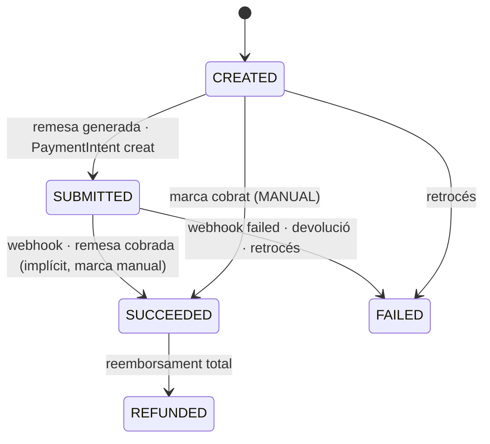

# S12 — Facturació i pagaments

**Etapa:** E8 · **Mòduls:** `BILLING` (tot el vertical), `PACKS`, `SINGLE_CLASS`, `INACTIVITY` (quota), `FAMILY_GROUP` (pagador únic) · **Pantalles:** D6 (`escriptori/D6-facturacio-simulacio-rebuts-i-remesa-sepa.html`), D8 (preus — només lectura, manteniment a S05), D10 (bloc «Rebuts recents» / «Tots els rebuts ›»), 13 (comptador de pack), 19 (pas de pagament — lliurament des de S04), 12 (entrada «Rebuts») · **Model:** v1.6 §D (REBUT/LINIA/REMESA, COBRAMENT_ANTICIPAT, CONSUM_PACK), MODALITAT/TARIFA; PLATAFORMA §2 (`CLUB.paymentProviders`), §3 (`Member.paymentMethod`, `Plan`, `Price`), **§4 (pagaments: és el model d'aquest vertical)**, §6 (outbox) · ADR-009 · **Estat:** esborrany (03-09-2026) · **Versió:** 0.1

## 1. Propòsit i abast

Resol **com el club cobra**: el cicle mensual de D6 (simulació → generació de rebuts → cobrament per proveïdor → conciliació), els **rebuts** (`Invoice`) neutres de proveïdor i **immutables**, els **intents de cobrament** (`Collection`) per `SEPA_XML` (remesa pain.008 al banc), `STRIPE` (targeta off-session, compte Stripe propi del club) i `MANUAL` (efectiu/transferència/Bizum), el **retrocés** d'una generació errònia, els **pagaments a l'acte** (`UpfrontPayment`: entrada, primer mes, packs, classe individual), els **packs** (`PackBalance`: obertura, consum, retorn, ajust, caducitat), la **classe individual** (línies per consum o pagament en reservar), els webhooks de Stripe, la vista de rebuts de l'abonat i l'**export per a comptabilitat**. Principi: el sistema emet **rebuts** (justificants de cobrament amb numeració pròpia); la factura fiscal, si cal, la fa la comptabilitat del club a partir de l'export (decisió del club 02-08-2026).

| Fora d'abast | On viu |
|---|---|
| Manteniment de modalitats i preus (`Plan`, `Price`, `PriceResolver`, `EntryFeeCalculator`) | S05 |
| Captura del mètode de pagament a l'alta, Checkout de l'alta, import cobrat a la validació | S04 (aquí: el processament del webhook i el que passa després) |
| Canvi de mètode de pagament per l'admin (`PATCH /members/{id}/payment-method`) | S03 (aquí: `mandateRef`, SetupIntent i «Targeta no vàlida») |
| Regles d'inactivitat i baixa (quins mesos es cobren) | S13 (`InactivityFeeService`, `LeaveBillingService`) — aquí es consumeixen |
| Consum i retorn de sessions de pack en reservar/anul·lar | S08 (crida `PackBalanceService` d'aquesta spec) |
| Assistència que dispara el càrrec de classe individual | S10 (emet `AttendanceMarked`; aquí es consumeix) |
| Caducitat de packs i recordatori de remesa (processos) | S15 (P5a, P10) |
| Motor d'exportació (`ExportJob`) i pseudonimització RGPD | S14 (aquí: `listKey = accounting` i `forgetCustomer`) |
| Facturació del SAAS al club, Stripe Connect | R4 (VISIO §6) |

## 2. Pantalles i rutes

| Mockup | App | Ruta | Rol | Comportament |
|---|---|---|---|---|
| D6 | clubs-admin | `/facturacio?mes=YYYY-MM` | ADMIN | Capçalera «{Mes} {any}» amb ‹ mes · mes › i tres accions: **[1 · SIMULA EL MES]** → `POST /billing/simulations`; **[2 · GENERA REMESA SEPA (XML)]** (etiqueta segons proveïdors: amb `SEPA_XML` el literal del mockup; només `STRIPE` → «2 · GENERA ELS REBUTS I COBRA LES TARGETES»; només `MANUAL` → «2 · GENERA ELS REBUTS» — assumpció §13) → confirmació forta («Es generaran {n} rebuts per un total de {import}. La data del proper rebut dels abonats avançarà al dia 1 de {mes+1}.») → `POST /billing/runs`; **[Retrocedeix la remesa]** (visible només amb una generació del mes retrocedible, R-12-14) → confirmació amb text a escriure («RETROCEDIR») → `POST /billing/runs/{id}/rollback`. Targeta «Pas 1 — Simulació: incidències primer» (recompte vermell + files «{nom} · {incidència} · Obre fitxa» → D10), «Actius amb pagament en efectiu» (files «{nom} · data de baixa prevista: {data} · Obre fitxa»), KPIs «Rebuts del mes · simulats el {data}», «Import de la remesa · data de cobrament: {dd/mm}», «En efectiu · pendents de marcar cobrat», «Quota d'inactivitat · {fee1} el 1r mes · {fee2}/mes». Amb `STRIPE`: KPI extra «Amb targeta · {n} · {import}» i, després de generar, botó **[COBRA LES TARGETES]** → `POST /billing/runs/{id}/card-charges` (assumpció). Llistat de rebuts (universal, CONVENCIONS §4) amb xips **Tots (n) · Pendents (n) · Remesats (n) · Cobrats · Impagats (n)**, accions **[Marcar cobrat (selecció)]** i **[Exporta per a comptabilitat]**; columnes Núm. · Abonat (→ D10) · Concepte · Import · Mètode («Domiciliació» · «Targeta» · «Efectiu») · Estat («remesat», «pendent · marca cobrat», «cobrat», «impagat (manual)», «impagat (targeta)», «anul·lat»). Fila → calaix del rebut (línies, cobraments, accions R-12-16…19). Estats buit («Encara no hi ha cap simulació d'aquest mes»), carregant, error amb `traceId`. |
| D6 (remeses) | clubs-admin | `/facturacio/remeses` | ADMIN | Llistat de `Remittance` (mes, data, n rebuts, import, estat, fitxer) amb [Descarrega l'XML] → `GET /remittances/{id}/file` i [Marca com a enviada al banc] → `POST /remittances/{id}/submission` (assumpció §13: pantalla sense mockup, mateix patró de llistat). |
| D10 (bloc) | clubs-admin | `/abonats/:id` | ADMIN | «Rebuts recents» (5 darrers: número, concepte, import, estat) + «Tots els rebuts ›» → `/facturacio?filter=memberId:eq:{id}`; «Pagaments a l'acte» (entrada, packs) amb [Registra un pagament] → `POST /upfront-payments`; per gos amb pack: «Pack {n} — {consumides} consumides · {disponibles} disponibles · caduca el {data}» + [Ajusta] → `POST /pack-balances/{id}/adjustments`; distintius «Compte no informat» (S03) i **«Targeta no vàlida»** (R-12-22). |
| 12 → «Rebuts» | clubs | `/rebuts` | MEMBER | Llista pròpia (`GET /me/invoices`): mes, concepte, import, estat («pendent», «cobrat», «impagat»); rebut → detall amb línies i [Descarrega el justificant] (`GET /me/invoices/{id}/document`, assumpció). Amb `CARD` i cobrament fallit: bàner «No hem pogut cobrar el rebut de {mes}» + [Actualitza la targeta] (R-12-22). Sense mockup: es dissenya amb el design system (§13). |
| 13 (pack) | clubs | `/gossos` | MEMBER | «Pack {n} — amb {gos}» + barra + «{consumides} consumides · {disponibles} disponibles» + «caduca {data}» (`GET /me/pack-balances`), com al mockup 04/13. |
| 19 / 06 (Checkout) | clubs | retorn de Stripe | ANON · MEMBER | Retorn `successUrl`/`cancelUrl` (S04 R-04-26, S08 R-08-18): la confirmació real arriba pel webhook; la pantalla mostra «Pagament rebut» només quan `GET /checkout-sessions/{id}` retorna `PAID` (polling ≤ 10 s), si no «Estem confirmant el pagament…». |

## 3. Entitats i camps

Noms de codi (PLATAFORMA §0/§4). Tots amb `clubId`, índexs `{clubId, …}`; imports `Money {amountMinor, currency}` en la moneda del club.

### `Invoice` (`invoices`) — rebut (append-only)
| Camp | Tipus | Obl. | Validació / notes |
|---|---|---|---|
| `series`, `number`, `displayNumber` | string, int, string | sí | `displayNumber = "{series}-{number:04d}"` («2026-0912»); únic `{clubId, series, number}` (R-12-08) |
| `issueDate` | date | sí | data local del club de la generació |
| `period` | `YearMonth` | sí | mes facturat («Setembre 2026») |
| `memberId`, `memberSnapshot {number, fullName, taxId?}` | | sí | instantània per a l'export |
| `lines[]` | `InvoiceLine[]` | ≥ 1 | `{lineNo, origin: MONTHLY_FEE · MAINTENANCE_FEE · INACTIVITY_FEE · SINGLE_CLASS · PACK · ADJUSTMENT, priceId?, bookingId?, description (congelada, `defaultLocale` del club), base: Money, taxPercent, tax: Money, total: Money}` |
| `total`, `base`, `tax` | Money | sí | suma de línies (R-12-09) |
| `paymentMethod` | congelat | sí | `{type: SEPA_DD · CARD · MANUAL, maskedAccount?, holderName?, mandateRef?, last4?, channel?}` |
| `status` | enum | sí | `PENDING · COLLECTING · PAID · FAILED · CANCELLED` (§5) |
| `runId`, `remittanceId?`, `paidAt?`, `failedAt?`, `failureReason?`, `cancelledAt?`, `cancelReason?` | | | |
| `kind` | enum | sí | `PERIODIC` (generat pel run) · `MANUAL` (ajust creat per l'admin, R-12-19) |
| `version`, `createdAt`, `createdByAccountId` | | | |

### `Collection` (`collections`) — intent de cobrament (append-only)
`invoiceId`, `provider` (`SEPA_XML · STRIPE · MANUAL`), `amount`, `status` (`CREATED · SUBMITTED · SUCCEEDED · FAILED · REFUNDED`), `providerRef` (Stripe `paymentIntentId` · SEPA `mandateRef`+`endToEndId` · manual `channel`), `remittanceId?`, `attempt` (1..n), `failureCode?`, `failureMessage?`, `refunds[] {amount, providerRef, at, reason, byAccountId}`, `createdAt`, `resolvedAt`.

### `Remittance` (`remittances`)
`runId`, `period`, `messageId` (`MsgId`), `creationAt`, `requestedCollectionDate`, `creditor {name, id, iban, bic?}` (instantània), `collectionIds[]`, `count`, `total`, `sequenceBreakdown {FRST, RCUR}`, `fileKey` (S3), `xsdValidatedAt`, `status` (`GENERATED · SUBMITTED · ROLLED_BACK`), `submittedAt?`, `submittedByAccountId?`.

### `BillingRun` (`billing_runs`) — una generació d'un mes
`period`, `status` (`GENERATED · CHARGING · COMPLETED · ROLLED_BACK`), `simulationId`, `invoiceIds[]`, `byProvider {SEPA_XML: {count, total, remittanceId}, STRIPE: {count, total, charged, failed}, MANUAL: {count, total}}`, `collectionDate`, `startedAt`, `finishedAt`, `rollbackable` (calculat, R-12-14), `createdByAccountId`, `rolledBackAt?`, `rollbackReason?`.

### `BillingSimulation` (`billing_simulations`)
`period`, `at`, `incidents[] {memberId, code: NO_BANK_ACCOUNT · NO_PLAN · NO_PRICE · CARD_INVALID · CURRENCY_MISMATCH, label}`, `cashMembers[] {memberId, plannedLeaveDate?}`, `invoicesPreview[] {memberId, lines[], total, paymentMethodType}`, `kpis {count, total, byProvider, cashPending, inactivityFees}`; es conserva l'última per mes (la resta s'esborra).

### `UpfrontPayment` (`upfront_payments`) — pagament a l'acte
Camps de S04 §3 + `concept` ampliat: `ENTRY_FEE · FIRST_MONTH · PACK · SINGLE_CLASS · ACTIVITY · OTHER`; `status`: `DUE · CHECKOUT_PENDING · PARTIAL · PAID · CANCELLED · REFUNDED`; `provider` (`STRIPE {checkoutSessionId, paymentIntentId, chargeId} · MANUAL {channel, paidAt, reference?}`), `bookingId?` (classe individual), `activityRegistrationId?`, `packBalanceId?`, `refunds[]`, `note`.

### `PackBalance` (`pack_balances`)
`memberId`, `dogId`, `planId`, `upfrontPaymentId?`, `sessionsTotal`, `consumed`, `remaining` (calculat), `openedOn`, `expiresOn` (R-12-24), `state` (`ACTIVE · EXPIRED · CLOSED`), `movements[] {type: OPEN · CONSUME · REFUND · ADJUST · EXPIRE, delta, bookingId?, reason?, byAccountId?, at}`, `expiryWarnedAt?`, `expiredAt?`.

### `PendingCharge` (`pending_charges`) — classe individual per consum
`memberId`, `dogId`, `bookingId` (únic), `priceId`, `amount`, `description`, `createdAt`, `invoiceId?` (quan s'ha facturat), `voidedAt?`.

### `StripeEvent` (`stripe_events`)
`eventId` (únic), `clubId`, `type`, `receivedAt`, `processedAt?`, `outcome` (`PROCESSED · IGNORED · FAILED`), `payloadHash`.

### Configuració (CLUB, S02)
`paymentProviders.SEPA_XML {creditorName, creditorId, iban, bic?, suffix}`, `STRIPE {secretKeyEnc, publishableKey, webhookSecretEnc, mode: test|live, accountId}`, `MANUAL {instructions: LocalizedText}`; **`billing {invoiceSeriesPattern: "{YYYY}", nextNumber, resetYearly: true}`** (proposta §13: la sèrie surt de `SEPA_XML` perquè també cal sense SEPA).

## 4. Regles de negoci

| Regla | Enunciat | Paràmetres | Exemple |
|---|---|---|---|
| **R-12-01 Qui entra al mes** | Al generar el mes `M`: cada `Member` amb `status ∈ {ACTIVE}` (inclosos els que tenen un període d'inactivitat que conté `M`), `nextInvoiceDate ≤ últim dia de M`, `paymentMethod` informat, i `M ≤ LeaveBillingService.lastInvoicedMonth(member)` (S13 R-13-11). Els membres **no titulars** d'un grup familiar no generen rebut (R-12-04). `PENDING` i `LEFT` mai. | `billing.nextInvoiceDayOfMonth = 1` | Setembre 2026: Laura (`nextInvoiceDate` 01-09) entra; Núria (`PENDING`) no; Pere (baixa 31-08) no. |
| **R-12-02 Línies del mes** | Segons `Plan.type` del membre: `MONTHLY` → una línia `MONTHLY_FEE` amb `PriceResolver.current(planId, MONTHLY_FEE, issueDate)` (S05), **substituïda** per `INACTIVITY_FEE` si `InactivityFeeService.feeFor(memberId, M)` retorna import (S13 R-13-08), o per `MAINTENANCE_FEE` si `Plan.billingMode = MAINTENANCE` (**Teràpia: l'alta en aquesta modalitat implica la quota de manteniment cada mes, automàticament, fins que l'admin canviï de modalitat** — Josep 08-09; és propietat de la modalitat, no de l'abonat) · `PACK` → cap línia periòdica · `SINGLE_CLASS` → una línia per `PendingCharge` no facturat (R-12-25). Import 0 o cap línia → **no es genera rebut** i `nextInvoiceDate` avança igualment. Descripció congelada: «Quota {pla} — {Mes any}» / «Quota inactivitat — {Mes any}» / «Classe {data} — {gos}» en `defaultLocale` del club. | `BILLING`, `INACTIVITY`, `SINGLE_CLASS` | Eva (inactiva des de l'agost): setembre → «Quota inactivitat — Setembre 2026 · 10,00 €». |
| **R-12-03 Sense preu vigent** | Pla `MONTHLY` sense `Price` `MONTHLY_FEE` vigent → incidència `NO_PRICE` (simulació) i el membre **s'omet** al run (no s'inventa cap import). | — | Pau Riera «sense tarifa assignada». |
| **R-12-04 Grup familiar: pagador únic** | Amb `FAMILY_GROUP`, el rebut del mes es fa **només al titular** (`FamilyGroup.holderMemberId`) amb el seu pla familiar (`Plan.dogsIncluded ≥ 2`, S05); els altres membres es facturen via el titular (`billedViaMemberId` és un **camp derivat** = `FamilyGroup.holderMemberId` quan el membre no n'és el titular; no es persisteix) i no reben cap rebut. La quota d'inactivitat d'un membre no titular va al rebut del titular com a línia separada (S13). | `FAMILY_GROUP` | Laura (titular, «Abonat 2 gossos») → 90 €; Joan Antoni (membre) → cap rebut. |
| **R-12-05 Efectiu** | `MANUAL`: `billing.cashInvoicing = SEMESTER` (**Cànic, Josep 08-09: en efectiu no hi ha quota mensual**) → un rebut `PENDING` amb `k` línies mensuals (`k` = mesos que falten fins al final del **semestre natural**, `billing.cashPeriodMonths = 6`: gener–juny i juliol–desembre) i `nextInvoiceDate` → dia 1 del semestre següent; la **primera fracció** d'un abonat nou són els mesos que van del seu `startDate` fins al final del semestre en curs, i a partir d'aleshores semestres complets. L'admin marca el rebut cobrat. `MONTHLY` (rebut mensual) queda per a altres clubs. El text de l'alta («semestres naturals complets») descriu exactament això. | `billing.cashInvoicing = SEMESTER`, `billing.cashPeriodMonths = 6` | Joan Vila (efectiu, alta el 17-08): rebut «Quota Abonat — Agost a Desembre 2026 · 5 línies · 300,00 € · Efectiu · pendent · marca cobrat»; el següent, l'1 de gener, de 6 mesos. |
| **R-12-06 Dates** | En generar, `Member.nextInvoiceDate` avança al dia `billing.nextInvoiceDayOfMonth` del mes `M+1` (només dels membres inclosos). `issueDate` = data local de la generació. Zona horària: `CLUB.timeZone`. | | Generació 25-08 per a setembre: Laura `nextInvoiceDate` 01-09 → 01-10. |
| **R-12-07 Simulació** | `POST /billing/simulations {period}` calcula R-12-01…05 sense escriure res de negoci: incidències (`NO_BANK_ACCOUNT` = `SEPA_DD` amb `iban=null`; `NO_PLAN`; `NO_PRICE`; `CARD_INVALID`; `CURRENCY_MISMATCH`), «actius amb pagament en efectiu» amb `plannedLeaveDate` (S13), vista prèvia i KPIs; es desa com a `BillingSimulation` (l'última per mes). La generació **exigeix** una simulació del mateix mes feta **després** de l'últim canvi rellevant (`simulation.at ≥ max(updatedAt)` de membres/preus/paràmetres de facturació; si no, `409 SIMULATION_STALE` i D6 demana tornar a simular). Les incidències **no bloquegen**: els membres amb incidència s'ometen i queden llistats a `run.skipped[]`. | | «2 incidències · 168 rebuts · 6.480 € · simulats el 25/08». |
| **R-12-08 Numeració** | Sèrie = `billing.invoiceSeriesPattern` resolt (`{YYYY}` → any de `issueDate`); número = `nextNumber` atòmic (`findOneAndUpdate` sobre `clubs`) dins la transacció del run, en ordre determinista (cognoms, nom, número d'abonat) perquè el retrocés pugui revertir-lo; `resetYearly` → 1 al primer rebut de l'any. Mai es reutilitza un número llevat del retrocés (R-12-14). | `billing.invoiceSeriesPattern`, `resetYearly` | Setembre: 2026-0912 … 2026-1079. |
| **R-12-09 Imports** | Tot en `amountMinor`; `tax = round_half_even(base × taxPercent / 100)` per línia; `total = base + tax`; el total del rebut és la suma de línies (mai es recalcula sobre el total). Moneda del rebut = del club; un `Price` amb una altra moneda → `CURRENCY_MISMATCH` (S05 ja ho impedeix). | | 60,00 € amb 21 % → base 4959, IVA 1041, total 6000 (si el club factura amb IVA inclòs, `taxPercent` del preu i «IVA inclòs» a la descripció — assumpció §13). |
| **R-12-10 Immutabilitat** | Un `Invoice` emès no admet `PATCH` de línies, imports, membre ni número; només transicions d'estat (§5) amb els seus camps. Les correccions són **rebuts nous** (`kind = MANUAL`, línia `ADJUSTMENT` positiva o negativa) o l'anul·lació (R-12-19). `Collection`, `Remittance`, `UpfrontPayment` i moviments de `PackBalance` són append-only. Els tests T-12-12 ho verifiquen a nivell de repositori (cap mètode `update` sobre línies). | | Error de 90 € en lloc de 60 €: anul·lació + rebut manual, o rebut d'ajust −30 €. |
| **R-12-11 Generació (run)** | `POST /billing/runs {period, collectionDate?}` amb `Idempotency-Key`, un sol run **viu** per (`club`, `period`) (`409 RUN_EXISTS`) i **lock** per club (`billing_locks`, TTL 10 min → `409 BILLING_BUSY`). Transacció: crea els `Invoice` (`PENDING`), un `Collection` per rebut (`SEPA_XML` → `CREATED` + `Remittance` → rebuts `COLLECTING`; `MANUAL` → `CREATED`, rebut `PENDING`; `STRIPE` → `CREATED`, rebut `PENDING` fins a R-12-13), avança `nextInvoiceDate`, marca `PendingCharge.invoiceId`, escriu `InvoiceIssued` per rebut, `RemittanceGenerated`, `BillingRunCreated` (§13) i l'`AuditEntry` `REMITTANCE_GENERATED`. El fitxer XML es genera i valida **abans** del commit (R-12-12); si falla, res no s'escriu. | | 168 rebuts: 162 SEPA (remesa), 4 efectiu, 2 inactivitat (SEPA). |
| **R-12-12 pain.008** | `SepaRemittanceWriter`: `CstmrDrctDbtInitn` v`pain.008.001.02` (parametritzable a `.08` per `billing.sepa.schema`, §13); `GrpHdr.MsgId` = `remittance.messageId` (`{clubSlug}-{period}-{seq}` ≤ 35 chars), `NbOfTxs`, `CtrlSum`; un `PmtInf` per `SeqTp` (`FRST` per a mandats sense cap cobrament `SUCCEEDED/SUBMITTED` previ si `billing.sepa.useFrst=true`, altrament tot `RCUR`), `PmtMtd DD`, `SvcLvl SEPA`, `LclInstrm CORE`, `ReqdColltnDt = collectionDate` (≥ avui + 2 dies hàbils per a RCUR/CORE — validació `422 COLLECTION_DATE_TOO_SOON`), `Cdtr`, `CdtrAcct` (IBAN del club), `CdtrSchmeId` (identificador de creditor + `suffix`); per transacció: `EndToEndId = displayNumber`, `InstdAmt`, `MndtRltdInf {MndtId = mandateRef, DtOfSgntr = mandateSignedAt}`, `Dbtr` (titular), `DbtrAcct` (IBAN complet — **desxifrat només aquí**), `RmtInf.Ustrd` = descripció (≤ 140, sense diacrítics fora del joc SEPA: transliteració «ç→c, ·→-»). Es valida contra l'XSD oficial abans de desar (`xsdValidatedAt`); *golden file* per al cens fictici (T-12-14). ADR-006 es tanca a E8: **JAXB generat de l'XSD (xjc)** com a via preferida, llibreria externa només si iguala la validació. | `billing.sepa.useFrst = false`, `billing.sepa.schema`, `collectionDate` (per defecte segons `billing.sepa.collectionDayOfMonth` = dia **del mes que es factura**: `1–28` = aquell dia, `0` = últim dia. **Cànic: `1`** — «la quota d'octubre es cobra l'1 d'octubre», Josep 08-09; per tant el run del mes M s'executa el mes M−1 (≈ dia 25–27), que és el que ja fa R-12-06, i la validació dels 2 dies hàbils es compta sobre aquella data de generació) | Remesa de setembre generada el 25-08 amb `ReqdColltnDt` 01-09. |
| **R-12-13 Stripe: cobrament del mes** | Amb `STRIPE`, els rebuts `CARD` es cobren en un pas explícit (0.3.7): `POST /billing/runs/{id}/card-charges` → per rebut, `PaymentProvider.createOffSessionPayment({amount, currency, customerId, paymentMethodId, idempotencyKey = invoiceId, metadata {clubId, invoiceId}})` → `Collection.SUBMITTED`, rebut `COLLECTING`; el resultat arriba per webhook (R-12-21). Lots de 25 amb backoff per als `429` de Stripe. `run.status = CHARGING` → `COMPLETED` quan tots els `Collection` STRIPE estan resolts. Sense targeta vàlida (`CARD_INVALID`) el rebut queda `FAILED{NO_PAYMENT_METHOD}` + N-35. | `STRIPE` | 12 rebuts amb targeta: 11 `SUCCEEDED`, 1 `payment_failed` → `FAILED` + N-35/N-10. |
| **R-12-14 Retrocés** | `POST /billing/runs/{id}/rollback {reason}` permès si `Remittance.status ≠ SUBMITTED` **i** cap `Collection` del run és `SUBMITTED/SUCCEEDED` (Stripe) **i** cap rebut del run està `PAID` (efectiu marcat) — si no, `409 RUN_NOT_ROLLBACKABLE{reasons}`. Transacció: rebuts → `CANCELLED{ROLLBACK}`, `Collection` → nou registre `FAILED{ROLLBACK}` (append), `Remittance` → `ROLLED_BACK` (fitxer conservat), **numeració retrocedida** (`nextNumber` torna al primer número del run: només possible perquè el run és l'últim bloc consecutiu — si mentrestant s'ha emès un rebut manual, `409 RUN_NOT_ROLLBACKABLE{MANUAL_INVOICE_AFTER}`), `nextInvoiceDate` de cada membre restaurada al valor anterior (guardat a `run.previousDates[]`), `PendingCharge.invoiceId` → null, `RemittanceRolledBack` + `InvoiceCancelled` per rebut, auditoria `REMITTANCE_ROLLED_BACK`. Es pot tornar a simular i generar el mateix mes. | | Remesa generada amb un preu equivocat el 25-08 → retrocés → correcció del preu (S05) → nova generació. |
| **R-12-15 Marca com a enviada al banc** | `POST /remittances/{id}/submission {submittedAt}` → `SUBMITTED`; a partir d'aquí el retrocés és impossible i els impagats es gestionen per R-12-17. Retorn del banc: el client SEPA no s'integra a R1 (BR-08). | | El 26-08 l'admin puja l'XML al banc i ho marca. |
| **R-12-16 Marcar cobrat (efectiu)** | `POST /invoices/{id}/payment {paidAt, channel: CASH · TRANSFER · BIZUM, reference?}` o en bloc `POST /invoices/payments {invoiceIds[], paidAt, channel}` només sobre `PENDING`/`FAILED` amb `paymentMethod.type ∈ {MANUAL, SEPA_DD}` → `Collection MANUAL SUCCEEDED` + rebut `PAID` (`InvoicePaid{provider: MANUAL}`), auditat `INVOICE_MARKED_PAID`. Un `SEPA_DD` cobrat a mà (p. ex. transferència després d'un impagat) és vàlid. | | Joan Vila paga en efectiu el 03-09 → «cobrat». |
| **R-12-17 Impagat manual (SEPA)** | `POST /invoices/{id}/failure {reason, at}` sobre `COLLECTING` (SEPA) o `PAID` amb `Collection` SEPA (devolució posterior) → `Collection FAILED{BANK_RETURN}` (append) + rebut `FAILED` («impagat (manual)») + `InvoiceFailed` → N-10. Sense reclamació ni bloqueig automàtic (BR-08): l'admin decideix («Bloqueja les reserves», S03). Un `FAILED` es pot cobrar després per R-12-16 o reintentar amb targeta (R-12-18). | | Pere Soler, agost: «impagat (manual)». |
| **R-12-18 Reintent amb targeta** | `POST /invoices/{id}/retry` sobre `FAILED` amb `paymentMethod.type = CARD` (o membre que ara té `CARD`): nou `Collection STRIPE` (`attempt + 1`, `idempotencyKey = invoiceId:attempt`) → `COLLECTING`. Màxim `billing.stripeMaxAttempts` (proposta §13, 3). | `STRIPE` | Targeta rebutjada el dia 1, l'abonat actualitza la targeta, l'admin reintenta el dia 5. |
| **R-12-19 Anul·lació i ajustos** | `POST /invoices/{id}/cancellation {reason}` només sobre `PENDING`/`FAILED` (mai `PAID`/`COLLECTING`) → `CANCELLED{ADMIN}`; `POST /invoices {memberId, lines[{description, base, taxPercent}], paymentMethod?}` crea un rebut `MANUAL` (`ADJUSTMENT`) numerat com els altres, `PENDING` (cobrament per R-12-16 o inclòs a la **propera remesa** si `SEPA_DD` i `includeInNextRun=true`). Un rebut `PAID` per Stripe es corregeix amb reemborsament (R-12-20); un `PAID` en efectiu, amb un rebut d'ajust negatiu que l'admin marca «cobrat» (retornat). | | «Ajust quota setembre −30,00 €». |
| **R-12-20 Reemborsaments (Stripe)** | `POST /invoices/{id}/refund {amount?, reason}` / `POST /upfront-payments/{id}/refund` sobre cobraments `SUCCEEDED` de Stripe → `PaymentProvider.refund(chargeId, amount, idempotencyKey)`; `charge.refunded` (webhook) → `Collection.refunds[]`, rebut queda `PAID` amb `refundedTotal` (parcial) o `REFUNDED`-equivalent (`status PAID` + `refundedTotal = total`; no hi ha estat nou per no trencar la immutabilitat de la sèrie; el llistat mostra «reemborsat»). SEPA i manual: sense reemborsament automàtic (rebut d'ajust). Auditat `PAYMENT_REFUNDED`. | `STRIPE`, `billing.singleClassCancelPolicy` (classe individual: `REFUND` → reemborsament automàtic en anul·lació dins termini; `CREDIT` → `PendingCharge` negatiu; `NONE`) | Reserva pagada de 12 € anul·lada 3 h abans amb `REFUND` → `refund` automàtic. |
| **R-12-21 Webhooks Stripe** | `POST /webhooks/stripe/{clubId}`: signatura amb el `webhookSecret` del club (`401 WEBHOOK_SIGNATURE_INVALID` + `SecurityEvent`, S14); `StripeEvent` amb `eventId` únic (duplicat → `200` sense efecte); processament **dins de transacció** per tipus: `checkout.session.completed` → `UpfrontPayment CHECKOUT_PENDING → PAID` (import de `amount_total`), `Member.paymentMethod.CARD{customerId, paymentMethodId, last4, brand}` si `setup_future_usage`, `UpfrontPaymentSucceeded{paymentId, concept, bookingId?, packBalanceId?}` (obre pack R-12-23, activa reserva S08); `checkout.session.expired` → `DUE`; `payment_intent.succeeded` → `Collection SUCCEEDED`, rebut `PAID`, `InvoicePaid{STRIPE}` (N-30 si `billing.stripeReceiptEmail=false`); `payment_intent.payment_failed` → `Collection FAILED{code}`, rebut `FAILED`, `InvoiceFailed` (N-35 + N-10); `charge.refunded` → R-12-20; `setup_intent.succeeded` → targeta desada (R-12-22); `payment_method.detached` / `customer.deleted` → `CARD_INVALID` (R-12-22). Esdeveniments fora d'ordre: cada handler comprova l'estat actual (un `succeeded` després d'un `failed` guanya; un `failed` després d'un `succeeded` s'ignora amb `outcome IGNORED`). Resposta `2xx` sempre que l'esdeveniment s'hagi **desat** (el processament pot ser diferit si falla: reintent intern); Stripe reintenta si no hi ha `2xx`. Mode `test`/`live` per club. | `STRIPE` | Dos lliuraments del mateix `evt_…` → un sol `PAID`. |
| **R-12-22 Targeta de l'abonat** | Alta: SetupIntent via Checkout (S04). Canvi: `POST /members/{id}/card-setup-link` (ADMIN) o `POST /me/card-setup` (MEMBER, des del bàner de 12) → sessió Checkout `mode=setup` → `setup_intent.succeeded` → `paymentMethod.CARD` actualitzat + `MemberPaymentMethodChanged` (N-38). Targeta caducada/retirada (`payment_method.detached`, `card_declined` amb `expired_card`) → `Member.paymentMethod.CARD.invalid = true` → distintiu **«Targeta no vàlida»** (D10, D1 pendents, simulació `CARD_INVALID`) i N-35 amb `retry_link`. RGPD: `forgetCustomer(customerId)` en pseudonimitzar (S14). | `STRIPE` | Targeta caducada al setembre → «Targeta no vàlida» + bàner a 12. |
| **R-12-23 Pagaments a l'acte i packs** | `UpfrontPayment` `PAID` amb `concept = PACK` → `PackBalanceService.open(memberId, dogId, planId, paymentId)` → `PackBalance {sessionsTotal = Plan.pack.sessions, openedOn = paidAt (local), expiresOn = openedOn + validityMonths − 1 dia}` + `PackOpened` (S13 anul·la la baixa prevista `PACK_EXPIRED`). Registre manual des de D10 (`POST /upfront-payments {memberId, dogId?, concept, amountDue, amountPaid, channel, paidAt}`) amb `amountPaid ≤ amountDue` (`PARTIAL` si menor). Un pack no es pot obrir dues vegades pel mateix pagament (idempotent per `paymentId`). `ENTRY_FEE`/`FIRST_MONTH`/`ADDITIONAL_DOG_FEE` només informen (D2/D10). **Caducitat** (Josep 08-09): en arribar `expiresOn` el saldo passa a `EXPIRED` i **les sessions no consumides es perden** — tant les inicials com les retornades per una anul·lació dins termini; cap retorn, cap pròrroga i cap reemborsament automàtics (l'admin pot ajustar `expiresOn` a mà, `PackAdjusted`). Una anul·lació dins termini d'una classe posterior a la caducitat retorna la sessió a un saldo ja `EXPIRED`: no es pot fer servir. | `PACKS` | Pack 10 pagat per Bizum el 12-06-2026 → caduca el 11-11-2026 (mockup: «caduca 12-11-2026» = assumpció d'`openedOn + 5 mesos` inclusiu, §13). |
| **R-12-24 Consum i caducitat de packs** | `PackBalanceService.consume(dogId, bookingId)` (S08, mateixa transacció): pack `ACTIVE` amb `remaining > 0` i `expiresOn ≥ data de la classe`, si n'hi ha més d'un s'usa el que caduca abans → moviment `CONSUME −1` + `PackConsumed`; `refund(bookingId)` → `REFUND +1` (només si hi ha un `CONSUME` del mateix `bookingId` no retornat) + `PackRefunded`, encara que el pack hagi caducat entremig (assumpció §13). `PackLowBalance` quan `remaining ≤ billing.packLowBalanceSessions` després d'un consum (un sol cop per pack). Caducitat i avís previ: S15 P5a (`PackExpiring`, `PackExpired` → `state EXPIRED`, `remaining` es perd). Ajust: `POST /pack-balances/{id}/adjustments {delta, reason}` (ADMIN, auditat `PACK_ADJUSTED` §13) — pot reobrir un `EXPIRED` (`state ACTIVE`, `expiresOn` nou obligatori). | `billing.packLowBalanceSessions = 1`, `billing.packExpiryWarningDays = 14` | Pack 10, 4 disponibles: reserva 05-11 → 3; anul·lació dins termini → 4; caduca 11-11 amb 2 → perdudes. |
| **R-12-25 Classe individual** | `CHARGE_ON_ATTENDANCE`: consumidor de `AttendanceMarked{state ∈ PRESENT, NO_SHOW, previousState = PENDING}` i `BookingCancelled{late = true}` d'una reserva amb `charge.mode = CHARGE_ON_ATTENDANCE` → `PendingCharge {amount = Price SINGLE_CLASS vigent a la data de la classe}` (únic per `bookingId`) i `Booking.charge.chargeInvoiceLineRef` provisional; `AttendanceMarked{state PENDING, previousState PRESENT|NO_SHOW}` abans de facturar → `voidedAt` (S10 R-10-07). Al run del mes es converteixen en línies `SINGLE_CLASS` d'un rebut del membre (mètode de pagament del membre). `PAY_TO_BOOK`: `POST /checkout-sessions {bookingId}` → `UpfrontPayment SINGLE_CLASS CHECKOUT_PENDING` (S08 `PAYMENT_PENDING`) → `PAID` → `UpfrontPaymentSucceeded{bookingId}`; anul·lació dins termini → `billing.singleClassCancelPolicy`; caducitat del Checkout/timeout → `UpfrontPaymentFailed{bookingId}` (S15 P7). | `SINGLE_CLASS`, `billing.singleClassCancelPolicy = REFUND` | Club amb classe a 12 €: 3 assistències a l'octubre → rebut de novembre amb 3 línies «Classe 06/10 — Duna · 12,00 €». |
| **R-12-26 Export per a comptabilitat** | `GET /billing/exports?period=YYYY-MM&format=csv|xlsx` (motor S14, `listKey = accounting`): una fila per **línia** de rebut: número, data, mes, número d'abonat, nom, NIF del titular, concepte, base, % impost, impost, total, mètode, estat, data de cobrament, remesa, referència de mandat/PI. Codificació UTF-8 amb BOM, separador `;`, decimals amb coma segons `locale` de l'admin. El format definitiu es tanca amb qui porta la comptabilitat (PENDENTS §2; §13). Auditat `DATA_EXPORTED`. | `billing.accountingExportFormat = CSV` | «facturacio-2026-09.csv». |
| **R-12-27 Vista de l'abonat** | `GET /me/invoices` (i `/me/invoices/{id}`): rebuts on `memberId = me` o `me` és membre d'un grup del qual el rebut és del titular (només lectura, sense IBAN). `GET /me/invoices/{id}/document` → PDF «Rebut» amb marca del club (motor S14). Amb `BILLING` off: `404`. | `BILLING` | Joan Antoni veu el rebut de 90 € del titular Laura marcat «Grup familiar». |
| **R-12-28 Mòduls i variants** | `BILLING` off: cap endpoint (`404 MODULE_DISABLED`), cap `nextInvoiceDate`, D6/D10 blocs ocults, 12 sense «Rebuts». `PACKS` off: `PackBalanceService.consume` no fa res (S08 tracta el pla com `MONTHLY`), cap `UpfrontPayment PACK`. `SINGLE_CLASS` off: cap `PendingCharge`. `INACTIVITY` off: mai `INACTIVITY_FEE`. `FAMILY_GROUP` off: tothom es factura a si mateix. Proveïdor no actiu: els membres amb aquell `paymentMethod.type` surten a la simulació com a incidència `PROVIDER_DISABLED` (§13) i s'ometen. | | Club només `MANUAL`: run → rebuts `PENDING` i cap remesa ni Stripe. |
| **R-12-29 Concurrència i tenant** | Lock de facturació per club (R-12-11); `Idempotency-Key` a `runs`, `card-charges`, `payments`, `refund`, `checkout-sessions`; `version` a `Invoice` per a les accions d'estat (`409 STALE_VERSION`); tot filtrat per `clubId` (un admin del club A mai veu ni cobra rebuts del B: `404`). | | Dos clics a [GENERA] → un run. |
| **R-12-30 i18n i temps** | Descripcions congelades en `defaultLocale` del club (no en l'idioma de l'admin); la vista de l'abonat mostra la descripció congelada + `period` formatat en el seu `locale`; imports amb `fmtMoney(locale, currency)`; totes les dates (`issueDate`, `collectionDate`, `paidAt`) en data local del club. | | Abonat `en`: «Quota Abonat — Setembre 2026» (congelat) · «September 2026 · €60.00». |

## 5. Estats i transicions

```mermaid
stateDiagram-v2
  [*] --> PENDING : run (MANUAL · STRIPE) · rebut manual
  [*] --> COLLECTING : run (SEPA_XML: remesa)
  PENDING --> COLLECTING : card-charges · retry
  COLLECTING --> PAID : webhook succeeded · marca cobrat (SEPA)
  COLLECTING --> FAILED : webhook failed · impagat manual
  PENDING --> PAID : marca cobrat (efectiu)
  PENDING --> CANCELLED : anul·lació · retrocés
  FAILED --> COLLECTING : retry (targeta)
  FAILED --> PAID : marca cobrat
  FAILED --> CANCELLED : anul·lació · retrocés
  COLLECTING --> CANCELLED : retrocés (remesa no enviada)
  PAID --> FAILED : devolució bancària (impagat manual)
```



`Invoice`: `PAID` amb `refundedTotal = total` es mostra «reemborsat» (sense estat nou). `CANCELLED` és terminal.



`Remittance`: `GENERATED → SUBMITTED` (marca manual) · `GENERATED → ROLLED_BACK`. `BillingRun`: `GENERATED → CHARGING → COMPLETED` · `GENERATED/CHARGING → ROLLED_BACK` (només si R-12-14). `UpfrontPayment`: diagrama de S04 §5 + `PAID → REFUNDED` (R-12-20). `PackBalance`: `ACTIVE → EXPIRED` (S15) · `EXPIRED → ACTIVE` (ajust amb `expiresOn` nou) · `ACTIVE → CLOSED` (`remaining = 0` i cap reserva viva — informatiu).

| Transició | Qui | Condició | Efectes | Esdeveniment |
|---|---|---|---|---|
| run → `Invoice PENDING/COLLECTING` | ADMIN | R-12-01…11 | numeració, `nextInvoiceDate`, `Collection`, `Remittance` | `InvoiceIssued`, `RemittanceGenerated`, `InvoiceCollecting` (SEPA) |
| `COLLECTING → PAID` | webhook · ADMIN | R-12-16/21 | `paidAt`, `Collection SUCCEEDED` | `InvoicePaid` |
| `COLLECTING/PAID → FAILED` | webhook · ADMIN | R-12-17/21 | `Collection FAILED` | `InvoiceFailed` |
| `PENDING/FAILED → CANCELLED` | ADMIN · retrocés | R-12-14/19 | numeració (retrocés) | `InvoiceCancelled`, `RemittanceRolledBack` |
| `PENDING/FAILED → COLLECTING` | ADMIN | R-12-13/18 | `Collection STRIPE SUBMITTED` | `InvoiceCollecting` |

## 6. API

Base `/api/v1`, mòdul `BILLING` a tot (`404 MODULE_DISABLED`), rol ADMIN llevat d'indicació; errors CONVENCIONS §6.

| Mètode | Ruta | Rol | Idem. | Descripció | Cos / paràmetres | Respostes i errors |
|---|---|---|---|---|---|---|
| GET | `/billing/periods/{period}` | ADMIN | — | Estat del mes per a D6 | — | `200 {period, simulation?: {id, at, kpis, incidents[], cashMembers[]}, run?: {id, status, byProvider, rollbackable, rollbackBlockers[]}, remittance?: {id, status, fileAvailable}, counts {all, pending, remitted, paid, failed}}` |
| POST | `/billing/simulations` | ADMIN | — | R-12-07 | `{period}` | `201 BillingSimulation` · `400` (mes > 3 mesos endavant, §13) · `409 BILLING_BUSY` |
| POST | `/billing/runs` | ADMIN | sí | R-12-11/12 | `{period, simulationId, collectionDate?}` | `201 {run, remittance?, skipped[]}` · `409 RUN_EXISTS` / `SIMULATION_STALE` / `BILLING_BUSY` · `422 COLLECTION_DATE_TOO_SOON` / `NO_INVOICES` / `SEPA_NOT_CONFIGURED` |
| GET | `/billing/runs/{id}` | ADMIN | — | detall | — | `200` |
| POST | `/billing/runs/{id}/card-charges` | ADMIN | sí | R-12-13 | — | `202 {submitted, skipped[]}` · `409 INVALID_STATE` · `422 PAYMENT_PROVIDER_NOT_ENABLED` |
| POST | `/billing/runs/{id}/rollback` | ADMIN | sí | R-12-14 | `{reason, confirmation: "RETROCEDIR"}` | `200 {cancelledInvoices, restoredMembers}` · `409 RUN_NOT_ROLLBACKABLE{reasons[]}` |
| GET | `/remittances` | ADMIN | — | llistat universal | filtres `period, status` | `200` |
| GET | `/remittances/{id}` · `/remittances/{id}/file` | ADMIN | — | detall · XML (URL signada, `Content-Disposition`) | — | `200` · `404` |
| POST | `/remittances/{id}/submission` | ADMIN | sí | R-12-15 | `{submittedAt}` | `200` · `409 INVALID_STATE` |
| GET | `/invoices` | ADMIN | — | llistat universal D6 | `x-filterable`: `period, status, memberId, paymentMethodType, runId, remittanceId, issueDate, total, kind`; `x-sortable`: `number, issueDate, total, memberLastName`; `q` (número, abonat) | `200 {items: InvoiceListItem[], …}` |
| GET | `/invoices/{id}` | ADMIN | — | detall + `collections[]` + `refunds` | — | `200` |
| POST | `/invoices` | ADMIN | sí | R-12-19 (manual) | `{memberId, lines[{description, base, taxPercent}], includeInNextRun?, note}` | `201 Invoice` · `422 CURRENCY_MISMATCH` |
| POST | `/invoices/{id}/payment` · `/invoices/payments` | ADMIN | sí | R-12-16 | `{paidAt, channel, reference?, version}` · `{invoiceIds[], paidAt, channel}` | `200` · `409 INVALID_STATE` / `STALE_VERSION` |
| POST | `/invoices/{id}/failure` | ADMIN | sí | R-12-17 | `{reason, at, version}` | `200` · `409 INVALID_STATE` |
| POST | `/invoices/{id}/retry` | ADMIN | sí | R-12-18 | `{version}` | `202` · `409 INVALID_STATE` / `MAX_ATTEMPTS` · `422 NO_PAYMENT_METHOD` |
| POST | `/invoices/{id}/refund` | ADMIN | sí | R-12-20 | `{amount?, reason}` | `202` · `409 INVALID_STATE` / `REFUND_EXCEEDS_PAID` · `422 PAYMENT_PROVIDER_NOT_ENABLED` |
| POST | `/invoices/{id}/cancellation` | ADMIN | sí | R-12-19 | `{reason, version}` | `200` · `409 INVALID_STATE` |
| GET | `/invoices/{id}/document` · `/me/invoices/{id}/document` | ADMIN · MEMBER | — | PDF del rebut | — | `200 application/pdf` |
| GET | `/me/invoices` · `/me/invoices/{id}` | MEMBER | — | R-12-27 | `page, size` | `200` |
| GET | `/upfront-payments` | ADMIN | — | per abonat | `memberId` (oblig.), `status` | `200` |
| POST | `/upfront-payments` | ADMIN | sí | R-12-23 (manual) | `{memberId, dogId?, concept, amountDue, amountPaid, channel, paidAt, reference?, note?}` | `201` · `422 AMOUNT_EXCEEDS_DUE` / `PLAN_NOT_PACK` |
| POST | `/upfront-payments/{id}/refund` | ADMIN | sí | R-12-20 | `{amount?, reason}` | `202` · `409` / `422` |
| POST | `/checkout-sessions` | ANON(token) · MEMBER · ADMIN | sí | S04 R-04-26 · S08 R-08-18 · packs des de l'app (§13) | `{memberId?, signupToken?, bookingId?, upfrontPaymentIds?, successUrl, cancelUrl}` | `201 {checkoutUrl, checkoutSessionId}` · `409 INVALID_STATE` · `422 PAYMENT_PROVIDER_NOT_ENABLED` |
| GET | `/checkout-sessions/{id}` | mateix que el creador | — | estat per a la pantalla de retorn | — | `200 {status: PENDING · PAID · EXPIRED}` |
| POST | `/members/{id}/card-setup-link` · `/me/card-setup` | ADMIN · MEMBER | sí | R-12-22 | `{successUrl, cancelUrl}` | `201 {checkoutUrl}` · `422 PAYMENT_PROVIDER_NOT_ENABLED` |
| GET | `/pack-balances` · `/me/pack-balances` | ADMIN · MEMBER | — | per abonat/gos (`memberId`/`dogId`) | | `200 [{id, dogId, planName, sessionsTotal, consumed, remaining, expiresOn, state, movements[]}]` |
| POST | `/pack-balances` | ADMIN | sí | obertura manual (migració, regal) | `{memberId, dogId, planId, sessionsTotal?, openedOn, expiresOn?, reason}` | `201` · `422 PLAN_NOT_PACK` |
| POST | `/pack-balances/{id}/adjustments` | ADMIN | sí | R-12-24 | `{delta, reason, expiresOn?}` | `200` · `422 PACK_NEGATIVE` |
| GET | `/members/{id}/pending-charges` | ADMIN | — | R-12-25 | — | `200` |
| GET | `/billing/exports` | ADMIN | — | R-12-26 | `period, format` | `200` fitxer · `202 {exportJobId}` |
| POST | `/webhooks/stripe/{clubId}` | Stripe (signatura) | per `eventId` | R-12-21 | payload Stripe | `200` · `401 WEBHOOK_SIGNATURE_INVALID` · `404` (club sense Stripe) |

Serveis interns (no HTTP): `PackBalanceService.consume/refund/open` (S08, webhook), `InvoicingService.linesFor(member, period)` (simulació/run), `PaymentProvider` (interfície: `createCheckoutSession`, `createOffSessionPayment`, `refund`, `parseWebhook`, `forgetCustomer`) amb `StripePaymentProvider` i `FakePaymentProvider` (tests, S04 `FakeCheckoutGateway`).

**JSON de la simulació (resum)**:
```json
{ "period": "2026-09", "at": "2026-08-25T09:12:00Z",
  "incidents": [ {"memberId": "…", "memberName": "Joan Vila", "code": "NO_BANK_ACCOUNT"}, {"memberId": "…", "memberName": "Pau Riera", "code": "NO_PRICE"} ],
  "cashMembers": [ {"memberId": "…", "memberName": "Joan Vila", "plannedLeaveDate": "2026-12-31"} ],
  "kpis": { "count": 168, "total": {"amountMinor": 648000, "currency": "EUR"},
            "byProvider": {"SEPA_XML": {"count": 162, "total": {"amountMinor": 624000, "currency": "EUR"}}, "MANUAL": {"count": 4, "total": {"amountMinor": 24000, "currency": "EUR"}}},
            "cashPending": 4, "inactivityFees": {"count": 2, "firstMonth": {"amountMinor": 2000, "currency": "EUR"}, "following": {"amountMinor": 1000, "currency": "EUR"}} },
  "invoicesPreview": [ {"memberId": "…", "memberName": "Laura Serra", "paymentMethodType": "SEPA_DD", "lines": [{"origin": "MONTHLY_FEE", "description": "Quota Abonat 2 gossos — Setembre 2026", "total": {"amountMinor": 9000, "currency": "EUR"}}], "total": {"amountMinor": 9000, "currency": "EUR"}} ] }
```

## 7. Esdeveniments

**Emesos**: `InvoiceIssued{invoiceId, memberId, period, total, paymentMethodType, kind}` · `InvoiceCollecting{invoiceId, provider, collectionId}` · `InvoicePaid{invoiceId, provider, paidAt}` · `InvoiceFailed{invoiceId, provider, reason}` · `InvoiceCancelled{invoiceId, reason}` · `RemittanceSimulated{simulationId, period, incidents[], totals}` · `RemittanceGenerated{remittanceId, runId, invoiceIds[], fileKey}` · `RemittanceRolledBack{remittanceId, runId, invoiceIds[]}` · `UpfrontPaymentRecorded` (manual) · `UpfrontPaymentSucceeded{paymentId, concept, bookingId?, packBalanceId?, memberId}` · `UpfrontPaymentFailed{paymentId, bookingId?, reason}` · `PackOpened{packBalanceId, memberId, dogId, expiresOn}` · `PackConsumed` · `PackRefunded` · `PackLowBalance` · `StripeWebhookReceived{eventId, type, outcome}` · **nous (§13)**: `BillingRunCreated`, `BillingRunCompleted`, `PackAdjusted`, `MemberCardInvalidated`.

**Consumits**: `AttendanceMarked`, `BookingCancelled{late}` (R-12-25) · `MemberValidated` (fixa `mandateRef` si `SEPA_DD`: `"{clubSlug}-{memberNumber}-{n}"`, `mandateSignedAt = validatedAt`, assumpció §13) · `MemberPaymentMethodChanged{SEPA_DD}` (nou `mandateRef`, seqüència `FRST` si `useFrst`) · `PackExpiring`/`PackExpired` (S15: escriu `state`, N-11b) · `InactivityResolved`/`LeaveResolved` (S13: cap efecte immediat; el run consulta els serveis) · `AccountErasureRequested` (bloqueja si hi ha rebuts `PENDING/COLLECTING`, S14) · `AccountErased` (`forgetCustomer`).

## 8. Notificacions

| Codi | Moment | Públic → canals | Variables |
|---|---|---|---|
| N-10 Rebut impagat / cobrament fallit | `InvoiceFailed` (manual o Stripe) | ADMINS → APP+EMAIL, acció `OPEN_INVOICES` | `member_name`, `invoice_number`, `amount`, `reason` |
| N-11a Pack a punt d'esgotar-se | `PackLowBalance` | MEMBER → APP+EMAIL, `OPEN_DOG` | `dog_name`, `pack_remaining` |
| N-11b Pack a punt de caducar / caducat | `PackExpiring` · `PackExpired` (S15) | MEMBER → APP+EMAIL | `dog_name`, `pack_expiry`, `pack_remaining` |
| N-30 Cobrament realitzat / rebut emès | `InvoicePaid{STRIPE}` si `billing.stripeReceiptEmail=false` · `UpfrontPaymentSucceeded` (sempre) | MEMBER → EMAIL, `OPEN_INVOICES` | `amount`, `concept`, `invoice_number` |
| N-35 Cobrament fallit (targeta) | `InvoiceFailed{STRIPE}` · `MemberCardInvalidated` | MEMBER → APP+EMAIL | `amount`, `reason`, `retry_link` (= `/me/card-setup`) |
| N-38 Canvi de mètode de pagament | `MemberPaymentMethodChanged` (targeta nova via SetupIntent) | MEMBER → EMAIL | `masked_account` («targeta ···· 4242») |
| N-41 Remesa del mes pendent (S15 P10, proposta) | `RemittanceReminderDue` | ADMINS → APP+EMAIL | `period`, `pending_count` |

Cap notificació per a rebuts SEPA cobrats (ho fa el banc) ni per als rebuts en efectiu marcats cobrats (assumpció §13: opcional N-30 si el club ho activa).

## 9. Paràmetres i mòduls

Llegeix: `billing.entryFeePerDog` (via S05), `billing.nextInvoiceDayOfMonth`, `billing.familyDiscountPercentFromSecondDog` (només proposta de tarifa, S04), `billing.cashPeriodMonths`, `billing.inactivityFeeFirstMonth`, `billing.inactivityFeeFollowingMonths` (via S13), `billing.packLowBalanceSessions`, `billing.packExpiryWarningDays`, `billing.singleClassCancelPolicy`, `billing.stripeReceiptEmail`, `billing.accountingExportFormat`, `club.timeZone`, `club.currency`, `club.countryProfile` (etiqueta de l'impost, NIF). **Propostes (§13)**: `billing.invoiceSeriesPattern`, `billing.invoiceResetYearly`, `billing.cashInvoicing`, `billing.sepa.useFrst`, `billing.sepa.schema`, `billing.sepa.collectionDayOfMonth`, `billing.stripeMaxAttempts`, `billing.remittanceReminderDay` (S15), `billing.taxIncluded`, `billing.upfrontCutoffDay` (25, S04 R-04-14), `billing.packToMemberEntryDiscountPercent` (40) i `billing.packToMemberMinSessions` (10) (S05 R-05-18b).

| Mòdul / variant | Efecte |
|---|---|
| `BILLING` off | vertical absent (R-12-28) |
| `PACKS` off | cap `PackBalance`; consum no-op |
| `SINGLE_CLASS` off | cap `PendingCharge` ni `PAY_TO_BOOK` |
| `INACTIVITY` off | mai `INACTIVITY_FEE` |
| `FAMILY_GROUP` off | cap pagador únic |
| Proveïdor absent | incidència `PROVIDER_DISABLED`, membres omesos; botons de D6 segons proveïdors |

## 10. i18n i localització

- Namespaces: `admin-billing` (D6, remeses, calaix del rebut, confirmacions), `billing` (12/rebuts, bàners de targeta), `enums:invoiceStatus.*` («pendent», «remesat», «cobrat», «impagat», «anul·lat», «reemborsat»), `enums:paymentMethodType.*` («Domiciliació», «Targeta», «Efectiu»), `enums:billingIncident.*`, `enums:upfrontConcept.*`.
- Descripcions de línia congelades en `defaultLocale` del club (claus `billing.line.monthlyFee`, `inactivityFee`, `maintenanceFee`, `singleClass`, `pack`, `adjustment` renderitzades **una vegada** en generar).
- Imports amb `fmtMoney`; dates en el fus del club; el PDF del rebut en l'idioma de l'abonat amb les descripcions congelades.
- SEPA: transliteració al joc de caràcters SEPA (R-12-12); textos del mandat segons perfil de país (S04).
- Etiqueta de l'impost del perfil de país (`ES` → «IVA»).

## 11. Criteris d'acceptació i tests obligatoris

**Domini (unitaris, sense Mongo)**
- T-12-01 (R-12-01/02) `InvoicingService.linesFor`: Laura `MONTHLY` → 1 línia 9000; Eva amb inactivitat (mes 2) → `INACTIVITY_FEE` 1000; pack → cap línia; `SINGLE_CLASS` amb 3 `PendingCharge` → 3 línies; `PENDING`/`LEFT` → exclosos; `M > lastInvoicedMonth` → exclòs.
- T-12-02 (R-12-04) grup familiar: titular 9000, membre → cap rebut; `FAMILY_GROUP` off → cadascú el seu.
- T-12-03 (R-12-05) `cashInvoicing = SEMESTER` (Cànic): alta el 17-08 → 5 línies (agost–desembre) i `nextInvoiceDate` 01-01; run del gener → 6 línies i `nextInvoiceDate` 01-07; alta a l'octubre → 3 línies. `MONTHLY` (altres clubs) → 1 línia.
- T-12-04 (R-12-08) numeració: tres rebuts consecutius 2026-0912…0914; canvi d'any amb `resetYearly` → 2027-0001; sense → continua.
- T-12-05 (R-12-09) rounding half-even: 4959 × 21 % → 1041; suma de línies = total; moneda diferent → `CURRENCY_MISMATCH`.
- T-12-06 (R-12-12) `SepaRemittanceWriter`: seqüència `FRST`/`RCUR` amb `useFrst` on/off; transliteració «Cànic · Núria» → «Canic - Nuria»; `MsgId` ≤ 35; `ReqdColltnDt` massa aviat → `COLLECTION_DATE_TOO_SOON`.
- T-12-07 (R-12-23/24) pack: `expiresOn = openedOn + 5 mesos − 1 dia`; `consume` tria el que caduca abans; `refund` només amb `CONSUME` previ; `PackLowBalance` un sol cop; ajust negatiu més enllà de 0 → `PACK_NEGATIVE`.
- T-12-08 (R-12-25) `PendingCharge`: `PRESENT` → càrrec; `PENDING` amb `previousState PRESENT` → `voidedAt`; segon `PRESENT` → cap duplicat; `late=true` → càrrec.

**Integració (Testcontainers, `FakePaymentProvider`, outbox)**
- T-12-09 (R-12-07/11) simulació + run del cens fictici: 168 rebuts, 2 incidències omeses a `skipped[]`, `nextInvoiceDate` avançada només als inclosos, esdeveniments `InvoiceIssued` × 168 + `RemittanceGenerated`, `AuditEntry REMITTANCE_GENERATED`; run sense simulació posterior a un canvi de preu → `409 SIMULATION_STALE`.
- T-12-10 (R-12-11/29) dos `POST /billing/runs` simultanis → un `201` i un `409 BILLING_BUSY`/`RUN_EXISTS`; mateixa `Idempotency-Key` → mateixa resposta.
- T-12-11 (R-12-12) **golden file**: la remesa del cens fictici és byte a byte igual a `remesa-2026-09.golden.xml` (amb `MsgId` i `CreDtTm` fixats pel `Clock`); validació XSD `pain.008.001.02` passa; l'IBAN complet apareix a l'XML i **mai** a cap resposta de l'API.
- T-12-12 (R-12-10) immutabilitat: `PATCH /invoices/{id}` → `405`; el repositori no exposa `updateLines`; intent de modificar un rebut `PAID` via servei → excepció; `Collection` només `insert`.
- T-12-13 (R-12-14) retrocés: rebuts `CANCELLED{ROLLBACK}`, `nextNumber` restaurat, `nextInvoiceDate` restaurades, `PendingCharge.invoiceId` null, nova generació reprodueix els mateixos números; després de `submission` → `409 RUN_NOT_ROLLBACKABLE{REMITTANCE_SUBMITTED}`; amb un rebut manual posterior → `409 {MANUAL_INVOICE_AFTER}`; amb un rebut en efectiu ja `PAID` → `409 {INVOICE_PAID}`.
- T-12-14 (R-12-16/17) marca cobrat en bloc (4 rebuts) → `PAID` + `InvoicePaid{MANUAL}`; impagat manual sobre `COLLECTING` → `FAILED` + N-10; impagat sobre `PAID` (devolució) → `FAILED` amb nou `Collection FAILED{BANK_RETURN}`.
- T-12-15 (R-12-13/18/21) Stripe: `card-charges` crea PaymentIntents (`FakePaymentProvider` registra `idempotencyKey = invoiceId`); webhook `succeeded` → `PAID`; `payment_failed` → `FAILED` + N-35 + N-10; `retry` → `attempt 2`; 4t reintent → `409 MAX_ATTEMPTS`; webhook duplicat (`eventId`) → cap efecte; fora d'ordre (`failed` després de `succeeded`) → `IGNORED`; signatura invàlida → `400` + `SecurityEvent`.
- T-12-16 (R-12-21/22) `checkout.session.completed` amb `setup_future_usage` → `UpfrontPayment PAID`, `paymentMethod.CARD.last4`, `PackOpened` si `PACK`; `payment_method.detached` → `CARD.invalid`, N-35, simulació `CARD_INVALID`; `card-setup` → `setup_intent.succeeded` → targeta nova + N-38.
- T-12-17 (R-12-20) reemborsament parcial i total; `charge.refunded` → `refundedTotal`; reserva `PAY_TO_BOOK` anul·lada dins termini amb `REFUND` → refund automàtic; `CREDIT` → `PendingCharge` negatiu; SEPA → `422`.
- T-12-18 (R-12-19) rebut manual d'ajust −3000 numerat en seqüència; anul·lació d'un `COLLECTING` → `409 INVALID_STATE`.
- T-12-19 (R-12-26) export CSV de setembre: una fila per línia, BOM, `;`, capçaleres en `ca`, totals quadren amb el run; `DataExported` auditat.
- T-12-20 (R-12-27) `GET /me/invoices` de Joan Antoni inclou el rebut del titular marcat `familyGroup: true`; el de Marc no; `document` → PDF amb el nom del club.

**Tenant, rols i mòduls**
- T-12-21 admin del club B sobre rebuts/run/remesa del club A → `404`; MEMBER sobre `/invoices`, `/billing/*` → `403`; INSTRUCTOR → `403`; token d'impersonació sobre `/billing/runs` → `403`.
- T-12-22 `BILLING` off → tots els endpoints `404 MODULE_DISABLED`, cap `nextInvoiceDate` a la validació (S04); `PACKS` off → `consume` no-op i `POST /pack-balances` → `404`; `SINGLE_CLASS` off → `AttendanceMarked` sense `PendingCharge`; club només `MANUAL` → run sense remesa ni Stripe, botó de D6 «GENERA ELS REBUTS».
- T-12-23 club en `America/Argentina/Buenos_Aires`: `issueDate` i `collectionDate` locals correctes quan el run es fa a les 23:30 local (UTC del dia següent).

**Schedulers (contracte amb S15)** — T-12-24 `PackExpired` dos cops → un `EXPIRED`; N-41 del P10 només si no hi ha remesa del mes.

**Front** — T-12-25 D6: flux simula → confirmació forta → genera → KPIs i xips; [Retrocedeix la remesa] només quan `rollbackable`; confirmació amb text «RETROCEDIR»; selecció múltiple + [Marcar cobrat]; xips filtren el llistat; calaix del rebut amb accions segons estat; etiqueta del botó 2 segons proveïdors. T-12-26 12/rebuts i bàner de targeta amb `retry_link`. T-12-27 E2E Playwright (PLA_FRONTEND §7): «remesa simulada» sobre el seed.

**Cobertura addicional (traçabilitat regla → test)**
- T-12-28 (R-12-02, R-12-03) `linesFor`: membre `MONTHLY` sense preu vigent → omès amb incidència `NO_PRICE`; `billingMode = MAINTENANCE` → línia `MAINTENANCE_FEE`; import 0 → cap rebut però `nextInvoiceDate` avança.
- T-12-29 (R-12-06) run del 25-08 per a setembre: `issueDate = 2026-08-25` (local), `nextInvoiceDate` dels inclosos → `2026-10-01`, dels omesos sense canvi.
- T-12-30 (R-12-15, R-12-17, R-12-18) `submission` → `SUBMITTED` i `rollback` → `409 RUN_NOT_ROLLBACKABLE{REMITTANCE_SUBMITTED}`; impagat manual sobre `COLLECTING` i sobre `PAID` (devolució) → `FAILED` + `Collection FAILED{BANK_RETURN}` + N-10; `retry` sobre `FAILED` amb `CARD` → `attempt 2`, sense targeta → `422 NO_PAYMENT_METHOD`.
- T-12-31 (R-12-22, R-12-24) `POST /me/card-setup` → sessió `setup`, `setup_intent.succeeded` → targeta nova + N-38 + `CARD.invalid = false`; `consume` tria el pack que caduca abans quan n'hi ha dos; `PackLowBalance` només un cop; `PackExpired` → `remaining` es conserva com a caducat i `refund` posterior funciona.
- T-12-32 (R-12-28, R-12-29, R-12-30) club només `MANUAL`: run → tots `PENDING`, cap `Remittance`, botó «GENERA ELS REBUTS»; `PACKS` off → `consume` no-op; `INACTIVITY` off → cap `INACTIVITY_FEE`; dos `POST /invoices/{id}/payment` amb la mateixa clau → un sol `PAID`; descripcions congelades en `ca` encara que l'admin treballi en `es`; l'abonat `en` veu «September 2026 · €60.00».

## 12. Paquets de feina (per a fils d'IA en paral·lel)

| Paquet | Repo | Depèn de | Lliurable verificable |
|---|---|---|---|
| WP-12-A Contracte | `agilityhub-core-api` (OpenAPI) + `packages/api-client` | S05 (`Plan`/`Price`), S13 (serveis de quota/baixa), S04 (`UpfrontPayment`), S08 (`PackBalanceService`) | esquemes de §6 (`Invoice`, `Collection`, `Remittance`, `BillingRun`, `BillingSimulation`, `UpfrontPayment`, `PackBalance`, `PendingCharge`), `ErrorCode` nous, tipus TS, mock Prism amb la simulació de §6 |
| WP-12-B Domini i cicle mensual | `agilityhub-core-api` (`payments/`) | WP-12-A | `InvoicingService`, numeració, simulació, run, retrocés, marca cobrat/impagat, rebuts manuals, `PendingCharge`; T-12-01…05, 08…10, 12…14, 18, 21…23 |
| WP-12-C SEPA | `agilityhub-core-api` | WP-12-B | `SepaRemittanceWriter` (JAXB de l'XSD), validació XSD, S3, `submission`; T-12-06, 11 (golden file) — **tanca ADR-006** |
| WP-12-D Stripe | `agilityhub-core-api` | WP-12-B | `PaymentProvider` + `StripePaymentProvider` + `FakePaymentProvider`, Checkout, off-session, refunds, webhooks, `CARD.invalid`; T-12-15…17 |
| WP-12-E Packs | `agilityhub-core-api` | WP-12-A | `PackBalanceService` (open/consume/refund/adjust), N-11a; T-12-07 · contracte amb S08 i S15 |
| WP-12-F Front D6 + remeses | `agilityhub-core-web/apps/clubs-admin` | WP-12-A (mock) | D6 fidel al mockup, calaix del rebut, remeses, confirmacions fortes; T-12-25 |
| WP-12-G Vistes d'abonat i D10 | `agilityhub-core-web` | WP-12-A | 12/rebuts, PDF, bàner de targeta, bloc de D10, pack a 13; T-12-26 |
| WP-12-H Export comptable | `agilityhub-core-api` + S14 motor | WP-12-B, S14 | `listKey = accounting`; T-12-19 |

Ordre: A → B ∥ E → C ∥ D ∥ F → G ∥ H → E2E. Fils: (1) B+C, (2) D+E, (3) F+G+H.

## 13. Dubtes oberts

| # | Dubte | Qui | Assumpció mentrestant |
|---|---|---|---|
| 1 | ~~Efectiu: rebut mensual o per semestres?~~ **Resolt (Josep 08-09): sempre per semestres naturals, mai mensual** (supera el «mensual» de Jordi 05-09 → A28/A29 del registre) | — | `billing.cashInvoicing = SEMESTER`; el text de la pantalla 19 es manté |
| 2 | ~~El Cànic factura amb IVA?~~ **Resolt (Jordi 05-09): club sense ànim de lucre, sense IVA → `taxPercent = 0` al Cànic; el mecanisme queda per a altres clubs** | — | `taxPercent` del preu; `billing.taxIncluded = true` (60 € = total) |
| 3 | ~~Data de cobrament de la remesa?~~ **Resolt (Josep 08-09): el dia 1 del mes que es factura** («la quota d'octubre es cobra l'1 d'octubre»; supera «l'últim dia del mes» de Jordi 05-09 → A28) | — | `billing.sepa.collectionDayOfMonth = 1` amb semàntica «dia del mes facturat», editable en generar |
| 4 | `FRST`/`RCUR`: el banc del club exigeix `FRST` per als mandats nous? | Josep/banc | `useFrst = false` (tot `RCUR`) |
| 5 | Referència de mandat: se'n generen de noves (`{clubSlug}-{número}-{n}`) o es migren les de Playoff? | Jordi | noves a la validació; migració S18 pot importar `mandateRef` + data |
| 6 | ~~Teràpia: quan s'aplica la quota de manteniment? Qui ho canvia?~~ **Resolt (Josep 08-09)**: la modalitat Teràpia **porta** la quota de manteniment (`Plan.billingMode = MAINTENANCE`) i es cobra cada mes automàticament fins que l'admin canviï la modalitat de l'abonat (p. ex. a Abonat) | — | `Member.billingMode` es retira; D10 mostra el mode en lectura, derivat de la modalitat |
| 7 | Data de caducitat del pack: «12-06 + 5 mesos» = 11-11 o 12-11 (mockup)? | Josep | `openedOn + validityMonths − 1 dia` |
| 8 | Retorn de sessió quan el pack ja ha caducat entremig | Josep | es retorna (queda `remaining` sobre un pack `EXPIRED`, visible) |
| 9 | Format definitiu de l'export comptable (columnes, programa) | qui porta la comptabilitat | CSV `;` amb les columnes de R-12-26 |
| 10 | Notificar els rebuts en efectiu marcats cobrats (N-30)? | Josep | no |
| 11 | Compra de packs des de l'app (Stripe) a R1? | Jordi | endpoint `/checkout-sessions {upfrontPaymentIds}` preparat; sense pantalla a R1 |
| 12 | Pantalla de remeses i vista 12/rebuts sense mockup | Jordi/Josep | design system; validar a staging |
| 13 | Etiqueta del botó 2 de D6 per a clubs sense SEPA | Jordi | «GENERA ELS REBUTS (I COBRA LES TARGETES)» |

**Propostes de claus noves** (`CATALEG_PARAMETRES.md`, bloc Quotes i remesa llevat d'indicació): `billing.invoiceSeriesPattern` (string, `{YYYY}`) · `billing.invoiceResetYearly` (bool, true) · `billing.cashInvoicing` (enum `MONTHLY|SEMESTER`, **`SEMESTER`** al Cànic) · `billing.taxIncluded` (bool, true) · `billing.sepa.useFrst` (bool, false) · `billing.sepa.schema` (enum `pain.008.001.02|.08`, `.02`) · `billing.sepa.collectionDayOfMonth` (int, **1** = dia del mes facturat) · `billing.stripeMaxAttempts` (int, 3) · `billing.remittanceReminderDay` (int, 22 — S15). **Model**: `CLUB.billing {invoiceSeriesPattern, nextNumber, resetYearly}` fora de `SEPA_XML`; **`Plan.billingMode`** (S05; substitueix `Member.billingMode`: la modalitat porta la quota de manteniment — Josep 08-09), `Member.paymentMethod.CARD.invalid`; `billedViaMemberId` només derivat; col·leccions `billing_runs`, `billing_simulations`, `pending_charges`, `billing_locks`. **Esdeveniments**: `BillingRunCreated`, `BillingRunCompleted`, `PackAdjusted`, `MemberCardInvalidated`. **Auditoria** (S14): `PACK_ADJUSTED`, `INVOICE_CREATED_MANUAL`, `REMITTANCE_SUBMITTED`, `CARD_CHARGES_STARTED`. **Errors**: `BILLING_BUSY`, `RUN_EXISTS`, `SIMULATION_STALE`, `RUN_NOT_ROLLBACKABLE`, `COLLECTION_DATE_TOO_SOON`, `NO_INVOICES`, `SEPA_NOT_CONFIGURED`, `MAX_ATTEMPTS`, `NO_PAYMENT_METHOD`, `REFUND_EXCEEDS_PAID`, `AMOUNT_EXCEEDS_DUE`, `PLAN_NOT_PACK`, `PACK_NEGATIVE`, `WEBHOOK_SIGNATURE_INVALID`, `PAYMENT_PROVIDER_NOT_ENABLED` (compartit), `CURRENCY_MISMATCH` (compartit). **Incidència nova**: `PROVIDER_DISABLED`. **ADR-006**: JAXB generat de l'XSD oficial + golden files; es tanca a WP-12-C.

## Canvis

- 03-09-2026 · v0.1 · esborrany inicial a partir de D6 (V7), D10, 13/19 (V8), model v1.6 §D + PLATAFORMA §4, ADR-009 i les specs S04/S05/S08/S10/S13/S14/S15.
- 08-09-2026 · respostes del Josep (B2, B4, B5, B10, B11): efectiu **només per semestres naturals** (`billing.cashInvoicing = SEMESTER`) · cobrament el **dia 1 del mes facturat** (`billing.sepa.collectionDayOfMonth = 1`, semàntica nova; remesa generada el mes anterior) · tot `RCUR` · `MAINTENANCE_FEE` derivada de `Plan.billingMode` · sessions de pack no consumides **es perden** en caducar. Dubtes §13-1, §13-3 i §13-6 tancats.
