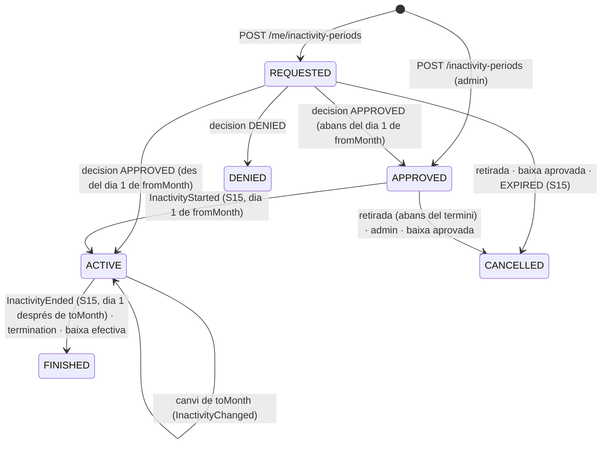
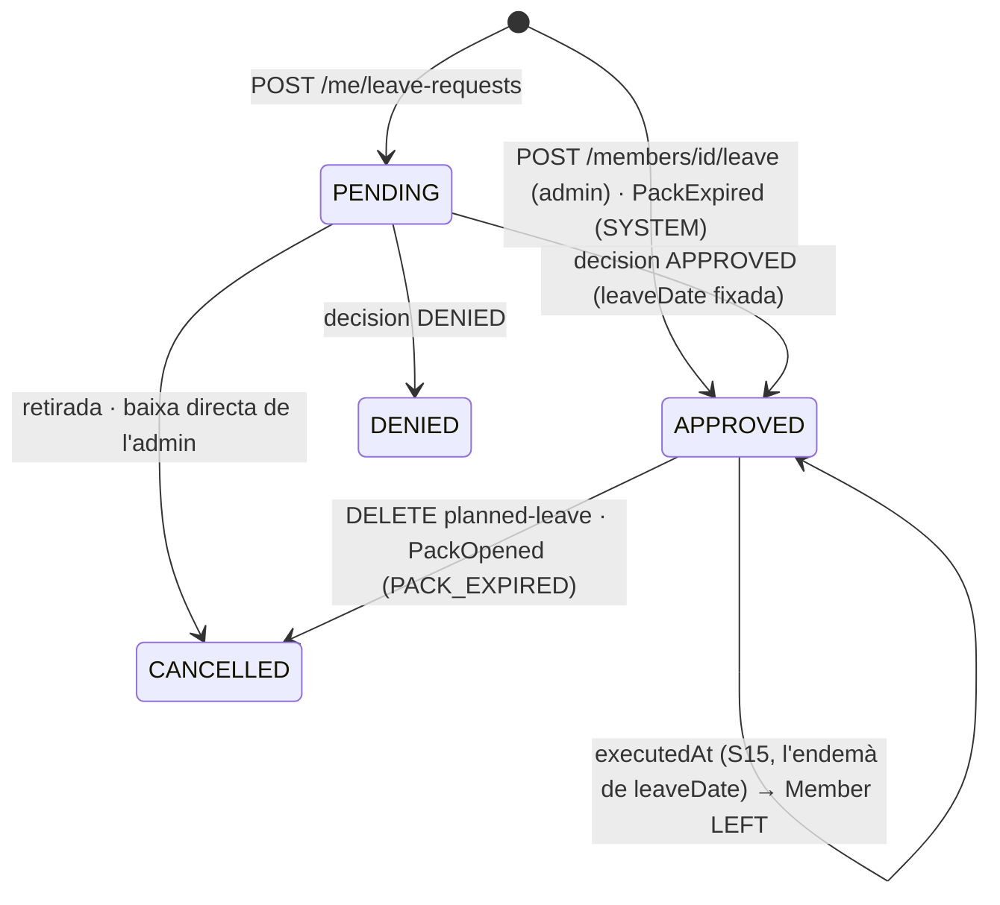
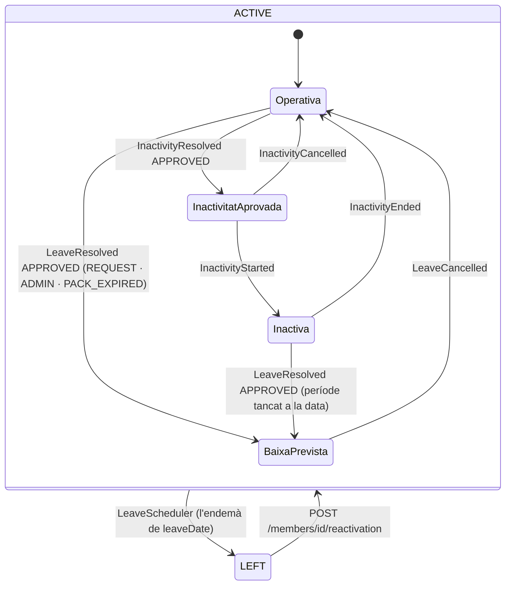

# S13 — Inactivitat i baixa

**Etapa:** E8 · **Mòduls:** `INACTIVITY`, `BILLING` (quotes), `PACKS` (baixa prevista en caducar) · **Pantalles:** 14, 15, D10 (accions de peu «Inactivitat» / «Baixa (amb data)»; distintiu «baixa prevista»), D5 (vista desada «Baixes previstes»), D6 (KPI «Quota d'inactivitat» i «data de baixa prevista»), 12 (files d'entrada), «Inactivitats i baixes» (entrada del menú, sense mockup) (fitxers a `03-disseny/mockups/pantalles/`) · **Model:** §A de v1.6 (PERIODE_INACTIVITAT E20, SOL_LICITUD_BAIXA, ABONAT estat/data de baixa, «Estats principals») + §0 i §3 de `MODEL_DADES_PLATAFORMA.md` · **Estat:** esborrany (03-09-2026) · **Versió:** 0.1

## 1. Propòsit i abast

Resol la **pausa** i la **sortida** d'un abonat: el període d'inactivitat per mesos (`InactivityPeriod`: sol·licitud, regla del dia 25, aprovació, inici i final automàtics, canvis, quota reduïda, prohibició de reserves amb data de sessió dins l'interval — BR-16) i la sol·licitud de baixa (`LeaveRequest`: data desitjada, motiu, NPS, confirmació de la data d'efecte per l'admin, baixa prevista, execució diferida — BR-07, F7), la **baixa prevista automàtica** en caducar un pack, la baixa directa i l'anul·lació de la baixa prevista des de D10, la reactivació d'un abonat de baixa i l'aportació d'aquestes situacions a l'elegibilitat de reserva (`MemberBookingEligibility`, S03) i a la facturació (S12). Tot s'audita.

| Fora d'abast | On viu |
|---|---|
| Màquina d'estats base de `Member` (PENDING/ACTIVE/LEFT), `displayStatus`, `MemberStatusService`, gossos → INACTIVE en baixa | S03 (aquí s'hi afegeixen transicions i camps) |
| Generació de rebuts, línia `INACTIVITY_FEE`, remesa, ajustos, reemborsaments | S12 (crida els serveis de §4: `InactivityFeeService`, `LeaveBillingService`) |
| Mecànica d'anul·lació de reserves de classe, entrenament i activitat, retorn de pack | S08 / S09 / S07 (aquesta spec en crida els serveis `cancelBySystem`) |
| Execució dels processos programats (hora, traça, interruptor) | S15 (aquí es defineixen les crides i la idempotència) |
| Readmissió per l'alta pública d'un abonat LEFT | S04 (R-04-06); aquí només la reactivació des de D10 |
| Suspensió de `Membership` en passar a LEFT | S01 (consumidor de `MemberStatusChanged`) |

## 2. Pantalles i rutes

| Mockup | App | Ruta | Rol | Notes de comportament |
|---|---|---|---|---|
| 12 `mobil/12-perfil-i-preferencies.html` (files finals) | `apps/clubs` | `/perfil` | MEMBER | Fila «Sol·licitar període d'inactivitat» (només `INACTIVITY`) → 14; fila «Sol·licitar la baixa» → 15. Amb un període o una sol·licitud vius, la fila mostra un subtítol d'estat (assumpció §13): «pendent d'aprovació · {mes}», «inactivitat {mes}–{mes}», «baixa sol·licitada el {data}», «baixa el {data}». |
| 14 `mobil/14-sollicitar-periode-d-inactivitat.html` | `apps/clubs` | `/perfil/inactivitat` | MEMBER (i impersonat) | `GET /me/inactivity-periods` pinta el context. Text d'introducció (literal del mockup, amb «dia 25» = `inactivity.requestDeadlineDay`). «Mes d'inici (obligatori)»: desplegable de mesos des d'`earliestFromMonth` (R-13-01), preseleccionat `proposedFromMonth`. «Mes de finalització (si el saps)»: «— encara no ho sé» + mesos ≥ inici. «Comentaris» (≤ 500). Targeta «Quota del 1r mes · {fee}» / «Mesos següents · {fee}/mes» (`BILLING`). Nota grisa «La data de final es pot modificar durant el període d'inactivitat (també fins al dia 25).». Nota groga només si `preview.bookingsInside.total > 0`: «Ara tens {n} reserva/es dins del període: s'anul·larà/s'anul·laran si el club aprova la sol·licitud.» (recalculada a cada canvi de mesos via `GET /me/inactivity-periods/preview`). [ENVIA LA SOL·LICITUD] → `POST /me/inactivity-periods` → toast i tornada a 12. Amb un període viu (REQUESTED/APPROVED/ACTIVE) la pantalla s'obre en mode consulta amb els mesos actuals editables segons R-13-04 i els botons [MODIFICA] / [RETIRA LA SOL·LICITUD] (assumpció §13). Errors: `INACTIVITY_DEADLINE_PASSED` → nota vermella amb `earliestMonth`; `INACTIVITY_OVERLAP` → «Ja tens un període demanat: modifica'l». |
| 15 `mobil/15-sollicitar-la-baixa.html` | `apps/clubs` | `/perfil/baixa` | MEMBER (i impersonat) | `GET /me/leave-requests` pinta el context. Bloc d'oferta (només `INACTIVITY`): nota amb el text del mockup (la frase dels imports només amb `BILLING`) + [VULL DEMANAR INACTIVITAT] → 14. «Data en què vols la baixa»: selector de data, preinformat «Avui, {data llarga}», mínim avui. Ajuda «Si tries un dia d'un mes posterior a l'actual, aquell mes es cobrarà íntegrament.» (només si `leave.fullMonthIfLater` i `BILLING`). «Motiu»: desplegable «Tria un motiu» amb `leave.reasons` (obligatori). Bloc NPS «De 0 a 10, amb quina probabilitat ens recomanaries?» (0–10, opcional; només `leave.npsEnabled`) i «Què podríem millorar perquè el club s'adaptés més a les teves necessitats?» (text lliure ≤ 2000). [ENVIA LA SOL·LICITUD] → `POST /me/leave-requests` → toast + peu «El club la revisarà i et confirmarà la data d'efecte.» i tornada a 12. Amb una sol·licitud PENDING: pantalla en consulta amb [RETIRA LA SOL·LICITUD]; amb baixa ja prevista: text «Tens la baixa prevista el {data}. Per canviar-la, contacta amb el club.» (assumpcions §13). |
| D10 `escriptori/D10-fitxa-d-abonat.html` (peu) | `apps/clubs-admin` | `/abonats/:id` | ADMIN | `overview.inactivity` i `overview.plannedLeave` (R-13-17). Capçalera: distintiu «inactiva fins {data}» / «inactiva» o «baixa prevista {data}» (a més dels de S03). Botó «Inactivitat» (`INACTIVITY`): calaix amb la targeta del període viu (mesos, estat, comentaris, quota; accions [Aprova] / [Denega] amb nota si REQUESTED, [Modifica els mesos], [Finalitza el període] si ACTIVE, [Anul·la] si APPROVED) o, si no n'hi ha, el formulari «Nou període d'inactivitat» (mes d'inici, fi, comentaris, casella «Salta el termini del dia {D}») → `POST /inactivity-periods`. Botó «Baixa (amb data)»: calaix amb la sol·licitud PENDING (data desitjada, motiu, NPS, comentari; [Aprova] amb «Data d'efecte» preinformada i nota, [Denega] amb nota) o el formulari de baixa directa (data d'efecte ≥ avui, motiu del catàleg opcional, nota) → `POST /members/{id}/leave`. Amb baixa prevista: targeta «Baixa prevista el {data} · {origen}» + [Anul·la la baixa prevista] → `DELETE /members/{id}/planned-leave`. Amb l'abonat LEFT: el peu mostra només [Reactiva l'abonat] → `POST /members/{id}/reactivation`. Literals dels calaixos: assumpcions §13. |
| D5 `escriptori/D5-llistat-d-abonats-patro-de-llistat-universal.html` | `apps/clubs-admin` | `/abonats` | ADMIN | Estat «inactiva fins {dd/mm}» i «baixa {dd/mm}» (S03 R-03-03 + R-13-17). Vista compartida de sistema «Baixes previstes» (R-13-17). Columnes noves: `leaveSource` («Origen de la baixa»), `inactivityUntil`. |
| D6 `escriptori/D6-facturacio-simulacio-rebuts-i-remesa-sepa.html` | `apps/clubs-admin` | `/facturacio` | ADMIN | S12 mostra el KPI «Quota d'inactivitat · {n} · {fee1} el 1r mes · {fee2}/mes» amb `InactivityFeeService.feesForMonth` i, a «Actius amb pagament en efectiu», «data de baixa prevista: {data}» amb `Member.leaveDate`. Cap acció d'aquesta spec. |
| «Inactivitats i baixes» (menú Persones, badge = pendents; sense mockup, assumpció §13) | `apps/clubs-admin` | `/inactivitats-i-baixes` | ADMIN | Dues pestanyes amb el patró de llistat universal (S03): «Inactivitats» = `GET /inactivity-periods` (per defecte `state:in:REQUESTED,APPROVED,ACTIVE`, ordre `fromMonth`) i «Baixes» = `GET /leave-requests` (per defecte `state:eq:PENDING`, ordre `requestedAt`). Fila → D10 amb el calaix corresponent obert. Badge del menú = `pendingInactivityRequests + pendingLeaveRequests` del tauler (S14). |

## 3. Entitats i camps

Col·leccions pròpies: `inactivity_periods`, `leave_requests` (context `clubs/census`, `TenantRepository`, `version`, `createdAt`, `updatedAt`; res s'esborra).

### `InactivityPeriod` (`inactivity_periods`) — PERIODE_INACTIVITAT
| Camp | Tipus | Oblig. | Validació / notes |
|---|---|---|---|
| `memberId` | UUID | sí | índexs `{clubId, memberId, state}`, `{clubId, state, fromMonth}` |
| `fromMonth` | `YYYY-MM` | sí | R-13-01/03 |
| `toMonth` | `YYYY-MM`? | no | `null` = «encara no ho sé» (obert); `≥ fromMonth` (`422 INACTIVITY_INVALID_RANGE`) |
| `comments` | string ≤ 500 | no | «Comentaris» de 14 |
| `state` | enum `REQUESTED`·`APPROVED`·`ACTIVE`·`FINISHED`·`DENIED`·`CANCELLED` | sí | §5 |
| `origin`, `requestedAt`, `requestedBy {accountId, impersonatedMemberId?}` | enum `APP`·`BACKOFFICE`, instant, objecte | sí | `BACKOFFICE` = creat per l'admin o per impersonació |
| `decision {at, byAccountId, decision, note ≤ 500, deadlineOverridden}` | objecte | des de la decisió | `deadlineOverridden` només admin (R-13-05) |
| `feeSnapshot {firstMonth: Money, followingMonths: Money}` | objecte | si `BILLING`, des de l'aprovació | «quota aplicada» del model: congelada en aprovar (R-13-08) |
| `startedAt`, `finishedAt`, `finishReason` | instant?, instant?, enum `SCHEDULED`·`ADMIN`·`LEAVE` | — | R-13-05, R-13-10, R-13-13 |
| `cancelledAt`, `cancelledBy`, `cancelReason` | instant?, enum `MEMBER`·`ADMIN`·`SYSTEM`, enum `WITHDRAWN`·`EXPIRED`·`LEAVE` | — | R-13-04, R-13-10, schedulers |
| `cancelledBookings[]` | `[{type: CLASS·WAITLIST·TRAINING·ACTIVITY, id, sessionDate}]` | — | traça de R-13-06 (recompte per a N-18b) |
| `history[]` | `[{at, byAccountId, fromMonth, toMonth, source: MEMBER·ADMIN}]` | — | append-only a cada canvi de mesos (R-13-04) |

### `LeaveRequest` (`leave_requests`) — SOL_LICITUD_BAIXA
| Camp | Tipus | Oblig. | Validació / notes |
|---|---|---|---|
| `memberId`, `source` | UUID, enum `MEMBER`·`ADMIN`·`PACK_EXPIRED` | sí | índex `{clubId, memberId, state}` |
| `origin`, `requestedAt`, `requestedBy` | com a `InactivityPeriod` (+ `SYSTEM` per a `PACK_EXPIRED`) | sí | |
| `requestedDate` | date | sí | data desitjada; `≥ avui` local (`422 LEAVE_DATE_INVALID`) |
| `reasonKey` | string | MEMBER: sí · ADMIN: no | clau de `leave.reasons` (`400 LEAVE_REASON_UNKNOWN`); `PACK_EXPIRED` per a la baixa automàtica |
| `nps`, `comment` | int 0–10?, string ≤ 2000? | no | `nps` només si `leave.npsEnabled` (altrament `400 VALIDATION_ERROR/READ_ONLY`) |
| `state` | enum `PENDING`·`APPROVED`·`DENIED`·`CANCELLED` | sí | §5 |
| `decision {at, byAccountId, effectiveDate, note ≤ 500}` | objecte | des de la decisió | `effectiveDate` → `Member.leaveDate` |
| `executedAt`, `cancelledAt`, `cancelledBy`, `cancelReason` | instant?, instant?, enum `MEMBER`·`ADMIN`·`SYSTEM`, enum `WITHDRAWN`·`ADMIN`·`PACK_RENEWED` | — | R-13-13/14/15 |
| `cancelledBookings[]`, `packBalanceId?` | com a `InactivityPeriod`, UUID? | — | R-13-12, R-13-14 |

### `Member` (S03) — camps que aquesta spec escriu
`leaveDate` (date?, futura o passada), `leaveRequestId` (UUID?), `leftAt` (instant?), `leftReason` (enum S04 `SIGNUP_REJECTED` + `LEAVE_REQUEST`·`ADMIN`·`PACK_EXPIRED`), `leaveHistory[]` (`{leaveDate, leftAt, leftReason, reactivatedAt?}`, append-only en reactivar). **Projeccions a l'API**: `plannedLeave {date, source, requestId, since, cancellable}` (només `status=ACTIVE ∧ leaveDate ≠ null`), `inactivity {current?, upcoming?, pendingRequest?}` (cada un `{id, fromMonth, toMonth, state, fee?}`). **Llegeix**: `Member.status/planId`, `Plan.type` (S05), `PackBalance` (S12), `Booking`/`WaitlistEntry` (S08), `TrainingBooking` (S09), `ActivityRegistration` (S07) via els seus serveis de consulta i d'anul·lació.

## 4. Regles de negoci

| Id | Regla | Paràmetres / mòduls | Excepcions | Exemple |
|---|---|---|---|---|
| R-13-01 | **Calendari i fus.** Els mesos són `YYYY-MM`; «avui» és la data local del club. L'interval d'un període va del dia 1 de `fromMonth` 00:00 local fins a l'últim dia de `toMonth` 23:59:59 local (obert = sense final). Sigui `D = inactivity.requestDeadlineDay` i `D' = min(D, últim dia del mes en curs)`: el **primer mes modificable** `E(avui)` = mes següent si `avui.dia ≤ D'`, si no el posterior. `proposedFromMonth = earliestFromMonth = E(avui)`. La granularitat és el dia: l'horari d'estiu no hi influeix, però la conversió UTC→local sí. | `inactivity.requestDeadlineDay` = 25; `club.timeZone` | `D` > dies del mes (D=31 al febrer) → `D'` = últim dia | 24-09-2026 → `E` = 2026-10; 25-09 23:59 local → 2026-10; 26-09 00:00 → 2026-11. `2026-09-25T22:30Z` = 26-09 00:30 a `Europe/Madrid` → 2026-11; = 25-09 19:30 a `America/Argentina/Buenos_Aires` → 2026-10. |
| R-13-02 | **Sol·licitud (14).** Només `Member.status=ACTIVE` (`409 MEMBER_NOT_ACTIVE`) sense baixa prevista (`409 LEAVE_ALREADY_SCHEDULED`). `fromMonth ≥ E(avui)` (R-13-03) i `fromMonth ≤ E(avui) + inactivity.maxStartMonthsAhead` (`422 INACTIVITY_INVALID_RANGE`); `toMonth` nul o `≥ fromMonth`. Cap solapament **ni adjacència** amb un període `REQUESTED/APPROVED/ACTIVE` del mateix abonat (`409 INACTIVITY_OVERLAP {periodId, hint: EXTEND}`: cal modificar-lo, R-13-04); adjacència amb un `FINISHED` permesa (període nou, quota de 1r mes). `Idempotency-Key` (24 h). Emet `InactivityRequested` → N-18a. | `inactivity.maxStartMonthsAhead` (proposta §13, 12) | impersonació: `origin=BACKOFFICE`, auditat | Laura demana 2026-10 → 2026-12 amb «Descans de la Duna» el 24-09 → `REQUESTED`; el 26-09 → `422 INACTIVITY_DEADLINE_PASSED {earliestMonth: 2026-11}`. |
| R-13-03 | **Regla del dia 25 generalitzada.** Una creació o un canvi fet per l'abonat només pot alterar l'estat (inactiu ↔ actiu) de mesos `≥ E(avui)`; qualsevol mes anterior que canviaria → `422 INACTIVITY_DEADLINE_PASSED {earliestMonth}`. L'admin pot saltar-se-la amb `overrideDeadline=true` (auditat, `decision.deadlineOverridden`). | `inactivity.requestDeadlineDay` | el mes en curs mai és modificable per l'abonat | Període Oct–Des ACTIU: escurçar a Oct–Nov el 20-11 (canvia Des; `E`=Des) → ok; el 26-11 (`E`=Gen) → refusat. Allargar Oct–Des fins a Feb el 10-12 (canvien Gen, Feb; `E`=Gen) → ok; el 27-12 → refusat (Gen no modificable; pot demanar un període nou Feb–Feb). Obert des de Set: fixar fi Nov el 15-11 (Des passa a actiu; `E`=Des) → ok; el 26-11 → refusat, fi mínima Des. |
| R-13-04 | **Canvis i retirada per l'abonat** (`PATCH /me/inactivity-periods/{id}`). `REQUESTED`: tot editable (R-13-02/03). `APPROVED`: `fromMonth`, `toMonth`, `comments` segons R-13-03, s'aplica sense nova aprovació i emet `InactivityChanged{before, after}` (N-18d proposada). `ACTIVE`: només `toMonth` (allargar, escurçar, fixar un final obert o obrir-lo) segons R-13-03; mateix esdeveniment. `FINISHED/DENIED/CANCELLED` → `409 INACTIVITY_INVALID_STATE`. Cada canvi afegeix una fila a `history[]`. Retirada (`POST …/cancellation`): `REQUESTED` sempre; `APPROVED` només si `fromMonth ≥ E(avui)` → `CANCELLED{MEMBER, WITHDRAWN}`, `InactivityCancelled`; `ACTIVE` no es retira: s'escurça. Les reserves anul·lades en aprovar no es restauren. | — | — | Aprovat Nov–Des; el 20-10 Laura el retira → `CANCELLED`; el 26-10 → `INACTIVITY_DEADLINE_PASSED`. |
| R-13-05 | **Decisió i gestió per l'admin.** `POST /inactivity-periods/{id}/decision {decision, note?}` només sobre `REQUESTED` (`409 INACTIVITY_INVALID_STATE`). `APPROVED`: es congela `feeSnapshot` (R-13-08), s'anul·len les reserves de dins (R-13-06) i, si avui ≥ dia 1 de `fromMonth`, passa directament a `ACTIVE` (`InactivityStarted` a la mateixa transacció); `DENIED`: cap efecte. Ambdós emeten `InactivityResolved{decision}` → N-18b. `POST /inactivity-periods` (des de D10) = període creat i aprovat de cop (`origin=BACKOFFICE`, `overrideDeadline` permès). `PATCH /inactivity-periods/{id}`: com R-13-04 amb override. `POST …/termination {toMonth}` sobre `ACTIVE`: `toMonth ≥ fromMonth`; si `toMonth < mes en curs` → `FINISHED` ara (`finishReason=ADMIN`, `InactivityEnded`); si no, fixa `toMonth` i el scheduler el tanca (R-13-13). Els mesos ja facturats **no** es recalculen (rebuts immutables): l'admin fa un `ADJUSTMENT` a S12 si cal. | `BILLING` per a `feeSnapshot` | — | Sol·licitud 20-09 per Oct; l'admin aprova el 03-10 → `ACTIVE` immediat; l'octubre ja remesat com a quota normal → ajust manual. |
| R-13-06 | **Anul·lació de reserves en aprovar** (BR-16, `inactivity.cancelBookingsOnApproval=true`). A la transacció d'aprovació, per a tota reserva viva del **propietari** de qualsevol dels seus gossos amb **data local de sessió** dins l'interval: classes → S08 `BookingCancellationService.cancelBySystem(bookingId, reason=INACTIVITY)` (→ `CANCELLED`, no compta, pack retornat, `SeatReleased` amb avís a l'espera segons llindar), entrades d'espera → S08 `WaitlistService.cancel(entryId, reason=INACTIVITY)` (§13), entrenaments → S09 `TrainingBookingService.cancelBySystem(id, reason=INACTIVITY)`, inscripcions → S07 `ActivityRegistrationService.cancelBySystem(id, reason=INACTIVITY)`. Es desa `cancelledBookings[]` i N-18b porta `cancelled_count`. Amb el paràmetre a `false` no s'anul·la res: la resposta i N-18b avisen (`bookingsInside`). El mateix conjunt s'anul·la en **allargar** un període (R-13-04/05) per als mesos afegits. Cap N-05/N-36 per classe (S08); S09 envia N-07 per entrenament. | `inactivity.cancelBookingsOnApproval` = true; `WAITLIST`, `FREE_TRAINING`, `ACTIVITIES`, `PACKS` | reserves d'un gos del grup familiar propietat d'un altre abonat: no es toquen | Nov–Des aprovat el 20-10: classe 03-11 amb Duna → `CANCELLED/INACTIVITY` (pack +1); classe 30-10 es manté; entrenament 02-11 → anul·lat (N-07); 2 reserves → N-18b «S'han anul·lat 2 reserves». |
| R-13-07 | **Elegibilitat de reserva** (aportació a `MemberBookingEligibility`, S03; avaluada per S07/S08/S09 després de `BOOKING_BLOCKED`). Per a la **data local de sessió** `d` i l'abonat de referència (propietari del gos; a activitats, qui s'inscriu): (1) amb `INACTIVITY`, existeix un `InactivityPeriod` `APPROVED/ACTIVE` que conté `mes(d)` → `INACTIVITY_PERIOD {from, to}` (S08 `NOT_BOOKABLE{INACTIVITY}`); (2) `leaveDate ≠ null ∧ d > leaveDate` → `MEMBER_LEAVING {leaveDate}` (S08 `NOT_BOOKABLE{LEAVING}`). Compta la data de la sessió, no el moment de reservar; el dia `leaveDate` és **inclòs** com a actiu (BR-07 «fins a la data»). | `INACTIVITY`; `club.timeZone` | mòdul off: només (2) | Període Nov–Des: el 25-10 no es pot reservar el 03-11 (sí el 30-10 i el 02-01). Baixa 31-10: classe 31-10 19:00 reservable; 01-11 → `MEMBER_LEAVING`. |
| R-13-08 | **Quota d'inactivitat.** `InactivityFeeService.feeFor(memberId, month)` → si hi ha un període `APPROVED/ACTIVE/FINISHED` de l'abonat que conté `month`: `feeSnapshot.firstMonth` quan `month = fromMonth`, si no `feeSnapshot.followingMonths`; altrament buit. S12 substitueix la línia `MONTHLY_FEE` del mes per una `INACTIVITY_FEE` amb aquest import (només plans `MONTHLY`; `PACK`/`SINGLE_CLASS` no tenen quota mensual a substituir → cap quota, assumpció §13). `feesForMonth(clubId, month)` → llista per al KPI de D6. Allargar o escurçar no crea cap «primer mes» nou; un període nou després d'un `FINISHED` sí. Sense `BILLING`: cap import, `feeSnapshot` absent. | `billing.inactivityFeeFirstMonth` = 20,00 € · `billing.inactivityFeeFollowingMonths` = 10,00 € (congelats a l'aprovació); `BILLING` | grup familiar: la quota d'inactivitat va al rebut del pagador; la tarifa familiar no es recalcula sola (§13) | Oct–Des: Oct 20 € · Nov 10 € · Des 10 € (remeses de finals de set/oct/nov) · Gen quota normal. Obert des de Set, fi fixada Nov el 15-11: Set 20 · Oct 10 · Nov 10 · Des normal. Allargat Oct–Des → Feb: Gen 10 · Feb 10. Canvi del paràmetre a 25 € el 15-10: el període de Laura continua a 20/10; un de nou n'agafa 25. |
| R-13-09 | **Sol·licitud de baixa (15).** Només `ACTIVE` (`409 MEMBER_NOT_ACTIVE`); una de sola `PENDING` per abonat (`409 LEAVE_ALREADY_REQUESTED`); cap si `leaveDate ≠ null` (`409 LEAVE_ALREADY_SCHEDULED`). `requestedDate ≥ avui` local; `reasonKey` del catàleg; `nps` 0–10 opcional si `leave.npsEnabled`; `comment` opcional. `Idempotency-Key`. Emet `LeaveRequested` → N-14 (`reason` = etiqueta localitzada). Retirada (`POST …/cancellation`) només `PENDING` → `CANCELLED{MEMBER, WITHDRAWN}`. La baixa no substitueix la inactivitat: 15 ofereix 14 abans (`INACTIVITY`). | `leave.reasons`, `leave.npsEnabled` = true | impersonació auditada | Laura: 31-10-2026 · «Condicionants meus aliens al club» · NPS 8 · «Més classes de tarda» → N-14 a l'admin. |
| R-13-10 | **Decisió de baixa.** `POST /leave-requests/{id}/decision {decision, effectiveDate?, note?}` només `PENDING`. `APPROVED`: `effectiveDate` per defecte `requestedDate`; ha de ser `≥ avui` (`422 LEAVE_DATE_INVALID`: si la data demanada ja ha passat, l'admin en fixa una de nova) → `Member.leaveDate`, `leaveRequestId`, anul·lació de reserves posteriors (R-13-12), tancament d'inactivitats (`ACTIVE` → `toMonth = mes(effectiveDate)`, `finishReason=LEAVE`; `APPROVED`/`REQUESTED` → `CANCELLED{SYSTEM, LEAVE}`), `LeaveResolved{effectiveDate}` → N-28. `DENIED`: nota opcional, `LeaveResolved{decision: DENIED}` → N-28 (variant, §13). **Baixa directa** (`POST /members/{id}/leave {effectiveDate, reasonKey?, note?}`): crea la `LeaveRequest{source: ADMIN, origin: BACKOFFICE}` ja `APPROVED` amb els mateixos efectes; una `PENDING` existent passa a `CANCELLED{ADMIN}`. L'abonat és **actiu fins al dia `leaveDate` inclòs**; l'execució és de R-13-13. | — | — | Sol·licitud 31-10 aprovada el 05-10 → «baixa 31/10» a D5, N-28 «La teva baixa serà efectiva el 31/10/2026». Sol·licitud per al 10-09 decidida el 15-09 → cal `effectiveDate ≥ 15-09`. |
| R-13-11 | **Facturació de la baixa.** `LeaveBillingService.lastInvoicedMonth(memberId)` → `null` sense `leaveDate`; amb `leave.fullMonthIfLater=true` → `mes(leaveDate)`; amb `false` → `mes(leaveDate)` si `leaveDate` és l'últim dia del mes, si no el mes anterior. S12 inclou l'abonat a la remesa del mes `M` només si `M ≤ lastInvoicedMonth` (import segons R-13-08); el mes següent ja no es factura (BR-07); rebuts emesos no es toquen. Efectiu per semestres: cap reemborsament automàtic (§13). | `leave.fullMonthIfLater` = true; `billing.cashPeriodMonths` = 6 (només informatiu aquí) | — | Baixa 10-11 aprovada el 05-10: novembre es factura sencer (remesa de finals d'octubre), desembre no. Baixa 31-10: octubre ja facturat, novembre no. Amb `false`, baixa 10-11 → últim mes facturat octubre. |
| R-13-12 | **Reserves posteriors a la data de baixa.** En aprovar (R-13-10) i, com a escombrada defensiva, en executar (R-13-13): tota reserva viva de l'abonat (classes, esperes, entrenaments, inscripcions dels seus gossos o pròpies) amb data local de sessió `> leaveDate` → `cancelBySystem(reason=LEAVE)` (S09: `MEMBER_LEFT`), pack retornat, sense notificació per reserva (N-28 porta `cancelled_count`). Si l'admin avança la data (nova decisió), es torna a aplicar. | — | reserves de gossos del grup d'altres abonats: no es toquen | Baixa 31-10 aprovada el 05-10 amb classes 28-10 i 04-11 → només la del 04-11 s'anul·la. |
| R-13-13 | **Execució de la baixa (S15).** Cada dia, a l'inici del dia local del club, `LeaveScheduler.executeDue(clubId, today)`: `Member.status=ACTIVE ∧ leaveDate < today` → `MemberStatusService.transition(LEFT, reason=leftReason)`: `leftAt`, `leftReason` (`LEAVE_REQUEST`·`ADMIN`·`PACK_EXPIRED`), `LeaveRequest.executedAt`, inactivitats vives tancades, escombrada R-13-12, `MemberStatusChanged{ACTIVE→LEFT, effectiveDate}` (consumidors: S01 `Membership` → `SUSPENDED`; S03 gossos → `INACTIVE{MEMBER_LEFT}` i `lastDogFor*=null`; S09 escombrada pròpia; KPIs). El bloqueig de reserves es manté. Idempotent i amb recuperació (comparació `<`, no igualtat): executar-ho dos cops o amb un dia perdut dona el mateix resultat. Cap execució «immediata»: `effectiveDate = avui` s'executa l'endemà. | `club.timeZone` | — | Montse, baixa 31-08 → l'01-09 00:10 local passa a `LEFT`; Trevi → `INACTIVE`; D5 «baixa 31/08». |
| R-13-14 | **Baixa prevista automàtica per caducitat de pack** (`PACKS`). Consumidor de `PackExpired{packBalanceId, dogId, memberId}` (S12/S15): si l'abonat és `ACTIVE`, `Plan.type=PACK`, cap altre `PackBalance` viu per a cap dels seus gossos i `leaveDate = null` → `LeaveRequest{source: PACK_EXPIRED, origin: SYSTEM, requestedDate = effectiveDate = expiresOn + leave.packExpiryGraceDays}` `APPROVED`, `Member.leaveDate`, `LeaveResolved{source: PACK_EXPIRED}` → N-28 (variant per `source`, §13); apareix a «Baixes previstes» (D5) i a D6. Consumidor de `PackOpened{memberId}`: una baixa prevista `PACK_EXPIRED` es cancel·la sola (`CANCELLED{SYSTEM, PACK_RENEWED}`, `LeaveCancelled`). Idempotent per `packBalanceId`. Sense `PACKS`: res. | `leave.packExpiryGraceDays` (proposta §13, 30); `PACKS`, `BILLING` | abonat amb baixa ja prevista: res | Pack 10 de Rock caduca el 12-11-2026 → baixa prevista 12-12-2026; Laura compra un pack nou el 20-11 → baixa prevista anul·lada. |
| R-13-15 | **Anul·lació de la baixa prevista** (`DELETE /members/{id}/planned-leave`, ADMIN). Cal `status=ACTIVE ∧ leaveDate ≠ null` (`409 NO_PLANNED_LEAVE`). `leaveDate=null`, `leaveRequestId=null`, `LeaveRequest` → `CANCELLED{ADMIN}`, `LeaveCancelled` → N-28 (variant `CANCELLED`, §13), auditat. Les reserves anul·lades a R-13-12 no es restauren; la facturació torna a la normalitat (`lastInvoicedMonth=null`). Una `PENDING` no és una baixa prevista: es denega (R-13-10). | — | — | Joan (baixa 31-12) canvia d'idea el 10-12 → l'admin l'anul·la → «alta» a D5, gener es factura. |
| R-13-16 | **Reactivació** (`POST /members/{id}/reactivation`, ADMIN; amplia S03 §5). Només `LEFT` (`409 MEMBER_NOT_LEFT`). Amb `BILLING`: `planId`, `priceId`, `nextInvoiceDate` obligatoris (assumpció §13). Efectes: `status=ACTIVE`, `leaveHistory[] += {…, reactivatedAt}`, `leaveDate/leftAt/leftReason=null`, `Membership` → `ACTIVE` (S01), gossos **continuen** `INACTIVE` fins que l'admin els reactiva (S03 §13-6), `memberNumber` conservat, `MemberStatusChanged{LEFT→ACTIVE}`. Cap entrada automàtica (§13). La readmissió per l'alta pública és S04. | `BILLING` | — | Joan (núm. 214, baixa 2025) torna: reactivat amb «Abonat · 60 €», proper rebut 01-11; Bruc es reactiva des de la seva fitxa. |
| R-13-17 | **Estat de visualització, llistes i fitxa.** Amplia S03 R-03-03: `INACTIVE_PERIOD{date}` amb `date` = últim dia de `toMonth` («inactiva fins {dd/mm}») o `null` si obert («inactiva»); `LEAVE_SCHEDULED{date=leaveDate}` per a qualsevol `source`. Un `APPROVED` no començat no canvia l'estat (D10 mostra «inactivitat des de {mes}» a la targeta). `GET /members` (S03) afegeix filtres/columnes `leaveSource`, `inactivityUntil`, `hasPendingRequest`. Vista **de sistema** compartida «Baixes previstes» (`listKey=members`, `filters=[displayStatus:eq:LEAVE_SCHEDULED]`, `sort=leaveDate,asc`, columnes `fullName, dogs, plan, leaveDate, leaveSource`), creada al seed i no esborrable (§13). `GET /members/{id}/overview` (S03) afegeix `inactivity` i `plannedLeave` (§3). | `INACTIVITY` | — | Eva, Set–Set: «inactiva fins 30/09»; Joan, pack caducat: vista «Baixes previstes» → «12/12/2026 · caducitat del pack». |
| R-13-18 | **Permisos, origen i auditoria.** `MEMBER` només sobre el seu propi abonat (mai sobre els del grup familiar: la inactivitat i la baixa són personals); token d'impersonació acceptat als `/me/*` amb `origin=BACKOFFICE` i `AuditEntry` amb els dos ids; `INSTRUCTOR` → `403`; `ADMIN` decideix i gestiona; endpoints d'admin rebutgen impersonació (`403 IMPERSONATION_DENIED`). Tota decisió, creació, canvi, terminació, anul·lació, execució i reactivació escriu `AuditEntry` (`before/after` dels camps canviats) i un esdeveniment de §7 amb `actorAccountId`. | — | — | «05/10 baixa aprovada amb efecte 31/10 (admin Jordi)» a «Darrers canvis» de D10. |
| R-13-19 | **Branques per mòdul i paràmetre.** `INACTIVITY` off: fila de 12 i pantalla 14 absents, 15 sense oferta ni botó, D10 sense «Inactivitat», `/inactivity-periods*` i `/me/inactivity-periods*` → `404 MODULE_DISABLED`, `feeFor` buit, schedulers d'inactivitat no s'executen, R-13-07(1) no s'avalua, `displayStatus` mai `INACTIVE_PERIOD`. `BILLING` off: sense targeta de quota a 14 ni frase d'imports a 15 (variants de text), sense `feeSnapshot`, sense ajuda de «mes sencer» a 15, `LeaveBillingService` no es crida, reactivació sense pla. `PACKS` off: R-13-14 inactiva. `leave.npsEnabled=false`: bloc NPS absent, `nps` refusat. `inactivity.cancelBookingsOnApproval=false`: R-13-06 només avisa. | catàleg de mòduls | — | Club mínim: 15 = data + motiu + comentari. |
| R-13-20 | **Textos.** Cap literal al codi: els textos de 14/15 són claus i18n (valor `ca` = mockup) amb els imports i el dia límit interpolats des dels paràmetres; els motius de baixa són `LocalizedText` del paràmetre `leave.reasons` resolts al `locale` del lector; les notes de l'admin (`decision.note`) es mostren tal qual a l'abonat dins N-18b/N-28 (`admin_text`). Vocabulari prohibit verificat a CI. | `club.locales` | — | Usuari `es` veu «Ya he aprendido todo lo que quería». |

## 5. Estats i transicions







| Transició | Qui | Condició | Efectes | Esdeveniment |
|---|---|---|---|---|
| — → `REQUESTED` | MEMBER (APP/BACKOFFICE) | R-13-02/03 | — | `InactivityRequested` (N-18a) |
| — → `APPROVED`/`ACTIVE` | ADMIN (D10) | R-13-05, override opcional | `feeSnapshot`, R-13-06 | `InactivityResolved{APPROVED}` (N-18b) (+ `InactivityStarted`) |
| `REQUESTED` → `APPROVED`/`ACTIVE`/`DENIED` | ADMIN | R-13-05 | `feeSnapshot`, R-13-06 / cap | `InactivityResolved` (N-18b) |
| `REQUESTED`/`APPROVED`/`ACTIVE` → mesos canviats | MEMBER · ADMIN | R-13-03/04 | `history[]`, R-13-06 als mesos afegits | `InactivityChanged` |
| `REQUESTED`/`APPROVED` → `CANCELLED` | MEMBER · ADMIN · SYSTEM (baixa, EXPIRED) | R-13-04/10, S15 | — | `InactivityCancelled` |
| `APPROVED` → `ACTIVE` | S15 | `fromMonth ≤ mes(avui)` | `startedAt` | `InactivityStarted` |
| `ACTIVE` → `FINISHED` | S15 · ADMIN · baixa | `toMonth < mes(avui)` · termination · R-13-10/13 | `finishedAt`, `finishReason` | `InactivityEnded` (N-18c; no per `LEAVE`) |
| — → `PENDING` | MEMBER | R-13-09 | — | `LeaveRequested` (N-14) |
| `PENDING` → `APPROVED` · — → `APPROVED` | ADMIN · SYSTEM (pack) | R-13-10/14 | `Member.leaveDate`, R-13-12, inactivitats tancades | `LeaveResolved` (N-28) |
| `PENDING` → `DENIED`/`CANCELLED` | ADMIN · MEMBER | R-13-09/10 | — | `LeaveResolved{DENIED}` / `LeaveCancelled` |
| `APPROVED` → `CANCELLED` | ADMIN · SYSTEM (`PackOpened`) | R-13-14/15 | `leaveDate=null` | `LeaveCancelled` |
| `Member` `ACTIVE` → `LEFT` | S15 | `leaveDate < avui` | R-13-13 | `MemberStatusChanged` |
| `Member` `LEFT` → `ACTIVE` | ADMIN | R-13-16 | `leaveHistory`, `Membership` | `MemberStatusChanged` |

## 6. API

Tenant pel JWT; `403` per rol no permès; `404` per recurs d'un altre club o mòdul desactivat; `MEMBER` inclou el token d'impersonació als `/me/*`. `I` = accepta `Idempotency-Key`. Mòdul `INACTIVITY` a tots els `*inactivity*`.

| Mètode | Ruta | Rol(s) | Mòdul | I | Descripció | Cos / paràmetres clau | Respostes i errors |
|---|---|---|---|---|---|---|---|
| GET | `/me/inactivity-periods` | MEMBER | `INACTIVITY` | — | Context de 14 + períodes propis | — | `200 {earliestFromMonth, proposedFromMonth, deadlineDay, fee?: {firstMonth, followingMonths}, periods: [{id, fromMonth, toMonth, state, comments, fee?, editable: {fromMonth, toMonth, cancel}}]}` |
| GET | `/me/inactivity-periods/preview` | MEMBER | `INACTIVITY` | — | Nota groga i quota (R-13-06/08) | `fromMonth`, `toMonth?` | `200 {bookingsInside: {classes, waitlist, trainings, activities, total}, feeSchedule: [{month, amount}], earliestMonthViolation?: bool}` · `422 INACTIVITY_INVALID_RANGE` |
| POST | `/me/inactivity-periods` | MEMBER | `INACTIVITY` | sí | R-13-02 | `{fromMonth, toMonth?, comments?}` | `201 InactivityPeriod` · `409 MEMBER_NOT_ACTIVE \| LEAVE_ALREADY_SCHEDULED \| INACTIVITY_OVERLAP` · `422 INACTIVITY_DEADLINE_PASSED \| INACTIVITY_INVALID_RANGE` |
| PATCH | `/me/inactivity-periods/{id}` | MEMBER (propi) | `INACTIVITY` | no (`version`) | R-13-04 | `{fromMonth?, toMonth?, comments?, version}` | `200` · `409 INACTIVITY_INVALID_STATE \| STALE_VERSION` · `422 INACTIVITY_DEADLINE_PASSED \| INACTIVITY_INVALID_RANGE` |
| POST | `/me/inactivity-periods/{id}/cancellation` | MEMBER (propi) | `INACTIVITY` | per efecte | R-13-04 retirada | — | `200` · `409 INACTIVITY_INVALID_STATE` · `422 INACTIVITY_DEADLINE_PASSED` |
| GET | `/me/leave-requests` | MEMBER | — | — | Context de 15 + sol·licituds pròpies | — | `200 {offerInactivity: bool, fee?, defaultDate, fullMonthIfLater: bool, npsEnabled: bool, reasons: [{key, label}], plannedLeave?: {date, source}, requests: [{id, requestedDate, reasonKey, nps, comment, state, decision?}]}` |
| POST | `/me/leave-requests` | MEMBER | — | sí | R-13-09 | `{requestedDate, reasonKey, nps?, comment?}` | `201 LeaveRequest` · `400 LEAVE_REASON_UNKNOWN \| VALIDATION_ERROR` · `409 MEMBER_NOT_ACTIVE \| LEAVE_ALREADY_REQUESTED \| LEAVE_ALREADY_SCHEDULED` · `422 LEAVE_DATE_INVALID` |
| POST | `/me/leave-requests/{id}/cancellation` | MEMBER (propi) | — | per efecte | R-13-09 retirada | — | `200` · `409 LEAVE_INVALID_STATE` |
| GET | `/inactivity-periods` | ADMIN | `INACTIVITY` | — | Llistat universal («Inactivitats», D10) | `x-filterable`: `memberId, state, fromMonth, toMonth, origin, requestedAt`; `x-sortable`: `fromMonth, requestedAt, memberLastName` | `200 {items: [{…, member: {id, fullName, memberNumber}}], …}` · `400 INVALID_FILTER` |
| GET | `/inactivity-periods/{id}` | ADMIN | `INACTIVITY` | — | Detall amb `history[]`, `cancelledBookings[]` | — | `200` · `404` |
| POST | `/inactivity-periods` | ADMIN | `INACTIVITY` | no | R-13-05 crear i aprovar | `{memberId, fromMonth, toMonth?, comments?, overrideDeadline?}` | `201` · `409 MEMBER_NOT_ACTIVE \| LEAVE_ALREADY_SCHEDULED \| INACTIVITY_OVERLAP` · `422 INACTIVITY_DEADLINE_PASSED \| INACTIVITY_INVALID_RANGE` |
| POST | `/inactivity-periods/{id}/decision` | ADMIN | `INACTIVITY` | per efecte | R-13-05 | `{decision: APPROVED \| DENIED, note?}` | `200 InactivityPeriod {cancelledBookings}` · `409 INACTIVITY_INVALID_STATE` |
| PATCH | `/inactivity-periods/{id}` | ADMIN | `INACTIVITY` | no (`version`) | R-13-05 canvis | `{fromMonth?, toMonth?, comments?, overrideDeadline?, version}` | `200` · `409 INACTIVITY_INVALID_STATE \| STALE_VERSION` · `422 …` |
| POST | `/inactivity-periods/{id}/termination` | ADMIN | `INACTIVITY` | per efecte | R-13-05 acabar abans | `{toMonth}` | `200` · `409 INACTIVITY_INVALID_STATE` · `422 INACTIVITY_INVALID_RANGE` |
| POST | `/inactivity-periods/{id}/cancellation` | ADMIN | `INACTIVITY` | per efecte | anul·lar un `APPROVED` no començat | `{note?}` | `200` · `409 INACTIVITY_INVALID_STATE` |
| GET | `/leave-requests` · `/leave-requests/{id}` | ADMIN | — | — | Llistat universal («Baixes») · detall | `x-filterable`: `memberId, state, source, requestedDate, effectiveDate, reasonKey, nps`; `x-sortable`: `requestedAt, requestedDate, effectiveDate` | `200` · `400 INVALID_FILTER` |
| POST | `/leave-requests/{id}/decision` | ADMIN | — | per efecte | R-13-10 | `{decision: APPROVED \| DENIED, effectiveDate?, note?}` | `200 LeaveRequest {member: {leaveDate}, cancelledBookings}` · `409 LEAVE_INVALID_STATE` · `422 LEAVE_DATE_INVALID` |
| POST | `/members/{id}/leave` | ADMIN | — | no | R-13-10 baixa directa | `{effectiveDate, reasonKey?, note?}` | `201 LeaveRequest` · `409 MEMBER_NOT_ACTIVE \| LEAVE_ALREADY_SCHEDULED` · `422 LEAVE_DATE_INVALID` |
| DELETE | `/members/{id}/planned-leave` | ADMIN | — | sí | R-13-15 | — | `204` · `409 NO_PLANNED_LEAVE` |
| POST | `/members/{id}/reactivation` | ADMIN | — | per efecte | R-13-16 | `{planId?, priceId?, nextInvoiceDate?}` (`BILLING`: obligatoris) | `200 Member` · `409 MEMBER_NOT_LEFT` · `400 VALIDATION_ERROR` |

`GET /me/inactivity-periods` (24-09-2026, Laura amb una sol·licitud viva):
```json
{ "earliestFromMonth":"2026-10", "proposedFromMonth":"2026-10", "deadlineDay":25,
  "fee": {"firstMonth":{"amountMinor":2000,"currency":"EUR"},"followingMonths":{"amountMinor":1000,"currency":"EUR"}},
  "periods": [{"id":"ip1","fromMonth":"2026-10","toMonth":null,"state":"REQUESTED","comments":"Descans de la Duna",
               "fee":{"firstMonth":{"amountMinor":2000,"currency":"EUR"},"followingMonths":{"amountMinor":1000,"currency":"EUR"}},
               "editable":{"fromMonth":true,"toMonth":true,"cancel":true}}] }
```

`ErrorCode` nous: `INACTIVITY_DEADLINE_PASSED` (422, `details.earliestMonth`), `INACTIVITY_OVERLAP` (409, `details.periodId, hint`), `INACTIVITY_INVALID_RANGE` (422), `INACTIVITY_INVALID_STATE` (409), `LEAVE_ALREADY_REQUESTED` (409), `LEAVE_ALREADY_SCHEDULED` (409), `LEAVE_DATE_INVALID` (422), `LEAVE_REASON_UNKNOWN` (400), `LEAVE_INVALID_STATE` (409), `NO_PLANNED_LEAVE` (409), `MEMBER_NOT_LEFT` (409), `MEMBER_LEAVING` (422, elegibilitat; el reutilitzen S07/S08/S09). Reutilitzats: `MEMBER_NOT_ACTIVE`, `INACTIVITY_PERIOD`, `STALE_VERSION`, `MODULE_DISABLED`, `IMPERSONATION_DENIED`. Transaccions Mongo: aprovació d'inactivitat amb anul·lacions (R-13-05/06), decisió de baixa amb anul·lacions i tancament d'inactivitats (R-13-10/12), execució de la baixa (R-13-13), consumidors de pack (R-13-14).

## 7. Esdeveniments

**Emesos** (outbox, mateixa transacció; tots amb `periodId`/`requestId`, `memberId`, `origin`, actor): `InactivityRequested{from, to}` · `InactivityResolved{decision, from, to, fee?, cancelledBookings[]}` · `InactivityStarted{from, to}` · `InactivityEnded{from, to, finishReason}` · `InactivityChanged{before, after, cancelledBookings[]}` (§13) · `InactivityCancelled{by, reason}` (§13) · `LeaveRequested{requestedDate, reasonKey}` · `LeaveResolved{decision, source, effectiveDate, cancelledBookings[]}` · `LeaveCancelled{by, reason}` (§13) · `MemberStatusChanged{before, after, effectiveDate}` (via `MemberStatusService` de S03, a R-13-13/16).

**Consumits** (idempotents per `eventId`):

| Esdeveniment | Què fa aquest vertical |
|---|---|
| `PackExpired` (S12/S15) | R-13-14: baixa prevista `PACK_EXPIRED` si es compleixen les condicions |
| `PackOpened` (S12) | R-13-14: anul·la la baixa prevista `PACK_EXPIRED` de l'abonat |
| `MemberStatusChanged{after: LEFT}` (S04 rebuig) | tanca (`CANCELLED{SYSTEM}`) qualsevol període o sol·licitud viva d'un abonat que passa a LEFT per una via aliena |
| `ParameterChanged{inactivity.*, leave.*, billing.inactivityFee*}` | invalida la cache de configuració; els `feeSnapshot` no canvien |

Els serveis d'anul·lació de S07/S08/S09 es criden **síncronament** dins les transaccions d'aquesta spec (no per esdeveniment); S09 R-09-14 queda com a escombrada defensiva idempotent (§13).

## 8. Notificacions

| Codi | Moment exacte | Destinatari | Variables |
|---|---|---|---|
| N-18a Sol·licitud d'inactivitat rebuda | `InactivityRequested` (R-13-02) | ADMINS (APP+EMAIL) · acció `OPEN_MEMBER` | `member_name`, `from_month`, `to_month` («encara no ho sé» si obert: la plantilla usa `{to_month, select, none {…}}`) |
| N-18b Inactivitat aprovada/denegada | `InactivityResolved` (R-13-05); també en la creació directa de l'admin | MEMBER (APP+EMAIL) | `from_month`, `to_month`, `decision`, `fee` (1r mes i següents formatats; buit sense `BILLING`), `admin_text` (nota), `cancelled_count` (§13: variables noves) |
| N-18c Represa d'activitat | `InactivityEnded{finishReason ∈ SCHEDULED, ADMIN}` (R-13-13/05); no amb `LEAVE` | MEMBER (APP) | — |
| N-18d (proposta) Canvi en un període d'inactivitat | `InactivityChanged` per l'abonat | ADMINS (APP) | `member_name`, `from_month`, `to_month` |
| N-14 Sol·licitud de baixa rebuda | `LeaveRequested` (R-13-09) | ADMINS (APP+EMAIL) · `OPEN_MEMBER` | `member_name`, `requested_date`, `reason` (etiqueta localitzada) |
| N-28 Baixa confirmada | `LeaveResolved{APPROVED}` (R-13-10/14); variants proposades per `decision=DENIED`, `source=PACK_EXPIRED` i `LeaveCancelled` (§13) | MEMBER (APP+EMAIL) | `effective_date`, `admin_text`, `cancelled_count`, `decision`, `source` |
| N-07 Entrenament anul·lat | l'emet S09 en anul·lar per `INACTIVITY` (no per `MEMBER_LEFT`) | MEMBER (APP) | — |

Cap notificació per reserva de classe anul·lada pel sistema (S08 §8); el recompte va dins N-18b/N-28.

## 9. Paràmetres i mòduls

| Clau / mòdul | Ús | Desactivat / branca |
|---|---|---|
| `inactivity.requestDeadlineDay` (25) | R-13-01/03; text de 14 («dia {D}») | — |
| `inactivity.cancelBookingsOnApproval` (true) | R-13-06 | `false`: només avís a la resposta i a N-18b |
| `inactivity.maxStartMonthsAhead` (proposta, 12) | R-13-02 | — |
| `billing.inactivityFeeFirstMonth` (20,00 €), `billing.inactivityFeeFollowingMonths` (10,00 €) | R-13-08 (`feeSnapshot`), targeta de 14, oferta de 15, KPI D6 | sense `BILLING`: no es llegeixen |
| `leave.reasons` (5 motius) | R-13-09; desplegable de 15 | tipus proposat `json {key, label}` (§13) |
| `leave.npsEnabled` (true) | R-13-09 | `false`: bloc absent, `nps` refusat |
| `leave.fullMonthIfLater` (true) | R-13-11; ajuda de 15 | `false`: mes de la baixa no facturat llevat que la data en sigui l'últim dia |
| `leave.packExpiryGraceDays` (proposta, 30) | R-13-14 | `0`: baixa prevista el mateix dia de caducitat |
| `club.timeZone`, `club.locales`, `club.currency` | dates locals, mesos, imports | — |
| `INACTIVITY` | tot el vessant d'inactivitat (R-13-19) | off: `404`, pantalles/botons absents, sense regla (1) de R-13-07 |
| `BILLING` | quotes, `feeSnapshot`, `LeaveBillingService`, textos d'imports, pla a la reactivació | off: baixa i inactivitat sense cap import |
| `PACKS` | R-13-14 | off: cap baixa prevista automàtica |
| `WAITLIST`, `FREE_TRAINING`, `ACTIVITIES` | tipus de reserves que R-13-06/12 anul·len | off: aquell tipus no existeix |

## 10. i18n i localització

- Namespaces nous: `inactivity` (14, files de 12), `leave` (15); `admin-census` s'amplia (calaixos de D10, pàgina «Inactivitats i baixes», vista «Baixes previstes»); `enums:inactivityState.*` (sol·licitat · aprovat · actiu · finalitzat · denegat · anul·lat), `enums:leaveRequestState.*` (pendent · aprovada · denegada · anul·lada), `enums:leaveSource.*` («sol·licitud de l'abonat» · «decisió del club» · «caducitat del pack»), `enums:memberDisplayStatus.INACTIVE_PERIOD` amb variant sense data («inactiva»).
- Literals fixats pels mockups (valor `ca`): tots els de §2 — inclosos «Mes d'inici (obligatori)», «Mes de finalització (si el saps)», «— encara no ho sé», «Quota del 1r mes», «Mesos següents», «ENVIA LA SOL·LICITUD», «VULL DEMANAR INACTIVITAT», «Data en què vols la baixa», «Tria un motiu», «El club la revisarà i et confirmarà la data d'efecte.» — i els cinc motius del catàleg tal com surten a 15 («Ja he après tot el que volia», «No trobo temps per anar-hi», «No és el que esperava», «Condicionants meus aliens al club», «Altres»; les formes curtes del `CATALEG_PARAMETRES` es substitueixen per aquestes).
- ICU: `inactivity:form.bookingsInside` = `{count, plural, one {Ara tens # reserva dins del període: s'anul·larà si el club aprova la sol·licitud.} other {Ara tens # reserves dins del període: s'anul·laran si el club aprova la sol·licitud.}}`; `inactivity:intro` amb `{deadlineDay}`; `leave:form.today` = «Avui, {date}» (`fmtDate(long)`); imports amb `fmtMoney`; mesos amb `fmtMonth` («Setembre 2026», `es` «Septiembre 2026», `en` «September 2026»).
- Fus horari: `E(avui)`, límits de mesos, `leaveDate < today` i «data d'avui» de 15 es calculen amb `club.timeZone` al back; el front només formata (`timeZone` de `/branding`). Test obligatori Madrid vs Buenos Aires (T-13-02).
- `LocalizedText`: `leave.reasons[].label`; `Plan.name` a la reactivació. Gènere: cap text d'aquesta spec en depèn.

## 11. Criteris d'acceptació i tests obligatoris

| Id | Grup | Given / When / Then | Regles |
|---|---|---|---|
| T-13-01 | domini | Given `requestDeadlineDay=25`, Madrid · When avui 24-09-2026 / 25-09 23:59 / 26-09 00:00 · Then `E` = 2026-10 / 2026-10 / 2026-11; `D=31` i avui 28-02-2027 → `E` = 2027-03; avui 01-03 → 2027-04 | R-13-01 |
| T-13-02 | domini | Given `2026-09-25T22:30Z` · Then `E` = 2026-11 a `Europe/Madrid` i 2026-10 a `America/Argentina/Buenos_Aires` | R-13-01 |
| T-13-03 | domini | Given Oct–Des ACTIU · When escurçar a Nov el 20-11 / 26-11 · Then ok / `INACTIVITY_DEADLINE_PASSED{2027-01}`; allargar a Feb el 10-12 / 27-12 → ok / refusat; obert des de Set, fi Nov el 15-11 / 26-11 → ok / refusat | R-13-03, R-13-04 |
| T-13-04 | domini | Given Nov–Des `REQUESTED` · When nova sol·licitud Des–Gen / Gen–Gen / després d'un `FINISHED` Set–Oct nova Nov · Then `INACTIVITY_OVERLAP{hint: EXTEND}` / idem (adjacent) / ok; `toMonth < fromMonth` → `INACTIVITY_INVALID_RANGE`; `fromMonth = E + 13` → `INACTIVITY_INVALID_RANGE` | R-13-02 |
| T-13-05 | domini | Given Oct–Des aprovat amb snapshot 20/10 · When `feeFor` Set/Oct/Nov/Des/Gen · Then buit/20/10/10/buit; obert des de Set amb fi Nov fixada → Set 20, Oct 10, Nov 10, Des buit; allargat a Feb → Gen 10, Feb 10; paràmetre canviat a 25 € → el període vell 20/10, un de nou 25/10; `DENIED`/`CANCELLED` → buit; pla `PACK` → buit; `BILLING` off → buit | R-13-08 |
| T-13-06 | domini | Given `fullMonthIfLater=true` · When `leaveDate` 10-11 / 31-10 / null · Then `lastInvoicedMonth` 2026-11 / 2026-10 / null; amb `false` → 2026-10 / 2026-10 / null | R-13-11 |
| T-13-07 | domini | Given període Nov–Des `APPROVED` i `leaveDate` 31-10 (altre abonat) · When `MemberBookingEligibility` per a sessions 30-10 19:00, 03-11, 02-01 / 31-10 19:00, 01-11 · Then ok, `INACTIVITY_PERIOD{2026-11, 2026-12}`, ok / ok, `MEMBER_LEAVING{2026-10-31}`; `INACTIVITY` off → cap `INACTIVITY_PERIOD`; gos del grup d'un altre propietari → s'avalua el propietari | R-13-07 |
| T-13-08 | integració | When `POST /me/inactivity-periods {2026-10, null, «Descans de la Duna»}` el 24-09 · Then `201 REQUESTED`, `InactivityRequested` a l'outbox → N-18a amb `to_month` buit; mateixa `Idempotency-Key` → mateixa resposta; el 26-09 → `422` amb `earliestMonth`; abonat amb `leaveDate` → `409 LEAVE_ALREADY_SCHEDULED`; PENDING d'alta → `409 MEMBER_NOT_ACTIVE` | R-13-02, R-13-18 |
| T-13-09 | integració | Given Laura amb classe 03-11 (Duna, pack), entrada d'espera 05-11, entrenament 02-11, inscripció d'activitat 15-11, classe 30-10 · When `decision APPROVED` de Nov–Des el 20-10 · Then `APPROVED`, 4 anul·lacions (`CANCELLED/INACTIVITY`, pack +1 amb `PackRefunded`, `SeatReleased` de la classe), la del 30-10 intacta, `cancelledBookings` = 4, `InactivityResolved` → N-18b amb `cancelled_count=4` i `fee`; tot o res si una anul·lació falla | R-13-05, R-13-06 |
| T-13-10 | integració | Given `cancelBookingsOnApproval=false` · When aprovar · Then cap anul·lació, resposta `bookingsInside=4`, N-18b sense recompte | R-13-06, R-13-19 |
| T-13-11 | integració | When `decision APPROVED` el 03-10 d'un període Oct–Nov · Then `ACTIVE` directe amb `InactivityResolved` + `InactivityStarted` a la mateixa transacció; `decision DENIED {note}` → `DENIED`, N-18b amb `admin_text`; segona decisió → `409 INACTIVITY_INVALID_STATE` | R-13-05 |
| T-13-12 | integració | When `POST /inactivity-periods {memberId, 2026-10, 2026-10, overrideDeadline: true}` el 27-09 · Then `201 APPROVED`, `decision.deadlineOverridden=true`, `AuditEntry`; sense override → `422`; token d'impersonació → `403 IMPERSONATION_DENIED` | R-13-03, R-13-05, R-13-18 |
| T-13-13 | integració | Given Oct–Des `ACTIVE` · When `PATCH /me/… {toMonth: 2027-02}` el 10-12 amb classe el 12-01 · Then `history` +1, classe → `CANCELLED/INACTIVITY`, `InactivityChanged`; `termination {toMonth: 2026-10}` el 15-11 → `FINISHED` ara, `InactivityEnded{ADMIN}` → N-18c; `termination {2026-11}` el 15-11 → `toMonth` fixat, estat `ACTIVE` | R-13-04, R-13-05, R-13-06 |
| T-13-14 | integració | When `POST /me/inactivity-periods/{id}/cancellation` sobre `REQUESTED` / `APPROVED` Nov el 20-10 / el 26-10 / `ACTIVE` · Then `CANCELLED{MEMBER}` / idem / `422` / `409` | R-13-04 |
| T-13-15 | integració | When `POST /me/leave-requests {2026-10-31, EXTERNAL, 8, «Més classes de tarda»}` · Then `201 PENDING`, `LeaveRequested` → N-14 amb `reason` «Condicionants meus aliens al club»; segona → `409 LEAVE_ALREADY_REQUESTED`; data d'ahir → `422 LEAVE_DATE_INVALID`; `reasonKey` desconegut → `400`; `npsEnabled=false` amb `nps` → `400 READ_ONLY`; retirada → `CANCELLED{MEMBER}` | R-13-09, R-13-19 |
| T-13-16 | integració | Given sol·licitud 31-10 i classes 28-10 i 04-11, entrenament 02-11, període d'inactivitat `APPROVED` Des · When `decision APPROVED` el 05-10 · Then `leaveDate=2026-10-31`, `displayStatus=LEAVE_SCHEDULED`, només 04-11 i 02-11 anul·lats (`LEAVE`/`MEMBER_LEFT`), període Des → `CANCELLED{SYSTEM, LEAVE}`, `LeaveResolved` → N-28 amb `effective_date` i `cancelled_count=2`; `lastInvoicedMonth=2026-10` | R-13-10, R-13-11, R-13-12 |
| T-13-17 | integració | When `decision APPROVED` sense `effectiveDate` d'una sol·licitud amb `requestedDate` passada · Then `422 LEAVE_DATE_INVALID`; amb `effectiveDate=avui` → `leaveDate=avui`, abonat encara `ACTIVE` i classe d'avui reservable; `DENIED {note}` → N-28 variant | R-13-10 |
| T-13-18 | integració | When `POST /members/{id}/leave {2026-12-31, CLUB_DECISION}` amb una `PENDING` existent · Then `LeaveRequest{source: ADMIN, APPROVED}`, la `PENDING` → `CANCELLED{ADMIN}`, `leaveDate`, auditoria; repetir → `409 LEAVE_ALREADY_SCHEDULED` | R-13-10 |
| T-13-19 | integració | When `DELETE /members/{id}/planned-leave` · Then `204`, `leaveDate=null`, `LeaveRequest` → `CANCELLED{ADMIN}`, `LeaveCancelled`, `lastInvoicedMonth=null`, reserves anul·lades no restaurades; sense baixa prevista → `409 NO_PLANNED_LEAVE` | R-13-15 |
| T-13-20 | integració (consumidor) | When `PackExpired` de Rock (12-11) amb `packExpiryGraceDays=30`, pla `PACK`, cap altre pack viu · Then `LeaveRequest{PACK_EXPIRED, APPROVED, effectiveDate 2026-12-12}`, `leaveDate`, N-28 variant; reprocessar l'`eventId` → res; amb Duna amb pack viu → res; `PackOpened` posterior → `CANCELLED{SYSTEM, PACK_RENEWED}`; `PACKS` off → res | R-13-14 |
| T-13-21 | integració | When `POST /members/{id}/reactivation {plan, price, nextInvoiceDate}` sobre LEFT · Then `ACTIVE`, `leaveHistory` +1, `Membership ACTIVE`, gossos `INACTIVE`, `memberNumber` igual, `MemberStatusChanged{LEFT→ACTIVE}`; sobre ACTIVE → `409 MEMBER_NOT_LEFT`; `BILLING` on sense pla → `400` | R-13-16 |
| T-13-22 | integració | When `GET /members?filter=displayStatus:eq:LEAVE_SCHEDULED&sort=leaveDate,asc` · Then inclou baixes `REQUEST`, `ADMIN` i `PACK_EXPIRED` amb `leaveSource`; la vista «Baixes previstes» existeix al seed, és compartida i `DELETE` → `403`; `overview` de Laura porta `inactivity.current` i `plannedLeave` | R-13-17 |
| T-13-23 | integració | `GET /me/inactivity-periods/preview?fromMonth=2026-11&toMonth=2026-12` · Then `bookingsInside{classes:1, waitlist:1, trainings:1, activities:1, total:4}` i `feeSchedule` [Nov 20, Des 10]; mòduls `WAITLIST`/`FREE_TRAINING`/`ACTIVITIES` off → comptadors absents | R-13-06, R-13-08, R-13-19 |
| T-13-24 | tenant/rols | Per a **cada** endpoint de §6: id d'un altre club → `404`; `INSTRUCTOR` → `403`; `MEMBER` contra endpoints d'admin → `403`; `MEMBER` contra un `/me/…/{id}` d'un altre abonat (també del seu grup familiar) → `404`; impersonació a `/me/*` → `origin=BACKOFFICE` i `AuditEntry` amb els dos ids; impersonació a endpoints ADMIN → `403` | R-13-18 |
| T-13-25 | mòduls | `INACTIVITY` off: `/inactivity-periods*` i `/me/inactivity-periods*` → `404 MODULE_DISABLED`, `GET /me/leave-requests.offerInactivity=false`, `feeFor` buit, schedulers d'inactivitat no s'executen; `BILLING` off: `fee` absent a 14/15, `feeSnapshot` absent, `POST …/reactivation` sense pla → `200` | R-13-19 |
| T-13-26 | concurrència | Dues `decision` simultànies sobre la mateixa sol·licitud → un `200` i un `409`; `PATCH` amb `version` antiga → `409 STALE_VERSION`; `PackExpired` i `POST /members/{id}/leave` alhora → una sola baixa prevista | R-13-05, R-13-14 |
| T-13-27 | schedulers | Given `APPROVED` Oct–Nov · When `startDue` l'01-10 00:10 local dos cops · Then una sola transició `ACTIVE` i un sol `InactivityStarted`; `finishDue` l'01-12 → `FINISHED` + N-18c una vegada; executat amb dos dies de retard → mateix resultat; `REQUESTED` Oct–Oct sense decisió l'01-11 → `CANCELLED{SYSTEM, EXPIRED}` | R-13-05, R-13-13 |
| T-13-28 | schedulers | Given Montse `leaveDate=2026-08-31` · When `executeDue` el 31-08 23:59 local / l'01-09 00:10 / l'01-09 de nou / el 03-09 (dia perdut) · Then res / `LEFT` + `MemberStatusChanged` + `Membership SUSPENDED` + Trevi `INACTIVE` + escombrada sense reserves / res / `LEFT` una sola vegada; `2026-08-31T22:30Z` és 01-09 a Madrid (executa) i 31-08 a Buenos Aires (no) | R-13-13 |
| T-13-29 | front | 14: mes proposat = `proposedFromMonth`, «— encara no ho sé» per defecte, nota groga només amb `total > 0` i amb plural correcte, targeta de quota només amb `fee`, `INACTIVITY_DEADLINE_PASSED` mostra `earliestMonth`; mode consulta amb període viu | R-13-02, R-13-19 |
| T-13-30 | front | 15: bloc d'oferta i [VULL DEMANAR INACTIVITAT] només amb `offerInactivity`, «Avui, {data}» formatada amb el fus del club, motius del catàleg, NPS 0–10 seleccionable només amb `npsEnabled`, ajuda de «mes sencer» només amb `fullMonthIfLater`, peu literal després d'enviar | R-13-09, R-13-19 |
| T-13-31 | front | D10: calaix «Inactivitat» amb [Aprova]/[Denega] sobre `REQUESTED`, formulari nou amb «Salta el termini»; calaix «Baixa (amb data)» amb data preinformada i [Anul·la la baixa prevista] quan `plannedLeave`; distintius «inactiva fins 30/09» i «baixa prevista 31/10/2026»; abonat LEFT → només [Reactiva l'abonat]; pàgina «Inactivitats i baixes» amb dues pestanyes i badge | R-13-17 |
| T-13-32 | front (i18n) | Snapshot de 14/15/D10 en ca, es i en sense claus absents; motius resolts al `locale`; linter de vocabulari prohibit en verd; E2E Playwright (seed Laura): demanar inactivitat → l'admin aprova → 04 mostra `NOT_BOOKABLE{INACTIVITY}` per a novembre → demanar baixa → l'admin aprova → D5 «baixa 31/10» | R-13-20, R-13-07 |

## 12. Paquets de feina (per a fils d'IA en paral·lel)

| Paquet | Repo | Depèn de | Lliurable verificable |
|---|---|---|---|
| WP-13-A Contracte | `agilityhub-core-api` (OpenAPI) + `packages/api-client` | S03 (`Member`, `MemberBookingEligibility`), S08/S09/S07 (`cancelBySystem`), S12 (`PackExpired`/`PackOpened`) | `openapi.json` amb §6, esquemes `InactivityPeriod`, `LeaveRequest`, `MeInactivityContext`, `MeLeaveContext`, `PlannedLeave`, `ErrorCode` nous; mock Prism amb les dades de §6 |
| WP-13-B Back inactivitat | `agilityhub-core-api` (`clubs/census/inactivity`) | WP-13-A | `InactivityCalendar` (R-13-01/03), `InactivityPeriodService` (R-13-02/04/05/06), `InactivityFeeService` (R-13-08), regla (1) de R-13-07, `InactivityScheduler` (start/finish/expire), esdeveniments N-18*, T-13-01…05, 07 (part 1), 08…14, 23, 25, 27 |
| WP-13-C Back baixa | `agilityhub-core-api` (`clubs/census/leave`) | WP-13-A (paral·lel a B) | `LeaveRequestService` (R-13-09/10/12/15), `LeaveBillingService` (R-13-11), regla (2) de R-13-07, `LeaveScheduler` (R-13-13), consumidors de pack (R-13-14), reactivació (R-13-16), projeccions i vista de sistema (R-13-17), T-13-06, 07 (part 2), 15…22, 26, 28 |
| WP-13-D Front 14 + 15 + files de 12 | `agilityhub-core-web` (`apps/clubs`, `packages/i18n`) | WP-13-A (mock) | pantalles `/perfil/inactivitat` i `/perfil/baixa` amb els estats de §2; T-13-29, T-13-30 |
| WP-13-E Front D10 + «Inactivitats i baixes» + D5 | `agilityhub-core-web` (`apps/clubs-admin`) | WP-13-A (mock), S03 D10 | calaixos de D10, pàgina `/inactivitats-i-baixes`, distintius, vista «Baixes previstes»; T-13-31 |
| WP-13-F Integració | ambdós | B, C, D, E | seed (Laura amb sol·licitud, Eva inactiva Set, Montse baixa 31-08, Joan pack caducat), E2E i T-13-24, T-13-32 |

Ordre: A → (B ∥ C) i (D ∥ E) → F. **Dos fils**: fil 1 = A + B + D (inactivitat de punta a punta), fil 2 = C + E (baixa i backoffice, contra el mock d'A fins que B estigui); F el tanca qui acabi primer.

## 13. Dubtes oberts

| # | Dubte | Amb qui | Assumpció mentrestant |
|---|---|---|---|
| 1 | El mockup D5 mostra «inactiva fins 15/09» però el model és per mesos sencers. | Josep | Dada fictícia: es mostra l'últim dia del mes de fi («inactiva fins 30/09»); obert → «inactiva». |
| 2 | Canvis de l'abonat sobre un període ja aprovat/actiu: s'apliquen sols (R-13-04) o cal tornar-los a aprovar? | Josep | S'apliquen sols dins la regla del dia 25, amb avís N-18d als admins. |
| 3 | Quota d'inactivitat per a plans `PACK`/`SINGLE_CLASS` i si la vigència del pack es pausa durant la inactivitat. | Josep | Cap quota; el pack no es pausa. |
| 4 | Grup familiar amb un membre inactiu: efecte sobre la tarifa familiar del pagador. | Josep | Tarifa familiar sense recàlcul automàtic; la quota d'inactivitat s'afegeix al rebut del pagador. |
| 5 | Efectiu per semestres i baixa a mig semestre: reemborsament? | Josep | Cap reemborsament automàtic; gestió manual a S12. «Data de baixa prevista» dels efectius a D6 = `Member.leaveDate` si n'hi ha (cap baixa prevista automàtica en acabar el semestre pagat; si el club la vol, `source=CASH_PERIOD_END` queda reservat). |
| 6 | Baixa prevista automàtica en caducar el pack: marge de dies (`leave.packExpiryGraceDays`) i si cal avisar l'abonat (N-28 variant) o n'hi ha prou amb N-11b. | Josep | 30 dies i variant de N-28 «Si no renoves el pack, la teva alta acabarà el {data}». |
| 7 | Denegar una baixa i anul·lar una baixa prevista: cal notificació? | Josep | Sí, variants de N-28 (`decision`, `source`) — proposta de catàleg. |
| 8 | Reactivació des de D10 (R-13-16): entrada de nou? Els gossos es reactiven un a un? | Josep | Sense entrada automàtica (l'admin registra un cobrament anticipat a S12 si cal); gossos un a un (S03 §13-6). |
| 9 | Pàgina «Inactivitats i baixes» (menú, sense mockup) i literals dels calaixos de D10 («Nou període d'inactivitat», «Salta el termini del dia 25», «Aprova», «Denega», «Modifica els mesos», «Finalitza el període», «Anul·la la baixa prevista», «Reactiva l'abonat»), subtítols d'estat a 12 i mode consulta de 14/15. | Jordi (Josep si canvia la UI) | Segons §2; validar a la primera demo. |
| 10 | Dia `leaveDate` inclòs com a actiu (R-13-07/13): S08 R-08-04 diu `startsAt ≥ leaveDate`. | Jordi | Inclòs (BR-07 «fins a la data»); S08 passa a `>`. |
| 11 | Enum d'anul·lació: S08 `LEAVE` vs S09 `MEMBER_LEFT`; `WaitlistEntry.cancelReason` sense `INACTIVITY`/`LEAVE`; S09 consumeix `InactivityResolved` mentre S08 espera crida síncrona. | Jordi | Crida síncrona des d'aquí (§7); S09 conserva el consumidor com a escombrada idempotent; proposta d'afegir `INACTIVITY` i `LEAVE` a l'enum d'espera. |
| 12 | Un període `REQUESTED` sense decisió quan ja ha passat: `CANCELLED{EXPIRED}` silenciós o avís a l'admin. | Jordi | Silenciós + auditoria; el badge ja ho fa visible. |

**Propostes de claus noves** (`CATALEG_PARAMETRES.md`, bloc Quotes i remesa): `inactivity.maxStartMonthsAhead` · `int` · 12 — `leave.packExpiryGraceDays` · `int` · 30 — `leave.reasons` passa a `json` llista `{key, label: localizedText}` amb claus `LEARNED_ENOUGH`, `NO_TIME`, `NOT_EXPECTED`, `EXTERNAL`, `OTHER` (+ `CLUB_DECISION` només admin, `PACK_EXPIRED` sistema). **Esdeveniments**: `InactivityChanged{periodId, memberId, before, after, cancelledBookings[]}` · `InactivityCancelled{periodId, memberId, by, reason}` · `LeaveCancelled{requestId, memberId, by, reason}`; `LeaveResolved` amplia amb `source`, `decision`, `cancelledBookings[]`; `InactivityResolved` amb `fee`, `cancelledBookings[]`. **Notificacions**: N-18d «Canvi en un període d'inactivitat» (OPERATIONAL, ADMINS → APP); N-18b amb variables `admin_text`, `cancelled_count`; N-28 amb `decision`, `source`, `admin_text`, `cancelled_count`; variable `to_month` admet buit. **Errors**: els de §6. **S03**: `/members` amb `leaveSource`, `inactivityUntil`, `hasPendingRequest`; `overview` amb `inactivity`, `plannedLeave`; `Member.leftReason`, `leaveHistory[]`. **S14**: `dashboard.pendingInactivityRequests`, `pendingLeaveRequests` (badge del menú). **S12**: consumeix `InactivityFeeService.feeFor/feesForMonth` i `LeaveBillingService.lastInvoicedMonth`.

## Canvis

- 03-09-2026 · v0.1 · esborrany inicial a partir dels mockups V8 (12, 14, 15) i V7 (D10, D5, D6), model v1.6 (E20, SOL_LICITUD_BAIXA, ABONAT) + PLATAFORMA v1.7-ext, DETALL_FUNCIONAL K5/K6, spec RF-ABO-09/13, BR-07/16, F7 i catàlegs transversals v1.0.
- 03-09-2026 · revisió: `IMPERSONATION_NOT_ALLOWED` → `IMPERSONATION_DENIED` (codi únic, CATALEG_ERRORS).
