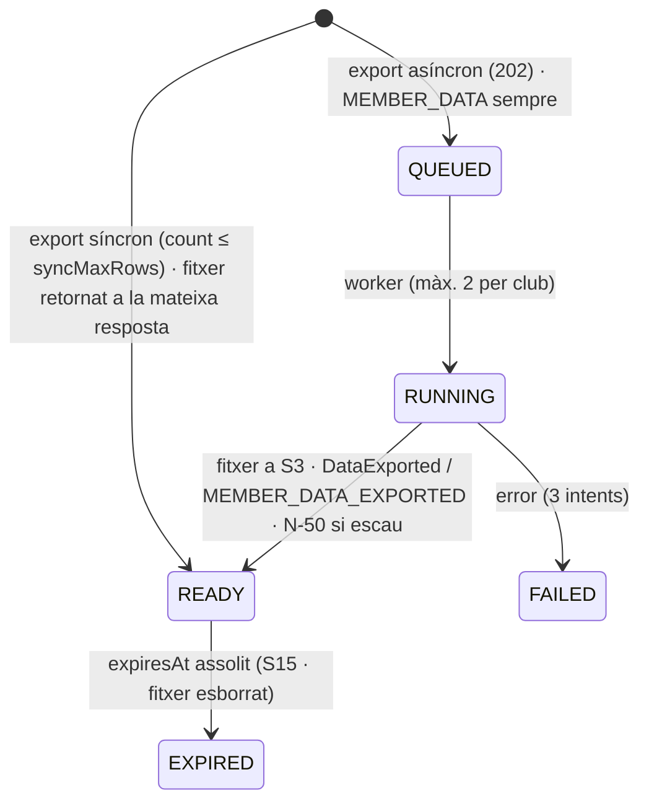
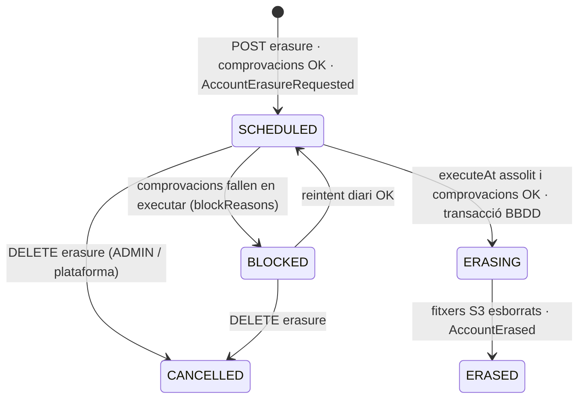

# S14 — Tauler, auditoria, exportacions i drets RGPD

**Etapa:** E3 (D1) + transversal (auditoria des d'E0, exports E2, RGPD E11) · **Mòduls:** `BILLING` (KPIs), `FREE_TRAINING` (KPI), `INACTIVITY`, `WAITLIST` · **Pantalles:** D1, D10 («Tota l'auditoria ›»), exports dels llistats universals (fitxers a `03-disseny/mockups/pantalles/`) · **Model:** PARAMETRE/AUDITORIA i «Cobertura per nivell» de v1.6 + §2 (PARAMETER.history), §3 (AUDITORIA), §6 (`DomainEventRecord`) i §7 (esborrat per pseudonimització) de `MODEL_DADES_PLATAFORMA.md` · **Estat:** esborrany (03-09-2026) · **Versió:** 0.1

## 1. Propòsit i abast

Resol quatre coses transversals: (1) el **tauler D1** de l'administrador (KPIs, revisió de classes en risc, preinscripcions pendents, gossos per nivell) servit per **un sol endpoint agregat** `GET /dashboard`; (2) l'**auditoria** (`AuditEntry`): què s'audita a tot el producte, la forma de l'entrada (`before/after`), l'ajuda `@Audited` que la resta de verticals han d'usar, la consulta club-wide i per abonat (D10 «Tota l'auditoria ›») i el patró «últim canvi … amb històric» (D11); (3) el **motor d'exportació** dels llistats universals (`ExportJob`, xlsx/pdf, síncron ≤ 5.000 files, asíncron per sobre); (4) els **drets RGPD**: accés (paquet de dades de l'abonat), supressió per **pseudonimització** (mai esborrat físic dels moviments comptables), retenció, consentiments consultables, minimització i registre lleuger d'**esdeveniments de seguretat**.

| Fora d'abast | On viu |
|---|---|
| Contingut i regles dels KPIs d'altres verticals més enllà del que D1 mostra (D6 comptadors, D14 pendents) | S12, S10 |
| Consola de clubs: auditoria de plataforma, cua d'errors, esdeveniments de seguretat en pantalla | S17 (aquí es defineixen les dades) |
| Identitat: comptes, tokens, mecànica d'impersonació (`ImpersonationStarted` s'audita des d'S01) | S01 |
| Execució temporitzada (revisió 7:30, supressions programades, neteja de fitxers, purga) | S15 (aquí es defineix la lògica que executa) |
| Export comptable de la remesa (`billing.accountingExportFormat`) | S12 (usa el motor d'aquesta spec amb `listKey = accounting`) |
| Alta pública i D2 (origen de la targeta de pendents i dels consentiments) | S04 |
| Redacció de la política de privacitat i del registre d'activitats de tractament | `PENDENTS_DESENVOLUPAMENT.md` §1 (aquí: llista d'encarregats i dades tècniques per redactar-la) |

## 2. Pantalles i rutes

| Mockup | App | Ruta | Rol | Notes de comportament |
|---|---|---|---|---|
| D1 `escriptori/D1-tauler-de-control.html` | `apps/clubs-admin` | `/tauler` | ADMIN | Una crida `GET /dashboard`. Salutació «Bon dia! {Dilluns 10 d'agost}» (data local del club, `fmtDate(weekday)`; franja del dia = assumpció §13). Quatre KPIs: «{184} · Abonats d'alta · {+3} aquest mes» · «{87%} · Ocupació classes · aquesta setmana · {142}/{163} places» · «{56} · Entrenaments reservats · setmana · {38} persones diferents» (només `FREE_TRAINING`) · «{3} · Preinscripcions pendents · {1} de fa més de {7} dies». Targeta «Revisió de classes en risc — {7:30}, avui i {2} dies vista» amb «{n} avisos» i una fila per classe: «{descripció} · {avui\|demà\|dc} {9:30} · {pista}» · «{n} inscrits» · estat (R-14-06). Targeta «Preinscripcions pendents»: fila «{Marta R.} + {Kiwi} ({whippet})» · «{Abonat} · {domiciliació}» · distintiu vermell «Compte no informat» · [VALIDA] → D2 (`/preinscripcions/:memberId`, S04); es llisten **totes** (sense [Veure totes]). Gràfic «Gossos per nivell — {242} actius», llegenda «amb reserva (setm. en curs o anterior) · total actius», una columna per nivell actiu «{code}» amb «{total} · {n} res.»; amagat si `levels.enabled=false`. Estats: carregant = esquelets de les 4 targetes; targeta buida = «Cap classe en risc» / «Cap preinscripció pendent»; error = toast per `code` + [Torna-ho a provar]; refetch en tornar el focus. |
| D10 (bloc «Rebuts recents i auditoria») `escriptori/D10-fitxa-d-abonat.html` | `apps/clubs-admin` | `/abonats/:id` | ADMIN | «Darrers canvis: {03/08} {canvi d'IBAN} ({admin} {Jordi}) · …» = `overview.recentAudit[≤2]` (S03). «Tota l'auditoria ›» → `/abonats/:id/auditoria`. Peu (només abonats `LEFT`, assumpció §13): «Suprimeix les dades (RGPD)» → diàleg amb les comprovacions (R-14-14) → `POST /members/{id}/erasure`; si ja hi ha sol·licitud, mostra «Supressió programada per al {data}» + [Anul·la la supressió]. Abonat suprimit: capçalera «Abonat suprimit #{87}», distintiu «suprimit», cap acció. Capçalera: «Descarrega les dades (RGPD)» → `POST /members/{id}/data-export`. |
| Auditoria d'un abonat (sense mockup) | `apps/clubs-admin` | `/abonats/:id/auditoria` | ADMIN | Llistat universal (patró D5) sobre `GET /members/{id}/audit-entries`: columnes Data · Acció · Entitat · Actor · «com l'abonat» · Canvis · Origen; clic a la fila → calaix amb `changes[]` («{camp}: {abans} → {després}»). «Excel · PDF» (R-14-12). |
| Auditoria del club (sense mockup) | `apps/clubs-admin` | `/auditoria` (`?entityType=&entityId=`) | ADMIN | Mateix llistat sobre `GET /audit-entries` amb filtre universal; s'hi arriba des de «amb històric» (D11 i qualsevol fitxa amb `lastChange`) i des del menú Configuració (entrada «Auditoria», proposta §13). |
| D11 (capçalera) `escriptori/D11-parametres-del-club.html` | `apps/clubs-admin` | `/parametres` | ADMIN | «últim canvi: {PAR-08} · {11/08} · {Jordi} — amb històric» = component `LastChange` alimentat per `lastChange` del recurs (R-14-11); «amb històric» obre `/auditoria?entityType=Parameter`. |
| 12 Perfil (entrada nova, sense mockup) | `apps/clubs` | `/perfil` | MEMBER (no impersonat) | «Descarrega les meves dades» → `POST /me/data-export` → estat «Preparant el paquet…» → notificació N-50 (proposta) amb l'enllaç; «Sol·licita la supressió del compte» **no** existeix a R1 (es demana al club; §13). |
| D19 Consola (S17) | `apps/clubs-admin` | `/consola/...` | AGILITYHUB_ADMIN | Consumeix `/platform/audit-entries`, `/platform/erasure-requests`, `/platform/security-events` definits aquí; la UI és d'S17. |

## 3. Entitats i camps

Totes amb `createdAt`; `clubId` via `TenantRepository` llevat d'on s'indica. Índexs obligatoris amb `clubId` al davant.

### `AuditEntry` · `audit_entries` (AUDITORIA v1.6 + PLATAFORMA §3) — context `platform`, `clubId` **nul·lable** (accions de plataforma)
| Camp | Tipus | Oblig. | Validació / notes |
|---|---|---|---|
| `at` | instant | sí | moment del commit |
| `actorAccountId`, `actorName`, `actorRole` | UUID?, string?, enum `ADMIN`·`INSTRUCTOR`·`MEMBER`·`SYSTEM`·`PLATFORM`·`WEBHOOK` | sí (`actorAccountId` nul per `SYSTEM`/`WEBHOOK`) | `actorName` = instantània («Jordi») per no dependre del compte; `SYSTEM` porta `job` a `details` |
| `impersonatedMemberId`, `impersonatedName` | UUID?, string? | no | «Entra com l'abonat»: actor + en nom de qui (R26-08) |
| `origin` | enum `APP`·`BACKOFFICE`·`SYSTEM`·`WEBHOOK` | sí | mateix enum que el catàleg d'esdeveniments |
| `entityType`, `entityId`, `entityLabel` | string, string, string? | sí | `entityType` = nom del glossari (`Member`, `Dog`, `ClassSession`, `Remittance`, `Parameter`, `Club`…); `entityLabel` instantània («Laura Serra Vidal», «bookings.maxCurrentWeek») |
| `memberId` | UUID? | no | l'abonat a qui **concerneix** l'entrada (propietari del gos, de la reserva, del rebut…) — índex per D10 |
| `action` | enum `AuditAction` | sí | catàleg de R-14-09; `enums:auditAction.{ACTION}` al front |
| `changes[]` | `[{path, before, after}]` | sí (pot ser buit) | només camps canviats; valors JSON; sensibles emmascarats (R-14-10) |
| `reason`, `details` | string ≤ 500?, JSON? | no | motiu lliure de l'acció (rebuig, bloqueig, anul·lació) · dades extra (`invoiceIds[]`, `rows`, `job`) |
| `ip`, `userAgent`, `traceId`, `eventIds[]` | string?, string?, string, UUID[] | — | `ip` completa (base legal: interès legítim de seguretat; es purga a l'esborrat i a la retenció) · enllaç als `DomainEventRecord` de la mateixa transacció |

Índexs: `{clubId, at desc}`, `{clubId, memberId, at desc}`, `{clubId, entityType, entityId, at desc}`, `{clubId, action, at}`, `{actorAccountId, at}`. Mai `version`: **append-only**; cap `PATCH`/`DELETE` d'API.

### `ExportJob` · `export_jobs` — context `clubs/common`
| Camp | Tipus | Oblig. | Notes |
|---|---|---|---|
| `kind` | enum `LIST`·`MEMBER_DATA`·`ACCOUNTING` | sí | `ACCOUNTING` el produeix S12 |
| `listKey`, `format` | string, enum `XLSX`·`PDF`·`ZIP` | sí | `listKey` = recurs (`members`, `dogs`, `invoices`, `audit-entries`, `activity-registrations`…); `MEMBER_DATA` sempre `ZIP` |
| `query` | `{q?, filters[], sort, columns[], locale, timeZone}` | `LIST` | congelada en crear el job (reproduïble) |
| `subjectMemberId`, `deliverToMember` | UUID?, bool | `MEMBER_DATA` | a qui pertanyen les dades · si l'abonat rep N-50 |
| `requestedByAccountId`, `impersonatedMemberId?` | UUID | sí | qui ho demana |
| `status`, `rows`, `progressPct`, `error` | enum §5, int?, int?, `{code, message}?` | sí | |
| `fileKey`, `fileName`, `sizeBytes`, `contentType`, `expiresAt` | string?, string, long?, string, instant | en `READY` | S3 `exports/{clubId}/{jobId}/{fileName}`; descàrrega per URL signada |
| `attempts` | int | sí | ≤ 3 |

Índexs: `{clubId, requestedByAccountId, createdAt desc}`, `{status, expiresAt}` (neteja S15).

### `ErasureRequest` · `erasure_requests` — context `platform`, `clubId` nul·lable (**proposta al glossari**, §13)
| Camp | Tipus | Oblig. | Notes |
|---|---|---|---|
| `scope` | enum `MEMBER`·`ACCOUNT` | sí | `MEMBER` = dades del club (D10) · `ACCOUNT` = compte + totes les membresies (consola) |
| `accountId`, `memberIds[]`, `clubIds[]` | UUID?, UUID[], UUID[] | sí | `accountId` nul si l'abonat mai va tenir compte (alta rebutjada) |
| `source` | enum `ADMIN`·`PLATFORM`·`RETENTION` | sí | `RETENTION` = R-14-16 |
| `requestedByAccountId`, `requestedAt`, `reason` | UUID?, instant, string ≤ 500? | sí | |
| `status`, `executeAt`, `blockReasons[]`, `erasedAt`, `cancelledAt/By` | enum §5, instant, enum[] , instant?, … | sí | `blockReasons` ∈ `MEMBER_NOT_LEFT`·`INVOICES_OPEN`·`UPFRONT_OPEN`·`FUTURE_BOOKINGS`·`OTHER_MEMBERSHIPS_ACTIVE` |
| `filesPending[]` | string[] | — | claus S3 pendents d'esborrar (fase `ERASING`) |

Únic parcial `{memberIds, status ∈ {SCHEDULED, BLOCKED, ERASING}}` (una sol·licitud viva per abonat).

### `SecurityEvent` · `security_events` — context `identity`, global amb `clubId?` (**proposta**, §13)
`type` ∈ `LOGIN_FAILED`·`LOGIN_LOCKED`·`MAGIC_LINK_INVALID`·`REFRESH_TOKEN_REUSED`·`RATE_LIMITED`·`IMPERSONATION_DENIED`·`WEBHOOK_SIGNATURE_INVALID` · `accountId?` · `emailHash?` (HMAC) · `clubId?` · `ip` · `userAgent` · `route` · `details` · `at`. Índex TTL sobre `at` = `security.eventRetentionDays` (proposta, 90). **No** és auditoria: no hi ha accés d'ADMIN de club a R1.

### Camps que aquesta spec afegeix a entitats d'altres verticals
`Member.erasedAt`, `Member.erasureRequestId`, `displayStatus.kind += ERASED` («suprimit») · `Dog.erasedAt` · `Account.status += ERASED` · `Membership.status += ERASED` · `ClassSession.riskNotice {at, bookingIds[]}` (l'escriu S15 en emetre `ClassAtRisk`; el tauler el llegeix) · `Parameter`/`Level`/`Ring`/`Plan`/`MessageTemplate`/`FaqEntry` **no** guarden res: `lastChange` es deriva de l'auditoria (R-14-11).

## 4. Regles de negoci

| Id | Regla | Paràmetres / mòduls | Excepcions | Exemple |
|---|---|---|---|---|
| R-14-01 | **Tauler: tenant, «avui» i cache.** Tot es calcula amb el `clubId` del JWT i la data local del club (`club.timeZone`). «Setmana en curs» = setmana ISO (dl–dg) que conté avui; «aquest mes» = mes natural d'avui. `DashboardQuery` es cacheja per club 60 s (`app.dashboard.cacheSeconds`, configuració, no paràmetre) i s'invalida en consumir `SignupSubmitted`, `MemberValidated`, `SignupRejected`, `ClassCancelledByClub`, `ClassAutoCancelled`, `ClassAtRisk`. La resposta porta `generatedAt`. Token d'impersonació → `403 IMPERSONATION_DENIED`. | `club.timeZone` = Europe/Madrid | — | Dilluns 10-08 00:30 a Madrid = diumenge 9 a Buenos Aires: cada club veu la seva setmana. |
| R-14-02 | **KPI «Abonats d'alta».** `value` = `Member.status = ACTIVE` (inclou inactius per període i baixes previstes, com D5 «184 d'alta»). `deltaThisMonth` = validats aquest mes (`joinedAt` ∈ mes, `readmission` inclosa) − baixes efectives aquest mes (`status = LEFT ∧ leaveDate ∈ mes`); el front mostra el signe («+3 aquest mes», «−2 aquest mes», «0 aquest mes»). | — | — | 5 validats i 2 baixes a l'agost → «+3 aquest mes». |
| R-14-03 | **KPI «Ocupació classes · aquesta setmana».** Sobre `ClassSession` de la setmana en curs amb `state ∈ {ACTIVE, FINISHED}` (mai `DRAFT` ni `CANCELLED`): `capacity` = Σ `capacity`, `booked` = Σ `counters.booked`, `percent` = round(100·booked/capacity) (HALF_UP; `capacity = 0` → `percent = null` i la UI mostra «—»). `waitingTotal` = Σ `counters.waiting` (només `WAITLIST`; no es pinta a R1). | `WAITLIST` | — | 142/163 → 87 %. Anul·lar una classe de 5 places amb 3 inscrits → 139/158 = 88 %. |
| R-14-04 | **KPI «Entrenaments reservats · setmana».** `TrainingBooking` `ACTIVE` amb `startsAt` dins la setmana en curs (dl–dg local, **no** la setmana del comptador que comença a `bookings.weekOpensAt`): `value` = recompte, `distinctMembers` = `memberId` diferents. Mòdul off → bloc `null` i la graella passa a 3 KPIs. | `FREE_TRAINING` | — | 56 reserves de 38 abonats (Laura amb Duna i Rock compta 1). |
| R-14-05 | **Preinscripcions pendents (KPI + targeta).** Font: `Member.status = PENDING` **o** `ACTIVE` amb algun `Dog` `PENDING` (gos afegit, S04 R-04-25), ordre `signup.submittedAt asc`. `pendingDays` = dies naturals sencers des de `submittedAt` (data local); `olderThanWarn` = recompte amb `pendingDays > dashboard.pendingSignupAgeWarnDays` («{1} de fa més de {7} dies»; a la fila, la data en vermell). Fila: `shortName` («Marta R.»), gossos pendents `{name, breed}` (gos afegit: «(nou gos)»), `planName` (`signup.planIdRequested` resolt; sense pla → «—»), `paymentMethodType` («domiciliació» · «targeta» · «efectiu»; només `BILLING`), `warnings[]` d'S04 R-04-18: `ACCOUNT_NOT_PROVIDED` → distintiu «Compte no informat». [VALIDA] navega a D2 (no valida res des del tauler). El comptador del menú «Preinscripcions» és el mateix recompte. | `dashboard.pendingSignupAgeWarnDays` = 7; `BILLING` | `BILLING` off: sense mètode ni distintiu | Núria T. + Lua (mestís) · Teràpia · domiciliació · «Compte no informat». |
| R-14-06 | **Targeta «Revisió de classes en risc».** Finestra = `[avui, avui + classes.riskLookaheadDays]` (dates locals). Files = `ClassSession` de la finestra amb (a) `state = CANCELLED ∧ cancellation.reason = RISK_REVIEW` → `status = CANCELLED`, `notified` = guies+gossos de `cancellation.affectedBookings` («anul·lada», o «anul·lada · avisada Laura + Duna»), o (b) `atRisk = true` segons `RiskEvaluator` (S06 R-06-13, mateix codi que S15) → si `riskNotice` existeix: `AT_RISK` amb `notified` = els seus `bookingIds` («en risc · avisats Pau + Blat»); si `counters.booked = 0` i `classes.riskAutoCancelSameDay = true`: `WILL_CANCEL` («s'anul·larà {dc} a les {7:30}», `reviewAt` = dia de la classe a `classes.riskReviewTime`); si `riskAutoCancelSameDay = false`: `PENDING_DECISION` («en risc · el club decidirà»). Anul·lacions manuals (`CLUB_MANUAL`, `DELETED`) **no** hi surten. `count` = files («4 avisos»). Ordre: data, hora. «avisada/avisat/avisats» per ICU (`count` + `gender` de l'abonat quan és un de sol). Noms: `Member.firstName` + `Dog.name`. | `classes.riskLookaheadDays` = 2, `classes.riskReviewTime` = 07:30, `classes.minDogs` = 2, `classes.riskAutoCancelSameDay` = true | classe `riskExempt` → mai hi surt | Mockup: Cadells avui 9:30 (0 inscrits) «anul·lada» · Nivell D avui 17:40 «anul·lada · avisada Laura + Duna» · F i G demà 20:00 «en risc · avisats Pau + Blat» · Cadells dc 9:30 «s'anul·larà dc a les 7:30». |
| R-14-07 | **Gràfic «Gossos per nivell».** Per a cada `Level.active` en `order`: `total` = gossos `ACTIVE` d'abonats `ACTIVE` amb `levelId = L`; `withRecentBooking` = els que tenen ≥ 1 `Booking` `ACTIVE`/`CANCELLED_LATE` en una classe de la setmana en curs o de les `coverage.activeDogWeeks − 1` anteriors — **mateix càlcul** que `dogsActive` de S06 R-06-06 (servei compartit `DogActivityQuery`). `totalActiveDogs` = Σ total («242 actius»). Etiqueta de columna = `Level.code`; tooltip = `Level.name` resolt. Nivells inactius: no surten encara que tinguin gossos (`others` porta el recompte, no es pinta). `levels.enabled = false` → `dogsByLevel = null` i la targeta desapareix. | `coverage.activeDogWeeks` = 2; `levels.enabled` = true | — | Cadells 24 · 19 res. … G 12 · 7 res. |
| R-14-08 | **Comptadors del menú** («Preinscripcions 3», «Inactivitats i baixes 1», «Seguiment alumnes 5»): `GET /dashboard/counters` (cache 30 s) retorna `pendingSignups` (R-14-05), `pendingRequests` = `InactivityPeriod` `REQUESTED` + `LeaveRequest` `REQUESTED` (S13; `INACTIVITY` off → només baixes), `followUpUnread` (S10 D14). El shell d'`apps/clubs-admin` el crida en carregar i cada canvi de ruta. | `INACTIVITY` | — | — |
| R-14-09 | **Què s'audita (contracte).** Tota mutació de la taula següent escriu **una** `AuditEntry` **dins la mateixa transacció** que el canvi i l'outbox. Els **logins correctes no s'auditen** (`Account.lastLoginAt`, `Membership.lastAccessAt`); els fallits van a `SecurityEvent` (R-14-17). Les lectures no s'auditen, llevat de les exportacions i dels paquets RGPD. `AuditAction` (enum, `owner` = spec): `MEMBER_VALIDATED`, `SIGNUP_REJECTED`, `SIGNUP_EDITED` (S04) · `MEMBER_UPDATED`, `MEMBER_PAYMENT_METHOD_CHANGED`, `MEMBER_STATUS_CHANGED`, `MEMBER_ROLES_CHANGED`, `MEMBER_CONSENT_CHANGED`, `BOOKING_BLOCK_SET`, `BOOKING_BLOCK_CLEARED`, `ACCESS_RESENT`, `DOG_UPDATED`, `DOG_LEVEL_CHANGED`, `DOG_FREE_TRAINING_CHANGED`, `DOG_TRANSFERRED`, `DOG_DEACTIVATED`, `DOG_REACTIVATED`, `DOG_DOCUMENT_FILE_REMOVED`, `FAMILY_GROUP_CHANGED` (S03) · `MEMBER_PLAN_CHANGED` (tarifa), `INVOICE_MARKED_PAID`, `INVOICE_MARKED_FAILED`, `INVOICE_CANCELLED`, `REMITTANCE_GENERATED`, `REMITTANCE_ROLLED_BACK`, `UPFRONT_PAYMENT_RECORDED`, `PAYMENT_REFUNDED` (S12) · `IMPERSONATION_STARTED` (S01) · `ACCOUNT_EMAIL_STATUS_CHANGED` (S11 webhook de correu → `Account.emailStatus` BOUNCED/COMPLAINED; afegit 06-09, E1-T03) · `PLATFORM_ROLES_CHANGED` (S17 R-17-09 `PUT /platform/accounts/{id}/platform-roles`, `entityType = Account`, `changes[].path = platformRoles`; afegit 09-09, E1-T13) · `BOOKING_CREATED_BY_CLUB`, `BOOKING_CANCELLED_BY_CLUB`, `BOOKING_CANCELLED_LATE` (S08) · `TRAINING_BOOKED_BY_CLUB`, `TRAINING_CANCELLED_BY_CLUB` (S09) · `ATTENDANCE_OVERRIDDEN` (S10) · `WEEK_VALIDATED`, `CLASS_CANCELLED`, `CLASS_UPDATED_WITH_BOOKINGS`, `CLASS_RISK_EXEMPTION_CHANGED`, `RING_BLOCK_CREATED`, `RING_BLOCK_CANCELLED`, `TEMPLATE_CLASS_DELETED` (S06) · `ACTIVITY_PUBLISHED`, `ACTIVITY_CANCELLED` (S07) · `INACTIVITY_RESOLVED`, `LEAVE_RESOLVED`, `LEAVE_CANCELLED` (S13) · `PARAMETER_CHANGED`, `CLUB_UPDATED`, `CLUB_MODULES_CHANGED`, `CLUB_STATUS_CHANGED` (S02/S17) · `CATALOG_CHANGED` (Level/Ring/Instructor/Plan/Price/FaqEntry/MessageTemplate; S05/S11) · `ANNOUNCEMENT_SENT` (S11) · `DATA_EXPORTED`, `MEMBER_DATA_EXPORTED`, `ERASURE_REQUESTED`, `ERASURE_CANCELLED`, `MEMBER_ERASED`, `ACCOUNT_ERASED` (S14). Accions impersonades: la mateixa acció amb `impersonatedMemberId` informat i `origin = BACKOFFICE`. Afegir una acció = enum + fila aquí + test `@AuditCovers`. | — | processos S15: `actorRole = SYSTEM`, `details.job` | Bloqueig de reserves de Marc → `BOOKING_BLOCK_SET`, `memberId = Marc`, `reason = «rebut de juliol impagat»`. |
| R-14-10 | **Forma, diff i emmascarament; `@Audited`.** `changes[]` = només camins canviats, en notació de punts (`paymentMethod.iban`, `phones[1].number`), `before`/`after` JSON (arrays sencers si canvia algun element; `null` per absent). Camps anotats `@Sensitive(MASK_IBAN)` → «···· ···· ···· ···· 2231»; `@Sensitive(MASK_ID_DOCUMENT)` → «38······1P»; `@Sensitive(HIDE)` (`passwordHash`, claus, `chip` a `/me`) → «[ocult]»; els fitxers només per `fileKey`. Ús: `@Audited(action = MEMBER_PAYMENT_METHOD_CHANGED, entity = "Member", id = "#id", member = "#id")` sobre el mètode de servei: l'aspecte carrega l'estat abans (via `AuditableLoader<Member>` registrat per `entityType`), executa, calcula el diff sobre l'estat després i escriu l'entrada **dins** la transacció (ordre d'aspectes: després de `@Transactional`). Fluxos complexos usen `AuditWriter.record(AuditCommand)` explícitament (una entrada per agregat: la remesa amb `details.invoiceIds[]`, no una per rebut). Actor, impersonat, `ip`, `userAgent`, `traceId` surten d'`AuthContext`; `eventIds[]` de l'outbox de la mateixa transacció. Una entrada sense cap canvi ni motiu no s'escriu (`@Audited` la descarta) llevat d'accions «d'esdeveniment» (`WEEK_VALIDATED`, `DATA_EXPORTED`). | — | — | `{path: "paymentMethod.iban", before: "···· ···· ···· ···· 2231", after: "···· ···· ···· ···· 8867"}`. |
| R-14-11 | **Consulta de l'auditoria.** `GET /audit-entries` és un llistat universal (§4 de CONVENCIONS): `x-filterable` `at (between), action, entityType, entityId, memberId, actorAccountId, actorRole, impersonatedMemberId, origin`; `x-sortable` `at`; `q` sobre `entityLabel`, `actorName`, `reason`. `GET /members/{id}/audit-entries` = mateix contracte amb `memberId = id ∨ impersonatedMemberId = id`. INSTRUCTOR i MEMBER: `403`. «Darrers canvis» de D10 = 2 darreres per `memberId` («{dd/mm} {enums:auditAction} ({actorRole} {actorName})»). **`lastChange`**: tot recurs editable al backoffice (`Parameter`, `Level`, `Ring`, `Instructor`, `Plan`, `Price`, `MessageTemplate`, `FaqEntry`, `WeekTemplate`, `Club`) retorna `lastChange {at, actorName, action}` = darrera entrada per `(entityType, entityId)` (`AuditQuery.lastChange`), i el component `LastChange` pinta «últim canvi: {label} · {dd/mm} · {nom} — amb històric». La col·lecció de paràmetres també conserva `history[]` (S02): l'auditoria és la vista transversal, l'històric la font del valor. Retenció: entrades amb `at` anterior a `audit.retentionYears` (proposta, 6) es purguen físicament (S15, mensual; excepció documentada a «res s'esborra»). | `audit.retentionYears` (proposta) | — | «03/08 canvi d'IBAN (admin Jordi) · 26/07 canvi de tarifa (admin Jordi)». |
| R-14-12 | **Exports de llistats.** `GET /{recurs}/export?format=xlsx\|pdf&columns=…` + els mateixos `q/filter/sort` del llistat, només per als recursos marcats `x-exportable` (R1: `members`, `dogs`, `invoices`, `audit-entries`, `activity-registrations`, `notifications`; ADMIN). Sempre es crea un `ExportJob`: si `count ≤ 5.000` (`ExportPolicy.syncMaxRows`, CONVENCIONS §4) el job neix `READY` i la resposta és el fitxer (`200`, `Content-Disposition`); si no, `202 {jobId, statusUrl}` i el genera un worker (màx. 2 jobs `RUNNING` per club: `422 EXPORT_LIMIT`, classe 422 del CATALEG_ERRORS — 429 només per a `RATE_LIMITED`); `count > 100.000` (`ExportPolicy.maxRows`) → `422 EXPORT_TOO_LARGE`. Nom: `{club.slug}_{listKey}_{yyyyMMdd-HHmm}.{ext}` (hora local). Capçaleres i valors en el `locale` del sol·licitant: etiquetes de columna `export.column.{listKey}.{col}` (`messages_{locale}`), enums via `enums.*`, dates amb el fus del club (`dd/MM/yyyy`), `Money` amb la moneda del club, booleans «Sí/No», `LocalizedText` resolts; **mai** IBAN complet, `chip` ni `idDocument` sense emmascarar (mateixos `@Sensitive`). PDF: plantilla amb `CLUB.theme` (logo, color primari), títol = nom del llistat, subtítol = filtres aplicats + «Generat el {data} per {nom}», apaïsat si > 6 columnes, peu «Pàgina {n} de {m}» + nom del club. Fitxer a S3 (o directori privat al perfil `local`) **7 dies** (`ExportPolicy.fileRetentionDays = 7`, decisió A18d; S15 neteja → `EXPIRED`); `downloadUrl` signada fins a `expiresAt`. Rate limit 10 exports / 10 min per compte (`429 RATE_LIMITED`). Cada job emet `DataExported{listKey, format, rows, by}` + `AuditEntry DATA_EXPORTED` (`entityType = ExportJob`, `details {listKey, rows, filters}`). | `club.slug`, `club.timeZone`, `club.currency`, `CLUB.theme` | INSTRUCTOR: `403` (només llegeix llistats) | `canic_members_20260810-0912.xlsx` amb capçalera «Abonat · Gossos · Modalitat · Estat» (ca) o «Socio · Perros · Modalidad · Estado» (es). |
| R-14-13 | **Dret d'accés (paquet de dades).** `POST /members/{id}/data-export {deliverToMember}` (ADMIN) i `POST /me/data-export` (MEMBER; impersonació → `403 IMPERSONATION_DENIED`) creen un `ExportJob{kind: MEMBER_DATA}` sempre asíncron; màxim un per abonat cada 24 h (`409 DATA_EXPORT_TOO_SOON`). Contingut del ZIP: `data.json` (`schema: memberData.v1`, seccions: `account` (email, nom, locale, `createdAt`, `lastLoginAt`), `memberships`, `member` (tots els camps; IBAN emmascarat), `consents[]`, `notificationPreferences`, `dogs[]` (amb `chip`, `levelHistory`, `licenses`, `instructorNote`, `remarks` d'instructors, documents com a llista), `bookings[]`, `trainingBookings[]`, `waitlistEntries[]`, `attendances[]`, `tasks[]`, `inactivityPeriods[]`, `leaveRequests[]`, `invoices[]` (amb línies i cobraments), `upfrontPayments[]`, `packBalances[]`, `notifications[]` (títol, cos, canal, data), `auditEntries[]` (acció, data, `actorRole` — mai el nom d'un tercer), `familyGroup` (id i rol, sense dades d'altres membres)), `resum.pdf` (les mateixes seccions, en el `locale` de l'abonat, plantilla amb marca), i la carpeta `fitxers/` (documents dels gossos, fotos, adjunts propis). `expiresAt` = 7 dies (`ExportPolicy.memberDataRetentionDays`); descàrrega per URL signada de curta durada. En `READY`: `MEMBER_DATA_EXPORTED` (auditoria, `memberId`) i, si `deliverToMember` o `/me`, N-50 (proposta) amb `link`. El `MEMBER` només veu `GET /exports/{id}` dels seus jobs. | `club.locales`, `club.defaultLocale` | — | Laura demana les seves dades des de 12 → als 2 min rep «Les teves dades estan a punt» amb l'enllaç (7 dies). |
| R-14-14 | **Dret de supressió: sol·licitud i comprovacions.** `POST /members/{id}/erasure {reason?}` (ADMIN) o `POST /accounts/{id}/erasure` (AGILITYHUB_ADMIN, `scope = ACCOUNT`, totes les membresies). `ErasureEligibility` comprova per abonat: `Member.status = LEFT` (`MEMBER_NOT_LEFT`), cap `Invoice` en `PENDING`/`COLLECTING`/`FAILED` (`INVOICES_OPEN`), cap `UpfrontPayment` `DUE`/`PARTIAL`/`CHECKOUT_PENDING` (`UPFRONT_OPEN`), cap reserva futura activa (`FUTURE_BOOKINGS`; no n'hi hauria d'haver: S03); per `ACCOUNT`, a més, cap membresia `ACTIVE` en un altre club (`OTHER_MEMBERSHIPS_ACTIVE`). Alguna falla → `422 ERASURE_BLOCKED {reasons[], details}` i no es crea res. Si passa: `ErasureRequest` `SCHEDULED` amb `executeAt = max(ara, leaveDate + rgpd.erasureMinDaysAfterLeave)` (marge de reconsideració/readmissió); sol·licitud viva existent → `409 ERASURE_ALREADY_REQUESTED`. Emet `AccountErasureRequested{accountId?, memberIds[], executeAt}` (+ N-52 proposta a l'email del compte mentre existeix) i audita `ERASURE_REQUESTED{reason}`. `DELETE …/erasure` → `CANCELLED` (`ERASURE_CANCELLED`); només en `SCHEDULED`/`BLOCKED` (`409 INVALID_STATE`). Un abonat `ACTIVE` que demana la supressió primer ha de tramitar la baixa (S13): la UI ho diu. Readmissió posterior (S04 R-04-06) **no** troba l'abonat suprimit (document `ERASED-…`) → abonat nou amb número nou. | `rgpd.erasureMinDaysAfterLeave` (proposta, 30) | `source = RETENTION` (R-14-16) salta el marge | Montse (baixa 31-08, rebuts al dia) → sol·licitud el 05-09 → `executeAt = 30-09`; amb un rebut `FAILED` → `422 ERASURE_BLOCKED {INVOICES_OPEN}`. |
| R-14-15 | **Execució: pseudonimització camp a camp** (`ErasureExecutor`, S15 el dispara a `executeAt`; una transacció Mongo per club + `AccountErased` a l'outbox; després, esborrat d'S3 per un consumidor amb reintents; idempotent per `erasedAt`). Torna a avaluar R-14-14: si falla → `BLOCKED{blockReasons}` (reintent diari). Mapatge: **Account** `email` → `erased+{hmac16(email)}@erased.invalid` (HMAC amb clau del servidor: únic, no reversible ni enumerable), `name` → «Compte suprimit», `givenName/familyName/avatarUrl/passwordHash/externalIds/emailVerifiedAt` → null/{}; `status` → `ERASED`; `RefreshToken`, `MagicLinkToken`, `ImpersonationGrant`, `PushSubscription`, `SavedView`, `SecurityEvent` del compte → esborrats físicament (tècnics); **Notification** del compte: `recipientEmail` → el mateix pseudònim que `Account.email` (afegit 06-09, E1-T03). **Membership** → `status ERASED`, `roles []`. **Member** `firstName` → «Abonat suprimit», `lastName1` → «#{memberNumber}» (sense número: «#—»), `lastName2/birthDate/address/remarks/internalNotes` → null, `contactEmails/phones` → [], `idDocument` → `{type: ERASED, number: "ERASED-{memberId}"}`, `paymentMethod` → només `type` + `mandateRef` + `mandateSignedAt` (IBAN, titular, `holderTaxId`, dades de targeta → null; amb `CARD`, `PaymentProvider.forgetCustomer` a S12), `signup.userAgent`, `familyGroupClaim.holderName/dogName`, `bookingBlock.reason`, `lastDogFor*` → null, `notificationPreferences` → per defecte; **conservats**: `memberNumber`, `status`, `gender`, `joinedAt`, `leaveDate`, `planId/priceId`, `consents[]` (versions, dates, `ipHash`), `familyGroupId`; `erasedAt`, `erasureRequestId`. **Dog** `name` → «Gos suprimit», `chip` → null (índex únic parcial), `licenses` → [], `instructorNote/remarks/photoFileKey` → null (foto esborrada); conservats `breed`, `sex`, `birthDate`, `levelId`, `levelHistory`, `status`. **DogDocument** fitxers esborrats d'S3, `files[].name` → null + `removedAt`. **Task** `text` → «(suprimit)», adjunts esborrats. **Booking/TrainingBooking/WaitlistEntry/Attendance/InactivityPeriod/LeaveRequest**: ids, estats, dates i NPS conservats; text lliure (`cancelNote`, comentari de baixa) → null. **Invoice**: número, dates, línies, imports, estat conservats; instantània `paymentMethod.holderName` → «Abonat suprimit #{n}», `maskedAccount` → null. **Collection/Remittance/UpfrontPayment/PackBalance**: conservats (`providerRef` inclòs); el XML de la remesa no es reescriu (R-14-16). **Notification** `title/body/smsBody/renderedVariables` → null; `code`, canal, estats, `sentAt` conservats. **AuditEntry** amb `memberId` = suprimit, `impersonatedMemberId` = suprimit o `actorAccountId` = compte suprimit: `changes` → [], `reason/actorName/impersonatedName/entityLabel/ip/userAgent` → null (queden acció, entitat, ids, data). **Course** `ownerType = ACCOUNT` → `visibility PRIVATE`, `designerName` → null. Finalment `MEMBER_ERASED` per club i `ACCOUNT_ERASED` (entrades que només porten ids). | — | `scope = MEMBER` amb compte que té altres membresies actives o `externalIds.learnUserId`: el **compte no** es toca (només `Membership` → `ERASED`); Learn es tramita a part (§13) | D5 mostra «Abonat suprimit #87 · baixa»; D6 el rebut 2026-0744 «90 € · cobrat · Abonat suprimit #87». |
| R-14-16 | **Retenció automàtica i purga** (S15, mensual, per club amb mòdul de traça `SchedulerRun`): (a) abonats `LEFT` no suprimits amb `leaveDate + rgpd.retentionYearsAfterLeave ≤ avui` → `ErasureRequest{source: RETENTION, executeAt: ara}` i execució (R-14-15); les bloquejades queden `BLOCKED` visibles a la consola; (b) altes rebutjades (`leftReason = SIGNUP_REJECTED`) amb `leftAt + rgpd.rejectedSignupRetentionDays ≤ avui` → idem; (c) fitxers XML de remesa amb data anterior a `rgpd.retentionYearsAfterLeave` → esborrats d'S3 (contenen noms i IBAN de molts abonats i són document bancari fins llavors); (d) `AuditEntry` > `audit.retentionYears` → purga; (e) `ExportJob` caducats → `EXPIRED` + fitxer esborrat; (f) `SecurityEvent` per TTL. Les còpies de seguretat (ADR-003) es conserven `backup.retentionWeeks` setmanes i **no** es reescriuen: la política de privacitat ho ha de dir. | `rgpd.retentionYearsAfterLeave` (proposta, 5), `rgpd.rejectedSignupRetentionDays` (proposta, 365), `audit.retentionYears` (6) | perfil `ES`: revisar 6 anys (§13) | Baixa 31-08-2021 → supressió automàtica a la passada del 09-2026. |
| R-14-17 | **Esdeveniments de seguretat** (registre lleuger, sense notificacions a R1): S01 escriu `LOGIN_FAILED` (`emailHash`, `ip`), `LOGIN_LOCKED` (bloqueig progressiu), `MAGIC_LINK_INVALID`, `REFRESH_TOKEN_REUSED` (revoca la família de tokens), `HANDOFF_INVALID` (codi de canvi d'app reutilitzat o caducat, R-01-13; afegit 06-09, E1-T04), `IMPERSONATION_DENIED`, `TENANT_MISMATCH`; el filtre de rate limit (CONVENCIONS §9) escriu `RATE_LIMITED{route}`; S12 `WEBHOOK_SIGNATURE_INVALID`. Mai el text de la contrasenya ni l'email en clar. Consulta: `GET /platform/security-events` (S17). | `security.eventRetentionDays` (proposta, 90, sistema) | — | 6 fallits de `laura@…` en 15 min → 6 `LOGIN_FAILED` + 1 `LOGIN_LOCKED`. |
| R-14-18 | **Minimització, encarregats i cookies.** Staging i dev mai amb dades reals (ADR-003; seeds ficticis); logs estructurats amb `traceId`, `clubId`, `accountId` i **mai** email, telèfon, IBAN ni cos de peticions (`LoggingFilter` amb llista d'exclusió); Sentry amb `sendDefaultPii = false` i scrub d'email/ip; `chip` mai a `/me`, IBAN d'escriptura només (S03); consentiments consultables amb `GET /members/{id}/consents` (historial complet, S04 els escriu). **Encarregats del tractament** (per a la política del club, PENDENTS §1): AWS S3 eu-west-3 (fitxers), DigitalOcean (hosting UE, BBDD), proveïdor de correu (ADR-005), Twilio (SMS: telèfons), Stripe (pagaments: les dades de targeta mai passen pel core), Sentry (errors, sense PII). **Cookies**: la PWA i el backoffice només usen emmagatzematge tècnic (tokens, idioma, preferències d'UI) i cap analítica a R1 → **cap bàner de consentiment**; `apps/id` usa una cookie de sessió tècnica (OIDC), exempta. Afegir analítica exigiria consentiment previ. | — | — | — |

## 5. Estats i transicions



| Transició `ExportJob` | Qui | Condició | Efectes | Esdeveniment / auditoria |
|---|---|---|---|---|
| `[*]` → READY / QUEUED | ADMIN (llistat), ADMIN/MEMBER (paquet) | `x-exportable`, límits R-14-12/13 | job creat amb `query` congelada | `DataExported` (READY) |
| QUEUED → RUNNING → READY | worker | — | `fileKey`, `rows`, `expiresAt` | `DataExported` · `DATA_EXPORTED` / `MEMBER_DATA_EXPORTED` |
| RUNNING → FAILED | worker | 3 intents | `error` visible a `GET /exports/{id}` | — |
| READY → EXPIRED | S15 | `expiresAt` | fitxer esborrat | — |



| Transició `ErasureRequest` | Qui | Condició | Efectes | Esdeveniment / auditoria |
|---|---|---|---|---|
| `[*]` → SCHEDULED | ADMIN / AGILITYHUB_ADMIN / S15 (`RETENTION`) | R-14-14 | `executeAt` | `AccountErasureRequested` · `ERASURE_REQUESTED` · N-52 (proposta) |
| SCHEDULED → CANCELLED | ADMIN / plataforma | abans d'`ERASING` | — | `ERASURE_CANCELLED` |
| SCHEDULED → ERASING | S15 (`ErasureExecutor`) | `executeAt ≤ ara`, R-14-14 OK | pseudonimització en BBDD (R-14-15), `filesPending[]` | `MEMBER_ERASED` (per club), `ACCOUNT_ERASED` |
| SCHEDULED → BLOCKED | S15 | alguna comprovació falla | `blockReasons[]`; visible a consola i D10 | — |
| ERASING → ERASED | consumidor S3 | tots els fitxers esborrats | `erasedAt` | `AccountErased{accountId?, memberIds[], clubIds[]}` |

`Member`: `LEFT` → `LEFT` + `erasedAt` (`displayStatus = ERASED`); cap altra transició és possible després (`409 MEMBER_ERASED` a tota mutació d'S03/S13).

## 6. API

Tots amb `Authorization`; tenant del JWT; `403` rol no permès o token d'impersonació en endpoint ADMIN; `404` recurs d'un altre club.

| Mètode | Ruta | Rol(s) | Mòdul | Idempotent | Descripció | Cos/paràmetres clau | Respostes i errors |
|---|---|---|---|---|---|---|---|
| GET | `/dashboard` | ADMIN | — | sí | Agregat de D1 (R-14-01…07) | — | `200` (JSON a sota) |
| GET | `/dashboard/counters` | ADMIN | — | sí | Comptadors del menú (R-14-08) | — | `200 {pendingSignups, pendingRequests, followUpUnread}` |
| GET | `/audit-entries` | ADMIN | — | sí | Llistat universal (R-14-11) | `page,size,sort,q,filter,fields` | `200 {items: AuditEntryListItem[], …}` · `400 INVALID_FILTER` |
| GET | `/audit-entries/filter-values?field=` · `/audit-entries/export` | ADMIN | — | sí | facetes · export (R-14-12) | — | `200` · `202 {jobId}` |
| GET | `/audit-entries/{id}` | ADMIN | — | sí | Entrada completa | — | `200 AuditEntry` (amb `changes[]`) |
| GET | `/members/{id}/audit-entries` | ADMIN | — | sí | Llistat d'un abonat (D10 «Tota l'auditoria ›») | mateix contracte | `200` |
| GET | `/members/{id}/consents` | ADMIN | — | sí | Historial de consentiments | — | `200 [{type, granted, version, at, locale, ipHash, source}]` |
| GET | `/{recurs}/export?format=xlsx\|pdf` | ADMIN | segons recurs | sí | Export d'un llistat `x-exportable` (R-14-12) | `columns=` + `q/filter/sort` | `200` fitxer · `202 {jobId, statusUrl}` · `422 EXPORT_TOO_LARGE \| EXPORT_LIMIT` · `429 RATE_LIMITED` |
| GET | `/exports` | ADMIN | — | sí | Jobs propis recents (calaix «Exportacions») | `?kind=` | `200 [{id, kind, listKey, format, status, rows, fileName, createdAt, expiresAt}]` |
| GET | `/exports/{id}` | ADMIN · MEMBER (propis) | — | sí | Estat i descàrrega | — | `200 {status, progressPct, rows, fileName, downloadUrl? (signada fins a expiresAt, 7 dies), expiresAt, error?}` · `422 EXPORT_EXPIRED` |
| POST | `/members/{id}/data-export` | ADMIN | — | per 24 h | Paquet RGPD (R-14-13) | `{deliverToMember: bool}` | `202 {jobId}` · `409 DATA_EXPORT_TOO_SOON` |
| POST | `/me/data-export` | MEMBER (no impersonat) | — | per 24 h | Paquet propi | — | `202 {jobId}` · `403 IMPERSONATION_DENIED` · `409 DATA_EXPORT_TOO_SOON` |
| POST | `/members/{id}/erasure` | ADMIN | — | no | Sol·licitud de supressió (R-14-14) | `{reason?}` | `201 ErasureRequest` · `422 ERASURE_BLOCKED {reasons[]}` · `409 ERASURE_ALREADY_REQUESTED \| MEMBER_ERASED` |
| GET / DELETE | `/members/{id}/erasure` | ADMIN | — | sí | Sol·licitud viva · anul·lar-la | — | `200 ErasureRequest` / `204` · `404` · `409 INVALID_STATE` |
| POST | `/accounts/{id}/erasure` | AGILITYHUB_ADMIN | — | no | Supressió del compte i totes les membresies | `{reason?}` | `201` · `422 ERASURE_BLOCKED` · `409 ERASURE_ALREADY_REQUESTED` |
| GET | `/platform/audit-entries` · `/platform/erasure-requests` · `/platform/security-events` | AGILITYHUB_ADMIN | — | sí | Consola (S17): llistats universals amb `clubId` filtrable (`clubId:exists:false` = accions de plataforma) | — | `200` |

`GET /dashboard` (valors del mockup; `null` = bloc absent per mòdul o paràmetre):

```json
{ "generatedAt": "2026-08-10T06:12:00Z", "today": "2026-08-10", "week": {"start": "2026-08-10", "end": "2026-08-16"},
  "kpis": {
    "activeMembers": {"value": 184, "deltaThisMonth": 3},
    "classOccupancy": {"percent": 87, "booked": 142, "capacity": 163, "waitingTotal": 4},
    "trainingBookings": {"value": 56, "distinctMembers": 38},
    "pendingSignups": {"value": 3, "olderThanWarn": 1, "warnDays": 7} },
  "riskReview": { "reviewTime": "07:30", "lookaheadDays": 2, "autoCancelSameDay": true, "count": 4, "items": [
      {"classSessionId": "…", "date": "2026-08-10", "startTime": "09:30", "displayDescription": "Cadells", "ringName": "Cadells", "booked": 0, "status": "CANCELLED", "notified": [], "reviewAt": "2026-08-10T05:30:00Z"},
      {"classSessionId": "…", "date": "2026-08-10", "startTime": "17:40", "displayDescription": "Nivell D", "ringName": "Petita", "booked": 1, "status": "CANCELLED", "notified": [{"memberFirstName": "Laura", "gender": "FEMALE", "dogName": "Duna"}], "reviewAt": "…"},
      {"classSessionId": "…", "date": "2026-08-11", "startTime": "20:00", "displayDescription": "F i G", "ringName": "Carretera", "booked": 1, "status": "AT_RISK", "notified": [{"memberFirstName": "Pau", "gender": "MALE", "dogName": "Blat"}], "reviewAt": "2026-08-11T05:30:00Z"},
      {"classSessionId": "…", "date": "2026-08-12", "startTime": "09:30", "displayDescription": "Cadells", "ringName": "Cadells", "booked": 0, "status": "WILL_CANCEL", "notified": [], "reviewAt": "2026-08-12T05:30:00Z"} ] },
  "pendingSignups": { "count": 3, "items": [
      {"memberId": "…", "shortName": "Marta R.", "dogs": [{"name": "Kiwi", "breed": "whippet", "isAddDog": false}], "planName": "Abonat", "paymentMethodType": "SEPA_DD", "warnings": [], "submittedAt": "2026-08-09T10:02:00Z", "pendingDays": 1},
      {"memberId": "…", "shortName": "Pol C.", "dogs": [{"name": "Bruc", "breed": "border", "isAddDog": false}], "planName": "Pack 6", "paymentMethodType": "MANUAL", "warnings": [], "submittedAt": "…", "pendingDays": 4},
      {"memberId": "…", "shortName": "Núria T.", "dogs": [{"name": "Lua", "breed": "mestís", "isAddDog": false}], "planName": "Teràpia", "paymentMethodType": "SEPA_DD", "warnings": ["ACCOUNT_NOT_PROVIDED"], "submittedAt": "…", "pendingDays": 9} ] },
  "dogsByLevel": { "totalActiveDogs": 242, "activeDogWeeks": 2, "levels": [
      {"levelId": "…", "code": "CAD", "name": "Cadells", "color": "#…", "total": 24, "withRecentBooking": 19},
      {"levelId": "…", "code": "A", "name": "A", "color": "#…", "total": 43, "withRecentBooking": 31} ], "others": 0 } }
```

`ErrorCode` nous: `EXPORT_TOO_LARGE`, `EXPORT_LIMIT`, `EXPORT_EXPIRED`, `DATA_EXPORT_TOO_SOON`, `ERASURE_BLOCKED`, `ERASURE_ALREADY_REQUESTED`, `MEMBER_ERASED` (+ `IMPERSONATION_DENIED`, `RATE_LIMITED`, `INVALID_FILTER`, `INVALID_STATE` ja existents). Missatges a `messages_{ca,es,en}.properties` (`error.<CODE>`).

## 7. Esdeveniments

**Emesos**: `DataExported{listKey, format, rows, by, jobId, kind}` (cada job en `READY`) · `AccountErasureRequested{accountId?, memberIds[], clubIds[], executeAt, source}` · `AccountErased{accountId?, memberIds[], clubIds[]}` (en `ERASED`; també amb `scope = MEMBER`, amb `accountId = null` si el compte es conserva — §13 proposa el camp) · `SchedulerRun` el registra S15 per a `ErasureExecutor`, `RetentionSweep`, `ExportCleanup`.

**Consumits** (idempotents per `eventId`):

| Esdeveniment | Què fa aquest vertical |
|---|---|
| `SignupSubmitted`, `MemberValidated`, `SignupRejected`, `ClassCancelledByClub`, `ClassAutoCancelled`, `ClassAtRisk` | invalida la cache del tauler i dels comptadors (R-14-01, R-14-08) |
| **Tots** els esdeveniments de mutació del catàleg | cap escriptura: l'auditoria s'escriu al servei amb `@Audited`/`AuditWriter` dins la transacció (R-14-10), no des del dispatcher |
| `ImpersonationStarted` (S01) | verifica per contracte que S01 ha escrit `IMPERSONATION_STARTED` (test T-14-12); cap acció |
| `AccountErased` | consumidor `ErasureFilesCleanup`: esborra `filesPending[]` d'S3 amb reintents i tanca la sol·licitud a `ERASED`; S11 elimina `PushSubscription`; S12 crida `forgetCustomer` |
| `ClubModulesChanged`, `ParameterChanged{levels.enabled, coverage.*, classes.risk*, dashboard.*}` | invalida la cache del tauler |

## 8. Notificacions

Cap codi vigent del catàleg neix aquí. Propostes (§13): **N-50** «Les teves dades estan a punt» — `ExportJob{MEMBER_DATA}` → `READY` amb `deliverToMember` o `/me`; `PERSONAL`; MEMBER → APP + EMAIL; variables `link`, `expires_days`; acció `OPEN_EXPORT` (nova, obre `GET /exports/{id}`). **N-52** «Hem rebut la teva sol·licitud de supressió» — `AccountErasureRequested{source ≠ RETENTION}`; `SYSTEM`; compte → EMAIL (mentre l'email existeix); variables `execute_date`, `club_name`. Les notificacions d'un abonat suprimit queden al log sense cos (R-14-15) i cap canal pot tornar a enviar-li res (`Membership ERASED` → el dispatcher salta el destinatari).

## 9. Paràmetres i mòduls

| Clau / mòdul (Cànic) | Ús | Desactivat / branca |
|---|---|---|
| `dashboard.pendingSignupAgeWarnDays` (7) | R-14-05 «{n} de fa més de {7} dies», data en vermell | — |
| `classes.riskLookaheadDays` (2), `classes.riskReviewTime` (07:30), `classes.minDogs` (2), `classes.riskAutoCancelSameDay` (true) | R-14-06 finestra, `reviewAt`, `RiskEvaluator`, estats `WILL_CANCEL`/`PENDING_DECISION` | `riskAutoCancelSameDay = false` → mai `WILL_CANCEL` |
| `coverage.activeDogWeeks` (2) | R-14-07 «amb reserva (setm. en curs o anterior)» | `1` → només la setmana en curs (llegenda canvia per ICU) |
| `levels.enabled` (true) | R-14-07 | `false` → `dogsByLevel = null`, targeta absent |
| `club.timeZone`, `club.locales`, `club.defaultLocale`, `club.currency`, `club.slug`, `CLUB.theme` | «avui», setmanes, formats, noms de fitxer, PDF amb marca | — |
| `audit.retentionYears` (6), `rgpd.erasureMinDaysAfterLeave` (30), `rgpd.retentionYearsAfterLeave` (5), `rgpd.rejectedSignupRetentionDays` (365), `security.eventRetentionDays` (90) | **propostes** (§13): R-14-11, R-14-14, R-14-16, R-14-17 | — |
| Constants de producte (`ExportPolicy`, configuració): `syncMaxRows` 5.000 · `maxRows` 100.000 · `fileRetentionDays` 7 (A18d) · `memberDataRetentionDays` 7 · `maxRunningPerClub` 2 · rate limit 10/10 min; `app.dashboard.cacheSeconds` 60 | R-14-12, R-14-13, R-14-01 | tècniques, no editables a D11 |
| `BILLING` | mètode de pagament i «Compte no informat» a la targeta de pendents; `invoices` exportable | off: fila només amb modalitat; `warnings` mai `ACCOUNT_NOT_PROVIDED` |
| `FREE_TRAINING` | KPI «Entrenaments reservats» | off: `trainingBookings = null`, graella de 3 KPIs |
| `INACTIVITY` | `pendingRequests` inclou inactivitats | off: només sol·licituds de baixa |
| `WAITLIST` | `classOccupancy.waitingTotal` | off: `null` |
| `TASKS` | `followUpUnread` als comptadors | off: `0` i menú sense comptador |

## 10. i18n i localització

- Namespaces nous: `admin-dashboard` (D1: `greeting` ICU `{period, select, morning {Bon dia!} afternoon {Bona tarda!} other {Bon vespre!}}`, `kpi.*`, `risk.*` amb `risk.status.CANCELLED` «anul·lada», `risk.notified` ICU `{count, plural, one {{gender, select, female {avisada} other {avisat}} {names}} other {avisats {names}}}`, `risk.willCancel` «s'anul·larà {day} a les {time}», `risk.pendingDecision`, `signups.accountNotProvided` «Compte no informat», `signups.validate` «VALIDA», `chart.title` «Gossos per nivell — {count} actius», `chart.legend`), `admin-audit` (llistats, calaix de canvis, `lastChange` «últim canvi: {label} · {date} · {actor} — amb històric», «Darrers canvis»), `admin-census` (+ «Suprimeix les dades (RGPD)», «Descarrega les dades (RGPD)», «Supressió programada per al {date}», «Abonat suprimit #{n}»), `profile` (+ «Descarrega les meves dades»); `enums:auditAction.*`, `enums:auditEntityType.*`, `enums:actorRole.*`, `enums:riskStatus.*`, `enums:exportStatus.*`, `enums:erasureStatus.*`, `enums:erasureBlockReason.*`, `enums:memberDisplayStatus.ERASED` «suprimit». Tres idiomes al mateix PR.
- Back: `export.column.{listKey}.{col}` (capçaleres xlsx/pdf), `export.pdf.{title, generatedBy, page, filters}`, `dataExport.section.*` (PDF del paquet, en el `locale` de l'abonat), `erasure.placeholder.{member, account, dog, task}` («Abonat suprimit», «Compte suprimit», «Gos suprimit», «(suprimit)»: es desen en el `defaultLocale` del club), `notif.N-50.*`, `notif.N-52.*`, `error.*`.
- Fus i dates: «avui», setmana, mes, `pendingDays`, `reviewAt` i noms de fitxer amb `club.timeZone`; el front formata `date` de cada fila amb `fmtRelativeDay` («avui», «demà», «dc») i `startTime` local; els exports fixen `query.timeZone` i `query.locale` en crear el job (reproduïbles encara que l'usuari canviï d'idioma).
- `LocalizedText`: `Level.name`, `Plan.name` resolts al `locale` del lector (tooltip i `planName`); `Level.code` és pla.
- Gènere: `notified[].gender` alimenta l'ICU de «avisada/avisat»; `OTHER` → masculí en ca/es.

## 11. Criteris d'acceptació i tests obligatoris

| Id | Grup | Given / When / Then | Regles |
|---|---|---|---|
| T-14-01 | domini | Given classes de la setmana: A 5 places/3 inscrits ACTIVE, B 5/4 FINISHED, C 4/2 CANCELLED, D 5/0 DRAFT · Then `capacity = 10`, `booked = 7`, `percent = 70`; sense classes → `percent = null` | R-14-03 |
| T-14-02 | domini | Given avui `2026-08-10T00:30Z` · Then setmana `10-08…16-08` a `Europe/Madrid` i `03-08…09-08` a `America/Argentina/Buenos_Aires`; mes «agost» / «agost» (dia 9) — `deltaThisMonth` compta `joinedAt` i `leaveDate` amb la data local del club | R-14-01, R-14-02 |
| T-14-03 | domini | Given 3 reserves d'entrenament ACTIVE de Laura (2 gossos) i Pau, 1 CANCELLED · Then `value = 3`, `distinctMembers = 2` | R-14-04 |
| T-14-04 | domini | Given `submittedAt` fa 9 dies, 4 dies i 1 dia, `warnDays = 7` · Then `olderThanWarn = 1`, `pendingDays` 9/4/1; gos afegit d'un ACTIVE surt amb `isAddDog = true` | R-14-05 |
| T-14-05 | domini | `RiskCardBuilder` amb les 4 classes del mockup (dl 10 08:00 local) · Then estats `CANCELLED` (0), `CANCELLED` + Laura/Duna, `AT_RISK` + Pau/Blat, `WILL_CANCEL` amb `reviewAt = 12-08 07:30 local`; amb `riskAutoCancelSameDay = false` la 4a és `PENDING_DECISION`; classe `CLUB_MANUAL` absent; `riskExempt` absent; classe a +3 dies absent | R-14-06 |
| T-14-06 | domini | Given gossos A: 4 totals, 3 amb reserva a la setmana anterior, 1 amb reserva fa 3 setmanes; nivell F inactiu amb 2 gossos · Then A `{4, 3}`, F absent, `others = 2`, `totalActiveDogs` inclou els 2; mateix resultat que `dogsActive` de S06 (test compartit) | R-14-07 |
| T-14-07 | domini | `AuditDiff` sobre Member: canvi d'IBAN i de `phones[1].number` · Then 2 `changes` amb IBAN «···· ···· ···· ···· 2231» → «···· ···· ···· ···· 8867» i telèfon en clar; `passwordHash` → «[ocult]»; sense canvis → cap entrada | R-14-10 |
| T-14-08 | domini | Given Laura (núm. 87, Duna, Rock, 38 rebuts, 12 notificacions, 20 entrades d'auditoria) · When `ErasureExecutor.apply` · Then cada camp de la taula de R-14-15 té el valor esperat (test taula-dirigit camp a camp); `consents[]`, `memberNumber`, `levelHistory`, rebuts (números, imports, estats) intactes; rebut mostra «Abonat suprimit #87»; auditoria amb `changes = []` i ids; aplicar-ho dues vegades no canvia res | R-14-15 |
| T-14-09 | domini | `ErasureEligibility`: ACTIVE → `MEMBER_NOT_LEFT`; LEFT amb rebut FAILED → `INVOICES_OPEN`; LEFT amb cobrament `DUE` → `UPFRONT_OPEN`; LEFT net amb `leaveDate` fa 10 dies i `erasureMinDaysAfterLeave = 30` → OK amb `executeAt = leaveDate + 30`; `source = RETENTION` → `executeAt = ara` | R-14-14, R-14-16 |
| T-14-10 | domini | Nom de fitxer `canic_members_20260810-0912.xlsx` (hora local); `hmac16` dona el mateix valor per al mateix email i no col·lideix en 10.000 emails ficticis | R-14-12, R-14-15 |
| T-14-11 | integració | Seed del Cànic · `GET /dashboard` → JSON de §6 (valors del seed); segona crida en < 60 s serveix la cache (`generatedAt` igual); després de `POST /members/{id}/validation` la cache s'invalida; token d'impersonació → `403` | R-14-01, R-14-05 |
| T-14-12 | integració (contracte) | `AuditContractTest`: per a **cada** valor d'`AuditAction` existeix almenys un test anotat `@AuditCovers(action)` (CI falla si no); `AuditEntryAssert.forAction(X).entity(...).change(path, before, after)` usat des d'S03/S04/S06/S08/S09/S12/S13; l'entrada és a la mateixa transacció (un rollback forçat no en deixa cap); `ImpersonationStarted` d'S01 escriu `IMPERSONATION_STARTED` | R-14-09, R-14-10 |
| T-14-13 | integració | `GET /members/{id}/audit-entries` retorna entrades amb `memberId = id` i les impersonades (`impersonatedMemberId = id`), ordre `at desc`; `filter=action:eq:MEMBER_PAYMENT_METHOD_CHANGED` filtra; `filter=foo:eq:1` → `400 INVALID_FILTER`; `GET /audit-entries/{id}` porta `changes[]`; INSTRUCTOR → `403` | R-14-11 |
| T-14-14 | integració | `GET /parameters` (S02) i `GET /levels/{id}` retornen `lastChange {at, actorName, action}` = darrera `AuditEntry` de l'entitat; sense entrades → `null` | R-14-11 |
| T-14-15 | integració | 60 abonats · `GET /members/export?format=xlsx&columns=fullName,paymentMethod,nextInvoiceDate` amb JWT `ca` → capçalera «Abonat · Pagament · Proper rebut», IBAN emmascarat, data `dd/MM/yyyy`; JWT `es` → «Socio · Pago · Próximo recibo»; `ExportJob` `READY` + `DataExported{rows: 60}` + `AuditEntry DATA_EXPORTED`; `format=pdf` → PDF amb logo del club i «Pàgina 1 de n» | R-14-12 |
| T-14-16 | integració | 5.001 files → `202 {jobId}`; `GET /exports/{id}` passa `QUEUED → RUNNING → READY` amb `downloadUrl` signada; 3r job `RUNNING` al mateix club → `422 EXPORT_LIMIT`; 100.001 files → `422 EXPORT_TOO_LARGE`; 11è export en 10 min → `429 RATE_LIMITED`; job caducat → `422 EXPORT_EXPIRED` | R-14-12 |
| T-14-17 | integració | `POST /me/data-export` de Laura → `202`; en `READY` el ZIP conté `data.json` (`schema memberData.v1`, 2 gossos amb `chip`, 38 rebuts, consentiments, auditoria sense `actorName`), `resum.pdf` en `ca` i `fitxers/` amb la cartilla de Duna; N-50 encuada amb `link`; segona petició en < 24 h → `409 DATA_EXPORT_TOO_SOON`; token d'impersonació → `403`; Pau demana `GET /exports/{id}` de Laura → `404` | R-14-13 |
| T-14-18 | integració | Montse LEFT (31-08) amb rebuts al dia · `POST /members/{id}/erasure` el 05-09 → `201 SCHEDULED`, `executeAt = 30-09`, `AccountErasureRequested`, `ERASURE_REQUESTED`, N-52; repetir → `409 ERASURE_ALREADY_REQUESTED`; `DELETE` → `204` i `ERASURE_CANCELLED`; amb rebut FAILED → `422 ERASURE_BLOCKED {reasons: [INVOICES_OPEN]}` i cap sol·licitud | R-14-14 |
| T-14-19 | integració (scheduler) | Rellotge a `executeAt`: `ErasureExecutor` → `ERASING` (BBDD segons T-14-08), `AccountErased` a l'outbox → `ErasureFilesCleanup` esborra la foto i la cartilla d'S3 (doble) → `ERASED`; D5 «Abonat suprimit #{n}»; `GET /invoices/{id}` llegible i anonimitzat; `POST /signup` amb el DNI antic de Montse → abonat **nou** (cap readmissió); qualsevol `PATCH /members/{id}` → `409 MEMBER_ERASED`; compte amb membresia activa en un altre club → `Account` intacte i `Membership ERASED` | R-14-15, R-14-14 |
| T-14-20 | integració (scheduler) | `RetentionSweep` amb `retentionYearsAfterLeave = 5`: LEFT del 31-08-2021 → sol·licitud `RETENTION` executada; LEFT del 2023 → res; alta rebutjada fa 400 dies amb `rejectedSignupRetentionDays = 365` → suprimida; XML de remesa de 2020 esborrat d'S3; `AuditEntry` de fa 7 anys purgada amb `audit.retentionYears = 6`; `ExportJob` caducat → `EXPIRED` | R-14-16, R-14-11 |
| T-14-21 | integració | 6 `POST /oauth2/token` fallits → 6 `SecurityEvent LOGIN_FAILED` amb `emailHash` (mai l'email) + `LOGIN_LOCKED`; `RATE_LIMITED` pel filtre a `/signup`; TTL index present amb `security.eventRetentionDays` | R-14-17 |
| T-14-22 | tenant/rols | Dos clubs seedats: `GET /dashboard` del club B no inclou cap abonat, classe ni gos d'A (recomptes exactes); `GET /audit-entries` d'A invisible des de B; `GET /members/{id d'A}/audit-entries` des de B → `404`; `POST /members/{id d'A}/erasure` des de B → `404`; MEMBER/INSTRUCTOR a `/dashboard`, `/audit-entries`, `/{recurs}/export`, `/members/{id}/erasure` → `403`; `AGILITYHUB_ADMIN` sense membresia → `403` a `/dashboard` i `200` a `/platform/audit-entries` | R-14-01, R-14-11, R-14-14 |
| T-14-23 | tenant/rols | Seed «club mínim» (`BILLING`, `FREE_TRAINING`, `INACTIVITY`, `TASKS` off, `levels.enabled = false`): `trainingBookings = null`, `dogsByLevel = null`, files de pendents sense `paymentMethodType` ni `warnings`, `pendingRequests` només baixes, `followUpUnread = 0`; `/invoices/export` → `404 MODULE_DISABLED` | §9 |
| T-14-24 | concurrència | Dos `POST /members/{id}/erasure` simultanis → un `201` i un `409`; `ErasureExecutor` llançat dues vegades alhora sobre la mateixa sol·licitud → una sola execució (bloqueig optimista sobre `ErasureRequest.version`); dos exports síncrons alhora → dos jobs `READY` independents | R-14-14, R-14-12 |
| T-14-25 | front | D1 amb el JSON de §6: 4 KPIs amb els literals del mockup, «1 de fa més de 7 dies», targeta de risc amb «4 avisos» i els 4 estats (ICU «avisada Laura + Duna» / «avisats Pau + Blat»), files de pendents amb «Compte no informat» només a Núria, [VALIDA] navega a `/preinscripcions/:id`, gràfic amb 8 columnes i «242 actius»; `dogsByLevel = null` → sense targeta; `trainingBookings = null` → 3 KPIs; refetch en recuperar el focus | R-14-05…07 |
| T-14-26 | front | `/abonats/:id/auditoria`: llistat universal amb filtre per acció, calaix amb «{camp}: {abans} → {després}», «Excel · PDF»; D10 «Darrers canvis» amb 2 entrades i «Tota l'auditoria ›»; D11 `LastChange` amb «amb històric» → `/auditoria?entityType=Parameter`; export asíncron mostra «Preparant l'exportació…» i l'enllaç en `READY` | R-14-11, R-14-12 |
| T-14-27 | front (i18n) | Snapshots de D1, llistats d'auditoria i pantalla 12 en ca/es/en sense claus absents; linter de vocabulari prohibit (`parell*`) en verd; PDF d'export i `resum.pdf` snapshot en els tres idiomes amb dades fictícies | §10 |
| T-14-28 | E2E | Playwright contra staging amb seed: validar una alta des de D1 → torna a D1 amb «2 · Preinscripcions pendents»; exportar D5 a Excel i obrir-lo; demanar el paquet RGPD des de 12 i descarregar-lo per l'enllaç del correu de proves; programar i executar (rellotge de test) la supressió de Montse i comprovar D5/D6 | R-14-05, R-14-12, R-14-13, R-14-15 |

**Cobertura addicional (traçabilitat regla → test)**
- T-14-29 (R-14-08) `GET /dashboard/counters` → `pendingSignups`, `pendingInactivityOrLeave`, `unreadFollowup` per a l'admin actual; els comptadors del menú coincideixen amb D1/D14 i s'actualitzen en < 60 s després d'una alta nova (cache).
- T-14-30 (R-14-18) el seed d'staging no conté cap email real (grep de dominis del club), la llista de processadors surt de la configuració del club (S3, email, Twilio, Stripe només si activats) i la PWA no escriu cap cookie no tècnica.

## 12. Paquets de feina (per a fils d'IA en paral·lel)

| Paquet | Repo | Depèn de | Lliurable verificable |
|---|---|---|---|
| WP-14-A Contracte | `agilityhub-core-api` (OpenAPI) + `packages/api-client` | S01 (JWT), S02 (`/branding`) | Esquemes `Dashboard`, `DashboardCounters`, `AuditEntry`, `AuditEntryListItem`, `ExportJob`, `ErasureRequest`, `MemberDataPackage` (JSON schema `memberData.v1`), `x-exportable` als recursos d'R1, `ErrorCode` nous; mock server amb el JSON de §6 |
| WP-14-B Nucli d'auditoria (E0) | `agilityhub-core-api` (`platform/audit`) | WP-14-A | `AuditEntry`, `AuditWriter`, `@Audited` + aspecte transaccional, `AuditDiff` + `@Sensitive`, `AuditableLoader`, `AuditQuery.lastChange`, `AuditContractTest`/`@AuditCovers`/`AuditEntryAssert` a `test-support`, endpoints `/audit-entries*`, `/members/{id}/audit-entries`; T-14-07, 12, 13, 14, 22 (auditoria) |
| WP-14-C Motor d'exportació (E2) | `agilityhub-core-api` (`clubs/common/export`) | WP-14-A, llistat universal d'S03 (WP-03-C) | `ExportJob`, `ExportPolicy`, renderers xlsx (Apache POI) i pdf (plantilla amb marca), worker asíncron, `/exports*`, `/{recurs}/export` genèric, `DataExported`, neteja; T-14-10, 15, 16, 24 (exports) |
| WP-14-D RGPD (E11) | `agilityhub-core-api` (`platform/privacy`, `identity/security`) | WP-14-B, WP-14-C, S12 (`forgetCustomer`), S13 (estat LEFT) | `MemberDataPackager` (ZIP), `ErasureEligibility`, `ErasureExecutor` (taula R-14-15), `ErasureFilesCleanup`, `RetentionSweep`, `SecurityEvent` + escriptors a S01/rate limit/S12, endpoints d'erasure, `/members/{id}/consents`, `/platform/*`; T-14-08, 09, 17…21, 24 |
| WP-14-E Back tauler (E3) | `agilityhub-core-api` (`clubs/dashboard`) | WP-14-A, S04 (pendents), S06 (`RiskEvaluator`, `DogActivityQuery`), S09 (reserves) | `DashboardQuery` + cache + invalidació, `RiskCardBuilder`, `/dashboard`, `/dashboard/counters`; T-14-01…06, 11, 22, 23 |
| WP-14-F Front D1 | `agilityhub-core-web` (`apps/clubs-admin`) | WP-14-A (mock) | `/tauler` amb KPIs, targetes, gràfic (`packages/ui` `BarChart`), comptadors del menú al shell; claus `admin-dashboard`; T-14-25 |
| WP-14-G Front auditoria + exports + RGPD | `agilityhub-core-web` (`apps/clubs-admin`, `apps/clubs`) | WP-14-A (mock), `UniversalList` d'S03 (WP-03-D) | `/auditoria`, `/abonats/:id/auditoria`, calaix de canvis, `LastChange`, calaix «Exportacions» amb estat de jobs, accions RGPD a D10 i «Descarrega les meves dades» a 12; T-14-26, 27 |
| WP-14-H Integració | tots dos | WP-14-B…G | seed amb els valors del mockup (184/142/163/56/38/3/242), rellotge de test per als schedulers, bústia de proves; T-14-28 |

Dos fils: **fil 1 (transversal back)** = A → B → C → D (l'auditoria és bloquejant per a tots els verticals: es lliura la primera setmana d'E0 amb l'`AuditContractTest`); **fil 2 (tauler + front)** = A → E ∥ F → G (G contra el mock fins que B/C estiguin). H tanca E11.

## 13. Dubtes oberts

| # | Dubte | Amb qui | Assumpció mentrestant |
|---|---|---|---|
| 1 | El mockup diu «1 de fa més de **2** dies» però el catàleg fixa `dashboard.pendingSignupAgeWarnDays = 7` (mateix valor que D2). | Jordi | Mana el catàleg (7); si es vol 2, es canvia el valor, no el codi. |
| 2 | Salutació «Bon dia!»: franges horàries (matí/tarda/vespre) i si el nom de l'admin hi apareix. | Jordi | `morning` < 14:00 · `afternoon` < 20:00 · `evening`; sense nom. |
| 3 | Els noms dels gossos després de la supressió: conservar-los o pseudonimitzar-los. | Jordi (revisió legal) | Pseudonimitzats («Gos suprimit»): junt amb raça, nivell i club podrien reidentificar; `breed` es conserva per estadística. |
| 4 | Observacions privades d'instructors (`Dog.remarks`, S10) dins el paquet d'accés: són dades personals de l'alumne però poden contenir opinions de tercers. | Jordi (revisió legal) | S'inclouen (dret d'accés); les tasques i notes també. |
| 5 | IBAN complet al paquet d'accés (`/me/data-export`): l'S03 el fa d'escriptura només. | Jordi | Emmascarat; si l'abonat el vol sencer, el club l'hi facilita en persona. |
| 6 | Retenció comptable: el perfil `ES` (Codi de Comerç) demana 6 anys; el valor proposat és 5. | Jordi + gestoria | `rgpd.retentionYearsAfterLeave = 5` com a defecte de producte; el Cànic el pot posar a 6 des de D11 (bloc «sistema» → proposar bloc «Privacitat» a D11). |
| 7 | Supressió d'un compte federat amb Learn (`externalIds.learnUserId`): Learn té el seu propi tractament. | Jordi | Només `scope = ACCOUNT` des de la consola i amb tramitació manual a Learn; el core no crida Learn a R1. |
| 8 | L'abonat pot sol·licitar la supressió des de l'app (12)? | Josep | No a R1: ho demana al club (email o en persona) i l'ADMIN ho tramita des de D10; `/me/data-export` sí. |
| 9 | Pantalles sense mockup: `/auditoria`, `/abonats/:id/auditoria`, calaix «Exportacions», accions RGPD a D10 i 12. Literals proposats: «Suprimeix les dades (RGPD)», «Descarrega les dades (RGPD)», «Descarrega les meves dades», «Supressió programada per al {data}», «Abonat suprimit #{n}», «suprimit», «Cap classe en risc», «Cap preinscripció pendent». | Jordi (Josep si canvia la UI) | Patró D5 + literals com a valor `ca` provisional; afegir al proper lot de mockups. |
| 10 | Entrada «Auditoria» al bloc Configuració del menú (no és al mockup). | Jordi | S'afegeix; si no, s'hi arriba només des de «amb històric» i D10. |
| 11 | `ClassSession.riskNotice` per saber a qui s'ha avisat (N-16): camp a S06/S15 o lectura del log de notificacions. | Jordi (S15) | Camp escrit per S15 en emetre `ClassAtRisk`; mentre no existeixi, «en risc» sense noms. |
| 12 | `AccountErased` amb `scope = MEMBER` i compte conservat: el catàleg només porta `accountId`. | Jordi | Payload ampliat `{accountId?, memberIds[], clubIds[]}`. |
| 13 | Els exports dels `INSTRUCTOR` (llistats que sí que veuen: D12, D14). | Jordi | `403` a R1: només ADMIN exporta. |

**Propostes de claus noves** (`CATALEG_PARAMETRES.md`, bloc nou «Privacitat i auditoria»; `sistema` = no a D11): `audit.retentionYears` · int · 6 · purga d'`AuditEntry` (R-14-11) — `rgpd.erasureMinDaysAfterLeave` · int · 30 · marge entre baixa i supressió a petició (R-14-14) — `rgpd.retentionYearsAfterLeave` · int · 5 · supressió automàtica i esborrat dels XML de remesa (R-14-16) — `rgpd.rejectedSignupRetentionDays` · int · 365 · altes rebutjades (R-14-16) — `security.eventRetentionDays` · int · 90 · `sistema` (R-14-17).

**Esdeveniments**: `AccountErasureRequested{accountId?, memberIds[], clubIds[], executeAt, source}` i `AccountErased{accountId?, memberIds[], clubIds[]}` (payload ampliat) · `DataExported{…, jobId, kind}`. **Notificacions**: N-50 «Les teves dades estan a punt» (PERSONAL; `link`, `expires_days`; acció nova `OPEN_EXPORT`) · N-52 «Hem rebut la teva sol·licitud de supressió» (SYSTEM; `execute_date`, `club_name`). **Rutes** (CONVENCIONS §3): `GET /dashboard/counters` · `GET /audit-entries/{id}` · `GET /members/{id}/consents` · `GET /exports` · `POST/GET/DELETE /members/{id}/erasure` · `GET /platform/audit-entries`, `/platform/erasure-requests`, `/platform/security-events`. **Glossari** (PLATAFORMA §0): `ErasureRequest` · `erasure_requests` (platform, `clubId` nul·lable) · `SecurityEvent` · `security_events` (identity, global) · `ExportJob` · `export_jobs` (clubs/common). **Estats**: `Account.status += ERASED` · `Membership.status += ERASED` · `Member.displayStatus += ERASED` · `ExportJob.status` = `QUEUED · RUNNING · READY · FAILED · EXPIRED` · `ErasureRequest.status` = `SCHEDULED · BLOCKED · ERASING · ERASED · CANCELLED`. **Codis d'error**: `EXPORT_TOO_LARGE`, `EXPORT_LIMIT`, `EXPORT_EXPIRED`, `DATA_EXPORT_TOO_SOON`, `ERASURE_BLOCKED`, `ERASURE_ALREADY_REQUESTED`, `MEMBER_ERASED`. **Contracte per a altres verticals**: `@Audited`/`AuditWriter` (R-14-10), `AuditAction` amb `owner`, `@AuditCovers` obligatori per acció (T-14-12), `@Sensitive` als camps sensibles, `lastChange` als recursos editables, `ClassSession.riskNotice` (S15), `PaymentProvider.forgetCustomer` (S12), índex únic **parcial** de `Dog.chip` (S03) per admetre `null` després de la supressió.

## Canvis

- 03-09-2026 · v0.1 · esborrany inicial a partir de D1/D10/D11 (V7), model v1.6 (PARAMETRE/AUDITORIA, cobertura) + PLATAFORMA (§2, §3, §6, §7), catàlegs transversals i specs S03/S04/S06/S08/S09.
- 03-09-2026 · catàleg tancat: «Les teves dades estan a punt» = **N-50**, «Hem rebut la teva sol·licitud de supressió» = **N-52** (abans N-41/N-42).
- 03-09-2026 · revisió: `IMPERSONATION_NOT_ALLOWED` → `IMPERSONATION_DENIED` (codi únic, CATALEG_ERRORS).
- 09-09-2026 · alineat amb el catàleg d'errors i A18d en verificar E2-T08: `EXPORT_LIMIT` i `EXPORT_EXPIRED` són **422** (no 429/410); fitxers i `downloadUrl` signada **7 dies** (`fileRetentionDays`, abans 24 h / 5 min); `POST /{recurs}/export` accepta els mateixos paràmetres que el `GET`; al perfil `local` la descàrrega és `GET /exports/{id}/download?expires&signature` (bearer del propietari + signatura).
