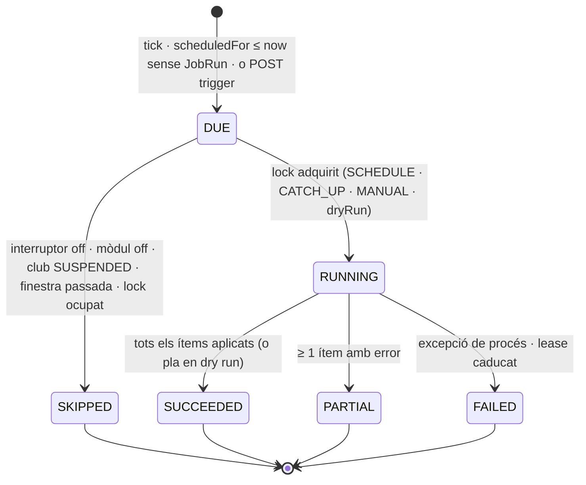

# S15 — Processos programats

**Etapa:** E5–E8 (el marc es lliura a E5; cada procés es lliura amb el seu vertical — aquesta spec és el marc comú **i** la regla exacta de cada procés) · **Mòduls:** per procés (§9) · **Pantalles:** D1 (targeta «Revisió de classes en risc»), D11 (targeta «Processos automàtics» — assumpció, §13), 10 (globus de risc) (fitxers a `03-disseny/mockups/pantalles/`) · **Model:** v1.6 §B (CLASSE «en risc», estat Anul·lada), §C (INSCRIPCIO_CLASSE, ASSISTENCIA «no presentat», LLISTA_ESPERA, RESERVA_ENTRENAMENT), §A (PERIODE_INACTIVITAT, SOL_LICITUD_BAIXA, CONSUM_PACK), PREFERENCIA_AVIS (recordatori) + PLATAFORMA §2 (`CLUB.timeZone`), §6 (outbox) · **Estat:** esborrany (03-09-2026) · **v1.0**

## 1. Propòsit i abast

Defineix **com** s'executa qualsevol procés automàtic del producte (principi 0.3.7, «control manual absolut»: interruptor, hora local del club, idempotència, traça, simulació, execució manual, marxa enrere) i **què** fa exactament cadascun dels deu processos de R1: obertura d'inscripcions, revisió de classes en risc, avisos de no presentats, recordatoris, venciments, llista d'espera per torns, caducitat de pagaments pendents, finalització de classes, neteja i recordatori de remesa. Els processos no contenen regles de negoci pròpies: criden els casos d'ús dels verticals propietaris (S06, S08, S09, S10, S12, S13, S16) i deixen constància del que han fet.

Fora d'abast (on viu): les transaccions d'anul·lació de classe (S06 R-06-10) · alliberament de plaça, `offerNext` FIFO i `PAYMENT_PENDING` (S08) · comptador d'entrenaments (S09: calculat, res a reiniciar) · passar llista i marca «no presentat» (S10) · renderitzat i canals de les notificacions (S11) · packs, rebuts i remeses (S12) · inactivitat i baixa (S13) · tauler D1 (S14; aquí només el contracte de la targeta de risc) · consola de clubs (S17; aquí el contracte del quadre d'execucions) · **còpies de seguretat**: infraestructura (ADR-003: script setmanal `mongodump --oplog` + volums → S3), no són un procés de l'aplicació · **facturació**: a R1 no hi ha cap generació automàtica de rebuts ni de remeses (D6 és manual, S12); l'únic automatisme és el recordatori P10.

## 2. Pantalles i rutes

| Mockup | App | Ruta | Rol | Notes de comportament |
|---|---|---|---|---|
| D11 targeta «Processos automàtics» (assumpció: no és al mockup; s'afegeix sota «Club i pistes») | `apps/clubs-admin` | `/parametres#processos` | ADMIN | `GET /jobs`. Una fila per procés: nom localitzat · cadència en hora local («cada dia a les 7:30», «diumenge 20:00», «continu») · interruptor (`PUT /jobs/{name}/switch`, confirmació en desactivar: «Els efectes d'aquest procés deixaran d'aplicar-se fins que el tornis a activar.») · darrera execució («fa 2 h · correcta · 3 classes revisades», «fallida» en vermell) · [Simula] (`POST …/trigger {dryRun:true}` → modal amb el pla: ítems i acció prevista) · [Executa ara] (confirmació → `POST …/trigger {dryRun:false}` → toast amb el resum). Procés amb mòdul desactivat: fila absent. Interruptor off: fila atenuada, [Executa ara] segueix disponible (R-15-09). Carregant: esquelet; error: toast + reintent. |
| D1 targeta «Revisió de classes en risc — 7:30, avui i 2 dies vista · n avisos» | `apps/clubs-admin` | `/` (tauler, S14) | ADMIN | S14 munta la targeta amb `GET /risk-review` (§6). Files «{descripció} · {avui\|demà\|dc} {hora} · {pista} · {n} inscrits · {estat}» amb estat: «anul·lada» (+ «avisada {guia} + {gos}» si hi havia inscrits) · «en risc · avisats {guia} + {gos}» · «s'anul·larà {dia} a les {hora}» (0 inscrits o encara no avisada) · amb `classes.riskAutoCancelSameDay=false`: «el club decidirà». Clic a la fila → D4 amb la classe seleccionada. Sense classes en risc: «Cap classe en risc». |
| 10 globus de risc | `apps/clubs` | `/avui` | MEMBER | Definit a S06 R-06-13 (`RiskEvaluator`, `home:today.riskTooltip`). Aquesta spec fixa el `reviewAt` que hi surt: `classes.riskReviewTime` del **dia de la classe** en hora local; S15 garanteix que la revisió no actua abans d'aquell instant. |
| Consola S17 «Processos» (nova, sense mockup) | `apps/clubs-admin` (platform) | `/platform/jobs` | AGILITYHUB_ADMIN | `GET /platform/jobs/overview`: matriu club × procés amb la darrera execució, semàfor (verd: darrer èxit dins del període · groc: parcial · vermell: fallit o sense èxit en > 2 períodes) i [Executa] per club. |

## 3. Entitats i camps

Col·leccions pròpies (tècniques, amb `clubId`): `job_runs`, `job_locks`. El catàleg de processos (`JobCatalog`) viu al codi, no a la base de dades.

**`JobRun` · `job_runs`** — índex únic `{clubId, job, scheduledFor, trigger}`; índexs `{clubId, job, startedAt}`, `{finishedAt}` (retenció)

| Camp | Tipus | Oblig. | Validació · notes |
|---|---|---|---|
| `job` | enum `JobName` (§4 R-15-01) | sí | |
| `scheduledFor` | instant | sí | ocurrència que aquesta execució cobreix (R-15-02); en execució manual, l'instant de la petició truncat al minut |
| `scheduledForLocal`, `timeZone` | `YYYY-MM-DDTHH:mm`, IANA | sí | per a la UI i per a les proves de fus |
| `trigger` | `SCHEDULE` · `CATCH_UP` · `MANUAL` | sí | `MANUAL` porta `actorAccountId` |
| `dryRun` | bool | sí | R-15-08 |
| `status` | `RUNNING` · `SUCCEEDED` · `PARTIAL` · `FAILED` · `SKIPPED` | sí | §5 |
| `skipReason` | `DISABLED` · `MODULE_OFF` · `CLUB_INACTIVE` · `MISSED_WINDOW` · `LOCKED` · `NOT_DUE` | si SKIPPED | |
| `startedAt`, `finishedAt`, `durationMs` | instant, instant, int | sí | |
| `effects` | `{counters: {clau: n}, items: [{entityType, entityId, action, detail?}]}` | sí | `items` limitat a 500 (la resta només compta); en dry run = **pla** (què faria) |
| `errors[]` | `{entityId?, code, message, traceId}` | no | un per ítem fallit; l'excepció de job va a `errors[0]` amb `entityId=null` |
| `actorAccountId` | id | si MANUAL | auditat també a `audit_entries` (`JOB_TRIGGERED`) |
| `parametersSnapshot` | json | sí | valors dels paràmetres llegits (p. ex. `classes.minDogs=2`) — explica l'execució encara que després canviïn |

**`JobLock` · `job_locks`** — `_id = "{clubId}:{job}"` (o `"tick"`), `holder` (instància + fil), `acquiredAt`, `expiresAt` (índex TTL). R-15-06.

**Camps que aquest vertical afegeix a agregats d'altres specs** (propostes a §13, un camp per marca d'idempotència):

| Agregat (spec) | Camp | Ús |
|---|---|---|
| `Week` (S06) | `openedAt`, `openingNotifiedAt` | P1: obertura i N-33 un sol cop per setmana |
| `ClassSession` (S06) | `risk {lastReviewAt, notifiedBookingIds[], adminNotifiedAt}`, `finishedAt` | P2: N-16 un cop per destinatari; D1; P8 |
| `Booking`, `TrainingBooking` (S08/S09) | `reminderSentAt` | P4 |
| `Attendance` (S10) | `noticeSentAt` | P3 |
| `PackBalance` (S12) | `expiryWarnedAt`, `expiredAt`, `state` (`ACTIVE` · `EXPIRED`) | P5a |
| `InactivityPeriod` (S13) | `state` (`REQUESTED` · `APPROVED` · `ACTIVE` · `FINISHED` · `DENIED`), `startedAt`, `finishedAt` | P5b |
| `Member` (S03/S13) | `leaveDate`, `leftAt` | P5c |
| `DogDocument` (S03) | `lastReminderAt` | P5e (compartit amb el recordatori manual) |
| `RingSetup` (S16) | `expiresAt` | P5f |
| `Club` | `usage.smsMonthKey` | P5g |

## 4. Regles de negoci

### Marc comú

**R-15-01 · Catàleg i tick.** Un `@Scheduled(cron="0 * * * * *")` (segon 0 de cada minut) executa `SchedulerTick.run(now)` amb `now = clock.instant()` truncat al minut. Per a cada club amb `status ∈ {ACTIVE, ONBOARDING}` i per a cada procés del catàleg, en aquest ordre fix, decideix si és degut (R-15-02/05) i l'executa (R-15-03…07). R1 és seqüencial; si el tick dura més d'un minut el següent s'omet (lock `tick`, R-15-06) i puja la mètrica `jobs.tick.overrun`.

| Procés (id de ruta) | `JobName` | Cadència | Hora (paràmetre) | Mòdul | Etapa | Catch-up (R-15-05) |
|---|---|---|---|---|---|---|
| `week-opening` | `WEEK_OPENING` | setmanal | `bookings.weekOpensAt` | — (`FREE_TRAINING` per al reinici) | E5 | fins a 24 h |
| `risk-review` | `RISK_REVIEW` | diari | `classes.riskReviewTime` | — | E5 | fins a la fi del dia local |
| `no-show-notices` | `NO_SHOW_NOTICES` | diari | `messaging.noShowNoticeTime` | — | E6 | sense límit |
| `reminders` | `REMINDERS` | cada minut | — | — (`FREE_TRAINING` per als entrenaments) | E5 | continu |
| `expirations` | `EXPIRATIONS` | diari | `jobs.dailyTime` | per pas (§9) | E3 (altes, documents) · E8 (packs, inactivitat, baixes) · E9 (muntatges) | sense límit |
| `waitlist-fifo` | `WAITLIST_FIFO` | cada minut | — | `WAITLIST` + `waitlist.mode=FIFO` | E5 | continu |
| `payment-timeouts` | `PAYMENT_TIMEOUTS` | cada minut | — | `SINGLE_CLASS` | E8 | continu |
| `class-finishing` | `CLASS_FINISHING` | cada minut | — | — | E5 | continu |
| `cleanup` | `CLEANUP` | diari | `jobs.dailyTime` | — | E5 | sense límit |
| `billing-reminder` | `BILLING_REMINDER` | mensual (dia `billing.remittanceReminderDay`) | `jobs.dailyTime` | `BILLING` | E8 | fins a la fi del mes |

Cada procés implementa `Job { plan(ctx): List<Item>; apply(ctx, item): Effect }` (R-15-08) i declara mòdul, cadència, política de catch-up i clau de l'interruptor.

**R-15-02 · Hora local, ocurrències i canvi d'hora.** Tot es guarda i es compara en instants UTC; l'hora local només serveix per calcular **ocurrències**: `occurrence(date, time) = ZonedDateTime.of(date, time, club.timeZone).toInstant()` amb la semàntica de Java (hora inexistent → es desplaça endavant; hora ambigua → **primera** ocurrència), idèntica a S06 R-06-14. Un procés diari és degut quan `occurrence(avui local, hora) ≤ now` i no existeix cap `JobRun` no-dry-run amb aquest `scheduledFor` (índex únic); un de setmanal, idem amb l'última data local ≤ avui que té el `dayOfWeek` del paràmetre; un de continu té `scheduledFor = now`. Paràmetres: `club.timeZone` (Cànic `Europe/Madrid`), `classes.riskReviewTime = 07:30`, `bookings.weekOpensAt = {SUNDAY, 20:00}`. *Exemples:* revisió de dl 05-10-2026 → Madrid `05:30Z`, `America/Argentina/Buenos_Aires` `10:30Z`; obertura dg 04-10 → `18:00Z` a Madrid i `23:00Z` a Buenos Aires; dg 25-10-2026 (tornada a CET a les 03:00: 02:00–03:00 passa dos cops) un procés a les 02:30 té `scheduledFor = 00:30Z` (primera ocurrència, CEST) i **no** torna a ser degut a `01:30Z` perquè l'ocurrència de la data és la mateixa; obertura d'aquell diumenge → 20:00 CET = `19:00Z` (la setmana de reserva dura 169 h, S08 R-08-01); dg 29-03-2026 (salt a CEST) un procés a les 02:30 s'executa a les 03:30 CEST = `01:30Z`, un sol cop; `jobs.dailyTime = 06:00` del 25-10 és `05:00Z` i el 24-10 era `04:00Z`. Els processos continus no fan cap càlcul local.

**R-15-03 · Interruptor, mòdul i estat del club.** Abans d'executar: `jobs.<nom>.enabled` (paràmetre per club, R-15-09 per al manual) → si `false`, `SKIPPED{DISABLED}` (es registra igualment, un cop per ocurrència; els continus: un registre per hora, no per minut); mòdul del procés (o del pas) inactiu → `SKIPPED{MODULE_OFF}` (i el pas s'omet dins d'un procés multi-pas); club `SUSPENDED` → `SKIPPED{CLUB_INACTIVE}`. Els processos consulten la configuració via `ClubConfig` (cache 60 s invalidada per `ParameterChanged`/`ClubModulesChanged`), mai un valor constant.

**R-15-04 · Idempotència a dos nivells.** (1) **Execució**: índex únic `{clubId, job, scheduledFor, trigger}` → una ocurrència no s'executa dos cops encara que hi hagi dues instàncies. (2) **Efecte**: cada ítem té una **marca** que la consulta d'abast exclou (`reminderSentAt`, `noticeSentAt`, `risk.notifiedBookingIds`, l'estat de l'agregat…), escrita **en la mateixa transacció** que l'efecte i l'esdeveniment de l'outbox. Executar dos cops el mateix procés (manual després del programat, dues instàncies, reintent després d'un error) produeix zero efectes nous. Les notificacions hi afegeixen la idempotència del dispatcher (una per `eventId`, destinatari i canal). *Exemple:* la revisió de les 7:30 anul·la la classe c1; l'admin prem [Executa ara] a les 7:40 → c1 ja és `CANCELLED`: no és a l'abast, cap N-08a nou.

**R-15-05 · Execucions perdudes (servidor aturat).** El tick només mira **l'última** ocurrència ≤ `now` (les anteriors perdudes no s'enumeren). Si `now − scheduledFor ≤ 2 min` → `trigger=SCHEDULE`; si és més gran però dins la finestra del catàleg (R-15-01) → s'executa amb `trigger=CATCH_UP`; fora de finestra → `SKIPPED{MISSED_WINDOW}` + alerta (R-15-10). Les finestres «sense límit» són possibles perquè la consulta d'abast és **per estat** (tot el pendent es tracta en una sola execució tardana). *Exemples:* servidor aturat de 7:00 a 9:00 → la revisió s'executa a les 9:00 (`CATCH_UP`) i anul·la les classes d'avui encara no començades (les començades es compten a `skippedStarted`); aturat de dg 18:00 a dl 22:00 → l'obertura ja no s'executa (> 24 h; `MISSED_WINDOW`), sense cap efecte de negoci perdut perquè R-08-01 és una funció del temps, només l'N-33; aturat 3 dies → «venciments» executa un sol cop i tracta els tres dies de packs, inactivitats i baixes.

**R-15-06 · Bloqueig distribuït.** `job_locks` amb `findOneAndUpdate({_id, $or: [{expiresAt: {$lt: now}}, {_id: {$exists: false}}]}, {holder, acquiredAt, expiresAt: now + 300 s}, upsert)`; `DuplicateKey` → `SKIPPED{LOCKED}` (o `409 JOB_ALREADY_RUNNING` en manual). El lease es renova cada 60 s mentre el procés corre; si el procés mor, caduca sol. El lock del tick (`_id: "tick"`, 55 s) garanteix un sol tick actiu encara que hi hagi més d'una instància (R1: una).

**R-15-07 · Traça.** Tota execució (també les `SKIPPED` i els dry run) deixa un `JobRun` i, en acabar les no-dry-run, un `SchedulerRun{job, clubId, runId, scheduledFor, trigger, status, startedAt, finishedAt, effects.counters, errorCount}` a l'outbox (§7). Els ítems tractats queden a `effects.items` amb `entityId` per poder desfer a mà (R-15-21). Logs estructurats amb `jobRunId`, `job`, `clubId`; Sentry rep `FAILED`/`PARTIAL`.

**R-15-08 · Dry run (pla → aplicació).** Cada procés separa `plan(ctx)` (només lectura: retorna els ítems i l'acció prevista, amb els mateixos paràmetres i el mateix `Clock`) d'`apply(ctx, item)`. En `dryRun=true` només s'executa `plan`, es retorna com a `effects.items` amb `action` prefixat `WOULD_` i **no s'escriu res** (ni outbox, ni S3, ni proveïdors); el `JobRun` sí que es desa (`dryRun=true`). Un test verifica per a cada procés que el pla coincideix amb els efectes reals sobre les mateixes dades.

**R-15-09 · Execució manual.** `POST /jobs/{name}/trigger` (ADMIN del club o plataforma via `/platform/clubs/{clubId}/jobs/{name}/trigger`): usa el mateix lock, el mateix codi i `scheduledFor = now`; s'executa **encara que l'interruptor sigui off** (l'interruptor atura el calendari, no l'admin — principi 0.3.7); mòdul off → `404 MODULE_DISABLED`. Síncrona (els conjunts són de mida de club) amb resposta 200 `JobRun`; `AuditEntry{action: JOB_TRIGGERED, entityType: JobRun, after: {job, dryRun, status, counters}}`. Un token d'impersonació → `403`. `PUT /jobs/{name}/switch {enabled}` escriu el paràmetre `jobs.<nom>.enabled` via S02 (`ParameterChanged`, auditat, cache invalidada).

**R-15-10 · Errors i alertes.** Cada ítem s'aplica en la **seva** transacció Mongo (amb l'outbox); un ítem que falla es registra a `errors[]` i el procés continua (`PARTIAL`). Excepcions: P1 (una sola transacció) i cada anul·lació de classe de P2 (transacció de S06 R-06-10). Excepció fora d'ítem → `FAILED`. Alertes: Sentry sempre; N-42 (proposta) als ADMINS del club si `FAILED` o `MISSED_WINDOW` i `jobs.alertAdminsOnFailure=true`, **com a màxim una per procés i dia local**; el quadre S17 marca en vermell qualsevol procés sense `SUCCEEDED` en més de dos períodes. Mètriques Micrometer: `jobs.run.duration{job,status}`, `jobs.effects{job,key}`, `jobs.last_success_age_seconds{job,club}`, `jobs.tick.overrun`.

### Processos

**R-15-11 · P1 `week-opening`.**

| | |
|---|---|
| Disparador | ocurrència de `bookings.weekOpensAt` (`{SUNDAY, 20:00}`) en hora local: `opensAt` |
| Abast | el club; `openedWeekKey` = data local d'`opensAt + 7 dies` (setmana de reserva que passa a `W1`, S08 R-08-01); `targetWeek` = `Week` (get-or-create) de la setmana ISO que conté `openedWeekKey + 1 dia` |
| Regla | **cap escriptura de negoci**: `W0`/`W1` són funcions del temps (S08) i el comptador d'entrenaments es calcula per setmana de sessió (S09 R-09-05). El procés: (1) invalida la cache de configuració i de graelles del club; (2) escalfa la cache base de `GET /me/bookable-classes` (classes `ACTIVE` de `W0`…`W2` amb `counters`, sense estat per gos — contracte amb S08; TTL 30 s); (3) `targetWeek.openedAt = opensAt`; (4) esdeveniments. Si `messaging.notifyWeekOpening=true` **i** `targetWeek` té ≥ 1 classe `ACTIVE` → N-33 i `openingNotifiedAt`; si encara no té classes actives (setmana no validada) l'avís queda **diferit**: el consumidor de `WeekValidated` (S06) l'envia si `now ≥ Week.openedAt` i `openingNotifiedAt == null`. |
| Efectes | `counters {weekKey, activeClasses, notified: 0\|membres}` |
| Esdeveniments | `WeekOpened{openedWeekKey, isoWeekStart, currentWeekKey, opensAt, notified}` · `TrainingCounterReset{weekStart: opensAt}` (només amb `FREE_TRAINING`; S09 només invalida cache) |
| Notificacions | N-33 «Ja pots reservar la setmana vinent» (`week_start` = `isoWeekStart` formatat: «setmana del 12 d'octubre»), MEMBER → APP+PUSH, a tots els abonats `ACTIVE` amb algun gos `ACTIVE` |
| Idempotència | `JobRun` per ocurrència + `Week.openedAt`/`openingNotifiedAt` |
| Dry run | `WOULD_OPEN {weekKey, activeClasses, recipients}` |
| Marxa enrere | res a desfer (cap estat de negoci); un N-33 enviat per error no es retira |
| Guarda de mòdul | cap; `TrainingCounterReset` només amb `FREE_TRAINING` |
| Pic de càrrega | el pic el reben `POST /seat-holds` (S08 T-08-41); el procés hi afegeix el fan-out de N-33: el dispatcher escriu el feed en lots (`insertMany` de 500) i el push en lots de 100 amb un pool propi que no comparteix fils amb l'API; k6 T-15-30 |
| Exemple | dg 04-10-2026 20:00 Madrid: `opensAt=18:00Z`, `openedWeekKey=2026-10-11`, `isoWeekStart=2026-10-12`; 184 abonats reben «Ja pots reservar la setmana del 12 d'octubre» si la setmana està validada; si l'admin la valida dilluns a les 9:00, N-33 surt llavors |
| Tests | T-15-11, T-15-12, T-15-30 |

**R-15-12 · P2 `risk-review`.**

| | |
|---|---|
| Disparador | `classes.riskReviewTime` (07:30) diari, hora local; `today` = data local |
| Abast | `ClassSession` `ACTIVE` amb `date ∈ [today, today + classes.riskLookaheadDays]` (2), `riskExempt=false`, `countedDogs < classes.minDogs` (2). **`countedDogs`** = reserves `ACTIVE` + `PAYMENT_PENDING` de la classe (= `counters.booked` de S06, que S08 manté amb aquesta definició; el procés **recompta** dins la transacció, no confia en el desnormalitzat). Índex `{clubId, date, state}` (`ClassSessionRepository.findActiveBetween`). |
| Regla | Per a cada classe: **(a)** `date == today` i `classes.riskAutoCancelSameDay=true`: si `startsAt ≤ now` → `skippedStarted` (execució tardana; la classe es fa); si no → `ClassCancellationUseCase.cancel(classId, reason=RISK_REVIEW, adminText=messages.scheduling.autoCancel.text)` (S06 R-06-10: reserves → `CANCELLED_BY_CLUB`, espera → `CANCELLED{CLASS_CANCELLED}`, packs retornats, holds esborrats, `counters` a 0) + `ClassAutoCancelled`. **(b)** `date > today`, o `date == today` amb `riskAutoCancelSameDay=false`: `ClassAtRisk` → N-16 a cada inscrit (`Booking.memberId`) que **no** sigui a `risk.notifiedBookingIds` (un avís per reserva, mai repetit els dies següents) i als ADMINS si `risk.adminNotifiedAt == null`; s'actualitza `risk`. La marca `atRisk` de les graelles no es persisteix (S06 `RiskEvaluator`). |
| Efectes | `counters {reviewed, cancelled, cancelledSilent (0 inscrits), atRisk, notifiedMembers, exempt, skippedStarted}`; `items` per classe |
| Esdeveniments | `ClassCancelledByClub{reason: RISK_REVIEW}` (dins la transacció de S06) + `ClassAutoCancelled{classId, dogsCount, affected[], waitlistIds[], adminText}` · `ClassAtRisk{classId, dogsCount, reviewAt, newBookingIds[], notifyAdmins}` |
| Notificacions | **N-17** a ADMINS + INSTRUCTORS de la classe (APP+EMAIL) a tota anul·lació, **també amb 0 inscrits** (decisió: l'instructor ha de saber que no ve ningú; `dogs_count=0`); **N-08a** als inscrits afectats (APP+EMAIL+SMS) amb `admin_text` = text automàtic en l'idioma del destinatari — la classe amb 0 inscrits no en genera cap (silenci cap als alumnes); **N-16** «Possible anul·lació» als inscrits nous i als ADMINS (APP) amb `review_time`, `review_day` (= dia de la classe), `auto_cancel` (bool, per a l'ICU de la plantilla) |
| Idempotència | estat de la classe (`CANCELLED`) · `risk.notifiedBookingIds[]` · `risk.adminNotifiedAt` |
| Dry run | `WOULD_CANCEL {classId, dogsCount, affected}` · `WOULD_NOTIFY {classId, newBookingIds}` |
| Marxa enrere | S06 no té `CANCELLED → ACTIVE`: l'admin crea la classe de nou ([Crear classe], D4), avisa i, si cal, reserva «com l'abonat» (auditat); per evitar-ho, `riskExempt` a la classe abans de les 7:30 (S06 `POST …/risk-exemption`) |
| Guarda de mòdul | cap (`WAITLIST` off → `waitlistIds` buit; `SMS` off → canal omès) |
| Exemple | dl 05-10 07:30, `minDogs=2`, lookahead 2: c1 dl 9:30 Cadells 0 inscrits → anul·lada, N-17 a admins+Núria, cap N-08a; c2 dl 17:40 Petita 1 inscrit (Laura + Duna) → anul·lada, N-17 + N-08a a Laura amb SMS; c3 dt 20:00 Carretera 1 inscrit (Pau + Blat) → N-16 a Pau i admins, `risk.notifiedBookingIds=[b3]`; c4 dc 9:30 Cadells 0 inscrits → N-16 només a admins; dt 06-10 07:30: c3 segueix amb 1 → cap N-16 nou a Pau (ja avisat); dc 07-10 07:30: c3 anul·lada si ningú s'hi ha apuntat; c4 anul·lada en silenci |
| Tests | T-15-13, T-15-14, T-15-15 |

**R-15-12b · Avís immediat de classe sota mínim** (Josep 08-09). La **revisió** (anul·lar, avisar els alumnes) segueix sent només el procés de les 7:30: cap anul·lació automàtica fora d'hora. Però un consumidor de `BookingCancelled{late: false}` (i de `WaitlistExpired` que deixi la classe igual) comprova, dins la mateixa transacció, si la classe és `ACTIVE`, futura, `riskExempt = false` i `countedDogs < classes.minDogs`; si és així emet `ClassBelowMinimum{classSessionId, countedDogs}` → **N-54** als **INSTRUCTORS de la classe i als ADMINS** (APP+EMAIL), i **res més**: els alumnes no reben cap avís i la classe no es toca. Idempotència: `risk.lowAlertSentAt` a la `ClassSession`, que es **neteja** quan `countedDogs` torna a arribar a `minDogs` (així una segona baixada torna a avisar). Amb `date == today` i `startsAt ≤ now` no s'envia res. *Exemple:* classe de dijous a les 18:50 amb 2 inscrits; dimecres a les 10:00 la Laura anul·la dins termini → queda 1 → N-54 a l'Estel (instructora) i als admins; a les 7:30 de dijous, la revisió decidirà segons `riskAutoCancelSameDay`.

Decisió (§13, actualitzada 08-09): no hi ha **revisió** immediata quan un alumne anul·la (spec v1.6 F8 pas 6) — només l'**avís** de R-15-12b; l'acció continua a l'hora de revisió, com diuen el model i el globus de la pantalla 10 («com a màxim a les 7:30 de {dia}»).

**R-15-13 · P3 `no-show-notices`.**

| | |
|---|---|
| Disparador | `messaging.noShowNoticeTime` (08:00) diari, hora local |
| Abast | `Attendance` amb `state=NO_SHOW`, `noticeSentAt == null` i data local de la classe `< today` (índex `{clubId, state, noticeSentAt}`) — inclou marques posades tard (un instructor que passa llista dos dies després) |
| Regla | un sol lot: `NoShowNoticeDue{attendanceIds[], bookingIds[]}` en una transacció que fixa `noticeSentAt=now` a tots; el dispatcher envia N-19 per reserva. Una marca canviada a `PRESENT`/`NOTIFIED` abans del lot no s'avisa; canviar-la després no retira res. |
| Efectes | `counters {notices, late (classes de fa > 1 dia)}` |
| Esdeveniments | `NoShowNoticeDue` |
| Notificacions | N-19 «T'hem trobat a faltar» MEMBER (propietari del gos) → APP+EMAIL segons preferències, `dog_name`, `class_date` |
| Idempotència | `Attendance.noticeSentAt` |
| Dry run | `WOULD_NOTIFY {attendanceId, memberId, dogName, classDate}` |
| Marxa enrere | cap (no s'envia res que no fos una marca manual de l'instructor); un avís erroni es corregeix amb un comunicat |
| Guarda de mòdul | cap (canals segons S11) |
| Exemple | dl 05-10 20:00 Estel marca «no presentat» Marc + Chun-li; dt 06-10 08:00 → N-19 a Marc; si Estel el canvia a «ha avisat» a les 22:00 del dilluns, res |
| Tests | T-15-16 |

**R-15-14 · P4 `reminders`.**

| | |
|---|---|
| Disparador | cada minut |
| Abast | `maxLead = max(messaging.reminderOptionsMinutes)` (1440); `Booking` `ACTIVE` i `TrainingBooking` `ACTIVE` amb `startsAt ∈ (now, now + maxLead]` i `reminderSentAt == null` (índexs `{clubId, state, classStartsAt}` / `{clubId, state, startsAt}`), unides amb `Member.notificationPreferences.reminderMinutesBefore` (`lead`, `null` = mai) del **propietari del gos** (`memberId`) |
| Regla | degut si `lead != null ∧ startsAt − lead ≤ now < startsAt ∧ bookedAt ≤ startsAt − lead` (una reserva feta després del moment del recordatori **no** en rep: N-04/N-06 ja l'ha confirmada). Aritmètica d'instants: immune al canvi d'hora. Es fixa `reminderSentAt` i s'emet `ReminderDue` en la mateixa transacció. Reserva anul·lada o classe anul·lada (`CANCELLED_BY_CLUB`) → fora de l'abast per estat. Canvi de preferència: s'aplica al següent tick (pot fer que un recordatori surti «tard» però sempre abans de l'inici). |
| Efectes | `counters {classReminders, trainingReminders}` |
| Esdeveniments | `ReminderDue{bookingId? \| trainingBookingId?, memberId, dogId, startsAt}` |
| Notificacions | N-13 MEMBER → APP+PUSH (+EMAIL segons preferència), `dog_name`, `date`, `time`, `ring_name`, acció `OPEN_BOOKING` |
| Idempotència | `reminderSentAt` |
| Dry run | `WOULD_REMIND {bookingId, memberId, startsAt, lead}` |
| Marxa enrere | cap |
| Guarda de mòdul | entrenaments només amb `FREE_TRAINING`; `PUSH` off → canal omès |
| Exemple | Laura tria 2 h; classe dj 18:50 reservada dl → recordatori al tick de les 16:50 (`16:50 ≤ now`); Rock reservat a les 17:30 per a les 18:50 → cap; Laura canvia a 24 h el dj a les 10:00 → el recordatori surt al tick de les 10:00 (degut i encara futura) |
| Tests | T-15-17, T-15-18 |

**R-15-15 · P5 `expirations`** (diari a `jobs.dailyTime`, 06:00 local; cada pas és independent, amb el seu mòdul i el seu comptador; `today` = data local, `month = YearMonth(today)`).

| Pas | Abast i regla | Esdeveniment → notificació | Idempotència |
|---|---|---|---|
| a · packs (`PACKS`) | `PackBalance` `ACTIVE`: `expiresOn ≤ today + billing.packExpiryWarningDays` (14) ∧ `expiryWarnedAt == null` → avís; `expiresOn < today` → `state=EXPIRED`, `expiredAt`; les sessions restants es perden (S12 les mostra com a caducades) | `PackExpiring` → N-11b · `PackExpired` → N-11b; la «baixa prevista automàtica» (BR-13) la fa **S13** com a consumidor de `PackExpired` (`leaveDate = expiresOn + leave.packExpiryGraceDays`, S13 R-13-14, N-28) — S15 només marca i emet | `expiryWarnedAt`, `state` |
| b · inactivitat (`INACTIVITY`) | `InactivityPeriod` `APPROVED` amb `fromMonth ≤ month` → `ACTIVE` (`startedAt`); `ACTIVE` amb `toMonth != null ∧ toMonth < month` → `FINISHED` (`finishedAt`); `toMonth == null` («encara no ho sé») mai acaba sol (S13). Les reserves dins l'interval ja les va anul·lar S13 en aprovar. | `InactivityStarted` (cap avís; N-18b es va enviar en aprovar) · `InactivityEnded` → N-18c | estat |
| c · baixes | `Member` `ACTIVE` amb `leaveDate < today` (el dia de la baixa encara opera, BR-07; S03: «baixa 31/08 → l'1/09») → `status=LEFT`, `leftAt`; **en la mateixa transacció** crida `BookingCancellationService.cancelFutureByMember(memberId, by=SYSTEM, reason=LEAVE)` (S08) i `TrainingBookingService.cancelFutureByMember(memberId, SYSTEM, MEMBER_LEFT)` (S09) per a les sessions amb `startsAt >` fi del dia local de `leaveDate`, i `WaitlistService.cancelByMember(memberId, MEMBER_LEFT)` (motiu proposat, §13); `Membership` → `SUSPENDED` i gossos → `INACTIVE` ho fan S01/S03 com a consumidors de `MemberStatusChanged` | `MemberStatusChanged{ACTIVE→LEFT, effectiveDate=leaveDate}`; cap avís nou (N-28 es va enviar en confirmar la data) | estat |
| d · altes pendents | `Member` `PENDING` amb `signup.submittedAt` d'antiguitat `> signup.pendingExpiryDays` (30) en dies locals; si n ≥ 1 → **un** esdeveniment per club i dia; si ja hi ha una execució `SUCCEEDED` no-dry-run d'avui (execució manual repetida) → `alreadyDone` | `SignupPendingAging{count, oldestDays, memberIds[]}` → N-34 ADMINS → APP | execució del dia |
| e · documents | només si `messaging.documentReminderDays > 0` (Cànic 0 = mai): `DogDocument` `PENDING` de gos i abonat `ACTIVE` amb `(lastReminderAt ?? createdAt) + days ≤ today` → `lastReminderAt = now` (el mateix camp que limita el recordatori manual de S03 R-03-16) | `DocumentReminderDue{dogId, type}` → N-23 | `lastReminderAt` |
| f · muntatges (`COURSES`) | `RingSetup` `ACTIVE` amb `expiresAt ≤ now` (`builtAt + courses.setupAutoExpireDays`, el fixa S16) → `EXPIRED`; `Ring.activeSetupId = null` si apuntava a aquest | `RingSetupChanged{ringId, setupId, status: EXPIRED}` (N-31 no aplica) | estat |
| g · comptador SMS | si `Club.usage.smsMonthKey != month` → `smsSentMonth = 0`, `smsMonthKey = month` (S11 pot preferir comptar per clau de mes: llavors el pas desapareix, §13) | — | `smsMonthKey` |

Dry run: `WOULD_EXPIRE_PACK`, `WOULD_WARN_PACK`, `WOULD_START_INACTIVITY`, `WOULD_END_INACTIVITY`, `WOULD_LEAVE {memberId, futureBookings}`, `WOULD_REMIND_SIGNUPS {count}`, `WOULD_REMIND_DOCUMENT`, `WOULD_EXPIRE_SETUP`. Marxa enrere: baixa → reactivació des de D10 (S13, `LEFT → ACTIVE`, les reserves anul·lades no es recuperen); inactivitat → l'admin edita el període (S13); pack → S12 pot reobrir-lo amb un moviment d'ajust auditat; muntatge → l'instructor el torna a registrar (S16). *Exemple:* 01-11-2026 06:00: la inactivitat 11/2026–12/2026 de l'Eva passa a `ACTIVE`; el Pack 6 de Bruc (caduca 31-10) passa a `EXPIRED` i S13 li fixa `leaveDate = 30-11` (31-10 + 30 dies de gràcia) → l'01-12 el pas c el dona de baixa si no ha comprat cap pack nou; la Montse amb `leaveDate=31-10` passa a `LEFT` l'01-11 i les seves reserves del 3 i el 5 de novembre queden `CANCELLED`. Tests T-15-19…T-15-23.

**R-15-16 · P6 `waitlist-fifo`.** Cada minut si `WAITLIST` i `waitlist.mode=FIFO`: `WaitlistEntry` `NOTIFIED` amb `confirmBy ≤ now` → `EXPIRED` + `WaitlistExpired{entryId, classId}` (transacció per entrada); S08 (`offerNext`, consumidor idempotent) avisa la següent si queden places i temps (`minutesBefore > waitlist.notifyThresholdMinutes`). Idempotència: estat. Dry run: `WOULD_EXPIRE {entryId, position}`. Marxa enrere: cap (l'abonat pot tornar a apuntar-se). En mode `ALL_AT_ONCE` el procés es registra `SKIPPED{MODULE_OFF}` un cop per hora. *Exemple:* Pau notificat a les 15:00 amb `confirmBy=15:30`; tick de les 15:30 → `EXPIRED`, Anna rep N-15 fins a les 16:00. Tests T-15-24.

**R-15-17 · P7 `payment-timeouts`.** Cada minut amb `SINGLE_CLASS`: `Booking` `PAYMENT_PENDING` amb `bookedAt + bookings.paymentPendingMinutes` (30, proposta de S08) `≤ now` → `BookingCancellationService.cancel(bookingId, by=SYSTEM, reason=PAYMENT_TIMEOUT)` (S08: `CANCELLED`, `SeatReleased`, N-40 proposada). Un `UpfrontPaymentSucceeded` que arribi després troba la reserva `CANCELLED` → S12 reemborsa (regla de S12). Idempotència: estat. Dry run: `WOULD_CANCEL {bookingId, minutesPending}`. Marxa enrere: l'abonat torna a reservar. Tests T-15-25.

**R-15-18 · P8 `class-finishing`.** Cada minut, dos passos: **(a)** escombrada d'espera: `WaitlistEntry` `ACTIVE`/`NOTIFIED` de classes amb `startsAt ≤ now` → `CANCELLED{CLASS_STARTED}` en silenci (S08 R-08-16); **(b)** `ClassSession` `ACTIVE` amb `endsAt + classes.finishGraceMinutes` (15, proposta) `≤ now` → `FINISHED` (`finishedAt`) via `finishEnded(now)` de S06 (índex `{clubId, state, endsAt}`); a partir d'aquí només `notes` és editable i l'assistència/històric (S10) tracten la classe com a feta. Cap esdeveniment de negoci (només `SchedulerRun`); S09 i les graelles rellegeixen l'estat. Idempotència: estat. Dry run: `WOULD_FINISH {classId}`, `WOULD_SWEEP {entryId}`. Marxa enrere: cap (`FINISHED` és terminal a S06). *Exemple:* classe 18:50–19:50 → `FINISHED` al tick de les 20:05. Tests T-15-26.

**R-15-19 · P9 `cleanup`.** Diari a `jobs.dailyTime`; és l'**única** excepció a «res s'esborra físicament» (v1.6) i només sobre col·leccions **tècniques**:

| Objectiu | Regla | Comptador |
|---|---|---|
| `seat_holds`, `magic_link_tokens`, `idempotency_records`, `job_locks` | res a fer: els esborra l'índex TTL (`expiresAt`); el procés només **informa** dels documents caducats que el TTL encara no ha tret (retard de fins a 60 s) | `ttlPending.*` |
| fitxers d'alta orfes | claus `signup/{clubId}/…` a S3 amb `LastModified` de fa `> jobs.retention.orphanUploadsHours` (48) no referenciades per cap `DogDocument.files[].fileKey` → esborrades (S04 R-04-08) | `orphanUploadsDeleted` |
| exports | `export_jobs` acabats fa `> jobs.retention.exportFilesDays` (7) → fitxer esborrat de S3, registre marcat `PURGED` | `exportsPurged` |
| `domain_events` | `processedAt < now − jobs.retention.domainEventsDays` (90) → esborrats (l'auditoria funcional viu a `audit_entries`); els **no processats** no es toquen mai | `domainEventsDeleted` |
| `stripe_events` | `receivedAt < now − jobs.retention.stripeEventsDays` (400) → esborrats | `stripeEventsDeleted` |
| `job_runs` | `finishedAt < now − jobs.retention.jobRunsDays` (90) → esborrats, conservant sempre les 5 darreres execucions de cada procés | `jobRunsDeleted` |

Sense esdeveniments de negoci; dry run = recomptes `WOULD_DELETE`. Marxa enrere: cap (per això les retencions són llargues i els esborrats només afecten dades tècniques). Tests T-15-27.

**R-15-20 · P10 `billing-reminder`.** Amb `BILLING`, el dia `billing.remittanceReminderDay` (proposta, 22; `0` = mai) a `jobs.dailyTime`: si el club té proveïdor `SEPA_XML`, existeix ≥ 1 abonat `ACTIVE` amb `paymentMethod.type=SEPA_DD` i `nextInvoiceDate ≤` fi del mes, i **no** hi ha cap `Remittance` creada dins el mes amb estat ≠ `ROLLED_BACK` → `RemittanceReminderDue{period, pendingMembers}` → N-41 (proposta) als ADMINS. Un cop per mes (execució del dia); sense efectes de negoci; res a desfer. **Queda dit explícitament**: cap rebut ni remesa es genera sola a R1. *Exemple:* 22-10-2026 sense remesa d'octubre → «Encara no s'ha generat la remesa d'octubre (61 rebuts previstos)». Tests T-15-28.

**R-15-21 · Marxa enrere (general).** Cada `JobRun` conserva els `entityId` tractats; la fitxa d'execució (D11/S17) llista els ítems amb enllaç a l'entitat perquè l'admin pugui actuar a mà amb les eines normals (D4, D10, D6). Cap procés té «desfer» automàtic: la reversibilitat és l'interruptor (abans) i la simulació (abans), no un rollback (després).

**R-15-22 · Rellotge injectable.** Tot el marc i tots els processos reben `Clock` (`Clock.systemUTC()` en producció; `MutableClock` als tests) i cap crida a `Instant.now()`/`LocalDate.now()` sense `clock` passa la revisió (regla ArchUnit).

## 5. Estats i transicions



`DUE` és transitori (no es persisteix). Un `FAILED`/`PARTIAL` **no** es reintenta sol: el següent tick torna a avaluar l'ocurrència (que ja té `JobRun`) → només els continus i els d'estat es «reintenten» de manera natural a la següent ocurrència; els diaris esperen la de demà o un [Executa ara].

| Transició | Qui | Condició | Efectes | Esdeveniment |
|---|---|---|---|---|
| DUE → SKIPPED | tick | R-15-03/05/06 | `JobRun{SKIPPED, skipReason}` (continus: 1/h) | — (N-42 si `MISSED_WINDOW`) |
| DUE → RUNNING | tick · ADMIN | lock | `JobRun{RUNNING, parametersSnapshot}` | — |
| RUNNING → SUCCEEDED / PARTIAL | procés | R-15-10 | `effects`, `errors[]`, lock alliberat | `SchedulerRun` |
| RUNNING → FAILED | procés · lease | excepció | `errors[0]`, Sentry | `SchedulerRun`, N-42 |

## 6. API

Rutes de club (tenant del JWT); `{name}` = id de ruta de R-15-01 (`404 JOB_UNKNOWN` si no existeix). Tokens d'impersonació → `403` a totes.

| Mètode | Ruta | Rol(s) | Mòdul | I | Descripció | Cos/paràmetres clau | Respostes i errors |
|---|---|---|---|---|---|---|---|
| GET | `/jobs` | ADMIN | — | sí | targeta D11 | — | 200 `{items:[{name, jobName, module, enabled, schedule:{kind, localTime, dayOfWeek?, dayOfMonth?}, nextScheduledForLocal, lastRun:{runId, status, finishedAt, trigger, dryRun, counters}}]}` (processos de mòdul off: absents) |
| GET | `/jobs/{name}/runs` | ADMIN | del procés | sí | històric (llistat universal §4 de CONVENCIONS) | `filter=status:in:…`, `filter=scheduledFor:between:…`, `sort` | 200 llistat; 404 `JOB_UNKNOWN`/`MODULE_DISABLED` |
| GET | `/jobs/{name}/runs/{runId}` | ADMIN | del procés | sí | fitxa amb `effects.items`, `errors`, `parametersSnapshot` | — | 200; 404 |
| POST | `/jobs/{name}/trigger` | ADMIN | del procés | no | [Simula] / [Executa ara] (R-15-09) | `{dryRun: bool}` | 200 `JobRun`; 404 `MODULE_DISABLED`; 409 `JOB_ALREADY_RUNNING`; 403 impersonació |
| PUT | `/jobs/{name}/switch` | ADMIN | del procés | sí | interruptor → paràmetre `jobs.<nom>.enabled` | `{enabled: bool}` | 200 `{name, enabled}`; 404 |
| GET | `/risk-review` | ADMIN, INSTRUCTOR | — | sí | targeta D1 (S14 l'embed a `GET /dashboard`) | `?date=` (per defecte avui local) | 200 (forma A) |
| GET | `/platform/jobs/overview` | AGILITYHUB_ADMIN | — | sí | quadre S17 | `?clubId=&status=` | 200 `{clubs:[{clubId, name, timeZone, jobs:[{name, enabled, lastRun, health: OK\|WARN\|ALERT}]}]}` |
| POST | `/platform/clubs/{clubId}/jobs/{name}/trigger` | AGILITYHUB_ADMIN | del procés | no | execució des de la consola | `{dryRun}` | idem `/jobs/{name}/trigger` |

**Forma A — `GET /risk-review`** (`reviewTime`, `lookaheadDays`, `minDogs`, `autoCancelSameDay` dels paràmetres; `items` = classes `ACTIVE` en risc o `CANCELLED{RISK_REVIEW}` de l'interval, ordenades per `startsAt`):
```json
{ "date":"2026-08-10","reviewTime":"07:30","lookaheadDays":2,"minDogs":2,"autoCancelSameDay":true,
  "items":[
    {"classId":"c1","date":"2026-08-10","dayLabel":"TODAY","startTime":"09:30","displayDescription":"Cadells","ringName":"Cadells","bookedCount":0,"status":"AUTO_CANCELLED","cancelledAt":"2026-08-10T05:30:02Z","notified":[]},
    {"classId":"c2","date":"2026-08-10","dayLabel":"TODAY","startTime":"17:40","displayDescription":"Nivell D","ringName":"Petita","bookedCount":1,"status":"AUTO_CANCELLED","notified":[{"memberName":"Laura","dogName":"Duna"}]},
    {"classId":"c3","date":"2026-08-11","dayLabel":"TOMORROW","startTime":"20:00","displayDescription":"F i G","ringName":"Carretera","bookedCount":1,"status":"AT_RISK","reviewAt":"2026-08-11T05:30:00Z","notified":[{"memberName":"Pau","dogName":"Blat"}]},
    {"classId":"c4","date":"2026-08-12","dayLabel":"OTHER","startTime":"09:30","displayDescription":"Cadells","ringName":"Cadells","bookedCount":0,"status":"WILL_CANCEL","reviewAt":"2026-08-12T05:30:00Z","notified":[]} ] }
```
`status` ∈ `AUTO_CANCELLED` · `AT_RISK` (avisada) · `WILL_CANCEL` (0 inscrits o encara sense avís; amb `autoCancelSameDay=false` → `WILL_REVIEW`). `notified` es resol de `risk.notifiedBookingIds` (o de `cancellation.affectedBookings` si anul·lada).

Codis d'error propis: `JOB_UNKNOWN` (404) · `JOB_ALREADY_RUNNING` (409) · reutilitzats `MODULE_DISABLED` (404), `VALIDATION_ERROR` (400), `INVALID_FILTER` (400).

## 7. Esdeveniments

**Emesos** (outbox, mateixa transacció que l'efecte): `SchedulerRun{job, clubId, runId, scheduledFor, trigger, status, startedAt, finishedAt, counters, errorCount}` · `WeekOpened{openedWeekKey, isoWeekStart, currentWeekKey, opensAt, notified}` · `TrainingCounterReset{weekStart}` · `ClassAutoCancelled{classId, dogsCount, affected[], waitlistIds[], adminText}` (a més del `ClassCancelledByClub{reason: RISK_REVIEW}` que emet el cas d'ús de S06) · `ClassAtRisk{classId, dogsCount, reviewAt, newBookingIds[], notifyAdmins}` · `NoShowNoticeDue{attendanceIds[], bookingIds[]}` · `ReminderDue{bookingId?, trainingBookingId?, memberId, dogId, startsAt}` · `PackExpiring{packBalanceId, dogId, expiresOn}` · `PackExpired{packBalanceId, dogId, remaining}` · `InactivityStarted` / `InactivityEnded{periodId, memberId, from, to}` · `MemberStatusChanged{memberId, before: ACTIVE, after: LEFT, effectiveDate}` · `SignupPendingAging{count, oldestDays, memberIds[]}` · `DocumentReminderDue{dogId, type}` · `RingSetupChanged{ringId, setupId, status: EXPIRED}` · `WaitlistExpired{entryId, classId}` · **nous** (§13): `RemittanceReminderDue{period, pendingMembers}`, `JobFailed{job, runId, status, errorCount}`. Els emesos per serveis d'altres specs cridats des d'un procés (`BookingCancelled`, `SeatReleased`, `PackRefunded`, `TrainingCancelled`…) porten `origin=SYSTEM` i `actorAccountId=null` (manual: l'admin que ha premut [Executa ara]).

**Consumits**: `ParameterChanged{jobs.*, classes.*, bookings.weekOpensAt, messaging.noShowNoticeTime, jobs.dailyTime}` i `ClubModulesChanged` → invalidació de `ClubConfig` (les ocurrències es recalculen al següent tick: canviar la revisió de 07:30 a 08:00 a les 07:45 fa que s'executi a les 08:00 si la de 07:30 ja ha corregut; si no havia corregut, la de 07:30 queda «perduda» dins la finestra i s'executa al tick següent com a `CATCH_UP`) · `ClubStatusChanged{SUSPENDED}` → cap execució · `WeekValidated` → N-33 diferida (R-15-11; consumidor a S06 amb la condició d'aquí).

**Contractes que aquest vertical necessita**: S06 `ClassSessionRepository.findActiveBetween`, `ClassCancellationUseCase.cancel(RISK_REVIEW)`, `finishEnded(now)`, `RiskEvaluator`; S08 `BookingCancellationService.cancel(by=SYSTEM)`, `cancelFutureByMember`, `WaitlistService.offerNext`, `sweepStarted`, `cancelByMember`, cache base de classes reservables; S09 `TrainingBookingService.cancelFutureByMember`; S10 `Attendance` amb `noticeSentAt`; S12 `PackBalance` amb `expiresOn`; S13 `InactivityPeriod`, `Member.leaveDate`, consumidor de `PackExpired`; S16 `RingSetup.expiresAt`; S02 `ClubConfig` i escriptura de paràmetres; S11 dispatcher amb fan-out per lots.

## 8. Notificacions

| Codi | Procés · moment exacte | Destinataris i canals | Variables |
|---|---|---|---|
| N-33 «Ja pots reservar la setmana vinent» | P1 en obrir, o consumidor de `WeekValidated` si la setmana s'ha validat després d'obrir-se; només amb `messaging.notifyWeekOpening=true` | MEMBER `ACTIVE` amb gos actiu → APP+PUSH; acció `OPEN_BOOKING` | `week_start` |
| N-17 «Classe anul·lada per manca d'alumnes» | P2 (a), tota anul·lació (també 0 inscrits) | ADMINS + INSTRUCTORS de la classe → APP+EMAIL; acció `CHANGE_CLASS` (admin: obre D4) | `class_date`, `class_time`, `class_description`, `ring_name`, `dogs_count` |
| N-08a «Classe anul·lada pel club» | P2 (a), només si `affected ≠ ∅` | inscrits afectats → APP+EMAIL+SMS (`SMS` on); acció `CHANGE_CLASS` | `dog_name`, `class_date`, `class_time`, `class_description`, `ring_name`, `admin_text` = `scheduling.autoCancel.text` («No s'ha arribat al mínim de {minDogs} gossos») |
| N-16 «Possible anul·lació de classe» | P2 (b), un cop per reserva i un cop per classe als admins | inscrits nous → APP+EMAIL · ADMINS → APP; acció `CHANGE_CLASS` | `dog_name`, `class_date`, `class_time`, `review_time`, `review_day`, `auto_cancel` |
| N-19 «T'hem trobat a faltar» | P3, lot de `messaging.noShowNoticeTime` | MEMBER → APP+EMAIL (preferències) | `dog_name`, `class_date` |
| N-13 «Recordatori» | P4, al tick en què és degut | MEMBER → APP+PUSH (+EMAIL per preferència); acció `OPEN_BOOKING` | `dog_name`, `date`, `time`, `ring_name` |
| N-11b «Pack a punt de caducar / caducat» | P5a | MEMBER → APP+EMAIL; acció `OPEN_DOG` | `dog_name`, `pack_expiry`, `pack_remaining` |
| N-18c «Represa d'activitat» | P5b en acabar el període | MEMBER → APP | — |
| N-34 «Sol·licituds d'alta pendents des de fa dies» | P5d, diària mentre n'hi hagi | ADMINS → APP; acció `OPEN_SIGNUP` | `count`, `oldest_days` |
| N-23 «Cartilla pendent» | P5e | MEMBER → APP+EMAIL; acció `OPEN_DOG` | `dog_name`, `document_type` |
| N-41 «Remesa del mes pendent» (proposta) | P10 | ADMINS → APP+EMAIL; acció `OPEN_INVOICES` | `period`, `pending_count` |
| N-42 «Procés automàtic amb errors» (proposta) | R-15-10, màx. 1 per procés i dia | ADMINS → APP (+EMAIL); acció `OPEN_JOBS` (proposta: obre D11#processos) | `job_name`, `date`, `error_count` |

N-15 (P6, via `offerNext`) i N-40 (P7) les defineix S08; N-28 i la baixa prevista per pack, S13. Idioma: el de cada destinatari; dates amb el fus del club (`review_day` = «dimarts», `week_start` = «12 d'octubre»).

## 9. Paràmetres i mòduls

Llegeix: `club.timeZone` · `bookings.weekOpensAt` · `messaging.notifyWeekOpening` · `classes.riskReviewTime`, `classes.riskLookaheadDays`, `classes.minDogs`, `classes.riskAutoCancelSameDay` · `messaging.noShowNoticeTime` · `messaging.reminderOptionsMinutes` · `billing.packExpiryWarningDays` · `signup.pendingExpiryDays` · `messaging.documentReminderDays` · `courses.setupAutoExpireDays` · `waitlist.mode`, `waitlist.notifyThresholdMinutes` (via S08) · `bookings.paymentPendingMinutes` (proposta S08). **Nous** (§13, família `jobs.*`, bloc D11 «Processos automàtics»): `jobs.weekOpening.enabled`, `jobs.riskReview.enabled`, `jobs.noShowNotices.enabled`, `jobs.reminders.enabled`, `jobs.expirations.enabled`, `jobs.waitlistFifo.enabled`, `jobs.paymentTimeouts.enabled`, `jobs.classFinishing.enabled`, `jobs.cleanup.enabled`, `jobs.billingReminder.enabled` (bool, tots `true`) · `jobs.dailyTime` (time, 06:00) · `jobs.alertAdminsOnFailure` (bool, true) · `jobs.retention.domainEventsDays` (90), `jobs.retention.jobRunsDays` (90), `jobs.retention.stripeEventsDays` (400), `jobs.retention.exportFilesDays` (7), `jobs.retention.orphanUploadsHours` (48) (bloc sistema) · `classes.finishGraceMinutes` (15, bloc Classes) · `billing.remittanceReminderDay` (22, bloc Quotes i remesa). Constants de producte (no paràmetre): tick 1 min, lease 300 s, finestres de catch-up, 500 ítems a la traça, 5 execucions conservades, N-42 1/dia.

| Mòdul off | Efecte |
|---|---|
| `FREE_TRAINING` | P1 sense `TrainingCounterReset`; P4 sense recordatoris d'entrenament |
| `WAITLIST` (o mode `ALL_AT_ONCE`) | P6 `SKIPPED{MODULE_OFF}`; P2/P8 sense entrades d'espera |
| `SINGLE_CLASS` | P7 `SKIPPED{MODULE_OFF}` |
| `PACKS` · `INACTIVITY` · `COURSES` | passos a · b · f de P5 omesos |
| `BILLING` | P10 `SKIPPED{MODULE_OFF}`; P5a/P5c sense efectes de facturació |
| `SMS` · `PUSH` | només canals (S11) |
| `levels.enabled=false` | cap efecte (el risc compta gossos, no nivells) |

## 10. i18n i localització

- Front: namespace `admin-settings:jobs.*` (títol «Processos automàtics», `jobs.name.{jobName}` — «Obertura d'inscripcions», «Revisió de classes en risc», «Avisos de no presentats», «Recordatoris», «Venciments», «Llista d'espera per torns», «Pagaments pendents», «Finalització de classes», «Neteja», «Recordatori de remesa» —, `jobs.schedule.daily` «cada dia a les {time}», `jobs.schedule.weekly` «{day} a les {time}», `jobs.schedule.continuous` «continu», `jobs.lastRun.*`, `jobs.confirmDisable`, `jobs.dryRunTitle` «Simulació: què faria ara»), `enums:jobStatus.*`, `enums:jobSkipReason.*`, `enums:jobAction.*` (accions `WOULD_*`/`*`), `admin-dashboard:risk.*` (D1: «anul·lada», «en risc · avisats {names}», «s'anul·larà {day} a les {time}», «el club decidirà», «Cap classe en risc»), `console:jobs.*`. Hores i dies del calendari amb `fmtTime`/`fmtDate(weekday)` i el `timeZone` del club.
- Back: `notif.N-33.*`, `N-17.*`, `N-16.*` (ICU `select` sobre `auto_cancel`), `N-19.*`, `N-13.*`, `N-34.*`, `N-41.*`, `N-42.*` en `ca`, `es`, `en`; `scheduling.autoCancel.text` (S06) amb `{minDogs}`; `error.JOB_UNKNOWN`, `error.JOB_ALREADY_RUNNING`.
- Fus horari: R-15-02 (ocurrències amb `ZoneId` del club; continus en instants). Sense gènere ni perfil de país. `LocalizedText`: `Level.name` dins `class_description` (S06). Vocabulari prohibit absent (linter de CONVENCIONS_I18N §1).

## 11. Criteris d'acceptació i tests obligatoris

**Domini (unitaris, `MutableClock`)**
- T-15-01 (R-15-01/02) Given club A `Europe/Madrid` i club B `America/Argentina/Buenos_Aires`, `riskReviewTime=07:30` When el tick corre a `05:30Z` del 05-10-2026 Then només A és degut; a `10:30Z` només B; obertura de dg 04-10 deguda a `18:00Z` (A) i `23:00Z` (B); un tick a `05:29Z` no executa res.
- T-15-02 (R-15-02) DST: procés a les 02:30 el 25-10-2026 (Madrid) → un sol `JobRun` amb `scheduledFor=00:30Z`, cap a `01:30Z`; el 29-03-2026 → `scheduledFor=01:30Z` (03:30 CEST); obertura del 25-10 → `19:00Z`; `jobs.dailyTime=06:00` → `04:00Z` el 24-10 i `05:00Z` el 25-10; club B sense cap canvi.
- T-15-03 (R-15-02, R-15-04) Given una ocurrència ja executada When el tick corre 3 minuts després Then `NOT_DUE` (cap `JobRun` nou); dues instàncies simulades sobre la mateixa ocurrència → un `RUNNING` i un `SKIPPED{LOCKED}` (índex únic + lock).
- T-15-04 (R-15-05) Given `now − scheduledFor` = 1 min / 3 h / 26 h When s'avalua `week-opening` Then `SCHEDULE` / `CATCH_UP` / `SKIPPED{MISSED_WINDOW}` + N-42; `risk-review` a les 23:59 → `CATCH_UP`; a les 00:01 de l'endemà → `MISSED_WINDOW`; `expirations` 3 dies tard → `CATCH_UP`.
- T-15-05 (R-15-03) Interruptor off → `SKIPPED{DISABLED}` un cop per ocurrència (continu: un per hora); mòdul off → `SKIPPED{MODULE_OFF}`; club `SUSPENDED` → `CLUB_INACTIVE`; canvi de paràmetre a `ParameterChanged` → el següent tick usa el valor nou.
- T-15-06 (R-15-08) Per a cada procés: `plan` sobre la fixture ≡ `effects.items` d'una execució real (mateix `Clock`); en dry run cap escriptura a cap col·lecció ni a l'outbox (comparació de recomptes abans/després) i el `JobRun{dryRun:true}` existeix.
- T-15-07 (R-15-22) ArchUnit: cap `Instant.now()`/`LocalDate.now()`/`ZonedDateTime.now()` fora del bean `Clock`.

**Integració (Testcontainers; per endpoint: camí feliç · 400 · 403 · tenant creuat 404 · mòdul off 404 · outbox)**
- T-15-08 (R-15-09) `POST /jobs/risk-review/trigger {dryRun:false}` per ADMIN → 200 amb `trigger=MANUAL`, `AuditEntry JOB_TRIGGERED`, `SchedulerRun` a l'outbox; amb l'interruptor off també s'executa; en paral·lel a una execució en curs → `409 JOB_ALREADY_RUNNING`; `/jobs/payment-timeouts/trigger` amb `SINGLE_CLASS` off → `404 MODULE_DISABLED`; token d'impersonació → 403; INSTRUCTOR → 403; `/jobs/foo/trigger` → 404 `JOB_UNKNOWN`.
- T-15-09 (R-15-09) `PUT /jobs/reminders/switch {enabled:false}` → paràmetre `jobs.reminders.enabled=false`, `ParameterChanged` auditat, `GET /jobs` ho reflecteix; el club B no veu les execucions del club A (`/jobs/{name}/runs` filtra per tenant).
- T-15-10 (R-15-07, R-15-10) Procés amb un ítem que llança excepció → `PARTIAL`, `errors[0].entityId`, la resta d'ítems aplicats, Sentry cridat (doble); excepció de procés → `FAILED` + N-42 als admins una sola vegada encara que es repeteixi el mateix dia; `GET /platform/jobs/overview` marca `ALERT`.
- T-15-11 (R-15-11) Obertura dg 04-10 20:00 amb setmana validada: `WeekOpened{openedWeekKey: 2026-10-11, isoWeekStart: 2026-10-12}`, `TrainingCounterReset{18:00Z}`, `Week.openedAt`, N-33 encuada per als 184 abonats (i cap per als PENDING/LEFT ni els sense gos actiu); `messaging.notifyWeekOpening=false` → cap N-33; `FREE_TRAINING` off → cap `TrainingCounterReset`; segona execució → cap efecte.
- T-15-12 (R-15-11) Setmana no validada en obrir → `notified=false`, `openingNotifiedAt=null`; `WeekValidated` dilluns 9:00 → N-33 llavors i `openingNotifiedAt` fixat; un `WeekValidated` d'una setmana encara no oberta → cap N-33.
- T-15-13 (R-15-12) L'exemple de la regla (c1…c4) el dl 07:30: estats, `ClassAutoCancelled{affected}` de c2 amb 1, `ClassCancelledByClub{RISK_REVIEW}`, N-17 ×2 (c1, c2) a admins+instructor, N-08a ×1 (Laura, APP+EMAIL+SMS), N-16 a Pau i admins (c3), N-16 només admins (c4); `risk.notifiedBookingIds`; dt 07:30 → cap N-16 nou; nou inscrit a c3 el dt → N-16 només a ell; dc 07:30 → c3 i c4 anul·lades (c4 en silenci: N-17 sí, N-08a no).
- T-15-14 (R-15-12) `riskExempt=true` → `exempt` i cap efecte; `riskAutoCancelSameDay=false` → avui només N-16 amb `auto_cancel=false`; `minDogs=3` → classe amb 2 inscrits en risc; classe d'avui amb `startsAt < now` en `CATCH_UP` → `skippedStarted`; `PAYMENT_PENDING` compta com a gos; classe `DRAFT` mai a l'abast; `counters.booked` desincronitzat (3) però 1 reserva real → es tracta com 1.
- T-15-15 (R-15-12, §6) `GET /risk-review` retorna la forma A amb `AUTO_CANCELLED`/`AT_RISK`/`WILL_CANCEL` i `notified` resolt; per a MEMBER → 403; club B no veu classes d'A.
- T-15-16 (R-15-13) 3 `NO_SHOW` d'ahir + 1 de fa 3 dies sense avís + 1 ja avisada + 1 canviada a `PRESENT` a les 22:00 → un `NoShowNoticeDue` amb 4 ids, `noticeSentAt` fixat, N-19 ×4 segons preferències (`late=1`); segona execució → 0.
- T-15-17 (R-15-14) Laura 120 min, classe dj 18:50 reservada dl → `ReminderDue` al tick de `16:50` i no abans; `reminderSentAt`; segon tick → res; reserva feta a les 17:30 → mai; preferència `null` → mai; reserva `CANCELLED_BY_CLUB` abans del moment → res; entrenament `ACTIVE` amb `FREE_TRAINING` → N-13 amb `ring_name`; mòdul off → cap.
- T-15-18 (R-15-14) Canvi de preferència de 24 h a 1 h a les 10:00 per a una classe a les 10:30 → recordatori al tick de les 10:00; de 1 h a 24 h a les 10:00 per a una classe a les 18:50 → recordatori al tick de les 10:00 (degut i futura); classe del 25-10-2026 09:00 (08:00Z) amb 2 h → `06:00Z` exactes, en tots dos fusos.
- T-15-19 (R-15-15a) Pack que caduca d'aquí a 14 dies → `PackExpiring` + N-11b un sol cop; d'aquí a 13 → res més; caducat ahir → `EXPIRED`, `PackExpired`, N-11b; `PACKS` off → pas omès.
- T-15-20 (R-15-15b) 01-11 06:00: període 11/2026–12/2026 `APPROVED` → `ACTIVE` + `InactivityStarted`; 01-01-2027 → `FINISHED` + N-18c; `toMonth=null` → mai acaba; executar dos cops → un esdeveniment.
- T-15-21 (R-15-15c) `leaveDate=31-10`: el 31-10 06:00 res; l'01-11 06:00 → `LEFT`, `MemberStatusChanged{effectiveDate: 2026-10-31}`, reserves del 03-11 i 05-11 `CANCELLED{LEAVE}` i entrenament del 02-11 `CANCELLED{MEMBER_LEFT}` en la mateixa transacció, entrada d'espera cancel·lada, cap N-05/N-07; la classe del 31-10 a les 20:00 es manté; error a la cancel·lació de S09 → rollback complet de l'ítem i `PARTIAL`.
- T-15-22 (R-15-15d/e) 3 pendents de 31, 40 i 5 dies → `SignupPendingAging{count:2, oldestDays:40}` + N-34 un cop; [Executa ara] el mateix dia → `alreadyDone`; `documentReminderDays=0` → cap `DocumentReminderDue`; `=15` amb cartilla pendent de fa 15 dies → N-23 i `lastReminderAt`; un recordatori manual d'ahir (S03) → res avui.
- T-15-23 (R-15-15f/g) `RingSetup` amb `expiresAt` passat → `EXPIRED`, `Ring.activeSetupId=null`, `RingSetupChanged`; `COURSES` off → omès; primer tick del mes → `smsSentMonth=0` una sola vegada.
- T-15-24 (R-15-16) FIFO: entrada `NOTIFIED` amb `confirmBy=15:30` → `EXPIRED` al tick de 15:30 i `WaitlistExpired`; S08 avisa la següent (verificat pel consumidor de S08, T-08-34); mode `ALL_AT_ONCE` → `SKIPPED{MODULE_OFF}` 1/h.
- T-15-25 (R-15-17) `PAYMENT_PENDING` de fa 31 min → `CANCELLED{PAYMENT_TIMEOUT}` + `SeatReleased`; de fa 29 → res; `UpfrontPaymentSucceeded` posterior → S12 reemborsa (doble); dues execucions → una cancel·lació (T-08-35).
- T-15-26 (R-15-18) Classe 18:50–19:50: tick 20:04 → segueix `ACTIVE`; 20:05 → `FINISHED`, `finishedAt`; entrades `ACTIVE`/`NOTIFIED` d'una classe començada → `CANCELLED{CLASS_STARTED}` sense notificació; `PATCH` de la classe després → `409 INVALID_STATE` (S06).
- T-15-27 (R-15-19) Fixture amb 3 claus `signup/` orfes (50 h) + 1 referenciada + 1 orfa de 10 h → 3 esborrades (S3 doble); `domain_events` processats de 91 dies esborrats i els no processats de 200 dies conservats; `job_runs` de 100 dies esborrats excepte les 5 darreres per procés; dry run → només recomptes.
- T-15-28 (R-15-20) 22-10 sense remesa d'octubre i 61 abonats SEPA amb `nextInvoiceDate ≤ 31-10` → `RemittanceReminderDue` + N-41; amb remesa generada el 20-10 → res; remesa `ROLLED_BACK` → avís; `BILLING` off o `remittanceReminderDay=0` → res.
- T-15-29 Contracte OpenAPI dels endpoints del §6 (forma A inclosa) validat a CI; `x-filterable` de `/jobs/{name}/runs`.

**Concurrència i càrrega**
- T-15-30 (R-15-11) k6: obertura amb 500 abonats i N-33 amb push activat mentre 200 usuaris fan `POST /seat-holds` (T-08-41): p95 del hold < 500 ms durant el fan-out, cap sobrereserva, 500 notificacions al feed en < 10 s.
- T-15-31 (R-15-06) 2 instàncies (dos contexts Spring sobre el mateix Mongo) amb el mateix `Clock` → un sol tick actiu per minut i, per a cada ocurrència, un sol `JobRun` no `SKIPPED`; procés que mor amb el lock → lease caducat i el següent tick el reprèn amb `CATCH_UP`.

**Front (component / E2E)**
- T-15-32 D11: targeta amb 10 files (8 amb el «club mínim»: sense P7, P10; P6 present perquè `WAITLIST` hi és), interruptor amb confirmació, [Simula] mostra el pla de la resposta, [Executa ara] mostra el resum; estat «fallida» en vermell.
- T-15-33 D1: targeta de risc amb els 4 estats de la forma A i els literals exactes del mockup («anul·lada · avisada Laura + Duna», «en risc · avisats Pau + Blat», «s'anul·larà dc a les 7:30»); clic → D4 amb la classe seleccionada; sense ítems → «Cap classe en risc».
- T-15-34 (i18n) Claus `admin-settings:jobs.*`, `admin-dashboard:risk.*`, `console:jobs.*` en `ca`/`es`/`en`; linter de vocabulari; hores locals correctes amb el navegador en un altre fus.

**Cobertura addicional (traçabilitat regla → test)**
- T-15-35 (R-15-21) la fitxa d'un `JobRun` de `risk-review` llista els `classId` anul·lats amb enllaç a D4 i, per a `expirations`, els `memberId`/`packBalanceId` tractats; un run `FAILED` conserva els ítems aplicats abans de l'error; les accions de marxa enrere documentades (reactivar abonat, ajustar pack, renovar muntatge) existeixen com a endpoints a S13/S12/S16.

## 12. Paquets de feina (per a fils d'IA en paral·lel)

| Paquet | Repo | Depèn de | Lliurable verificable |
|---|---|---|---|
| WP-15-A Marc | `agilityhub-core-api` | S02 (`ClubConfig`, paràmetres), outbox (E1) | `JobCatalog`, `Job` (plan/apply), `SchedulerTick`, ocurrències i catch-up, `job_locks`, `job_runs`, `SchedulerRun`, mètriques, N-42, ArchUnit del `Clock`; T-15-01…07, 10, 31 amb un procés fictici de prova |
| WP-15-B API + fronts | `agilityhub-core-api` · `agilityhub-core-web` | WP-15-A (contracte OpenAPI primer) | endpoints del §6 (`/jobs*`, `/risk-review`, `/platform/jobs*`), targeta D11, targeta D1 (component per a S14), quadre S17; T-15-08, 09, 15, 29, 32…34 |
| WP-15-C Processos de planificació i reserves (E5) | `agilityhub-core-api` | WP-15-A, S06, S08, S09 | P1, P2, P4, P6, P8 + P9 base; T-15-11…14, 17, 18, 24, 26, 27, 30 |
| WP-15-D Processos de cens i facturació (E3/E6/E8/E9) | `agilityhub-core-api` | WP-15-A, S03/S04 (d, e), S10 (P3), S12/S13 (a, b, c, P7, P10), S16 (f) | P3, P5 (per passos, cadascun amb el seu vertical), P7, P10; T-15-16, 19…23, 25, 28 |
| WP-15-E Integració amb seed | tots dos | C, D | `demo-seed` amb classes en risc, no presentats d'ahir, packs a punt de caducar, inactivitat que comença, baixa amb data; sessió E2E que avança el `Clock` (endpoint de test `POST /test/clock` només al perfil `test`) i comprova D1/D11 |

Ordre: A → B ∥ C ∥ D → E. Tres fils en paral·lel després d'A: B (contracte + fronts), C (E5) i D (per etapes, a mesura que els verticals propietaris existeixen).

## 13. Dubtes oberts

| # | Dubte | Amb qui | Assumpció mentrestant |
|---|---|---|---|
| 1 | Targeta «Processos automàtics» a D11 (no és al mockup): ubicació, literals, si l'admin ha de veure [Executa ara] o només la plataforma | Jordi (Josep per als literals) | targeta al final de D11 amb interruptor, [Simula] i [Executa ara] per a l'ADMIN |
| 2 | Revisió immediata en anul·lar un alumne (spec v1.6 F8 pas 6) vs només a l'hora de revisió (model, pantalla 10) | Josep | només a l'hora de revisió (R-15-12) |
| 3 | N-17 també amb 0 inscrits (admin + instructor) i N-16 a l'admin només el primer dia | Jordi | sí / sí |
| 4 | N-16 repetit cada dia mentre la classe segueix en risc, o un sol cop per inscrit | Josep | un sol cop per reserva (els nous inscrits sí que el reben) |
| 5 | Reactivar una classe anul·lada per la revisió (F8 pas 6 «pot reactivar»): S06 no té `CANCELLED → ACTIVE` | Jordi (S06) | no a R1; es crea de nou |
| 6 | Dia d'efecte de la baixa: S15 aplica `LEFT` l'endemà de `leaveDate` i cancel·la sessions posteriors al dia; S08 R-08-04 marca `LEAVING` per a `startsAt ≥ leaveDate` (un dia de diferència) | Jordi (S08) | S15 com a R-15-15c; proposar a S08 `startsAt >` fi del dia de `leaveDate` |
| 7 | Cancel·lacions per baixa: S08 diu que S13/S15 criden el servei en la seva transacció; S09 §7 diu que consumeix `MemberStatusChanged` | Jordi (S09) | crida síncrona dins la transacció de S15 (R-15-15c); el consumidor de S09, si es manté, ha de ser idempotent (ja ho és) |
| 8 | `classes.finishGraceMinutes` (15) i necessitat real de `FINISHED` cada minut vs cada hora | Jordi | 15 min, cada minut |
| 9 | `billing.remittanceReminderDay` (22) i si el recordatori té sentit per al Cànic (rebut «el dia 25») | Josep | 22, activat |
| 10 | Retencions: `domain_events` 90 dies, `job_runs` 90, `stripe_events` 400, exports 7, orfes 48 h; `notifications` es conserva sempre (RF-NOT-03) | Jordi | valors proposats |
| 11 | Comptador mensual d'SMS: reinici per S15 (P5g) o comptatge per clau de mes a S11 | Jordi (S11) | P5g fins que S11 decideixi |
| 12 | Col·lisió de numeració de notificacions | resolt 03-09 | catàleg tancat: N-41 remesa pendent i N-42 procés amb errors són d'aquesta spec; S08 → N-46/N-40, S09 → N-47, S11 → N-49/N-51, S14 → N-50/N-52, S17 → N-53 |
| 13 | Execució manual síncrona (200) o asíncrona (202 + polling) si un club creix molt | Jordi | síncrona a R1 (conjunts de mida de club) |
| 14 | `ONBOARDING` executa processos (útil per a demos a staging) o només `ACTIVE` | Jordi | `ACTIVE` i `ONBOARDING` |

**Propostes de catàleg (a incorporar als transversals):** paràmetres de §9 (família `jobs.*`, `classes.finishGraceMinutes`, `billing.remittanceReminderDay`) · notificacions N-41 «Remesa del mes pendent» (OPERATIONAL, ADMINS → APP+EMAIL, `OPEN_INVOICES`) i N-42 «Procés automàtic amb errors» (OPERATIONAL, ADMINS → APP, acció nova `OPEN_JOBS`); variable nova `auto_cancel` a N-16 i `dogs_count` a N-17 · esdeveniments nous `RemittanceReminderDue{period, pendingMembers}`, `JobFailed{job, runId, status, errorCount}`; payloads ampliats `WeekOpened{openedWeekKey, isoWeekStart, currentWeekKey, opensAt, notified}`, `ClassAutoCancelled{…, affected[], waitlistIds[], adminText}`, `ClassAtRisk{…, newBookingIds[], notifyAdmins}`, `NoShowNoticeDue{attendanceIds[], bookingIds[]}`, `ReminderDue{…, dogId, startsAt}`, `SchedulerRun{…, runId, scheduledFor, trigger, status, counters, errorCount}` · camps nous del §3 (`Week.openedAt/openingNotifiedAt`, `ClassSession.risk/finishedAt`, `Booking/TrainingBooking.reminderSentAt`, `Attendance.noticeSentAt`, `PackBalance.expiryWarnedAt/expiredAt`, `DogDocument.lastReminderAt`, `RingSetup.expiresAt`, `Member.leftAt`, `Club.usage.smsMonthKey`) · motiu d'espera `MEMBER_LEFT` (S08 `WaitlistEntry.cancelReason`) i `cancelReason=LEAVE` a `Booking` · `ErrorCode` nous: `JOB_UNKNOWN`, `JOB_ALREADY_RUNNING` · rutes `/jobs`, `/jobs/{name}/runs`, `/jobs/{name}/runs/{runId}`, `/jobs/{name}/trigger`, `/jobs/{name}/switch`, `/risk-review`, `/platform/jobs/overview`, `/platform/clubs/{clubId}/jobs/{name}/trigger` · col·leccions `job_runs`, `job_locks` · mòdul «autoservei» de D11: cap (els interruptors són paràmetres).

## Canvis

- 03-09-2026 · v1.0 · esborrany inicial a partir de DETALL_FUNCIONAL §M, PLA_BACKEND §5/§9.5, model v1.6 (7:30, mínim 2 gossos, 8:00, recordatori per abonat), S06/S08/S09 (contractes), ADR-011/012 i catàlegs transversals v1.0.
- 03-09-2026 · revisió: la baixa prevista per caducitat de pack usa `leave.packExpiryGraceDays` (S13 R-13-14).
- 08-09-2026 · respostes del Josep (B17): nova **R-15-12b** — una anul·lació dins termini que deixi la classe per sota del mínim avisa **instructors i admins** (N-54, `ClassBelowMinimum`) i no fa res més; la revisió i l'anul·lació continuen només a les 7:30.
