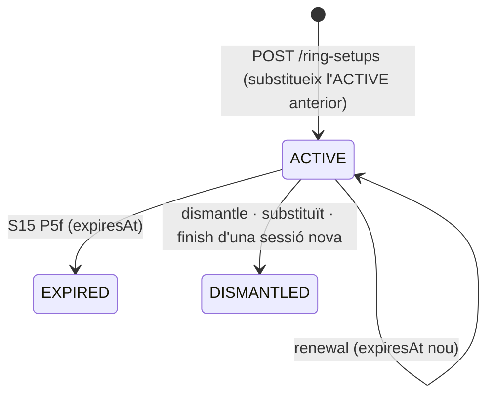
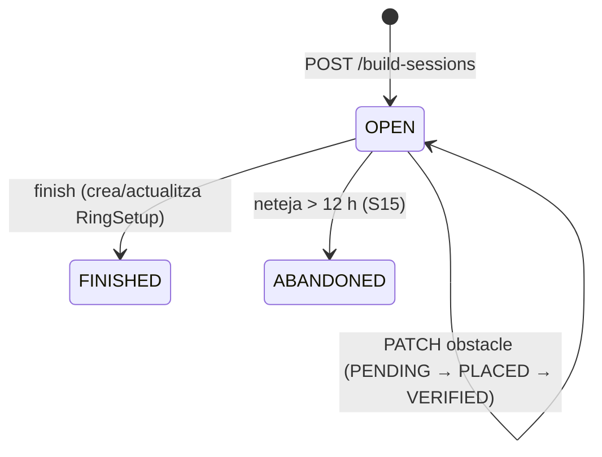

# S16 — Recorreguts, rings i muntatge

**Etapa:** E9 (fil independent: la recuperació de `course-core` pot començar a E0; la integració amb 08/10/23/D12 quan S06/S09 existeixin) · **Mòduls:** `COURSES` (tot el vertical), `FREE_TRAINING` (recorregut muntat a 08), `ACTIVITIES` (col·locacions d'una activitat), `LEARN_LINK`/R2 (challenges) · **Pantalles:** **D18 «Biblioteca de recorreguts»** (nova, sense mockup), D16 bloc «Geometria» (nou), **visor mòbil** + **«Registra què hi ha muntat»** (instructor) + **sessió de muntatge** (noves), integracions a 08 (S09), 10/23 (S06), 07 (S08), D12 (S10), D7 (S07), D3/D4 (S06 `placementId`) · **Model:** PLATAFORMA §0 i **§5** (COURSE, geometria del RING, PLACEMENT, RING_SETUP, BUILD_SESSION, OBSTACLE_INVENTORY, CHALLENGE/ATTEMPT reservats) · ADR-013 · **Estat:** esborrany (03-09-2026) · **Versió:** 0.2 (05-09: verificació del web-planner, §14 — mana sobre §3/§4/§12 on discrepin)

## 1. Propòsit i abast

Resol la **vertical de pistes**: que el club tingui una **biblioteca de recorreguts** (propis, importats de Smarter, dibuixats a l'editor, fotografiats o copiats de la biblioteca pública d'AgilityHub), que cada **pista** pugui tenir **geometria de ring** (mides, portes, zones no-go, marcadors de calibratge), que un recorregut es pugui **col·locar** en un ring amb avisos automàtics, que l'instructor **registri en 30 segons què hi ha muntat** a cada pista (IDEA-02) i que l'alumne ho vegi abans de reservar un entrenament i als quadres, amb **full de muntatge** imprimible i **sessió de muntatge** en directe des del mòbil. És la base de dades i d'API que després consumiran els **challenges** de Learn (R2) i l'**app AR/VR** (R3) sense cap dada nova. Decisió tècnica (ADR-013): `course-core` (TS pur) i `course-ui` (React/three) es recuperen del web-planner com a packages; el core API persisteix el model com a JSON versionat.

| Fora d'abast | On viu |
|---|---|
| Reserva d'entrenaments i pantalla 08 (aquí: el bloc «recorregut muntat» que hi apareix) | S09 |
| Quadres 10/23, calendari, `ClassSession.placementId` (aquí: què hi aporta) | S06 |
| Activitats (aquí: `Placement.activityId`) | S07 |
| Caducitat automàtica dels muntatges (P5f) | S15 |
| Challenges: regles, vídeo, validació, intents | S19 (R2) — aquí només la forma de l'API |
| App AR/VR | S20 (R3) — aquí els requisits que ha de complir aquesta API |
| Manteniment de pistes (nom, color, reservable) | S05 (aquí: el bloc «Geometria» de D16) |

## 2. Pantalles i rutes

Totes les pantalles noves es dissenyen amb el design system (`packages/ui`) seguint D16/D7 com a referència d'estil; Josep les valida a staging.

| Pantalla | App | Ruta | Rol | Comportament |
|---|---|---|---|---|
| **D18 Biblioteca** | clubs-admin | `/recorreguts` | ADMIN · INSTRUCTOR | Llistat universal (CONVENCIONS §4) amb miniatura, nom, disciplina, nivell, autor, font, pistes on és muntat, dates; xips «Del club» · «AgilityHub» (`PUBLIC`) · «Meus» (`ACCOUNT`); accions: **[Nou recorregut]** (menú: «Importa un fitxer Smarter (.txt)», «Dibuixa'l» (editor), «Puja un plànol o foto», «Copia d'AgilityHub») · fila → detall: visor 2D (`CourseViewer2D`), pestanya 3D (`CourseViewer3D`, càrrega diferida), metadades editables, «Col·loca en una pista» → **editor de col·locació** (`PlacementEditor`: tria de ring amb geometria, arrossega/gira/mirall, avisos en viu, [DESA LA COL·LOCACIÓ]), «Full de muntatge» (PDF), «Registra-ho com a muntat» (→ `RingSetup`), «Duplica», «Comparteix amb el club» (visibilitat), «Elimina» (soft). Estats buit («Encara no hi ha cap recorregut. Importa'n un de Smarter o dibuixa'n un.»), carregant, error. |
| D16 bloc «Geometria» | clubs-admin | `/pistes/:id` | ADMIN | Targeta «Geometria del ring» (`RingGeometryEditor`): amplada × llargada (m), orientació (graus respecte al nord), portes (posició al perímetre, amplada, flux entrada/sortida/ambdós), zones no-go (polígons dibuixats), marcadors de calibratge (4 per defecte a les cantonades, arrossegables), superfície, notes; [DESA] → `PUT /rings/{id}/geometry`; [Full de marcadors] → PDF amb QR (`GET /rings/{id}/marker-sheet`). Sense geometria: text «Aquesta pista no té geometria: només s'hi poden registrar muntatges amb foto o plànol.» |
| **Visor mòbil** | clubs | `/recorreguts/:setupId` · `/recorreguts/muntat/:ringId` | MEMBER · INSTRUCTOR | Des de 08 (xip de pista), 10/23 (cel·la), 07 (detall de reserva) o D12: nom/tipus/nivell del muntatge, «muntat {fa 2 dies} per {instructor}» (l'autor només per a instructors), «previst fins {data}», imatge/plànol o visor 2D del recorregut col·locat (zoom i gir), numeració; per a instructors: [Marca com a desmuntat] i [Sessió de muntatge]. |
| **Registra què hi ha muntat** | clubs | `/instructor/pistes/:ringId/muntat` | INSTRUCTOR · ADMIN | Formulari de 30 segons: pista (preseleccionada), «Què hi ha muntat?» (`kind`: Agility · Jumping · Fun · Treball d'obstacle · Buida), font: «Un recorregut de la biblioteca» (cerca) / «Foto o plànol» (càmera/galeria → S3) / «Cap» (només tipus), nivell orientatiu (nivells del club o escala AgilityHub), «Fins quan?» (per defecte `builtAt + courses.setupAutoExpireDays`), nota; [REGISTRA] → `POST /ring-setups`. Si hi ha un muntatge actiu: «Substituirà el muntatge actual ({tipus}, de {dia})». Accés des de 20/23/24 (icona de con a la capçalera de pista, assumpció §13). |
| **Sessió de muntatge** | clubs | `/instructor/muntatge/:sessionId` | INSTRUCTOR · ADMIN | Llista d'obstacles numerats amb estat (pendent · col·locat · verificat) i posició/orientació (m i graus des dels marcadors); toc = següent estat; mode «en directe» (SSE) perquè dos mòbils vegin el mateix; [FINALITZA] → crea/actualitza el `RingSetup`; [Full de muntatge] (PDF). |
| Integracions | clubs / clubs-admin | 08, 10, 23, 07, D12, D7, D3/D4 | segons pantalla | 08: `rings[].setup` (S09 R-09-15) pinta «Jumping · nivell C–D · muntat ahir» sota la xip de la pista → visor. 10/23: icona de recorregut a la capçalera de la columna (S06 §2) → visor. 07: línia «A la pista hi ha muntat: …» si la classe té `placementId` o la pista un muntatge actiu. D12: icona a la capçalera de pista. D7: «Col·locacions» de l'activitat (llista + [Afegeix]). D3/D4: selector opcional «Recorregut previst» a la classe (`placementId`). Tot condicionat a `courses.showSetupToMembers` per a MEMBER. |

## 3. Entitats i camps

### `Course` (`courses`) — `ownerType = CLUB` (amb `clubId`) · `AGILITYHUB` (global, `GlobalRepository`) · `ACCOUNT` (global amb `ownerAccountId`)
| Camp | Tipus | Obl. | Validació / notes |
|---|---|---|---|
| `ownerType`, `clubId?`, `ownerAccountId?` | | sí | segons propietari |
| `visibility` | enum | sí | `PRIVATE` (només l'autor) · `CLUB` (instructors/admins del club) · `PUBLIC` (tots els clubs; només `AGILITYHUB` o `ACCOUNT` que ho publica) |
| `name` | LocalizedText | sí | fallback `defaultLocale` |
| `discipline` | enum | sí | `AGILITY · JUMPING · OTHER` |
| `designerName`, `designedOn?`, `eventName?` | string, date | no | |
| `agilityhubLevel?`, `levelIds[]` (club) | | no | nivell orientatiu |
| `tags[]`, `notes` | | no | |
| `source` | enum | sí | `SMARTER · EDITOR · IMAGE · AGILITYHUB_COPY` (`sourceCourseId`) |
| `sourceFileKey?`, `imageFileKey?`, `thumbnailFileKey?` | S3 | | miniatura generada al client (SVG → PNG) en desar |
| `model?` | JSON `CourseModel` | sí llevat de `IMAGE` | validat amb el **JSON Schema publicat per `course-core`** (`schemaVersion`); mida ≤ 256 KB |
| `stats` | `{obstacleCount, pathLengthM, bbox {w, h}}` | calculat | del model, per a llistats i filtres |
| `version`, `history[]` (10 darreres versions del `model`) | | | edició in-place (assumpció §13) |
| `createdAt`, `createdByAccountId`, `updatedAt`, `deletedAt?` | | | soft delete |

### `CourseModel` (contracte de `course-core`, `schemaVersion = 1`) — **hipòtesi a verificar**
`{ schemaVersion, units: "m", origin: "bottom-left", size: {w, h}, obstacles: [{ id, type: JUMP · DOUBLE · TRIPLE · WALL · TYRE · TUNNEL · AFRAME · DOGWALK · SEESAW · WEAVES · TABLE · LONG_JUMP · START · FINISH · OTHER, x, y, rotationDeg, length?, width?, numbers: [n…], props: {} }], sequence: [{ obstacleId, direction: FORWARD · BACKWARD }], meta: { designer, event, class, level, smarter: { version, rawHeader } } }`. Coordenades en metres amb origen a la cantonada inferior esquerra del recorregut; `numbers` admet més d'un número (obstacles que es fan dues vegades).

### `Ring.geometry` (embegut a `Ring`, S05)
`{ width, length, orientationDeg, origin: {x: 0, y: 0}, gates: [{id, side: N·S·E·W, offsetM, widthM, flow: IN · OUT · BOTH}], noGoZones: [{id, polygon: [{x, y}…], label}], calibrationMarkers: [{id, x, y, qrPayload: "agh:ring:{ringId}:{markerId}"}], surface: GRASS · SAND · ARTIFICIAL · INDOOR · OTHER, notes, version, updatedAt }` — `width/length` 10–60 m; ≥ 3 marcadors no col·lineals per a l'AR.

### `Placement` (`placements`)
`courseId`, `courseVersion`, `ringId`, `transform {dx, dy, rotationDeg, mirror}`, `resolvedObstacles[] {obstacleId, type, x, y, rotationDeg, numbers[]}` (coordenades absolutes del ring, **el que consumeix l'AR**), `warnings[] {code, severity: WARN · BLOCK, obstacleId?, details}`, `activityId?`, `classSessionIds[]` (lectura), `name?`, `createdByAccountId`, `createdAt`, `updatedAt`, `version`.

### `RingSetup` (`ring_setups`) — «recorregut muntat»
`ringId`, `kind` (`AGILITY · JUMPING · FUN · OBSTACLE_DRILL · EMPTY`), `placementId?` **o** `courseId?` (recorregut sense col·locació) **o** `imageFileKey?` (foto/plànol) — almenys un llevat de `EMPTY`, `agilityhubLevel?`, `levelIds[]`, `builtAt`, `builtByAccountId`, `expectedUntil?`, `expiresAt` (= `builtAt + courses.setupAutoExpireDays`, o `expectedUntil` si és abans), `status` (`ACTIVE · EXPIRED · DISMANTLED`), `dismantledAt?`, `dismantledByAccountId?`, `notes`, `createdAt`.

### `BuildSession` (`build_sessions`)
`placementId`, `ringId`, `startedByAccountId`, `startedAt`, `finishedAt?`, `live` (bool), `obstacles[] {obstacleId, status: PENDING · PLACED · VERIFIED, byAccountId?, at?}`, `participants[] {accountId, joinedAt}`, `buildSheetFileKey?`, `version`.

### `ObstacleInventory` (`obstacle_inventories`)
`scope` (`CLUB` · `RING` + `ringId`), `items[] {type, count, notes}`, `updatedAt`. L'inventari efectiu d'un ring = `RING` si existeix, si no `CLUB`.

### Reservats (R2): `Challenge` (global), `ChallengeAttempt` (`clubId`) — vegeu §6 (contracte).

## 4. Regles de negoci

| Regla | Enunciat | Paràmetres | Exemple |
|---|---|---|---|
| **R-16-01 `course-core` com a única veritat geomètrica** | Tot càlcul (parser Smarter, bounding box, longitud, col·locació i avisos) viu a `packages/course-core` i s'executa **al client** (browser) i, per a validacions, al servidor **només** com a validació d'esquema JSON (el back no reimplementa geometria a Java). El servidor guarda `model` + `resolvedObstacles` + `warnings` tal com els envia el client i **recalcula** avisos només marcant `stale = true` quan la geometria del ring canvia (R-16-06); el client els regenera en obrir. `course-core` publica `course-model.schema.json` (JSON Schema draft 2020-12) que el core valida amb una llibreria estàndard. | — | Importació d'un `.txt`: el navegador parseja, mostra la vista prèvia i envia el `CourseModel`. |
| **R-16-02 Importació Smarter** | `parseSmarter(text) → {model} | {errors[]}`: format hipotètic (§13): capçalera amb versió/autor/mides + una línia per obstacle (tipus, x, y, rotació, números). Obstacles desconeguts → `type OTHER` + avís `UNKNOWN_OBSTACLE`; unitats en peus → conversió a metres; fitxer sense mides → `size` = bbox + 2 m de marge. El `.txt` original es desa a S3 (`sourceFileKey`) per reprocessar quan el parser millori. Mida màxima 512 KB. | `files.*` | «Course 12 obstacles, 20×40 m» → miniatura i llistat. |
| **R-16-03 Visibilitat i propietat** | Lectura: `CLUB` → membres amb rol INSTRUCTOR/ADMIN del club (MEMBER només via `RingSetup`); `PUBLIC` → qualsevol usuari autenticat de qualsevol club (biblioteca AgilityHub); `PRIVATE` (`ACCOUNT`) → només l'autor. Escriptura: `CLUB` → INSTRUCTOR/ADMIN; `AGILITYHUB` → `AGILITYHUB_ADMIN`; `ACCOUNT` → l'autor. `POST /courses/{id}/copy-to-club` copia un `PUBLIC` com a `CLUB` amb `source = AGILITYHUB_COPY` i `sourceCourseId` (les millores públiques no es propaguen; el club pot tornar a copiar). Un club **mai** pot llegir un `CLUB` d'un altre club (`404`). | — | Cànic copia «AH · Foundations 07» → recorregut propi editable. |
| **R-16-04 Geometria del ring** | `PUT /rings/{id}/geometry` (ADMIN): `width/length ∈ [10, 60]`, portes dins del perímetre, polígons no-go simples i dins del ring, ≥ 3 marcadors no col·lineals (`422 GEOMETRY_INVALID{details}`). Desar incrementa `geometry.version`, emet `RingGeometryChanged` i marca `stale` les col·locacions del ring (R-16-06). Esborrar la geometria només si no hi ha `Placement` ni `RingSetup` `ACTIVE` amb col·locació (`409 RING_GEOMETRY_IN_USE`). | — | Muntanya 22 × 40 m, porta N a 3 m (2 m d'ample, entrada), no-go «bassa» 3 × 3, 4 marcadors. |
| **R-16-05 Col·locació i avisos** | `placeInRing(course, geometry, transform)` (client) → `resolvedObstacles` (rotació + translació + mirall) i avisos: `OUT_OF_BOUNDS` (BLOCK: obstacle fora del ring), `MARGIN_TOO_SMALL` (WARN: distància al perímetre < `courses.placementMarginMeters`), `GATE_BLOCKED` (WARN: obstacle a < 1,5 m d'una porta), `NO_GO_OVERLAP` (BLOCK), `OBSTACLE_OVERLAP` (WARN: dos obstacles a < 0,5 m), `INVENTORY_SHORT` (WARN: `count(type) > inventari.type`). `POST /placements` rebutja `BLOCK` (`422 PLACEMENT_BLOCKED{warnings}`) llevat de `force = true` (ADMIN, queda registrat). Els `WARN` es desen. | `courses.placementMarginMeters = 1.5` | Salt 4 a 0,8 m de la tanca → `MARGIN_TOO_SMALL` (WARN); túnel dins la bassa → `NO_GO_OVERLAP` (BLOCK). *Càlcul:* obstacle (12, 3) amb `dx = 2, dy = 1, rotació 0` → (14, 4); marge al costat S = 4 m ≥ 1,5 → OK. |
| **R-16-06 Canvi de geometria amb col·locacions** | `RingGeometryChanged` → totes les `Placement` del ring: `stale = true` (les `resolvedObstacles` es conserven); el següent `GET` retorna `stale` i el client recalcula i fa `PUT` (`PlacementUpdated`). Un `RingSetup` `ACTIVE` sobre una col·locació `stale` mostra «Geometria canviada: revisa la col·locació» a instructors. | — | — |
| **R-16-07 Un muntatge actiu per pista** | `POST /ring-setups` (INSTRUCTOR si `courses.allowInstructorPublish`, ADMIN sempre): si la pista té un `ACTIVE`, aquest passa a `DISMANTLED{replaced}` en la mateixa transacció; `Ring.activeSetupId` apunta al nou; `expiresAt = min(expectedUntil, builtAt + courses.setupAutoExpireDays)`; `kind = EMPTY` deixa la pista «buida» (setup actiu de tipus `EMPTY`, útil per dir «ja no hi ha res»); `RingSetupChanged{ringId, setupId, status: ACTIVE, replacedSetupId?}`. Un `placementId` d'un altre ring → `422 PLACEMENT_RING_MISMATCH`. Sense geometria: `placementId` prohibit (`422 RING_WITHOUT_GEOMETRY`), `courseId`/imatge permesos. | `courses.setupAutoExpireDays = 7`, `courses.allowInstructorPublish = true` | Estel registra «Jumping · C–D · foto» a Carretera el dl 5-10 → caduca el 12-10 si ningú no el renova. |
| **R-16-08 Caducitat, desmuntatge i renovació** | S15 P5f: `ACTIVE` amb `expiresAt ≤ now` → `EXPIRED`, `Ring.activeSetupId = null`, `RingSetupChanged{EXPIRED}`. `POST /ring-setups/{id}/dismantle` → `DISMANTLED` (idem). `POST /ring-setups/{id}/renewal {expectedUntil?}` sobre `ACTIVE` → `expiresAt` nou (renovar és més ràpid que re-registrar). Els muntatges caducats/desmuntats queden a l'**historial per pista** (`GET /rings/{id}/setups`). | `courses.setupAutoExpireDays` | Dl 12-10 06:00 → `EXPIRED`; l'instructor, en veure-ho, «Renova» perquè encara hi és. |
| **R-16-09 Què veu l'alumne** | Amb `COURSES` i `courses.showSetupToMembers`: `GET /me/ring-setups` → per pista reservable (i per a les de les seves classes): `{ringId, setup?: {id, kind, levelLabel, builtAgo, expectedUntil, thumbnailUrl, hasViewer}}` **sense** `builtBy`, notes ni inventari. Rings sense muntatge → `setup = null` («Sense recorregut registrat»). El visor 2D per a MEMBER mostra numeració i obstacles, no l'editor. Instructors/admins veuen tot. | `courses.showSetupToMembers = true` | Laura, abans de reservar Muntanya: «Agility · nivell D · muntat fa 2 dies». |
| **R-16-10 Full de muntatge** | `GET /placements/{id}/build-sheet` → PDF (client `BuildSheet` renderitzat al servidor via el motor d'S14 o generat al client i pujat — decisió: **client** genera el PDF amb `course-ui` i el desa a S3 via `POST /placements/{id}/build-sheet`; el servidor només emmagatzema; assumpció §13): plànol amb numeració, taula d'obstacles amb posició (x, y) i orientació respecte als **marcadors** (distàncies a 2 marcadors per obstacle — el que un muntador mesura amb cinta), inventari necessari, portes, notes. | — | — |
| **R-16-11 Sessió de muntatge** | `POST /build-sessions {placementId, live}` (INSTRUCTOR/ADMIN) → `obstacles[]` `PENDING`; `PATCH /build-sessions/{id}/obstacles/{obstacleId} {status}` amb `version` (concurrència: last-write-wins per obstacle, `409 STALE_VERSION` només a nivell de sessió tancada); `GET /build-sessions/{id}/events` (SSE `text/event-stream`, esdeveniments `obstacle`, `finished`, heartbeat 20 s; token per query `?access_token=` acceptat només per a aquest endpoint); `POST /build-sessions/{id}/finish` → `finishedAt`, crea/actualitza el `RingSetup` (`kind` de la disciplina del recorregut) i `BuildSessionFinished`. Una sessió oberta > 12 h es tanca sola (S15 P9 neteja, §13). | — | Dos instructors munten Central: cada toc es veu a l'altre mòbil en < 2 s. |
| **R-16-12 Inventari** | `PUT /obstacle-inventories/{scope}` (ADMIN): `items[]` amb `count ≥ 0`; `INVENTORY_SHORT` es calcula amb l'inventari efectiu del ring (R-16-05). Sense inventari → cap avís d'inventari. | — | Club: 12 salts, 2 túnels; recorregut amb 3 túnels → «Falten 1 túnel». |
| **R-16-13 Activitats i classes** | `Placement.activityId` (S07): les col·locacions d'una activitat surten a D7 i, el dia de l'activitat, com a muntatge previst («Competició social · pista Central · recorregut 1»); `ClassSession.placementId`/`TemplateClass.placementId` (S06): «Recorregut previst» visible a instructors (20/23/D12) i, si `showSetupToMembers`, com a línia informativa a 07. Cap automatisme crea `RingSetup` a partir d'una classe: es registra a mà (0.3.7). | — | — |
| **R-16-14 Biblioteca pública d'AgilityHub** | `POST /platform/courses` (`AGILITYHUB_ADMIN`) → `ownerType AGILITYHUB`, `visibility PUBLIC`, `agilityhubLevel` obligatori; llistable des de qualsevol club amb xip «AgilityHub»; **mai** editable pels clubs. Preparat per als challenges (R2, §6). | — | — |
| **R-16-15 Mòdul i variants** | `COURSES` off: tots els endpoints `404 MODULE_DISABLED`; cap bloc a D16/D18/08/10/23/07/D12/D7; S06/S07 ometen `placementId`; S15 omet P5f. `levels.enabled = false`: `levelIds[]` buit i només `agilityhubLevel`/text lliure com a nivell orientatiu. `FREE_TRAINING` off: sense integració a 08 (el visor segueix accessible des de 10). | — | — |
| **R-16-16 Tenant, rols i fitxers** | Recorreguts `CLUB` i tot el mòdul filtrats per `clubId`; `PUBLIC` per `GlobalRepository` només lectura; fitxers a S3 amb prefix `{clubId}/courses/` i URLs signades; validació MIME (`.txt` Smarter, imatges, PDF) i mides (`files.*`). MEMBER: només `GET /me/ring-setups`, `GET /ring-setups/{id}` (si visible) i `GET /courses/{id}` d'un recorregut referenciat per un muntatge visible. | `files.maxSizeMb` | — |
| **R-16-17 i18n** | `Course.name` LocalizedText; tipus d'obstacle, `kind`, avisos i estats amb `enums:` (ca/es/en); unitats sempre en metres (formatació amb `Intl`); PDF del full en l'idioma de qui el genera. | — | — |

## 5. Estats i transicions

`Course`: sense estats (soft delete `deletedAt`; `visibility` canviable). `Placement`: `stale` com a marca.

| Transició | Qui | Condició | Efectes | Esdeveniment |
|---|---|---|---|---|
| recorregut creat/importat/copiat | INSTRUCTOR/ADMIN · AGILITYHUB_ADMIN | esquema vàlid | fitxers S3, `stats` | `CourseCreated` / `CourseImported{source}` |
| geometria desada | ADMIN | R-16-04 | `stale` a col·locacions | `RingGeometryChanged` |
| col·locació creada/actualitzada | INSTRUCTOR/ADMIN | R-16-05 | `resolvedObstacles`, `warnings` | `PlacementCreated` / `PlacementUpdated` |
| muntatge registrat | INSTRUCTOR/ADMIN | R-16-07 | `Ring.activeSetupId`, anterior `DISMANTLED` | `RingSetupChanged{ACTIVE}` (+ N-31 opcional) |
| muntatge caducat/desmuntat | S15 · INSTRUCTOR/ADMIN | R-16-08 | `activeSetupId = null` | `RingSetupChanged{EXPIRED · DISMANTLED}` |
| sessió iniciada/progrés/acabada | INSTRUCTOR/ADMIN | R-16-11 | SSE, `RingSetup` | `BuildSessionStarted` / `BuildSessionProgress` / `BuildSessionFinished` |

## 6. API

Mòdul `COURSES` a tot llevat de `/platform/courses`. Rols segons R-16-03/16.

| Mètode | Ruta | Rol | Idem. | Descripció | Cos / paràmetres | Respostes i errors |
|---|---|---|---|---|---|---|
| GET | `/courses` | INSTRUCTOR · ADMIN | — | llistat universal (club + `PUBLIC` + propis) | `x-filterable`: `owner (CLUB·AGILITYHUB·MINE), discipline, agilityhubLevel, levelId, source, tag, designerName, obstacleCount, updatedAt`; `q` | `200 {items: CourseListItem[{id, name, discipline, level, designerName, source, thumbnailUrl, stats, ownerType, activeOnRings[]}], …}` |
| POST | `/courses` | INSTRUCTOR · ADMIN | sí | crea (`EDITOR`, `IMAGE`, `SMARTER` amb `model` ja parsejat) | `{name, discipline, source, model?, imageFileKey?, sourceFileKey?, designerName?, agilityhubLevel?, levelIds[], tags[], notes, visibility}` | `201` · `400 COURSE_MODEL_INVALID{schemaErrors}` / `SCHEMA_VERSION_UNSUPPORTED` |
| GET · PATCH · DELETE | `/courses/{id}` | segons visibilitat | `version` | detall (model complet) · edició · soft delete | | `200` · `404 COURSE_NOT_VISIBLE` · `409 STALE_VERSION` / `COURSE_IN_USE` (delete amb muntatge actiu) |
| POST | `/courses/{id}/duplicate` · `/courses/{id}/copy-to-club` | INSTRUCTOR · ADMIN | sí | R-16-03 | `{name?}` | `201` |
| POST | `/courses/upload-urls` | INSTRUCTOR · ADMIN | — | URL signada per a `.txt`/imatge | `{purpose: SMARTER_SOURCE · COURSE_IMAGE · THUMBNAIL · BUILD_SHEET, contentType, size}` | `201 {uploadUrl, fileKey}` · `400 FILE_TYPE_NOT_ALLOWED` / `FILE_TOO_LARGE` |
| GET · PUT · DELETE | `/rings/{id}/geometry` | ADMIN (GET: INSTRUCTOR) | `version` | R-16-04 | `RingGeometry` | `200` · `422 GEOMETRY_INVALID` · `409 RING_GEOMETRY_IN_USE` |
| GET | `/rings/{id}/marker-sheet` | ADMIN · INSTRUCTOR | — | PDF de marcadors QR | — | `200 application/pdf` |
| GET | `/rings/{id}/setups` | INSTRUCTOR · ADMIN | — | historial de muntatges | `page,size` | `200` |
| GET | `/placements` · `/placements/{id}` | INSTRUCTOR · ADMIN | — | per `ringId` / `courseId` / `activityId` | | `200` (amb `stale`) |
| POST · PUT | `/placements` · `/placements/{id}` | INSTRUCTOR · ADMIN | sí / `version` | R-16-05 | `{courseId, courseVersion, ringId, transform, resolvedObstacles[], warnings[], activityId?, name?, force?}` | `201/200` · `422 PLACEMENT_BLOCKED{warnings}` / `RING_WITHOUT_GEOMETRY` / `PLACEMENT_RING_MISMATCH` |
| POST · GET | `/placements/{id}/build-sheet` | INSTRUCTOR · ADMIN | — | R-16-10 | `{fileKey}` | `200 application/pdf` |
| POST | `/ring-setups` | INSTRUCTOR (`allowInstructorPublish`) · ADMIN | sí | R-16-07 | `{ringId, kind, placementId?, courseId?, imageFileKey?, agilityhubLevel?, levelIds[], expectedUntil?, notes}` | `201 {setup, replacedSetupId?}` · `422 RING_WITHOUT_GEOMETRY` / `PLACEMENT_RING_MISMATCH` / `SETUP_SOURCE_REQUIRED` |
| GET | `/ring-setups/{id}` | MEMBER (visible) · INSTRUCTOR · ADMIN | — | visor | — | `200` (projecció per rol) · `404` |
| POST | `/ring-setups/{id}/dismantle` · `/ring-setups/{id}/renewal` | INSTRUCTOR · ADMIN | sí | R-16-08 | `{expectedUntil?}` | `200` · `409 INVALID_STATE` |
| GET | `/me/ring-setups` | MEMBER · INSTRUCTOR | — | R-16-09 | `ringIds?` | `200 [{ringId, setup?}]` |
| POST | `/build-sessions` | INSTRUCTOR · ADMIN | sí | R-16-11 | `{placementId, live}` | `201` |
| GET | `/build-sessions/{id}` · PATCH `/build-sessions/{id}/obstacles/{obstacleId}` · POST `/build-sessions/{id}/finish` | INSTRUCTOR · ADMIN | — / — / sí | R-16-11 | `{status}` | `200` · `409 BUILD_SESSION_FINISHED` |
| GET | `/build-sessions/{id}/events` | INSTRUCTOR · ADMIN | — | SSE | `access_token` (query) | `text/event-stream` |
| GET · PUT | `/obstacle-inventories/{scope}` (`club` · `ring:{ringId}`) | ADMIN (GET: INSTRUCTOR) | — | R-16-12 | `{items[]}` | `200` · `422 INVENTORY_INVALID` |
| GET · POST · PATCH | `/platform/courses` | AGILITYHUB_ADMIN | sí | R-16-14 | com `/courses` | `201`/`200` |
| **R2** GET `/challenges` · GET `/challenges/{id}` · POST `/challenges/{id}/attempts` · GET `/me/challenge-attempts` | tots · MEMBER | | contracte reservat (S19): `Challenge {id, courseId, title, description, agilityhubLevel, rules, validFrom, validTo, status}`; `Attempt {challengeId, dogId, ringSetupId?, timeMs, faults, videoUrl?, submittedAt, status}` | | `501 NOT_IMPLEMENTED` a R1 |

**Requisits per a l'app AR (R3, S20)**: OIDC natiu (S01 client `ar-app`); `GET /rings/{id}/geometry` (marcadors amb `qrPayload`), `GET /placements/{id}` (`resolvedObstacles` en metres, frame del ring), `GET /build-sessions/{id}/events` + `PATCH` per obstacle; tot ja definit aquí — **cap endpoint nou**.

## 7. Esdeveniments

**Emesos**: `CourseCreated{courseId, ownerType, source}` · `CourseUpdated{courseId, diff}` · `CourseImported{courseId, source: SMARTER, warnings[]}` · `RingGeometryChanged{ringId, version}` · `PlacementCreated{placementId, ringId, courseId, warnings[]}` · `PlacementUpdated{placementId, stale: false}` · `RingSetupChanged{ringId, setupId, status, replacedSetupId?, kind, byAccountId}` · `BuildSessionStarted{sessionId, placementId, live}` · `BuildSessionProgress{sessionId, obstacleId, status}` · `BuildSessionFinished{sessionId, setupId}` · **nous (§13)**: `CourseDeleted`, `CourseCopied{fromCourseId}`, `InventoryChanged{scope}`.

**Consumits**: `RingChanged{deactivated}` (S05) → muntatge actiu `DISMANTLED{ring_inactive}` · `ActivityCancelled` (S07) → col·locacions de l'activitat queden (informatives) · `AccountErased` (S14) → `Course.ownerType ACCOUNT` → `PRIVATE`, `designerName` null.

## 8. Notificacions

| Codi | Moment | Públic → canals | Variables |
|---|---|---|---|
| N-31 Recorregut nou a la pista | `RingSetupChanged{ACTIVE}` si `messaging.notifyNewRingSetup` i `kind ≠ EMPTY` | MEMBER amb dret d'entrenament (S09 `TrainingEligibilityService.membersWithRight()`) → APP, acció `OPEN_SETUP` | `ring_name`, `setup_kind`, `level` |

Cap altra: els instructors veuen els muntatges als quadres.

## 9. Paràmetres i mòduls

Llegeix: `courses.setupAutoExpireDays` (7), `courses.placementMarginMeters` (1.5), `courses.showSetupToMembers` (true), `courses.allowInstructorPublish` (true), `messaging.notifyNewRingSetup` (false), `files.maxSizeMb`, `files.allowedTypes` (+ `text/plain` per a Smarter, proposta), `levels.enabled`. **Propostes (§13)**: `courses.buildSessionMaxHours` (12), `courses.gateClearanceMeters` (1.5), `courses.obstacleClearanceMeters` (0.5).

| Mòdul / variant | Efecte |
|---|---|
| `COURSES` off | vertical absent (R-16-15) |
| `FREE_TRAINING` off | sense bloc a 08 |
| `ACTIVITIES` off | sense `activityId` |
| `levels.enabled = false` | només `agilityhubLevel` / text |

## 10. i18n i localització

- Namespaces `courses` (visor, registre, sessió), `admin-courses` (D18, geometria, inventari); `enums:obstacleType.*`, `enums:setupKind.*` («Agility», «Jumping», «Fun», «Treball d'obstacle», «Buida»), `enums:placementWarning.*` («Fora del ring», «Massa a prop de la tanca», «Porta bloquejada», «Zona no permesa», «Obstacles massa junts», «Falta material»), `enums:buildStatus.*`.
- `Course.name` LocalizedText (fallback); `builtAgo` amb `fmtRelative` i el fus del club; PDFs en l'idioma de qui els genera; unitats en metres amb `Intl` (decimal segons `locale`).

## 11. Criteris d'acceptació i tests obligatoris

**`course-core` (unitaris, Vitest, fixtures)**
- T-16-01 (R-16-02) `parseSmarter` amb 5 fitxers de mostra (a obtenir del web-planner o de Smarter real): recompte d'obstacles, posicions ± 1 cm, seqüència, obstacle desconegut → `OTHER` + `UNKNOWN_OBSTACLE`, fitxer corrupte → `errors[]` sense excepció.
- T-16-02 (R-16-05) `placeInRing`: translació/rotació/mirall amb valors coneguts (obstacle (12, 3), `dx 2 dy 1 rot 90` → (…)); cada codi d'avís amb un cas positiu i un de negatiu; `INVENTORY_SHORT` amb inventari de ring vs club.
- T-16-03 (R-16-01) el `CourseModel` de cada fixture valida contra `course-model.schema.json`; un model amb `schemaVersion 2` → invàlid a R1.
- T-16-04 `course-ui`: snapshots del `CourseViewer2D` i del `BuildSheet` per a 2 fixtures; `PlacementEditor` emet `transform` i avisos en arrossegar (test d'interacció).

**Integració (Testcontainers, S3 doble)**
- T-16-05 (R-16-03/16) club A crea un `CLUB` → club B `GET` → `404`; `PUBLIC` d'AgilityHub visible als dos; `copy-to-club` crea `AGILITYHUB_COPY` editable; MEMBER `GET /courses` → `403`; `ACCOUNT` `PRIVATE` només per l'autor.
- T-16-06 (R-16-04/06) geometria vàlida/invàlida (2 marcadors → `GEOMETRY_INVALID`); canvi de geometria → col·locacions `stale`; `DELETE` amb muntatge actiu → `409`.
- T-16-07 (R-16-05) `POST /placements` amb `BLOCK` → `422`; amb `force` (ADMIN) → `201` i auditoria; INSTRUCTOR amb `force` → `403`.
- T-16-08 (R-16-07/08) dos `POST /ring-setups` seguits a la mateixa pista → el primer `DISMANTLED{replaced}`, `activeSetupId` = segon; `kind EMPTY`; `placementId` d'un altre ring → `422`; ring sense geometria amb `placementId` → `422`; `renewal` → `expiresAt` nou; `dismantle` → `activeSetupId null`; S15 P5f amb `Clock` → `EXPIRED` idempotent.
- T-16-09 (R-16-09) `GET /me/ring-setups` per a MEMBER sense `builtBy`/notes; `showSetupToMembers=false` → `setup` absent per a MEMBER i present per a INSTRUCTOR (T-09-22 d'S09).
- T-16-10 (R-16-11) sessió: dos clients SSE reben `obstacle` en < 2 s (test amb dos subscriptors); `finish` crea el `RingSetup`; `PATCH` després de `finish` → `409 BUILD_SESSION_FINISHED`; token per query només a `/events`.
- T-16-11 (R-16-12) inventari de ring preval sobre el del club.
- T-16-12 (R-16-15) `COURSES` off → `404` a tot, `placementId` absent a S06/S07, P5f omès; `levels.enabled=false` → `levelIds` rebutjats.
- T-16-13 N-31 només amb `messaging.notifyNewRingSetup` i `kind ≠ EMPTY`; destinataris = amb dret d'entrenament.
- T-16-14 fitxers: `.exe` com a Smarter → `FILE_TYPE_NOT_ALLOWED`; 600 KB → `FILE_TOO_LARGE`; URLs signades caduquen.

**Front**
- T-16-15 D18: importació Smarter d'un fixture → vista prèvia → desar → llistat amb miniatura; col·locació amb avisos en viu; full de muntatge; «Registra-ho com a muntat».
- T-16-16 mòbil: registre en < 5 tocs (pista preseleccionada → tipus → foto → REGISTRA); visor des de 08 i 10; sessió de muntatge amb dos dispositius (E2E).

**Cobertura addicional (traçabilitat regla → test)**
- T-16-17 (R-16-06) després de `PUT /rings/{id}/geometry`, `GET /placements/{id}` → `stale: true`; `PUT /placements/{id}` amb `resolvedObstacles` nous → `stale: false` + `PlacementUpdated`; un `RingSetup` actiu sobre una col·locació `stale` mostra l'avís a instructors.
- T-16-18 (R-16-08) `renewal` sobre `EXPIRED` → `409 INVALID_STATE`; `GET /rings/{id}/setups` retorna l'historial ordenat amb `EXPIRED`/`DISMANTLED`.
- T-16-19 (R-16-10) `POST /placements/{id}/build-sheet {fileKey}` desa el PDF i `GET` el retorna amb URL signada; sense fitxer → `404`.
- T-16-20 (R-16-13) classe amb `placementId` d'un altre ring → `422 PLACEMENT_RING_MISMATCH` (S06); l'activitat llista les seves col·locacions (S07); 07 mostra «A la pista hi ha muntat: …» només amb `showSetupToMembers`.
- T-16-21 (R-16-14, R-16-16) `POST /platform/courses` sense `agilityhubLevel` → `400`; un ADMIN de club sobre `/platform/courses` → `403`; `PATCH` d'un `PUBLIC` per un club → `403`; fitxers d'un club en `{clubId}/courses/` i URL signada d'un altre club → `404`.
- T-16-22 (R-16-17) `Course.name` amb només `ca` es resol per a un usuari `en` (fallback); `enums:obstacleType.*` i `enums:setupKind.*` presents en ca/es/en; `builtAgo` calculat amb el fus del club («fa 2 dies» / «hace 2 días» / «2 days ago»).

## 12. Paquets de feina (per a fils d'IA en paral·lel)

| Paquet | Repo | Depèn de | Lliurable verificable |
|---|---|---|---|
| **WP-16-0 Revisió del web-planner** (primer de tot) | `@agilityhub/web-planner` (lectura) | accés al codi | informe amb la llista de §13 «Verificacions» resolta: format real del `CourseModel`, parser Smarter (versions suportades, fixtures), regles de col·locació existents, dependències (three.js versió, Supabase acoblat?), tests existents, llicència; decisió «extreure tal qual» vs «reescriure» per fitxer; ajust d'aquesta spec (v0.2) |
| WP-16-A `course-core` | `agilityhub-core-web/packages/course-core` | WP-16-0 | package TS pur amb parser, geometria, `placeInRing`, JSON Schema publicat, fixtures i T-16-01…03; `README` amb el format |
| WP-16-B `course-ui` | `agilityhub-core-web/packages/course-ui` | WP-16-A | `CourseViewer2D/3D`, `PlacementEditor`, `RingGeometryEditor`, `BuildSheet`, `MarkerSheet`; T-16-04 |
| WP-16-C Back `courses` | `agilityhub-core-api/courses` | WP-16-A (schema), S05 (`Ring`), S14 (audit) | entitats, endpoints de §6 (sense SSE), validació d'esquema, S3, esdeveniments; T-16-05…09, 11…14 |
| WP-16-D Sessions live | `agilityhub-core-api/courses` | WP-16-C | `BuildSession`, SSE, neteja; T-16-10 |
| WP-16-E Front admin | `agilityhub-core-web/apps/clubs-admin` | WP-16-B, WP-16-C | D18, bloc geometria de D16, inventari, D7/D3 selectors; T-16-15 |
| WP-16-F Front mòbil + integracions | `agilityhub-core-web/apps/clubs` | WP-16-B, WP-16-C, S06/S08/S09/S10 | visor, registre, sessió; blocs a 08/10/23/07/D12; T-16-16 |
| WP-16-G Biblioteca AgilityHub + migració Supabase | core + script | WP-16-C | `/platform/courses`; importació condicional de dades del web-planner |

Ordre: 0 → A → B ∥ C → D ∥ E ∥ F → G. Fils: (1) 0+A+B, (2) C+D, (3) E+F.

## 13. Dubtes oberts i verificacions

**Verificacions obligatòries sobre el web-planner (ADR-013) — tanquen WP-16-0:**
1. `course-core` no importa Supabase/Next; té tests; llicència i autoria.
2. Format real del model: unitats, origen de coordenades, sentit de rotació, tipus d'obstacle, com es representen obstacles amb dos números i la seqüència.
3. Parser Smarter: versions del `.txt` suportades, casos d'error, fixtures disponibles (demanar-ne 5 reals a Jordi, anonimitzats de nom d'autor si cal).
4. Regles de col·locació i avisos existents (marges, portes, no-go, inventari) i com es calculen les distàncies als marcadors per al full de muntatge.
5. Representació dels marcadors QR i del calibratge (per a l'AR); llibreria de generació de QR.
6. `three.js` (versió, pes), estat del visor 3D, si el 2D és SVG o canvas.
7. Persistència a Supabase: quines taules (venues, rings, courses, placements, events, build sessions, judges) tenen **dades reals** que calgui migrar (WP-16-G) i si hi ha usuaris reals (→ importació de comptes a S01 igual que Learn).
8. Rols del planner (`is_agilityhub_admin`, venue admin, judge) → mapatge a `AGILITYHUB_ADMIN`, ADMIN de club i `ACCOUNT` (dissenys personals).

| # | Dubte | Qui | Assumpció mentrestant |
|---|---|---|---|
| 1 | Edició de recorreguts in-place amb `history` (10) o versions immutables? | Jordi | in-place + `history` |
| 2 | Generació del PDF (full de muntatge, marcadors) al client (`course-ui`) o al servidor? | Jordi | client, pujat a S3 |
| 3 | Accés a «Registra què hi ha muntat» des de 20/23/24 (icona) — sense mockup | Josep | icona de con a la capçalera de la pista |
| 4 | Rols del web-planner (jutges convidats a un event) — R2 amb activitats? | Jordi | fora de R1 |
| 5 | Els alumnes poden veure el recorregut sencer (numeració) o només tipus/nivell? | Josep | sencer si `showSetupToMembers` |
| 6 | Format Smarter: descripció hipotètica de R-16-02 | WP-16-0 | — |

**Propostes**: paràmetres `courses.buildSessionMaxHours` (12), `courses.gateClearanceMeters` (1.5), `courses.obstacleClearanceMeters` (0.5); `files.allowedTypes` + `text/plain`; esdeveniments `CourseDeleted`, `CourseCopied`, `InventoryChanged`; errors `COURSE_MODEL_INVALID`, `SCHEMA_VERSION_UNSUPPORTED`, `COURSE_NOT_VISIBLE`, `COURSE_IN_USE`, `GEOMETRY_INVALID`, `RING_GEOMETRY_IN_USE`, `RING_WITHOUT_GEOMETRY`, `PLACEMENT_BLOCKED`, `PLACEMENT_RING_MISMATCH`, `SETUP_SOURCE_REQUIRED`, `BUILD_SESSION_FINISHED`, `INVENTORY_INVALID`, `FILE_TYPE_NOT_ALLOWED`, `FILE_TOO_LARGE`, `SMARTER_PARSE_ERROR` (client); rutes a afegir a CONVENCIONS §3: `/courses/upload-urls`, `/rings/{id}/setups`, `/ring-setups/{id}/renewal`, `/build-sessions/{id}/finish`, `/platform/courses`, `/challenges*` (R2); auditoria (S14): `COURSE_FORCED_PLACEMENT`, `RING_GEOMETRY_CHANGED`, `RING_SETUP_REGISTERED`.

## 14. Verificació del web-planner (WP-16-0, 05-09-2026) — fets i ajustos (v0.2)

Codi revisat: `agilityhub-course-builder/apps/web-planner` (Next 15 App Router + React 18 + Tailwind 3 + three 0.160 + `@supabase/supabase-js`, vitest amb 21 fitxers de test, fase 12d d'un pla per fases amb registre de decisions `D-0xx`). **No revisat** (fora de la carpeta muntada): `packages/course-core`, `packages/shared-types`, `packages/ui` (symlinks a `../../../../packages/*`) i les altres apps del monorepo (Unity/Quest). Cal muntar l'arrel del monorepo per tancar-ho (§14.6).

### 14.1 El que ja existeix (i és molt més que «col·locació»)

| Peça | Estat real | Decisió |
|---|---|---|
| `@agilityhub/course-core` | API usada pel planner: `parseSmarterTxt`, `summarizeCourse`, `centerCourseInRing`, `IDENTITY_PLACEMENT`, `runWarnings` (regles amb `ruleId`, severitats `critical · warning · info`, `thresholdMeters`), `obstacleTypeSchema` (zod), `ObstacleInventory`, `Ring` (`lengthMeters, widthMeters, borderClearanceMeters, doors[], noGoZones[], obstacleInventory`), portes (`inferDoorEdgeFromPolygon`, `normalizeDoorSide`, `doorPolygonFromEdge`), marcadors AprilTag (`buildMarkerUid`, `aprilTagIdFromMarkerUid`, `assignAprilTagIdForMarker`), calibratge (`CalibrationMeasurement`, `gradeCalibration`), unitats (`UnitSystem M/FT`, `formatLength`), paper (`PAPER_PRESETS`) | **Es recupera tal qual** com a `packages/course-core` (§12 WP-16-A passa de «escriure» a «copiar + tests»). El `CourseModel` hipotètic de §3 queda **substituït pel `CourseData` real** (`title, titleRaw, units, designLengthMeters, designWidthMeters, canvasWidth, canvasHeight, origin, metadata, obstacles[], numbers[]`) i `normalized_json` |
| `@agilityhub/shared-types` | Tipus de fila de la BBDD (`DBVenue, DBRing, DBRingMarker, DBCourse, DBCoursePlacement, DBBuildSession, DBBuildObstacleStatus, DBEvent, DBEventJudge, DBEventAttachment, DBProfile, DBAuditLog, DBCalibrationLog, DBImportLog`) i **`BuildSessionExportV1`** (zod) = el contracte de l'app **Unity** (D-037) | Els noms i camps del core **adopten els del planner** (§14.2). `BuildSessionExportV1` es manté byte a byte: el core l'exposa a `GET /build-sessions/{id}/export` |
| `PlannerStore` (`src/lib/storage/types.ts`) amb dues implementacions (`MockStore` en memòria amb seed; `SupabaseStore`) | La UI només coneix aquesta interfície | **Via de port**: implementar `CoreApiStore` (tercera implementació) contra el core; la UI del planner (pàgines React) es trasllada a `apps/clubs-admin` (D18) i a `packages/course-ui` amb canvis mínims |
| Pàgines: `/plan/{venue,upload,place,details}` (wizard), `/venues`, `/venue/[id]/{markers,calendar,events}`, `/markers/{print,test}`, `/build-sessions/[id]` (+ `/live`), `/calendar`, `/events`, `/designer/*`, `/admin/*` (venues, users, events, build-sessions, logs), `/courses/share`, `/login`; components `PlannerCanvas` (2D, 572 línies), `Planner3D` (three, 1.726 línies), `RingDoorEditor`, `RingMarkerDiagram`, `RingInventoryEditor`, `PlacementControls`, `WarningsPanel`, `UploadCourse`, `PlanStepper`, `VenueRingSelector`, `EventAttachments`, `EventManagePanels`, `PaperSizeToggle`, `UnitsToggle` | Cobreix D18 + geometria de D16 + sessió de muntatge + calendari + esdeveniments | Les pàgines «server» de Next (`src/app/api/invites/event`, `api/calibration/log`, `supabase-server.ts`, email via **Resend**) passen a endpoints del core |
| BBDD Supabase (`bmcahqnybxmnxrdvzzcs`): `venues, venue_members, rings, ring_doors, ring_no_go_zones, ring_markers, ring_obstacle_inventory, courses, course_source_files, course_obstacles, course_numbers, course_no_go_zones, course_themes, course_collaborators, course_placements, events, event_rings, event_judges, event_attachments, build_sessions, build_session_participants, build_obstacle_status, calibration_logs, audit_logs, import_logs, profiles`; RPC `is_agilityhub_admin`, `is_venue_admin`, `link_my_pending_invites`, `rotate_build_session_invite`; buckets `course-source-files`, `event-docs`, `build-session-exports`; Realtime per a `build_obstacle_status` | Esquema madur amb RLS i triggers (`enforce_placement_ring_in_event`) | El model del core (§14.2) el reprodueix; **si hi ha dades reals** (a confirmar per Jordi) s'importen amb un script (WP-16-G) |
| Rols: `agilityhub_admin` (global), `venue_admin` (per venue via `venue_members`), `judge` (per `event_judges`), rutes `designer`; `profiles.platform_user_id` (enllaç previst amb usuaris de la plataforma) | Coincideix amb ADR-010 | `AGILITYHUB_ADMIN`; `venue_admin` = ADMIN del club quan el venue és un club, o **venue sense club** (sales de competició) → entitat `Venue` pròpia (§14.2); `judge`/`designer` i esdeveniments amb jutges → **R2** (S07/S19) |
| Feature flags `NEXT_PUBLIC_ENABLE_AR_BUILD_SESSIONS`, `…MANUFACTURER_PROFILES`, `…QUEST_PLACEHOLDER`; export amb `assetProfile generic-fci`, temes (`course_themes`), producer `agilityhub-web-planner@phase8`; sessions amb `join_token/join_code` i participants; estat per obstacle `not_placed → placed → …` escrit per l'AR | **L'AR ja té direcció: Unity (AR Foundation) amb marcadors AprilTag; VR = Quest** (S20 s'actualitza) | El core manté aquests contractes |
| Fixtures Smarter reals: `route-validation-artifacts/*.txt` (4 fitxers verificats, «parse with zero warnings») + skill `smarter-verify-course-txt` | Resol §13 «Verificacions» 3 | Fixtures per als tests T-16-01 |

### 14.2 Model del core alineat amb el planner (substitueix §3 on discrepi)

| Entitat core | Origen al planner | Camps (noms del core en camelCase; a la BBDD del core es conserven els valors) |
|---|---|---|
| **`Venue`** (nova, `courses`) | `venues`, `venue_members` | `slug, name, country, city, address, surface, indoorOutdoor, contactEmail, publicNotes, privateNotes, visibility (public_preview…), partnerStatus, partnerSince/Until, defaultPaperSize, clubId?` — **un club = un venue** (creat automàticament amb el club, `clubId`); els venues sense club (sales) queden per a R2 |
| **`Ring`** (S05) + geometria | `rings` (`venue_id, name, length_m, width_m, border_clearance_m, surface`), `ring_doors` (`label, side, start_m, end_m, flow in·out·both, clearance_m, polygon_points_m, is_active, notes`), `ring_no_go_zones` (`label, polygon_points_m, warning_margin_m`), `ring_markers` (`label A–F, marker_uid, role, x_m, y_m, z_m, rotation_y_deg, physical_width_m, physical_height_m, is_fixed, is_active, april_tag_id, notes`), `ring_obstacle_inventory` (`obstacle_type, quantity`) | `Ring.geometry = {lengthM, widthM, borderClearanceM, doors[], noGoZones[], markers[]}` + `Ring.obstacleInventory[]`; les pistes del Cànic són rings del venue del club |
| **`Course`** | `courses` (`source_file_id, owner_id, title, title_raw, source smarter-agility, source_version, units m·ft, design_length_m, design_width_m, canvas_width, canvas_height, origin, metadata, course_grade, course_type, theme_id, normalized_json`), `course_source_files` (bucket), `course_obstacles`, `course_numbers`, `course_no_go_zones`, `course_themes`, `course_collaborators` | `Course` conserva `normalizedJson` (= `CourseData`) i els camps promoguts; afegim `ownerType/visibility/clubId` (§3) i `sizeCategory GRAND · GARDEN` (Learn); `course_collaborators` → R2 |
| **`Placement`** | `course_placements` (`course_id, venue_id, ring_id, owner_id, name, display_name, placement_mode, offset_x_m, offset_y_m, rotation_deg, flip_x_bool, flip_y_bool, warning_threshold_m, warnings_json, status ready_to_build…, scheduled_at, event_id, course_type Jumping·Agility, grades[], sizes[] (XS/S/M/I/L/ALL), is_training, mode event·training·free-floating`) | `Placement.transform` de §3 = `{offsetXM, offsetYM, rotationDeg, flipX, flipY}`; `resolvedObstacles` es calcula amb `course-core` (no cal persistir-lo si l'export ho fa) — decisió: **es persisteix** per a l'AR/consultes (§13) |
| **`BuildSession`** | `build_sessions` (`placement_id, judge_id, status not_started·in_progress·…, selected_strategy equipment_type, last_known_marker_id, started_at, completed_at, local_cache_version, progress_json, join_token, join_code, join_token_rotated_at`), `build_session_participants`, `build_obstacle_status` (`course_obstacle_id, status not_placed·placed·…, updated_by, last_updated_client_session_id`) | S16 R-16-11 adopta `joinCode/joinToken` (unir-se des d'un altre mòbil), `selectedStrategy`, `lastKnownMarkerId`; Realtime → SSE del core |
| **Calibratge** | `calibration_logs` (mesures per marcador, `gradeCalibration` amb llindars en cm) | `POST /rings/{id}/calibrations` (nou) — el resultat es guarda i es mostra a D16 |
| **Esdeveniments** | `events` (`venue_id, name, start_date, end_date, status draft…, notes`), `event_rings`, `event_judges` (rols), `event_attachments` (bucket `event-docs`), invitacions per correu | **R2**: mapatge amb `Activity` (S07) + jutges convidats (`Account` extern al club) |
| Auditoria / importacions | `audit_logs`, `import_logs` | `AuditEntry` (S14) + `CourseImported{warnings}` |

### 14.3 Format Smarter (verificat amb els fixtures)

Fitxer `.txt` = una línia de text («Copy the text below and paste it in the Smarter Agility import form») + `+++++++SAD` + **JSON en base64** (`export_version`, `layout_version`, `settings.version = 10.1.2`). Capçalera: `course_type` (Agility), `organization` (fci), `units` (M/FT), `length`, `width` (metres), `spacing`, `origin` (LT), `canvasWidth/Height`, `title`, `designer`, `grade`, `category`, `date`. `settings` (JSON dins del JSON): `obstacles` per **codi de tipus** (`jb` salt, `dw` passarel·la, `af` A-frame, `t5s` túnel amb `cps` (punts de control), …) → per número: `x, y` (píxels de canvas), `angle` (graus), `custom`; `numbers` (etiquetes amb posició i `cp1d/cp1a/cp2d/cp2a` per als camins), `lines`, `logos`, `config.paths`, `discipline` (AG), `course_type` (A_A). La conversió píxel → metre usa `length/width` i `canvasWidth/Height`. **Tot això ja ho fa `parseSmarterTxt`**: R-16-02 passa d'hipòtesi a fet; els fixtures `wald_*`, `burning_dogs_*`, `jg3_*`, `switz-*` són els casos de T-16-01.

### 14.4 Regles de col·locació i avisos (verificat)

`runWarnings(course, ring, placement, {thresholdMeters})` amb regles identificades per `ruleId` (`door-clearance`, `obstacle-inventory` amb `obstacle-inventory:not-configured`, no-go, marges…) i severitats `critical · warning · info`; `warning_threshold_m` es guarda a la col·locació; `PlacementControls` fa `NUDGE / ROTATE / FLIP_X / FLIP_Y / CENTER / RESET`; `centerCourseInRing` col·loca per defecte. Els codis de §4 R-16-05 (`OUT_OF_BOUNDS`, `MARGIN_TOO_SMALL`…) es **substitueixen pels `ruleId` reals** del motor en copiar el package.

### 14.5 Via de port (substitueix WP-16-0/A/B/E de §12)

1. **WP-16-A′** Copiar `packages/course-core` i `packages/shared-types` (i el que calgui de `packages/ui`) al monorepo amb els seus tests; publicar el JSON Schema de `CourseData`/`BuildSessionExportV1` (zod → JSON Schema) per a la validació al core.
2. **WP-16-C′** Back `courses`: col·leccions segons §14.2; endpoints modelats sobre els mètodes de `PlannerStore` (`listVenues, listRings, uploadCourse, savePlacement, createBuildSession, listCalendarPlacements, createMarker/updateMarker, listMarkers, createCalibrationLog, upsertBuildObstacleStatus, subscribeBuildObstacleStatuses → SSE, listAuditLogs…`) + `GET /build-sessions/{id}/export` (`BuildSessionExportV1`) + `POST /rings/{id}/calibrations`.
3. **WP-16-B′** `packages/course-ui`: moure `PlannerCanvas`, `Planner3D`, `RingDoorEditor`, `RingMarkerDiagram`, `RingInventoryEditor`, `PlacementControls`, `WarningsPanel`, `UploadCourse`, `PlanStepper`, `VenueRingSelector`, `PaperSizeToggle`, `UnitsToggle` (són React + Tailwind sense Next); `CoreApiStore implements PlannerStore` a `packages/api-client`.
4. **WP-16-E′** `apps/clubs-admin`: pàgines del wizard (`/recorreguts/nou` = `plan/*`), biblioteca (D18 = `courses` + calendari), geometria de D16 (`venue/[id]/markers` + `RingDoorEditor` + inventari), sessions (`build-sessions/[id]` i `/live`), impressió de marcadors (`markers/print`). Next App Router → React Router: substituir `next/navigation`, `next/link`, `NextResponse` i `supabase-server` pels equivalents.
5. **WP-16-F′** `apps/clubs`: visor + «Registra què hi ha muntat» (nou, no existia al planner) + sessió de muntatge mòbil (reutilitza `/live`).
6. **WP-16-G′** Importació de Supabase → core (només si hi ha dades reals) + retirada del planner.

### 14.6 Verificacions pendents (necessiten l'arrel del monorepo)

1. `course-core` i `shared-types`: dependències (només `zod`?), llicència, cobertura de tests, existència de JSON Schema exportable.
2. Apps Unity/Quest del monorepo: estat real, versió d'AR Foundation, com llegeixen `BuildSessionExportV1` (`StreamingAssets/`), autenticació actual (Supabase?) → S20.
3. Dades reals a Supabase (venues, rings, courses, usuaris amb `profiles`) → WP-16-G′ i importació de comptes a S01 si hi ha usuaris reals.
4. `packages/ui` (design system del planner) vs `packages/ui` del core: fusió o coexistència.

**Propostes noves**: entitat `Venue` (+ `venue_members` → membresies/rols de plataforma), `Course.sizeCategory`, `Ring.geometry.markers[].aprilTagId/physicalWidthM/physicalHeightM/zM/rotationYDeg/role/isFixed`, `Placement.mode/scheduledAt/grades/sizes/displayName`, `BuildSession.joinCode/joinToken/selectedStrategy/lastKnownMarkerId`, `CalibrationLog`, endpoints `GET /build-sessions/{id}/export`, `POST /rings/{id}/calibrations`, `POST /build-sessions/join {code}`; paràmetre `courses.defaultWarningThresholdM` (substitueix `placementMarginMeters`, 1.5).

## Canvis

- 03-09-2026 · v0.1 · esborrany inicial a partir d'ADR-013, PLATAFORMA §5, IDEA-02 i les specs S05/S06/S07/S09/S15. Pendent de la revisió del codi del web-planner (WP-16-0) → v0.2.
- 05-09-2026 · v0.2 · §14: verificació del web-planner (course-core i shared-types reals, esquema Supabase, `PlannerStore`, Unity export, AprilTag, calibratge, fixtures Smarter). El model de §3 i els paquets de §12 queden substituïts pel §14 on discrepin; pendent muntar l'arrel del monorepo per a §14.6.
