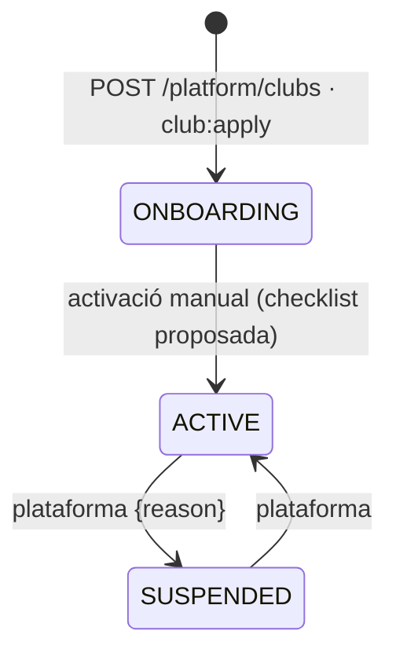
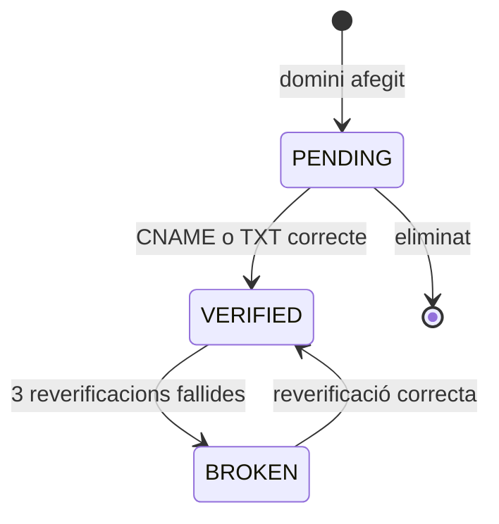

# S17 — Consola de clubs i onboarding («club-as-code» + consola AgilityHub)

**Etapa:** E0 (`club:apply` — club-as-code, seeds) · E10 (consola D19) · **Mòduls:** — (plataforma) · **Pantalles:** **D19 «Consola de clubs»** (nova, sense mockup: llista, fitxa amb pestanyes, assistent «Nou club») dins `apps/clubs-admin` amb rol de plataforma `AGILITYHUB_ADMIN`; `apps/id` per a l'entrada sense context de club · **Model:** PLATAFORMA §2 (CLUB), §1 (`Account.platformRoles`) · ADR-002/003/009/010/011/012 · VISIO §5–6 · **Estat:** esborrany (03-09-2026) · **Versió:** 0.1

## 1. Propòsit i abast

Resol **com neix i es governa un club** sense codi ni desplegament: (1) a E0, la definició d'un club en un fitxer (**club-as-code**) aplicable de manera idempotent (`club:apply`) — és com es crea el Cànic, el club «mínim» de tests i les demos; (2) a E10, la **consola** per a l'equip AgilityHub: crear clubs amb un assistent, mantenir identitat/localització/dominis/tema/mòduls/proveïdors de pagament/legal/paràmetres/catàlegs base/equip/estat, veure ús i processos, i accedir a l'auditoria de plataforma. Objectiu: **segon club operatiu en menys d'una hora** (VISIO §5).

| Fora d'abast | On viu |
|---|---|
| D11 (paràmetres pel club), `/branding`, `ClubConfig`, perfil de país | S02 |
| Catàlegs (contingut que es clona) | S05, S11 (plantilles de comunicat) |
| Identitat, OIDC, rols de plataforma al JWT | S01 |
| Facturació del SAAS als clubs, Stripe Connect, supressió de clubs | R4 (VISIO §6) |
| Selector de productes / canvi de context «estil Google» | S19 (R2) |

## 2. Pantalles i rutes

| Pantalla | App | Ruta | Rol | Comportament |
|---|---|---|---|---|
| Entrada | id → clubs-admin | `id.agilitydoghub.com` → `clubsadmin.agilitydoghub.com/consola` | AGILITYHUB_ADMIN | El host de producte (`clubsadmin.agilitydoghub.com`, sense àlies de club) resol **cap tenant** i només admet comptes amb `platformRoles ∋ AGILITYHUB_ADMIN` (token sense `clubId`, S01 R-01-17); la resta → «Aquest accés és només per a l'equip AgilityHub». |
| D19 Llista | clubs-admin | `/consola/clubs` | AGILITYHUB_ADMIN | Llistat universal: nom, slug, estat, país/fus, abonats actius, mòduls (xips), últim accés d'un admin, SMS del mes, emmagatzematge, checklist d'onboarding (n/7); [Nou club] → assistent; fila → fitxa. |
| D19 Fitxa | clubs-admin | `/consola/clubs/:id/{tab}` | AGILITYHUB_ADMIN | Pestanyes: **Identitat** · **Localització** (idiomes, `defaultLocale`, fus, moneda, perfil de país; canvis amb avís de conseqüències) · **Dominis** (taula host/app/estat; [Afegeix domini] → instruccions DNS (CNAME → `clubs.agilitydoghub.com` o TXT `_agilityhub-verify`) + [Verifica]) · **Tema** (editor de tokens amb previsualització en viu de la shell de `clubs` i `clubs-admin`, pujada de logos, mode; contrast AA validat) · **Mòduls** (commutadors amb dependències i text de què activa cadascun) · **Pagaments** (SEPA: creditor/IBAN/sufix/sèrie; Stripe: claus **només escriptura** («configurada · live · última prova OK 03-09»), [Prova la connexió]; manual: instruccions per idioma) · **Legal** (URL de privacitat, text d'imatge, versió de textos legals + [Publica una versió nova] amb política de re-consentiment) · **Paràmetres** (mateix component que D11 amb els `PLATFORM_ONLY` editables) · **Catàlegs base** ([Clona d'un club plantilla] amb selecció de què: nivells, pistes, modalitats/preus, FAQ, plantilles de comunicat; només sobre catàlegs buits) · **Equip** (admins del club: convida per email → compte + membresia ADMIN + enllaç màgic; retira; **admins de plataforma**) · **Processos** (S15: últimes execucions, interruptors, [Executa ara] amb simulació) · **Auditoria** (S14 plataforma + del club) · **Ús** (comptadors mensuals) · **Estat** (ONBOARDING/ACTIVE/SUSPENDED amb motiu; [Entra com a administrador del club] — suport, R-17-10). |
| D19 Assistent «Nou club» | clubs-admin | `/consola/clubs/nou` | AGILITYHUB_ADMIN | 8 passos: Identitat (nom, slug proposat, NIF, adreça, contacte) → Localització → Mòduls (preset «Complet» / «Mínim» / «Com el Cànic») → Pagaments (pot quedar «més tard») → Tema (preset AgilityHub o colors del club + logo) → Catàlegs base (plantilla) → Primer administrador (email + nom) → Revisió (mostra el fitxer club-as-code resultant) → [CREA EL CLUB] → `POST /platform/clubs` → fitxa amb la **checklist d'onboarding**. Es pot desar com a esborrany (local). |

## 3. Entitats i camps

`Club` (PLATAFORMA §2, S02 §3) amb els camps d'operació: `status`, `onboardingChecklist {dns, sepa, branding, templates, faq, legal, firstAdmin}` (calculada, R-17-06), `publicApiKeyHash`, `usage`, `template: bool` (club plantilla clonable, no operatiu), `notes` (internes de plataforma). `Account.platformRoles` (S01). **`ClubDefinition`** (fitxer, no col·lecció): esquema JSON publicat (`club-definition.schema.json`):

```yaml
apiVersion: agilityhub.club/v1
club: { slug: canic, name: Club Agility Cànic, legalName: …, taxId: …, address: {…}, contactEmail: …, websiteUrl: … }
localization: { locales: [ca, es], defaultLocale: ca, timeZone: Europe/Madrid, currency: EUR, countryProfile: ES }
domains: [ { host: app.agilitycanic.cat, app: clubs }, { host: admin.agilitycanic.cat, app: clubs-admin } ]
theme: { preset: null, colors: { primary: "#E26A2A", background: "#0B0B0B", … }, fontFamily: Montserrat, radius: 4, mode: dark, logo: { file: ./marca/logo.svg } }
modules: [FREE_TRAINING, BILLING, PACKS, ACTIVITIES, FAMILY_GROUP, WAITLIST, TASKS, FAQ, SMS, PUSH, INACTIVITY, COURSES, LEARN_LINK]
paymentProviders:
  SEPA_XML: { creditorName: …, creditorId: …, iban: { env: CANIC_SEPA_IBAN }, suffix: "000", invoiceSeriesPattern: "{YYYY}" }
  STRIPE: { secretKey: { env: CANIC_STRIPE_SK }, webhookSecret: { env: CANIC_STRIPE_WH }, publishableKey: pk_live_…, mode: live }
  MANUAL: { instructions: { ca: "…", es: "…" } }
legal: { privacyPolicyUrl: https://agilitycanic.cat/ca/politica-de-privacidad/, imageConsentText: { ca: "…" } }
parameters: { club.openingHours: {…}, club.holidays: [...], bookings.lateCancelThresholdMinutes: 120 }   # només overrides
catalogs: { levels: [...], rings: [...], plans: [...], prices: [...], faq: [...], messageTemplates: [...] }   # o `fromTemplate: club-template-default`
admins: [ { email: admin@exemple.cat, name: … } ]
```
Secrets **només** per referència a variables d'entorn (`{ env: NOM }`): el fitxer es pot versionar (al repo de l'API, `seeds/`).

## 4. Regles de negoci

| Regla | Enunciat | Exemple |
|---|---|---|
| **R-17-01 `club:apply` idempotent** | `club:apply <fitxer> [--dry-run] [--env staging]`: valida l'esquema i les dependències de mòduls, resol `env`, i fa **upsert** per `slug`: crea o actualitza `Club`, dominis, tema, mòduls, proveïdors, legal, overrides de paràmetres (només els llistats; els altres no es toquen), catàlegs (per `code`: crea o actualitza camps declarats; **mai** esborra ni desactiva el que no és al fitxer), admins (compte + membresia si no existeixen). Imprimeix un **diff** (abans/després per camp) i, amb `--dry-run`, no escriu. Reaplicar el mateix fitxer → diff buit. Tot auditat (`CLUB_UPDATED{source: APPLY}`) i emet `ClubCreated`/`ClubUpdated`/`ClubModulesChanged`/`ParameterChanged`. Producció: només des del runbook (`DEPLOY.md`), mai automàtic. | `club:apply seeds/club-canic.yaml --dry-run` → «+ 9 levels, + 5 rings, ~ 1 parameter». |
| **R-17-02 Slug i hosts únics** | `slug` immutable i únic (`409 SLUG_TAKEN`); `host` únic entre tots els clubs i apps (`409 HOST_ALREADY_USED`); els hosts de producte (`clubs.*`, `clubsadmin.*`, `id.*`, `core.*`) estan reservats (`422 HOST_RESERVED`). | — |
| **R-17-03 Verificació de dominis** | Domini nou → `PENDING`; `POST …/domains/{host}/verification` comprova (a) CNAME cap a `clubs.agilitydoghub.com`/`clubsadmin.…` **o** (b) TXT `_agilityhub-verify.{host} = agh-verify-{token}`; OK → `VERIFIED` (`verifiedAt`) i Caddy l'accepta (on-demand TLS amb `ask` a `GET /internal/domains/allowed?host=` del core). Fins a la verificació, `GET /branding` amb aquell host → `404 UNKNOWN_HOST`. Es reverifica setmanalment (S15 P9 opcional, §13); si falla 3 cops → `BROKEN` + avís a plataforma. | `app.agilitycanic.cat` CNAME → verificat en 2 min. |
| **R-17-04 Mòduls i dependències** | `PUT /platform/clubs/{id}/modules {modules[]}`: validació de dependències (`422 MODULE_DEPENDENCY{module, requires}`); desactivar no esborra dades (ADR-012); `ClubModulesChanged` + auditoria; la cache de `ClubConfig` s'invalida (S02). Presets: `COMPLET` (tots llevat `STATS`, `SOCIAL_LEAGUE`), `MINIM` (`WAITLIST`, `FAQ`, `PUSH`), `CANIC` (= Cànic). | Activar `PACKS` sense `BILLING` → 422. |
| **R-17-05 Proveïdors de pagament** | Escriptura de secrets: `PUT …/payment-providers/STRIPE {secretKey?, webhookSecret?, publishableKey, mode}` xifra (AES-256-GCM, clau del servidor `PLATFORM_KMS_KEY`, IV per registre) i **mai** els retorna (`configured`, `last4` del `publishableKey`, `mode`, `lastTestAt`); `POST …/payment-providers/stripe/test` crida `PaymentProvider.ping()` (llista 1 objecte amb la clau) → `200 {ok, accountName}` / `422 STRIPE_CONNECTION_FAILED`; SEPA: validació IBAN i format de creditor (`422 PROVIDER_CONFIG_INVALID`); `MANUAL`: instruccions amb `defaultLocale` obligatori. Auditoria sense valors. Retirar un proveïdor amb abonats que l'usen → `409 PROVIDER_IN_USE{count}`. | — |
| **R-17-06 Checklist d'onboarding** | Calculada a cada lectura: `dns` (tots els dominis `VERIFIED`), `sepa`/`stripe`/`manual` (≥ 1 proveïdor configurat si `BILLING`), `branding` (logo + colors ≠ preset), `templates` (plantilles de comunicat de tots els codis N-* amb `defaultLocale`), `faq` (≥ 1 entrada si `FAQ`), `legal` (`privacyPolicyUrl` present), `firstAdmin` (≥ 1 membresia ADMIN activa amb accés fet). `ONBOARDING → ACTIVE` es fa **manualment** ([Activa el club]) — mai automàtic — però la UI ho proposa quan la checklist és completa. | «5/7 · falten: dns, faq». |
| **R-17-07 Estat del club** | `ACTIVE → SUSPENDED {reason}`: logins de club rebutjats (`403 CLUB_SUSPENDED`, S01), `/branding.status`, processos saltats (S15), webhooks Stripe acceptats però no processats (cua), dominis actius; `SUSPENDED → ACTIVE` reprèn tot (cua processada). `ONBOARDING`: operatiu amb bàner. Tot auditat `CLUB_STATUS_CHANGED`. | — |
| **R-17-08 Clonatge de catàlegs** | `POST …/catalog-clone {fromClubId, parts[]}` només sobre parts **buides** del destí (`409 CATALOG_NOT_EMPTY{part}`); copia nivells, pistes (sense geometria), modalitats + preus vigents (moneda del destí ha de coincidir → `422 CURRENCY_MISMATCH`), FAQ i plantilles de comunicat amb els seus `LocalizedText` (només els idiomes del destí; si falta el `defaultLocale` del destí → es copia el del origen com a `defaultLocale` i s'avisa). Clubs `template: true` són l'origen habitual (`club-template-default` amb textos AgilityHub en ca/es/en). | — |
| **R-17-09 Equip** | `POST …/admins {email, name}` → `Account` (`getOrCreate`, `CONSOLE`) + `Membership {roles: [ADMIN]}` (sense abonat: `memberId = null` fins que el club el doni d'alta — excepció documentada a S03: un admin pot no ser abonat mentre el club s'inicia) + enllaç màgic `WELCOME` amb N-53 «Invitació com a administrador» (proposta §13). `DELETE` → membresia `SUSPENDED` (mai l'últim admin: `409 LAST_ADMIN`). Admins de plataforma: `PUT /platform/accounts/{id}/platform-roles` (mai retirar l'últim: `409 LAST_PLATFORM_ADMIN`); tot auditat. | — |
| **R-17-10 Accés de suport** | «Entra com a administrador del club»: `POST /platform/clubs/{id}/support-access` → `ImpersonationGrant` de tipus `SUPPORT` (S01, 60 min) que emet un token amb `clubId`, `roles: [ADMIN]`, `actorAccountId` (plataforma) i `support = true`; bàner persistent a `clubs-admin`; **totes** les accions auditades amb `origin = PLATFORM_SUPPORT`; no pot veure IBAN complets ni exportar dades personals (`403 SUPPORT_RESTRICTED`); el club veu els accessos de suport a la seva auditoria. Assumpció §13. | — |
| **R-17-11 Clau d'API pública** | `POST …/public-api-key` genera (`agh_pub_…`), mostra **un sol cop**, guarda el hash; rotació invalida l'anterior després de 24 h de solapament; S05/S07 la validen (`X-Api-Key`). | — |
| **R-17-12 Aïllament** | Un `AGILITYHUB_ADMIN` no llegeix dades personals de cap club des de la consola (només configuració i agregats: `usage`, recomptes); `/platform/audit-entries` mostra accions de plataforma i, per club, accions de configuració (no les d'abonats). Per operar dins d'un club cal membresia ADMIN o accés de suport (R-17-10). Rate limit i `SecurityEvent` a `/platform/*`. | — |
| **R-17-13 i18n** | La consola és en `ca/es/en` (`console` namespace); els `LocalizedText` s'editen per idioma del **club destí**; els presets de tema i el club plantilla porten textos en els tres idiomes. | — |

## 5. Estats i transicions





## 6. API

Tots amb rol `AGILITYHUB_ADMIN` (token sense context de club) llevat de `/internal/*` (xarxa interna, Caddy).

| Mètode | Ruta | Idem. | Descripció | Cos / paràmetres | Respostes i errors |
|---|---|---|---|---|---|
| GET | `/platform/clubs` | — | llistat universal | `x-filterable: status, countryProfile, module, template` | `200` |
| POST | `/platform/clubs` | sí | assistent (accepta `ClubDefinition`) | `ClubDefinition` sense secrets (o amb `env` refs) | `201 {club, checklist}` · `409 SLUG_TAKEN` / `HOST_ALREADY_USED` · `422 MODULE_DEPENDENCY` / `HOST_RESERVED` / `VALIDATION_ERROR` |
| GET · PATCH | `/platform/clubs/{id}` | `version` | fitxa (sense secrets) · identitat/localització/legal | | `200` · `409 STALE_VERSION` / `TIMEZONE_CHANGE_BLOCKED` |
| GET | `/platform/clubs/{id}/definition` | — | exporta el club-as-code actual (secrets com a `{env}` placeholders) | | `200 application/yaml` |
| POST · DELETE | `/platform/clubs/{id}/domains` · `…/domains/{host}` | sí | R-17-02 | `{host, app}` | `201` · `409 HOST_ALREADY_USED` · `422 HOST_RESERVED` |
| POST | `/platform/clubs/{id}/domains/{host}/verification` | sí | R-17-03 | — | `200 {status, checkedAt, method}` · `422 HOST_NOT_VERIFIED{details}` |
| PUT | `/platform/clubs/{id}/theme` | `version` | tokens + logos (`fileKey` via upload-url) | `Theme` | `200` · `422 THEME_CONTRAST` |
| PUT | `/platform/clubs/{id}/modules` | `version` | R-17-04 | `{modules[]}` o `{preset}` | `200` · `422 MODULE_DEPENDENCY` |
| PUT · DELETE | `/platform/clubs/{id}/payment-providers/{provider}` | `version` | R-17-05 | segons proveïdor | `200 {configured, masked}` · `422 PROVIDER_CONFIG_INVALID` · `409 PROVIDER_IN_USE` |
| POST | `/platform/clubs/{id}/payment-providers/stripe/test` | — | R-17-05 | — | `200 {ok, accountName, mode}` · `422 STRIPE_CONNECTION_FAILED` |
| PUT | `/platform/clubs/{id}/parameters/{key}` | `version` | com S02 però amb `PLATFORM_ONLY` | | `200` |
| POST | `/platform/clubs/{id}/catalog-clone` | sí | R-17-08 | `{fromClubId, parts: [LEVELS, RINGS, PLANS, FAQ, MESSAGE_TEMPLATES]}` | `200 {copied{}}` · `409 CATALOG_NOT_EMPTY` · `422 CURRENCY_MISMATCH` · `404 TEMPLATE_CLUB_NOT_FOUND` |
| GET · POST · DELETE | `/platform/clubs/{id}/admins` · `…/admins/{accountId}` | sí | R-17-09 | `{email, name}` | `201` · `409 LAST_ADMIN` / `MEMBERSHIP_EXISTS` |
| PUT | `/platform/clubs/{id}/status` | sí | R-17-07 | `{status, reason?}` | `200` · `409 INVALID_STATE` |
| POST | `/platform/clubs/{id}/support-access` | sí | R-17-10 | `{reason}` | `201 {token, expiresAt}` |
| POST | `/platform/clubs/{id}/public-api-key` | sí | R-17-11 | — | `201 {apiKey}` (un sol cop) |
| GET | `/platform/clubs/{id}/usage` · `/platform/clubs/{id}/checklist` | — | R-17-06 | `month?` | `200` |
| GET · PUT | `/platform/accounts/{id}/platform-roles` | — | R-17-09 | `{platformRoles[]}` | `200` · `409 LAST_PLATFORM_ADMIN` |
| GET | `/platform/club-templates` | — | clubs `template: true` | — | `200` |
| GET | `/platform/jobs*` (S15) · `/platform/audit-entries` · `/platform/security-events` (S14) · `/platform/parameter-catalog` (S02) · `/platform/courses` (S16) | — | delegats | | |
| GET | `/internal/domains/allowed?host=` | — | per a Caddy on-demand TLS (xarxa interna) | | `200` / `404` |
| CLI | `club:apply <fitxer> [--dry-run] [--env]` · `club:export <slug>` · `club:seed-demo <slug>` (cens fictici) | sí | R-17-01 | | diff/report |

## 7. Esdeveniments

**Emesos**: `ClubCreated{clubId, slug, source: CONSOLE · APPLY}` · `ClubUpdated{clubId, diff}` · `ClubModulesChanged` · `ClubStatusChanged{before, after, reason}` · `ParameterChanged` (via S02) · `MembershipChanged` (admins, via S01) · **nous (§13)**: `ClubDomainVerified{clubId, host}` · `ClubDomainBroken` · `PlatformRoleChanged{accountId, before, after}` · `ClubPaymentProviderChanged{clubId, provider, configured}` · `ClubApplied{slug, diffSummary, dryRun}` · `SupportAccessStarted{clubId, actorAccountId}`.

**Consumits**: cap (la consola escriu; S02 invalida cache; S15/S14 llegeixen).

## 8. Notificacions

| Codi | Moment | Públic → canals | Variables |
|---|---|---|---|
| N-53 Invitació com a administrador (proposta) | `POST …/admins` | compte convidat → EMAIL (SYSTEM) | `club_name`, `link`, `inviter_name` |
| N-43 Domini trencat (proposta) | `ClubDomainBroken` | admins de plataforma → EMAIL | `club_name`, `host` |

## 9. Paràmetres i mòduls

Escriu qualsevol paràmetre (`PLATFORM_ONLY` inclosos). Llegeix el catàleg de mòduls i les dependències. **Propostes (§13)**: `platform.domainRecheckDays` (7), `platform.supportAccessMinutes` (60). Sense mòduls propis.

## 10. i18n i localització

Namespace `console` (ca/es/en); l'assistent mostra els textos localitzats del club en pestanyes d'idioma del **club**; el club plantilla `club-template-default` porta catàlegs i plantilles en ca/es/en; presets de tema «AgilityHub» (fosc/clar).

## 11. Criteris d'acceptació i tests obligatoris

- T-17-01 (R-17-01) `club:apply` sobre BBDD buida crea el Cànic complet (`/branding`, catàlegs de S05, plantilles S11); reaplicar → diff buit i cap esdeveniment; `--dry-run` no escriu; fitxer amb mòdul sense dependència → error abans d'escriure; secret en clar al fitxer → rebutjat (`SECRET_IN_FILE`).
- T-17-02 (R-17-02) segon club amb el mateix `host` → `409`; host `clubs.agilitydoghub.com` → `422 HOST_RESERVED`.
- T-17-03 (R-17-03) verificació amb resolutor DNS doble: CNAME correcte → `VERIFIED` i `/internal/domains/allowed` → `200`; sense registre → `422`; `/branding` abans/després.
- T-17-04 (R-17-04) preset `MINIM`; `PACKS` sense `BILLING` → `422`; desactivar `FREE_TRAINING` no esborra `training_bookings` i `GET /training-slots` → `404 MODULE_DISABLED`.
- T-17-05 (R-17-05) claus Stripe xifrades (el document a Mongo no conté `sk_`); `GET` mai les retorna; `test` amb doble OK/KO; retirar `SEPA_XML` amb 3 abonats `SEPA_DD` → `409 PROVIDER_IN_USE`.
- T-17-06 (R-17-06/07) checklist calculada (7 casos); activació manual; `SUSPENDED` → login `403`, S15 salta, webhook encuat i processat en reactivar.
- T-17-07 (R-17-08) clonatge del club plantilla a un club buit amb `[ca]` només → textos `ca`, avís per `es`; sobre catàleg no buit → `409`.
- T-17-08 (R-17-09) invitació d'admin → compte + membresia + N-53; últim admin → `409 LAST_ADMIN`; últim admin de plataforma → `409 LAST_PLATFORM_ADMIN`.
- T-17-09 (R-17-10) accés de suport: token amb `support`, accions auditades `PLATFORM_SUPPORT`, `GET /members/{id}` retorna IBAN emmascarat, export → `403 SUPPORT_RESTRICTED`, caducitat 60 min.
- T-17-10 (R-17-12) `AGILITYHUB_ADMIN` sense membresia: `GET /members` amb host de club → `403 NO_MEMBERSHIP` (S01); `/platform/clubs/{id}` no conté dades d'abonats; `ADMIN` de club sobre `/platform/*` → `403`.
- T-17-11 (R-17-11) clau pública: es mostra un cop, `X-Api-Key` vàlida a `/public/*`, rotació amb 24 h de solapament.
- T-17-12 front: assistent de 8 passos crea un club i mostra la checklist; pestanya Tema amb previsualització; pestanya Dominis amb instruccions DNS; E2E «segon club en < 1 hora» com a guió manual documentat.

**Cobertura addicional (traçabilitat regla → test)**
- T-17-13 (R-17-07) `PUT …/status {SUSPENDED, reason}` → `/branding.status = SUSPENDED`, login del club → `403 CLUB_SUSPENDED`, `POST /webhooks/stripe/{clubId}` → `200` i esdeveniment encuat sense processar; `ACTIVE` → es processa; `ONBOARDING` → bàner als admins; transició `SUSPENDED → ONBOARDING` → `409 INVALID_STATE`.
- T-17-14 (R-17-13) consola en `es`/`en` sense claus absents; assistent amb pestanyes d'idioma del club destí (`[ca]` → només `ca`); club plantilla amb `LocalizedText` en `ca/es/en`.

## 12. Paquets de feina (per a fils d'IA en paral·lel)

| Paquet | Repo | Depèn de | Lliurable verificable |
|---|---|---|---|
| WP-17-A Club-as-code (E0) | `agilityhub-core-api/platform` | S02 WP-02-A, S05/S11 (esquemes de catàleg) | `club-definition.schema.json`, `club:apply/export/seed-demo`, seeds `club-canic`, `club-minim`, `club-template-default`; T-17-01, 02 |
| WP-17-B API de plataforma (E10) | `agilityhub-core-api/platform` | WP-17-A, S01 (platformRoles, support grant), S14 (audit) | endpoints de §6, xifratge de secrets, verificació DNS, `/internal/domains/allowed`, checklist; T-17-03…11 |
| WP-17-C Consola D19 (E10) | `agilityhub-core-web/apps/clubs-admin` | WP-17-B | llista, fitxa amb pestanyes, assistent, previsualització de tema; T-17-12 |
| WP-17-D Infra dominis (E10) | droplet (Caddy) + `DEPLOY.md` | WP-17-B | on-demand TLS amb `ask`, runbook «alta d'un domini de club» |

Ordre: A → B → C ∥ D. Fils: (1) A+B, (2) C, (3) D.

## 13. Dubtes oberts

| # | Dubte | Qui | Assumpció mentrestant |
|---|---|---|---|
| 1 | Accés de suport «Entra com a administrador del club»: el volem a R1? | Jordi | sí, amb restriccions (R-17-10) |
| 2 | Un admin convidat sense abonat (S03 diu «tots els admins són abonats») | Jordi/Josep | permès mentre `ONBOARDING`; D17 ho mostra com «sense fitxa d'abonat» |
| 3 | On-demand TLS de Caddy vs certificat wildcard + CNAME | Jordi (ops) | on-demand amb `ask` |
| 4 | Re-consentiment en publicar una versió nova dels textos legals | Jordi | avís a l'app, sense bloquejar (R4 si cal acceptació) |
| 5 | Clubs plantilla: qui els manté (textos AgilityHub en 3 idiomes) | Jordi | `club-template-default` al seed |

**Propostes**: paràmetres `platform.domainRecheckDays` (7), `platform.supportAccessMinutes` (60); esdeveniments `ClubDomainVerified`, `ClubDomainBroken`, `PlatformRoleChanged`, `ClubPaymentProviderChanged`, `ClubApplied`, `SupportAccessStarted`; notificacions N-53, N-43; errors `SLUG_TAKEN`, `HOST_ALREADY_USED`, `HOST_RESERVED`, `HOST_NOT_VERIFIED`, `THEME_CONTRAST`, `PROVIDER_CONFIG_INVALID`, `PROVIDER_IN_USE`, `STRIPE_CONNECTION_FAILED`, `CATALOG_NOT_EMPTY`, `TEMPLATE_CLUB_NOT_FOUND`, `LAST_ADMIN`, `LAST_PLATFORM_ADMIN`, `SUPPORT_RESTRICTED`, `SECRET_IN_FILE`; auditoria (S14): `CLUB_CREATED`, `CLUB_DOMAIN_CHANGED`, `CLUB_PAYMENT_PROVIDER_CHANGED`, `CLUB_ADMIN_INVITED`, `PLATFORM_ROLE_CHANGED`, `SUPPORT_ACCESS_STARTED`, `PUBLIC_API_KEY_ROTATED`; `Membership.memberId` opcional per a admins en onboarding (S01/S03).

## Canvis

- 03-09-2026 · v0.1 · esborrany inicial a partir de VISIO, PLATAFORMA §2, ADR-002/003/009/010/011/012 i les specs S02/S05/S11/S12/S14/S15.
- 03-09-2026 · catàleg tancat: «Invitació com a administrador» = **N-53**; «Domini trencat» = N-43.
