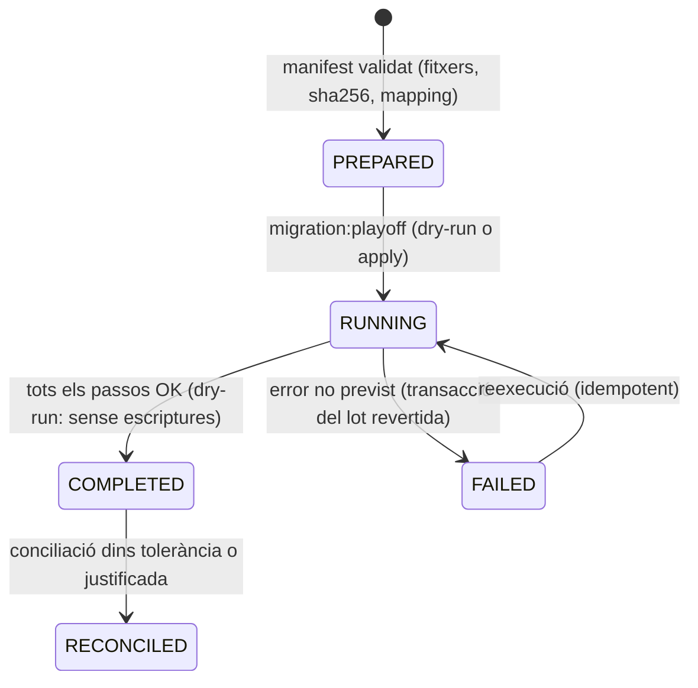

# S18 — Migració des de PlayOff Entidades (tanca ADR-008)

**Etapa:** E12 (tall i go-live) amb **assajos des d'E2** (tan bon punt existeixin `Member`/`Dog`) · **Mòduls:** — · **Pantalles:** cap (CLI + informes; opcional: pestanya «Importació» a la consola D19, S17) · **Model:** PLATAFORMA §0–§4, v1.6 §A/§D · Font: `01-analisi/AUDITORIA_PLAYOFF_ENTIDADES.md` (estructura, mai dades) · **Estat:** esborrany (03-09-2026) · **Versió:** 0.1

**Restriccions dures (CLAUDE.md):** la instància Playoff és **producció amb dades personals reals: només lectura**; **cap dada personal** en documents, informes ni staging (RGPD); la càrrega real només es fa a producció el dia del tall. Tots els exemples d'aquesta spec són ficticis.

## 1. Propòsit i abast

Resol com el cens, les modalitats, els mètodes de pagament, els historials mínims i els packs en curs del Cànic passen de Playoff al nou sistema **sense pèrdua de números d'abonat, sense duplicar persones i sense que ningú hagi de tornar a donar-se d'alta**: exports de Playoff (llistats CSV/Excel, lectura), **anonimitzador** per als assajos a staging, eina `migration:playoff` (mapatge configurable → validació → informe → càrrega idempotent), conciliació, pla de tall i marxa enrere. Els comptes AgilityHub es creen sense enviar cap correu durant la càrrega; la benvinguda va per lots el dia del go-live.

| Fora d'abast | On viu |
|---|---|
| Creació de comptes/membresies (mecanisme) | S01 (`AccountService.getOrCreate`) |
| Regles del cens, estats, documents | S03 |
| Numeració de rebuts, mandats, packs (regles) | S12 |
| Inactivitats/baixes vigents | S13 (aquí es creen els registres) |
| Plantilles de comunicat, FAQ, catàlegs | S05/S11 (seed, no migració) |
| Consola | S17 (pestanya opcional) |

## 2. Pantalles i rutes

Cap pantalla obligatòria. CLI al core API (`migration:*`) executada des del runbook. Opcional (E12 si hi ha temps): pestanya D19 «Importació» que mostra els `MigrationRun` i permet descarregar l'informe (`GET /platform/clubs/{id}/migrations`, `GET …/migrations/{runId}/report`).

## 3. Entitats i camps

### `MigrationRun` (`migration_runs`, `clubId`)
`source` (`PLAYOFF`), `mode` (`DRY_RUN` · `APPLY`), `env` (`STAGING` · `PRODUCTION`), `inputManifest {files[{name, sha256, rows}]}`, `mappingVersion`, `startedAt`, `finishedAt`, `status` (§5), `counters {members {created, updated, rejected, warnings}, dogs {…}, familyGroups, invoices, packBalances, inactivity, leaves, accounts}`, `reportFileKey` (S3 xifrat, `PRODUCTION` només), `byAccountId`.

### Marques a les entitats destí
`Member.sourceIds {playoffMemberId, playoffNumber}`, `Dog.sourceIds {playoffMemberId, playoffDogIndex}`, `FamilyGroup.sourceIds {playoffGroupId}`, `Invoice.sourceIds {playoffReceiptId}` + `kind = MIGRATED`, `PackBalance.sourceIds {playoffMemberId}`, `Account.createdSource = MIGRATION`. Índexs únics parcials per `sourceIds.*` → idempotència.

### `MappingConfig` (YAML versionat al repo, sense dades personals)
```yaml
version: 4          # 09-09-2026 · ajustat als tres exports reals del 07-09-2026 (vegeu MAPATGE_CAMPS_PLAYOFF.md)
normalize: { trim: true, collapseSpaces: true, caseInsensitive: true }   # «Abonat », «abonat » i «Abonat» són la mateixa clau
statuses: { Alta: ACTIVE, Baixa: LEFT }        # únics valors de l'export (llegat cast.: Baja/Simpatizante/Personal laboral/Bloqueado)

plans:   # «Tipologia» → Plan.code (S05); el comentari és el recompte real d'abonats d'alta el 07-09-2026
  "abonat":                { plan: ABONAT }                              # 96
  "familiar abonat":       { plan: ABONAT_FAMILIAR, familyGroup: true }  # 37
  "abonat 2 gossos":       { plan: ABONAT_FAMILIAR }                     # 14 (dogsIncluded 2)
  "manteniment":           { plan: TERAPIA }                             # 12 · la modalitat porta billingMode MAINTENANCE
  "pack 10 classes":       { plan: PACK10 }                              # 7
  "quota reduïda":         { plan: null, warn: PLAN_UNMAPPED }           # 4 · dubte B30
  "instructors":           { plan: INSTRUCTOR_FREE, role: INSTRUCTOR }   # 4 · quadra amb la llista d'accessos
  "familiar abonat/curs":  { plan: null, warn: PLAN_UNMAPPED }           # 3 · dubte B31
  "competició 1 gos":      { plan: COMPETICIO_1 }                        # 3 · cal crear-la al seed (preu pendent)
  "pack 6 classes":        { plan: PACK6 }                               # 2
  "*":                     { plan: null, warn: LEGACY_PLAN }             # tipologies antigues que només surten en baixes

levels:  # «Nivell» → Level.code; un associat pot tenir-ne dues files (nivell + marca)
  cadells: CADELLS
  a: A · b: B · c: C · d: D · e: E · f: F · g: G                          # 38·21·22·20·12·27·23
  pendent:   { level: PENDENT, warn: LEVEL_PENDING }                     # 6 · dubte B32
  llicencia: { flag: LICENSE_HOLDER }                                    # 58 · marca, no nivell (sempre amb D–G)
  terapies:  { flag: THERAPY }                                           # 1

columns:  # columna de la fitxa de soci → camp del model (taula completa a MAPATGE_CAMPS_PLAYOFF.md)
  memberBirthDate: { at: 11 }        # ⚠️ hi ha DUES columnes «Data naixement»: es llegeixen per POSICIÓ
  dogBirthDate:    { at: 41 }
  dogName: "Nom del gos" · dogSex: "Sexe del gos" · breed: "Raça del gos" · chip: "Numero de xip"
  handlerName: "Nom del guia"        # → Dog.handlerName (camp nou, Jordi 09-09)
  objectives:  "Objectius"           # → Dog.instructorNote
  photo: "Foto"                      # → Dog.photoFileKey (dubte B29)
  rsceLicense: "Llicencia RSCE" · fcagLicense: "Llicencia FCAG"
  rsceCategory: "Categoria RSCE" · grade: "Grau" · division: "Divisió"   # → licenses[].category/grade/division
  ignored: ["ID subcategoria", "Edat", "Estat civil", "Nacionalitat", "Web", "Adjunts", "Te clau"]

history: { receiptsMonths: 24, leaversSinceYears: 5, migrateFutureTrainingBookings: false, migrateActivities: false }
# 24 mesos i impagats confirmats pel Josep (08-09); a l'export no hi ha CAP impagat ni pendent (columnes 32-36 buides o 0 €)
# volum real: 1.436 fitxes = 184 altes + 1.252 baixes, de les quals 880 són del 2021 ençà (les que es migren)
```

## 4. Regles de negoci

| Regla | Enunciat | Exemple (fictici) |
|---|---|---|
| **R-18-01 Lectura i custòdia dels exports** | Exports des dels llistats de Playoff (socis complet amb camps personalitzats i mètode de pagament, grups familiars, rebuts dels últims `history.receiptsMonths`, remeses, «Control packs», categories, reserves futures si escau) en CSV/XLSX, fets per l'admin del club (lectura). Es guarden **xifrats** (age/gpg) en un volum fora del Dropbox i fora dels repos; es destrueixen `migration.exportRetentionDays` (30) després del go-live. Cap fitxer es puja a staging: staging només rep el **derivat anonimitzat**. | `socis-2026-10-30.xlsx.age` |
| **R-18-02 Anonimitzador** | `migration:anonymize <exports>` → fitxers amb la **mateixa estructura** i els mateixos casos límit (duplicats de DNI/email, IBAN absent o invàlid, multi-gos, grups familiars, baixes, packs a mig consumir, dates de naixement del gos al camp de la persona, cognom amb «(nom del gos)») però amb noms/DNI/emails/telèfons/IBAN/adreces generats (faker `es_ES`, DNI amb lletra vàlida, IBAN vàlid de test) i **un mapa determinista** (HMAC amb clau d'un sol ús) perquè les relacions entre fitxers es mantinguin. Cap dada real sobreviu al derivat (test T-18-03). | «Alòs Calvo (O'Neil)» → «Serra Vidal (Duna)». |
| **R-18-03 Ordre de càrrega** | 1 catàlegs (seed S05: nivells, modalitats, preus — **no** es migren, es comproven) → 2 grups familiars → 3 abonats (persona) → 4 gossos → 5 mètodes de pagament i mandats → 6 estats (baixes, inactivitats, bloquejos) → 7 rebuts històrics → 8 packs en curs → 9 comptes i membresies (sense correus) → 10 reserves futures (opcional) → informe. Cada pas dins d'una transacció per lots de 100; un error no previst atura el pas i el run queda `FAILED` (reexecutable). | — |
| **R-18-04 Persona i gos (desdoblament)** | La fitxa de Playoff = persona + **un** gos. Regla: (a) persona per **DNI normalitzat** (o email si no hi ha DNI): la primera fitxa (per data d'alta més antiga en `Alta`, després `Baja`) crea el `Member`; les altres fitxes del mateix DNI **no** creen persona: només el seu gos; (b) el gos es crea si `dogName` és informat; si no, **un gos inferit** amb nom «Gos de {nom}» i avís `DOG_INFERRED`; (c) cognom amb «(…)» → es neteja i, si `dogName` és buit, el text entre parèntesis és el nom del gos (`DOG_NAME_FROM_SURNAME`); (d) `birthDate` de la persona > avui − 10 anys amb `dogBirth` buit → sospita de data del gos: `birthDate` → null + avís `BIRTHDATE_SUSPECT`; (e) el nivell («Nivell» de la fitxa) va al **gos** (`Dog.levelId`); «Llicència»/«Teràpies» són marques (llicència per organisme amb número si els camps RSCE/FCAG estan informats; teràpia → avís per revisar la modalitat). | Dues fitxes «12345678Z»: la d'alta 2019 → Laura Serra + Duna; la de 2023 → només Rock. |
| **R-18-05 Número d'abonat** | `memberNumber` = número de Playoff dels d'`Alta` (**es conserva**); les fitxes de `Baja` sense número reben `null` (es numeraran si es readmeten, S04) — `Club.nextMemberNumber` = màxim + 1. Col·lisions (Playoff «Recalcular números» pot haver reassignat): la fitxa d'alta guanya; l'altra → avís `NUMBER_CONFLICT`. | — |
| **R-18-06 Estats** | `Alta` → `ACTIVE` (`joinedAt` = data d'alta de Playoff); `Baja` → `LEFT` (`leaveDate`/`leftAt` = data de baixa si existeix, si no data de l'export; `leftReason = MIGRATED`); `Bloqueado` → `ACTIVE` + `bookingBlock {reason: «migrat de Playoff: bloquejat»}`; `Simpatizante` → no es migra (llistat a l'informe); `Personal laboral` → `ACTIVE` + rol segons `mapping.plans` (instructors). Fitxes de `Baja` de fa més de `migration.leftMaxYears` (5) **no** es migren (RGPD: minimització) — només el seu número queda reservat. | — |
| **R-18-07 Modalitat, grup familiar i pagador** | «Tipologia» → `Plan` per `mapping.plans` (sense correspondència → `LEGACY_PLAN` i pla `null`: incidència a D6 fins que l'admin l'assigni); «Abonat 2/3 gossos» amb fitxes enllaçades per «Grupo familiar» → `FamilyGroup` amb `holderMemberId` = «qui paga els rebuts» de Playoff; sense grup explícit però dues fitxes del mateix DNI → la mateixa persona té dos gossos (no cal grup); grup de Playoff amb DNI diferents → `FamilyGroup` real. `nextInvoiceDate` = dia 1 del mes següent al tall (R-18-13). Preu = vigent del pla al tall (S05). | «Abonat 2 gossos» + grup {Laura, Joan Antoni} → grup familiar, titular Laura. |
| **R-18-08 Mètode de pagament i mandats** | Domiciliació → `paymentMethod.SEPA_DD {iban, holderName, holderTaxId}`; IBAN invàlid (mod-97) → `iban = null` + avís `IBAN_INVALID` («Compte no informat»); titular buit → nom de l'abonat. **Referència de mandat** (resolt Josep 08-09: Playoff **no** exporta mandats): es genera un `mandateRef` nou per a tothom, `{clubSlug}-{memberNumber}-1`, amb `mandateSignedAt` = **data del tall** (no la d'alta: és quan el club comunica els mandats nous), i totes les remeses van **`RCUR`** (`billing.sepa.useFrst = false`, Josep 08-09) amb comunicació prèvia al banc. La branca «mandat exportat» es conserva al codi per a altres clubs. Efectiu/transferència → `MANUAL`; targeta (Redsys/Playoff Pay) → `MANUAL` + avís `CARD_NOT_MIGRATED` (l'abonat haurà de tornar a donar la targeta a Stripe si el club activa `STRIPE`). | — |
| **R-18-09 Rebuts històrics** | Últims `history.receiptsMonths` (24) rebuts → `Invoice {kind: MIGRATED, series: "PLAYOFF", number: original, displayNumber: original, period: del concepte («Febrer 2026 …») o de la data, total, status: Pagado → PAID · Pendiente/Vencido → PENDING · Impagado → FAILED, paymentMethod segons el rebut, lines: [{origin: MIGRATED, description: concepte original, total}]}` sense línies detallades ni impostos desglossats (si l'export els porta, es guarden). Serveixen per a la fitxa D10 i l'export comptable; **no** entren a cap remesa. La numeració nova comença a `{YYYY}-0001` (S12) — sèrie diferent, sense col·lisió (§13). | «2026-0871 · Quota Abonat — Agost 2026 · 60 € · impagat» → `FAILED`. |
| **R-18-10 Packs en curs** | «Control packs» → `PackBalance {planId (Pack 6/10), sessionsTotal, consumed, openedOn (data de compra), expiresOn = openedOn + validityMonths − 1 dia, state: ACTIVE si expiresOn ≥ tall i remaining > 0}` per **gos** (si la fitxa té un sol gos; amb més d'un → avís `PACK_DOG_AMBIGUOUS` i s'assigna al primer, revisable des de D10 amb un ajust). Moviment inicial `OPEN` amb `reason: MIGRATED`. | Pack 10 comprat 12-06, 6 consumides → `remaining 4`, caduca 11-11. |
| **R-18-11b Qualitat de dades de l'export real** (mesurada el 07-09-2026 sobre les 184 altes; `MAPATGE_CAMPS_PLAYOFF.md` §6) | L'importador **no rebutja mai** una fitxa per aquests motius: hi posa un avís i continua. (a) **26 domiciliacions sense IBAN** → `NO_BANK_ACCOUNT`: `iban = null`, l'abonat queda fora de la primera remesa i surt a la llista d'incidències de D6. (b) **16 gossos sense xip** → `CHIP_MISSING`: el camp es carrega buit tot i ser obligatori a l'alta nova; D15 té el filtre per reclamar-los. (c) **7 altes sense email** → membre sense `Account` (R-18-12) fins que el club l'aconsegueixi. (d) **~20 altes comparteixen l'email amb un altre abonat**: un `Account` per adreça → el primer (per data d'alta) es queda l'adreça i la resta es migren **sense compte** amb `EMAIL_SHARED` i proposta de grup familiar per revisar (dubte B33). (e) **2 altes amb edat per sota del mínim** (0 i 11 anys): la validació d'edat de l'alta pública **no s'aplica als migrats** → `AGE_SUSPECT`. (f) 9 sense telèfon i 8–10 sense adreça completa → s'accepten amb avís. (g) claus de categoria amb majúscules i espais irregulars → `mapping.normalize` (trim + espais + minúscules) abans de buscar-les. | 26 sense IBAN, 16 sense xip, 20 emails compartits → l'informe els llista per número d'abonat perquè el club els completi abans del tall. |
| **R-18-11 Inactivitats, baixes previstes i bloquejos** | Si Playoff té una data de baixa futura → `Member.leaveDate` + `LeaveRequest {APPROVED, source: MIGRATED}`; «Manteniment» amb període conegut → `InactivityPeriod {ACTIVE}` només si el club aporta la llista (fitxer auxiliar `inactivitats.csv` amb número d'abonat i mesos; opcional). | — |
| **R-18-12 Comptes i membresies** | Per a cada `Member` amb email vàlid: `Account` (`getOrCreate`, `MIGRATION`, `locale = ca`, sense contrasenya) + `Membership {roles}` (MEMBER; + INSTRUCTOR/ADMIN segons la llista que aporta el Josep: `equip.csv` amb número d'abonat i rol). **Cap correu** durant la càrrega. Sense email → sense compte, llistat «Abonats sense correu» per al club (S03 «Reenvia accés» quan el tinguin). Email duplicat entre persones diferents (mare i fill) → el compte és de la primera; l'altra queda sense compte + avís `EMAIL_SHARED`. Consentiments: `consents[] = [{type: PRIVACY, version: LEGACY, acceptedAt: joinedAt, source: MIGRATED}, {type: IMAGE, granted: «drets d'imatge» de Playoff}]`; a la primera entrada l'app demana acceptar la política vigent (bàner, sense bloquejar — §13). | — |
| **R-18-13 Dates de facturació al tall** | El tall es fa **després** de l'última remesa de Playoff del mes `M` i **abans** de generar la primera del nou sistema: `nextInvoiceDate = 01 de M+1` per a tots els `ACTIVE` amb pla mensual (packs: sense). Informe de conciliació: suma prevista del mes `M+1` (nou simulador, S12) vs «Informe de previsión» de Playoff per a `M+1`: diferència ≤ `migration.reconciliationTolerancePct` (1 %) o justificació línia a línia. | Playoff preveu 6.760 € per a novembre; simulació nova 6.700 € → 1 abonat sense pla (`LEGACY_PLAN`) explica la diferència. |
| **R-18-14 Idempotència i reexecució** | Tot destí porta `sourceIds`; una reexecució **actualitza** (camps del mapatge) i mai duplica; els registres creats manualment després de la càrrega (sense `sourceIds`) no es toquen; `--reset` (només staging) esborra el club i torna a aplicar el seed. A producció només s'admet **una** càrrega `APPLY` (`409 MIGRATION_ALREADY_APPLIED`) llevat de `--allow-reapply` amb confirmació escrita al runbook. | — |
| **R-18-15 Informe** | Per run: recomptes per entitat i estat, **rebutjos** (fila d'origen per `playoffMemberId`, codi, motiu), **avisos** (codis de R-18-04…12), llistes per al club (sense correu, `LEGACY_PLAN`, `IBAN_INVALID`, `CARD_NOT_MIGRATED`, `PACK_DOG_AMBIGUOUS`, `NUMBER_CONFLICT`), conciliació (R-18-13) i **cap dada personal** en staging (només ids); a producció, el `report.xlsx` amb noms es guarda xifrat a S3 i és descarregable només per `AGILITYHUB_ADMIN`/ADMIN del club (S17), esborrat als 30 dies. | — |
| **R-18-16 Benvinguda per lots** | `migration:welcome --club canic --batch 50 --interval 60s [--only-numbers …]` el dia del go-live: N-02 variant `MIGRATED` («Ja pots entrar a la nova app del Cànic amb el teu correu») amb enllaç `WELCOME` (7 dies; caducat → «Envia-me'n un de nou» a 01). Idempotent (`Account.welcomeSentAt`). Els instructors/admins primer (lot 0). | — |
| **R-18-17 Tall i marxa enrere** | Runbook (§12 WP-18-E): D-7 assaig complet a staging amb dades anonimitzades (Josep revisa 20 fitxes); D-1 Playoff en **lectura** (avís al club: cap alta ni canvi); D0 export final → `migration:playoff --apply --env production` → conciliació → obrir DNS/app → `migration:welcome`; D+1..+7 suport; Playoff es manté **consultable** `migration.playoffReadOnlyMonths` (3) com a marxa enrere de consulta; marxa enrere tècnica abans d'obrir: `--reset` de producció **només** si no hi ha cap dada nova (comptador d'escriptures post-càrrega = 0). | — |

## 5. Estats i transicions



## 6. API

| Mètode / CLI | Ruta / comanda | Rol | Descripció | Resposta |
|---|---|---|---|---|
| CLI | `migration:anonymize <dir-exports> --out <dir> --key <clau>` | ops | R-18-02 | fitxers anonimitzats + resum |
| CLI | `migration:playoff --club <slug> --in <dir> --mapping <yaml> [--dry-run] [--env staging|production] [--steps 1-10] [--reset]` | ops | R-18-03…15 | `MigrationRun` + `report` |
| CLI | `migration:welcome --club <slug> --batch 50 --interval 60s [--only-numbers]` | ops | R-18-16 | recompte enviats/omesos |
| GET | `/platform/clubs/{id}/migrations` · `…/migrations/{runId}/report` | AGILITYHUB_ADMIN · ADMIN del club | opcional (D19) | `200` · fitxer |

Errors del CLI (codi de sortida ≠ 0): `MAPPING_INVALID`, `INPUT_SCHEMA_MISMATCH{file, missingColumns}`, `MIGRATION_ALREADY_APPLIED`, `PRODUCTION_REQUIRES_CONFIRMATION`, `CLUB_NOT_EMPTY` (apply sobre un club amb dades sense `sourceIds`).

## 7. Esdeveniments

**Emesos**: `MigrationRunStarted{runId, mode, env}` · `MigrationRunCompleted{runId, counters}` · `MigrationRunFailed{runId, step, error}` (nous, §13) · els de domini **no** s'emeten per registre (evitar 1.000 notificacions): la càrrega escriu directament amb `origin = MIGRATION` i **un sol** `AuditEntry MIGRATION_APPLIED{runId, counters}`; excepció: `AccountCreated{source: MIGRATION}` sí (S01 ho necessita per a estadístiques). **Consumits**: cap.

## 8. Notificacions

| Codi | Moment | Públic → canals | Variables |
|---|---|---|---|
| N-02 (variant `MIGRATED`, proposta) | `migration:welcome` | MEMBER → EMAIL | `member_first_name`, `gender`, `club_name`, `link` |
| N-27 | S03 «Reenvia accés» per als que arriben sense correu | MEMBER → EMAIL | `link` |

## 9. Paràmetres i mòduls

Propostes (bloc sistema): `migration.exportRetentionDays` (30), `migration.leftMaxYears` (5), `migration.reconciliationTolerancePct` (1), `migration.playoffReadOnlyMonths` (3), `history.receiptsMonths` (a `MappingConfig`, 24). Mòduls: si `PACKS` off → pas 8 omès; `INACTIVITY` off → pas 6 sense inactivitats; `BILLING` off → passos 5/7 omesos.

## 10. i18n i localització

Descripcions dels rebuts migrats es conserven tal qual (castellà/català de Playoff) — no es tradueixen; `Account.locale = ca` per a tothom (canviable a 12); informe en català; dates de Playoff en `Europe/Madrid`.

## 11. Criteris d'acceptació i tests obligatoris

- T-18-01 (R-18-04) fixtures anonimitzades amb 6 casos: persona amb 2 fitxes → 1 `Member` + 2 `Dog`; cognom «(Duna)» → nom del gos; `dogName` buit → `DOG_INFERRED`; `birthDate` sospitosa → null + avís; nivell al gos; llicències RSCE/FCAG amb número.
- T-18-02 (R-18-05/06) números conservats; col·lisió → l'alta guanya + `NUMBER_CONFLICT`; `Baja` de fa 6 anys → no migrat però número reservat; `Bloqueado` → `bookingBlock`.
- T-18-03 (R-18-02) l'anonimitzador no deixa cap valor original (test amb un export sintètic «real» de 50 files: cap coincidència de DNI/email/IBAN/nom entre entrada i sortida; estructura idèntica; relacions preservades via HMAC).
- T-18-04 (R-18-07/08) «Abonat 2 gossos» amb grup → `FamilyGroup` amb titular = pagador; IBAN invàlid → `iban null`; mandat migrat → `RCUR`; sense mandat → `mandateRef` nou + avís; targeta → `MANUAL` + `CARD_NOT_MIGRATED`.
- T-18-05 (R-18-09/10) rebuts → `Invoice MIGRATED` amb sèrie `PLAYOFF`, estats mapejats; cap col·lisió amb la sèrie nova; pack 10 amb 6 consumides → `remaining 4`, caducitat calculada; 2 gossos → `PACK_DOG_AMBIGUOUS`.
- T-18-06 (R-18-12) comptes sense correu enviat (doble d'email amb 0 crides); email compartit → un compte + `EMAIL_SHARED`; rols des d'`equip.csv`; consentiments `LEGACY`.
- T-18-07 (R-18-13/15) conciliació: simulació S12 de `M+1` vs previsió (fitxer fictici) dins de l'1 %; informe de staging sense cap nom/email (grep de patrons).
- T-18-08 (R-18-14) reexecució → 0 creats, n actualitzats; registre manual posterior intacte; `APPLY` a producció dues vegades → `MIGRATION_ALREADY_APPLIED`.
- T-18-09 (R-18-16) `migration:welcome` per lots: 50 correus/lot, idempotent, instructors primer, enllaç de 7 dies.
- T-18-10 tenant: tot amb el `clubId` del club destí; un segon club a la mateixa BBDD no es toca.
- T-18-11 rendiment: 400 fitxes + 4.000 rebuts + 300 packs en < 2 min en staging.

**Cobertura addicional (traçabilitat regla → test)**
- T-18-12 (R-18-01) els exports no es poden llegir sense la clau (`age`); el directori d'exports és fora del repo i del Dropbox (test de ruta) i `migration:playoff` rebutja un `--in` dins d'un repo git.
- T-18-13 (R-18-03) l'ordre dels passos es respecta (un gos abans del seu abonat → `INPUT_SCHEMA_MISMATCH` de referència); `--steps 1-3` no toca rebuts ni packs; un error al pas 4 deixa els lots anteriors commitats i el run `FAILED` reexecutable.
- T-18-14 (R-18-06, R-18-08) `Baja` amb data → `LEFT{leaveDate}`; `Simpatizante` → llistat i no migrat; `Bloqueado` → `bookingBlock` amb motiu «migrat de Playoff: bloquejat»; targeta Redsys → `MANUAL` + `CARD_NOT_MIGRATED`; mandat exportat → `mandateRef` conservat i seqüència `RCUR`.
- T-18-15 (R-18-10, R-18-11) pack amb `expiresOn < tall` → `EXPIRED` (no `ACTIVE`); `inactivitats.csv` → `InactivityPeriod ACTIVE` amb mesos correctes; data de baixa futura → `LeaveRequest APPROVED{MIGRATED}` + `leaveDate`.
- T-18-16 (R-18-15, R-18-17) l'informe de staging conté només ids i codis (grep negatiu de patrons d'email, DNI i IBAN sobre el fitxer); a producció, `report.xlsx` xifrat a S3 amb URL signada només per a ADMIN/AGILITYHUB_ADMIN; `--apply --env production` sense dades noves post-càrrega permet `--reset`; amb una escriptura posterior (comptador > 0) → rebutjat; Playoff en lectura simulat: el runbook té checklist D-7/D-1/D0/D+7 amb responsable per pas (test documental).

## 12. Paquets de feina (per a fils d'IA en paral·lel)

| Paquet | Repo | Depèn de | Lliurable verificable |
|---|---|---|---|
| WP-18-A Exports i mapatge (E2) | docs + `agilityhub-core-api/migration` | accés de lectura a Playoff (Josep), S05 seed | inventari de columnes reals de cada export (només noms de columna), `MappingConfig` v1, esquema d'entrada, `migration:anonymize`; T-18-03 |
| WP-18-B Importador de cens (E2–E3) | `agilityhub-core-api/migration` | WP-18-A, S03, S01 | passos 1–6 i 9 amb `--dry-run` sobre fixtures; T-18-01, 02, 04, 06, 08, 10 |
| WP-18-C Importador de facturació (E8) | `agilityhub-core-api/migration` | WP-18-B, S12, S13 | passos 7–8 + conciliació; T-18-05, 07 |
| WP-18-D Assaig a staging (E11) | staging | WP-18-C, dades anonimitzades | run complet, revisió de 20 fitxes amb el Josep, informe, T-18-11 |
| WP-18-E Tall (E12) | runbook `DEPLOY.md` + producció | WP-18-D | checklist D-7/D-1/D0/D+7, `migration:welcome`, marxa enrere documentada; **ADR-008 tancat** amb el resum de §13 |

Ordre: A → B → C → D → E. Fils: (1) A+B, (2) C (quan S12 existeixi).

## 13. Dubtes oberts

| # | Dubte | Qui | Assumpció mentrestant |
|---|---|---|---|
| 1 | Quines «Tipologies» de Playoff segueixen vives (Competició, Abonat Plus, Familiar…) i quina modalitat nova els correspon | Josep | mapatge de §3; les no mapejades → `LEGACY_PLAN` |
| 2 | ~~Playoff exporta la referència i la data del mandat SEPA?~~ **Resolt (Josep 08-09): no; mandats nous per a tothom** i tot `RCUR` (el banc ho accepta), amb comunicació al banc. | — | — |
| 3 | Rebuts històrics: 24 mesos són suficients? Cal importar els impagats pendents com a `FAILED`? | Josep/comptabilitat | 24 mesos; impagats → `FAILED` |
| 4 | Re-consentiment de la política de privacitat a la primera entrada: bàner o bloqueig? | Jordi (legal) | bàner sense bloqueig |
| 5 | Reserves d'entrenament futures i inscripcions a classes de la setmana del tall | Josep | no es migren; el tall es fa en diumenge abans de les 20:00 amb la setmana nova generada al nou sistema |
| 6 | Baixes antigues (> 5 anys): no migrar (RGPD) | Jordi | no es migren |
| 7 | Sèrie `PLAYOFF` per als rebuts migrats vs continuar la numeració | comptabilitat | sèrie separada |

**Propostes**: paràmetres `migration.*` (§9); esdeveniments `MigrationRunStarted/Completed/Failed`; N-02 variant `MIGRATED`; `Member.sourceIds`, `Dog.sourceIds`, `FamilyGroup.sourceIds`, `Invoice.sourceIds` + `kind = MIGRATED`, `PackBalance.sourceIds`, `Account.welcomeSentAt`, `Member.leftReason = MIGRATED`, `consents[].version = LEGACY`; auditoria `MIGRATION_APPLIED`; errors del CLI de §6.

**ADR-008 — resum de decisió (per copiar a `04-arquitectura/decisions/ADR-008-migracio-playoff.md`)**: *Estratègia*: exports de llistats de Playoff en lectura → anonimització determinista per als assajos → eina pròpia `migration:playoff` (mapatge YAML versionat, validació, informe, càrrega idempotent per `sourceIds`) → conciliació amb l'«Informe de previsión» → tall en un diumenge abans de les 20:00 amb Playoff en lectura i benvingudes per lots. *Descartat*: importadors genèrics CSV del backoffice (no resolen el desdoblament persona/gos) i migració «viva» amb doble escriptura (Playoff és només lectura). *Conseqüències*: números d'abonat conservats, sèrie `PLAYOFF` per a l'històric, mandats migrats o `FRST`, cap dada real fora de producció.

## Canvis

- 03-09-2026 · v0.1 · esborrany inicial a partir de l'auditoria de Playoff (estructura), PLATAFORMA §0–§4 i les specs S01/S03/S04/S05/S12/S13.
- 05-09-2026 · §13-4 resolt (Jordi): el primer accés d'un abonat migrat mostra la pantalla **«Completa el teu perfil»** amb la casella obligatòria de la política de privacitat (S01 §14), no un bàner; `Account.onboardingPending = true` per a tots els comptes creats per la migració.
- 08-09-2026 · respostes del Josep (B6, B7, B8, B9): Playoff **no** exporta mandats → mandats nous per a tothom amb `mandateSignedAt` = data del tall i tot `RCUR` · mapatge de tipologies a partir de l'Excel del Josep (fora del Dropbox) · 24 mesos de rebuts i cap impagat pendent · tall en diumenge abans de les 20:00 confirmat.
- 09-09-2026 · exports reals del 07-09 (Jordi): `MappingConfig` v4 amb les tipologies i els nivells vius i els seus recomptes, normalització de claus, lectura per posició de les dues columnes «Data naixement», columnes noves (`Nom del guia` → `Dog.handlerName`, `Objectius`, `Foto`, `Categoria RSCE`/`Divisió`) i **R-18-11b** amb les incidències reals (26 sense IBAN, 16 sense xip, 20 emails compartits, 2 edats sospitoses). Taula completa a `MAPATGE_CAMPS_PLAYOFF.md`.
